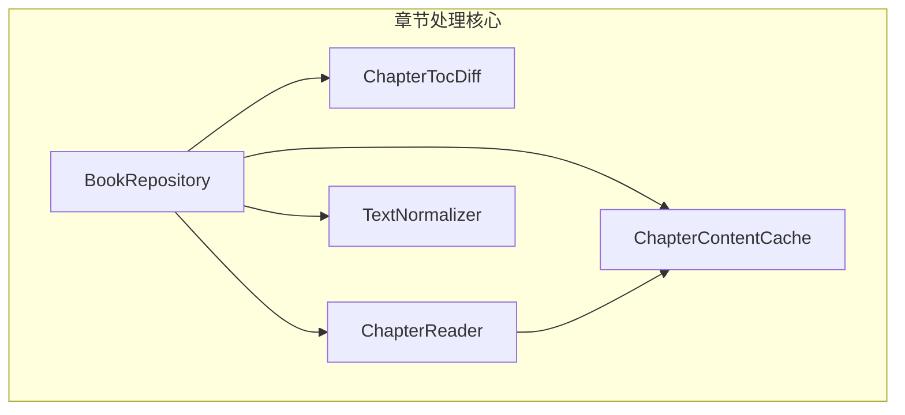
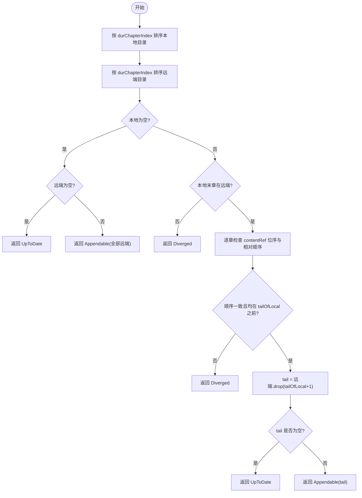
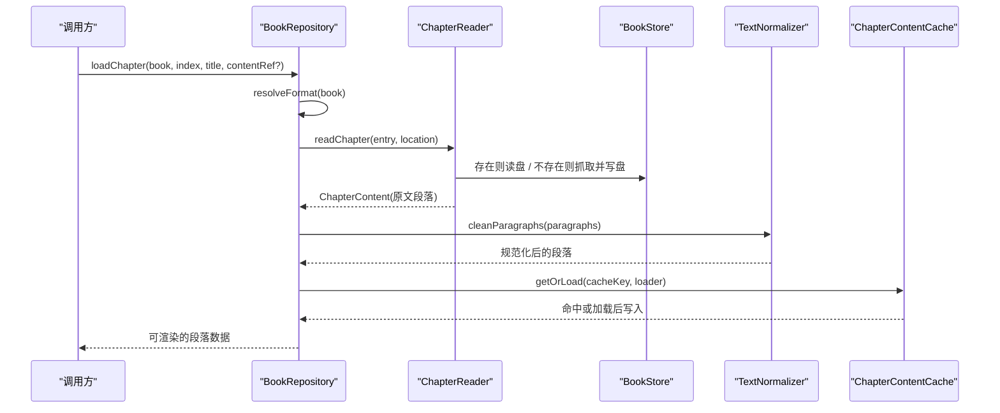
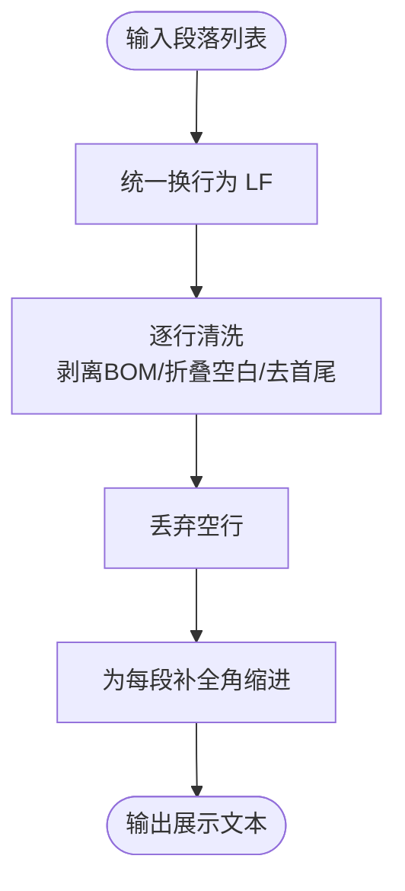
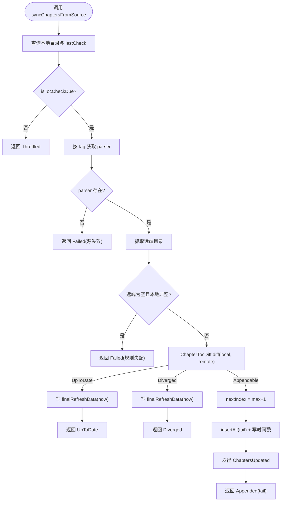
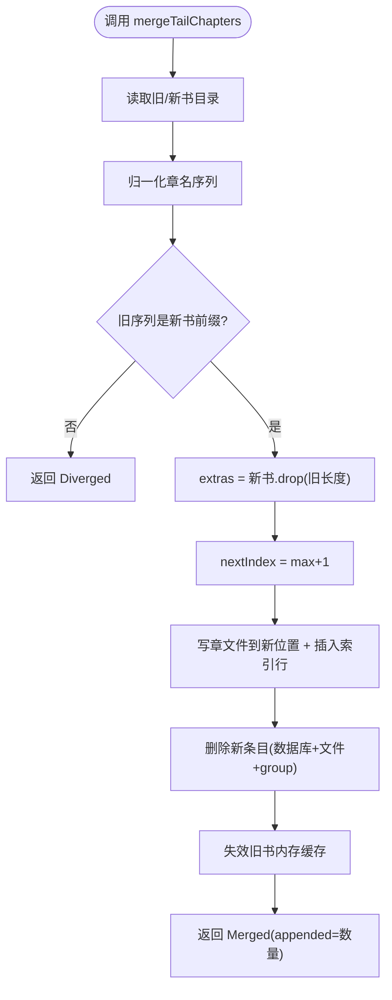
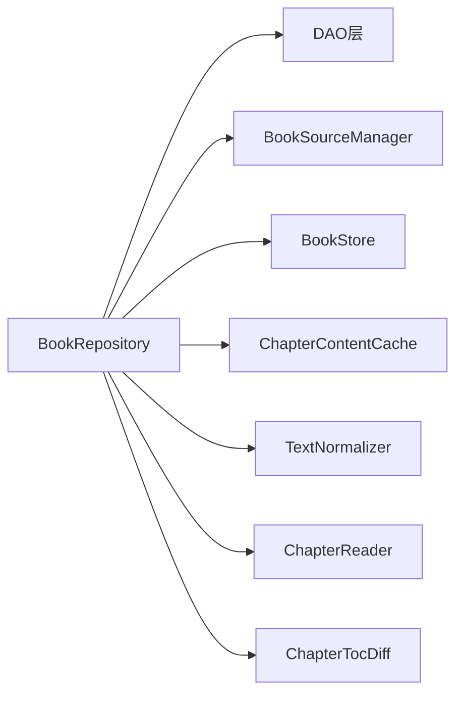

# 章节处理

<cite>
**本文引用的文件**
- [ChapterTocDiff.kt](file://lib_book_common/src/main/java/com/ebook/common/repository/ChapterTocDiff.kt)
- [BookRepository.kt](file://lib_book_common/src/main/java/com/ebook/common/repository/BookRepository.kt)
- [ChapterReader.kt](file://lib_book_common/src/main/java/com/ebook/common/analyze/local/ChapterReader.kt)
- [TextNormalizer.kt](file://lib_book_common/src/main/java/com/ebook/common/text/TextNormalizer.kt)
- [ChapterContentCache.kt](file://lib_book_common/src/main/java/com/ebook/common/store/ChapterContentCache.kt)
- [ChapterTocDiffTest.kt](file://lib_book_common/src/test/java/com/ebook/common/repository/ChapterTocDiffTest.kt)
- [TextNormalizerTest.kt](file://lib_book_common/src/test/java/com/ebook/common/text/TextNormalizerTest.kt)
</cite>

## 目录
1. [引言](#引言)
2. [项目结构](#项目结构)
3. [核心组件](#核心组件)
4. [架构总览](#架构总览)
5. [详细组件分析](#详细组件分析)
6. [依赖分析](#依赖分析)
7. [性能考量](#性能考量)
8. [故障排查指南](#故障排查指南)
9. [结论](#结论)
10. [附录：实践示例与最佳实践](#附录实践示例与最佳实践)

## 引言
本章文档聚焦“章节处理”这一关键链路，覆盖目录比对、重抓追加、正文读取与规范化、缓存与存储优化、以及本地导入时的智能合并。目标是帮助读者在不深入源码的情况下理解系统如何处理章节的增量更新、如何保证序号与内容严格对齐、如何在多格式下统一读取与展示。

## 项目结构
本节给出与章节处理相关的代码位置与职责划分：
- lib_book_common/repository：章节目录比对（ChapterTocDiff）与书架仓库（BookRepository），负责重抓、限频、事件与事务边界
- lib_book_common/analyze/local：章节读取接口（ChapterReader），定义跨本地/网络统一的读章语义
- lib_book_common/text：文本规范化（TextNormalizer），统一段落清洗与展示缩进
- lib_book_common/store：内存缓存（ChapterContentCache），按 contentRef 缓存当前及前后章，降低重复 I/O
- 测试位于 lib_book_common/src/test，锁定不变式与边界形态



**图表来源**
- [BookRepository.kt:434-490](file://lib_book_common/src/main/java/com/ebook/common/repository/BookRepository.kt#L434-L490)
- [ChapterTocDiff.kt:41-98](file://lib_book_common/src/main/java/com/ebook/common/repository/ChapterTocDiff.kt#L41-L98)
- [ChapterReader.kt:1-20](file://lib_book_common/src/main/java/com/ebook/common/analyze/local/ChapterReader.kt#L1-L20)
- [TextNormalizer.kt:18-101](file://lib_book_common/src/main/java/com/ebook/common/text/TextNormalizer.kt#L18-L101)
- [ChapterContentCache.kt:25-63](file://lib_book_common/src/main/java/com/ebook/common/store/ChapterContentCache.kt#L25-L63)

**章节来源**
- [BookRepository.kt:434-490](file://lib_book_common/src/main/java/com/ebook/common/repository/BookRepository.kt#L434-L490)
- [ChapterTocDiff.kt:41-98](file://lib_book_common/src/main/java/com/ebook/common/repository/ChapterTocDiff.kt#L41-L98)
- [ChapterReader.kt:1-20](file://lib_book_common/src/main/java/com/ebook/common/analyze/local/ChapterReader.kt#L1-L20)
- [TextNormalizer.kt:18-101](file://lib_book_common/src/main/java/com/ebook/common/text/TextNormalizer.kt#L18-L101)
- [ChapterContentCache.kt:25-63](file://lib_book_common/src/main/java/com/ebook/common/store/ChapterContentCache.kt#L25-L63)

## 核心组件
- ChapterTocDiff：纯函数，负责远端与本地目录的比对，输出三种结局（UpToDate/Diverged/Appendable）。以 contentRef 为定位键，避免章节名漂移导致误判；对相对顺序进行严格校验，确保只追加尾部新章。
- BookRepository：统一读取管线（loadChapter）、目录重抓（syncChaptersFromSource）、单章刷新（refreshChapter）、缓存状态检测（getCachedChapterIndices）、智能合并（mergeTailChapters）。
- ChapterReader：章节正文读取的最小接缝，屏蔽本地书与网络书的差异。
- TextNormalizer：文本规范化唯一入口，统一换行、空白折叠、BOM 剥离、段落清洗与展示缩进。
- ChapterContentCache：基于 contentRef 的 LRU 内存缓存，容量默认 3（当前章 + 前后各一），支持按 bookId 片段失效。

**章节来源**
- [ChapterTocDiff.kt:41-98](file://lib_book_common/src/main/java/com/ebook/common/repository/ChapterTocDiff.kt#L41-L98)
- [BookRepository.kt:434-490](file://lib_book_common/src/main/java/com/ebook/common/repository/BookRepository.kt#L434-L490)
- [ChapterReader.kt:1-20](file://lib_book_common/src/main/java/com/ebook/common/analyze/local/ChapterReader.kt#L1-L20)
- [TextNormalizer.kt:18-101](file://lib_book_common/src/main/java/com/ebook/common/text/TextNormalizer.kt#L18-L101)
- [ChapterContentCache.kt:25-63](file://lib_book_common/src/main/java/com/ebook/common/store/ChapterContentCache.kt#L25-L63)

## 架构总览
章节处理从“目录重抓 → 比对 → 追加”和“正文读取 → 规范化 → 缓存 → 渲染”两条主线协同工作。目录重抓仅增加索引，不下载正文；正文读取统一经 ChapterReader，并在进入缓存前完成规范化，从而避免重复清洗与污染段评锚点。

```mermaid
sequenceDiagram
    participant UI as "调用方"
    participant Repo as "BookRepository"
    participant Diff as "ChapterTocDiff"
    participant Parser as "BookParser(由源管理)"
    participant DB as "DAO(目录/书籍信息)"
    participant Cache as "ChapterContentCache"
    participant Reader as "ChapterReader"
    participant Store as "BookStore"

    UI->>Repo: syncChaptersFromSource(book, force?)
    Repo->>DB: 查询本地目录与最后检查时间
    Repo->>Repo: isTocCheckDue(lastCheck, now)
    alt 未到限频
        Repo-->>UI: Throttled
    else 到限频
        Repo->>Parser: getChapterList(book)
        Parser-->>Repo: remote chapters
        Repo->>Diff: diff(local, remote)
        alt UpToDate
            Repo->>DB: setFinalRefreshData(now)
            Repo-->>UI: UpToDate
        alt Diverged
            Repo->>DB: setFinalRefreshData(now)
            Repo-->>UI: Diverged
        alt Appendable(tail)
            Repo->>DB: insertAll(tail with new indices)
            Repo->>DB: setFinalRefreshData(now)
            Repo-->>UI: Appended(tail)
        end
    end

    UI->>Repo: loadChapter(book, index, title, contentRef?)
    Repo->>Reader: readChapter(entry, location)
    Reader->>Store: 存在则读盘 / 不存在则抓取并写盘
    Reader-->>Repo: ChapterContent(原文段落)
    Repo->>Repo: TextNormalizer.cleanParagraphs()
    Repo->>Cache: getOrLoad(contentRef, loader)
    Cache-->>Repo: 命中或加载后写入
    Repo-->>UI: 可渲染的段落数据
```

**图表来源**
- [BookRepository.kt:512-599](file://lib_book_common/src/main/java/com/ebook/common/repository/BookRepository.kt#L512-L599)
- [ChapterTocDiff.kt:62-97](file://lib_book_common/src/main/java/com/ebook/common/repository/ChapterTocDiff.kt#L62-L97)
- [BookRepository.kt:455-475](file://lib_book_common/src/main/java/com/ebook/common/repository/BookRepository.kt#L455-L475)
- [ChapterContentCache.kt:41-46](file://lib_book_common/src/main/java/com/ebook/common/store/ChapterContentCache.kt#L41-L46)

## 详细组件分析

### ChapterTocDiff：目录比对算法与三种结局
- 定位策略：使用 contentRef（网络书即章节 URL）作为稳定标识，不参与判定的字段包括 durChapterName（章节名），以避免站点改标题导致的误分叉。
- 排序前提：两侧先按 durChapterIndex 排序，因为关联查询无 ORDER BY，物理 rowid 不稳定。
- 判定规则：
  - 本地为空：返回全部远端为新章（Appendable）或 UpToDate（远端也为空）。
  - 本地末章不在远端：Diverged（末章都没了，谈不上追加）。
  - 任一本地章不在远端，或出现在本地末章之后，或相对顺序不一致：Diverged。
  - 否则 tail = 远端在本地末章之后的部分；为空则 UpToDate，否则 Appendable。
- 复杂度：O(n log n) 排序 + O(n) 扫描，n 为本地章数；哈希表查找 O(1)。
- 安全条件：只允许“本地 ⊆ 远端且顺序一致”的纯追加；分叉一律整笔放弃，防止静默读错章。



**图表来源**
- [ChapterTocDiff.kt:62-97](file://lib_book_common/src/main/java/com/ebook/common/repository/ChapterTocDiff.kt#L62-L97)

**章节来源**
- [ChapterTocDiff.kt:41-98](file://lib_book_common/src/main/java/com/ebook/common/repository/ChapterTocDiff.kt#L41-L98)
- [ChapterTocDiffTest.kt:39-141](file://lib_book_common/src/test/java/com/ebook/common/repository/ChapterTocDiffTest.kt#L39-L141)

### BookRepository.loadChapter：统一读取管线
- 路由选择：根据 BookFormat（本地书/网络书）选择对应 ChapterReader。
- 定位策略：网络书传 chapterContentRef（章节 URL），本地书用 cacheKey（章节文件引用）。
- 规范化时机：在进入内存缓存前执行 TextNormalizer.cleanParagraphs，保证缓存内为可直接排版的数据；存储层保持原文（切分后、清洗前）。
- 缺失处理：全空白章节视为内容缺失，不落缓存，以便上层呈现错误态而非空页。
- 并发与缓存：通过 ChapterContentCache.getOrLoad 避免同一章多次解析与 I/O。



**图表来源**
- [BookRepository.kt:455-475](file://lib_book_common/src/main/java/com/ebook/common/repository/BookRepository.kt#L455-L475)
- [ChapterReader.kt:1-20](file://lib_book_common/src/main/java/com/ebook/common/analyze/local/ChapterReader.kt#L1-L20)
- [TextNormalizer.kt:83-101](file://lib_book_common/src/main/java/com/ebook/common/text/TextNormalizer.kt#L83-L101)
- [ChapterContentCache.kt:41-46](file://lib_book_common/src/main/java/com/ebook/common/store/ChapterContentCache.kt#L41-L46)

**章节来源**
- [BookRepository.kt:434-490](file://lib_book_common/src/main/java/com/ebook/common/repository/BookRepository.kt#L434-L490)
- [ChapterReader.kt:1-20](file://lib_book_common/src/main/java/com/ebook/common/analyze/local/ChapterReader.kt#L1-L20)
- [TextNormalizer.kt:18-101](file://lib_book_common/src/main/java/com/ebook/common/text/TextNormalizer.kt#L18-L101)
- [ChapterContentCache.kt:25-63](file://lib_book_common/src/main/java/com/ebook/common/store/ChapterContentCache.kt#L25-L63)

### TextNormalizer：内容规范化流程
- 统一换行：将 CRLF 与 CR 统一为 LF，避免阅读器分页折行异常。
- 行清洗：剥离 BOM、连续空白折叠为单个半角空格、去首尾空白；吸收历史缩进，确保新旧数据渲染一致。
- 段落集合：丢弃空行，避免产生空段落影响锚点与渲染。
- 展示文本：为每段补全角缩进（两个全角空格），供渲染器统一排版。



**图表来源**
- [TextNormalizer.kt:44-101](file://lib_book_common/src/main/java/com/ebook/common/text/TextNormalizer.kt#L44-L101)

**章节来源**
- [TextNormalizer.kt:18-101](file://lib_book_common/src/main/java/com/ebook/common/text/TextNormalizer.kt#L18-L101)
- [TextNormalizerTest.kt:19-54](file://lib_book_common/src/test/java/com/ebook/common/text/TextNormalizerTest.kt#L19-L54)

### syncChaptersFromSource：目录重抓机制、限频窗口与安全条件
- 限频窗口：通过 isTocCheckDue 判断是否已到重抓间隔；未到期直接返回 Throttled，不触发网络请求。
- 解析与兜底：按 tag 取 parser，若失败返回 Failed（不抛异常，便于静默路径处理）。
- 零章保护：远端目录为空而本地非空时，按失败处置（不写时间戳），避免规则失配导致长期不再重试。
- 比对与追加：
  - UpToDate：写时间戳，返回 UpToDate。
  - Diverged：写时间戳，返回 Diverged（用户需换源或重新导入）。
  - Appendable：计算 nextIndex = max(durChapterIndex)+1，重写 noteUrl/tag 以确保归属，批量插入并写时间戳，发出 ChaptersUpdated 事件。
- 安全条件：只接受“本地每一章都还在远端、相对顺序一致”的纯追加；不改既有章序号，不删任何已有章。



**图表来源**
- [BookRepository.kt:512-599](file://lib_book_common/src/main/java/com/ebook/common/repository/BookRepository.kt#L512-L599)
- [BookRepository.kt:964-968](file://lib_book_common/src/main/java/com/ebook/common/repository/BookRepository.kt#L964-L968)
- [ChapterTocDiff.kt:62-97](file://lib_book_common/src/main/java/com/ebook/common/repository/ChapterTocDiff.kt#L62-L97)

**章节来源**
- [BookRepository.kt:512-599](file://lib_book_common/src/main/java/com/ebook/common/repository/BookRepository.kt#L512-L599)
- [BookRepository.kt:964-968](file://lib_book_common/src/main/java/com/ebook/common/repository/BookRepository.kt#L964-L968)

### mergeTailChapters：智能合并算法、前缀判定与索引洞处理
- 适用场景：本地导入判重命中“补章”处置，把新条目多出的尾部章节补进旧条目，然后删除新条目。
- 前缀判定：将旧书与新书的归一化章名序列对比，要求旧书序列是新书的前缀；分叉则整笔放弃（ImportMergeResult.Diverged）。
- 索引洞处理：nextIndex = max(durChapterIndex)+1，不使用 size，避免历史删章留下的洞导致覆写既有章文件。
- 写入顺序：先写章文件与索引行，再移除新条目；失败最坏留下无主索引行，但读取按索引行走，不会被误删。
- 缓存失效：旧条目新增章节后，使相关内存缓存失效，避免读到补章前的旧页序。



**图表来源**
- [BookRepository.kt:734-780](file://lib_book_common/src/main/java/com/ebook/common/repository/BookRepository.kt#L734-L780)

**章节来源**
- [BookRepository.kt:706-780](file://lib_book_common/src/main/java/com/ebook/common/repository/BookRepository.kt#L706-L780)

### getCachedChapterIndices：缓存状态检测
- 作用：以 BookStore 章文件存在性为事实源，筛选已缓存的章节索引，供下载面板绘制“已缓存”徽章。
- 实现：遍历传入的章节列表，过滤出 hasChapter(location, index) 为真的项，提取其 durChapterIndex 集合作为结果。

**章节来源**
- [BookRepository.kt:619-628](file://lib_book_common/src/main/java/com/ebook/common/repository/BookRepository.kt#L619-L628)

### refreshChapter：网络刷新逻辑
- 作用：仅对网络书生效，删除章文件并失效内存缓存，下次读取时重新从网络抓取。
- 本地书不走网络，无需刷新。

**章节来源**
- [BookRepository.kt:477-490](file://lib_book_common/src/main/java/com/ebook/common/repository/BookRepository.kt#L477-L490)

## 依赖分析
- BookRepository 依赖：
  - DAO：BookShelfDao、BookInfoDao、ChapterListDao、DownloadChapterDao、BookGroupDao
  - 解析器：BookSourceManager（按 tag 取 parser）
  - 存储与缓存：BookStore、ChapterContentCache
  - 工具：WriteTransactionRunner（事务边界）
- ChapterTocDiff 为纯函数，无外部依赖，便于穷举边界测试。
- ChapterReader 抽象了本地/网络读取差异，被 BookRepository 注入 Map<BookFormat, ChapterReader> 进行路由。
- TextNormalizer 提供稳定的清洗与展示规范，减少下游歧义。
- ChapterContentCache 使用 LRU 与 contentRef 键，支持按 bookId 片段失效。



**图表来源**
- [BookRepository.kt:52-74](file://lib_book_common/src/main/java/com/ebook/common/repository/BookRepository.kt#L52-L74)

**章节来源**
- [BookRepository.kt:52-74](file://lib_book_common/src/main/java/com/ebook/common/repository/BookRepository.kt#L52-L74)

## 性能考量
- 目录比对：排序 O(n log n)，哈希定位 O(1)，整体高效；避免逐位比对带来的误判与性能浪费。
- 正文读取：ChapterContentCache 容量为 3，覆盖当前章与前后预加载，显著减少重复 I/O；loader 在锁外执行，避免阻塞其他章。
- 规范化：cleanParagraphs 按行单次遍历，避免中间字符串分配；统一换行一次性处理，避免渲染异常。
- 限频重抓：isTocCheckDue 减少不必要的网络请求；失败不写时间戳，保留重试机会。
- 事务边界：换源与追加均置于单一写事务中，缩短 Room 写线程占用，提高吞吐。

[本节提供通用指导，不直接分析具体文件]

## 故障排查指南
- 分叉（Diverged）：
  - 症状：目录重抓返回 Diverged，不再自动追加。
  - 原因：站点改版、中间插章或删章重排导致相对顺序不一致；或末章 contentRef 消失。
  - 处置：换源或重新导入；检查 parser 规则是否正确匹配站点结构。
- 零章（Failed）：
  - 症状：远端目录为空，返回 Failed，不写时间戳。
  - 原因：解析规则失配或站点临时不可用。
  - 处置：修复规则或等待重试；避免将失败视为“分叉”以免长期不再重试。
- 缓存命中问题：
  - 症状：刷新后仍读到旧内容。
  - 原因：未失效内存缓存或未删除章文件。
  - 处置：调用 refreshChapter（网络书）或 invalidateBook（必要时）。
- 显示异常（乱码/折行错乱）：
  - 症状：段落折行错位、页数异常。
  - 原因：CRLF/CR 混用或 BOM 残留。
  - 处置：确认 TextNormalizer.unifyNewlines 与 cleanParagraph 生效；检查上游数据编码。

**章节来源**
- [ChapterTocDiffTest.kt:39-141](file://lib_book_common/src/test/java/com/ebook/common/repository/ChapterTocDiffTest.kt#L39-L141)
- [TextNormalizerTest.kt:19-54](file://lib_book_common/src/test/java/com/ebook/common/text/TextNormalizerTest.kt#L19-L54)
- [BookRepository.kt:512-599](file://lib_book_common/src/main/java/com/ebook/common/repository/BookRepository.kt#L512-L599)

## 结论
本方案通过严格的目录比对（contentRef 定位、顺序校验、纯追加策略）与统一的正文读取管线（ChapterReader + TextNormalizer + ChapterContentCache），在保证数据安全性的同时实现了高效的增量更新与渲染性能。限频窗口与事务边界进一步提升了稳定性与吞吐。对于本地导入的智能合并，采用前缀判定与索引洞处理，确保章节内容与序号严格对齐。

[本节为总结性内容，不直接分析具体文件]

## 附录：实践示例与最佳实践
- 实现新的章节格式支持：
  - 新增 ChapterReader 实现，适配新格式的正文章节读取；在 BookRepository 的 chapterReaders Map 中注册该格式。
  - 确保 contentRef 语义稳定（网络书为章节 URL，本地书为章节文件引用）。
  - 参考路径：[ChapterReader.kt:1-20](file://lib_book_common/src/main/java/com/ebook/common/analyze/local/ChapterReader.kt#L1-L20)、[BookRepository.kt:455-475](file://lib_book_common/src/main/java/com/ebook/common/repository/BookRepository.kt#L455-L475)
- 处理章节分叉情况：
  - 当 ChapterTocDiff 返回 Diverged 时，提示用户换源或重新导入；不要尝试自动修正序号。
  - 参考路径：[ChapterTocDiff.kt:62-97](file://lib_book_common/src/main/java/com/ebook/common/repository/ChapterTocDiff.kt#L62-L97)、[BookRepository.kt:512-599](file://lib_book_common/src/main/java/com/ebook/common/repository/BookRepository.kt#L512-L599)
- 实现安全的目录更新：
  - 使用 syncChaptersFromSource，遵循限频窗口与追加安全条件；仅在 Appendable 时追加新章，并计算 nextIndex = max+1。
  - 参考路径：[BookRepository.kt:512-599](file://lib_book_common/src/main/java/com/ebook/common/repository/BookRepository.kt#L512-L599)
- 章节正文存储与读取优化：
  - 利用 ChapterContentCache 的 getOrLoad 减少重复 I/O；必要时按 bookId 失效缓存。
  - 使用 refreshChapter 强制刷新网络书章节；本地书无需刷新。
  - 参考路径：[ChapterContentCache.kt:41-53](file://lib_book_common/src/main/java/com/ebook/common/store/ChapterContentCache.kt#L41-L53)、[BookRepository.kt:477-490](file://lib_book_common/src/main/java/com/ebook/common/repository/BookRepository.kt#L477-L490)

[本节提供实践指导，不直接分析具体文件]