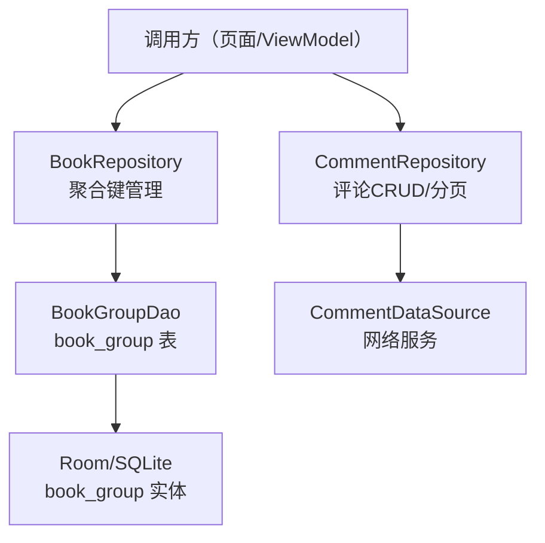
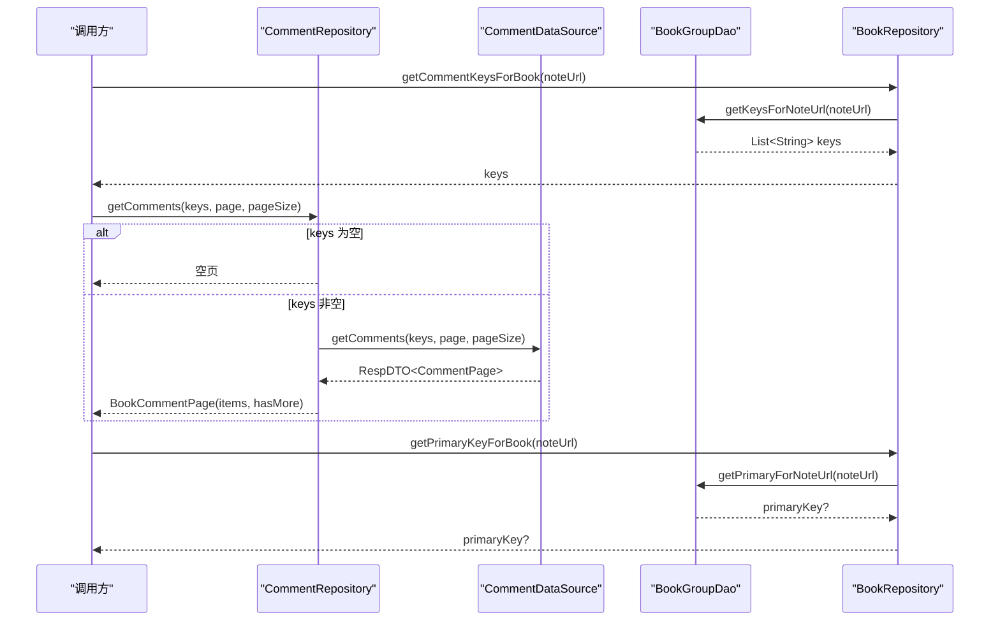
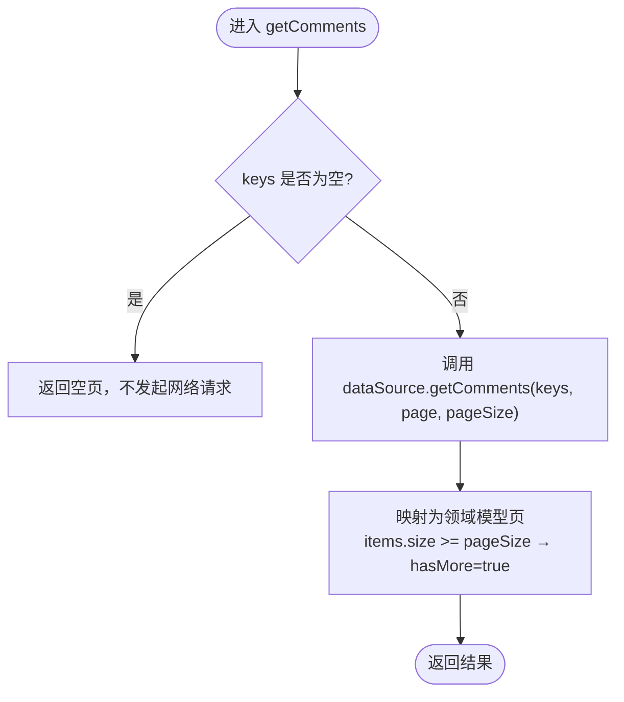
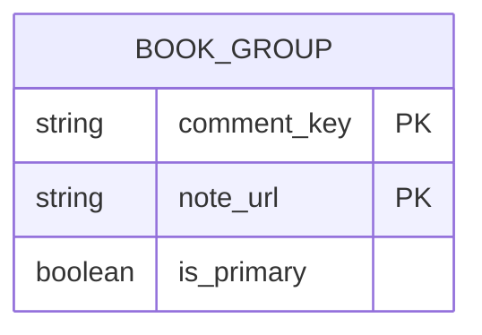
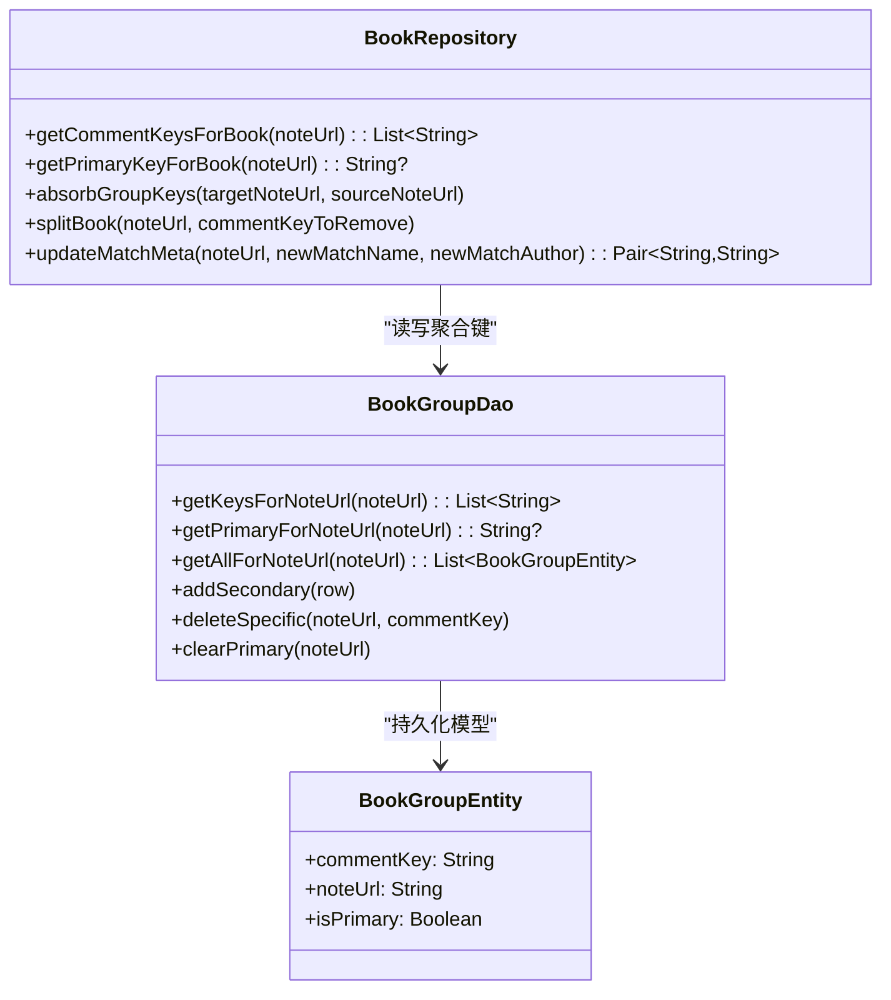
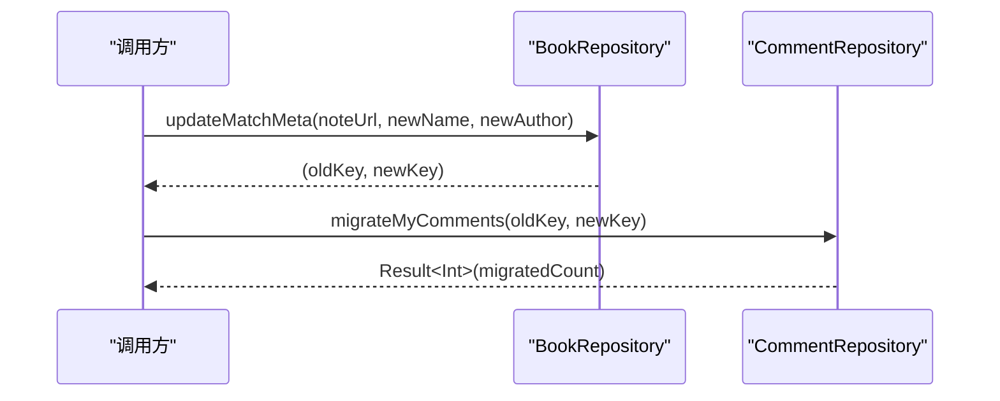
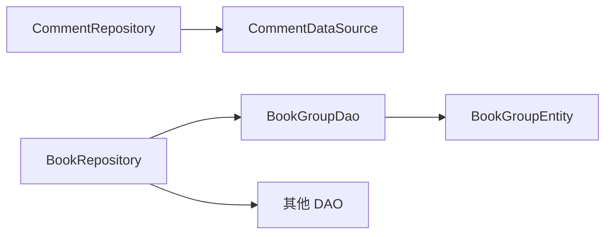

# 评论聚合

<cite>
**本文引用的文件**
- [CommentRepository.kt](file://lib_book_common/src/main/java/com/ebook/common/repository/CommentRepository.kt)
- [BookRepository.kt](file://lib_book_common/src/main/java/com/ebook/common/repository/BookRepository.kt)
- [BookGroupEntity.kt](file://lib_ebook_db/src/main/java/com/ebook/db/entity/BookGroupEntity.kt)
- [BookGroupDao.kt](file://lib_ebook_db/src/main/java/com/ebook/db/dao/BookGroupDao.kt)
- [M2 评论接口协议](file://docs/superpowers/specs/2026-09-05-m2-comment-api-contract.md)
- [CommentRepositoryTest.kt](file://lib_book_common/src/test/java/com/ebook/common/repository/CommentRepositoryTest.kt)
- [BookGroupDaoTest.kt](file://lib_book_common/src/test/java/com/ebook/common/repository/BookGroupDaoTest.kt)
</cite>

## 目录
1. [简介](#简介)
2. [项目结构](#项目结构)
3. [核心组件](#核心组件)
4. [架构总览](#架构总览)
5. [详细组件分析](#详细组件分析)
6. [依赖关系分析](#依赖关系分析)
7. [性能考量](#性能考量)
8. [故障排查指南](#故障排查指南)
9. [结论](#结论)

## 简介
本文件聚焦 M2 阶段的“评论聚合”能力：通过客户端派生的不透明键 comment_key，将同一作品在不同书源、不同章节下的评论合并为统一的“读并集”，同时保证“写主键”的语义稳定。文档从架构、数据流、关键算法与边界条件入手，覆盖 CommentRepository 的 CRUD 与分页、BookGroupEntity 的主键与 secondary 键管理、以及跨源切换时的评论保留策略，并提供迁移与智能合并的实践指引。

## 项目结构
评论聚合涉及三层：
- 仓库层（lib_book_common）：CommentRepository 负责网络侧评论读写；BookRepository 负责书架条目与 book_group 表的聚合键管理。
- 数据访问层（lib_ebook_db）：BookGroupDao + BookGroupEntity 提供“一个来源条目可关联多个评论桶键”的持久化模型。
- 服务端契约（docs/superpowers/specs）：定义 comment_keys 并集查询、我的评论、迁移等端点。

**图示来源**
- [CommentRepository.kt:16-113](file://lib_book_common/src/main/java/com/ebook/common/repository/CommentRepository.kt#L16-L113)
- [BookRepository.kt:643-839](file://lib_book_common/src/main/java/com/ebook/common/repository/BookRepository.kt#L643-L839)
- [BookGroupDao.kt:15-63](file://lib_ebook_db/src/main/java/com/ebook/db/dao/BookGroupDao.kt#L15-L63)
- [BookGroupEntity.kt:21-37](file://lib_ebook_db/src/main/java/com/ebook/db/entity/BookGroupEntity.kt#L21-L37)

**章节来源**
- [CommentRepository.kt:16-113](file://lib_book_common/src/main/java/com/ebook/common/repository/CommentRepository.kt#L16-L113)
- [BookRepository.kt:643-839](file://lib_book_common/src/main/java/com/ebook/common/repository/BookRepository.kt#L643-L839)
- [BookGroupDao.kt:15-63](file://lib_ebook_db/src/main/java/com/ebook/db/dao/BookGroupDao.kt#L15-L63)
- [BookGroupEntity.kt:21-37](file://lib_ebook_db/src/main/java/com/ebook/db/entity/BookGroupEntity.kt#L21-L37)
- [M2 评论接口协议:45-64](file://docs/superpowers/specs/2026-09-05-m2-comment-api-contract.md#L45-L64)

## 核心组件
- CommentRepository：封装评论的网络请求、错误翻译、分页页大小与空键守卫。
- BookRepository：维护 book_group 的“读并集、写主键”，并提供合并、拆分、修键、换源时吸收键等能力。
- BookGroupDao / BookGroupEntity：以复合主键 (comment_key, note_url) 表达“一条来源条目可属于多个评论桶”，并用 is_primary 标记写入目标。

**章节来源**
- [CommentRepository.kt:16-113](file://lib_book_common/src/main/java/com/ebook/common/repository/CommentRepository.kt#L16-L113)
- [BookRepository.kt:643-839](file://lib_book_common/src/main/java/com/ebook/common/repository/BookRepository.kt#L643-L839)
- [BookGroupDao.kt:15-63](file://lib_ebook_db/src/main/java/com/ebook/db/dao/BookGroupDao.kt#L15-L63)
- [BookGroupEntity.kt:21-37](file://lib_ebook_db/src/main/java/com/ebook/db/entity/BookGroupEntity.kt#L21-L37)

## 架构总览
M2 评论聚合的核心规则：
- 读并集：按一本书的所有关联 comment_key 进行 IN 查询，返回所有匹配的评论集合。
- 写主键：新增/更新评论必须使用 is_primary=true 的那条 comment_key。
- 跨源合并：同一作品的多个来源条目共享同一 comment_key 的读视图；换源或导入判重时通过 absorbGroupKeys 把旧键并入新条目的并集。
- 键空间：comment_key 由客户端计算，服务端不解释；章评键在作品键后追加“#序号”。

**图示来源**
- [BookRepository.kt:643-665](file://lib_book_common/src/main/java/com/ebook/common/repository/BookRepository.kt#L643-L665)
- [CommentRepository.kt:58-91](file://lib_book_common/src/main/java/com/ebook/common/repository/CommentRepository.kt#L58-L91)
- [BookGroupDao.kt:26-32](file://lib_ebook_db/src/main/java/com/ebook/db/dao/BookGroupDao.kt#L26-L32)

**章节来源**
- [M2 评论接口协议:45-64](file://docs/superpowers/specs/2026-09-05-m2-comment-api-contract.md#L45-L64)
- [CommentRepository.kt:58-91](file://lib_book_common/src/main/java/com/ebook/common/repository/CommentRepository.kt#L58-L91)
- [BookRepository.kt:643-665](file://lib_book_common/src/main/java/com/ebook/common/repository/BookRepository.kt#L643-L665)

## 详细组件分析

### CommentRepository：评论CRUD与分页
- 删除评论：包装网络调用，成功时 data 为空也视为成功，统一用业务码判断。
- 我的评论：当前一次性拉取大页（MY_COMMENTS_PAGE_SIZE），后续接入分页会并入 PAGE_SIZE。
- 获取评论（并集）：若传入键列表为空，直接返回空页且不发请求；否则调用网络并按页大小推导 hasMore。
- 迁移我的评论：调用后端迁移接口，返回迁移数量用于 UI 文案。
- 分页大小策略：PAGE_SIZE=20（评论轻、首屏快、翻页无感）；我的评论 MY_COMMENTS_PAGE_SIZE=100（避免悬崖截断）。

**图示来源**
- [CommentRepository.kt:58-91](file://lib_book_common/src/main/java/com/ebook/common/repository/CommentRepository.kt#L58-L91)

**章节来源**
- [CommentRepository.kt:16-113](file://lib_book_common/src/main/java/com/ebook/common/repository/CommentRepository.kt#L16-L113)
- [CommentRepositoryTest.kt:28-49](file://lib_book_common/src/test/java/com/ebook/common/repository/CommentRepositoryTest.kt#L28-L49)
- [CommentRepositoryTest.kt:54-88](file://lib_book_common/src/test/java/com/ebook/common/repository/CommentRepositoryTest.kt#L54-L88)
- [CommentRepositoryTest.kt:92-147](file://lib_book_common/src/test/java/com/ebook/common/repository/CommentRepositoryTest.kt#L92-L147)

### BookGroupEntity：主键管理与 is_primary 语义
- 复合主键 (comment_key, note_url)：同一来源条目可拥有多条记录（多个桶键）。
- is_primary：恰好一行表示“写评论的目标键”。由于 SQLite 无法表达“部分唯一约束”，该不变式由调用方在事务内保证。
- 索引：对 note_url 建立索引，便于按来源条目快速检索全部键。

**图示来源**
- [BookGroupEntity.kt:21-37](file://lib_ebook_db/src/main/java/com/ebook/db/entity/BookGroupEntity.kt#L21-L37)

**章节来源**
- [BookGroupEntity.kt:21-37](file://lib_ebook_db/src/main/java/com/ebook/db/entity/BookGroupEntity.kt#L21-L37)
- [BookGroupDao.kt:15-63](file://lib_ebook_db/src/main/java/com/ebook/db/dao/BookGroupDao.kt#L15-L63)

### BookRepository：聚合键与跨源评论保留
- getCommentKeysForBook：读取某来源条目关联的全部 comment_key（供评论区做并集查询）。
- getPrimaryKeyForBook：读取 is_primary=true 的 comment_key（供发评论使用）。两者区别在于“读多键 vs 写单键”。
- absorbGroupKeys：把 source 的全部关联键并入 target 的并集（覆盖场景下先吸收再删旧条目，避免丢失 secondary 键带来的读并集）。
- splitBook：从并集中移除指定键行，禁止删除主键行。
- updateMatchMeta：改匹配名/作者后重算键，旧主键降级、新键成为主键；旧行保留以保证历史评论可见。
- switchSource 中的吸收：换源事务中“先插新 → 吸收旧键 → 删旧 → 清旧队列”，确保评论归属不被破坏。

**图示来源**
- [BookRepository.kt:643-839](file://lib_book_common/src/main/java/com/ebook/common/repository/BookRepository.kt#L643-L839)
- [BookGroupDao.kt:15-63](file://lib_ebook_db/src/main/java/com/ebook/db/dao/BookGroupDao.kt#L15-L63)
- [BookGroupEntity.kt:21-37](file://lib_ebook_db/src/main/java/com/ebook/db/entity/BookGroupEntity.kt#L21-L37)

**章节来源**
- [BookRepository.kt:643-839](file://lib_book_common/src/main/java/com/ebook/common/repository/BookRepository.kt#L643-L839)
- [BookGroupDaoTest.kt:18-80](file://lib_book_common/src/test/java/com/ebook/common/repository/BookGroupDaoTest.kt#L18-L80)

### 读并集与写主键的策略说明
- 读并集：调用方先通过 getCommentKeysForBook 取出该书的所有键，构造章评键（作品键+“#序号”）列表，再调用 CommentRepository.getComments 进行 IN 查询。
- 写主键：通过 getPrimaryKeyForBook 获取 is_primary 对应的键，仅对该键写入评论，保证“写单键”的一致性。
- 空键处理：当 key 列表为空时，CommentRepository 直接返回空页且不请求，防止误触发“全局最新列表”的后端分支。

**章节来源**
- [M2 评论接口协议:45-64](file://docs/superpowers/specs/2026-09-05-m2-comment-api-contract.md#L45-L64)
- [CommentRepository.kt:58-91](file://lib_book_common/src/main/java/com/ebook/common/repository/CommentRepository.kt#L58-L91)
- [BookRepository.kt:643-665](file://lib_book_common/src/main/java/com/ebook/common/repository/BookRepository.kt#L643-L665)

### 迁移用户评论到新键（换源/修键）
- 触发时机：updateMatchMeta 成功后，调用 CommentRepository.migrateMyComments(oldKey, newKey) 迁移本人评论到新键。
- 行为：后端仅迁移当前登录用户的评论，不影响他人；返回迁移数量供 UI 提示。
- 注意：旧键的行仍保留在 book_group 中（read union 包含旧键），因此“未迁移”的他人评论仍可被读到；仅本人评论移动到新键。

**图示来源**
- [BookRepository.kt:795-831](file://lib_book_common/src/main/java/com/ebook/common/repository/BookRepository.kt#L795-L831)
- [CommentRepository.kt:69-78](file://lib_book_common/src/main/java/com/ebook/common/repository/CommentRepository.kt#L69-L78)
- [M2 评论接口协议:109-143](file://docs/superpowers/specs/2026-09-05-m2-comment-api-contract.md#L109-L143)

**章节来源**
- [BookRepository.kt:795-831](file://lib_book_common/src/main/java/com/ebook/common/repository/BookRepository.kt#L795-L831)
- [CommentRepository.kt:69-78](file://lib_book_common/src/main/java/com/ebook/common/repository/CommentRepository.kt#L69-L78)
- [M2 评论接口协议:109-143](file://docs/superpowers/specs/2026-09-05-m2-comment-api-contract.md#L109-L143)

### 智能合并（补章）与评论保留
- mergeTailChapters：仅在本地书生效，判定新旧章名前缀一致才补尾；成功后删除新条目。
- 评论侧无需 absorbGroupKeys：因为判重命中意味着两本已算出相同键，删除新条目不会让旧条目的读并集减少。
- 与“覆盖”的区别：覆盖活下来的是新条目，需先 absorbGroupKeys 把旧条目的 secondary 键搬过去。

**章节来源**
- [BookRepository.kt:706-780](file://lib_book_common/src/main/java/com/ebook/common/repository/BookRepository.kt#L706-L780)

### 拆分限制与主键保护
- splitBook：只允许删除 secondary 键行，禁止删除主键行（否则会失去写评论的能力）。
- 实现上通过 getPrimaryForNoteUrl 校验，若待删键等于主键则跳过删除。

**章节来源**
- [BookRepository.kt:782-793](file://lib_book_common/src/main/java/com/ebook/common/repository/BookRepository.kt#L782-L793)
- [BookGroupDao.kt:47-49](file://lib_ebook_db/src/main/java/com/ebook/db/dao/BookGroupDao.kt#L47-L49)

## 依赖关系分析
- CommentRepository 依赖 CommentDataSource（网络层）和 CoroutineAdapter（会话刷新/错误包装）。
- BookRepository 依赖 BookGroupDao（聚合键）、BookShelfDao/BookInfoDao/ChapterListDao（书架与章节）、WriteTransactionRunner（事务边界）。
- 数据库层通过 Room 管理 book_group 表的增删改查。

**图示来源**
- [CommentRepository.kt:16-20](file://lib_book_common/src/main/java/com/ebook/common/repository/CommentRepository.kt#L16-L20)
- [BookRepository.kt:52-74](file://lib_book_common/src/main/java/com/ebook/common/repository/BookRepository.kt#L52-L74)
- [BookGroupDao.kt:15-63](file://lib_ebook_db/src/main/java/com/ebook/db/dao/BookGroupDao.kt#L15-L63)
- [BookGroupEntity.kt:21-37](file://lib_ebook_db/src/main/java/com/ebook/db/entity/BookGroupEntity.kt#L21-L37)

**章节来源**
- [CommentRepository.kt:16-20](file://lib_book_common/src/main/java/com/ebook/common/repository/CommentRepository.kt#L16-L20)
- [BookRepository.kt:52-74](file://lib_book_common/src/main/java/com/ebook/common/repository/BookRepository.kt#L52-L74)
- [BookGroupDao.kt:15-63](file://lib_ebook_db/src/main/java/com/ebook/db/dao/BookGroupDao.kt#L15-L63)

## 性能考量
- 分页大小：评论轻量，PAGE_SIZE=20 兼顾首屏加载速度与翻页体验；我的评论采用大页避免悬崖截断。
- 空键守卫：避免空键触达后端导致返回全站最新评论，减少不必要网络请求。
- 事务边界：换源与修键操作集中在 WriteTransactionRunner 内执行，缩短 Room 写事务时间，降低阻塞风险。
- 缓存失效：智能合并补章后主动失效内容缓存，确保读者看到最新的目录与进度。

[本节为通用性能建议，不直接分析具体文件]

## 故障排查指南
- 空键导致显示全站评论：检查调用方是否正确传入了 book_group 的全部键；CommentRepository 已内置空键守卫，若仍出现异常需确认上层逻辑是否误传空列表。
- 写评论失败：确认使用了 getPrimaryKeyForBook 返回的主键；非主键写入不符合 M2 契约。
- 换源后评论丢失：确保 commitSwitch 中先 absorbGroupKeys 再删旧条目；若缺失会导致 secondary 键丢失从而读并集减少。
- 修键后评论未迁移：调用 updateMatchMeta 后需显式调用 migrateMyComments 迁移本人评论；他人评论不受影响。
- 拆分误删主键：splitBook 会拒绝删除主键；如遇到此情况应改为删除 secondary 键。

**章节来源**
- [CommentRepository.kt:58-91](file://lib_book_common/src/main/java/com/ebook/common/repository/CommentRepository.kt#L58-L91)
- [BookRepository.kt:411-416](file://lib_book_common/src/main/java/com/ebook/common/repository/BookRepository.kt#L411-L416)
- [BookRepository.kt:782-793](file://lib_book_common/src/main/java/com/ebook/common/repository/BookRepository.kt#L782-L793)
- [CommentRepositoryTest.kt:28-49](file://lib_book_common/src/test/java/com/ebook/common/repository/CommentRepositoryTest.kt#L28-L49)

## 结论
M2 评论聚合通过“读并集、写主键”的清晰分工，解决了跨书源、跨章节的评论统一展示问题；借助 book_group 的二级键机制，既保证了评论的历史可见性，又避免了重复与漂移。配合 CommentRepository 的分页策略与空键守卫、BookRepository 的吸收/拆分/修键流程，系统在功能完整性与用户体验之间取得平衡。实际使用中，请严格遵循“读并集、写主键”的约定，并在换源/修键/覆盖/智能合并等关键路径中落实键的迁移与保留。