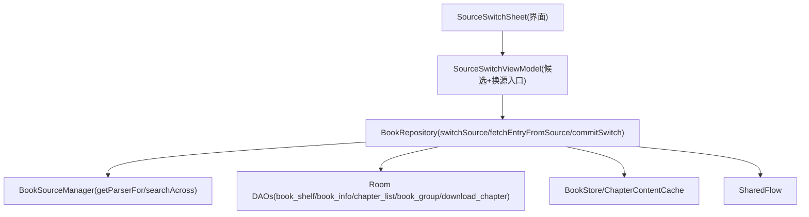
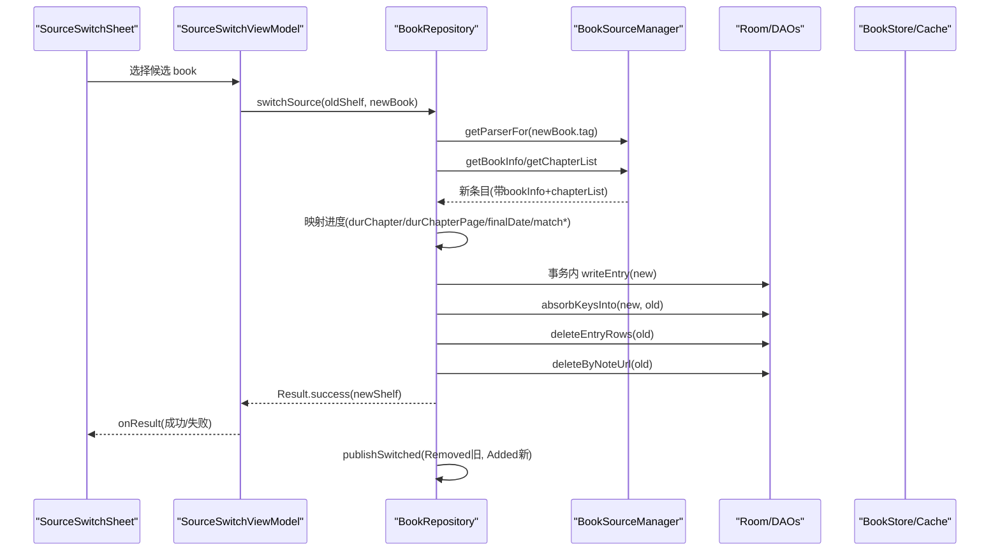
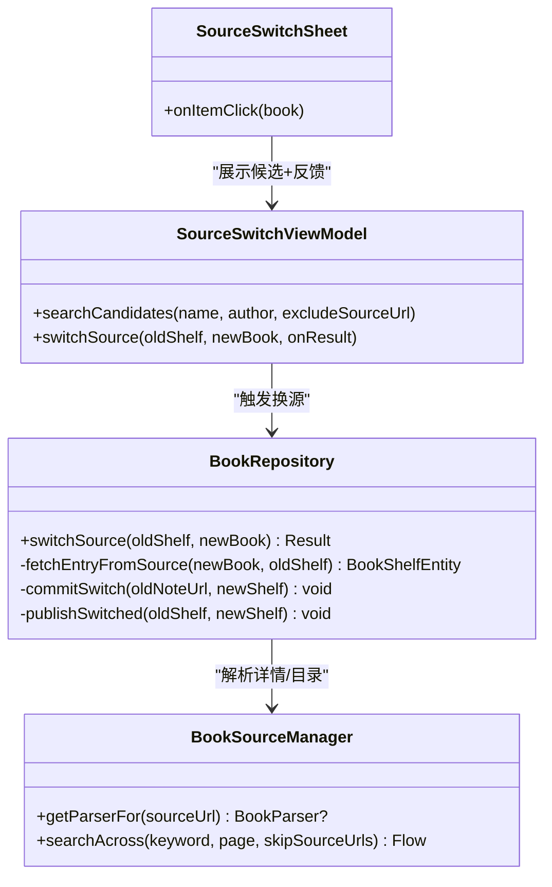

# 阅读中换源

<cite>
**本文引用的文件**
- [BookRepository.kt](file://lib_book_common/src/main/java/com/ebook/common/repository/BookRepository.kt)
- [SourceSwitchViewModel.kt](file://module_book/src/main/java/com/ebook/book/mvvm/viewmodel/SourceSwitchViewModel.kt)
- [SourceSwitchSheet.kt](file://module_book/src/main/java/com/ebook/book/reader/SourceSwitchSheet.kt)
- [BookSourceNotFoundException.kt](file://lib_book_source/src/main/java/com/ebook/source/analyze/BookSourceNotFoundException.kt)
- [0016-multi-book-source-architecture.md](file://docs/adr/0016-multi-book-source-architecture.md)
- [BookRepositorySwitchSourceTest.kt](file://lib_book_common/src/test/java/com/ebook/common/repository/BookRepositorySwitchSourceTest.kt)
</cite>

## 目录
1. [简介](#简介)
2. [项目结构定位](#项目结构定位)
3. [核心组件](#核心组件)
4. [架构总览](#架构总览)
5. [详细组件分析](#详细组件分析)
6. [依赖关系分析](#依赖关系分析)
7. [性能与事务特性](#性能与事务特性)
8. [故障排查指南](#故障排查指南)
9. [结论](#结论)
10. [附录：安全执行步骤与用户反馈](#附录安全执行步骤与用户反馈)

## 简介
本文围绕“阅读中换源”这一关键能力，系统化解释其事务设计、网络解析与数据库操作的分离、失败回滚机制，以及章序号映射、旧进度处理、事件发布、进程被杀自愈等细节。重点覆盖以下要点：
- switchSource 的事务边界：网络在事务外，写库在事务内；
- fetchEntryFromSource 的源解析流程、详情与目录抓取、旧进度映射策略；
- commitSwitch 的四步原子操作：先插新、吸收旧键、删旧、清队列；
- 章序号映射的有损转换、durChapterPage 复位原因、finalDate 保留策略；
- BookAlreadyOnShelfException 的业务异常与换源事件发布时机；
- ADR-0016 决策背景、旧源缓存取舍、下载任务清理的必要性与风险；
- 本地书的换源限制、失败的用户反馈路径。

## 项目结构定位
- 业务仓库层：BookRepository 负责书架条目读写、换源事务、章节正文读取、目录同步等。
- 页面交互层：SourceSwitchViewModel 负责候选搜索与触发换源；SourceSwitchSheet 负责 UI 呈现与错误提示。
- 书源抽象层：BookSourceManager + BookParser 提供按 tag 取 parser、拉详情/目录的能力；BookSourceNotFoundException 用于表达“目标源不可用”。
- 文档层：ADR-0016 记录多书源共存与阅读中换源的设计决策与权衡。

图表来源
- [BookRepository.kt:223-432](file://lib_book_common/src/main/java/com/ebook/common/repository/BookRepository.kt#L223-L432)
- [SourceSwitchViewModel.kt:117-177](file://module_book/src/main/java/com/ebook/book/mvvm/viewmodel/SourceSwitchViewModel.kt#L117-L177)
- [SourceSwitchSheet.kt:83-187](file://module_book/src/main/java/com/ebook/book/reader/SourceSwitchSheet.kt#L83-L187)

小节来源
- [BookRepository.kt:223-432](file://lib_book_common/src/main/java/com/ebook/common/repository/BookRepository.kt#L223-L432)
- [SourceSwitchViewModel.kt:117-177](file://module_book/src/main/java/com/ebook/book/mvvm/viewmodel/SourceSwitchViewModel.kt#L117-L177)
- [SourceSwitchSheet.kt:83-187](file://module_book/src/main/java/com/ebook/book/reader/SourceSwitchSheet.kt#L83-L187)

## 核心组件
- BookRepository.switchSource：换源入口，负责前置校验、调用 fetchEntryFromSource、在事务中执行 commitSwitch，成功后发布事件。
- BookRepository.fetchEntryFromSource：按目标条目的 tag 获取 parser，拉取详情与目录，并将旧进度映射到新条目（含 durChapter、durChapterPage、finalDate、matchName/matchAuthor）。
- BookRepository.commitSwitch：四步原子写：writeEntry(new)、absorbKeysInto(new, old)、deleteEntryRows(old)、deleteByNoteUrl(old)。
- SourceSwitchViewModel：聚合搜索候选、排除当前源、合并结果并排序、发起换源并把 Result 返回给面板渲染。
- SourceSwitchSheet：弹层展示候选、进度、失败文案；点击候选后触发换源并在面板内联显示错误。
- BookSourceNotFoundException：表示目标源不可用或已删除，用于上层统一提示。
- ADR-0016：定义多书源共存、阅读中换源的策略、失败窗口、旧源内容取舍、下载任务清理等。

小节来源
- [BookRepository.kt:292-432](file://lib_book_common/src/main/java/com/ebook/common/repository/BookRepository.kt#L292-L432)
- [SourceSwitchViewModel.kt:117-177](file://module_book/src/main/java/com/ebook/book/mvvm/viewmodel/SourceSwitchViewModel.kt#L117-L177)
- [SourceSwitchSheet.kt:83-187](file://module_book/src/main/java/com/ebook/book/reader/SourceSwitchSheet.kt#L83-L187)
- [BookSourceNotFoundException.kt:1-27](file://lib_book_source/src/main/java/com/ebook/source/analyze/BookSourceNotFoundException.kt#L1-L27)
- [0016-multi-book-source-architecture.md:116-141](file://docs/adr/0016-multi-book-source-architecture.md#L116-L141)

## 架构总览
换源整体分为“网络解析阶段”和“数据库事务阶段”，两者严格解耦，避免把慢的网络请求拖入 Room 事务线程，从而保护全库写入性能。

图表来源
- [BookRepository.kt:292-432](file://lib_book_common/src/main/java/com/ebook/common/repository/BookRepository.kt#L292-L432)
- [SourceSwitchViewModel.kt:164-177](file://module_book/src/main/java/com/ebook/book/mvvm/viewmodel/SourceSwitchViewModel.kt#L164-L177)
- [SourceSwitchSheet.kt:164-181](file://module_book/src/main/java/com/ebook/book/reader/SourceSwitchSheet.kt#L164-L181)

## 详细组件分析

### BookRepository.switchSource：事务设计与失败窗口
- 前置校验：
  - 本地书不允许换源（tag == LOCAL_TAG）→ IllegalArgumentException；
  - 目标与当前条目相同 → IllegalArgumentException（防止“先插后删”把自己从书架删除）；
  - 目标 noteUrl 已在书架上 → BookAlreadyOnShelfException（防止 REPLACE 覆盖另一本书进度并混入两份目录）。
- 网络解析在事务外：
  - 通过 fetchEntryFromSource 拉取详情与目录；任何异常以 Result.failure 返回，不改动数据库。
- 事务内写库：
  - 使用 WriteTransactionRunner 保证四个写步骤在同一事务；提交成功后才发事件。
- 失败窗口说明：
  - 解析阶段失败：一行未动；
  - 事务内失败：生产实现基于 Room withTransaction 回滚，单测替身不模拟回滚但用例锁定“失败发生在写之前”的场景；
  - 提交后事件未送达（进程被杀）：自愈由 observeBookShelf 的 Room 失效流承担，书架页自然纠正。

小节来源
- [BookRepository.kt:292-339](file://lib_book_common/src/main/java/com/ebook/common/repository/BookRepository.kt#L292-L339)
- [BookRepositorySwitchSourceTest.kt:332-377](file://lib_book_common/src/test/java/com/ebook/common/repository/BookRepositorySwitchSourceTest.kt#L332-L377)

### fetchEntryFromSource：源解析流程与旧进度映射
- 按 newBook.tag 取 parser，若为空抛出 BookSourceNotFoundException；
- 调用 parser.getBookInfo 与 getChapterList，构造新条目；
- 强制要求 newShelf.bookInfo 非空，否则抛出异常（防止脏返回导致半本入库）；
- 旧进度映射策略：
  - durChapter = min(旧 durChapter, 新目录总数 - 1)，新目录为空时取 0（避免阅读器越界）；
  - durChapterPage 复位为起始页码（不同源分页规则不同，跨源页码无意义）；
  - finalDate 保留旧值（换源不应改变“最后阅读时间”）；
  - matchName/matchAuthor 沿用旧值（评论桶不因换源漂移）。

小节来源
- [BookRepository.kt:351-384](file://lib_book_common/src/main/java/com/ebook/common/repository/BookRepository.kt#L351-L384)
- [BookRepositorySwitchSourceTest.kt:218-288](file://lib_book_common/src/test/java/com/ebook/common/repository/BookRepositorySwitchSourceTest.kt#L218-L288)

### commitSwitch：四步原子操作
- writeEntry(newShelf)：写入 book_info、book_shelf、chapter_list、book_group 主键行；
- absorbKeysInto(new.noteUrl, old.noteUrl)：将旧条目的所有 book_group 关联键并入新条目（先于删旧，避免评论并集丢失）；
- deleteEntryRows(old.noteUrl)：删除 chapter_list、book_info、book_group、book_shelf；
- deleteByNoteUrl(old.noteUrl)：清理旧条目名下的下载任务（避免幽灵分组与角标不归零）。

小节来源
- [BookRepository.kt:386-416](file://lib_book_common/src/main/java/com/ebook/common/repository/BookRepository.kt#L386-L416)
- [BookRepositorySwitchSourceTest.kt:290-328](file://lib_book_common/src/test/java/com/ebook/common/repository/BookRepositorySwitchSourceTest.kt#L290-L328)
- [BookRepositorySwitchSourceTest.kt:496-557](file://lib_book_common/src/test/java/com/ebook/common/repository/BookRepositorySwitchSourceTest.kt#L496-L557)

### 事件发布与自愈路径
- 成功后发布两个事件：先 Removed(旧) 再 Added(新)，顺序对依赖事件维护内存快照的收集方友好；
- 事件仅在事务提交后发出，未提交的写不是事实；
- 进程被杀时的自愈：书架事实源是 Room 失效流（observeBookShelf），书架页与统计在下一次查询自然纠正。

小节来源
- [BookRepository.kt:418-432](file://lib_book_common/src/main/java/com/ebook/common/repository/BookRepository.kt#L418-L432)

### 旧源缓存取舍与下载任务清理
- 旧源库内行一律删净，但章文件与内存缓存不删（刻意不走 removeFromShelf 的两行清理）；
- 切回旧源会重拉一次目录（一次 HTTP），但已读章节命中盘上文件可实现“秒开”；
- 下一次启动对账会把旧目录回收（liveBookIds 取自 book_shelf），这是设计预期；
- 下载任务清理必要性：旧 noteUrl 不再属于书架，服务按书架遍历取任务，遗留行会造成幽灵分组与角标不归零；
- 为何删除而非迁移：任务中的章节地址属于旧站，迁移等于拿旧 URL 打新站，最坏会下错内容。

小节来源
- [BookRepository.kt:249-270](file://lib_book_common/src/main/java/com/ebook/common/repository/BookRepository.kt#L249-L270)
- [BookRepositorySwitchSourceTest.kt:474-494](file://lib_book_common/src/test/java/com/ebook/common/repository/BookRepositorySwitchSourceTest.kt#L474-L494)
- [BookRepositorySwitchSourceTest.kt:496-557](file://lib_book_common/src/test/java/com/ebook/common/repository/BookRepositorySwitchSourceTest.kt#L496-L557)

### 用户侧交互与反馈
- SourceSwitchViewModel 负责候选搜索与换源触发，失败经状态与 Result 交回面板，不调 reportFailure/sendToast（命令通道无人收集）；
- SourceSwitchSheet 在面板内联渲染失败文案，并保留弹层以便用户另选一本；
- 候选搜索排除当前源，按匹配度排序（完全匹配 > 部分匹配 > 作者匹配）。

小节来源
- [SourceSwitchViewModel.kt:117-177](file://module_book/src/main/java/com/ebook/book/mvvm/viewmodel/SourceSwitchViewModel.kt#L117-L177)
- [SourceSwitchSheet.kt:83-187](file://module_book/src/main/java/com/ebook/book/reader/SourceSwitchSheet.kt#L83-L187)

## 依赖关系分析
- 模块依赖方向：
  - module_book 依赖 lib_book_common（仓库与共享 UI）、lib_ebook_db（实体与 DAO）；
  - lib_book_common 依赖 lib_ebook_api（网络）、lib_ebook_db（持久化）、lib_book_source（解析器接口与异常）。
- 关键耦合点：
  - BookRepository 与 BookSourceManager：按 tag 取 parser，避免全局默认源；
  - BookRepository 与 DAOs：四张表（book_shelf、book_info、chapter_list、book_group）与下载队列；
  - BookRepository 与 BookStore/Cache：章文件存在性判定与缓存失效。

图表来源
- [BookRepository.kt:292-432](file://lib_book_common/src/main/java/com/ebook/common/repository/BookRepository.kt#L292-L432)
- [SourceSwitchViewModel.kt:117-177](file://module_book/src/main/java/com/ebook/book/mvvm/viewmodel/SourceSwitchViewModel.kt#L117-L177)
- [SourceSwitchSheet.kt:83-187](file://module_book/src/main/java/com/ebook/book/reader/SourceSwitchSheet.kt#L83-L187)

小节来源
- [BookRepository.kt:292-432](file://lib_book_common/src/main/java/com/ebook/common/repository/BookRepository.kt#L292-L432)
- [SourceSwitchViewModel.kt:117-177](file://module_book/src/main/java/com/ebook/book/mvvm/viewmodel/SourceSwitchViewModel.kt#L117-L177)
- [SourceSwitchSheet.kt:83-187](file://module_book/src/main/java/com/ebook/book/reader/SourceSwitchSheet.kt#L83-L187)

## 性能与事务特性
- 事务长度最小化：网络解析放在事务外，仅将写库步骤放入事务，避免第三方站点响应时间阻塞 Room 事务线程。
- 有序写与幂等：writeEntry 包含 book_info、book_shelf、chapter_list、book_group 主键行，REPLACE 语义确保幂等；absorbKeysInto 用 IGNORE 挡重复键。
- 缓存与存储：
  - 旧源库内行删净，避免孤儿数据；
  - 旧源章文件与内存缓存保留，支持切回“秒开”，但下次启动对账会回收旧目录。
- 下载任务清理：换源必须删除旧 noteUrl 的任务，避免服务按书架取任务时无主行堆积。

小节来源
- [BookRepository.kt:223-270](file://lib_book_common/src/main/java/com/ebook/common/repository/BookRepository.kt#L223-L270)
- [BookRepository.kt:386-416](file://lib_book_common/src/main/java/com/ebook/common/repository/BookRepository.kt#L386-L416)
- [BookRepositorySwitchSourceTest.kt:474-557](file://lib_book_common/src/test/java/com/ebook/common/repository/BookRepositorySwitchSourceTest.kt#L474-L557)

## 故障排查指南
- 常见失败与定位：
  - 目标源不可用：BookSourceNotFoundException（源被删或规则损坏），检查 book_source 表是否存在该行且启用；
  - 新源解不出书籍信息：IllegalStateException（脏返回），检查 parser 是否返回 bookInfo；
  - 本地书换源：IllegalArgumentException（本地书无源可换）；
  - 目标已在书架：BookAlreadyOnShelfException（防止 REPLACE 覆盖另一本书进度并混入两份目录）。
- 事件与自愈：
  - 事件仅在事务提交后发出，进程被杀时由 observeBookShelf 的 Room 失效流自愈；
  - 下载管理页出现“幽灵分组”：确认 commitSwitch 是否执行了 deleteByNoteUrl(old)。
- 测试参考：
  - 单元测试覆盖了章序号映射、失败窗口、事件顺序、旧源内容保留、下载任务清理等场景。

小节来源
- [BookRepository.kt:292-339](file://lib_book_common/src/main/java/com/ebook/common/repository/BookRepository.kt#L292-L339)
- [BookRepositorySwitchSourceTest.kt:332-452](file://lib_book_common/src/test/java/com/ebook/common/repository/BookRepositorySwitchSourceTest.kt#L332-L452)
- [BookRepositorySwitchSourceTest.kt:454-557](file://lib_book_common/src/test/java/com/ebook/common/repository/BookRepositorySwitchSourceTest.kt#L454-L557)

## 结论
阅读中换源通过严格的“网络与事务分离”、“四步原子写”、“旧键吸收与旧任务清理”、“有损但低成本的章序号映射”以及“事件后置发布与自愈路径”，在保证一致性的同时兼顾用户体验与性能。ADR-0016 明确了多书源共存与换源取舍，代码与测试共同锁定了关键行为与边界。

## 附录：安全执行步骤与用户反馈
- 安全执行步骤（概念性流程）：
  1) 在阅读器打开换源弹层，自动搜索其他源的同一本书（排除当前源）；
  2) 选择匹配度最高的候选；
  3) 调用 BookRepository.switchSource，进行前置校验与网络解析；
  4) 事务内执行四步原子写（插新、吸收旧键、删旧、清队列）；
  5) 成功后发布 Removed(旧)+Added(新) 事件；
  6) 面板根据 Result 渲染成功或失败提示。
- 本地书换源限制：
  - 本地书 tag == LOCAL_TAG，直接失败（IllegalArgumentException），因为本地书没有“源”可换；
- 用户反馈：
  - 失败一律经面板内联提示（不调 reportFailure/sendToast），保留弹层以便用户另选一本；
  - 成功时携带 Outcome 字段（如“已跳到第 X 章”“新源章节较少已落到末章”）以便准确提示。

小节来源
- [SourceSwitchViewModel.kt:117-177](file://module_book/src/main/java/com/ebook/book/mvvm/viewmodel/SourceSwitchViewModel.kt#L117-L177)
- [SourceSwitchSheet.kt:83-187](file://module_book/src/main/java/com/ebook/book/reader/SourceSwitchSheet.kt#L83-L187)
- [BookRepository.kt:292-339](file://lib_book_common/src/main/java/com/ebook/common/repository/BookRepository.kt#L292-L339)
- [0016-multi-book-source-architecture.md:116-141](file://docs/adr/0016-multi-book-source-architecture.md#L116-L141)