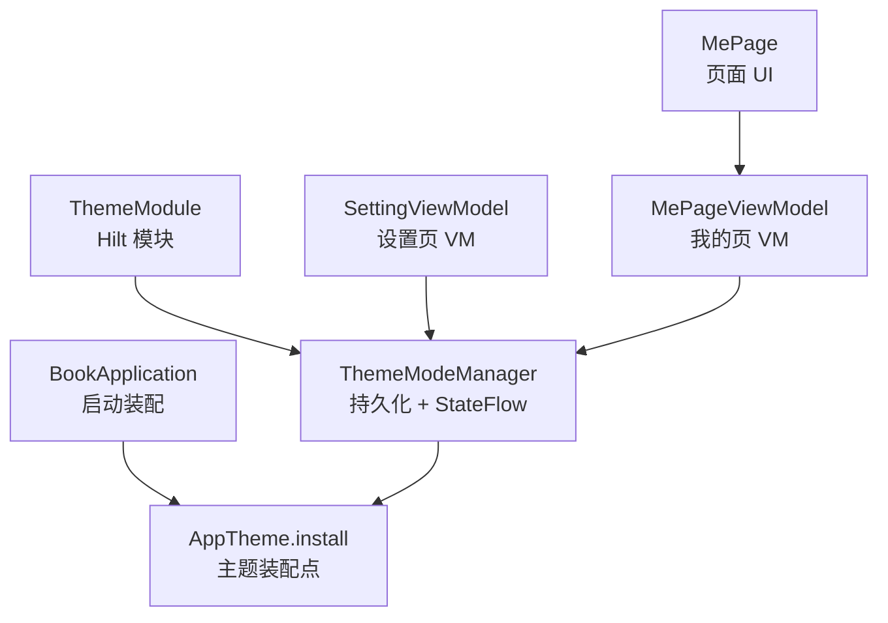
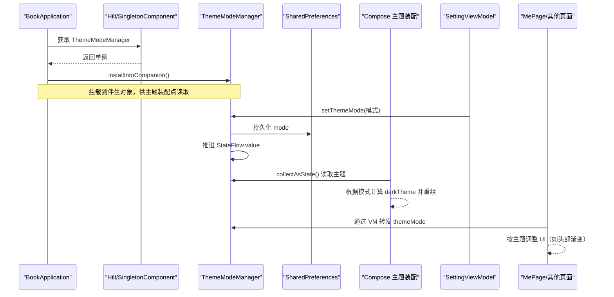
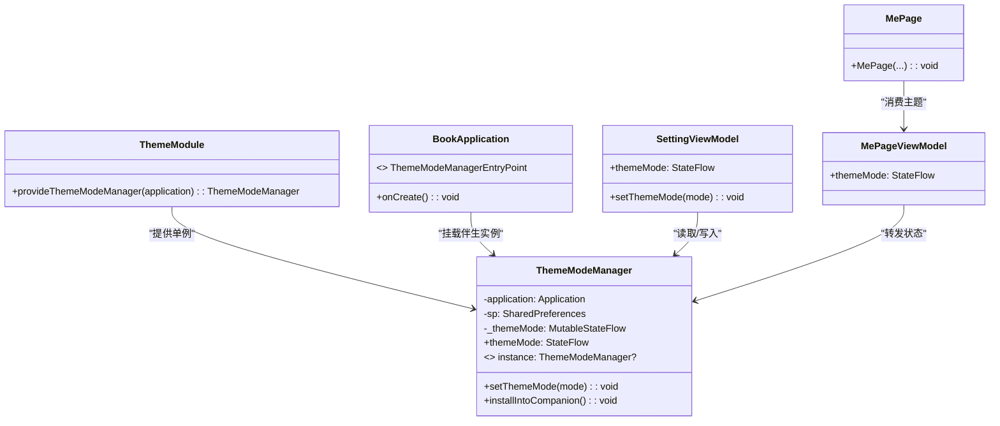
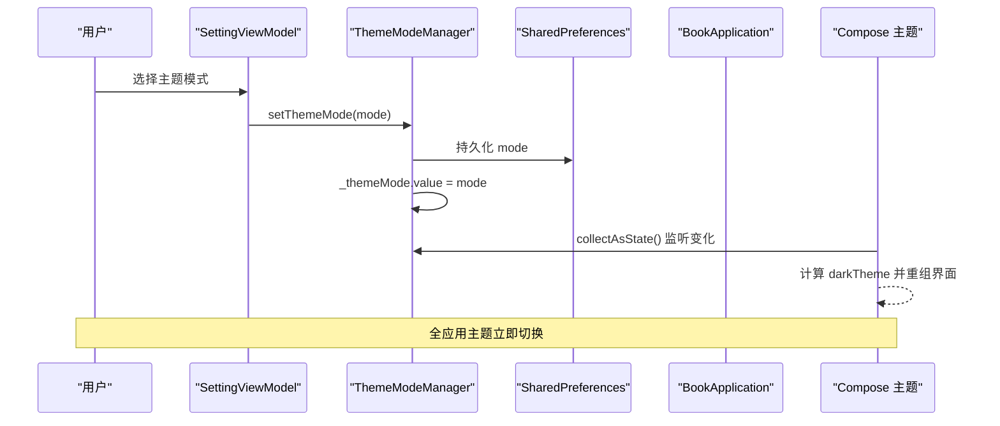
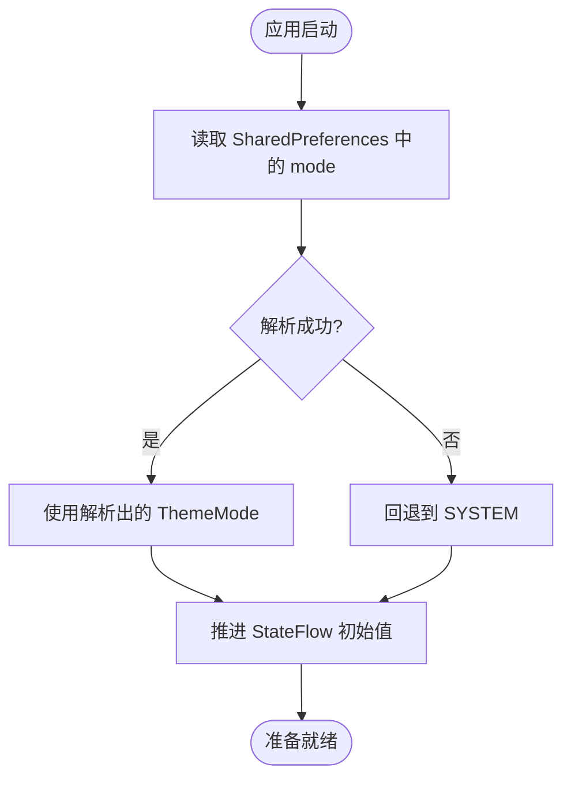

# 主题模块（ThemeModule）

<cite>
**本文引用的文件**   
- [lib_book_common/src/main/java/com/ebook/common/di/ThemeModule.kt](file://lib_book_common/src/main/java/com/ebook/common/di/ThemeModule.kt)
- [lib_book_common/src/main/java/com/ebook/common/domain/ThemeModeManager.kt](file://lib_book_common/src/main/java/com/ebook/common/domain/ThemeModeManager.kt)
- [lib_book_common/src/main/java/com/ebook/common/BookApplication.kt](file://lib_book_common/src/main/java/com/ebook/common/BookApplication.kt)
- [module_me/src/main/java/com/ebook/me/mvvm/viewmodel/SettingViewModel.kt](file://module_me/src/main/java/com/ebook/me/mvvm/viewmodel/SettingViewModel.kt)
- [module_me/src/main/java/com/ebook/me/page/MePage.kt](file://module_me/src/main/java/com/ebook/me/page/MePage.kt)
- [module_me/src/main/java/com/ebook/me/mvvm/viewmodel/MePageViewModel.kt](file://module_me/src/main/java/com/ebook/me/mvvm/viewmodel/MePageViewModel.kt)
- [docs/adr/0031-theme-mode-three-state-companion-singleton.md](file://docs/adr/0031-theme-mode-three-state-companion-singleton.md)
</cite>

## 目录
1. [简介](#简介)
2. [项目结构中的位置](#项目结构中的位置)
3. [核心组件](#核心组件)
4. [架构总览](#架构总览)
5. [详细组件分析](#详细组件分析)
6. [依赖关系分析](#依赖关系分析)
7. [性能与行为特征](#性能与行为特征)
8. [故障排查指南](#故障排查指南)
9. [结论](#结论)
10. [附录：使用示例与最佳实践](#附录使用示例与最佳实践)

## 简介
本模块负责应用外观主题模式的管理与装配，提供“浅色 / 深色 / 跟随系统”三态选择。其职责包括：
- 将用户的选择持久化到 SharedPreferences；
- 以 StateFlow 暴露当前主题状态；
- 在 Application 初始化阶段完成 Hilt 注入与伴生实例挂载；
- 通过 Compose 主题装配点驱动全应用主题切换；
- 为各页面提供统一的主题状态来源，避免多源不一致。

该模块采用 Hilt 进行依赖注入，并通过 SingletonComponent 保证全局单例；同时借助 BookApplication 的启动时机，把 ThemeModeManager 挂入一个可被非注入上下文读取的伴生对象，从而在 Compose 主题 lambda 中也能读到同一份状态。

**章节来源**
- [docs/adr/0031-theme-mode-three-state-companion-singleton.md:1-27](file://docs/adr/0031-theme-mode-three-state-companion-singleton.md#L1-L27)

## 项目结构中的位置
主题相关代码主要位于共享库 lib_book_common 的 di 与 domain 包中，并由业务模块 module_me 的使用侧消费：
- 依赖注入与生命周期绑定：lib_book_common 的 ThemeModule；
- 主题模式与持久化逻辑：lib_book_common 的 ThemeModeManager；
- 应用启动时装配主题：lib_book_common 的 BookApplication；
- 设置页写入主题并对外暴露状态：module_me 的 SettingViewModel；
- 页面消费主题状态：module_me 的 MePage 与其 ViewModel。

**图表来源**
- [lib_book_common/src/main/java/com/ebook/common/di/ThemeModule.kt:10-26](file://lib_book_common/src/main/java/com/ebook/common/di/ThemeModule.kt#L10-L26)
- [lib_book_common/src/main/java/com/ebook/common/domain/ThemeModeManager.kt:28-92](file://lib_book_common/src/main/java/com/ebook/common/domain/ThemeModeManager.kt#L28-L92)
- [lib_book_common/src/main/java/com/ebook/common/BookApplication.kt:17-59](file://lib_book_common/src/main/java/com/ebook/common/BookApplication.kt#L17-L59)
- [module_me/src/main/java/com/ebook/me/mvvm/viewmodel/SettingViewModel.kt:62-71](file://module_me/src/main/java/com/ebook/me/mvvm/viewmodel/SettingViewModel.kt#L62-L71)
- [module_me/src/main/java/com/ebook/me/mvvm/viewmodel/MePageViewModel.kt:69-119](file://module_me/src/main/java/com/ebook/me/mvvm/viewmodel/MePageViewModel.kt#L69-L119)
- [module_me/src/main/java/com/ebook/me/page/MePage.kt:77-94](file://module_me/src/main/java/com/ebook/me/page/MePage.kt#L77-L94)

**章节来源**
- [lib_book_common/src/main/java/com/ebook/common/di/ThemeModule.kt:10-26](file://lib_book_common/src/main/java/com/ebook/common/di/ThemeModule.kt#L10-L26)
- [lib_book_common/src/main/java/com/ebook/common/domain/ThemeModeManager.kt:28-92](file://lib_book_common/src/main/java/com/ebook/common/domain/ThemeModeManager.kt#L28-L92)
- [lib_book_common/src/main/java/com/ebook/common/BookApplication.kt:17-59](file://lib_book_common/src/main/java/com/ebook/common/BookApplication.kt#L17-L59)
- [module_me/src/main/java/com/ebook/me/mvvm/viewmodel/SettingViewModel.kt:62-71](file://module_me/src/main/java/com/ebook/me/mvvm/viewmodel/SettingViewModel.kt#L62-L71)
- [module_me/src/main/java/com/ebook/me/mvvm/viewmodel/MePageViewModel.kt:69-119](file://module_me/src/main/java/com/ebook/me/mvvm/viewmodel/MePageViewModel.kt#L69-L119)
- [module_me/src/main/java/com/ebook/me/page/MePage.kt:77-94](file://module_me/src/main/java/com/ebook/me/page/MePage.kt#L77-L94)

## 核心组件
- ThemeModule：声明并提供 ThemeModeManager 单例，绑定到 Hilt 的 SingletonComponent。
- ThemeModeManager：封装主题模式的读取、写入、持久化与事件广播。
- BookApplication：在应用启动时装配主题，并在 Hilt 注入完成后将管理器挂载到伴生对象。
- SettingViewModel：设置页 ViewModel，转发主题状态并提供写入入口。
- MePageViewModel / MePage：消费主题状态用于头部渐变等 UI 适配。

**章节来源**
- [lib_book_common/src/main/java/com/ebook/common/di/ThemeModule.kt:10-26](file://lib_book_common/src/main/java/com/ebook/common/di/ThemeModule.kt#L10-L26)
- [lib_book_common/src/main/java/com/ebook/common/domain/ThemeModeManager.kt:28-92](file://lib_book_common/src/main/java/com/ebook/common/domain/ThemeModeManager.kt#L28-L92)
- [lib_book_common/src/main/java/com/ebook/common/BookApplication.kt:17-59](file://lib_book_common/src/main/java/com/ebook/common/BookApplication.kt#L17-L59)
- [module_me/src/main/java/com/ebook/me/mvvm/viewmodel/SettingViewModel.kt:133-172](file://module_me/src/main/java/com/ebook/me/mvvm/viewmodel/SettingViewModel.kt#L133-L172)
- [module_me/src/main/java/com/ebook/me/mvvm/viewmodel/MePageViewModel.kt:109-119](file://module_me/src/main/java/com/ebook/me/mvvm/viewmodel/MePageViewModel.kt#L109-L119)
- [module_me/src/main/java/com/ebook/me/page/MePage.kt:77-94](file://module_me/src/main/java/com/ebook/me/page/MePage.kt#L77-L94)

## 架构总览
主题装配与状态流转的关键路径如下：
- 应用启动时，BookApplication.onCreate 注册 AppTheme 装配点，并在 Hilt 注入完成后取出 ThemeModeManager 并挂载到伴生对象；
- 设置页通过 SettingViewModel 调用 setThemeMode，内部写 SharedPreferences 并推进 StateFlow；
- 主题装配点在 Compose 重组时订阅 StateFlow，根据模式计算 darkTheme，驱动 MyApplicationTheme 渲染；
- 其他页面（如 MePage）通过各自的 ViewModel 转发 ThemeModeManager.themeMode，确保 UI 与全局主题一致。

**图表来源**
- [lib_book_common/src/main/java/com/ebook/common/BookApplication.kt:17-59](file://lib_book_common/src/main/java/com/ebook/common/BookApplication.kt#L17-L59)
- [lib_book_common/src/main/java/com/ebook/common/domain/ThemeModeManager.kt:44-92](file://lib_book_common/src/main/java/com/ebook/common/domain/ThemeModeManager.kt#L44-L92)
- [module_me/src/main/java/com/ebook/me/mvvm/viewmodel/SettingViewModel.kt:133-172](file://module_me/src/main/java/com/ebook/me/mvvm/viewmodel/SettingViewModel.kt#L133-L172)
- [module_me/src/main/java/com/ebook/me/page/MePage.kt:77-94](file://module_me/src/main/java/com/ebook/me/page/MePage.kt#L77-L94)

**章节来源**
- [lib_book_common/src/main/java/com/ebook/common/BookApplication.kt:17-59](file://lib_book_common/src/main/java/com/ebook/common/BookApplication.kt#L17-L59)
- [lib_book_common/src/main/java/com/ebook/common/domain/ThemeModeManager.kt:44-92](file://lib_book_common/src/main/java/com/ebook/common/domain/ThemeModeManager.kt#L44-L92)
- [module_me/src/main/java/com/ebook/me/mvvm/viewmodel/SettingViewModel.kt:133-172](file://module_me/src/main/java/com/ebook/me/mvvm/viewmodel/SettingViewModel.kt#L133-L172)
- [module_me/src/main/java/com/ebook/me/page/MePage.kt:77-94](file://module_me/src/main/java/com/ebook/me/page/MePage.kt#L77-L94)

## 详细组件分析

### ThemeModule：依赖注入与单例管理
- 职责：作为 Hilt 模块，提供 ThemeModeManager 的单例实例；
- 绑定：安装于 SingletonComponent，保证全应用生命周期内唯一；
- 依赖：需要 android.app.Application 以访问 SharedPreferences。

为什么需要显式提供 Application 实例？
- ThemeModeManager 构造时需要 Application 来创建 SharedPreferences；
- Hilt 能自动注入 Application，但此处通过 @Provides 明确暴露依赖，使构建图清晰、便于测试替换；
- 避免在多个地方重复 new Application 或持有 Context，降低泄漏风险。

SingletonComponent 的生命周期管理：
- 由 Hilt 管理，随应用进程生命周期存在；
- 与 BookApplication 的伴生实例同步：BookApplication 在 onCreate 中通过 EntryPointAccessors 取出单例并挂载到伴生对象，确保主题装配点能在 Compose 作用域外读取。

**章节来源**
- [lib_book_common/src/main/java/com/ebook/common/di/ThemeModule.kt:10-26](file://lib_book_common/src/main/java/com/ebook/common/di/ThemeModule.kt#L10-L26)
- [lib_book_common/src/main/java/com/ebook/common/BookApplication.kt:43-59](file://lib_book_common/src/main/java/com/ebook/common/BookApplication.kt#L43-L59)

### ThemeModeManager：主题模式管理与持久化
- 数据模型：ThemeMode 枚举（LIGHT、DARK、SYSTEM），默认 SYSTEM；
- 持久化：使用 SharedPreferences（theme_mode 文件，键 mode），读写均做异常保护，坏值回退至 SYSTEM；
- 状态暴露：以 StateFlow<ThemeMode> 暴露当前模式，供 UI 收集；
- 写入流程：setThemeMode 先落盘再推进 StateFlow，确保顺序一致；
- 伴生实例：installIntoCompanion 将实例挂到 companion.instance，供主题装配 lambda 读取。

SharedPreferences 读取机制与持久化策略：
- 冷启动加载：loadMode 从 SP 读取，解析失败或为空则返回 SYSTEM；
- 热更新：setThemeMode 立即写 SP 并更新 StateFlow，避免首次组合出现空值或旧值；
- 安全降级：runCatching 包裹枚举解析，防止跨版本改名或外部篡改导致崩溃。

与其他 UI 组件的交互方式：
- 设置页通过 SettingViewModel 调用 setThemeMode；
- 页面通过各自 ViewModel 转发 themeMode，用于 UI 主题适配（如头部渐变）；
- 主题装配点在 BookApplication 中订阅 StateFlow，动态计算 darkTheme 并重组界面。

**章节来源**
- [lib_book_common/src/main/java/com/ebook/common/domain/ThemeModeManager.kt:10-92](file://lib_book_common/src/main/java/com/ebook/common/domain/ThemeModeManager.kt#L10-L92)

### BookApplication：主题装配与伴生实例同步
- 进程门：隔离进程跳过初始化，避免无意义 IO；
- 主题装配：通过 AppTheme.install 注册 lambda，在 Compose 重组时读取 ThemeModeManager.instance.themeMode，计算 darkTheme；
- 伴生同步：Hilt 注入完成后，通过 EntryPointAccessors 取出 ThemeModeManager 并调用 installIntoCompanion，使主题装配点可读取。

为什么不在 BookApplication 中使用字段注入？
- BookApplication 不是 @HiltAndroidApp，且 eager 注入会早于进程门，可能在沙箱进程中触发不可恢复错误；
- 通过 EntryPointAccessors 延迟取用，既保证 Hilt 管理生命周期，又避免进程级副作用。

**章节来源**
- [lib_book_common/src/main/java/com/ebook/common/BookApplication.kt:17-59](file://lib_book_common/src/main/java/com/ebook/common/BookApplication.kt#L17-L59)

### SettingViewModel：设置页主题控制
- 注入 ThemeModeManager，暴露 themeMode 流供 UI 观察；
- 提供 setThemeMode(mode) 方法，委托给 ThemeModeManager 完成持久化与状态推进；
- 与版本检查、缓存管理等职责共存，保持设置页单一职责边界清晰。

**章节来源**
- [module_me/src/main/java/com/ebook/me/mvvm/viewmodel/SettingViewModel.kt:62-71](file://module_me/src/main/java/com/ebook/me/mvvm/viewmodel/SettingViewModel.kt#L62-L71)
- [module_me/src/main/java/com/ebook/me/mvvm/viewmodel/SettingViewModel.kt:133-172](file://module_me/src/main/java/com/ebook/me/mvvm/viewmodel/SettingViewModel.kt#L133-L172)

### MePageViewModel / MePage：页面主题消费
- MePageViewModel 转发 ThemeModeManager.themeMode，供 MePage 使用；
- MePage 使用该状态决定头部渐变的深浅色适配，确保与全局主题一致；
- 不直接读取伴生对象，避免可空性与时序问题。

**章节来源**
- [module_me/src/main/java/com/ebook/me/mvvm/viewmodel/MePageViewModel.kt:109-119](file://module_me/src/main/java/com/ebook/me/mvvm/viewmodel/MePageViewModel.kt#L109-L119)
- [module_me/src/main/java/com/ebook/me/page/MePage.kt:77-94](file://module_me/src/main/java/com/ebook/me/page/MePage.kt#L77-L94)

#### 类关系图（主题模块）

**图表来源**
- [lib_book_common/src/main/java/com/ebook/common/di/ThemeModule.kt:10-26](file://lib_book_common/src/main/java/com/ebook/common/di/ThemeModule.kt#L10-L26)
- [lib_book_common/src/main/java/com/ebook/common/domain/ThemeModeManager.kt:44-92](file://lib_book_common/src/main/java/com/ebook/common/domain/ThemeModeManager.kt#L44-L92)
- [lib_book_common/src/main/java/com/ebook/common/BookApplication.kt:17-59](file://lib_book_common/src/main/java/com/ebook/common/BookApplication.kt#L17-L59)
- [module_me/src/main/java/com/ebook/me/mvvm/viewmodel/SettingViewModel.kt:62-71](file://module_me/src/main/java/com/ebook/me/mvvm/viewmodel/SettingViewModel.kt#L62-L71)
- [module_me/src/main/java/com/ebook/me/mvvm/viewmodel/MePageViewModel.kt:69-119](file://module_me/src/main/java/com/ebook/me/mvvm/viewmodel/MePageViewModel.kt#L69-L119)
- [module_me/src/main/java/com/ebook/me/page/MePage.kt:77-94](file://module_me/src/main/java/com/ebook/me/page/MePage.kt#L77-L94)

#### 主题切换序列图（设置页到全局）

**图表来源**
- [module_me/src/main/java/com/ebook/me/mvvm/viewmodel/SettingViewModel.kt:133-172](file://module_me/src/main/java/com/ebook/me/mvvm/viewmodel/SettingViewModel.kt#L133-L172)
- [lib_book_common/src/main/java/com/ebook/common/domain/ThemeModeManager.kt:60-63](file://lib_book_common/src/main/java/com/ebook/common/domain/ThemeModeManager.kt#L60-L63)
- [lib_book_common/src/main/java/com/ebook/common/BookApplication.kt:32-42](file://lib_book_common/src/main/java/com/ebook/common/BookApplication.kt#L32-L42)

#### 主题模式加载流程图

**图表来源**
- [lib_book_common/src/main/java/com/ebook/common/domain/ThemeModeManager.kt:65-69](file://lib_book_common/src/main/java/com/ebook/common/domain/ThemeModeManager.kt#L65-L69)

**章节来源**
- [lib_book_common/src/main/java/com/ebook/common/domain/ThemeModeManager.kt:65-69](file://lib_book_common/src/main/java/com/ebook/common/domain/ThemeModeManager.kt#L65-L69)

## 依赖关系分析
- ThemeModule 依赖 android.app.Application，用于创建 SharedPreferences；
- ThemeModeManager 依赖 Application 和 SharedPreferences，以及 Kotlin 协程的 StateFlow；
- BookApplication 依赖 Hilt EntryPointAccessors 与 AppTheme 装配点；
- SettingViewModel 与 MePageViewModel 依赖 ThemeModeManager；
- MePage 依赖 MePageViewModel 提供的主题状态。

耦合与内聚：
- ThemeModeManager 高内聚地封装了主题模式的所有逻辑；
- ThemeModule 低耦合地提供依赖，便于测试替换；
- BookApplication 仅负责装配，不持有业务逻辑；
- 页面层通过 ViewModel 解耦，避免直接访问单例。

潜在循环依赖：
- 无明显循环依赖；ThemeModeManager 不反向依赖 UI 或 ViewModel。

外部依赖：
- Hilt（依赖注入）；
- AndroidX Compose（主题装配）；
- SharedPreferences（持久化）。

**章节来源**
- [lib_book_common/src/main/java/com/ebook/common/di/ThemeModule.kt:10-26](file://lib_book_common/src/main/java/com/ebook/common/di/ThemeModule.kt#L10-L26)
- [lib_book_common/src/main/java/com/ebook/common/domain/ThemeModeManager.kt:44-92](file://lib_book_common/src/main/java/com/ebook/common/domain/ThemeModeManager.kt#L44-L92)
- [lib_book_common/src/main/java/com/ebook/common/BookApplication.kt:17-59](file://lib_book_common/src/main/java/com/ebook/common/BookApplication.kt#L17-L59)
- [module_me/src/main/java/com/ebook/me/mvvm/viewmodel/SettingViewModel.kt:62-71](file://module_me/src/main/java/com/ebook/me/mvvm/viewmodel/SettingViewModel.kt#L62-L71)
- [module_me/src/main/java/com/ebook/me/mvvm/viewmodel/MePageViewModel.kt:69-119](file://module_me/src/main/java/com/ebook/me/mvvm/viewmodel/MePageViewModel.kt#L69-L119)

## 性能与行为特征
- 首次组合即有确定值：loadMode 同步读取 SharedPreferences，避免首帧闪烁；
- 写入后立即生效：setThemeMode 先写盘再推进 StateFlow，确保顺序一致；
- 异常安全：枚举解析失败回退到 SYSTEM，不会导致启动崩溃；
- 内存友好：StateFlow 仅保存当前值，无历史堆积；
- 线程安全：@Volatile 伴生实例，避免可见性问题。

[本节为一般性指导，无需特定文件引用]

## 故障排查指南
常见问题与定位建议：
- 主题未生效：检查 BookApplication 是否成功挂载伴生实例，确认 ThemeModeManager.instance 非空；
- 首帧颜色跳变：确认 loadMode 已正确读取 SP，且未因异常回退到 SYSTEM；
- 设置后无变化：确认 SettingViewModel.setThemeMode 被调用，且 StateFlow 已推进；
- 页面主题不一致：检查页面是否通过 ViewModel 转发 themeMode，而非直接读取伴生对象。

**章节来源**
- [lib_book_common/src/main/java/com/ebook/common/BookApplication.kt:32-48](file://lib_book_common/src/main/java/com/ebook/common/BookApplication.kt#L32-L48)
- [lib_book_common/src/main/java/com/ebook/common/domain/ThemeModeManager.kt:65-77](file://lib_book_common/src/main/java/com/ebook/common/domain/ThemeModeManager.kt#L65-L77)
- [module_me/src/main/java/com/ebook/me/mvvm/viewmodel/SettingViewModel.kt:133-172](file://module_me/src/main/java/com/ebook/me/mvvm/viewmodel/SettingViewModel.kt#L133-L172)
- [module_me/src/main/java/com/ebook/me/mvvm/viewmodel/MePageViewModel.kt:109-119](file://module_me/src/main/java/com/ebook/me/mvvm/viewmodel/MePageViewModel.kt#L109-L119)

## 结论
主题模块通过 Hilt 注入、SharedPreferences 持久化与 StateFlow 响应式更新，实现了稳定、高效且易维护的外观主题管理。BookApplication 在启动时完成装配，SettingViewModel 提供统一的写入入口，各页面通过 ViewModel 消费状态，避免了多源不一致与可空性风险。该设计符合 MVVM 与模块化原则，易于扩展与测试。

[本节为总结性内容，无需特定文件引用]

## 附录：使用示例与最佳实践

### 如何切换主题模式
- 在设置页调用 SettingViewModel.setThemeMode(mode)，传入 LIGHT/DARK/SYSTEM；
- 该方法会持久化选择并推进 StateFlow，全应用主题立即切换。

参考路径：
- [module_me/src/main/java/com/ebook/me/mvvm/viewmodel/SettingViewModel.kt:170-172](file://module_me/src/main/java/com/ebook/me/mvvm/viewmodel/SettingViewModel.kt#L170-L172)
- [lib_book_common/src/main/java/com/ebook/common/domain/ThemeModeManager.kt:60-63](file://lib_book_common/src/main/java/com/ebook/common/domain/ThemeModeManager.kt#L60-L63)

### 如何监听主题变化
- 在 ViewModel 中转发 ThemeModeManager.themeMode；
- 在 Composable 中 collectAsState 观察变化，触发重组。

参考路径：
- [module_me/src/main/java/com/ebook/me/mvvm/viewmodel/MePageViewModel.kt:117-119](file://module_me/src/main/java/com/ebook/me/mvvm/viewmodel/MePageViewModel.kt#L117-L119)
- [module_me/src/main/java/com/ebook/me/page/MePage.kt:82-84](file://module_me/src/main/java/com/ebook/me/page/MePage.kt#L82-L84)

### 如何在不同页面应用主题
- 页面通过 ViewModel 获取 themeMode；
- 根据 ThemeMode 映射计算深色模式，并应用于 MaterialTheme 或自定义样式。

参考路径：
- [module_me/src/main/java/com/ebook/me/page/MePage.kt:167-173](file://module_me/src/main/java/com/ebook/me/page/MePage.kt#L167-L173)
- [lib_book_common/src/main/java/com/ebook/common/BookApplication.kt:36-40](file://lib_book_common/src/main/java/com/ebook/common/BookApplication.kt#L36-L40)

### 与 Material Design 的集成
- 主题装配点通过 MyApplicationTheme 的 darkTheme 参数控制深浅色；
- 页面使用 MaterialTheme.colorScheme 语义色，避免硬编码颜色。

参考路径：
- [lib_book_common/src/main/java/com/ebook/common/BookApplication.kt:32-42](file://lib_book_common/src/main/java/com/ebook/common/BookApplication.kt#L32-L42)
- [module_me/src/main/java/com/ebook/me/page/MePage.kt:174-178](file://module_me/src/main/java/com/ebook/me/page/MePage.kt#L174-L178)

### 夜间模式的实现原理
- 用户选择 DARK 时，darkTheme 设为 true；
- 选择 SYSTEM 时，跟随 isSystemInDarkTheme()；
- 选择 LIGHT 时，darkTheme 设为 false。

参考路径：
- [lib_book_common/src/main/java/com/ebook/common/BookApplication.kt:36-40](file://lib_book_common/src/main/java/com/ebook/common/BookApplication.kt#L36-L40)
- [module_me/src/main/java/com/ebook/me/page/MePage.kt:167-173](file://module_me/src/main/java/com/ebook/me/page/MePage.kt#L167-L173)

### 动态主题切换的技术细节
- 写入后立即推进 StateFlow；
- 主题装配点在 Compose 重组时订阅变化；
- 全应用无需重启即可切换主题。

参考路径：
- [lib_book_common/src/main/java/com/ebook/common/domain/ThemeModeManager.kt:60-63](file://lib_book_common/src/main/java/com/ebook/common/domain/ThemeModeManager.kt#L60-L63)
- [lib_book_common/src/main/java/com/ebook/common/BookApplication.kt:32-42](file://lib_book_common/src/main/java/com/ebook/common/BookApplication.kt#L32-L42)

**章节来源**
- [module_me/src/main/java/com/ebook/me/mvvm/viewmodel/SettingViewModel.kt:170-172](file://module_me/src/main/java/com/ebook/me/mvvm/viewmodel/SettingViewModel.kt#L170-L172)
- [lib_book_common/src/main/java/com/ebook/common/domain/ThemeModeManager.kt:60-63](file://lib_book_common/src/main/java/com/ebook/common/domain/ThemeModeManager.kt#L60-L63)
- [module_me/src/main/java/com/ebook/me/mvvm/viewmodel/MePageViewModel.kt:117-119](file://module_me/src/main/java/com/ebook/me/mvvm/viewmodel/MePageViewModel.kt#L117-L119)
- [module_me/src/main/java/com/ebook/me/page/MePage.kt:82-84](file://module_me/src/main/java/com/ebook/me/page/MePage.kt#L82-L84)
- [module_me/src/main/java/com/ebook/me/page/MePage.kt:167-178](file://module_me/src/main/java/com/ebook/me/page/MePage.kt#L167-L178)
- [lib_book_common/src/main/java/com/ebook/common/BookApplication.kt:32-42](file://lib_book_common/src/main/java/com/ebook/common/BookApplication.kt#L32-L42)