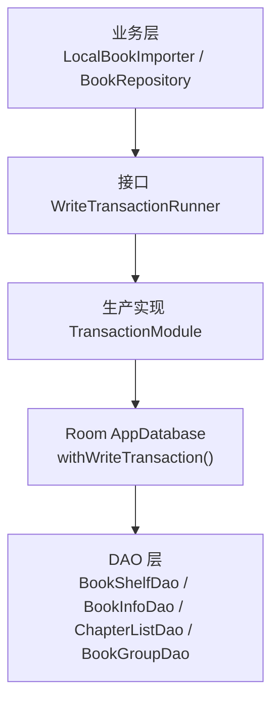
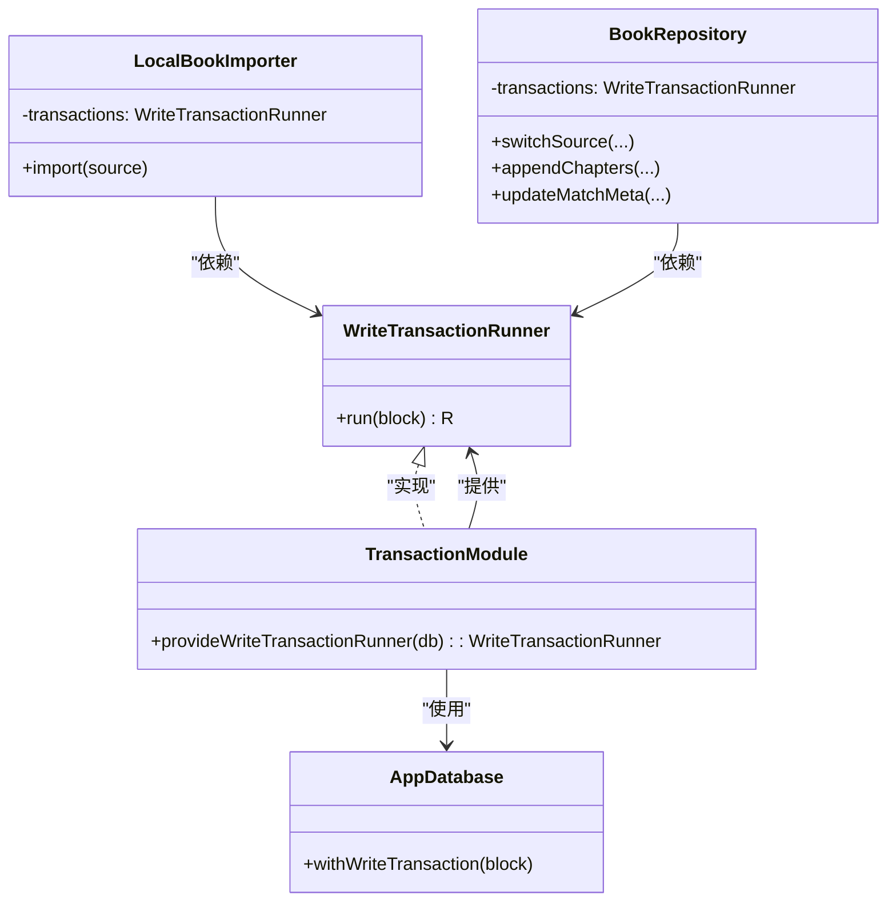
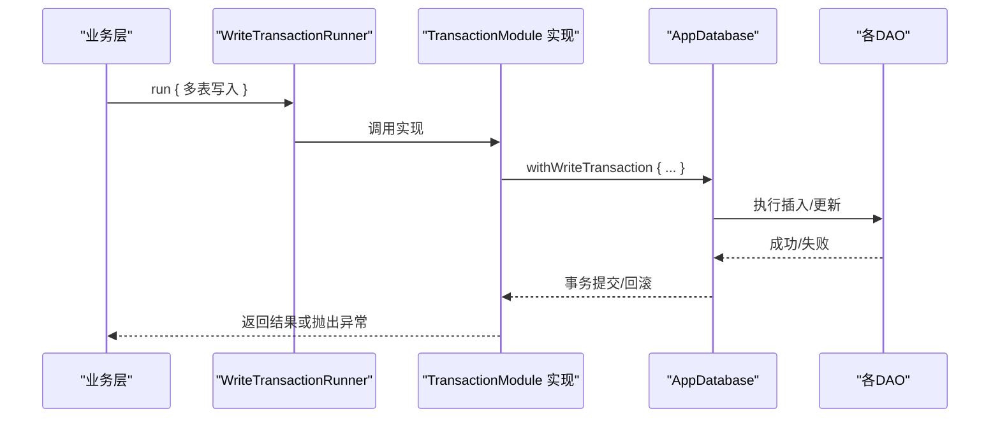
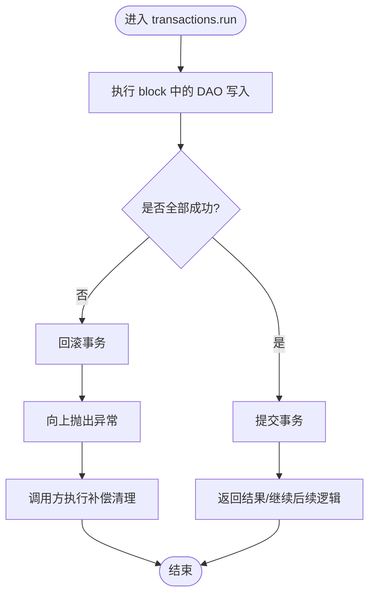

# 事务模块（TransactionModule）

<cite>
**本文引用的文件**
- [TransactionModule.kt](file://lib_book_common/src/main/java/com/ebook/common/di/TransactionModule.kt)
- [WriteTransactionRunner.kt](file://lib_book_common/src/main/java/com/ebook/common/store/WriteTransactionRunner.kt)
- [AppDatabase.kt](file://lib_ebook_db/src/main/java/com/ebook/db/AppDatabase.kt)
- [LocalBookImporter.kt](file://lib_book_common/src/main/java/com/ebook/common/importer/LocalBookImporter.kt)
- [BookRepository.kt](file://lib_book_common/src/main/java/com/ebook/common/repository/BookRepository.kt)
- [FakeDaos.kt](file://lib_book_common/src/test/java/com/ebook/common/repository/FakeDaos.kt)
</cite>

## 目录
1. [引言](#引言)
2. [项目结构](#项目结构)
3. [核心组件](#核心组件)
4. [架构总览](#架构总览)
5. [详细组件分析](#详细组件分析)
6. [依赖关系分析](#依赖关系分析)
7. [性能与内存考量](#性能与内存考量)
8. [协程与异常传播](#协程与异常传播)
9. [常见问题排查](#常见问题排查)
10. [结论](#结论)
11. [附录：使用示例与最佳实践](#附录使用示例与最佳实践)

## 引言
本模块围绕“写事务”的统一抽象与装配展开，目标是为业务层提供一致、可测试、与数据库实现解耦的批量写入能力。通过 Hilt 在单例作用域提供 `WriteTransactionRunner` 的生产实现，将 Room 3 的写事务语义收敛到一处；业务代码仅依赖接口，既能提升可测试性，也能避免各处散落的事务边界导致的一致性问题。

## 项目结构
- 装配层：`TransactionModule`（Hilt 模块，单例），对外暴露 `WriteTransactionRunner`。
- 抽象层：`WriteTransactionRunner`（接口），定义“把一段 suspend 块当作一次写事务提交”的契约。
- 数据层：`AppDatabase`（Room 数据库入口），由生产实现内部调用其写事务方法。
- 使用方：`LocalBookImporter`、`BookRepository` 等将多表写入放入 `transactions.run { ... }` 中，确保原子性与回滚。

图示来源
- [TransactionModule.kt:1-24](file://lib_book_common/src/main/java/com/ebook/common/di/TransactionModule.kt#L1-L24)
- [WriteTransactionRunner.kt:1-13](file://lib_book_common/src/main/java/com/ebook/common/store/WriteTransactionRunner.kt#L1-L13)
- [AppDatabase.kt:40-76](file://lib_ebook_db/src/main/java/com/ebook/db/AppDatabase.kt#L40-L76)

章节来源
- [TransactionModule.kt:1-24](file://lib_book_common/src/main/java/com/ebook/common/di/TransactionModule.kt#L1-L24)
- [WriteTransactionRunner.kt:1-13](file://lib_book_common/src/main/java/com/ebook/common/store/WriteTransactionRunner.kt#L1-L13)
- [AppDatabase.kt:40-76](file://lib_ebook_db/src/main/java/com/ebook/db/AppDatabase.kt#L40-L76)

## 核心组件
- WriteTransactionRunner：一个极简接口，只提供一个泛型 suspend 函数，用于执行一段可能包含多个 DAO 写入的代码块，并以“一次写事务”的方式提交或回滚。
- TransactionModule：Hilt 模块，负责提供 `WriteTransactionRunner` 的单例实现，内部委托给 Room 的写事务方法，屏蔽底层细节。
- AppDatabase：Room 数据库类，承载所有实体与 DAO 暴露点；生产实现在此之上开启写事务。
- 使用者：导入器与仓库类将涉及多表的写操作统一放入 `transactions.run { ... }`，保证一致性。

章节来源
- [WriteTransactionRunner.kt:1-13](file://lib_book_common/src/main/java/com/ebook/common/store/WriteTransactionRunner.kt#L1-L13)
- [TransactionModule.kt:1-24](file://lib_book_common/src/main/java/com/ebook/common/di/TransactionModule.kt#L1-L24)
- [AppDatabase.kt:40-76](file://lib_ebook_db/src/main/java/com/ebook/db/AppDatabase.kt#L40-L76)

## 架构总览
整体采用“接口 + 生产实现 + Hilt 注入”的分层设计：
- 业务层不直接依赖 Room，而是依赖 `WriteTransactionRunner`，从而可在测试中替换为“立即执行”的替身实现，便于纯 JVM 测试。
- 生产实现仅在运行期绑定 Room，集中管理事务边界与模式。
- 所有跨表写路径都经过该接口，确保一致的提交/回滚语义。

图示来源
- [WriteTransactionRunner.kt:1-13](file://lib_book_common/src/main/java/com/ebook/common/store/WriteTransactionRunner.kt#L1-L13)
- [TransactionModule.kt:1-24](file://lib_book_common/src/main/java/com/ebook/common/di/TransactionModule.kt#L1-L24)
- [AppDatabase.kt:40-76](file://lib_ebook_db/src/main/java/com/ebook/db/AppDatabase.kt#L40-L76)
- [LocalBookImporter.kt:44-141](file://lib_book_common/src/main/java/com/ebook/common/importer/LocalBookImporter.kt#L44-L141)
- [BookRepository.kt:68-333](file://lib_book_common/src/main/java/com/ebook/common/repository/BookRepository.kt#L68-L333)

## 详细组件分析

### WriteTransactionRunner 接口
- 职责：定义“以一次写事务执行一段 suspend 代码块”的契约。
- 价值：
  - 统一事务边界：避免业务层各自封装事务导致的风格不一致与遗漏。
  - 可测试性：测试可通过直接执行 block 的替身快速验证流程，无需真实数据库。
- 复杂度：O(1)，无状态接口，唯一方法是挂起式执行块。

章节来源
- [WriteTransactionRunner.kt:1-13](file://lib_book_common/src/main/java/com/ebook/common/store/WriteTransactionRunner.kt#L1-L13)

### TransactionModule（生产实现）
- 职责：在单例作用域提供 `WriteTransactionRunner` 的实现，内部委托给 Room 的写事务方法。
- 特性：
  - 单例：全局共享，减少对象创建开销。
  - 事务模式：由底层 Room API 决定（当前实现指向 IMMEDIATE 语义的写事务）。
- 依赖：`AppDatabase`，仅作为接入点，不持有额外状态。

章节来源
- [TransactionModule.kt:1-24](file://lib_book_common/src/main/java/com/ebook/common/di/TransactionModule.kt#L1-L24)
- [AppDatabase.kt:40-76](file://lib_ebook_db/src/main/java/com/ebook/db/AppDatabase.kt#L40-L76)

### 使用方：LocalBookImporter
- 场景：本地书籍导入时，需要将书架、书籍信息、章节目录、作品分组等多表一次性写入。
- 事务边界：将所有 DAO 写入放在 `transactions.run { ... }` 中，失败时回滚并清理磁盘暂存，避免“库中没有但磁盘有书”的不一致。
- 异常处理：捕获异常后删除临时目录，抛出上层以便调用方处理。

章节来源
- [LocalBookImporter.kt:44-141](file://lib_book_common/src/main/java/com/ebook/common/importer/LocalBookImporter.kt#L44-L141)

### 使用方：BookRepository
- 场景：切换书源、追加章节、更新匹配元数据等多表写操作。
- 事务边界：将相关 DAO 调用包裹在 `transactions.run { ... }`，确保同一逻辑单元内要么全部成功、要么全部回滚。
- 事件发布：事务成功后才发布事件，避免未提交的写被 UI 消费。

章节来源
- [BookRepository.kt:68-333](file://lib_book_common/src/main/java/com/ebook/common/repository/BookRepository.kt#L68-L333)
- [BookRepository.kt:580-590](file://lib_book_common/src/main/java/com/ebook/common/repository/BookRepository.kt#L580-L590)
- [BookRepository.kt:768-778](file://lib_book_common/src/main/java/com/ebook/common/repository/BookRepository.kt#L768-L778)
- [BookRepository.kt:815-825](file://lib_book_common/src/main/java/com/ebook/common/repository/BookRepository.kt#L815-L825)

### 测试替身：DirectTransactionRunner
- 作用：在纯 JVM 测试中直接执行 block，不真正落库，便于快速验证导入/仓库流程。
- 特点：零开销、无事务语义，适合断言行为与副作用顺序。

章节来源
- [FakeDaos.kt:254-256](file://lib_book_common/src/test/java/com/ebook/common/repository/FakeDaos.kt#L254-L256)

## 依赖关系分析
- 松耦合：业务层只依赖 `WriteTransactionRunner`，对 Room 无感知。
- 装配点单一：`TransactionModule` 是唯一装配点，后续若替换底层存储，只需修改该模块。
- 测试友好：测试可通过 `DirectTransactionRunner` 替代生产实现，无需启动完整数据库。

图示来源
- [TransactionModule.kt:17-23](file://lib_book_common/src/main/java/com/ebook/common/di/TransactionModule.kt#L17-L23)
- [AppDatabase.kt:40-76](file://lib_ebook_db/src/main/java/com/ebook/db/AppDatabase.kt#L40-L76)
- [LocalBookImporter.kt:121-132](file://lib_book_common/src/main/java/com/ebook/common/importer/LocalBookImporter.kt#L121-L132)
- [BookRepository.kt:327-333](file://lib_book_common/src/main/java/com/ebook/common/repository/BookRepository.kt#L327-L333)

## 性能与内存考量
- 事务合并：将多次写合并到一次事务，显著减少提交次数与锁竞争。例如导入过程一次性写入多张表，避免逐章提交带来的大量 I/O 与锁开销。
- 批处理：DAO 的批量插入（如 `insertAll`）配合事务能进一步提升吞吐。
- 线程模型：在 IO 调度器上执行事务，避免阻塞主线程。
- 内存占用：事务期间应避免在 block 内构建超大对象；必要时分批写入以降低峰值内存。

[本节为通用指导，不直接分析具体文件]

## 协程与异常传播
- 挂起点：`run` 是 suspend 函数，允许在协程中使用，天然支持取消与超时。
- 异常传播：block 内抛出的异常会向上传播，调用方可据此进行回滚后的补偿（如删除临时文件、清理缓存）。
- 取消安全：取消会在合适的挂起点中断；注意不要在 block 中进行长时间不可取消的操作。
- 事件时机：建议在事务成功后再发送事件，避免 UI 消费未提交的中间状态。

图示来源
- [LocalBookImporter.kt:121-132](file://lib_book_common/src/main/java/com/ebook/common/importer/LocalBookImporter.kt#L121-L132)
- [BookRepository.kt:327-333](file://lib_book_common/src/main/java/com/ebook/common/repository/BookRepository.kt#L327-L333)

## 常见问题排查
- 问题：部分表写入成功，其他表失败导致不一致
  - 现象：书架可见但缺少章节或元数据
  - 定位：确认写入是否在同一 `transactions.run { ... }` 中；检查异常分支是否有补偿清理
  - 修复：将相关 DAO 调用统一放入同一事务块
- 问题：导入过程中断留下孤儿目录
  - 现象：书架为空但磁盘存在残留目录
  - 定位：检查导入路径是否在异常分支清理了暂存目录
  - 修复：确保异常时删除临时目录或调用回收工具清理
- 问题：UI 无法感知书架变动
  - 现象：新增书籍后列表不刷新
  - 定位：确认事件在事务成功后才发布；检查事件订阅是否正确
  - 修复：将事件发布移至事务提交之后

章节来源
- [LocalBookImporter.kt:121-132](file://lib_book_common/src/main/java/com/ebook/common/importer/LocalBookImporter.kt#L121-L132)
- [BookRepository.kt:327-333](file://lib_book_common/src/main/java/com/ebook/common/repository/BookRepository.kt#L327-L333)

## 结论
通过将“写事务”抽象为 `WriteTransactionRunner` 并由 `TransactionModule` 提供生产实现，本项目实现了事务边界的统一管理与解耦。业务层无需关心底层数据库细节，即可获得一致、可测试、高性能的批量写入能力。结合协程的挂起特性与合理的异常处理策略，系统在复杂写入场景下仍能保持数据一致性与良好的用户体验。

[本节为总结性内容，不直接分析具体文件]

## 附录：使用示例与最佳实践
- 在业务层使用事务执行器
  - 将涉及多表的写操作统一放入 `transactions.run { ... }`，确保原子性。
  - 示例路径参考：
    - [导入器多表写入](file://lib_book_common/src/main/java/com/ebook/common/importer/LocalBookImporter.kt#L121-L132)
    - [仓库切换书源事务](file://lib_book_common/src/main/java/com/ebook/common/repository/BookRepository.kt#L327-L333)
    - [仓库追加章节事务](file://lib_book_common/src/main/java/com/ebook/common/repository/BookRepository.kt#L584-L589)
    - [仓库更新匹配元数据事务](file://lib_book_common/src/main/java/com/ebook/common/repository/BookRepository.kt#L820-L825)
- 嵌套事务
  - 若上层已处于事务中，下层再次开启事务通常会被合并为同一事务；请避免不必要的嵌套，保持单一清晰的事务边界。
- 事务回滚
  - 任一 DAO 失败即触发回滚；调用方应在 catch 中执行必要的补偿清理（如删除临时文件、释放资源）。
- 生命周期与内存优化
  - 事务应尽可能短小，避免在 block 中持有大对象；必要时分批写入。
  - 在 IO 调度器执行事务，避免阻塞 UI 线程。
- 协程环境下的最佳实践
  - 使用 suspend 函数表达异步与可取消性；合理设置超时与取消策略。
  - 事件发布置于事务成功后，避免 UI 消费未提交的状态。

章节来源
- [LocalBookImporter.kt:121-132](file://lib_book_common/src/main/java/com/ebook/common/importer/LocalBookImporter.kt#L121-L132)
- [BookRepository.kt:327-333](file://lib_book_common/src/main/java/com/ebook/common/repository/BookRepository.kt#L327-L333)
- [BookRepository.kt:584-589](file://lib_book_common/src/main/java/com/ebook/common/repository/BookRepository.kt#L584-L589)
- [BookRepository.kt:820-825](file://lib_book_common/src/main/java/com/ebook/common/repository/BookRepository.kt#L820-L825)