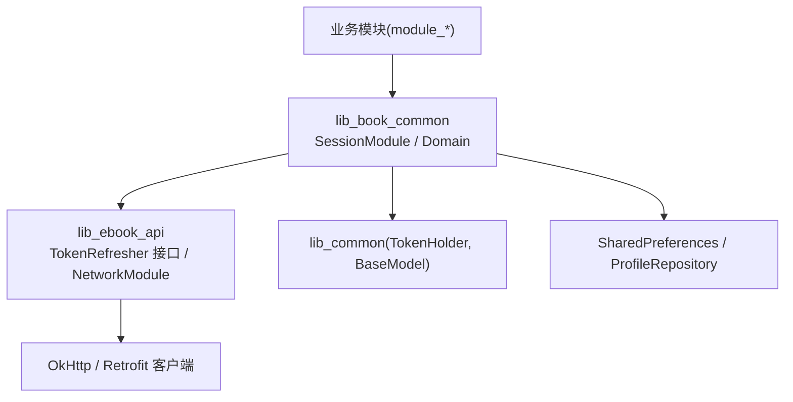
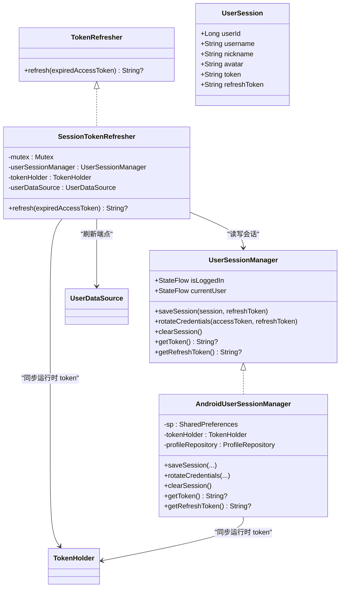
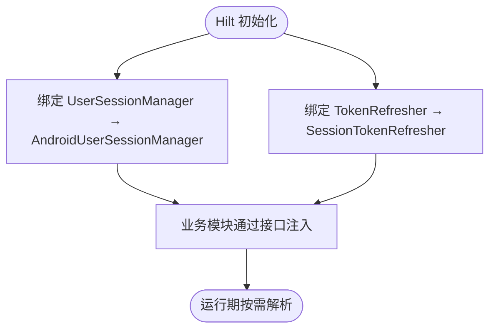
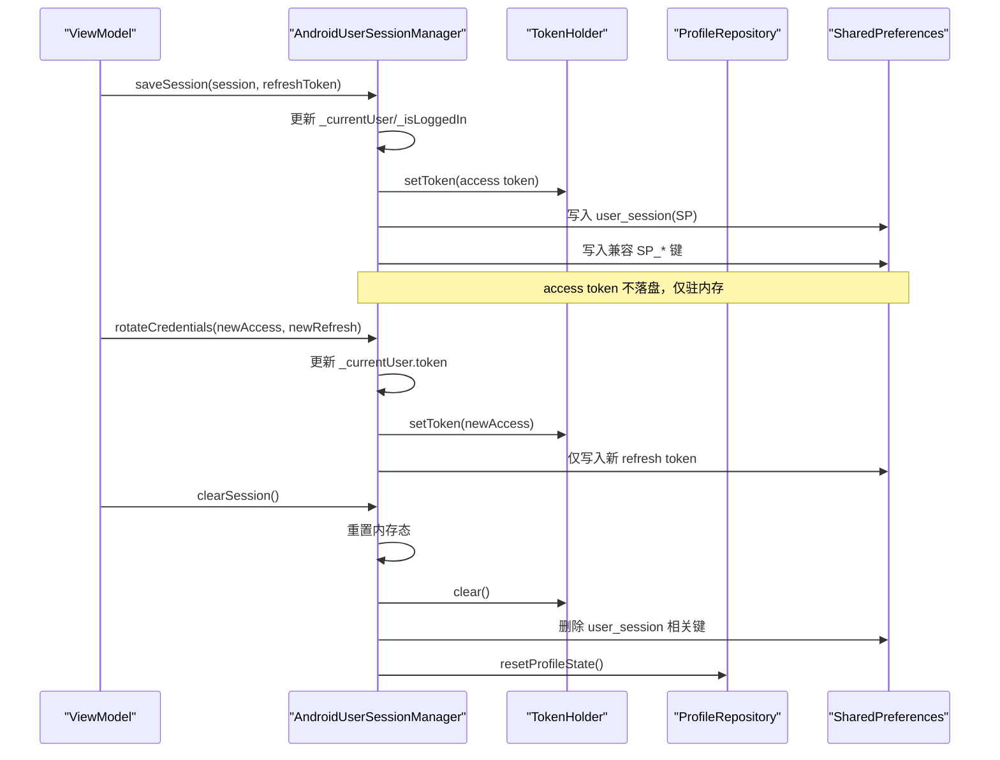
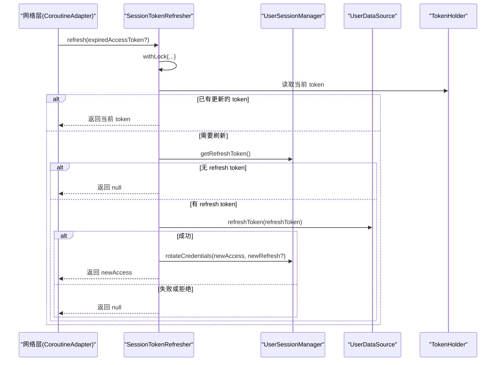

# 会话模块（SessionModule）

<cite>
**本文引用的文件**
- [lib_book_common/src/main/java/com/ebook/common/di/SessionModule.kt](file://lib_book_common/src/main/java/com/ebook/common/di/SessionModule.kt)
- [lib_book_common/src/main/java/com/ebook/common/domain/UserSessionManager.kt](file://lib_book_common/src/main/java/com/ebook/common/domain/UserSessionManager.kt)
- [lib_book_common/src/main/java/com/ebook/common/domain/AndroidUserSessionManager.kt](file://lib_book_common/src/main/java/com/ebook/common/domain/AndroidUserSessionManager.kt)
- [lib_ebook_api/src/main/java/com/ebook/api/auth/TokenRefresher.kt](file://lib_ebook_api/src/main/java/com/ebook/api/auth/TokenRefresher.kt)
- [lib_book_common/src/main/java/com/ebook/common/domain/SessionTokenRefresher.kt](file://lib_book_common/src/main/java/com/ebook/common/domain/SessionTokenRefresher.kt)
- [lib_book_common/src/main/java/com/ebook/common/domain/UserSession.kt](file://lib_book_common/src/main/java/com/ebook/common/domain/UserSession.kt)
- [lib_book_common/src/test/java/com/ebook/common/domain/FakeUserSessionManager.kt](file://lib_book_common/src/test/java/com/ebook/common/domain/FakeUserSessionManager.kt)
- [lib_ebook_api/src/main/java/com/ebook/api/utils/NetworkModule.kt](file://lib_ebook_api/src/main/java/com/ebook/api/utils/NetworkModule.kt)
- [lib_ebook_api/src/main/java/com/ebook/api/utils/CoroutineAdapter.kt](file://lib_ebook_api/src/main/java/com/ebook/api/utils/CoroutineAdapter.kt)
</cite>

## 目录
1. [简介](#简介)
2. [项目结构中的定位](#项目结构中的定位)
3. [核心组件](#核心组件)
4. [架构总览](#架构总览)
5. [详细组件分析](#详细组件分析)
6. [依赖关系与注入装配](#依赖关系与注入装配)
7. [性能与并发特性](#性能与并发特性)
8. [故障排查指南](#故障排查指南)
9. [结论](#结论)
10. [附录：扩展与测试示例路径](#附录：扩展与测试示例路径)

## 简介
本章节聚焦于“会话模块”的依赖注入设计与实现，围绕 SessionModule 在用户会话管理中的核心作用展开：解释 UserSessionManager 与 AndroidUserSessionManager 的绑定、TokenRefresher 与 SessionTokenRefresher 的实现替换；说明双 Token 机制的注入配置、会话状态管理策略、与认证系统的集成方式。同时阐述接口与实现的分离设计、向下注入原则、测试替身替换机制，并给出自定义会话管理器、扩展 Token 刷新逻辑、处理会话过期场景的实践指引，以及与网络拦截器协作、安全考虑和跨模块会话状态同步要点。

## 项目结构中的定位
- 注入装配点位于 lib_book_common 的 Hilt 模块 SessionModule，负责将接口绑定到具体实现。
- 会话领域模型与接口定义在 lib_book_common 的 domain 包；Android 平台实现同样在该包内。
- Token 刷新接口定义在 lib_ebook_api，避免上层对下层产生反向依赖；具体刷新实现下沉到 lib_book_common，汇聚会话持久化与网络端点。
- 网络客户端与白名单在 lib_ebook_api 的 NetworkModule 中提供，确保书源与发布检查使用纯净客户端，不携带 token。



**图表来源**
- [lib_book_common/src/main/java/com/ebook/common/di/SessionModule.kt:13-37](file://lib_book_common/src/main/java/com/ebook/common/di/SessionModule.kt#L13-L37)
- [lib_ebook_api/src/main/java/com/ebook/api/auth/TokenRefresher.kt:1-27](file://lib_ebook_api/src/main/java/com/ebook/api/auth/TokenRefresher.kt#L1-L27)
- [lib_ebook_api/src/main/java/com/ebook/api/utils/NetworkModule.kt:19-72](file://lib_ebook_api/src/main/java/com/ebook/api/utils/NetworkModule.kt#L19-L72)

**小节来源**
- [lib_book_common/src/main/java/com/ebook/common/di/SessionModule.kt:13-37](file://lib_book_common/src/main/java/com/ebook/common/di/SessionModule.kt#L13-L37)
- [lib_ebook_api/src/main/java/com/ebook/api/utils/NetworkModule.kt:19-72](file://lib_ebook_api/src/main/java/com/ebook/api/utils/NetworkModule.kt#L19-L72)

## 核心组件
- UserSessionManager：纯 Kotlin 接口，暴露登录态、当前会话、保存会话、轮换凭证、清除会话、获取 token 等能力，作为认证状态的唯一 seam。
- AndroidUserSessionManager：Android 实现，维护 StateFlow 内存态、持久化至 SharedPreferences、与 TokenHolder 同步运行时 token、兼容旧 LoginInterceptor 的 SP_* 键、清会话时一次性清理三处镜像（内存、SP、ProfileRepository）。
- TokenRefresher：定义在 lib_ebook_api 的刷新接缝，由上层实现以避免反向依赖；触发时机为响应码 A0230 后调用。
- SessionTokenRefresher：实现单飞互斥的静默刷新，读取 refresh token，调用 UserDataSource.refreshToken，成功后通过 UserSessionManager.rotateCredentials 更新双 token，不重建身份。
- UserSession：跨模块 seam 类型，承载用户标识与瞬时 refreshToken（仅登录时使用）。
- FakeUserSessionManager：JVM 测试用的内存实现，保持与生产一致的语义，便于单元测试与 Mock。

**小节来源**
- [lib_book_common/src/main/java/com/ebook/common/domain/UserSessionManager.kt:5-62](file://lib_book_common/src/main/java/com/ebook/common/domain/UserSessionManager.kt#L5-L62)
- [lib_book_common/src/main/java/com/ebook/common/domain/AndroidUserSessionManager.kt:17-162](file://lib_book_common/src/main/java/com/ebook/common/domain/AndroidUserSessionManager.kt#L17-L162)
- [lib_ebook_api/src/main/java/com/ebook/api/auth/TokenRefresher.kt:1-27](file://lib_ebook_api/src/main/java/com/ebook/api/auth/TokenRefresher.kt#L1-L27)
- [lib_book_common/src/main/java/com/ebook/common/domain/SessionTokenRefresher.kt:15-96](file://lib_book_common/src/main/java/com/ebook/common/domain/SessionTokenRefresher.kt#L15-L96)
- [lib_book_common/src/main/java/com/ebook/common/domain/UserSession.kt:1-17](file://lib_book_common/src/main/java/com/ebook/common/domain/UserSession.kt#L1-L17)
- [lib_book_common/src/test/java/com/ebook/common/domain/FakeUserSessionManager.kt:7-72](file://lib_book_common/src/test/java/com/ebook/common/domain/FakeUserSessionManager.kt#L7-L72)

## 架构总览
下图展示了会话模块的关键类及其职责边界与交互关系。



**图表来源**
- [lib_book_common/src/main/java/com/ebook/common/domain/UserSessionManager.kt:5-62](file://lib_book_common/src/main/java/com/ebook/common/domain/UserSessionManager.kt#L5-L62)
- [lib_book_common/src/main/java/com/ebook/common/domain/AndroidUserSessionManager.kt:17-162](file://lib_book_common/src/main/java/com/ebook/common/domain/AndroidUserSessionManager.kt#L17-L162)
- [lib_ebook_api/src/main/java/com/ebook/api/auth/TokenRefresher.kt:1-27](file://lib_ebook_api/src/main/java/com/ebook/api/auth/TokenRefresher.kt#L1-L27)
- [lib_book_common/src/main/java/com/ebook/common/domain/SessionTokenRefresher.kt:15-96](file://lib_book_common/src/main/java/com/ebook/common/domain/SessionTokenRefresher.kt#L15-L96)
- [lib_book_common/src/main/java/com/ebook/common/domain/UserSession.kt:1-17](file://lib_book_common/src/main/java/com/ebook/common/domain/UserSession.kt#L1-L17)

## 详细组件分析

### SessionModule：注入装配与向下注入原则
- 将 UserSessionManager 接口绑定到 AndroidUserSessionManager 实现。
- 将 TokenRefresher 接口绑定到 SessionTokenRefresher 实现。
- 两者均以 @Singleton 生命周期提供，确保全应用共享。
- 设计遵循“向下注入”原则：接口定义在更底层（lib_ebook_api），实现放在能同时访问会话持久化与网络端点的上层（lib_book_common），避免反向依赖。



**图表来源**
- [lib_book_common/src/main/java/com/ebook/common/di/SessionModule.kt:13-37](file://lib_book_common/src/main/java/com/ebook/common/di/SessionModule.kt#L13-L37)

**小节来源**
- [lib_book_common/src/main/java/com/ebook/common/di/SessionModule.kt:13-37](file://lib_book_common/src/main/java/com/ebook/common/di/SessionModule.kt#L13-L37)

### UserSessionManager 与 AndroidUserSessionManager：会话状态管理
- 状态暴露：isLoggedIn、currentUser 均为 StateFlow，供 UI/ViewModel 订阅。
- 保存会话：写入 user_session SP、设置登录态、同步 token 到 TokenHolder，并兼容旧 LoginInterceptor 的 SP_* 键。
- 轮换凭证：只更新 access token（内存）与 refresh token（落盘），不触碰用户身份字段。
- 清除会话：一次性清理三处镜像——内存态、user_session SP、ProfileRepository 的进程内身份流；同时清理 spUtils 兼容键。
- 启动恢复：从持久化恢复 token 到 TokenHolder，并执行一次性安全债清理（移除遗留明文密码键）。



**图表来源**
- [lib_book_common/src/main/java/com/ebook/common/domain/AndroidUserSessionManager.kt:59-133](file://lib_book_common/src/main/java/com/ebook/common/domain/AndroidUserSessionManager.kt#L59-L133)

**小节来源**
- [lib_book_common/src/main/java/com/ebook/common/domain/UserSessionManager.kt:5-62](file://lib_book_common/src/main/java/com/ebook/common/domain/UserSessionManager.kt#L5-L62)
- [lib_book_common/src/main/java/com/ebook/common/domain/AndroidUserSessionManager.kt:17-162](file://lib_book_common/src/main/java/com/ebook/common/domain/AndroidUserSessionManager.kt#L17-L162)

### TokenRefresher 与 SessionTokenRefresher：双 Token 静默刷新
- 接口位置：TokenRefresher 定义在 lib_ebook_api，避免上层依赖下层。
- 触发时机：网络层 CoroutineAdapter 检测响应码 A0230 后调用。
- 刷新流程：
  - 单飞互斥：Mutex 串行化刷新；进入锁后对比触发 token 与当前 token，若不同则复用已刷新的 token。
  - 读取 refresh token：通过 UserSessionManager.getRefreshToken。
  - 调用刷新端点：直接调 UserDataSource.refreshToken，不经 CoroutineAdapter，避免死循环。
  - 成功处理：通过 UserSessionManager.rotateCredentials 更新双 token；保留旧 refresh token 当服务端未返回新值。
  - 取消与异常：CancellationException 原样上抛，其他异常记录日志并返回 null。



**图表来源**
- [lib_ebook_api/src/main/java/com/ebook/api/auth/TokenRefresher.kt:1-27](file://lib_ebook_api/src/main/java/com/ebook/api/auth/TokenRefresher.kt#L1-L27)
- [lib_book_common/src/main/java/com/ebook/common/domain/SessionTokenRefresher.kt:41-96](file://lib_book_common/src/main/java/com/ebook/common/domain/SessionTokenRefresher.kt#L41-L96)
- [lib_book_common/src/main/java/com/ebook/common/domain/AndroidUserSessionManager.kt:87-98](file://lib_book_common/src/main/java/com/ebook/common/domain/AndroidUserSessionManager.kt#L87-L98)

**小节来源**
- [lib_ebook_api/src/main/java/com/ebook/api/auth/TokenRefresher.kt:1-27](file://lib_ebook_api/src/main/java/com/ebook/api/auth/TokenRefresher.kt#L1-L27)
- [lib_book_common/src/main/java/com/ebook/common/domain/SessionTokenRefresher.kt:15-96](file://lib_book_common/src/main/java/com/ebook/common/domain/SessionTokenRefresher.kt#L15-L96)
- [lib_book_common/src/main/java/com/ebook/common/domain/AndroidUserSessionManager.kt:87-98](file://lib_book_common/src/main/java/com/ebook/common/domain/AndroidUserSessionManager.kt#L87-L98)

### 双 Token 机制与安全考量
- access token：仅驻内存（TokenHolder），冷启动为空，首个请求经 A0230 静默刷新补全；不落盘以降低泄露风险。
- refresh token：持久化到 user_session SP，用于刷新 access token；刷新成功后立即替换旧值。
- 安全约束：
  - 书源与发布检查使用纯净 OkHttpClient（@Named("source")/@Named("release")），不携带 token。
  - 刷新链路不套 CoroutineAdapter，避免刷新失败再次触发刷新形成死循环。
  - 清会话一次性清理三处镜像，防止“已登出仍被放行”或“我的页显示上一个身份”。

**小节来源**
- [lib_book_common/src/main/java/com/ebook/common/domain/AndroidUserSessionManager.kt:17-162](file://lib_book_common/src/main/java/com/ebook/common/domain/AndroidUserSessionManager.kt#L17-L162)
- [lib_book_common/src/main/java/com/ebook/common/domain/SessionTokenRefresher.kt:15-96](file://lib_book_common/src/main/java/com/ebook/common/domain/SessionTokenRefresher.kt#L15-L96)
- [lib_ebook_api/src/main/java/com/ebook/api/utils/NetworkModule.kt:35-72](file://lib_ebook_api/src/main/java/com/ebook/api/utils/NetworkModule.kt#L35-L72)

### 与认证系统的集成
- 网络层：CoroutineAdapter 在检测到 A0230 时调用 TokenRefresher.refresh；刷新成功后重放原请求（由上层封装）。
- 拦截器：AuthInterceptor 从 TokenHolder 读取当前 token 附加到请求头；仅对白名单 host 附加。
- 会话状态：AndroidUserSessionManager 在启动时恢复 token 到 TokenHolder；登录/登出/刷新时同步 TokenHolder 与持久化。

**小节来源**
- [lib_ebook_api/src/main/java/com/ebook/api/utils/CoroutineAdapter.kt](file://lib_ebook_api/src/main/java/com/ebook/api/utils/CoroutineAdapter.kt)
- [lib_book_common/src/main/java/com/ebook/common/domain/AndroidUserSessionManager.kt:45-52](file://lib_book_common/src/main/java/com/ebook/common/domain/AndroidUserSessionManager.kt#L45-L52)

### 跨模块的会话状态同步
- 三处镜像必须保持一致：
  ① 内存态（StateFlow + TokenHolder）
  ② user_session SP
  ③ ProfileRepository 的进程内身份流
- 清会话统一调用 UserSessionManager.clearSession()，禁止调用方自行补调 ProfileRepository 清理方法。

**小节来源**
- [lib_book_common/src/main/java/com/ebook/common/domain/AndroidUserSessionManager.kt:100-133](file://lib_book_common/src/main/java/com/ebook/common/domain/AndroidUserSessionManager.kt#L100-L133)

## 依赖关系与注入装配
- 注入装配：SessionModule 将接口绑定到实现，生命周期为 Singleton。
- 依赖方向：lib_book_common 依赖 lib_ebook_api（接口），避免反向依赖；实现同时依赖会话持久化与网络端点。
- 测试替换：FakeUserSessionManager 可替换 AndroidUserSessionManager，用于 JVM 测试与 Mock。

```mermaid
graph LR
  SM["SessionModule"] -->|@Binds| UM["UserSessionManager"]
  SM -->|@Binds| TRF["TokenRefresher"]
  UM -->|实现| AUM["AndroidUserSessionManager"]
  TRF -->|实现| STR["SessionTokenRefresher"]
  STR --> UDM["UserDataSource"]
  AUM --> TH["TokenHolder"]
  AUM --> PR["ProfileRepository"]
```

**图表来源**
- [lib_book_common/src/main/java/com/ebook/common/di/SessionModule.kt:13-37](file://lib_book_common/src/main/java/com/ebook/common/di/SessionModule.kt#L13-L37)
- [lib_book_common/src/main/java/com/ebook/common/domain/SessionTokenRefresher.kt:41-46](file://lib_book_common/src/main/java/com/ebook/common/domain/SessionTokenRefresher.kt#L41-L46)
- [lib_book_common/src/main/java/com/ebook/common/domain/AndroidUserSessionManager.kt:28-33](file://lib_book_common/src/main/java/com/ebook/common/domain/AndroidUserSessionManager.kt#L28-L33)

**小节来源**
- [lib_book_common/src/main/java/com/ebook/common/di/SessionModule.kt:13-37](file://lib_book_common/src/main/java/com/ebook/common/di/SessionModule.kt#L13-L37)
- [lib_book_common/src/test/java/com/ebook/common/domain/FakeUserSessionManager.kt:7-72](file://lib_book_common/src/test/java/com/ebook/common/domain/FakeUserSessionManager.kt#L7-L72)

## 性能与并发特性
- 刷新单飞：Mutex 串行化刷新，避免并发刷新导致旧 refresh token 失效后的失败。
- 冷启动优化：access token 冷启动为空，首个请求经 A0230 静默刷新，减少不必要的启动开销。
- 最小化 I/O：rotateCredentials 仅写入 refresh token，避免频繁写盘。
- 内存态优先：UI 通过 StateFlow 观察登录态与会话变化，避免重复查询持久化。

**小节来源**
- [lib_book_common/src/main/java/com/ebook/common/domain/SessionTokenRefresher.kt:48-96](file://lib_book_common/src/main/java/com/ebook/common/domain/SessionTokenRefresher.kt#L48-L96)
- [lib_book_common/src/main/java/com/ebook/common/domain/AndroidUserSessionManager.kt:59-98](file://lib_book_common/src/main/java/com/ebook/common/domain/AndroidUserSessionManager.kt#L59-L98)

## 故障排查指南
- 现象：页面不闪退但数据永远加载不出来
  - 可能原因：A0230 刷新失败且未正确处理；或 mock 资产与 DTO 形态不一致导致反序列化异常被吞。
  - 排查建议：检查 CoroutineAdapter 是否误套刷新链路；确认 UserDataSource.refreshToken 返回值；核对 mock 资产契约。
- 现象：会话已过期但“我的”页仍显示上一个身份
  - 可能原因：清会话未调用 ProfileRepository.resetProfileState() 或调用方自行清理不完整。
  - 排查建议：统一通过 UserSessionManager.clearSession() 清理三处镜像。
- 现象：刷新后仍报 A0230
  - 可能原因：refresh token 未正确替换；或刷新链路被 CoroutineAdapter 包裹形成死循环。
  - 排查建议：确认 rotateCredentials 落盘新 refresh token；刷新调用不经过 safeApiCall。

**小节来源**
- [lib_book_common/src/main/java/com/ebook/common/domain/SessionTokenRefresher.kt:66-90](file://lib_book_common/src/main/java/com/ebook/common/domain/SessionTokenRefresher.kt#L66-L90)
- [lib_book_common/src/main/java/com/ebook/common/domain/AndroidUserSessionManager.kt:111-133](file://lib_book_common/src/main/java/com/ebook/common/domain/AndroidUserSessionManager.kt#L111-L133)

## 结论
SessionModule 通过清晰的接口与实现分离、向下注入原则以及严格的会话状态管理，构建了稳健的双 Token 认证体系。UserSessionManager 与 AndroidUserSessionManager 负责会话生命周期与多镜像同步；TokenRefresher 与 SessionTokenRefresher 提供安全的静默刷新能力；NetworkModule 保证第三方请求不携带敏感信息。该设计在可测试性、安全性与性能之间取得平衡，并为跨模块协作提供了稳定的 seam。

## 附录：扩展与测试示例路径
- 自定义会话管理器
  - 参考：实现 UserSessionManager 接口，保持 StateFlow 语义与 TokenHolder 同步；替换绑定见 [SessionModule](file://lib_book_common/src/main/java/com/ebook/common/di/SessionModule.kt#L26-L37)。
  - 测试替身：使用 [FakeUserSessionManager](file://lib_book_common/src/test/java/com/ebook/common/domain/FakeUserSessionManager.kt#L7-L72) 进行 JVM 测试。
- 扩展 Token 刷新逻辑
  - 参考：在 [SessionTokenRefresher](file://lib_book_common/src/main/java/com/ebook/common/domain/SessionTokenRefresher.kt#L41-L96) 中调整刷新策略，保持单飞互斥与不套 CoroutineAdapter 的原则。
  - 注入：通过 SessionModule 的 @Binds 替换实现。
- 处理会话过期场景
  - 参考：网络层 A0230 触发刷新；刷新失败后由上层统一上报失败并引导重新登录（见 ADR-0010）。
  - 清会话：统一调用 [AndroidUserSessionManager.clearSession](file://lib_book_common/src/main/java/com/ebook/common/domain/AndroidUserSessionManager.kt#L111-L133)。
- 与网络拦截器协作
  - 参考：[NetworkModule](file://lib_ebook_api/src/main/java/com/ebook/api/utils/NetworkModule.kt#L35-L72) 提供纯净客户端；[TokenHolder](file://lib_book_common/src/main/java/com/ebook/common/domain/AndroidUserSessionManager.kt#L45-L52) 提供运行时 token。
- 跨模块会话状态同步
  - 参考：确保三处镜像一致；清会话时调用 [resetProfileState](file://lib_book_common/src/main/java/com/ebook/common/domain/AndroidUserSessionManager.kt#L130-L133)。