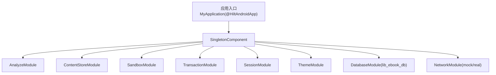
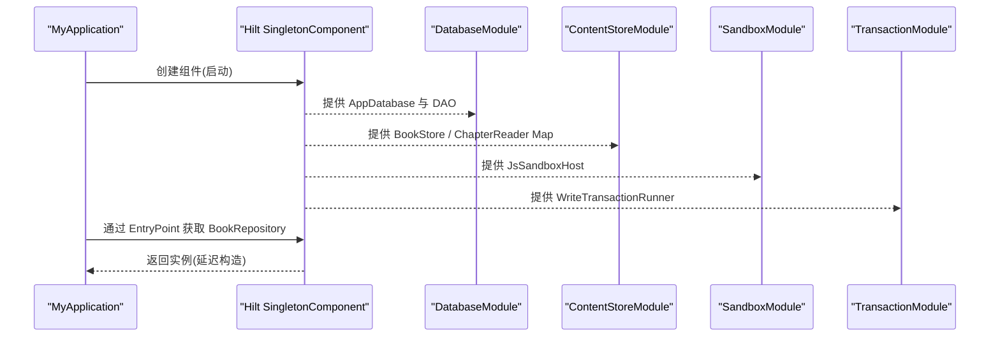
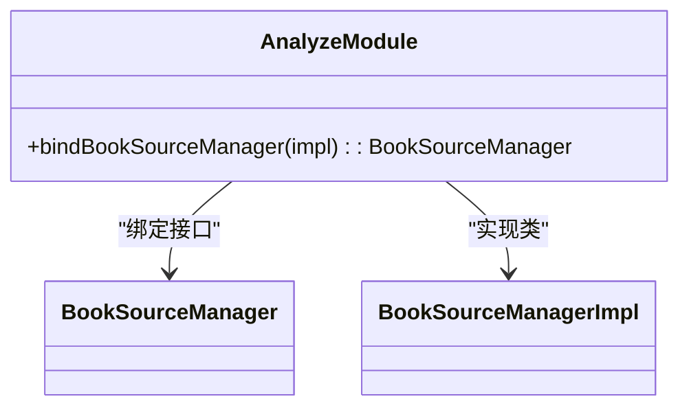
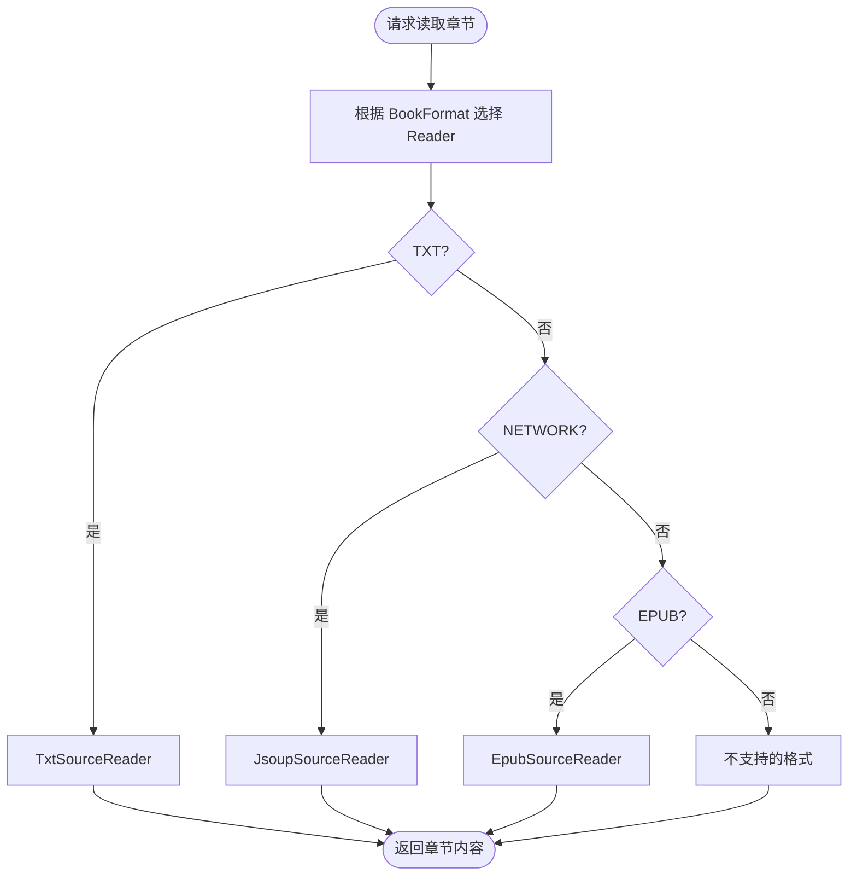
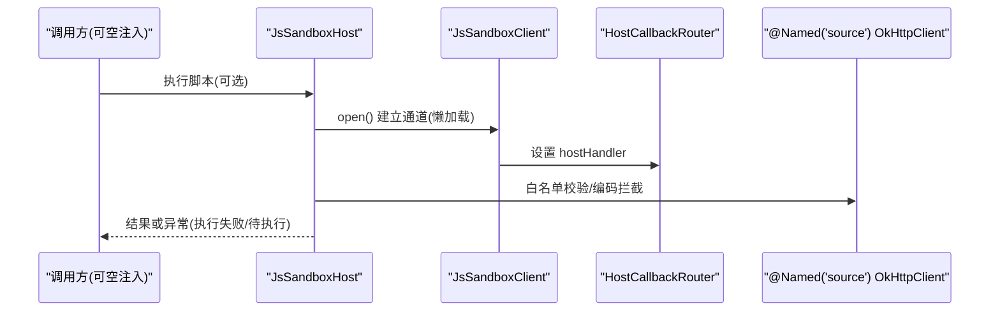
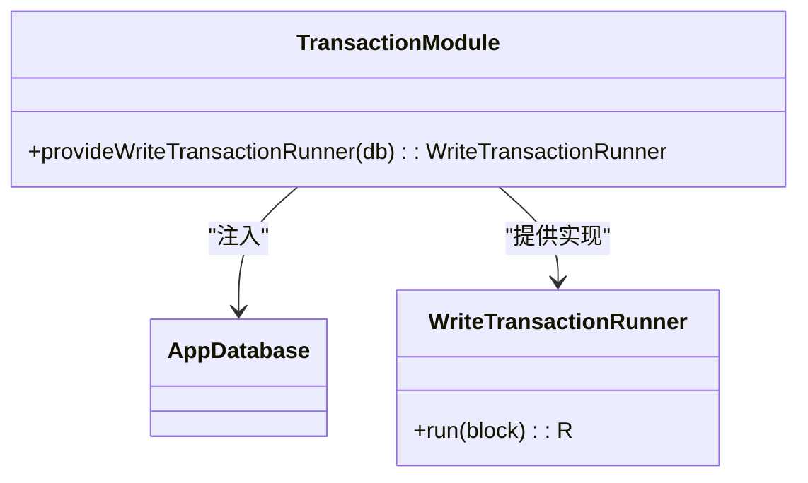
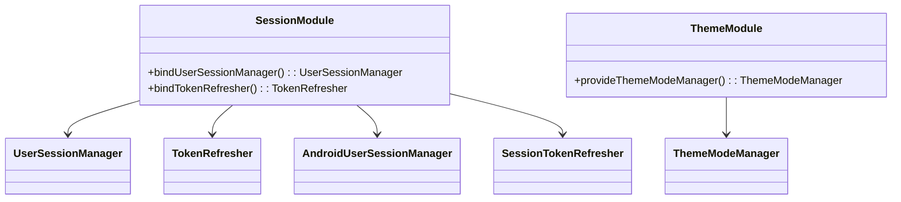
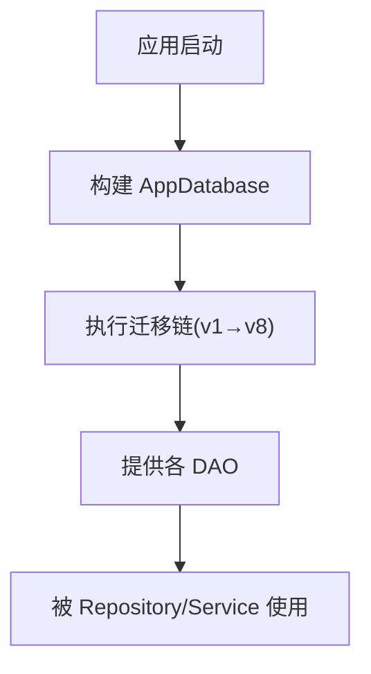
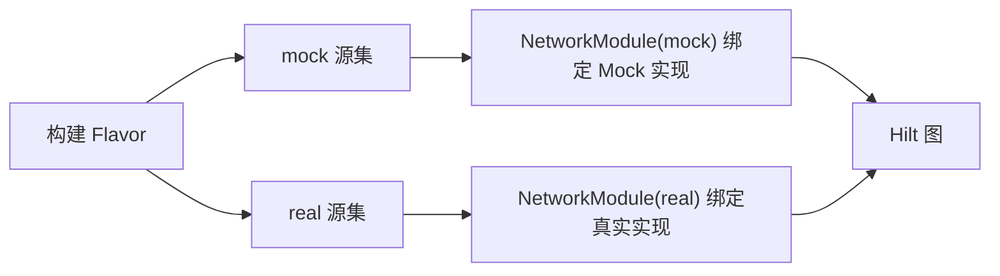
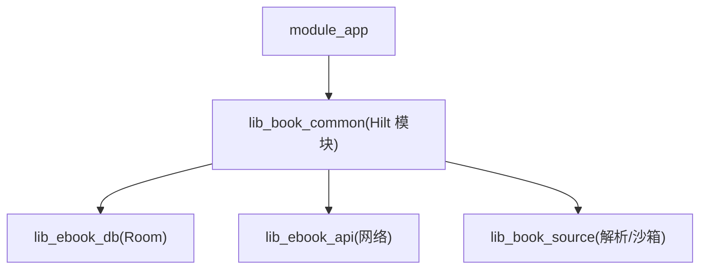

# 依赖注入配置

<cite>
**本文引用的文件**   
- [MyApplication.kt](file://module_app/src/main/java/com/ebook/MyApplication.kt)
- [AnalyzeModule.kt](file://lib_book_common/src/main/java/com/ebook/common/di/AnalyzeModule.kt)
- [ContentStoreModule.kt](file://lib_book_common/src/main/java/com/ebook/common/di/ContentStoreModule.kt)
- [SandboxModule.kt](file://lib_book_common/src/main/java/com/ebook/common/di/SandboxModule.kt)
- [TransactionModule.kt](file://lib_book_common/src/main/java/com/ebook/common/di/TransactionModule.kt)
- [ThemeModule.kt](file://lib_book_common/src/main/java/com/ebook/common/di/ThemeModule.kt)
- [SessionModule.kt](file://lib_book_common/src/main/java/com/ebook/common/di/SessionModule.kt)
- [DatabaseModule.kt](file://lib_ebook_db/src/main/java/com/ebook/db/di/DatabaseModule.kt)
- [NetworkModule (mock).kt](file://module_app/src/mock/java/com/ebook/di/NetworkModule.kt)
- [NetworkModule (real).kt](file://module_app/src/real/java/com/ebook/di/NetworkModule.kt)
</cite>

## 目录
1. [简介](#简介)
2. [项目结构](#项目结构)
3. [核心组件](#核心组件)
4. [架构总览](#架构总览)
5. [详细组件分析](#详细组件分析)
6. [依赖关系分析](#依赖关系分析)
7. [性能与生命周期](#性能与生命周期)
8. [故障排查](#故障排查)
9. [结论](#结论)
10. [附录：实践指南](#附录实践指南)

## 简介
本文件聚焦项目的依赖注入（Hilt）配置，围绕模块组织、关键绑定、条件注入、测试替身、生命周期管理、循环依赖检测与解决、以及性能优化策略进行系统化说明。重点覆盖以下模块的职责与交互：
- AnalyzeModule：书源解析器的注册与接口绑定
- ContentStoreModule：内容存储（BookStore、ChapterReader 映射等）的配置
- SandboxModule：脚本沙箱环境搭建与进程间连接
- TransactionModule：写事务管理器绑定（Room 3 withWriteTransaction）
- SessionModule、ThemeModule、DatabaseModule：会话、主题、数据库的装配
- NetworkModule（mock/real）：通过 flavor source set 实现条件注入

## 项目结构
本项目采用多模块架构，Hilt 模块按职责分布在共享库与业务模块中：
- lib_book_common：通用 Hilt 模块（解析器、内容存储、沙箱、事务、会话、主题）
- lib_ebook_db：Room 数据库及 DAO 提供
- module_app：应用入口（@HiltAndroidApp），并暴露 EntryPoint 以延迟获取重对象
- module_app 的 mock/real flavor：条件注入网络层实现

**图表来源**
- [MyApplication.kt:19-61](file://module_app/src/main/java/com/ebook/MyApplication.kt#L19-L61)
- [AnalyzeModule.kt:11-18](file://lib_book_common/src/main/java/com/ebook/common/di/AnalyzeModule.kt#L11-L18)
- [ContentStoreModule.kt:27-87](file://lib_book_common/src/main/java/com/ebook/common/di/ContentStoreModule.kt#L27-L87)
- [SandboxModule.kt:29-56](file://lib_book_common/src/main/java/com/ebook/common/di/SandboxModule.kt#L29-L56)
- [TransactionModule.kt:13-24](file://lib_book_common/src/main/java/com/ebook/common/di/TransactionModule.kt#L13-L24)
- [SessionModule.kt:22-37](file://lib_book_common/src/main/java/com/ebook/common/di/SessionModule.kt#L22-L37)
- [ThemeModule.kt:17-26](file://lib_book_common/src/main/java/com/ebook/common/di/ThemeModule.kt#L17-L26)
- [DatabaseModule.kt:25-243](file://lib_ebook_db/src/main/java/com/ebook/db/di/DatabaseModule.kt#L25-L243)
- [NetworkModule (mock).kt:26-37](file://module_app/src/mock/java/com/ebook/di/NetworkModule.kt#L26-L37)
- [NetworkModule (real).kt](file://module_app/src/real/java/com/ebook/di/NetworkModule.kt)

**章节来源**
- [MyApplication.kt:19-61](file://module_app/src/main/java/com/ebook/MyApplication.kt#L19-L61)

## 核心组件
- AnalyzeModule：将 BookSourceManagerImpl 绑定到 BookSourceManager 接口，供解析链使用
- ContentStoreModule：提供 BookStore、ChapterSplitter、ChapterContentCache；按 BookFormat 路由 ChapterReader；导入期 scratch 目录
- SandboxModule：提供 JsSandboxHost，内含 JsSandboxClient、HostCallbackRouter、OkHttpClient 纯净客户端
- TransactionModule：提供 WriteTransactionRunner，封装 Room 3 写事务
- SessionModule：绑定 UserSessionManager 与 TokenRefresher 的实现
- ThemeModule：提供 ThemeModeManager
- DatabaseModule：提供 AppDatabase 与各 DAO
- NetworkModule（mock/real）：按 flavor 绑定数据源到接口

**章节来源**
- [AnalyzeModule.kt:11-18](file://lib_book_common/src/main/java/com/ebook/common/di/AnalyzeModule.kt#L11-L18)
- [ContentStoreModule.kt:27-87](file://lib_book_common/src/main/java/com/ebook/common/di/ContentStoreModule.kt#L27-L87)
- [SandboxModule.kt:29-56](file://lib_book_common/src/main/java/com/ebook/common/di/SandboxModule.kt#L29-L56)
- [TransactionModule.kt:13-24](file://lib_book_common/src/main/java/com/ebook/common/di/TransactionModule.kt#L13-L24)
- [SessionModule.kt:22-37](file://lib_book_common/src/main/java/com/ebook/common/di/SessionModule.kt#L22-L37)
- [ThemeModule.kt:17-26](file://lib_book_common/src/main/java/com/ebook/common/di/ThemeModule.kt#L17-L26)
- [DatabaseModule.kt:25-243](file://lib_ebook_db/src/main/java/com/ebook/db/di/DatabaseModule.kt#L25-L243)
- [NetworkModule (mock).kt:26-37](file://module_app/src/mock/java/com/ebook/di/NetworkModule.kt#L26-L37)
- [NetworkModule (real).kt](file://module_app/src/real/java/com/ebook/di/NetworkModule.kt)

## 架构总览
Hilt 在 Application 启动时构建 SingletonComponent，各 @Module 在该作用域内提供单例对象。应用入口通过 EntryPoint 延迟获取重对象（避免在隔离进程提前初始化）。

**图表来源**
- [MyApplication.kt:19-61](file://module_app/src/main/java/com/ebook/MyApplication.kt#L19-L61)
- [DatabaseModule.kt:192-208](file://lib_ebook_db/src/main/java/com/ebook/db/di/DatabaseModule.kt#L192-L208)
- [ContentStoreModule.kt:31-87](file://lib_book_common/src/main/java/com/ebook/common/di/ContentStoreModule.kt#L31-L87)
- [SandboxModule.kt:33-56](file://lib_book_common/src/main/java/com/ebook/common/di/SandboxModule.kt#L33-L56)
- [TransactionModule.kt:17-24](file://lib_book_common/src/main/java/com/ebook/common/di/TransactionModule.kt#L17-L24)

## 详细组件分析

### AnalyzeModule：分析器注册
- 职责：将 BookSourceManagerImpl 绑定到 BookSourceManager 接口，使解析链可通过接口解耦使用
- 作用域：SingletonComponent 单例
- 关键点：使用 @Binds + @Singleton，避免重复实例化

**图表来源**
- [AnalyzeModule.kt:11-18](file://lib_book_common/src/main/java/com/ebook/common/di/AnalyzeModule.kt#L11-L18)

**章节来源**
- [AnalyzeModule.kt:11-18](file://lib_book_common/src/main/java/com/ebook/common/di/AnalyzeModule.kt#L11-L18)

### ContentStoreModule：内容存储配置
- 职责：
  - 提供 BookStore（基于 filesDir/books）
  - 提供 ChapterSplitter、ChapterContentCache
  - 提供导入期 scratch 目录（带自定义限定符）
  - 提供按 BookFormat 路由的 ChapterReader Map（TXT/NETWORK/EPUB）
  - 提供导入链路专用 SourceReader Map（仅本地格式）
- 作用域：SingletonComponent 单例
- 设计要点：
  - 唯一一次 Context→File 转换，便于测试与无 UI 运行
  - 开闭原则：新增格式只需修改 map 定义，仓库侧无需分支

**图表来源**
- [ContentStoreModule.kt:60-87](file://lib_book_common/src/main/java/com/ebook/common/di/ContentStoreModule.kt#L60-L87)

**章节来源**
- [ContentStoreModule.kt:27-87](file://lib_book_common/src/main/java/com/ebook/common/di/ContentStoreModule.kt#L27-L87)

### SandboxModule：沙箱环境搭建
- 职责：提供 JsSandboxHost，包含：
  - JsSandboxClient（负责与 :js 进程通信）
  - HostCallbackRouter（回调路由）
  - OkHttpClient 纯净客户端（@Named("source")）
- 作用域：SingletonComponent 单例
- 关键点：
  - 首次执行时才建立进程连接，冷启动零额外开销
  - 注入方使用可空参数，未装配或失败时走“JS 待执行”原行为
  - 转子必须在客户端之前构建，确保回调路由一致

**图表来源**
- [SandboxModule.kt:33-56](file://lib_book_common/src/main/java/com/ebook/common/di/SandboxModule.kt#L33-L56)

**章节来源**
- [SandboxModule.kt:29-56](file://lib_book_common/src/main/java/com/ebook/common/di/SandboxModule.kt#L29-L56)

### TransactionModule：事务管理器绑定
- 职责：提供 WriteTransactionRunner，封装 Room 3 的 withWriteTransaction 写事务
- 作用域：SingletonComponent 单例
- 关键点：统一写事务入口，保证并发写入一致性

**图表来源**
- [TransactionModule.kt:13-24](file://lib_book_common/src/main/java/com/ebook/common/di/TransactionModule.kt#L13-L24)
- [DatabaseModule.kt:192-208](file://lib_ebook_db/src/main/java/com/ebook/db/di/DatabaseModule.kt#L192-L208)

**章节来源**
- [TransactionModule.kt:13-24](file://lib_book_common/src/main/java/com/ebook/common/di/TransactionModule.kt#L13-L24)

### SessionModule 与 ThemeModule：会话与主题
- SessionModule：
  - 绑定 UserSessionManager → AndroidUserSessionManager
  - 绑定 TokenRefresher → SessionTokenRefresher
- ThemeModule：
  - 提供 ThemeModeManager（依赖 Application）

**图表来源**
- [SessionModule.kt:22-37](file://lib_book_common/src/main/java/com/ebook/common/di/SessionModule.kt#L22-L37)
- [ThemeModule.kt:17-26](file://lib_book_common/src/main/java/com/ebook/common/di/ThemeModule.kt#L17-L26)

**章节来源**
- [SessionModule.kt:22-37](file://lib_book_common/src/main/java/com/ebook/common/di/SessionModule.kt#L22-L37)
- [ThemeModule.kt:17-26](file://lib_book_common/src/main/java/com/ebook/common/di/ThemeModule.kt#L17-L26)

### DatabaseModule：数据库装配
- 职责：提供 AppDatabase 及各 DAO；声明迁移链
- 关键点：
  - 使用 BundledSQLiteDriver
  - 迁移链覆盖 v1→v8，含表增删列、数据清理等
  - DAO 提供点明确，便于上层依赖

**图表来源**
- [DatabaseModule.kt:25-243](file://lib_ebook_db/src/main/java/com/ebook/db/di/DatabaseModule.kt#L25-L243)

**章节来源**
- [DatabaseModule.kt:25-243](file://lib_ebook_db/src/main/java/com/ebook/db/di/DatabaseModule.kt#L25-L243)

### 条件注入：NetworkModule（mock/real）
- 通过 product flavor 的 source set 实现条件注入：
  - mock flavor：NetworkModule 绑定 UserDataSource/CommentDataSource/ReleaseDataSource 到内存实现
  - real flavor：NetworkModule 绑定真实网络实现
- 优势：同一接口在不同构建态切换实现，无需运行时判断

**图表来源**
- [NetworkModule (mock).kt:26-37](file://module_app/src/mock/java/com/ebook/di/NetworkModule.kt#L26-L37)
- [NetworkModule (real).kt](file://module_app/src/real/java/com/ebook/di/NetworkModule.kt)

**章节来源**
- [NetworkModule (mock).kt:26-37](file://module_app/src/mock/java/com/ebook/di/NetworkModule.kt#L26-L37)
- [NetworkModule (real).kt](file://module_app/src/real/java/com/ebook/di/NetworkModule.kt)

## 依赖关系分析
- 单向依赖清晰：
  - 业务模块 → lib_book_common（Hilt 模块）
  - lib_book_common → lib_ebook_db（Room DAO）
  - lib_book_common → lib_ebook_api（网络接口/实体）
- 模块化注入原则：
  - 每个模块只关心自身提供的接口与实现
  - 通过 @Binds/@Provides 显式装配，避免隐式耦合
- 循环依赖检测：
  - 当前模块划分已规避循环依赖（如 lib_book_source 无 Hilt/KSP，由 lib_book_common 提供沙箱装配）
  - 若新增模块，需遵循“上层依赖下层，不反向依赖”的原则

**图表来源**
- [MyApplication.kt:19-61](file://module_app/src/main/java/com/ebook/MyApplication.kt#L19-L61)
- [DatabaseModule.kt:25-243](file://lib_ebook_db/src/main/java/com/ebook/db/di/DatabaseModule.kt#L25-L243)

**章节来源**
- [MyApplication.kt:19-61](file://module_app/src/main/java/com/ebook/MyApplication.kt#L19-L61)

## 性能与生命周期
- 单例与多例：
  - 所有 Hilt 模块均安装在 SingletonComponent，提供全局单例
  - 如需多例，可使用 @PerActivity/@PerFragment 等新作用域（当前未见使用）
- 条件注入：
  - 通过 flavor source set 实现（NetworkModule）
  - 通过可空参数与默认逻辑处理（SandboxModule）
- 延迟初始化：
  - Application 上禁止 eager @Inject 字段，改用 EntryPoint 延迟获取重对象（避免在隔离进程崩溃）
- 循环依赖检测：
  - 当前架构已规避循环依赖
  - 新增模块时需遵循分层依赖原则
- 性能优化策略：
  - 沙箱进程懒加载，冷启动零开销
  - 内容存储按需路由，减少不必要对象创建
  - 事务统一封装，减少并发写入冲突

[本节为通用指导，不涉及具体文件分析]

## 故障排查
- 常见问题：
  - 沙箱进程崩溃：检查是否在 Application 中 eager 注入导致进程门失效
  - 网络请求失败：确认 flavor 是否正确绑定 NetworkModule
  - 数据库迁移失败：检查迁移链是否完整，是否遗漏 DEFAULT 值
  - 内容存储错误：确认 BookFormat 路由是否正确配置
- 调试建议：
  - 使用 Hilt 提供的依赖图检查工具
  - 在关键节点添加日志输出
  - 使用单元测试验证依赖绑定

**章节来源**
- [MyApplication.kt:19-61](file://module_app/src/main/java/com/ebook/MyApplication.kt#L19-L61)
- [DatabaseModule.kt:25-243](file://lib_ebook_db/src/main/java/com/ebook/db/di/DatabaseModule.kt#L25-L243)

## 结论
本项目采用清晰的 Hilt 模块化注入架构，通过分模块装配、条件注入、延迟初始化等策略，实现了高内聚、低耦合的依赖管理。各模块职责明确，易于维护和扩展。建议后续继续遵循现有约定，保持架构一致性。

[本节为总结性内容，不涉及具体文件分析]

## 附录：实践指南

### 如何添加新的依赖
1. 在对应模块创建接口与实现
2. 在 Hilt 模块中添加 @Provides/@Binds 绑定
3. 在需要的地方通过构造函数注入

示例路径参考：
- [AnalyzeModule.kt:11-18](file://lib_book_common/src/main/java/com/ebook/common/di/AnalyzeModule.kt#L11-L18)
- [ContentStoreModule.kt:60-87](file://lib_book_common/src/main/java/com/ebook/common/di/ContentStoreModule.kt#L60-L87)

### 如何配置条件注入
- 使用 product flavor 的 source set 分离实现
- 在同一接口下提供不同实现，由 Hilt 自动选择

示例路径参考：
- [NetworkModule (mock).kt:26-37](file://module_app/src/mock/java/com/ebook/di/NetworkModule.kt#L26-L37)
- [NetworkModule (real).kt](file://module_app/src/real/java/com/ebook/di/NetworkModule.kt)

### 如何编写测试用的依赖替换
- 在 test source set 中提供替代实现
- 使用 @Binds 绑定到接口

示例路径参考：
- [NetworkModule (mock).kt:26-37](file://module_app/src/mock/java/com/ebook/di/NetworkModule.kt#L26-L37)

### 最佳实践
- 单一职责：每个模块只负责一个领域的依赖装配
- 显式绑定：优先使用 @Binds/@Provides，避免隐式耦合
- 延迟初始化：避免在 Application 中 eager 注入重对象
- 条件注入：使用 flavor source set 而非运行时判断
- 测试友好：提供易于替换的接口和实现

[本节为通用指导，不涉及具体文件分析]