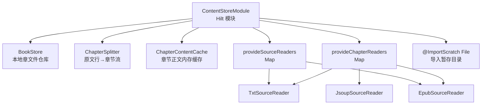
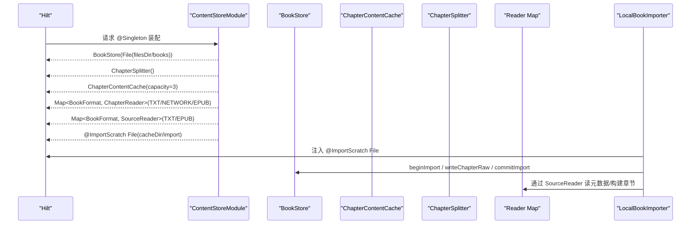
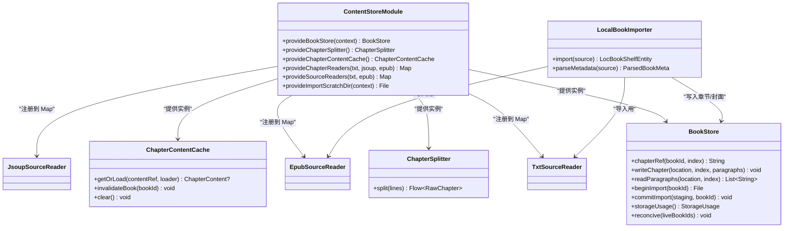

# 内容存储模块（ContentStoreModule）

<cite>
**本文引用的文件**   
- [lib_book_common/src/main/java/com/ebook/common/di/ContentStoreModule.kt](file://lib_book_common/src/main/java/com/ebook/common/di/ContentStoreModule.kt)
- [lib_book_common/src/main/java/com/ebook/common/store/BookStore.kt](file://lib_book_common/src/main/java/com/ebook/common/store/BookStore.kt)
- [lib_book_common/src/main/java/com/ebook/common/store/ChapterContentCache.kt](file://lib_book_common/src/main/java/com/ebook/common/store/ChapterContentCache.kt)
- [lib_book_common/src/main/java/com/ebook/common/analyze/local/ChapterSplitter.kt](file://lib_book_common/src/main/java/com/ebook/common/analyze/local/ChapterSplitter.kt)
- [lib_book_common/src/main/java/com/ebook/common/importer/LocalBookImporter.kt](file://lib_book_common/src/main/java/com/ebook/common/importer/LocalBookImporter.kt)
- [lib_book_common/src/main/java/com/ebook/common/di/ImportScratch.kt](file://lib_book_common/src/main/java/com/ebook/common/di/ImportScratch.kt)
- [lib_book_common/src/main/java/com/ebook/common/analyze/local/EpubSourceReader.kt](file://lib_book_common/src/main/java/com/ebook/common/analyze/local/EpubSourceReader.kt)
- [lib_book_common/src/main/java/com/ebook/common/analyze/local/TxtSourceReader.kt](file://lib_book_common/src/main/java/com/ebook/common/analyze/local/TxtSourceReader.kt)
- [lib_book_common/src/main/java/com/ebook/common/analyze/source/JsoupSourceReader.kt](file://lib_book_common/src/main/java/com/ebook/common/analyze/source/JsoupSourceReader.kt)
</cite>

## 目录
1. [引言](#引言)
2. [项目结构与定位](#项目结构与定位)
3. [核心组件总览](#核心组件总览)
4. [架构概览](#架构概览)
5. [详细组件分析](#详细组件分析)
6. [依赖关系与注入图](#依赖关系与注入图)
7. [性能考量](#性能考量)
8. [故障排查指南](#故障排查指南)
9. [结论](#结论)
10. [附录：扩展指南](#附录：扩展指南)

## 引言
本章节聚焦内容存储模块的依赖注入装配点 ContentStoreModule，说明其如何作为本地内容仓库的统一装配中心，完成 BookStore、ChapterSplitter、ChapterContentCache 等关键组件的生命周期与参数配置；并深入解析按 BookFormat 路由到具体 Reader 的设计模式、Map 注入的使用场景、导入链路专用 Reader 筛选逻辑，以及与 Room 数据库集成的协作方式。

## 项目结构与定位
ContentStoreModule 位于共享库 lib_book_common 的 DI 包中，承担“本地内容仓库”的装配职责。它不持有业务状态，只负责将 Hilt 生命周期内的单例对象组装起来，供 BookRepository、导入器、下载服务等上层组件消费。

图示来源
- [lib_book_common/src/main/java/com/ebook/common/di/ContentStoreModule.kt:21-87](file://lib_book_common/src/main/java/com/ebook/common/di/ContentStoreModule.kt#L21-L87)

章节来源
- [lib_book_common/src/main/java/com/ebook/common/di/ContentStoreModule.kt:21-87](file://lib_book_common/src/main/java/com/ebook/common/di/ContentStoreModule.kt#L21-L87)

## 核心组件总览
- BookStore：本地书籍内容仓库，以 filesDir/books 为根目录，按书组织章节文件，提供读写、导入原子提交、占用统计、对账清理等能力。
- ChapterSplitter：将原文行序列切分为章节流，仅做标题识别与段落聚合，文本清洗在读取层进行。
- ChapterContentCache：章节正文的 LRU 内存缓存，键为 content_ref，容量默认 3（当前章+前后各一），支持按书失效。
- ChapterReader/SourceReader 映射：按 BookFormat 分发到对应解析器；区分“阅读期正文读取”和“导入期源文件处理”两套映射。
- @ImportScratch：限定导入期源文件暂存目录的 File 注入，避免 Hilt 对多个 File 参数的歧义。

章节来源
- [lib_book_common/src/main/java/com/ebook/common/store/BookStore.kt:18-216](file://lib_book_common/src/main/java/com/ebook/common/store/BookStore.kt#L18-L216)
- [lib_book_common/src/main/java/com/ebook/common/analyze/local/ChapterSplitter.kt:9-71](file://lib_book_common/src/main/java/com/ebook/common/analyze/local/ChapterSplitter.kt#L9-L71)
- [lib_book_common/src/main/java/com/ebook/common/store/ChapterContentCache.kt:7-63](file://lib_book_common/src/main/java/com/ebook/common/store/ChapterContentCache.kt#L7-L63)
- [lib_book_common/src/main/java/com/ebook/common/di/ImportScratch.kt:5-13](file://lib_book_common/src/main/java/com/ebook/common/di/ImportScratch.kt#L5-L13)

## 架构概览
ContentStoreModule 暴露以下关键装配：
- provideBookStore：唯一一次 Context → File 转换，把 books 根目录注入 BookStore。
- provideChapterSplitter：无参构造，纯函数式切分器。
- provideChapterContentCache：默认容量 3 的内存缓存。
- provideChapterReaders：Map<BookFormat, ChapterReader>，覆盖 TXT、NETWORK、EPUB，用于“非导入链路的正文读取”。
- provideSourceReaders：Map<BookFormat, SourceReader>，仅包含可走导入流水线的本地格式（TXT、EPUB）。
- provideImportScratchDir：@ImportScratch 标注的临时目录，用于导入期“拷贝即哈希”流水线。

图示来源
- [lib_book_common/src/main/java/com/ebook/common/di/ContentStoreModule.kt:31-87](file://lib_book_common/src/main/java/com/ebook/common/di/ContentStoreModule.kt#L31-L87)
- [lib_book_common/src/main/java/com/ebook/common/importer/LocalBookImporter.kt:44-141](file://lib_book_common/src/main/java/com/ebook/common/importer/LocalBookImporter.kt#L44-L141)

章节来源
- [lib_book_common/src/main/java/com/ebook/common/di/ContentStoreModule.kt:31-87](file://lib_book_common/src/main/java/com/ebook/common/di/ContentStoreModule.kt#L31-L87)

## 详细组件分析

### ContentStoreModule 装配职责
- 生命周期：使用 @InstallIn(SingletonComponent::class)，所有 Provide 方法返回的对象均为 @Singleton。
- 职责边界：只做“上下文到路径”的一次性转换与 Map 装配；不实现业务逻辑。
- 开闭原则：新增书籍格式时，仅需修改 provideChapterReaders 与 provideSourceReaders 的 Map，仓库侧无需分支改动。

章节来源
- [lib_book_common/src/main/java/com/ebook/common/di/ContentStoreModule.kt:21-87](file://lib_book_common/src/main/java/com/ebook/common/di/ContentStoreModule.kt#L21-L87)

### BookStore 初始化与作用
- 初始化：由 ContentStoreModule 将 context.filesDir 下的 “books” 目录传入 BookStore，使其成为内容仓库根。
- 设计要点：
  - 目录名派生规则统一在 BookStore 内部，避免调用方拼接错误导致网络书目录异常。
  - 导入采用“暂存目录 + renameTo 原子提交”的策略，保证要么整本可见、要么完全不存在。
  - storageUsage/reconcile 提供占用统计与垃圾清理，支撑缓存管理页。

章节来源
- [lib_book_common/src/main/java/com/ebook/common/store/BookStore.kt:18-216](file://lib_book_common/src/main/java/com/ebook/common/store/BookStore.kt#L18-L216)

### ChapterSplitter 配置与行为
- 输入：原文行序列（已解码，未清洗）。
- 输出：章节流 RawChapter（index/title/paragraphs）。
- 规则：默认标题正则匹配“第…章”，空章不产出；每产出一章执行 ensureActive 支持取消。
- 清洗策略：正文保持原文切片，清洗发生在读取层；仅标题行做规范化，便于显示与比对。

章节来源
- [lib_book_common/src/main/java/com/ebook/common/analyze/local/ChapterSplitter.kt:9-71](file://lib_book_common/src/main/java/com/ebook/common/analyze/local/ChapterSplitter.kt#L9-L71)

### ChapterContentCache 配置与行为
- 容量：默认 3，覆盖当前章与前后预加载。
- 键：content_ref（持久定位符，内含书目录片段），支持按书失效。
- 并发：Mutex 保护；loader 在锁外执行，避免读盘阻塞其他章。
- 失效：invalidateBook 基于 BookStore.cacheMarker 生成的标记片段剔除条目。

章节来源
- [lib_book_common/src/main/java/com/ebook/common/store/ChapterContentCache.kt:7-63](file://lib_book_common/src/main/java/com/ebook/common/store/ChapterContentCache.kt#L7-L63)

### provideChapterReaders 与 provideSourceReaders 的区别
- provideChapterReaders：面向“阅读期正文读取”，包含 NETWORK 格式（JsoupSourceReader），用于除导入链路之外的正文获取。
- provideSourceReaders：面向“导入期源文件处理”，仅包含本地可导入格式（TXT、EPUB），不包含 NETWORK。
- 区别原因：导入流程需要能直接操作源文件的 Reader（readMetadata/buildChapters），而网络格式不走该流水线。

章节来源
- [lib_book_common/src/main/java/com/ebook/common/di/ContentStoreModule.kt:51-87](file://lib_book_common/src/main/java/com/ebook/common/di/ContentStoreModule.kt#L51-L87)

### @ImportScratch 注解的使用
- 作用：限定导入期源文件暂存目录的 File 注入，避免 Hilt 对多个 File 参数产生歧义。
- 生产值：context.cacheDir 下的 “import” 目录，自动创建。
- 消费方：LocalBookImporter 通过 @ImportScratch 注入 scratchDir，用于“拷贝即哈希”的中间文件落盘。

章节来源
- [lib_book_common/src/main/java/com/ebook/common/di/ImportScratch.kt:5-13](file://lib_book_common/src/main/java/com/ebook/common/di/ImportScratch.kt#L5-L13)
- [lib_book_common/src/main/java/com/ebook/common/di/ContentStoreModule.kt:44-49](file://lib_book_common/src/main/java/com/ebook/common/di/ContentStoreModule.kt#L44-L49)
- [lib_book_common/src/main/java/com/ebook/common/importer/LocalBookImporter.kt:44-67](file://lib_book_common/src/main/java/com/ebook/common/importer/LocalBookImporter.kt#L44-L67)

### 目录参数传递的最佳实践
- 原则：BookStore 只接收 File 目录参数，不接 Context，使内容基座可在纯 JVM 测试环境运行。
- 转换点收敛：Context → File 的转换仅在 ContentStoreModule 中做一次，后续全部以 File 传播。
- 好处：解耦 Android 环境依赖，提升可测试性与可移植性。

章节来源
- [lib_book_common/src/main/java/com/ebook/common/di/ContentStoreModule.kt:21-35](file://lib_book_common/src/main/java/com/ebook/common/di/ContentStoreModule.kt#L21-L35)
- [lib_book_common/src/main/java/com/ebook/common/store/BookStore.kt:18-23](file://lib_book_common/src/main/java/com/ebook/common/store/BookStore.kt#L18-L23)

### 与 Room 数据库的集成方式
- 导入期：LocalBookImporter 通过 DAO（BookShelfDao、BookInfoDao、ChapterListDao、BookGroupDao）写入书架、书目信息、章节列表与分组，事务由 WriteTransactionRunner 统一包裹。
- 正文持久化：章节正文以 UTF-8 文本文件形式保存在 BookStore 管理的目录结构中，content_ref 字段指向该相对路径，形成“索引在 Room，正文在文件系统”的双轨存储。
- 失效协同：当章节重抓或删书时，BookRepository/DownloadService 调用 ChapterContentCache.invalidateBook，配合 BookStore.cacheMarker 精准失效相关缓存。

章节来源
- [lib_book_common/src/main/java/com/ebook/common/importer/LocalBookImporter.kt:44-141](file://lib_book_common/src/main/java/com/ebook/common/importer/LocalBookImporter.kt#L44-L141)
- [lib_book_common/src/main/java/com/ebook/common/store/ChapterContentCache.kt:41-53](file://lib_book_common/src/main/java/com/ebook/common/store/ChapterContentCache.kt#L41-L53)
- [lib_book_common/src/main/java/com/ebook/common/store/BookStore.kt:141-160](file://lib_book_common/src/main/java/com/ebook/common/store/BookStore.kt#L141-L160)

## 依赖关系与注入图

图示来源
- [lib_book_common/src/main/java/com/ebook/common/di/ContentStoreModule.kt:31-87](file://lib_book_common/src/main/java/com/ebook/common/di/ContentStoreModule.kt#L31-L87)
- [lib_book_common/src/main/java/com/ebook/common/store/BookStore.kt:37-216](file://lib_book_common/src/main/java/com/ebook/common/store/BookStore.kt#L37-L216)
- [lib_book_common/src/main/java/com/ebook/common/analyze/local/ChapterSplitter.kt:27-71](file://lib_book_common/src/main/java/com/ebook/common/analyze/local/ChapterSplitter.kt#L27-L71)
- [lib_book_common/src/main/java/com/ebook/common/store/ChapterContentCache.kt:25-63](file://lib_book_common/src/main/java/com/ebook/common/store/ChapterContentCache.kt#L25-L63)
- [lib_book_common/src/main/java/com/ebook/common/importer/LocalBookImporter.kt:44-141](file://lib_book_common/src/main/java/com/ebook/common/importer/LocalBookImporter.kt#L44-L141)

## 性能考量
- 文件 IO 优化：BookStore.storageUsage 一次遍历同时计算字节与册数，避免重复扫描。
- 缓存命中：ChapterContentCache 默认容量 3，减少翻页时的磁盘访问；loader 在锁外执行，降低互斥等待。
- 导入性能：LocalBookImporter 通过“拷贝即哈希”一次性流式处理，避免多次全文件读取。
- 目录命名：BookStore.dirName 统一处理非法字符，避免跨平台兼容问题导致的静默失败。

章节来源
- [lib_book_common/src/main/java/com/ebook/common/store/BookStore.kt:116-139](file://lib_book_common/src/main/java/com/ebook/common/store/BookStore.kt#L116-L139)
- [lib_book_common/src/main/java/com/ebook/common/store/ChapterContentCache.kt:25-46](file://lib_book_common/src/main/java/com/ebook/common/store/ChapterContentCache.kt#L25-L46)
- [lib_book_common/src/main/java/com/ebook/common/importer/LocalBookImporter.kt:185-194](file://lib_book_common/src/main/java/com/ebook/common/importer/LocalBookImporter.kt#L185-L194)

## 故障排查指南
- 导入失败残留：若导入中断，BookStore.reconcile 会清理 .tmp 目录与散落文件，避免“占空间但不可见”的问题。
- 章节缺失：ChapterContentCache.getOrLoad 允许 loader 返回 null 表示内容缺失，不会缓存空结果，便于 reader 注册表补齐后自然恢复。
- 格式不支持：LocalBookImporter.readerFor 对未知扩展名抛异常，并提供可用格式提示，便于快速定位缺失 Reader。
- 缓存不一致：当章节重抓成功时，需调用 invalidateBook 清除旧缓存，避免阅读器继续显示旧正文。

章节来源
- [lib_book_common/src/main/java/com/ebook/common/store/BookStore.kt:141-160](file://lib_book_common/src/main/java/com/ebook/common/store/BookStore.kt#L141-L160)
- [lib_book_common/src/main/java/com/ebook/common/store/ChapterContentCache.kt:35-46](file://lib_book_common/src/main/java/com/ebook/common/store/ChapterContentCache.kt#L35-L46)
- [lib_book_common/src/main/java/com/ebook/common/importer/LocalBookImporter.kt:160-167](file://lib_book_common/src/main/java/com/ebook/common/importer/LocalBookImporter.kt#L160-L167)

## 结论
ContentStoreModule 是本地内容仓库的装配中枢，通过集中化的依赖注入，将 BookStore、ChapterSplitter、ChapterContentCache 以及 Reader 映射统一装配，既保证了功能解耦，又遵循开闭原则，便于扩展新格式。结合 @ImportScratch 限定注入与统一的目录参数传递，实现了可测试、可移植且高性能的内容存储方案。

## 附录：扩展指南

### 添加新的书籍格式支持（阅读期）
步骤：
1. 确保新格式在 BookFormat 枚举中存在（若不存在需先扩展枚举）。
2. 在 ContentStoreModule.provideChapterReaders 中为新格式添加映射到对应 ChapterReader。
3. 若该格式也支持导入，需在 provideSourceReaders 中添加映射。
4. 在 LocalBookImporter 中确保 BookFormat.fromExtension 能识别新格式的扩展名。

示例路径参考
- [lib_book_common/src/main/java/com/ebook/common/di/ContentStoreModule.kt:60-71](file://lib_book_common/src/main/java/com/ebook/common/di/ContentStoreModule.kt#L60-L71)
- [lib_book_common/src/main/java/com/ebook/common/importer/LocalBookImporter.kt:160-167](file://lib_book_common/src/main/java/com/ebook/common/importer/LocalBookImporter.kt#L160-L167)

### 扩展 Reader 映射
- 阅读期映射：provideChapterReaders 中的 Map<BookFormat, ChapterReader>，用于非导入链路的正文读取。
- 导入期映射：provideSourceReaders 中的 Map<BookFormat, SourceReader>，仅包含可走导入流水线的本地格式。
- 注意：NETWORK 格式仅出现在阅读期映射中，因为网络内容不走导入流水线。

示例路径参考
- [lib_book_common/src/main/java/com/ebook/common/di/ContentStoreModule.kt:51-87](file://lib_book_common/src/main/java/com/ebook/common/di/ContentStoreModule.kt#L51-L87)

### 使用 @ImportScratch 注解
- 用途：限定导入期源文件暂存目录的 File 注入，避免 Hilt 对多个 File 参数产生歧义。
- 生产值：cacheDir/import 目录，自动创建。
- 消费方：LocalBookImporter 通过 @ImportScratch 注入 scratchDir，用于导入过程中的中间文件落盘。

示例路径参考
- [lib_book_common/src/main/java/com/ebook/common/di/ImportScratch.kt:5-13](file://lib_book_common/src/main/java/com/ebook/common/di/ImportScratch.kt#L5-L13)
- [lib_book_common/src/main/java/com/ebook/common/di/ContentStoreModule.kt:44-49](file://lib_book_common/src/main/java/com/ebook/common/di/ContentStoreModule.kt#L44-L49)
- [lib_book_common/src/main/java/com/ebook/common/importer/LocalBookImporter.kt:44-67](file://lib_book_common/src/main/java/com/ebook/common/importer/LocalBookImporter.kt#L44-L67)

### 目录参数传递最佳实践
- 原则：BookStore 只接收 File 目录参数，不接 Context，使内容基座可在纯 JVM 测试环境运行。
- 转换点收敛：Context → File 的转换仅在 ContentStoreModule 中做一次，后续全部以 File 传播。
- 好处：解耦 Android 环境依赖，提升可测试性与可移植性。

示例路径参考
- [lib_book_common/src/main/java/com/ebook/common/di/ContentStoreModule.kt:21-35](file://lib_book_common/src/main/java/com/ebook/common/di/ContentStoreModule.kt#L21-L35)
- [lib_book_common/src/main/java/com/ebook/common/store/BookStore.kt:18-23](file://lib_book_common/src/main/java/com/ebook/common/store/BookStore.kt#L18-L23)

### 与 Room 数据库的集成
- 导入期：LocalBookImporter 通过 DAO 写入书架、书目信息、章节列表与分组，事务由 WriteTransactionRunner 统一包裹。
- 正文持久化：章节正文以 UTF-8 文本文件形式保存在 BookStore 管理的目录结构中，content_ref 字段指向该相对路径。
- 失效协同：当章节重抓或删书时，调用 ChapterContentCache.invalidateBook 配合 BookStore.cacheMarker 精准失效相关缓存。

示例路径参考
- [lib_book_common/src/main/java/com/ebook/common/importer/LocalBookImporter.kt:44-141](file://lib_book_common/src/main/java/com/ebook/common/importer/LocalBookImporter.kt#L44-L141)
- [lib_book_common/src/main/java/com/ebook/common/store/ChapterContentCache.kt:41-53](file://lib_book_common/src/main/java/com/ebook/common/store/ChapterContentCache.kt#L41-L53)
- [lib_book_common/src/main/java/com/ebook/common/store/BookStore.kt:141-160](file://lib_book_common/src/main/java/com/ebook/common/store/BookStore.kt#L141-L160)