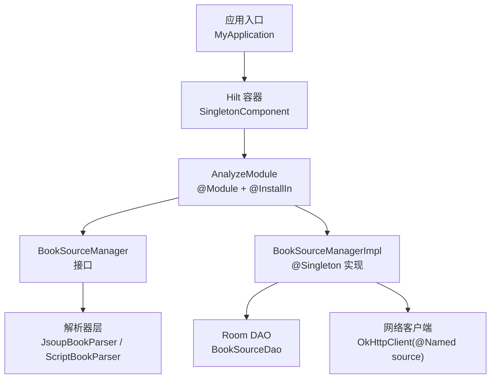
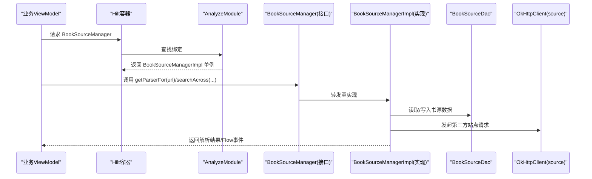
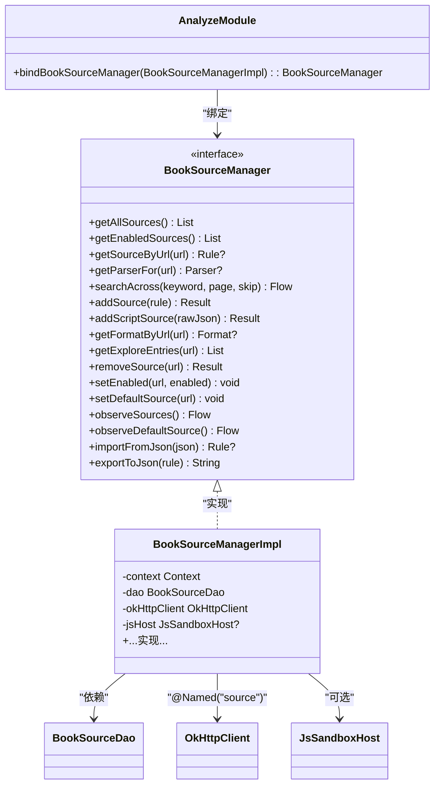

# 分析模块（AnalyzeModule）

<cite>
**本文引用的文件**
- [lib_book_common/src/main/java/com/ebook/common/di/AnalyzeModule.kt](file://lib_book_common/src/main/java/com/ebook/common/di/AnalyzeModule.kt)
- [lib_book_common/src/main/java/com/ebook/common/analyze/source/BookSourceManager.kt](file://lib_book_common/src/main/java/com/ebook/common/analyze/source/BookSourceManager.kt)
- [lib_book_common/src/main/java/com/ebook/common/analyze/source/BookSourceManagerImpl.kt](file://lib_book_common/src/main/java/com/ebook/common/analyze/source/BookSourceManagerImpl.kt)
- [lib_book_common/src/main/java/com/ebook/common/di/SessionModule.kt](file://lib_book_common/src/main/java/com/ebook/common/di/SessionModule.kt)
- [lib_book_common/src/main/java/com/ebook/common/BookApplication.kt](file://lib_book_common/src/main/java/com/ebook/common/BookApplication.kt)
- [module_app/src/main/java/com/ebook/MyApplication.kt](file://module_app/src/main/java/com/ebook/MyApplication.kt)
- [module_me/src/test/java/com/ebook/me/mvvm/viewmodel/FakeBookSourceManager.kt](file://module_me/src/test/java/com/ebook/me/mvvm/viewmodel/FakeBookSourceManager.kt)
- [lib_book_common/src/test/java/com/ebook/common/analyze/source/FakeBookSourceManager.kt](file://lib_book_common/src/test/java/com/ebook/common/analyze/source/FakeBookSourceManager.kt)
</cite>

## 目录
1. [简介](#简介)
2. [项目结构中的位置](#项目结构中的位置)
3. [核心组件与职责](#核心组件与职责)
4. [架构总览](#架构总览)
5. [详细组件分析](#详细组件分析)
6. [依赖关系分析](#依赖关系分析)
7. [性能与生命周期](#性能与生命周期)
8. [测试与替换实现](#测试与替换实现)
9. [故障排查](#故障排查)
10. [结论](#结论)

## 简介
本文件聚焦“分析模块”的依赖注入设计与实现，围绕 AnalyzeModule、BookSourceManager 接口及其 BookSourceManagerImpl 实现展开，解释 @Binds 绑定方式、单例生命周期管理、Hilt 装配位置，以及该模块在分析流程中的核心地位。同时给出添加新分析器接口的扩展方法、多实现场景的处理策略，以及在测试中如何替换为 Mock 或 Fake 实现。

## 项目结构中的位置
- AnalyzeModule 位于共享库 lib_book_common 的 di 包下，属于跨模块可复用的依赖注入装配点。
- BookSourceManager 接口与其实现 BookSourceManagerImpl 位于 analyze/source 包，是书源解析链路的统一入口。
- Hilt 应用级装配由 module_app 的 MyApplication 标注启动；公共单例组件由 Hilt 的 SingletonComponent 提供。
- 其他同级别 DI 模块（如 SessionModule）遵循相同的 @InstallIn(SingletonComponent::class) + @Binds 模式。

图表来源
- [module_app/src/main/java/com/ebook/MyApplication.kt](file://module_app/src/main/java/com/ebook/MyApplication.kt)
- [lib_book_common/src/main/java/com/ebook/common/di/AnalyzeModule.kt:11-18](file://lib_book_common/src/main/java/com/ebook/common/di/AnalyzeModule.kt#L11-L18)
- [lib_book_common/src/main/java/com/ebook/common/analyze/source/BookSourceManagerImpl.kt:84-100](file://lib_book_common/src/main/java/com/ebook/common/analyze/source/BookSourceManagerImpl.kt#L84-L100)

章节来源
- [lib_book_common/src/main/java/com/ebook/common/di/AnalyzeModule.kt:1-18](file://lib_book_common/src/main/java/com/ebook/common/di/AnalyzeModule.kt#L1-L18)
- [lib_book_common/src/main/java/com/ebook/common/BookApplication.kt:17-49](file://lib_book_common/src/main/java/com/ebook/common/BookApplication.kt#L17-L49)

## 核心组件与职责
- AnalyzeModule：以 Hilt Module 形式声明接口到实现的绑定，将 BookSourceManager 指向 BookSourceManagerImpl，并标记为单例。
- BookSourceManager：多书源共存清单的唯一入口，提供规则化读面、默认源订阅、聚合搜索、增删改查等能力，屏蔽 Room 与不同格式书源（原生/脚本）的差异。
- BookSourceManagerImpl：实现 BookSourceManager，负责：
  - 从 Room 读取/写入书源数据
  - 按 URL 获取解析器（带 LRU 缓存）
  - 聚合搜索（并发上限、失败隔离、取消传播）
  - 默认源计算与持久化
  - 区分原生规则与脚本书源的求值后端

章节来源
- [lib_book_common/src/main/java/com/ebook/common/analyze/source/BookSourceManager.kt:10-50](file://lib_book_common/src/main/java/com/ebook/common/analyze/source/BookSourceManager.kt#L10-L50)
- [lib_book_common/src/main/java/com/ebook/common/analyze/source/BookSourceManagerImpl.kt:39-100](file://lib_book_common/src/main/java/com/ebook/common/analyze/source/BookSourceManagerImpl.kt#L39-L100)

## 架构总览
AnalyzeModule 通过 @Binds 将 BookSourceManager 接口绑定到 BookSourceManagerImpl，并由 Hilt 的 SingletonComponent 提供单例实例。业务侧仅依赖接口，不感知具体实现，从而获得松耦合与可测试性。BookSourceManagerImpl 内部组合了 Room DAO、网络客户端、沙箱执行器等依赖，作为解析链路的核心枢纽。

图表来源
- [lib_book_common/src/main/java/com/ebook/common/di/AnalyzeModule.kt:11-18](file://lib_book_common/src/main/java/com/ebook/common/di/AnalyzeModule.kt#L11-L18)
- [lib_book_common/src/main/java/com/ebook/common/analyze/source/BookSourceManagerImpl.kt:84-100](file://lib_book_common/src/main/java/com/ebook/common/analyze/source/BookSourceManagerImpl.kt#L84-L100)

## 详细组件分析

### AnalyzeModule：接口绑定与单例装配
- 使用 @Module 声明一个 Hilt 模块。
- 使用 @InstallIn(SingletonComponent::class) 将其安装到全局单例组件，确保应用生命周期内唯一。
- 使用 @Binds + @Singleton 将抽象方法 bindBookSourceManager 的实现参数类型（BookSourceManagerImpl）绑定到返回类型（BookSourceManager）。
- 优点：无需构造时手动 new，避免泄漏上下文；所有消费者以接口解耦；单例保证解析器 LRU、默认源状态一致性。

章节来源
- [lib_book_common/src/main/java/com/ebook/common/di/AnalyzeModule.kt:11-18](file://lib_book_common/src/main/java/com/ebook/common/di/AnalyzeModule.kt#L11-L18)

### BookSourceManager 接口：分析流程的统一入口
- 提供三类读面：
  - 规则类型化读面：getAllSources/getEnabledSources/getSourceByUrl（仅原生规则）
  - 默认源订阅：observeDefaultSource（支持原生与脚本两种出身）
  - 管理页条目流：observeSources（含 format 元数据）
- 聚合搜索：searchAcross 对启用源并发解析，控制并发上限，失败隔离，取消原样上抛。
- 写操作：addSource/addScriptSource/removeSource/setEnabled/setDefaultSource，均失效对应 URL 的 parser 缓存。
- 导入导出：importFromJson/exportToJson 用于社区交换。

章节来源
- [lib_book_common/src/main/java/com/ebook/common/analyze/source/BookSourceManager.kt:51-277](file://lib_book_common/src/main/java/com/ebook/common/analyze/source/BookSourceManager.kt#L51-L277)

### BookSourceManagerImpl：实现要点
- 单例：类上标注 @Singleton，配合 AnalyzeModule 的 @Binds 生效。
- 依赖注入：构造器注入 ApplicationContext、BookSourceDao、@Named("source") OkHttpClient、可选 JsSandboxHost（未装配时为 null）。
- 求值后端工厂：按 SourceDefinition 分支生产 JsoupBookParser 或 ScriptBookParser，并通过 LRU 缓存解析器。
- 默认源计算：从 Room 行现算，SP 命中优先，否则取第一条启用行，兼容两种格式。
- 并发与容错：searchAcross 限制并发、捕获异常并转化为源级失败事件，保持整体流稳定。

章节来源
- [lib_book_common/src/main/java/com/ebook/common/analyze/source/BookSourceManagerImpl.kt:84-100](file://lib_book_common/src/main/java/com/ebook/common/analyze/source/BookSourceManagerImpl.kt#L84-L100)

### Hilt 装配位置与应用初始化
- 应用入口 MyApplication 由 Hilt 生成代码装配，AnalyzeModule 在其 SingletonComponent 中可用。
- BookApplication 展示了如何通过 EntryPointAccessors 从 SingletonComponent 取出单例对象，说明 Hilt 容器范围与生命周期。

章节来源
- [module_app/src/main/java/com/ebook/MyApplication.kt](file://module_app/src/main/java/com/ebook/MyApplication.kt)
- [lib_book_common/src/main/java/com/ebook/common/BookApplication.kt:44-59](file://lib_book_common/src/main/java/com/ebook/common/BookApplication.kt#L44-L59)

## 依赖关系分析
- AnalyzeModule 仅依赖接口与实现类型，无业务逻辑耦合。
- BookSourceManagerImpl 依赖：
  - Room：BookSourceDao（持久化事实源）
  - 网络：@Named("source") OkHttpClient（纯净客户端，不带 token）
  - 沙箱：JsSandboxHost?（可选，测试/独立运行可为空）
- 与其他模块的关系：
  - 上层模块（module_find、module_book 等）通过 BookSourceManager 接口消费，不感知实现细节。
  - 解析器（JsoupBookParser、ScriptBookParser）在实现内部创建，对外暴露统一接口。

图表来源
- [lib_book_common/src/main/java/com/ebook/common/di/AnalyzeModule.kt:11-18](file://lib_book_common/src/main/java/com/ebook/common/di/AnalyzeModule.kt#L11-L18)
- [lib_book_common/src/main/java/com/ebook/common/analyze/source/BookSourceManager.kt:51-277](file://lib_book_common/src/main/java/com/ebook/common/analyze/source/BookSourceManager.kt#L51-L277)
- [lib_book_common/src/main/java/com/ebook/common/analyze/source/BookSourceManagerImpl.kt:84-100](file://lib_book_common/src/main/java/com/ebook/common/analyze/source/BookSourceManagerImpl.kt#L84-L100)

## 性能与生命周期
- 单例优势：
  - 解析器 LRU 缓存复用，减少重复构建开销。
  - 默认源计算与 SP 同步一致，避免多实例导致的状态分裂。
  - 网络客户端单一实例，连接池复用，降低第三方站点压力。
- 并发与背压：
  - searchAcross 限制并发上限（例如 5），避免对第三方站点造成风控风险。
  - Flow 冷流特性，按需拉取，取消即停，避免多余 IO。
- 错误隔离：
  - 单源失败不影响其他源，异常收敛为事件流，提升稳定性。

[本节为通用性能讨论，不直接分析具体文件]

## 测试与替换实现
- 为什么选择单例：
  - 单例确保全局一致的解析器缓存与默认源状态，便于模拟真实运行环境。
  - 在测试中可通过 Hilt 的测试注解或自定义模块替换实现，而不破坏业务代码。
- 如何替换实现：
  - 在测试 source set 中新增一个 Module，用 @Binds 将 BookSourceManager 绑定到 FakeBookSourceManager。
  - 使用 @HiltAndroidTest 与 @UninstallModules(AnalyzeModule::class) 卸载生产绑定，再安装测试模块。
  - 或使用 Hilt 提供的 @BindValue/@ReplaceWith 机制（视版本与插件支持）。
- 仓库中的替身示例：
  - lib_book_common 与 module_me 各自提供 FakeBookSourceManager，供不同层级测试使用。

章节来源
- [lib_book_common/src/test/java/com/ebook/common/analyze/source/FakeBookSourceManager.kt](file://lib_book_common/src/test/java/com/ebook/common/analyze/source/FakeBookSourceManager.kt)
- [module_me/src/test/java/com/ebook/me/mvvm/viewmodel/FakeBookSourceManager.kt](file://module_me/src/test/java/com/ebook/me/mvvm/viewmodel/FakeBookSourceManager.kt)

## 故障排查
- 常见问题定位：
  - 如果 getParserFor(url) 返回 null，检查 URL 是否为本地书标签或缺失行；注意脚本书源不会在此处返回 null。
  - 如果聚合搜索出现大量失败，确认是否触发第三方站点风控（并发过高或频率过快）。
  - 如果默认源不更新，检查 write 路径是否失效了 parser 缓存，以及 SP 与 Room 的一致性。
- 日志与断言：
  - 关注 BookSourceManagerImpl 内部的错误日志输出，定位 JSON 解析失败或网络异常。
  - 在测试中通过 Fake 实现断言关键行为（如并发上限、失败事件、hasMore 判断）。

章节来源
- [lib_book_common/src/main/java/com/ebook/common/analyze/source/BookSourceManager.kt:91-155](file://lib_book_common/src/main/java/com/ebook/common/analyze/source/BookSourceManager.kt#L91-L155)
- [lib_book_common/src/main/java/com/ebook/common/analyze/source/BookSourceManagerImpl.kt:39-100](file://lib_book_common/src/main/java/com/ebook/common/analyze/source/BookSourceManagerImpl.kt#L39-L100)

## 结论
AnalyzeModule 通过简洁的 @Binds 绑定将 BookSourceManager 接口与 BookSourceManagerImpl 实现装配进 Hilt 的单例组件，使书源解析链路具备高内聚、低耦合的特性。BookSourceManager 作为分析流程的核心，统一了多书源共存、默认源计算、聚合搜索与读写操作，屏蔽了底层 Room 与网络细节。借助单例生命周期与 Flow 的响应式模型，系统在性能、稳定性与可测试性方面达到良好平衡。后续扩展新的分析器接口或实现时，只需在 AnalyzeModule 中添加新的 @Binds 映射，即可无缝接入现有体系。