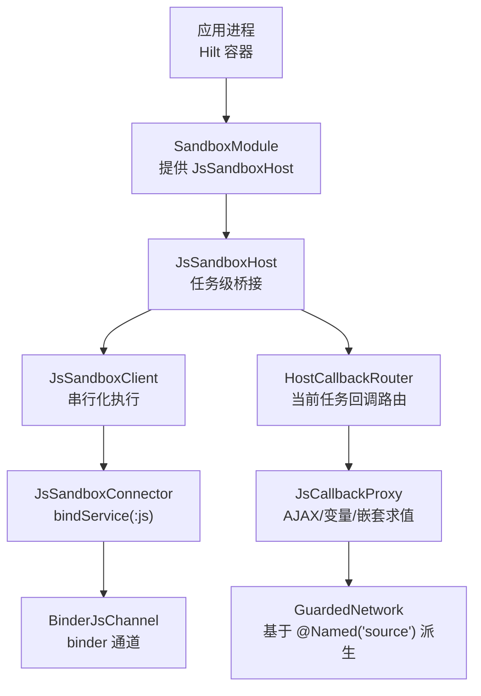
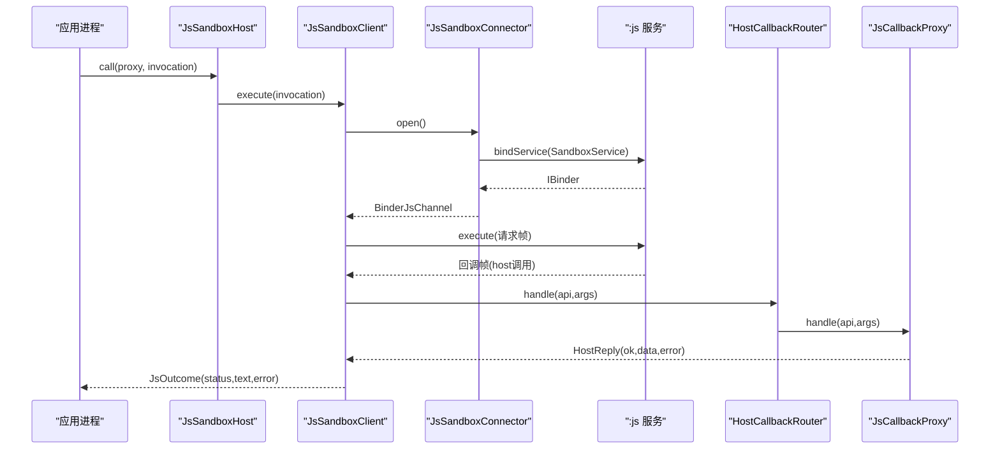
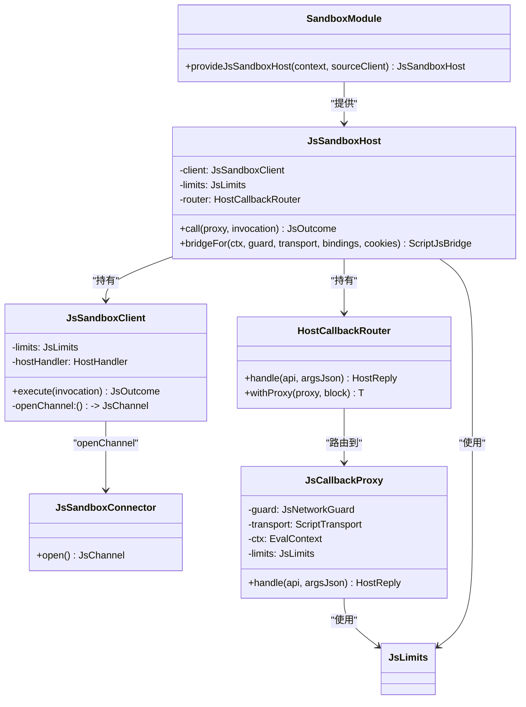

# 沙箱模块（SandboxModule）

<cite>
**本文引用的文件**
- [lib_book_common/src/main/java/com/ebook/common/di/SandboxModule.kt](file://lib_book_common/src/main/java/com/ebook/common/di/SandboxModule.kt)
- [lib_book_source/src/main/java/com/ebook/source/sandbox/JsSandboxHost.kt](file://lib_book_source/src/main/java/com/ebook/source/sandbox/JsSandboxHost.kt)
- [lib_book_source/src/main/java/com/ebook/source/sandbox/JsSandboxClient.kt](file://lib_book_source/src/main/java/com/ebook/source/sandbox/JsSandboxClient.kt)
- [lib_book_source/src/main/java/com/ebook/source/sandbox/JsSandboxConnector.kt](file://lib_book_source/src/main/java/com/ebook/source/sandbox/JsSandboxConnector.kt)
- [lib_book_source/src/main/java/com/ebook/source/sandbox/JsLimits.kt](file://lib_book_source/src/main/java/com/ebook/source/sandbox/JsLimits.kt)
- [lib_book_source/src/main/java/com/ebook/source/sandbox/JsCallbackProxy.kt](file://lib_book_source/src/main/java/com/ebook/source/sandbox/JsCallbackProxy.kt)
- [lib_book_source/src/test/java/com/ebook/source/sandbox/JsSandboxClientTest.kt](file://lib_book_source/src/test/java/com/ebook/source/sandbox/JsSandboxClientTest.kt)
- [lib_book_source/src/androidTest/java/com/ebook/source/sandbox/SandboxConnectionTest.kt](file://lib_book_source/src/androidTest/java/com/ebook/source/sandbox/SandboxConnectionTest.kt)
- [lib_book_source/src/main/java/com/ebook/source/script/SandboxScriptJs.kt](file://lib_book_source/src/main/java/com/ebook/source/script/SandboxScriptJs.kt)
- [lib_book_source/src/main/java/com/ebook/source/script/ScriptJsBridge.kt](file://lib_book_source/src/main/java/com/ebook/source/script/ScriptJsBridge.kt)
- [lib_book_source/src/main/java/com/ebook/source/analyze/ScriptBookParser.kt](file://lib_book_source/src/main/java/com/ebook/source/analyze/ScriptBookParser.kt)
- [lib_book_common/src/main/java/com/ebook/common/analyze/source/BookSourceManagerImpl.kt](file://lib_book_common/src/main/java/com/ebook/common/analyze/source/BookSourceManagerImpl.kt)
</cite>

## 目录
1. [引言](#引言)
2. [项目结构与定位](#项目结构与定位)
3. [核心组件总览](#核心组件总览)
4. [架构与装配时序](#架构与装配时序)
5. [详细组件分析](#详细组件分析)
6. [依赖关系与耦合分析](#依赖关系与耦合分析)
7. [线程模型、生命周期与错误处理](#线程模型生命周期与错误处理)
8. [配置沙箱执行器与主进程通信示例](#配置沙箱执行器与主进程通信示例)
9. [可空参数设计与测试降级策略](#可空参数设计与测试降级策略)
10. [与网络层集成方式](#与网络层集成方式)
11. [性能与安全限制](#性能与安全限制)
12. [故障排查指南](#故障排查指南)
13. [结论](#结论)

## 引言
本文件聚焦“脚本沙箱”的进程级装配与依赖注入，围绕 SandboxModule 在 lib_book_common 中的角色，解释 JsSandboxHost 的构建、JsLimits 安全限制的配置、JsSandboxClient 与 JsSandboxConnector 的连接建立、以及 HostCallbackRouter 的回调路由机制。同时说明为什么沙箱模块位于 lib_book_common 而非 lib_book_source，@Named("source") 纯净客户端的必要性，以及主进程与 :js 沙箱进程的通信、线程模型、生命周期管理与错误处理最佳实践。

## 项目结构与定位
- 沙箱装配集中在 lib_book_common 的 Hilt 模块中，提供单例的 JsSandboxHost；lib_book_source 负责实现与执行：客户端、连接器、回调代理、网络守门、协议编解码等。
- 业务侧通过可空注入 JsSandboxHost，未装配或独立运行时走“JS 待执行”的原行为，不引入跨进程成本。

图表来源
- [lib_book_common/src/main/java/com/ebook/common/di/SandboxModule.kt:18-55](file://lib_book_common/src/main/java/com/ebook/common/di/SandboxModule.kt#L18-L55)
- [lib_book_source/src/main/java/com/ebook/source/sandbox/JsSandboxHost.kt:9-60](file://lib_book_source/src/main/java/com/ebook/source/sandbox/JsSandboxHost.kt#L9-L60)
- [lib_book_source/src/main/java/com/ebook/source/sandbox/JsSandboxClient.kt:8-34](file://lib_book_source/src/main/java/com/ebook/source/sandbox/JsSandboxClient.kt#L8-L34)
- [lib_book_source/src/main/java/com/ebook/source/sandbox/JsSandboxConnector.kt:13-23](file://lib_book_source/src/main/java/com/ebook/source/sandbox/JsSandboxConnector.kt#L13-L23)
- [lib_book_source/src/main/java/com/ebook/source/sandbox/JsCallbackProxy.kt:41-56](file://lib_book_source/src/main/java/com/ebook/source/sandbox/JsCallbackProxy.kt#L41-L56)

章节来源
- [lib_book_common/src/main/java/com/ebook/common/di/SandboxModule.kt:18-55](file://lib_book_common/src/main/java/com/ebook/common/di/SandboxModule.kt#L18-L55)

## 核心组件总览
- SandboxModule：进程级装配点，提供单例 JsSandboxHost，内部构造 JsSandboxClient、JsLimits、HostCallbackRouter，并注入纯净源客户端。
- JsSandboxHost：主进程侧对外门面，持有长连接客户端与任务级回调代理，封装 bridgeFor 为规则层提供 ScriptJsBridge。
- JsSandboxClient：唯一执行入口，负责串行化 execute、超时截止期计算、host 回调中继、主线程保护与重入防护、断连重放。
- JsSandboxConnector：绑定 :js 服务，创建 BinderJsChannel，带超时与失败分类。
- HostCallbackRouter：将 binder 线程上的 host 回调分发到当前任务的 JsCallbackProxy。
- JsCallbackProxy：主进程侧宿主能力实现，含 AJAX/LDAP/COOKIE/变量/嵌套求值/日志等，使用 GuardedNetwork 派生守门客户端。
- JsLimits：集中定义墙钟时间、堆/栈、报文/响应大小、回调深度、绑定超时、每任务请求次数等。

章节来源
- [lib_book_common/src/main/java/com/ebook/common/di/SandboxModule.kt:33-55](file://lib_book_common/src/main/java/com/ebook/common/di/SandboxModule.kt#L33-L55)
- [lib_book_source/src/main/java/com/ebook/source/sandbox/JsSandboxHost.kt:21-60](file://lib_book_source/src/main/java/com/ebook/source/sandbox/JsSandboxHost.kt#L21-L60)
- [lib_book_source/src/main/java/com/ebook/source/sandbox/JsSandboxClient.kt:35-99](file://lib_book_source/src/main/java/com/ebook/source/sandbox/JsSandboxClient.kt#L35-L99)
- [lib_book_source/src/main/java/com/ebook/source/sandbox/JsSandboxConnector.kt:24-60](file://lib_book_source/src/main/java/com/ebook/source/sandbox/JsSandboxConnector.kt#L24-L60)
- [lib_book_source/src/main/java/com/ebook/source/sandbox/JsCallbackProxy.kt:57-76](file://lib_book_source/src/main/java/com/ebook/source/sandbox/JsCallbackProxy.kt#L57-L76)
- [lib_book_source/src/main/java/com/ebook/source/sandbox/JsLimits.kt:13-58](file://lib_book_source/src/main/java/com/ebook/source/sandbox/JsLimits.kt#L13-L58)

## 架构与装配时序
- 冷启动不预热连接：JsSandboxHost 不预建任何连接，首次调用才 bind 沙箱进程，避免冷启动跨进程开销。
- 组装顺序严格：先创建 HostCallbackRouter，再将其传入 JsSandboxClient 和 JsSandboxHost，确保回调能正确路由到当前任务代理。
- 连接建立：JsSandboxClient.execute → openChannel() → JsSandboxConnector.open → bindService → await binder → 返回 BinderJsChannel。
- 回调路由：执行器通过 binder 回传 host 调用帧 → JsSandboxClient.relay → HostCallbackRouter.handle → 当前任务 JsCallbackProxy.dispatch。

图表来源
- [lib_book_source/src/main/java/com/ebook/source/sandbox/JsSandboxHost.kt:29-31](file://lib_book_source/src/main/java/com/ebook/source/sandbox/JsSandboxHost.kt#L29-L31)
- [lib_book_source/src/main/java/com/ebook/source/sandbox/JsSandboxClient.kt:65-99](file://lib_book_source/src/main/java/com/ebook/source/sandbox/JsSandboxClient.kt#L65-L99)
- [lib_book_source/src/main/java/com/ebook/source/sandbox/JsSandboxConnector.kt:37-60](file://lib_book_source/src/main/java/com/ebook/source/sandbox/JsSandboxConnector.kt#L37-L60)
- [lib_book_source/src/main/java/com/ebook/source/sandbox/JsCallbackProxy.kt:57-76](file://lib_book_source/src/main/java/com/ebook/source/sandbox/JsCallbackProxy.kt#L57-L76)

章节来源
- [lib_book_common/src/main/java/com/ebook/common/di/SandboxModule.kt:33-55](file://lib_book_common/src/main/java/com/ebook/common/di/SandboxModule.kt#L33-L55)
- [lib_book_source/src/main/java/com/ebook/source/sandbox/JsSandboxConnector.kt:37-60](file://lib_book_source/src/main/java/com/ebook/source/sandbox/JsSandboxConnector.kt#L37-L60)
- [lib_book_source/src/main/java/com/ebook/source/sandbox/JsSandboxClient.kt:65-99](file://lib_book_source/src/main/java/com/ebook/source/sandbox/JsSandboxClient.kt#L65-L99)

## 详细组件分析

### SandboxModule：进程级装配
- 职责：提供单例 JsSandboxHost；构造 JsLimits；创建 HostCallbackRouter；构造 JsSandboxClient（openChannel 指向 JsSandboxConnector）；注入 baseClient = @Named("source") 纯净客户端。
- 关键约束：router 必须显式传给 Host 与 Client，否则默认值会创建不同对象导致回调无法路由到当前任务。

章节来源
- [lib_book_common/src/main/java/com/ebook/common/di/SandboxModule.kt:18-55](file://lib_book_common/src/main/java/com/ebook/common/di/SandboxModule.kt#L18-L55)

### JsSandboxHost：主进程门面与桥接
- 职责：封装一次解析任务的回调代理执行；提供 bridgeFor 给规则层生成 ScriptJsBridge，并接入 GuardedNetwork 派生的探测客户端。
- 设计要点：
  - 不预建连接，可在任意进程/线程安全构造。
  - 以任务级 proxy 与长连接 client 解耦，通过 router 切换当前任务。

章节来源
- [lib_book_source/src/main/java/com/ebook/source/sandbox/JsSandboxHost.kt:9-60](file://lib_book_source/src/main/java/com/ebook/source/sandbox/JsSandboxHost.kt#L9-L60)

### JsSandboxClient：执行编排与可靠性
- 串行化：inFlight 锁保证同一时刻只有一帧在飞，确保字节上限语义成立。
- 主线程保护：execute 前检查主线程，避免阻塞 ANR。
- 截止日期：使用 SystemClock.elapsedRealtime() 计算 wall-clock 截止时间，跨进程可比。
- 断连重放：仅当本次未转发过 host 回调时重连并重放一次，防止重复副作用。
- 异常收敛：所有失败转为 JsOutcome.status，除协议异常外不抛出未类型化异常。

章节来源
- [lib_book_source/src/main/java/com/ebook/source/sandbox/JsSandboxClient.kt:8-34](file://lib_book_source/src/main/java/com/ebook/source/sandbox/JsSandboxClient.kt#L8-L34)
- [lib_book_source/src/main/java/com/ebook/source/sandbox/JsSandboxClient.kt:65-99](file://lib_book_source/src/main/java/com/ebook/source/sandbox/JsSandboxClient.kt#L65-L99)
- [lib_book_source/src/test/java/com/ebook/source/sandbox/JsSandboxClientTest.kt:88-105](file://lib_book_source/src/test/java/com/ebook/source/sandbox/JsSandboxClientTest.kt#L88-L105)
- [lib_book_source/src/test/java/com/ebook/source/sandbox/JsSandboxClientTest.kt:123-160](file://lib_book_source/src/test/java/com/ebook/source/sandbox/JsSandboxClientTest.kt#L123-L160)

### JsSandboxConnector：绑定与服务发现
- 职责：bindService 拉起 :js 服务，等待 IBinder，返回 BinderJsChannel；对失败进行分类（SandboxUnavailableException vs ChannelDeadException）。
- 超时：await 最多等待 bindTimeoutMs，避免长时间占用主线程。

章节来源
- [lib_book_source/src/main/java/com/ebook/source/sandbox/JsSandboxConnector.kt:13-23](file://lib_book_source/src/main/java/com/ebook/source/sandbox/JsSandboxConnector.kt#L13-L23)
- [lib_book_source/src/main/java/com/ebook/source/sandbox/JsSandboxConnector.kt:37-60](file://lib_book_source/src/main/java/com/ebook/source/sandbox/JsSandboxConnector.kt#L37-L60)
- [lib_book_source/src/main/java/com/ebook/source/sandbox/JsSandboxConnector.kt:126-140](file://lib_book_source/src/main/java/com/ebook/source/sandbox/JsSandboxConnector.kt#L126-L140)

### HostCallbackRouter：回调路由
- 职责：维护 current 任务代理，withProxy 期间拦截 binder 回调；无任务时返回“无正在进行的脚本任务”。
- 并发前提：由 JsSandboxClient 的 inFlight 锁保证同一时刻只有一个任务在飞。

章节来源
- [lib_book_source/src/main/java/com/ebook/source/sandbox/JsCallbackProxy.kt:41-56](file://lib_book_source/src/main/java/com/ebook/source/sandbox/JsCallbackProxy.kt#L41-L56)
- [lib_book_source/src/main/java/com/ebook/source/sandbox/JsCallbackProxy.kt:57-76](file://lib_book_source/src/main/java/com/ebook/source/sandbox/JsCallbackProxy.kt#L57-L76)

### JsCallbackProxy：宿主能力实现
- 能力集：AJAX/LOAD/POST/RESPONSE_CODE/SET_CONTENT/COOKIE_* / PUT_VAR/GET_VAR/REMOVE_VAR / GET_ELEMENTS/QUERY_STRING / TOAST/LOG 等。
- 准入与限流：admit 先做白名单校验与计数，超限拒绝；请求体缺失但方法要求 body 时提前拒绝。
- 响应上限：单次 host 回复超过 maxHostReplyBytes 直接拒绝，不推进基准。
- 嵌套求值：evaluateNested 必须在关闭 JS 的环境下调用，受 maxCallbackDepth 限制。
- Cookie 面：cookies 可为 null，未装配时报错，避免静默空会话导致的登录循环。

章节来源
- [lib_book_source/src/main/java/com/ebook/source/sandbox/JsCallbackProxy.kt:78-104](file://lib_book_source/src/main/java/com/ebook/source/sandbox/JsCallbackProxy.kt#L78-L104)
- [lib_book_source/src/main/java/com/ebook/source/sandbox/JsCallbackProxy.kt:152-239](file://lib_book_source/src/main/java/com/ebook/source/sandbox/JsCallbackProxy.kt#L152-L239)
- [lib_book_source/src/main/java/com/ebook/source/sandbox/JsCallbackProxy.kt:241-300](file://lib_book_source/src/main/java/com/ebook/source/sandbox/JsCallbackProxy.kt#L241-L300)
- [lib_book_source/src/main/java/com/ebook/source/sandbox/JsCallbackProxy.kt:377-384](file://lib_book_source/src/main/java/com/ebook/source/sandbox/JsCallbackProxy.kt#L377-L384)

### JsLimits：安全与资源限制
- 限制项：wallClockMs、heapBytes、stackBytes、maxRequestBytes、maxOutcomeBytes、maxHostReplyBytes、maxCallbackDepth、bindTimeoutMs、maxRequestsPerTask。
- 设计动机：防死循环、防指数分配、防无限递归、防 binder 事务过大、防回调深嵌套、快速失败绑定、防恶意 ajax 循环。

章节来源
- [lib_book_source/src/main/java/com/ebook/source/sandbox/JsLimits.kt:1-58](file://lib_book_source/src/main/java/com/ebook/source/sandbox/JsLimits.kt#L1-L58)

## 依赖关系与耦合分析
- 松耦合边界：
  - SandboxModule 仅依赖 Hilt 与必要的沙箱类，不持有连接实例，降低冷启动成本。
  - JsSandboxClient 通过 openChannel 抽象传输，便于 JVM 测试替换 FakeChannel。
  - HostCallbackRouter 与 JsCallbackProxy 分离：前者只负责路由，后者承载任务状态。
- 强依赖点：
  - JsSandboxHost 必须持有相同的 router 实例（来自 SandboxModule），否则回调路由失效。
  - GuardedNetwork 必须基于 @Named("source") 派生，避免泄露用户 token 到第三方站点。

图表来源
- [lib_book_common/src/main/java/com/ebook/common/di/SandboxModule.kt:33-55](file://lib_book_common/src/main/java/com/ebook/common/di/SandboxModule.kt#L33-L55)
- [lib_book_source/src/main/java/com/ebook/source/sandbox/JsSandboxHost.kt:21-60](file://lib_book_source/src/main/java/com/ebook/source/sandbox/JsSandboxHost.kt#L21-L60)
- [lib_book_source/src/main/java/com/ebook/source/sandbox/JsSandboxClient.kt:35-99](file://lib_book_source/src/main/java/com/ebook/source/sandbox/JsSandboxClient.kt#L35-L99)
- [lib_book_source/src/main/java/com/ebook/source/sandbox/JsSandboxConnector.kt:24-60](file://lib_book_source/src/main/java/com/ebook/source/sandbox/JsSandboxConnector.kt#L24-L60)
- [lib_book_source/src/main/java/com/ebook/source/sandbox/JsCallbackProxy.kt:57-76](file://lib_book_source/src/main/java/com/ebook/source/sandbox/JsCallbackProxy.kt#L57-L76)

章节来源
- [lib_book_common/src/main/java/com/ebook/common/di/SandboxModule.kt:33-55](file://lib_book_common/src/main/java/com/ebook/common/di/SandboxModule.kt#L33-L55)
- [lib_book_source/src/main/java/com/ebook/source/sandbox/JsSandboxHost.kt:21-60](file://lib_book_source/src/main/java/com/ebook/source/sandbox/JsSandboxHost.kt#L21-L60)
- [lib_book_source/src/main/java/com/ebook/source/sandbox/JsSandboxClient.kt:35-99](file://lib_book_source/src/main/java/com/ebook/source/sandbox/JsSandboxClient.kt#L35-L99)
- [lib_book_source/src/main/java/com/ebook/source/sandbox/JsSandboxConnector.kt:24-60](file://lib_book_source/src/main/java/com/ebook/source/sandbox/JsSandboxConnector.kt#L24-L60)
- [lib_book_source/src/main/java/com/ebook/source/sandbox/JsCallbackProxy.kt:57-76](file://lib_book_source/src/main/java/com/ebook/source/sandbox/JsCallbackProxy.kt#L57-L76)

## 线程模型、生命周期与错误处理
- 线程模型：
  - 禁止在主线程执行沙箱：execute 立即检查 Looper，避免 ANR。
  - 回调运行在 binder 线程池线程：JsCallbackProxy.handle 用 runBlocking 桥接 suspend 传输层，IO 切 Dispatchers.IO。
  - 串行化：inFlight 锁保证同一时刻仅一帧在飞，避免多源并发争抢 runtime。
- 生命周期：
  - 连接复用：JsSandboxClient 缓存 channel，isOpen 为真则复用；断连时 dropChannel 并尝试重连重放。
  - 任务级状态：HostCallbackRouter.current 在 withProxy 块内生效，结束后清理。
- 错误处理：
  - 协议异常：两侧代码不同步导致帧不可读，直接抛 SandboxProtocolException，不走降级。
  - 通道死亡：afterDisconnect 判定是否已转发回调，决定是否重放。
  - 未预期异常：统一记录日志并转为 UNAVAILABLE。
  - 回调异常：一律包装为 ok=false 的 HostReply，避免异常穿透至 .so 进程。

章节来源
- [lib_book_source/src/main/java/com/ebook/source/sandbox/JsSandboxClient.kt:65-99](file://lib_book_source/src/main/java/com/ebook/source/sandbox/JsSandboxClient.kt#L65-L99)
- [lib_book_source/src/main/java/com/ebook/source/sandbox/JsSandboxClient.kt:116-135](file://lib_book_source/src/main/java/com/ebook/source/sandbox/JsSandboxClient.kt#L116-L135)
- [lib_book_source/src/main/java/com/ebook/source/sandbox/JsCallbackProxy.kt:152-177](file://lib_book_source/src/main/java/com/ebook/source/sandbox/JsCallbackProxy.kt#L152-L177)
- [lib_book_source/src/test/java/com/ebook/source/sandbox/JsSandboxClientTest.kt:163-170](file://lib_book_source/src/test/java/com/ebook/source/sandbox/JsSandboxClientTest.kt#L163-L170)

## 配置沙箱执行器与主进程通信示例
- 配置步骤（路径参考）：
  - 在 Hilt 模块中提供 JsSandboxHost，并注入 @Named("source") 纯净客户端。
  - 在解析器或管理器中注入可空 JsSandboxHost?，未装配时按原逻辑执行。
  - 解析正文时，通过 Host.bridgeFor 获取 ScriptJsBridge，交由 SandboxScriptJs 执行。
- 主进程与沙箱通信：
  - 发起执行：JsSandboxHost.call → JsSandboxClient.execute → JsSandboxConnector.open → binder 调用。
  - 回调处理：执行器回传 host 调用 → JsSandboxClient.relay → HostCallbackRouter → JsCallbackProxy.dispatch → 网络/变量/嵌套求值。

章节来源
- [lib_book_common/src/main/java/com/ebook/common/di/SandboxModule.kt:33-55](file://lib_book_common/src/main/java/com/ebook/common/di/SandboxModule.kt#L33-L55)
- [lib_book_source/src/main/java/com/ebook/source/sandbox/JsSandboxHost.kt:29-60](file://lib_book_source/src/main/java/com/ebook/source/sandbox/JsSandboxHost.kt#L29-L60)
- [lib_book_source/src/main/java/com/ebook/source/sandbox/JsSandboxConnector.kt:37-60](file://lib_book_source/src/main/java/com/ebook/source/sandbox/JsSandboxConnector.kt#L37-L60)
- [lib_book_source/src/main/java/com/ebook/source/sandbox/JsCallbackProxy.kt:152-239](file://lib_book_source/src/main/java/com/ebook/source/sandbox/JsCallbackProxy.kt#L152-L239)
- [lib_book_source/src/main/java/com/ebook/source/script/SandboxScriptJs.kt](file://lib_book_source/src/main/java/com/ebook/source/script/SandboxScriptJs.kt)
- [lib_book_source/src/main/java/com/ebook/source/script/ScriptJsBridge.kt](file://lib_book_source/src/main/java/com/ebook/source/script/ScriptJsBridge.kt)
- [lib_book_source/src/main/java/com/ebook/source/analyze/ScriptBookParser.kt](file://lib_book_source/src/main/java/com/ebook/source/analyze/ScriptBookParser.kt)
- [lib_book_common/src/main/java/com/ebook/common/analyze/source/BookSourceManagerImpl.kt](file://lib_book_common/src/main/java/com/ebook/common/analyze/source/BookSourceManagerImpl.kt)

## 可空参数设计与测试降级策略
- 可空注入：注入方以 JsSandboxHost? 接收，生产恒有值，测试/独立运行无 binding 时走“JS 待执行”原行为，避免强制依赖。
- 测试降级：
  - JsSandboxClient 通过 openChannel 注入 FakeChannel，屏蔽 Android 依赖，可在 JVM 测透策略。
  - HostHandler 可注入假实现，验证回调路由与结果编码。
  - HeadStatusProbe 可替换为常量返回值，隔离网络。

章节来源
- [lib_book_common/src/main/java/com/ebook/common/di/SandboxModule.kt:18-28](file://lib_book_common/src/main/java/com/ebook/common/di/SandboxModule.kt#L18-L28)
- [lib_book_source/src/test/java/com/ebook/source/sandbox/JsSandboxClientTest.kt:22-57](file://lib_book_source/src/test/java/com/ebook/source/sandbox/JsSandboxClientTest.kt#L22-L57)
- [lib_book_source/src/main/java/com/ebook/source/sandbox/JsCallbackProxy.kt:474-480](file://lib_book_source/src/main/java/com/ebook/source/sandbox/JsCallbackProxy.kt#L474-L480)

## 与网络层集成方式
- 纯净客户端：@Named("source") 不带用户 token，用于第三方站点请求，避免凭证泄露。
- 守门网络：GuardedNetwork.clientFor 基于 baseClient 派生，挂载 GuardedDns 与可选 cookieJar，取体与探测共用同一客户端，防止“探测放行、取体被拒”的半截防线。
- 外呼限制：每任务最大请求数由 limits.maxRequestsPerTask 控制，超出即拒绝；单次 host 回复上限由 maxHostReplyBytes 控制。
- 状态探测：responseCode 改为 HEAD 探测，复用 admit 准入与配额，避免状态槽带来的回调顺序问题。

章节来源
- [lib_book_source/src/main/java/com/ebook/source/sandbox/JsCallbackProxy.kt:241-300](file://lib_book_source/src/main/java/com/ebook/source/sandbox/JsCallbackProxy.kt#L241-L300)
- [lib_book_source/src/main/java/com/ebook/source/sandbox/JsCallbackProxy.kt:474-506](file://lib_book_source/src/main/java/com/ebook/source/sandbox/JsCallbackProxy.kt#L474-L506)
- [lib_book_source/src/main/java/com/ebook/source/sandbox/JsLimits.kt:45-58](file://lib_book_source/src/main/java/com/ebook/source/sandbox/JsLimits.kt#L45-L58)

## 性能与安全限制
- 性能：
  - 冷启动零代价：不预热连接，首次调用才 bind。
  - 连接复用：活着的 channel 复用，减少 binder 往返与 runtime 冷启动。
  - 串行执行：避免多源并发争抢单一 runtime，排队以 deadline 兜底。
- 安全：
  - 主线程保护：防止 ANR。
  - 报文/响应上限：防止 binder 事务过大与内存膨胀。
  - 回调深度限制：防止嵌套规则求值无限深。
  - 白名单与私网拒绝：通过 GuardedDns 与 SourceHostAllowlist 控制访问域。

章节来源
- [lib_book_source/src/main/java/com/ebook/source/sandbox/JsSandboxClient.kt:20-34](file://lib_book_source/src/main/java/com/ebook/source/sandbox/JsSandboxClient.kt#L20-L34)
- [lib_book_source/src/main/java/com/ebook/source/sandbox/JsLimits.kt:13-58](file://lib_book_source/src/main/java/com/ebook/source/sandbox/JsLimits.kt#L13-L58)
- [lib_book_source/src/main/java/com/ebook/source/sandbox/JsCallbackProxy.kt:474-506](file://lib_book_source/src/main/java/com/ebook/source/sandbox/JsCallbackProxy.kt#L474-L506)

## 故障排查指南
- 症状：每次 java.ajax 都报“主进程没有正在进行的脚本任务”
  - 原因：HostCallbackRouter 未显式传入或被重新创建，导致客户端与 Host 的 router 不是同一实例。
  - 处置：确保 SandboxModule 中 router 唯一并传入 Client 与 Host。
- 症状：冷启动卡顿或 ANR
  - 原因：误在主线程执行沙箱或未加主线程守卫。
  - 处置：确认调用链路不在主线程；检查 execute 主线程判据。
- 症状：断连后仍反复失败
  - 原因：已转发过回调却仍尝试重放，或多次重连失败。
  - 处置：检查 afterDisconnect 的重放预算；观察 opened 通道数量与 closed 状态。
- 症状：页面加载不出来但无崩溃
  - 原因：报文/响应超限或响应码非 2xx；cookie 面未装配导致登录循环。
  - 处置：查看 JsOutcome.error 与 JsCallbackProxy 的拒绝消息；确保 cookies 装配一致。

章节来源
- [lib_book_source/src/main/java/com/ebook/source/sandbox/JsCallbackProxy.kt:57-76](file://lib_book_source/src/main/java/com/ebook/source/sandbox/JsCallbackProxy.kt#L57-L76)
- [lib_book_source/src/main/java/com/ebook/source/sandbox/JsSandboxClient.kt:65-99](file://lib_book_source/src/main/java/com/ebook/source/sandbox/JsSandboxClient.kt#L65-L99)
- [lib_book_source/src/main/java/com/ebook/source/sandbox/JsSandboxClient.kt:116-135](file://lib_book_source/src/main/java/com/ebook/source/sandbox/JsSandboxClient.kt#L116-L135)
- [lib_book_source/src/test/java/com/ebook/source/sandbox/JsSandboxClientTest.kt:149-160](file://lib_book_source/src/test/java/com/ebook/source/sandbox/JsSandboxClientTest.kt#L149-L160)

## 结论
SandboxModule 将沙箱的执行器装配下沉到 lib_book_common，既避免了 lib_book_source 引入 Hilt/KSP 的成本，又让业务侧以可空注入获得优雅降级。JsSandboxHost/Client/Connector/Router/Proxy 各司其职，形成清晰的主进程与 :js 进程边界。通过 JsLimits 集中管理资源与限制，配合 GuardedNetwork 与白名单，确保脚本执行的安全与稳定。串行化执行、主线程保护、断连重放与回调深度限制共同构成高可靠性的执行框架。