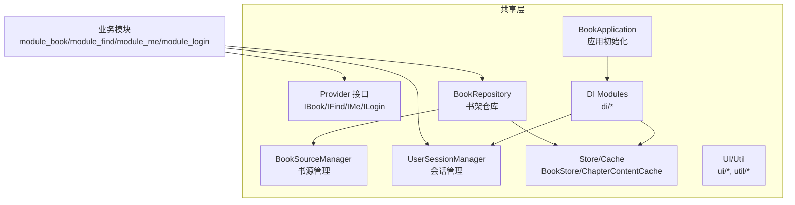
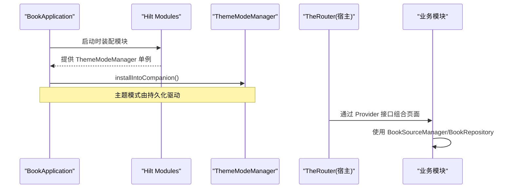
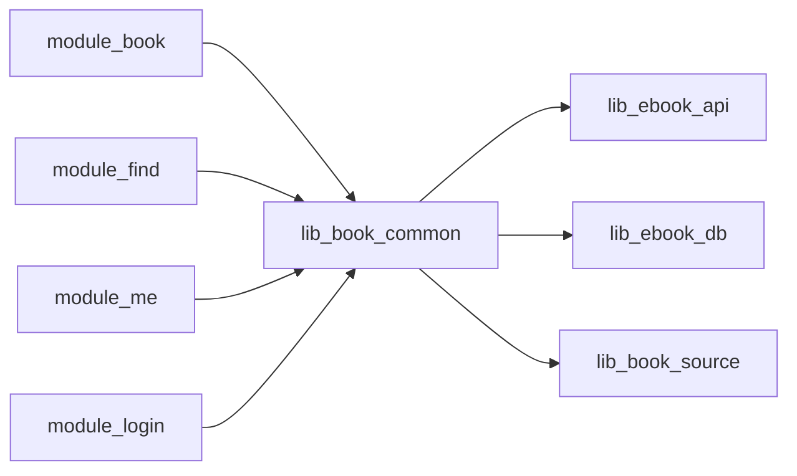

# 共享库模块

<cite>
**本文引用的文件**
- [BookApplication.kt](file://lib_book_common/src/main/java/com/ebook/common/BookApplication.kt)
- [IBookProvider.kt](file://lib_book_common/src/main/java/com/ebook/common/provider/IBookProvider.kt)
- [IFindProvider.kt](file://lib_book_common/src/main/java/com/ebook/common/provider/IFindProvider.kt)
- [IMeProvider.kt](file://lib_book_common/src/main/java/com/ebook/common/provider/IMeProvider.kt)
- [ILoginProvider.kt](file://lib_book_common/src/main/java/com/ebook/common/provider/ILoginProvider.kt)
- [BookSourceManager.kt](file://lib_book_common/src/main/java/com/ebook/common/analyze/source/BookSourceManager.kt)
- [BookRepository.kt](file://lib_book_common/src/main/java/com/ebook/common/repository/BookRepository.kt)
- [UserSessionManager.kt](file://lib_book_common/src/main/java/com/ebook/common/domain/UserSessionManager.kt)
- [AndroidUserSessionManager.kt](file://lib_book_common/src/main/java/com/ebook/common/domain/AndroidUserSessionManager.kt)
- [ThemeModeManager.kt](file://lib_book_common/src/main/java/com/ebook/common/domain/ThemeModeManager.kt)
- [CommonUiComponents.kt](file://lib_book_common/src/main/java/com/ebook/common/ui/CommonUiComponents.kt)
- [CommonPainters.kt](file://lib_book_common/src/main/java/com/ebook/common/ui/CommonPainters.kt)
- [BookCover.kt](file://lib_book_common/src/main/java/com/ebook/common/ui/BookCover.kt)
- [Avatar.kt](file://lib_book_common/src/main/java/com/ebook/common/ui/Avatar.kt)
- [DateUtil.kt](file://lib_book_common/src/main/java/com/ebook/common/util/DateUtil.kt)
- [SPUtil.kt](file://lib_book_common/src/main/java/com/ebook/common/util/SPUtil.kt)
- [FormatSize.kt](file://lib_book_common/src/main/java/com/ebook/common/util/FormatSize.kt)
- [FileTree.kt](file://lib_book_common/src/main/java/com/ebook/common/util/FileTree.kt)
- [FailureReport.kt](file://lib_book_common/src/main/java/com/ebook/common/util/FailureReport.kt)
- [LoginInterceptor.kt](file://lib_book_common/src/main/java/com/ebook/common/interceptor/LoginInterceptor.kt)
- [ContentStoreModule.kt](file://lib_book_common/src/main/java/com/ebook/common/di/ContentStoreModule.kt)
- [SandboxModule.kt](file://lib_book_common/src/main/java/com/ebook/common/di/SandboxModule.kt)
- [ThemeModule.kt](file://lib_book_common/src/main/java/com/ebook/common/di/ThemeModule.kt)
- [TransactionModule.kt](file://lib_book_common/src/main/java/com/ebook/common/di/TransactionModule.kt)
- [AnalyzeModule.kt](file://lib_book_common/src/main/java/com/ebook/common/di/AnalyzeModule.kt)
- [SessionModule.kt](file://lib_book_common/src/main/java/com/ebook/common/di/SessionModule.kt)
- [ImportScratch.kt](file://lib_book_common/src/main/java/com/ebook/common/di/ImportScratch.kt)
- [BookShelfManager.kt](file://lib_book_common/src/main/java/com/ebook/common/manager/BookShelfManager.kt)
- [ErrorAnalyzeContentManager.kt](file://lib_book_common/src/main/java/com/ebook/common/manager/ErrorAnalyzeContentManager.kt)
- [Constant.kt](file://lib_book_common/src/main/java/com/ebook/common/event/Constant.kt)
- [KeyCode.kt](file://lib_book_common/src/main/java/com/ebook/common/event/KeyCode.kt)
- [RouteArgs.kt](file://lib_book_common/src/main/java/com/ebook/common/event/RouteArgs.kt)
- [LocalBookImporter.kt](file://lib_book_common/src/main/java/com/ebook/common/importer/LocalBookImporter.kt)
- [LocalImportCoordinator.kt](file://lib_book_common/src/main/java/com/ebook/common/importer/LocalImportCoordinator.kt)
- [ChapterReader.kt](file://lib_book_common/src/main/java/com/ebook/common/analyze/local/ChapterReader.kt)
- [EpubSourceReader.kt](file://lib_book_common/src/main/java/com/ebook/common/analyze/local/EpubSourceReader.kt)
- [TxtSourceReader.kt](file://lib_book_common/src/main/java/com/ebook/common/analyze/local/TxtSourceReader.kt)
- [JsoupSourceReader.kt](file://lib_book_common/src/main/java/com/ebook/common/analyze/source/JsoupSourceReader.kt)
- [BookStore.kt](file://lib_book_common/src/main/java/com/ebook/common/store/BookStore.kt)
- [ChapterContentCache.kt](file://lib_book_common/src/main/java/com/ebook/common/store/ChapterContentCache.kt)
- [WriteTransactionRunner.kt](file://lib_book_common/src/main/java/com/ebook/common/store/WriteTransactionRunner.kt)
- [ProfileRepository.kt](file://lib_book_common/src/main/java/com/ebook/common/repository/ProfileRepository.kt)
- [CommentRepository.kt](file://lib_book_common/src/main/java/com/ebook/common/repository/CommentRepository.kt)
</cite>

## 目录
1. [引言](#引言)
2. [项目结构](#项目结构)
3. [核心组件](#核心组件)
4. [架构总览](#架构总览)
5. [详细组件分析](#详细组件分析)
6. [依赖关系分析](#依赖关系分析)
7. [性能考量](#性能考量)
8. [故障排查指南](#故障排查指南)
9. [结论](#结论)
10. [附录](#附录)

## 引言
本文件面向 lib_book_common 共享库模块，聚焦通用组件、跨模块 Provider 接口、书源管理、书籍数据仓库、应用基类、依赖注入与事件总线等主题。该模块是业务模块（module_book/module_find/module_me/module_login）共同依赖的“能力底座”，提供：
- 跨模块通信契约（Provider SPI）
- 多书源管理与解析入口（BookSourceManager）
- 书架领域仓库（BookRepository），封装 CRUD、换源、章节同步、评论聚合键
- 用户会话与会话刷新（UserSessionManager + AndroidUserSessionManager）
- 主题装配与应用初始化（BookApplication）
- 共享 UI 组件与工具（ui/util）
- 统一的异常上报与失败处理（util/FailureReport）
- Hilt 模块装配（di/*）

## 项目结构
lib_book_common 以 com.ebook.common 为根包，按职责分层组织：
- provider：跨模块页面与服务暴露（IBookProvider、IFindProvider、IMeProvider、ILoginProvider）
- analyze：书源与本地内容解析（source/local）
- repository：领域仓库（BookRepository、CommentRepository、ProfileRepository）
- store：内容存储与缓存（BookStore、ChapterContentCache、WriteTransactionRunner）
- domain：领域模型与会话（UserSession、UserSessionManager、ThemeModeManager 等）
- ui：共享 Compose UI 组件与绘制
- util：通用工具（日期、文件大小、文件树、失败上报等）
- di：Hilt 模块（网络/内容/沙箱/事务/主题/会话/导入临时）
- manager：业务编排器（书架、错误内容分析）
- event：路由参数与常量
- importer：本地书导入协调器

图表来源
- [BookApplication.kt:17-63](file://lib_book_common/src/main/java/com/ebook/common/BookApplication.kt#L17-L63)
- [IBookProvider.kt:5-13](file://lib_book_common/src/main/java/com/ebook/common/provider/IBookProvider.kt#L5-L13)
- [BookSourceManager.kt:51-277](file://lib_book_common/src/main/java/com/ebook/common/analyze/source/BookSourceManager.kt#L51-L277)
- [BookRepository.kt:38-74](file://lib_book_common/src/main/java/com/ebook/common/repository/BookRepository.kt#L38-L74)

章节来源
- [BookApplication.kt:17-63](file://lib_book_common/src/main/java/com/ebook/common/BookApplication.kt#L17-L63)
- [IBookProvider.kt:5-13](file://lib_book_common/src/main/java/com/ebook/common/provider/IBookProvider.kt#L5-L13)
- [BookSourceManager.kt:51-277](file://lib_book_common/src/main/java/com/ebook/common/analyze/source/BookSourceManager.kt#L51-L277)
- [BookRepository.kt:38-74](file://lib_book_common/src/main/java/com/ebook/common/repository/BookRepository.kt#L38-L74)

## 核心组件
- BookApplication：进程门隔离沙箱进程，装配 Compose 主题模式，并通过 EntryPoint 获取 ThemeModeManager。
- Provider 接口族：将各功能模块的主页以 @Composable 形式暴露给宿主组合；登录服务暴露服务端登出。
- BookSourceManager：书源清单唯一入口，提供规则类型化读面、默认源订阅、聚合搜索、脚本源支持、分类条目等。
- BookRepository：书架领域仓库，统一读取章节正文、换源、目录重抓追加、评论键并集、内容对账等。
- UserSessionManager：认证状态与双 token 管理；AndroidUserSessionManager 负责持久化与内存令牌桥接。
- Store/Cache：BookStore 管理章文件与目录生命周期；ChapterContentCache 提供章节内容内存缓存；WriteTransactionRunner 封装写事务。
- UI/Util：共享 Compose 组件（卡片、列表项、封面、头像等）、格式化工具（日期、文件大小）、文件树统计、失败上报。
- DI 模块：按域拆分 Hilt 模块（内容、沙箱、主题、事务、分析、会话、导入临时）。

章节来源
- [BookApplication.kt:17-63](file://lib_book_common/src/main/java/com/ebook/common/BookApplication.kt#L17-L63)
- [IBookProvider.kt:5-13](file://lib_book_common/src/main/java/com/ebook/common/provider/IBookProvider.kt#L5-L13)
- [IFindProvider.kt:5-13](file://lib_book_common/src/main/java/com/ebook/common/provider/IFindProvider.kt#L5-L13)
- [IMeProvider.kt:5-13](file://lib_book_common/src/main/java/com/ebook/common/provider/IMeProvider.kt#L5-L13)
- [ILoginProvider.kt:3-19](file://lib_book_common/src/main/java/com/ebook/common/provider/ILoginProvider.kt#L3-L19)
- [BookSourceManager.kt:51-277](file://lib_book_common/src/main/java/com/ebook/common/analyze/source/BookSourceManager.kt#L51-L277)
- [BookRepository.kt:38-868](file://lib_book_common/src/main/java/com/ebook/common/repository/BookRepository.kt#L38-L868)
- [UserSessionManager.kt:5-62](file://lib_book_common/src/main/java/com/ebook/common/domain/UserSessionManager.kt#L5-L62)
- [AndroidUserSessionManager.kt:1-200](file://lib_book_common/src/main/java/com/ebook/common/domain/AndroidUserSessionManager.kt#L1-L200)
- [BookStore.kt:1-200](file://lib_book_common/src/main/java/com/ebook/common/store/BookStore.kt#L1-L200)
- [ChapterContentCache.kt:1-200](file://lib_book_common/src/main/java/com/ebook/common/store/ChapterContentCache.kt#L1-L200)
- [WriteTransactionRunner.kt:1-200](file://lib_book_common/src/main/java/com/ebook/common/store/WriteTransactionRunner.kt#L1-L200)

## 架构总览
lib_book_common 通过 Provider 解耦跨模块页面组合，通过 BookSourceManager/BookRepository 解耦书源与书架领域逻辑，通过 Hilt 模块装配运行时依赖（网络、存储、沙箱、事务、主题、会话），并以 SharedFlow 作为事件总线替代历史 RxBus。

图表来源
- [BookApplication.kt:17-63](file://lib_book_common/src/main/java/com/ebook/common/BookApplication.kt#L17-L63)
- [ThemeModule.kt:1-200](file://lib_book_common/src/main/java/com/ebook/common/di/ThemeModule.kt#L1-L200)
- [IBookProvider.kt:5-13](file://lib_book_common/src/main/java/com/ebook/common/provider/IBookProvider.kt#L5-L13)

## 详细组件分析

### 跨模块通信机制（Provider SPI）
- IBookProvider/IFindProvider/IMeProvider：返回 @Composable 页面函数，供 module_main 的 NavHost 直接组合；ViewModel 作用域绑定调用处的 NavBackStackEntry。
- ILoginProvider：暴露服务端侧登出（Result<Unit>），本地会话清理由 UserSessionManager 统一负责；独立运行下可能无实现，调用方需容忍空实现。

扩展示例思路
- 新增一个跨模块能力：在 lib_book_common 定义新 Provider 接口，在对应业务模块实现并在 TheRouter 注册；宿主通过 Provider 工厂创建实例并组合页面。

章节来源
- [IBookProvider.kt:5-13](file://lib_book_common/src/main/java/com/ebook/common/provider/IBookProvider.kt#L5-L13)
- [IFindProvider.kt:5-13](file://lib_book_common/src/main/java/com/ebook/common/provider/IFindProvider.kt#L5-L13)
- [IMeProvider.kt:5-13](file://lib_book_common/src/main/java/com/ebook/common/provider/IMeProvider.kt#L5-L13)
- [ILoginProvider.kt:3-19](file://lib_book_common/src/main/java/com/ebook/common/provider/ILoginProvider.kt#L3-L19)

### 书源管理接口（BookSourceManager）
- 规则类型化读面：getAllSources/getEnabledSources/getSourceByUrl 仅返回原生规则（避免脚本 JSON 硬解为空规则或抛错）。
- 默认源订阅：observeDefaultSource 返回 SourceDefinition?，候选来自启用行（含脚本源），全禁用时为 null。
- 解析器获取：getParserFor(sourceUrl) 带 LRU 缓存；脚本行永不返回 null，首次求值才加载规则并可能在异常中报告 JSON 解析失败。
- 聚合搜索：searchAcross 并发上限 5，单源失败不中断流，AllFinished 标志全部完成。
- 管理操作：addSource/addScriptSource/removeSource/setEnabled/setDefaultSource，落库后失效 parser 缓存，必要时提升默认源。
- 分类条目：getExploreEntries 返回原生 kinds 或脚本 exploreUrl 条目，纯解析零网络。
- 导入导出：importFromJson/exportToJson。

章节来源
- [BookSourceManager.kt:51-277](file://lib_book_common/src/main/java/com/ebook/common/analyze/source/BookSourceManager.kt#L51-L277)

### 书籍数据访问（BookRepository）
- 书架 CRUD：getAllBooks/observeBookShelf/getAllBooksWithDetails/getBookByUrl/saveProgress/addToShelf/removeFromShelf。
- 统一章节读取：loadChapter 经 ChapterReader 路由（本地/网络），规范化清洗后再缓存；缓存未命中则 reader 内部判盘取网。
- 阅读中换源：switchSource 分“网络解析”和“事务写库”两段，先插新、吸收旧键、删旧、清旧下载队列；失败窗口有明确说明与自愈路径。
- 目录重抓追加：syncChaptersFromSource 限频判定→按 tag 取 parser→远端目录比对→仅在可追加时写入尾部新章并广播 ChaptersUpdated。
- 内容对账：reconcileContentStore 回收 DB 已无书的目录与残留文件。
- 评论键并集：getCommentKeysForBook/getPrimaryKeyForBook/absorbGroupKeys/splitBook/updateMatchMeta。
- 事件总线：SharedFlow<BookShelfEvent> 替代历史 RxBus。

章节来源
- [BookRepository.kt:38-868](file://lib_book_common/src/main/java/com/ebook/common/repository/BookRepository.kt#L38-L868)

### 应用基类与主题装配（BookApplication）
- 进程门：在沙箱进程跳过主题装配与 SP 读写，避免无意义 IO 失败。
- 主题装配：通过 AppTheme.install 读取 ThemeModeManager 的状态流，决定深色模式。
- Hilt 集成：使用 EntryPointAccessors 从 SingletonComponent 取出 ThemeModeManager 并安装到伴生对象，供 Compose 重组读取。

章节来源
- [BookApplication.kt:17-63](file://lib_book_common/src/main/java/com/ebook/common/BookApplication.kt#L17-L63)
- [ThemeModeManager.kt:1-200](file://lib_book_common/src/main/java/com/ebook/common/domain/ThemeModeManager.kt#L1-L200)

### 用户会话与会话刷新（UserSessionManager + AndroidUserSessionManager）
- UserSessionManager：暴露 isLoggedIn/currentUser StateFlow，saveSession/rotateCredentials/clearSession/getToken/getRefreshToken。
- AndroidUserSessionManager：实现持久化与内存令牌桥接，遵循“密码不落盘、access token 驻内存”的约定。

章节来源
- [UserSessionManager.kt:5-62](file://lib_book_common/src/main/java/com/ebook/common/domain/UserSessionManager.kt#L5-L62)
- [AndroidUserSessionManager.kt:1-200](file://lib_book_common/src/main/java/com/ebook/common/domain/AndroidUserSessionManager.kt#L1-L200)

### MVVM 基类与领域模型
- MVVM 基类与 Activity 基类由外部 lib_common 提供；本模块通过 BookRepository 暴露领域能力，ViewModel 在其之上组装 UI 状态。
- 领域模型：UserSession、BookShelfEntity、ChapterListEntity、SearchBookEntity、BookGroupEntity 等由 lib_ebook_db 提供，本模块通过 Repository 进行组合与转换。

章节来源
- [BookRepository.kt:38-868](file://lib_book_common/src/main/java/com/ebook/common/repository/BookRepository.kt#L38-L868)

### Common UI 组件与工具
- UI：CommonCard/CommonListItem/InfoChip/BookCover/Avatar 等共享组件集中放在 ui 包，字体走 Material typography，兜底图与资源集中管理。
- 工具：DateUtil/FormatSize/FileTree/SPUtil 等；FailureReport 统一上报失败，避免重复提示。

章节来源
- [CommonUiComponents.kt:1-200](file://lib_book_common/src/main/java/com/ebook/common/ui/CommonUiComponents.kt#L1-L200)
- [CommonPainters.kt:1-200](file://lib_book_common/src/main/java/com/ebook/common/ui/CommonPainters.kt#L1-L200)
- [BookCover.kt:1-200](file://lib_book_common/src/main/java/com/ebook/common/ui/BookCover.kt#L1-L200)
- [Avatar.kt:1-200](file://lib_book_common/src/main/java/com/ebook/common/ui/Avatar.kt#L1-L200)
- [DateUtil.kt:1-200](file://lib_book_common/src/main/java/com/ebook/common/util/DateUtil.kt#L1-L200)
- [FormatSize.kt:1-200](file://lib_book_common/src/main/java/com/ebook/common/util/FormatSize.kt#L1-L200)
- [FileTree.kt:1-200](file://lib_book_common/src/main/java/com/ebook/common/util/FileTree.kt#L1-L200)
- [SPUtil.kt:1-200](file://lib_book_common/src/main/java/com/ebook/common/util/SPUtil.kt#L1-L200)
- [FailureReport.kt:1-200](file://lib_book_common/src/main/java/com/ebook/common/util/FailureReport.kt#L1-L200)

### 依赖注入配置（Hilt 模块）
- ContentStoreModule：内容存储相关依赖（BookStore 等）。
- SandboxModule：脚本沙箱执行器客户端与 Host 装配。
- ThemeModule：主题模式管理器与相关依赖。
- TransactionModule：写事务封装（WriteTransactionRunner）。
- AnalyzeModule：解析器与书源解析相关依赖。
- SessionModule：会话相关依赖。
- ImportScratch：导入临时设施。

章节来源
- [ContentStoreModule.kt:1-200](file://lib_book_common/src/main/java/com/ebook/common/di/ContentStoreModule.kt#L1-L200)
- [SandboxModule.kt:1-200](file://lib_book_common/src/main/java/com/ebook/common/di/SandboxModule.kt#L1-L200)
- [ThemeModule.kt:1-200](file://lib_book_common/src/main/java/com/ebook/common/di/ThemeModule.kt#L1-L200)
- [TransactionModule.kt:1-200](file://lib_book_common/src/main/java/com/ebook/common/di/TransactionModule.kt#L1-L200)
- [AnalyzeModule.kt:1-200](file://lib_book_common/src/main/java/com/ebook/common/di/AnalyzeModule.kt#L1-L200)
- [SessionModule.kt:1-200](file://lib_book_common/src/main/java/com/ebook/common/di/SessionModule.kt#L1-L200)
- [ImportScratch.kt:1-200](file://lib_book_common/src/main/java/com/ebook/common/di/ImportScratch.kt#L1-L200)

### 事件总线设计
- 使用 Kotlin Coroutines + Flow 的 SharedFlow 作为事件总线（例如 BookRepository.bookShelfEvents），已替代 RxBus。
- 事件类型包括 Added/Removed/ProgressUpdated/ChaptersUpdated，语义清晰、消费方按需订阅。

章节来源
- [BookRepository.kt:75-77](file://lib_book_common/src/main/java/com/ebook/common/repository/BookRepository.kt#L75-L77)
- [BookRepository.kt:873-892](file://lib_book_common/src/main/java/com/ebook/common/repository/BookRepository.kt#L873-L892)

### 本地内容与解析链
- ChapterReader：抽象章节读取器，具体实现 TxtSourceReader/EpubSourceReader 等。
- JsoupSourceReader：网络书源解析器，依赖 BookStore/ChapterReader/BookSourceManager，居 lib_book_common 内避免环依赖。
- BookStore：章节文件与目录的生命周期管理；ChapterContentCache：章节内容内存缓存。

章节来源
- [ChapterReader.kt:1-200](file://lib_book_common/src/main/java/com/ebook/common/analyze/local/ChapterReader.kt#L1-L200)
- [TxtSourceReader.kt:1-200](file://lib_book_common/src/main/java/com/ebook/common/analyze/local/TxtSourceReader.kt#L1-L200)
- [EpubSourceReader.kt:1-200](file://lib_book_common/src/main/java/com/ebook/common/analyze/local/EpubSourceReader.kt#L1-L200)
- [JsoupSourceReader.kt:1-200](file://lib_book_common/src/main/java/com/ebook/common/analyze/source/JsoupSourceReader.kt#L1-L200)
- [BookStore.kt:1-200](file://lib_book_common/src/main/java/com/ebook/common/store/BookStore.kt#L1-L200)
- [ChapterContentCache.kt:1-200](file://lib_book_common/src/main/java/com/ebook/common/store/ChapterContentCache.kt#L1-L200)

### 异常处理的统一规范
- FailureReport：统一失败上报，避免重复提示；网络层会话过期统一收口，调用方通过 reportFailure 上报。
- 书源异常：BookSourceNotFoundException、BookAlreadyOnShelfException 等类型化异常用于区分失败原因。
- 目录重抓结果：ChapterSyncResult 密封类表达 UpToDate/Diverged/Appended/Throttled/NotNetworkBook/Failed，UI 据此呈现人话。

章节来源
- [FailureReport.kt:1-200](file://lib_book_common/src/main/java/com/ebook/common/util/FailureReport.kt#L1-L200)
- [BookRepository.kt:970-991](file://lib_book_common/src/main/java/com/ebook/common/repository/BookRepository.kt#L970-L991)
- [BookRepository.kt:912-949](file://lib_book_common/src/main/java/com/ebook/common/repository/BookRepository.kt#L912-L949)

## 依赖关系分析
- 业务模块依赖 lib_book_common 提供的 Provider、Repository、Domain、Store、UI、Util 等能力。
- lib_book_common 依赖 lib_ebook_api（实体/网络）、lib_ebook_db（Room DAO/Entity）、lib_book_source（解析器与脚本沙箱）。
- Hilt 模块将网络、存储、沙箱、事务等细粒度依赖注入到仓库与业务组件中。

图表来源
- [BookRepository.kt:38-74](file://lib_book_common/src/main/java/com/ebook/common/repository/BookRepository.kt#L38-L74)
- [BookSourceManager.kt:51-277](file://lib_book_common/src/main/java/com/ebook/common/analyze/source/BookSourceManager.kt#L51-L277)

章节来源
- [BookRepository.kt:38-74](file://lib_book_common/src/main/java/com/ebook/common/repository/BookRepository.kt#L38-L74)
- [BookSourceManager.kt:51-277](file://lib_book_common/src/main/java/com/ebook/common/analyze/source/BookSourceManager.kt#L51-L277)

## 性能考量
- 书源聚合搜索限制并发上限（5），避免触发第三方站点风控。
- 章节内容通过 ChapterContentCache 做内存缓存，减少重复计算与网络请求。
- 目录重抓采用限频策略（final_refresh_data），避免频繁请求。
- 写事务集中在 WriteTransactionRunner 内，缩短 Room 写事务时间。
- 内容对账只在启动时执行一次，回收孤立目录与残留文件。

[本节为通用指导，不直接分析具体文件]

## 故障排查指南
- 会话过期：网络层统一处理，调用方通过 reportFailure 上报，不再手写 sessionExpired 分支。
- 书源缺失/坏规则：getParserFor 返回 null 表示不存在/坏行；脚本行首次求值才抛类型化异常；调用方应区分“无源”和“规则不可用”。
- 目录重抓失败：ChapterSyncResult.Failed 携带 cause，仅在用户主动刷新时提示；自动检查静默记录日志。
- 内容对账问题：确认 reconcileContentStore 是否在进程启动时执行一次；注意导入进行中不得调用。
- 主题装配：若沙箱进程误入主题装配，检查 BookApplication 的进程门；确保 ThemeModeManager 已正确安装到伴生对象。

章节来源
- [BookRepository.kt:912-949](file://lib_book_common/src/main/java/com/ebook/common/repository/BookRepository.kt#L912-L949)
- [BookRepository.kt:970-991](file://lib_book_common/src/main/java/com/ebook/common/repository/BookRepository.kt#L970-L991)
- [BookApplication.kt:17-63](file://lib_book_common/src/main/java/com/ebook/common/BookApplication.kt#L17-L63)

## 结论
lib_book_common 通过清晰的 Provider SPI、强边界化的书源管理与书架仓库、统一的会话与会题装配、以及稳健的事件与异常体系，为多模块业务提供了稳定可靠的共享能力。新增能力建议优先在本模块沉淀通用性，保持业务模块专注 UI 与流程编排。

[本节为总结，不直接分析具体文件]

## 附录
- 如何扩展 Provider 接口：在 lib_book_common 定义新接口（如 INewFeatureProvider），在目标模块实现并通过 TheRouter 注册；宿主通过 Provider 工厂组合页面。
- 如何实现新的 Repository：参考 BookRepository 的模式，封装 DAO/Store/Manager，使用 SharedFlow 暴露事件，所有写操作置于事务块，失败通过 Result 或密封类返回。
- 如何使用基类进行开发：业务模块 ViewModel 继承 lib_common 的 BaseViewModel，Activity 继承 BaseMvvmActivity；页面状态用 mutableStateOf 管理；统一通过基类处理 loading/覆盖层与命令通道。

[本节为实践指引，不直接分析具体文件]