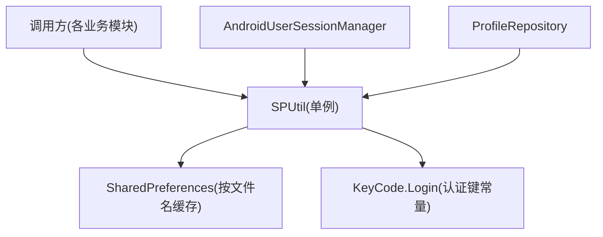
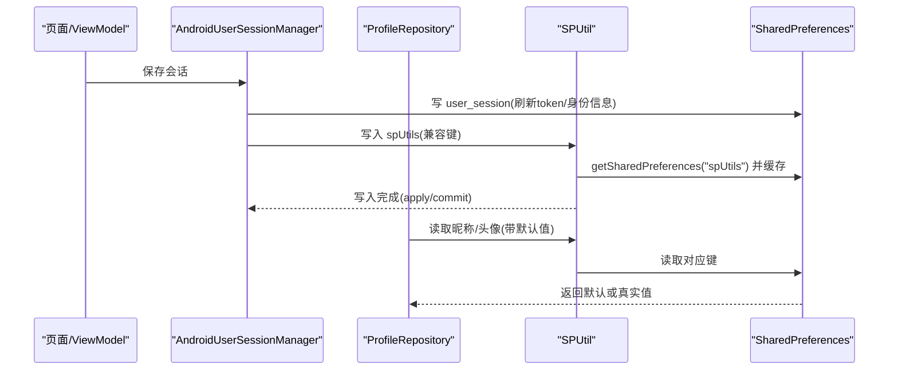
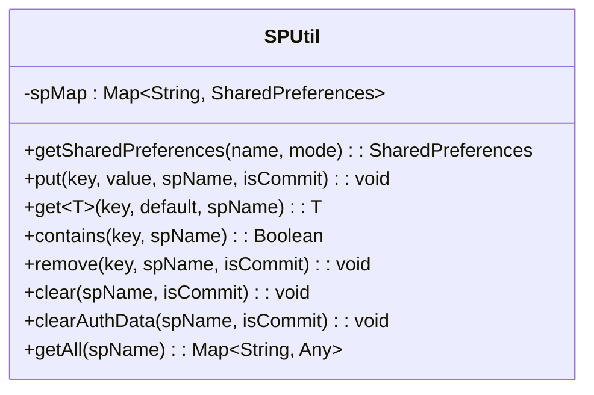
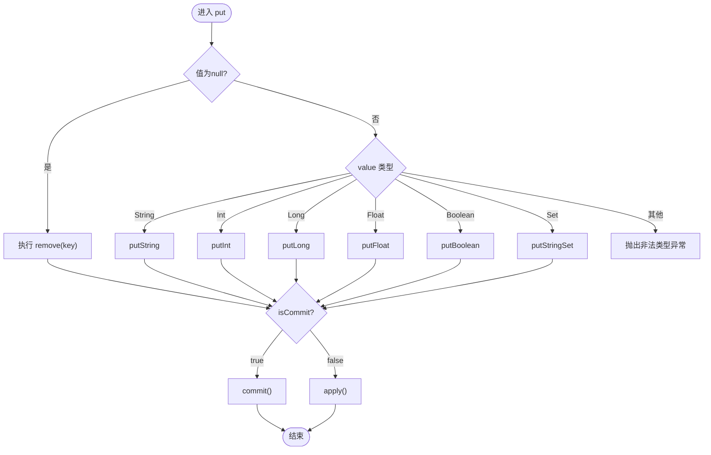
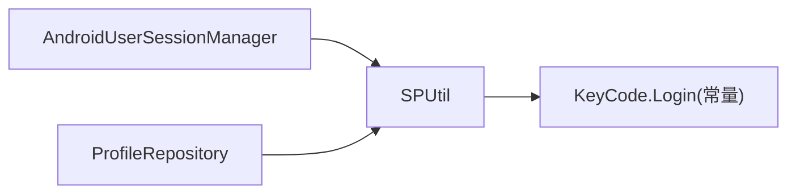

# SharedPreferences封装工具

<cite>
**本文引用的文件**
- [SPUtil.kt](file://lib_book_common/src/main/java/com/ebook/common/util/SPUtil.kt)
- [KeyCode.kt](file://lib_book_common/src/main/java/com/ebook/common/event/KeyCode.kt)
- [AndroidUserSessionManager.kt](file://lib_book_common/src/main/java/com/ebook/common/domain/AndroidUserSessionManager.kt)
- [ProfileRepository.kt](file://lib_book_common/src/main/java/com/ebook/common/repository/ProfileRepository.kt)
</cite>

## 目录
1. [简介](#简介)
2. [项目结构](#项目结构)
3. [核心组件](#核心组件)
4. [架构总览](#架构总览)
5. [详细组件分析](#详细组件分析)
6. [依赖关系分析](#依赖关系分析)
7. [性能与线程安全](#性能与线程安全)
8. [故障排查指南](#故障排查指南)
9. [结论](#结论)

## 简介
本文件面向项目中对 Android SharedPreferences 的统一封装——SPUtil。它提供单例访问、多 SP 文件管理、类型安全的 put/get、默认值策略、异步（apply）与同步（commit）写入选择，以及认证数据的安全清理能力。同时说明与登录会话、用户信息流等组件的集成方式，帮助在复杂业务中稳定、高效地读写本地偏好数据。

## 项目结构
- SPUtil 位于共享库 lib_book_common 的工具包中，被多个模块复用。
- 认证键常量集中定义在 KeyCode.Login 中，便于统一管理与迁移。
- AndroidUserSessionManager 负责会话生命周期，并借助 SPUtil 维护兼容的 spUtils 文件。
- ProfileRepository 使用 StateFlow 暴露用户昵称/头像，并在构造时从 SP 恢复状态。

图表来源
- [SPUtil.kt:1-93](file://lib_book_common/src/main/java/com/ebook/common/util/SPUtil.kt#L1-L93)
- [KeyCode.kt:13-42](file://lib_book_common/src/main/java/com/ebook/common/event/KeyCode.kt#L13-L42)
- [AndroidUserSessionManager.kt:61-85](file://lib_book_common/src/main/java/com/ebook/common/domain/AndroidUserSessionManager.kt#L61-L85)
- [ProfileRepository.kt:20-38](file://lib_book_common/src/main/java/com/ebook/common/repository/ProfileRepository.kt#L20-L38)

章节来源
- [SPUtil.kt:1-93](file://lib_book_common/src/main/java/com/ebook/common/util/SPUtil.kt#L1-L93)
- [KeyCode.kt:1-104](file://lib_book_common/src/main/java/com/ebook/common/event/KeyCode.kt#L1-L104)
- [AndroidUserSessionManager.kt:1-162](file://lib_book_common/src/main/java/com/ebook/common/domain/AndroidUserSessionManager.kt#L1-L162)
- [ProfileRepository.kt:1-60](file://lib_book_common/src/main/java/com/ebook/common/repository/ProfileRepository.kt#L1-L60)

## 核心组件
- SPUtil：单例对象，封装 SharedPreferences 的获取、读写、删除、清空、批量读取等操作；支持多 SP 文件与类型推断。
- KeyCode.Login：认证相关键名常量（如是否登录、用户名、昵称、头像、用户ID）。
- AndroidUserSessionManager：会话管理器，负责登录/登出时的内存与持久化同步，并通过 SPUtil 维护兼容的 spUtils 文件。
- ProfileRepository：用户信息仓库，以 StateFlow 暴露昵称/头像，并从 SP 恢复初始状态。

章节来源
- [SPUtil.kt:1-93](file://lib_book_common/src/main/java/com/ebook/common/util/SPUtil.kt#L1-L93)
- [KeyCode.kt:13-42](file://lib_book_common/src/main/java/com/ebook/common/event/KeyCode.kt#L13-L42)
- [AndroidUserSessionManager.kt:17-133](file://lib_book_common/src/main/java/com/ebook/common/domain/AndroidUserSessionManager.kt#L17-L133)
- [ProfileRepository.kt:12-50](file://lib_book_common/src/main/java/com/ebook/common/repository/ProfileRepository.kt#L12-L50)

## 架构总览
SPUtil 作为底层存储抽象，屏蔽了 SharedPreferences 的细节差异，向上层提供一致的 API。上层通过常量集中管理键名，避免魔法字符串散落各处。会话与个人信息等模块将“内存态 + SP 持久化”统一收敛到各自管理器中，确保一致性。

图表来源
- [AndroidUserSessionManager.kt:61-85](file://lib_book_common/src/main/java/com/ebook/common/domain/AndroidUserSessionManager.kt#L61-L85)
- [SPUtil.kt:23-31](file://lib_book_common/src/main/java/com/ebook/common/util/SPUtil.kt#L23-L31)
- [ProfileRepository.kt:20-38](file://lib_book_common/src/main/java/com/ebook/common/repository/ProfileRepository.kt#L20-L38)

## 详细组件分析

### SPUtil：单例设计与多文件管理
- 单例模式：以 Kotlin object 实现全局唯一入口，避免重复创建与上下文持有风险。
- 多 SP 文件：内部维护 spMap，按文件名懒加载并缓存 SharedPreferences 实例，减少重复开销。
- 默认文件名：未显式指定时使用内置默认名称，保证向后兼容。
- 安全清理：clearAuthData 仅移除与登录相关的键，不破坏其他偏好设置。

图表来源
- [SPUtil.kt:1-93](file://lib_book_common/src/main/java/com/ebook/common/util/SPUtil.kt#L1-L93)

章节来源
- [SPUtil.kt:16-31](file://lib_book_common/src/main/java/com/ebook/common/util/SPUtil.kt#L16-L31)
- [SPUtil.kt:81-92](file://lib_book_common/src/main/java/com/ebook/common/util/SPUtil.kt#L81-L92)

### 类型安全的存取与默认值处理
- put：基于 when(value) 进行类型分发，支持 String、Int、Long、Float、Boolean、Set<String>；传入 null 等价于 remove；不支持的类型抛出异常。
- get：基于 default 参数类型推断期望类型，若类型不匹配则抛异常；未命中键时返回默认值，保障调用方无需空检查。
- Set 支持：自动过滤为 Set<String> 再写入，符合 SharedPreferences 限制。

图表来源
- [SPUtil.kt:34-47](file://lib_book_common/src/main/java/com/ebook/common/util/SPUtil.kt#L34-L47)

章节来源
- [SPUtil.kt:34-62](file://lib_book_common/src/main/java/com/ebook/common/util/SPUtil.kt#L34-L62)

### 异步写入（apply）与同步写入（commit）的选择
- 默认采用 apply（异步、非阻塞），适合大多数场景。
- 当需要立即落盘确认（例如退出前确保敏感数据已持久化），可设置 isCommit=true 使用 commit（同步、可获知失败）。
- 注意：commit 在主线程频繁调用可能引起卡顿，应谨慎使用。

章节来源
- [SPUtil.kt:34-47](file://lib_book_common/src/main/java/com/ebook/common/util/SPUtil.kt#L34-L47)

### 认证数据的安全清理（clearAuthData）
- 仅移除与登录相关的键（是否登录、用户名、昵称、用户ID、头像），保留其他偏好设置，降低误删风险。
- 配合 AndroidUserSessionManager.clearSession 完成三处镜像的一致性清理。

章节来源
- [SPUtil.kt:81-89](file://lib_book_common/src/main/java/com/ebook/common/util/SPUtil.kt#L81-L89)
- [AndroidUserSessionManager.kt:111-133](file://lib_book_common/src/main/java/com/ebook/common/domain/AndroidUserSessionManager.kt#L111-L133)
- [KeyCode.kt:13-42](file://lib_book_common/src/main/java/com/ebook/common/event/KeyCode.kt#L13-L42)

### 与其他组件的集成
- AndroidUserSessionManager：在保存会话时，除写入 user_session 外，还通过 SPUtil 写入 spUtils 的兼容键；登出时调用 clearAuthData 清理兼容键。
- ProfileRepository：构造时从 SP 恢复昵称与头像，后续变更通过 SPUtil 持久化，保持内存与磁盘一致。

章节来源
- [AndroidUserSessionManager.kt:61-85](file://lib_book_common/src/main/java/com/ebook/common/domain/AndroidUserSessionManager.kt#L61-L85)
- [AndroidUserSessionManager.kt:111-133](file://lib_book_common/src/main/java/com/ebook/common/domain/AndroidUserSessionManager.kt#L111-L133)
- [ProfileRepository.kt:20-38](file://lib_book_common/src/main/java/com/ebook/common/repository/ProfileRepository.kt#L20-L38)

### 使用示例（以路径引用代替代码片段）
- 存储不同类型的数据（String、Int、Long、Float、Boolean、Set<String>）
  - 参考：[SPUtil.kt:34-47](file://lib_book_common/src/main/java/com/ebook/common/util/SPUtil.kt#L34-L47)
- 获取数据并设置默认值
  - 参考：[SPUtil.kt:50-62](file://lib_book_common/src/main/java/com/ebook/common/util/SPUtil.kt#L50-L62)
- 批量操作（多次 put/remove/clear）
  - 参考：[SPUtil.kt:68-76](file://lib_book_common/src/main/java/com/ebook/common/util/SPUtil.kt#L68-L76)
- 仅清理认证相关数据
  - 参考：[SPUtil.kt:81-89](file://lib_book_common/src/main/java/com/ebook/common/util/SPUtil.kt#L81-L89)
- 调试用途：一次性导出某 SP 的全部键值对
  - 参考：[SPUtil.kt:91-92](file://lib_book_common/src/main/java/com/ebook/common/util/SPUtil.kt#L91-L92)

章节来源
- [SPUtil.kt:34-92](file://lib_book_common/src/main/java/com/ebook/common/util/SPUtil.kt#L34-L92)

## 依赖关系分析
- SPUtil 依赖：
  - Context：通过 BaseApplication 提供的 context 获取 SharedPreferences 实例。
  - KeyCode.Login：提供认证相关键名常量，避免硬编码。
- 被依赖方：
  - AndroidUserSessionManager：会话管理，负责多镜像一致性。
  - ProfileRepository：用户信息流，读/写偏好数据。

图表来源
- [SPUtil.kt:1-93](file://lib_book_common/src/main/java/com/ebook/common/util/SPUtil.kt#L1-L93)
- [KeyCode.kt:13-42](file://lib_book_common/src/main/java/com/ebook/common/event/KeyCode.kt#L13-L42)
- [AndroidUserSessionManager.kt:61-85](file://lib_book_common/src/main/java/com/ebook/common/domain/AndroidUserSessionManager.kt#L61-L85)
- [ProfileRepository.kt:20-38](file://lib_book_common/src/main/java/com/ebook/common/repository/ProfileRepository.kt#L20-L38)

章节来源
- [SPUtil.kt:1-93](file://lib_book_common/src/main/java/com/ebook/common/util/SPUtil.kt#L1-L93)
- [KeyCode.kt:13-42](file://lib_book_common/src/main/java/com/ebook/common/event/KeyCode.kt#L13-L42)
- [AndroidUserSessionManager.kt:61-85](file://lib_book_common/src/main/java/com/ebook/common/domain/AndroidUserSessionManager.kt#L61-L85)
- [ProfileRepository.kt:20-38](file://lib_book_common/src/main/java/com/ebook/common/repository/ProfileRepository.kt#L20-L38)

## 性能与线程安全
- 性能
  - 多 SP 文件通过 spMap 缓存，避免重复创建 SharedPreferences 实例带来的开销。
  - 默认使用 apply 异步落盘，减少主线程阻塞。
  - getAll 可用于调试统计，但不应在热路径频繁调用。
- 线程安全
  - SharedPreferences 自身是线程安全的；SPUtil 未引入额外锁，避免死锁与过度同步。
  - 如需强一致落盘（如应用退出关键路径），使用 isCommit=true 的 commit。
- 内存泄漏防护
  - SPUtil 为 object 单例，不持有 Activity/Context 长生命周期引用；通过 BaseApplication 提供的 application context 访问系统服务，降低泄漏风险。

章节来源
- [SPUtil.kt:16-31](file://lib_book_common/src/main/java/com/ebook/common/util/SPUtil.kt#L16-L31)
- [SPUtil.kt:34-47](file://lib_book_common/src/main/java/com/ebook/common/util/SPUtil.kt#L34-L47)
- [SPUtil.kt:91-92](file://lib_book_common/src/main/java/com/ebook/common/util/SPUtil.kt#L91-L92)

## 故障排查指南
- 类型不匹配异常
  - 现象：get/put 时抛出非法类型异常。
  - 原因：get 的默认值类型与存储类型不一致，或 put 传入了不支持的类型。
  - 处理：统一使用正确的默认值类型；集合请使用 Set<String>。
  - 参考：[SPUtil.kt:34-62](file://lib_book_common/src/main/java/com/ebook/common/util/SPUtil.kt#L34-L62)
- 数据未持久化
  - 现象：应用重启后数据丢失。
  - 原因：使用了 apply 且进程被杀导致未刷盘；或在关键路径未 commit。
  - 处理：关键路径使用 isCommit=true；或确保应用正常退出让 apply 落盘。
  - 参考：[SPUtil.kt:34-47](file://lib_book_common/src/main/java/com/ebook/common/util/SPUtil.kt#L34-L47)
- 认证状态不同步
  - 现象：登出后仍显示已登录或跳转逻辑异常。
  - 原因：仅清理了 user_session，未清理 spUtils 中的兼容键。
  - 处理：统一调用 AndroidUserSessionManager.clearSession，其内部会调用 SPUtil.clearAuthData。
  - 参考：[AndroidUserSessionManager.kt:111-133](file://lib_book_common/src/main/java/com/ebook/common/domain/AndroidUserSessionManager.kt#L111-L133)
- 调试定位问题
  - 使用 getAll 导出指定 SP 的全部键值对，快速核对键名与数据形态。
  - 参考：[SPUtil.kt:91-92](file://lib_book_common/src/main/java/com/ebook/common/util/SPUtil.kt#L91-L92)

章节来源
- [SPUtil.kt:34-62](file://lib_book_common/src/main/java/com/ebook/common/util/SPUtil.kt#L34-L62)
- [SPUtil.kt:91-92](file://lib_book_common/src/main/java/com/ebook/common/util/SPUtil.kt#L91-L92)
- [AndroidUserSessionManager.kt:111-133](file://lib_book_common/src/main/java/com/ebook/common/domain/AndroidUserSessionManager.kt#L111-L133)

## 结论
SPUtil 以简洁、类型安全、可扩展的方式统一了项目的本地偏好存储。通过单例与 spMap 缓存提升性能，通过 apply/commit 灵活控制写入策略，通过 clearAuthData 精准清理认证数据，并与会话、用户信息模块协同保持一致性。建议在新增键时优先使用 KeyCode 集中管理，遵循默认值策略与类型约束，必要时结合 getAll 进行调试与验证。