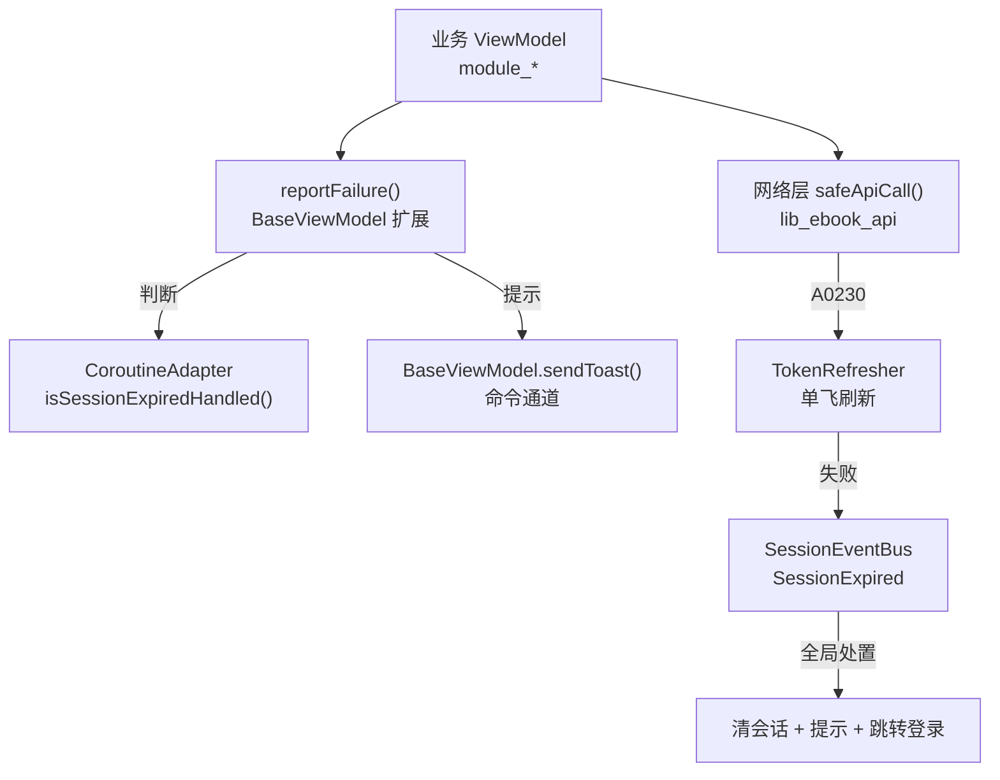
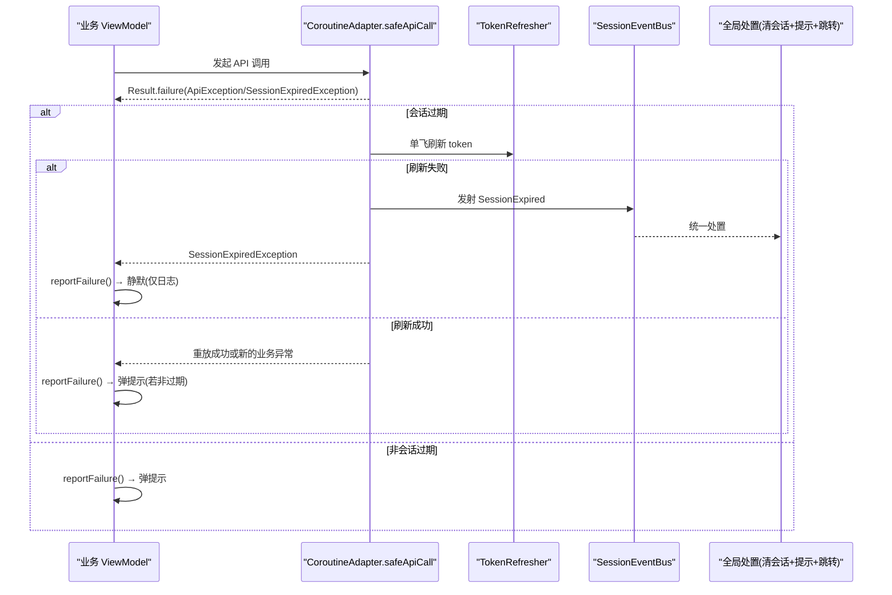
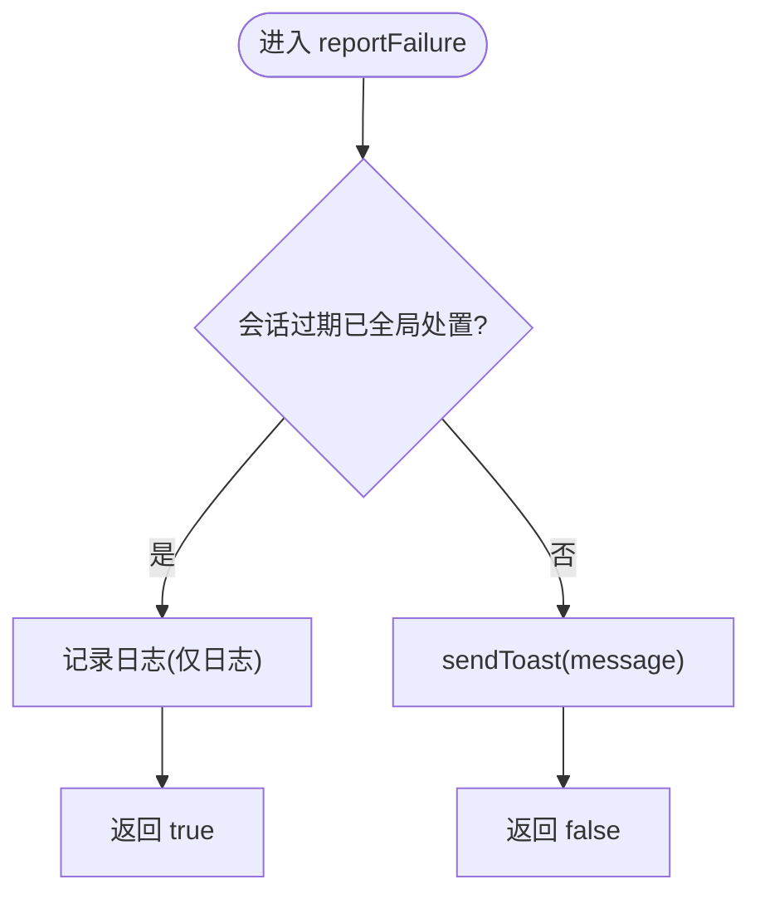
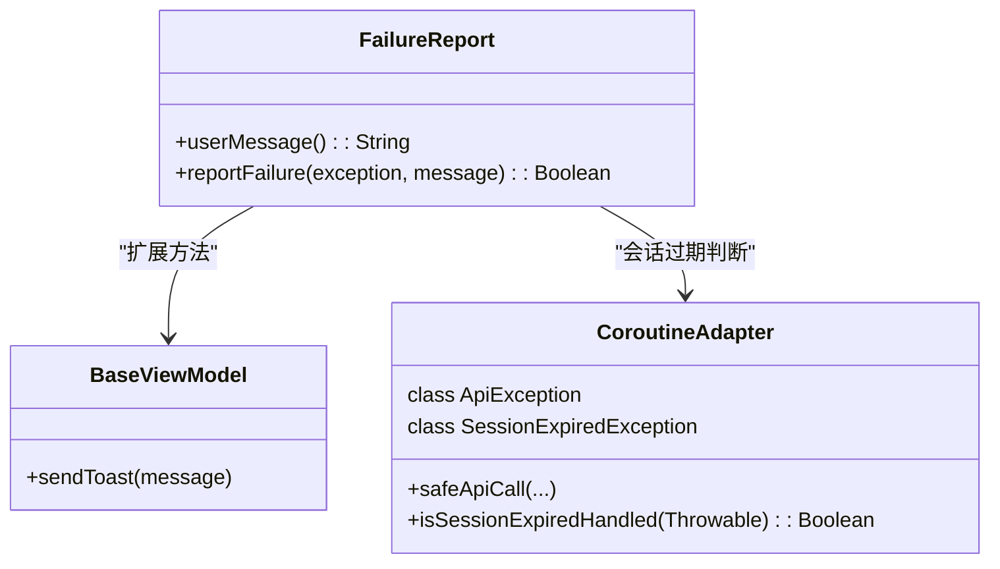

# 失败报告与用户提示

<cite>
**本文引用的文件**
- [FailureReport.kt](file://lib_book_common/src/main/java/com/ebook/common/util/FailureReport.kt)
- [CoroutineAdapter.kt](file://lib_ebook_api/src/main/java/com/ebook/api/utils/CoroutineAdapter.kt)
- [FailureReportTest.kt](file://lib_book_common/src/test/java/com/ebook/common/util/FailureReportTest.kt)
- [UserMessageTest.kt](file://lib_book_common/src/test/java/com/ebook/common/util/UserMessageTest.kt)
- [ModifyViewModel.kt](file://module_me/src/main/java/com/ebook/me/mvvm/viewmodel/ModifyViewModel.kt)
- [LoginViewModel.kt](file://module_login/src/main/java/com/ebook/login/mvvm/viewmodel/LoginViewModel.kt)
- [BookDetailViewModel.kt](file://module_book/src/main/java/com/ebook/book/mvvm/viewmodel/BookDetailViewModel.kt)
- [ReadBookActivity.kt](file://module_book/src/main/java/com/ebook/book/ReadBookActivity.kt)
</cite>

## 目录
1. [简介](#简介)
2. [项目结构中的位置](#项目结构中的位置)
3. [核心组件](#核心组件)
4. [架构总览](#架构总览)
5. [关键组件详解](#关键组件详解)
6. [依赖关系分析](#依赖关系分析)
7. [性能与可观测性](#性能与可观测性)
8. [故障排查指南](#故障排查指南)
9. [结论](#结论)

## 简介
本模块为“失败报告与用户提示”的统一收口，目标是：
- 统一错误处理策略：所有业务失败的对外提示入口唯一，避免多处重复实现。
- 会话过期特殊处理：网络层负责静默刷新与全局处置，调用点只记日志、不重复提示。
- 文案口径一致：异常到用户可见消息的转换规则集中管理，保证用户体验一致。
- 与BaseViewModel集成：通过扩展函数将Toast等一次性命令交给基类通道消费，解耦UI细节。
- 向后兼容：不改变现有调用方行为，仅收敛判断与提示出口。

## 项目结构中的位置
- 统一工具位于共享库 lib_book_common 的工具包中，供各业务模块复用。
- 网络层在 lib_ebook_api，负责请求封装、A0230 会话过期静默处置、事件总线发射。
- 业务 ViewModel（module_*）通过 BaseViewModel 继承获得命令通道能力，并在此处上报失败。

图示来源
- [FailureReport.kt:24-53](file://lib_book_common/src/main/java/com/ebook/common/util/FailureReport.kt#L24-L53)
- [CoroutineAdapter.kt:41-112](file://lib_ebook_api/src/main/java/com/ebook/api/utils/CoroutineAdapter.kt#L41-L112)

章节来源
- [FailureReport.kt:1-53](file://lib_book_common/src/main/java/com/ebook/common/util/FailureReport.kt#L1-L53)
- [CoroutineAdapter.kt:17-150](file://lib_ebook_api/src/main/java/com/ebook/api/utils/CoroutineAdapter.kt#L17-L150)

## 核心组件
- userMessage(): Throwable → String
  - 业务异常（ApiException）取服务端下发的 message()；其他异常取自身 message；空消息归空串。
- reportFailure(BaseViewModel, Throwable, String?): Boolean
  - 统一入口：若为会话过期且已全局处置，则仅记录日志并返回 true；否则通过 sendToast 弹出提示并返回 false。
- CoroutineAdapter.ApiException / SessionExpiredException
  - ApiException 携带业务码与服务端消息；SessionExpiredException 标记“已转交全局处置”。

章节来源
- [FailureReport.kt:24-53](file://lib_book_common/src/main/java/com/ebook/common/util/FailureReport.kt#L24-L53)
- [CoroutineAdapter.kt:122-149](file://lib_ebook_api/src/main/java/com/ebook/api/utils/CoroutineAdapter.kt#L122-L149)

## 架构总览
- 网络层安全调用 safeApiCall 将业务码映射为 Result：
  - A0230 触发 handleTokenExpired：先尝试单飞刷新，成功则重放一次原请求；失败则发射 SessionExpired 事件并返回 SessionExpiredException。
- 调用方（ViewModel）在 onFailure 分支统一调用 reportFailure：
  - 会话过期路径被识别后静默（仅日志），避免与全局提示重复。
  - 其他失败走 sendToast，由基类 MvvmBinder 在主线程消费。
- 全局订阅方接收 SessionExpired 事件后执行统一处置：清理会话、提示用户、跳转登录页。

图示来源
- [CoroutineAdapter.kt:41-112](file://lib_ebook_api/src/main/java/com/ebook/api/utils/CoroutineAdapter.kt#L41-L112)
- [FailureReport.kt:40-53](file://lib_book_common/src/main/java/com/ebook/common/util/FailureReport.kt#L40-L53)

## 关键组件详解

### userMessage(): 异常消息提取逻辑
- 设计目标：
  - 业务异常显示服务端原文，避免内部类名与业务码泄漏。
  - 本地异常使用其自身消息。
  - 空消息归空串，防止出现字面量 “null”。
- 复杂度：O(1)，类型判断与字符串取值。
- 可测试性：纯函数，JVM 直测覆盖三种典型情况。

章节来源
- [FailureReport.kt:24-25](file://lib_book_common/src/main/java/com/ebook/common/util/FailureReport.kt#L24-L25)
- [UserMessageTest.kt:20-35](file://lib_book_common/src/test/java/com/ebook/common/util/UserMessageTest.kt#L20-L35)

### reportFailure(): 统一入口设计与返回值语义
- 输入：
  - exception：待上报的失败。
  - message：可选的用户可见文案；默认取 exception.userMessage()，也支持固定前缀注入（如“上传头像失败：<详情>”）。
- 流程：
  - 检测是否属于“会话过期已由全局处置”：若是，仅记录日志并返回 true。
  - 否则，通过 sendToast(message) 弹出提示，返回 false。
- 返回值用途：
  - 上层可根据布尔值进行分流收尾（例如覆盖层形态差异），无需再次复制 isSessionExpiredHandled 判断。

图示来源
- [FailureReport.kt:40-53](file://lib_book_common/src/main/java/com/ebook/common/util/FailureReport.kt#L40-L53)

章节来源
- [FailureReport.kt:40-53](file://lib_book_common/src/main/java/com/ebook/common/util/FailureReport.kt#L40-L53)
- [FailureReportTest.kt:32-54](file://lib_book_common/src/test/java/com/ebook/common/util/FailureReportTest.kt#L32-L54)

### 与BaseViewModel集成的Toast机制
- BaseViewModel 提供 sendToast 方法，作为一次性命令通道，由基类 MvvmBinder 在主线程消费，确保 UI 操作安全。
- reportFailure 作为 BaseViewModel 的扩展函数，直接复用该通道，避免在各 ViewModel 中重复构造 UI 提示逻辑。
- 适用场景：大多数业务失败需要立即提示用户；仅在会话过期时静默，交由全局处置。

章节来源
- [FailureReport.kt:40-53](file://lib_book_common/src/main/java/com/ebook/common/util/FailureReport.kt#L40-L53)

### 在ViewModel中的使用示例（以路径引用代替代码片段）
- 简单失败上报：
  - 登录失败：[LoginViewModel.kt:67](file://module_login/src/main/java/com/ebook/login/mvvm/viewmodel/LoginViewModel.kt#L67)
- 带自定义前缀的消息拼接：
  - 修改头像失败：[ModifyViewModel.kt:113-118](file://module_me/src/main/java/com/ebook/me/mvvm/viewmodel/ModifyViewModel.kt#L113-L118)
- 针对特定异常类型（书源失效）给出明确提示：
  - 详情页书源缺失：[BookDetailViewModel.kt:264-265](file://module_book/src/main/java/com/ebook/book/mvvm/viewmodel/BookDetailViewModel.kt#L264-L265)
  - 阅读页书源缺失：[ReadBookActivity.kt:370](file://module_book/src/main/java/com/ebook/book/ReadBookActivity.kt#L370)

说明：
- 对会话过期异常，reportFailure 自动静默；如需按失败类型做不同收尾，依据返回值分支即可。
- 对需用户可操作的失败（如书源失效），建议传入资源化的友好文案，而非直接使用异常消息。

章节来源
- [LoginViewModel.kt:59-68](file://module_login/src/main/java/com/ebook/login/mvvm/viewmodel/LoginViewModel.kt#L59-L68)
- [ModifyViewModel.kt:83-88](file://module_me/src/main/java/com/ebook/me/mvvm/viewmodel/ModifyViewModel.kt#L83-L88)
- [ModifyViewModel.kt:113-118](file://module_me/src/main/java/com/ebook/me/mvvm/viewmodel/ModifyViewModel.kt#L113-L118)
- [BookDetailViewModel.kt:263-265](file://module_book/src/main/java/com/ebook/book/mvvm/viewmodel/BookDetailViewModel.kt#L263-L265)
- [ReadBookActivity.kt:365-370](file://module_book/src/main/java/com/ebook/book/ReadBookActivity.kt#L365-L370)

### 与网络层的协作关系
- safeApiCall 将网络结果转换为 Result，并对 A0230 做静默刷新与重放；刷新失败时发射 SessionExpired 事件。
- 调用方不应再手写 isSessionExpiredHandled 分支，统一交由 reportFailure 收口，避免重复提示。
- 日志记录：会话过期路径在 reportFailure 内仅记录日志；网络层在刷新失败时也记录日志，便于追踪。

章节来源
- [CoroutineAdapter.kt:41-112](file://lib_ebook_api/src/main/java/com/ebook/api/utils/CoroutineAdapter.kt#L41-L112)
- [FailureReport.kt:44-49](file://lib_book_common/src/main/java/com/ebook/common/util/FailureReport.kt#L44-L49)

## 依赖关系分析
- 耦合与内聚：
  - FailureReport 仅依赖 BaseViewModel 的命令通道与 Logger，低耦合、高内聚。
  - 网络层封装了会话刷新与事件总线，职责清晰。
- 外部依赖：
  - BaseViewModel（来自 lib_common）提供命令通道能力。
  - CoroutineAdapter（来自 lib_ebook_api）提供网络适配与会话过期处理。
- 循环依赖：无。

图示来源
- [FailureReport.kt:24-53](file://lib_book_common/src/main/java/com/ebook/common/util/FailureReport.kt#L24-L53)
- [CoroutineAdapter.kt:122-149](file://lib_ebook_api/src/main/java/com/ebook/api/utils/CoroutineAdapter.kt#L122-L149)

章节来源
- [FailureReport.kt:1-53](file://lib_book_common/src/main/java/com/ebook/common/util/FailureReport.kt#L1-L53)
- [CoroutineAdapter.kt:17-150](file://lib_ebook_api/src/main/java/com/ebook/api/utils/CoroutineAdapter.kt#L17-L150)

## 性能与可观测性
- 性能特性：
  - userMessage 为 O(1) 判断与取值，几乎无开销。
  - reportFailure 仅做一次异常类型判断与一次日志写入或一次命令入队，成本极低。
- 可观测性：
  - 会话过期路径均记录日志，便于定位。
  - 业务异常提示内容由统一规则生成，减少歧义。
- 优化建议：
  - 对于高频失败（如解析失败），可在上层聚合统计，但保持提示频率合理，避免打扰用户。

## 故障排查指南
- 症状：页面不闪退但数据永远加载不出来
  - 可能原因：网络超时或权限问题导致请求失败；或 mock 资产与 DTO 契约不一致被吞成未知错误。
  - 排查步骤：查看网络层日志、确认 TokenHolder 状态、检查 SessionEvent 是否触发。
- 症状：重复提示“登录已过期”
  - 可能原因：调用方未使用 reportFailure，而是自行手写分支并弹提示。
  - 修复方式：统一改为 reportFailure；会话过期路径会自动静默。
- 症状：Toast 未显示
  - 可能原因：宿主未继承 BaseMvvmActivity，命令通道无人收集。
  - 修复方式：确保 Activity 继承 BaseMvvmActivity，使 MvvmBinder 能消费 sendToast。

章节来源
- [FailureReport.kt:44-53](file://lib_book_common/src/main/java/com/ebook/common/util/FailureReport.kt#L44-L53)
- [CoroutineAdapter.kt:84-112](file://lib_ebook_api/src/main/java/com/ebook/api/utils/CoroutineAdapter.kt#L84-L112)

## 结论
- 通过 FailureReport 与 CoroutineAdapter 的协同，本项目实现了统一的失败报告与用户提示机制。
- 会话过期由网络层集中处置，调用点仅负责上报与必要收尾，避免重复提示。
- 文案口径统一、日志可追溯、与 MVVM 基类深度集成，既保证一致性又兼顾可扩展性。
- 推荐所有业务失败一律经 reportFailure 上报；对需要用户处置的失败，传入资源化友好文案；对会话过期，信任全局处置。