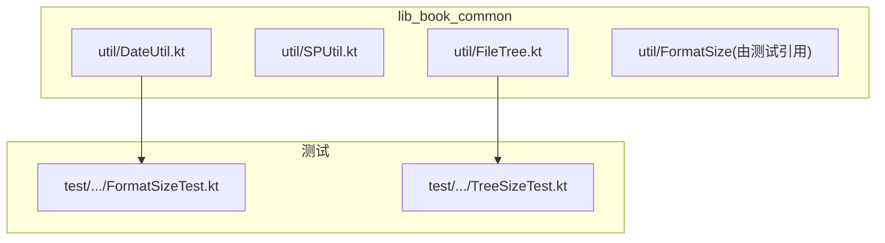
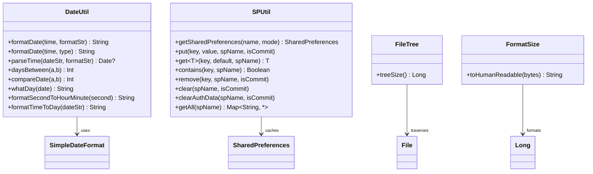
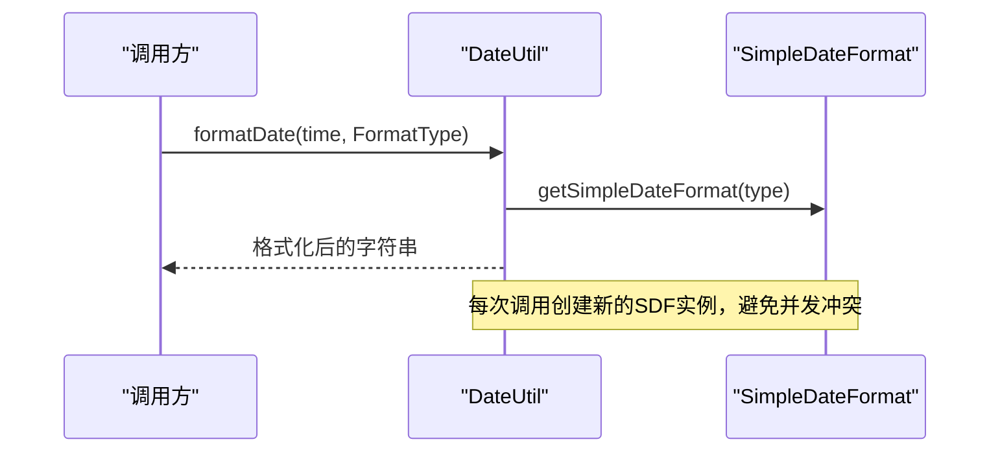
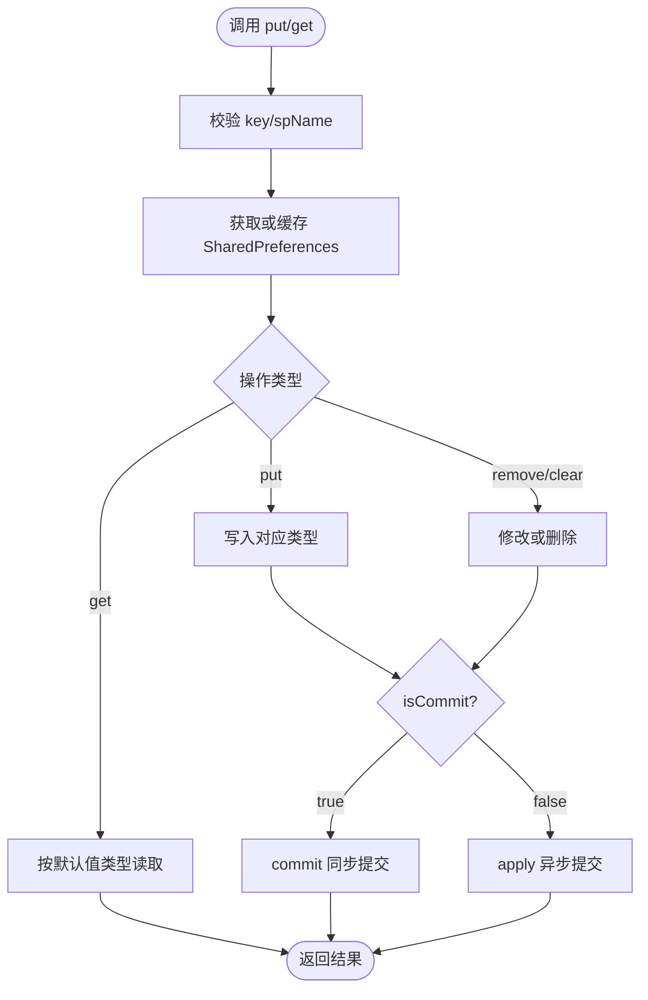
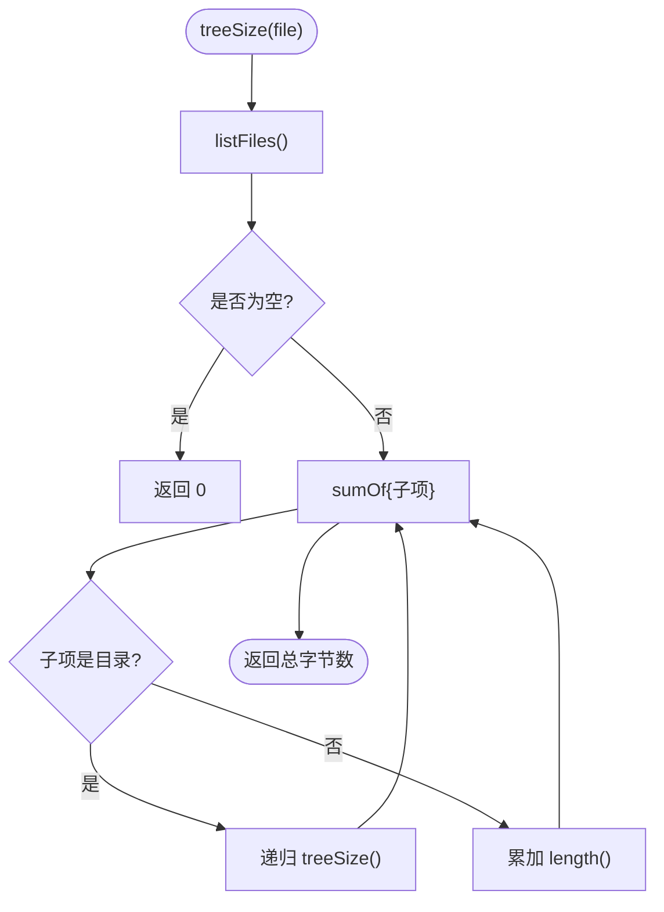
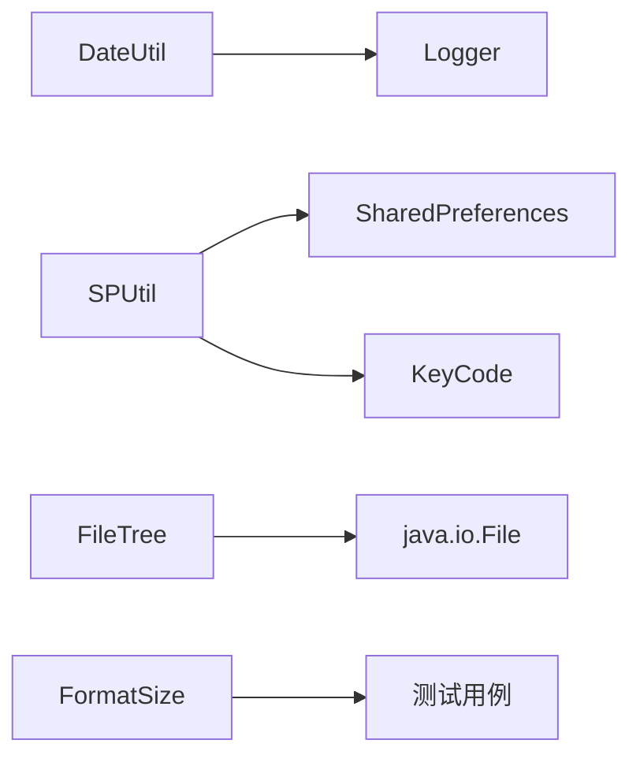

# 工具类库

<cite>
**本文引用的文件**
- [DateUtil.kt](file://lib_book_common/src/main/java/com/ebook/common/util/DateUtil.kt)
- [SPUtil.kt](file://lib_book_common/src/main/java/com/ebook/common/util/SPUtil.kt)
- [FileTree.kt](file://lib_book_common/src/main/java/com/ebook/common/util/FileTree.kt)
- [FormatSizeTest.kt](file://lib_book_common/src/test/java/com/ebook/common/util/FormatSizeTest.kt)
- [AGENTS.md](file://AGENTS.md)
</cite>

## 目录
1. [简介](#简介)
2. [项目结构](#项目结构)
3. [核心组件](#核心组件)
4. [架构总览](#架构总览)
5. [详细组件分析](#详细组件分析)
6. [依赖关系分析](#依赖关系分析)
7. [性能考量](#性能考量)
8. [故障排查指南](#故障排查指南)
9. [结论](#结论)
10. [附录](#附录)

## 简介
本仓库的工具类库位于 lib_book_common 模块的 util 包中，提供与业务解耦的通用能力。围绕以下四类工具进行系统化说明：
- DateUtil：日期时间格式化、解析、比较、相对时间显示等；
- SPUtil：基于 SharedPreferences 的 Kotlin 风格封装，支持多文件、类型安全存取与可选同步提交；
- FileTree：对目录树进行遍历并计算普通文件占用空间（域无关）；
- FormatSize：文件大小格式化输出（通过测试文件定位其存在与使用）。

文档聚焦边界情况处理、异常安全保证、性能优化策略、线程安全性、配置灵活性、扩展性设计，并提供 API 使用示例、扩展方式与单元测试要点，同时说明命名规范、API 设计原则、向后兼容性以及与 Android 系统的解耦与可移植性考虑。

## 项目结构
工具类集中在 lib_book_common/src/main/java/com/ebook/common/util，相关测试位于同模块的 test 源集下。该模块为共享层，被多个业务模块依赖，因此工具类应保持无状态或弱耦合，避免引入平台强依赖（除必要的 Android 存储访问）。

图表来源
- [DateUtil.kt:1-233](file://lib_book_common/src/main/java/com/ebook/common/util/DateUtil.kt#L1-L233)
- [SPUtil.kt:1-93](file://lib_book_common/src/main/java/com/ebook/common/util/SPUtil.kt#L1-L93)
- [FileTree.kt:1-17](file://lib_book_common/src/main/java/com/ebook/common/util/FileTree.kt#L1-L17)
- [FormatSizeTest.kt](file://lib_book_common/src/test/java/com/ebook/common/util/FormatSizeTest.kt)

章节来源
- [AGENTS.md](file://AGENTS.md)

## 核心组件
- DateUtil：提供统一的日期格式枚举与转换方法，集中 SimpleDateFormat 创建，统一时区/语言环境，提供常见相对时间展示与时间加减、天数差、星期名称等方法。
- SPUtil：单例式 SharedPreferences 管理，支持按文件名隔离、类型推断读取、批量清除认证数据、可选择 commit/apply 模式。
- FileTree：以递归方式统计目录下所有普通文件的字节总数，忽略目录本身大小与列举失败场景，返回 0 便于上层直接求和。
- FormatSize：将字节数转换为人类可读的文件大小字符串（具体实现由测试覆盖，此处不粘贴源码）。

章节来源
- [DateUtil.kt:1-233](file://lib_book_common/src/main/java/com/ebook/common/util/DateUtil.kt#L1-L233)
- [SPUtil.kt:1-93](file://lib_book_common/src/main/java/com/ebook/common/util/SPUtil.kt#L1-L93)
- [FileTree.kt:1-17](file://lib_book_common/src/main/java/com/ebook/common/util/FileTree.kt#L1-L17)
- [FormatSizeTest.kt](file://lib_book_common/src/test/java/com/ebook/common/util/FormatSizeTest.kt)

## 架构总览
工具类遵循“无状态优先 + 必要状态最小化”的设计：
- DateUtil 为 object 单例，内部仅缓存 SimpleDateFormat 实例；
- SPUtil 维护一个轻量 Map 缓存 SharedPreferences 实例，降低重复获取开销；
- FileTree 为纯函数，不持有状态；
- FormatSize 作为纯函数暴露给调用方。

图表来源
- [DateUtil.kt:1-233](file://lib_book_common/src/main/java/com/ebook/common/util/DateUtil.kt#L1-L233)
- [SPUtil.kt:1-93](file://lib_book_common/src/main/java/com/ebook/common/util/SPUtil.kt#L1-L93)
- [FileTree.kt:1-17](file://lib_book_common/src/main/java/com/ebook/common/util/FileTree.kt#L1-L17)
- [FormatSizeTest.kt](file://lib_book_common/src/test/java/com/ebook/common/util/FormatSizeTest.kt)

## 详细组件分析

### DateUtil：日期时间处理
- 设计要点
  - 通过 FormatType 枚举集中管理常用日期模板，减少散落字符串带来的不一致；
  - 统一使用 Locale.CHINA，确保中文环境下的格式化一致；
  - 解析失败统一捕获并记录日志，返回 null，调用方可据此降级；
  - 相对时间展示采用分钟粒度判断，兼顾可读性与性能。

- 关键方法与行为
  - 格式化：formatDate(String, String)、formatDate(String, FormatType)、formatDate(Date?, FormatType)；
  - 解析：parseTime(String, String)、parseTime(String)、parseTime(String, FormatType)；
  - 时间运算：addAndSubtractDate(offset, date, unit)；
  - 比较：daysBetween(a, b)、compareDate(a, b)（均对齐到日零点比较）；
  - 展示：whatDay(date)、formatSecondToHourMinute(second)、formatTimeToDay(dateStr)；
  - 未来时间：getLaterTimeByHour(hour)、getLaterTimeByDay(day)、getLaterTimeByDay(date, days)。

- 边界情况与异常安全
  - 解析失败返回空字符串或 null，避免向上抛出异常；
  - 比较与天数差在计算前清零时分秒毫秒，保证跨天计算准确；
  - 相对时间展示在解析失败时回退到原始字符串，提升健壮性。

- 线程安全性
  - SimpleDateFormat 非线程安全，但 DateUtil 在方法内局部创建或使用 getSimpleDateFormat(type) 提供的实例，避免共享可变状态；
  - Calendar 在方法内构造并使用，不存在跨线程共享问题。

- 性能优化
  - 每次格式化/解析按需创建 SimpleDateFormat，避免全局单例竞争；
  - 相对时间计算以当前时间与目标时间的差值做整数运算，复杂度 O(1)。

- 扩展建议
  - 新增 FormatType 即可支持新模板；
  - 若需国际化，可在 getSimpleDateFormat 中根据上下文切换 Locale。

图表来源
- [DateUtil.kt:39-58](file://lib_book_common/src/main/java/com/ebook/common/util/DateUtil.kt#L39-L58)
- [DateUtil.kt:60-91](file://lib_book_common/src/main/java/com/ebook/common/util/DateUtil.kt#L60-L91)

章节来源
- [DateUtil.kt:1-233](file://lib_book_common/src/main/java/com/ebook/common/util/DateUtil.kt#L1-L233)

### SPUtil：SharedPreferences 封装
- 设计要点
  - 单例对象，统一管理 SharedPreferences 实例缓存，减少 I/O 与句柄开销；
  - 提供 put/get/remove/clear/clearAuthData/getAll 等常用操作；
  - 支持按 spName 区分不同偏好文件，满足多域数据隔离；
  - 提供 isCommit 开关选择 apply 或 commit，便于调试与严格一致性场景。

- 关键方法与行为
  - getSharedPreferences(name, mode)：懒加载缓存；
  - put(key, value, spName, isCommit)：支持基本类型与 Set<String>，null 表示删除键；
  - get~T~(key, default, spName)：通过默认值推断类型读取；
  - contains/remove/clear：基础操作；
  - clearAuthData：仅清理登录相关键；
  - getAll：返回全部键值对。

- 边界情况与异常安全
  - 空 name 回退到默认名；
  - 不支持的类型在 put/get 中抛出 IllegalArgumentException，快速失败；
  - 认证数据清理限定键集合，避免误删其他偏好。

- 线程安全性
  - SharedPreferences 本身是线程安全的；
  - spMap 在首次构建后只读为主，但并非并发安全容器，建议在初始化阶段完成配置或在高并发场景改用线程安全容器（如 ConcurrentHashMap）；
  - apply/commit 的异步/同步特性由调用方决定，适合 UI 主线程与后台线程的不同需求。

- 性能优化
  - 缓存 SharedPreferences 实例，避免重复打开文件；
  - 默认使用 apply 异步写入，降低阻塞风险。

- 扩展建议
  - 增加加密存储封装（如 EncryptedSharedPreferences）；
  - 增加批量读写接口与变更监听回调（结合 Flow）。

图表来源
- [SPUtil.kt:22-47](file://lib_book_common/src/main/java/com/ebook/common/util/SPUtil.kt#L22-L47)
- [SPUtil.kt:49-93](file://lib_book_common/src/main/java/com/ebook/common/util/SPUtil.kt#L49-L93)

章节来源
- [SPUtil.kt:1-93](file://lib_book_common/src/main/java/com/ebook/common/util/SPUtil.kt#L1-L93)

### FileTree：目录树遍历与占用计算
- 设计要点
  - 纯函数 treeSize()，对 File 扩展，递归计算普通文件长度总和；
  - 忽略目录 inode 大小与列举失败场景，返回 0，简化上层逻辑。

- 关键方法与行为
  - File.treeSize()：递归遍历，累加普通文件 length()。

- 边界情况与异常安全
  - listFiles() 为空或失败时返回 0；
  - 权限不足或路径不存在时不会抛异常，保持幂等与安全。

- 线程安全性
  - 无状态，线程安全。

- 性能优化
  - 深度遍历，适用于中等规模目录；超大目录建议改为迭代或分片统计；
  - 仅读取元信息（length），不进行 IO 内容读取。

- 扩展建议
  - 增加过滤条件（后缀名、是否隐藏）；
  - 增加进度回调或取消令牌用于长耗时扫描。

图表来源
- [FileTree.kt:15-17](file://lib_book_common/src/main/java/com/ebook/common/util/FileTree.kt#L15-L17)

章节来源
- [FileTree.kt:1-17](file://lib_book_common/src/main/java/com/ebook/common/util/FileTree.kt#L1-L17)

### FormatSize：文件大小格式化输出
- 设计要点
  - 将字节数转换为人类可读的字符串（KB/MB/GB 等），通常包含四舍五入与单位选择；
  - 通过测试用例覆盖典型边界（0、极小值、极大值、小数精度）。

- 关键方法与行为
  - toHumanReadable(bytes): String（方法签名依据测试文件推断，实际实现不在本文粘贴）。

- 边界情况与异常安全
  - 负数输入应视为非法或转为 0；
  - 大数值防止溢出，使用合适的数据类型（Long/Double）。

- 线程安全性
  - 纯函数，线程安全。

- 性能优化
  - 避免不必要的字符串拼接与正则匹配，采用数学计算。

- 扩展建议
  - 支持自定义单位与精度；
  - 支持本地化数字格式（千分位、小数点）。

章节来源
- [FormatSizeTest.kt](file://lib_book_common/src/test/java/com/ebook/common/util/FormatSizeTest.kt)

## 依赖关系分析
- 外部依赖
  - DateUtil 依赖 java.text.SimpleDateFormat、java.util.Calendar、java.util.Locale；
  - SPUtil 依赖 android.content.SharedPreferences、android.content.Context（通过 BaseApplication.context 获取）；
  - FileTree 依赖 java.io.File；
  - FormatSize 为纯函数，无外部依赖。

- 模块内依赖
  - DateUtil 依赖 com.xrn1997.common.util.Logger 记录异常；
  - SPUtil 依赖 com.ebook.common.event.KeyCode 定义登录相关键名；
  - 测试依赖对应工具类进行断言。

图表来源
- [DateUtil.kt:1-10](file://lib_book_common/src/main/java/com/ebook/common/util/DateUtil.kt#L1-L10)
- [SPUtil.kt:1-10](file://lib_book_common/src/main/java/com/ebook/common/util/SPUtil.kt#L1-L10)
- [FileTree.kt:1-5](file://lib_book_common/src/main/java/com/ebook/common/util/FileTree.kt#L1-L5)
- [FormatSizeTest.kt](file://lib_book_common/src/test/java/com/ebook/common/util/FormatSizeTest.kt)

章节来源
- [AGENTS.md](file://AGENTS.md)

## 性能考量
- DateUtil
  - 避免全局 SimpleDateFormat 共享，减少锁竞争；
  - 相对时间计算采用整型算术，O(1) 复杂度；
  - 建议对高频格式化场景考虑预编译模板缓存（谨慎权衡线程安全）。

- SPUtil
  - 缓存 SharedPreferences 实例，减少磁盘句柄打开次数；
  - 默认 apply 异步写入，UI 线程不阻塞；
  - 大数据量写入建议分批或合并编辑。

- FileTree
  - 递归遍历适合中小目录；超大规模目录建议迭代+分页；
  - 可加入取消令牌或超时保护，避免长时间阻塞。

- FormatSize
  - 纯函数，计算开销极低；注意避免频繁分配中间字符串。

## 故障排查指南
- DateUtil
  - 解析失败：检查输入字符串是否与 FormatType 或自定义格式匹配；查看日志中的 ParseException；
  - 相对时间异常：确认系统时间正确，避免跨年/跨月边界导致的偏差。

- SPUtil
  - 读取不到数据：检查 spName 是否一致；确认键名未拼写错误；
  - 数据未持久化：确认 isCommit=false 时使用 apply，且应用进程未被杀死；必要时改用 commit；
  - 认证数据残留：使用 clearAuthData 而非 clear，避免误删其他偏好。

- FileTree
  - 结果为 0：检查路径是否存在、是否有读取权限；确认统计的是普通文件而非目录。

- FormatSize
  - 单位不正确：检查输入是否为负数或超大数值；确认实现是否使用正确的阈值。

章节来源
- [DateUtil.kt:60-91](file://lib_book_common/src/main/java/com/ebook/common/util/DateUtil.kt#L60-L91)
- [SPUtil.kt:33-93](file://lib_book_common/src/main/java/com/ebook/common/util/SPUtil.kt#L33-L93)
- [FileTree.kt:15-17](file://lib_book_common/src/main/java/com/ebook/common/util/FileTree.kt#L15-L17)
- [FormatSizeTest.kt](file://lib_book_common/src/test/java/com/ebook/common/util/FormatSizeTest.kt)

## 结论
本工具类库提供了稳定、易用的日期处理、偏好存储、文件遍历与大小格式化能力。设计强调：
- 无状态或最小状态，便于线程安全与复用；
- 明确的边界处理与异常安全，避免上层感知底层细节；
- 可扩展的枚举与接口，便于新增功能；
- 与 Android 系统的适度解耦，仅在必要时使用平台 API。

建议后续演进：
- 将 DateUtil 与 FileTree 等迁移至更通用的外部库（lib_common），提升复用度；
- 为 SPUtil 增加加密与变更监听能力；
- 为 FormatSize 增加本地化与自定义单位支持；
- 完善单元测试覆盖，确保回归稳定性。

## 附录
- 使用示例（以描述为主，不粘贴源码）
  - DateUtil：使用 formatDate(time, FormatType.yyyyMMddHHmmss) 获取标准时间串；使用 parseTime(time) 解析；使用 formatTimeToDay(dateStr) 获取“刚刚/分钟前/小时前/天前/日期”。
  - SPUtil：使用 put("token", token, "spUtils") 写入；使用 get("token", "", "spUtils") 读取；使用 clearAuthData("spUtils") 清理登录数据。
  - FileTree：调用 file.treeSize() 获取目录占用；对大量文件可结合协程分段扫描。
  - FormatSize：调用 toHumanReadable(bytes) 获取人类可读的大小字符串。

- 单元测试要点
  - DateUtil：覆盖解析失败、边界时间（月末/闰年）、相对时间边界（刚好 1 小时/1 天/1 月）；
  - SPUtil：覆盖类型推断、空键、无效 spName、commit/apply 差异、认证数据清理；
  - FileTree：覆盖空目录、权限不足、混合文件/目录、深层嵌套；
  - FormatSize：覆盖 0、1B、1KB、1MB、1GB、负数、超大值。

- 命名规范与 API 设计原则
  - 工具类以名词 + Util 结尾，方法动词前置（format/parse/add/compare）；
  - 参数明确，默认值合理，返回类型清晰；
  - 保持向后兼容：新增方法不破坏现有签名，废弃方法逐步替换。

- 可移植性考虑
  - 尽量使用 Java/Kotlin 标准库；Android 特定部分（SharedPreferences）通过 Context 抽象注入；
  - 避免硬编码路径与资源，使用参数化配置。

章节来源
- [AGENTS.md](file://AGENTS.md)