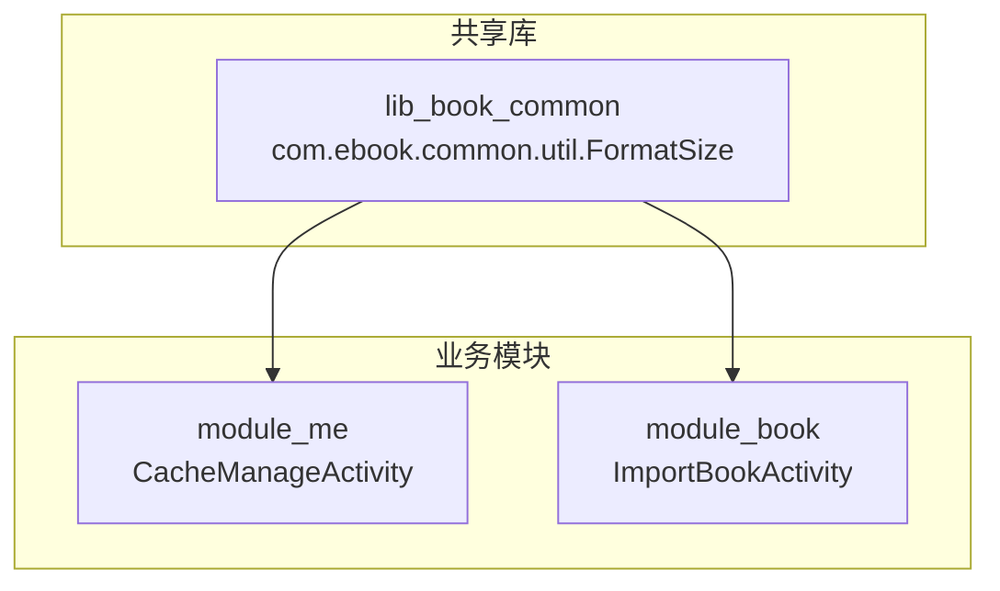
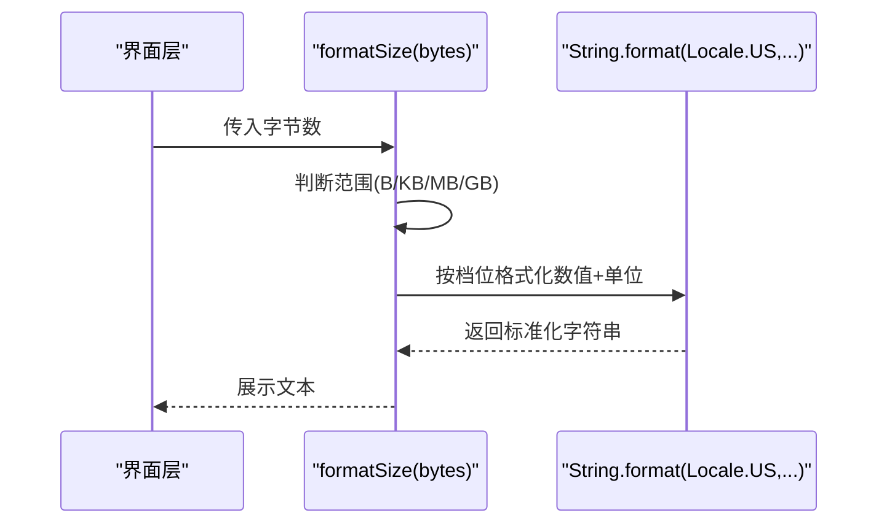
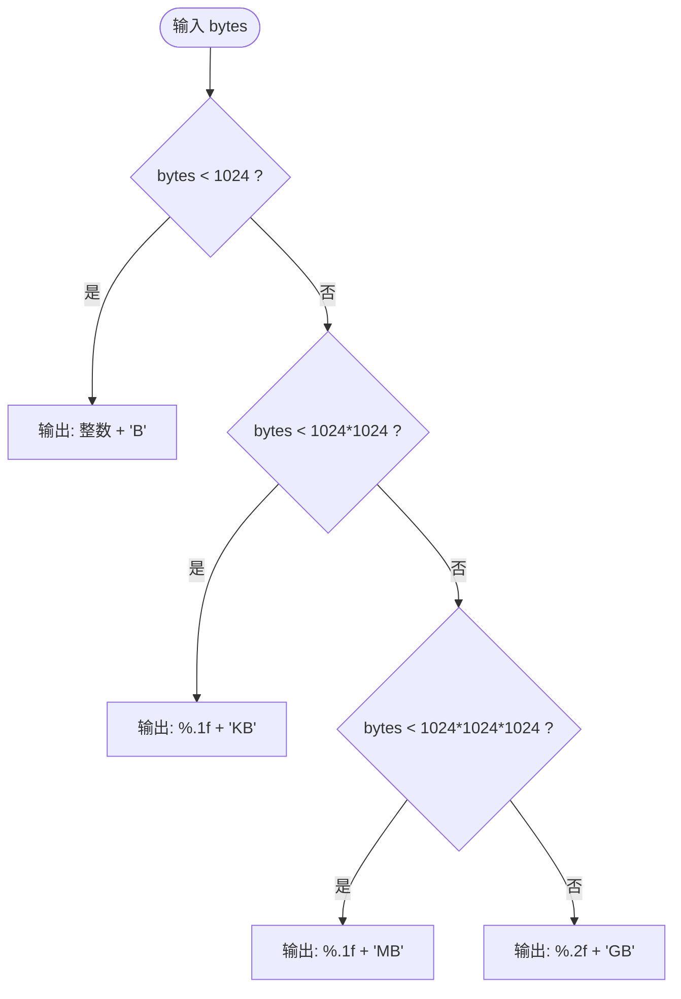
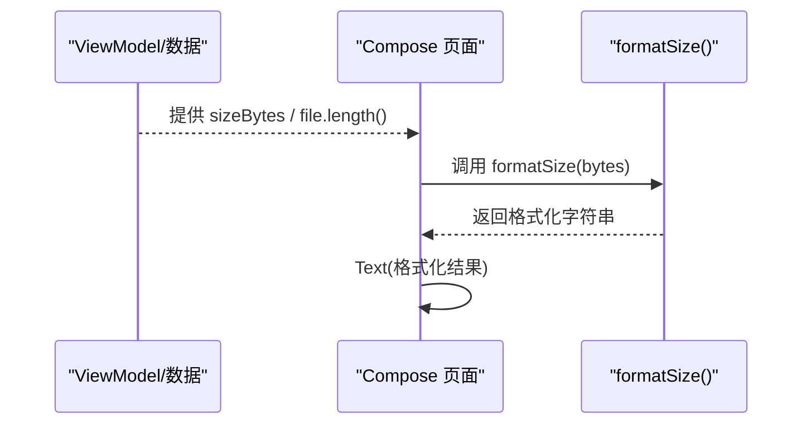
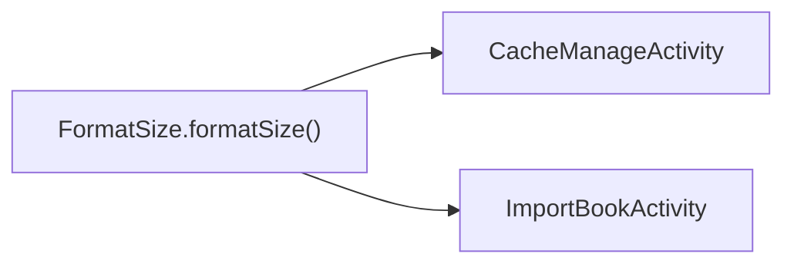

# 数据格式化工具

<cite>
**本文引用的文件**
- [FormatSize.kt](file://lib_book_common/src/main/java/com/ebook/common/util/FormatSize.kt)
- [FormatSizeTest.kt](file://lib_book_common/src/test/java/com/ebook/common/util/FormatSizeTest.kt)
- [CacheManageActivity.kt](file://module_me/src/main/java/com/ebook/me/view/CacheManageActivity.kt)
- [ImportBookActivity.kt](file://module_book/src/main/java/com/ebook/book/ImportBookActivity.kt)
</cite>

## 目录
1. [引言](#引言)
2. [项目结构](#项目结构)
3. [核心组件](#核心组件)
4. [架构总览](#架构总览)
5. [详细组件分析](#详细组件分析)
6. [依赖分析](#依赖分析)
7. [性能考虑](#性能考虑)
8. [故障排查指南](#故障排查指南)
9. [结论](#结论)
10. [附录](#附录)

## 引言
本文件聚焦于“字节数格式化”这一通用能力，系统化梳理 FormatSize.formatSize() 的设计与实现：单位换算逻辑、精度控制策略、国际化处理、边界值与极端值策略、单元测试覆盖、UI 集成方式、性能优化与可扩展性设计，以及固定 Locale 的取舍与跨平台兼容性保证。

## 项目结构
- 工具类位于共享库 lib_book_common 的 util 包中，供多个业务模块复用（如缓存管理页、导入页）。
- 测试位于同模块的 test 源集，采用纯函数断言，确保不同运行环境下的输出稳定。
- UI 层通过 Compose Text 直接展示格式化后的字符串，避免在页面层重复实现换算逻辑。

图表来源
- [FormatSize.kt:1-20](file://lib_book_common/src/main/java/com/ebook/common/util/FormatSize.kt#L1-L20)
- [CacheManageActivity.kt:55-62](file://module_me/src/main/java/com/ebook/me/view/CacheManageActivity.kt#L55-L62)
- [ImportBookActivity.kt:55-62](file://module_book/src/main/java/com/ebook/book/ImportBookActivity.kt#L55-L62)

章节来源
- [FormatSize.kt:1-20](file://lib_book_common/src/main/java/com/ebook/common/util/FormatSize.kt#L1-L20)
- [CacheManageActivity.kt:55-62](file://module_me/src/main/java/com/ebook/me/view/CacheManageActivity.kt#L55-L62)
- [ImportBookActivity.kt:55-62](file://module_book/src/main/java/com/ebook/book/ImportBookActivity.kt#L55-L62)

## 核心组件
- 单一职责：提供将字节数转换为人类可读字符串的能力（B、KB、MB、GB）。
- 输入类型：Long（字节），无副作用，纯函数。
- 输出类型：String，固定小数位数和单位符号，便于统一展示。

关键行为要点
- 单位换算基于 1024 进制（二进制前缀语义），按阈值分档：B < 1KB < 1MB < 1GB。
- 小数位控制：KB/MB 保留一位小数；GB 保留两位小数；B 不出现小数。
- 国际化：数字部分使用 Locale.US 格式化，确保小数点为“.”，不受设备区域设置影响。
- 单位符号：B/KB/MB/GB 作为 SI 约定符号，不参与本地化，保持跨语言一致。

章节来源
- [FormatSize.kt:1-20](file://lib_book_common/src/main/java/com/ebook/common/util/FormatSize.kt#L1-L20)

## 架构总览
formatSize() 是独立工具方法，被多个页面以“按需调用”的方式消费，属于典型的“域无关工具”。其调用链简洁，无状态、无外部依赖，易于单测与回归。

图表来源
- [FormatSize.kt:15-20](file://lib_book_common/src/main/java/com/ebook/common/util/FormatSize.kt#L15-L20)

章节来源
- [FormatSize.kt:15-20](file://lib_book_common/src/main/java/com/ebook/common/util/FormatSize.kt#L15-L20)

## 详细组件分析

### 单位换算与精度控制
- 换算基准：1 KB = 1024 B，1 MB = 1024^2 B，1 GB = 1024^3 B。
- 档位划分与精度：
  - < 1024 B：原样显示整数 + “B”，不引入浮点误差。
  - 1024 B ~ 1024^2 - 1：除以 1024.0 后保留一位小数（%.1f），单位“KB”。
  - 1024^2 B ~ 1024^3 - 1：除以 1024.0^2 后保留一位小数（%.1f），单位“MB”。
  - ≥ 1024^3 B：除以 1024.0^3 后保留两位小数（%.2f），单位“GB”。
- 数字格式：始终使用 Locale.US，保证小数点为“.”，避免地区差异导致显示异常或解析歧义。

图表来源
- [FormatSize.kt:15-20](file://lib_book_common/src/main/java/com/ebook/common/util/FormatSize.kt#L15-L20)

章节来源
- [FormatSize.kt:15-20](file://lib_book_common/src/main/java/com/ebook/common/util/FormatSize.kt#L15-L20)

### 浮点数运算的精度与边界值
- 浮点运算路径：仅在 KB/MB/GB 档位进行除法并格式化，B 档位直接拼接整数，避免不必要的浮点开销与舍入。
- 边界值：
  - 0 字节：输出“0 B”，符合直觉且不会进入浮点分支。
  - 负值：当前实现未做显式校验，会落入 B 档位并原样输出负数形式（例如“-1 B”）。若业务需要，可在上层保证非负或在此处增加前置校验并抛出参数异常。
  - 极大值：GB 档位保留两位小数，足以覆盖常见文件大小；超过 Long.MAX_VALUE 的情况在 Android 场景下通常由系统 API 限制，实际风险较低。
- 舍入策略：使用 String.format 的 %.1f / %.2f，遵循标准四舍五入规则。

章节来源
- [FormatSize.kt:15-20](file://lib_book_common/src/main/java/com/ebook/common/util/FormatSize.kt#L15-L20)
- [FormatSizeTest.kt:11-35](file://lib_book_common/src/test/java/com/ebook/common/util/FormatSizeTest.kt#L11-L35)

### 国际化与本地化适配
- 数字部分固定 Locale.US：保证小数点样式统一，便于跨设备一致性与测试稳定性。
- 单位符号不参与本地化：B/KB/MB/GB 作为通用符号，避免翻译不一致带来的歧义。
- 如需未来支持多语言单位（如中文“千字节”等），可抽象单位映射表并结合用户设置切换，但需评估是否破坏现有预期与测试用例。

章节来源
- [FormatSize.kt:1-20](file://lib_book_common/src/main/java/com/ebook/common/util/FormatSize.kt#L1-L20)

### 单元测试与验证
- 覆盖范围：
  - B 档位：0、1、1023 等典型值。
  - KB 档位：1024、1536、接近上限的值。
  - MB 档位：1MB、带小数的 MB 值。
  - GB 档位：1GB、带两位小数的 GB 值。
- 测试目标：验证阈值边界、小数位控制、Locale.US 的数字格式一致性。
- 建议补充：
  - 负值与零值的明确断言（当前已覆盖 0）。
  - 超大值（接近 Long 上限）的鲁棒性检查。
  - 可选：对极小非整除场景的舍入行为进行更细粒度断言。

章节来源
- [FormatSizeTest.kt:11-35](file://lib_book_common/src/test/java/com/ebook/common/util/FormatSizeTest.kt#L11-L35)

### UI 集成方式
- 缓存管理页：从缓存统计中取字节数，调用 formatSize() 后直接作为 Text 内容展示。
- 导入页：从文件长度获取字节数，调用 formatSize() 后展示文件大小。
- 优势：集中管理换算与格式化逻辑，避免各页面各自实现导致口径不一致。

图表来源
- [CacheManageActivity.kt:358-364](file://module_me/src/main/java/com/ebook/me/view/CacheManageActivity.kt#L358-L364)
- [ImportBookActivity.kt:612-618](file://module_book/src/main/java/com/ebook/book/ImportBookActivity.kt#L612-L618)

章节来源
- [CacheManageActivity.kt:358-364](file://module_me/src/main/java/com/ebook/me/view/CacheManageActivity.kt#L358-L364)
- [ImportBookActivity.kt:612-618](file://module_book/src/main/java/com/ebook/book/ImportBookActivity.kt#L612-L618)

### 性能与可扩展性
- 性能：
  - 计算复杂度 O(1)，仅一次比较与至多一次除法与格式化。
  - 避免在热路径中进行不必要对象创建；String.format 在常规频率下开销可接受。
  - 若面临高频批量格式化，可考虑缓存热点档位的结果或使用更快的格式化库，但需权衡可维护性。
- 可扩展性：
  - 新增单位（如 TB）只需扩展 when 分支与阈值判断。
  - 调整精度：抽取精度常量或配置项，便于统一修改。
  - 国际化扩展：抽离单位符号映射与数字格式化 Locale 选择，便于后续多语言与可配置化。

[本节为通用指导，无需特定代码来源]

## 依赖分析
- 内部依赖：无外部库依赖，仅使用 Java 标准库的 Locale 与 String.format。
- 调用方依赖：
  - module_me 的缓存管理页面。
  - module_book 的文件导入页面。
- 耦合度：低耦合、高内聚的工具函数，适合在多处复用。

图表来源
- [FormatSize.kt:15-20](file://lib_book_common/src/main/java/com/ebook/common/util/FormatSize.kt#L15-L20)
- [CacheManageActivity.kt:55-62](file://module_me/src/main/java/com/ebook/me/view/CacheManageActivity.kt#L55-L62)
- [ImportBookActivity.kt:55-62](file://module_book/src/main/java/com/ebook/book/ImportBookActivity.kt#L55-L62)

章节来源
- [FormatSize.kt:15-20](file://lib_book_common/src/main/java/com/ebook/common/util/FormatSize.kt#L15-L20)
- [CacheManageActivity.kt:55-62](file://module_me/src/main/java/com/ebook/me/view/CacheManageActivity.kt#L55-L62)
- [ImportBookActivity.kt:55-62](file://module_book/src/main/java/com/ebook/book/ImportBookActivity.kt#L55-L62)

## 性能考虑
- 时间复杂度：O(1)。
- 空间复杂度：O(1)。
- 格式化开销：仅在必要时执行 String.format；对于 B 档位直接拼接整数，避免浮点与格式化开销。
- 批量场景：如需对大量字节数进行格式化，可考虑线程安全缓存（注意内存占用）或流式处理以减少峰值内存。

[本节为通用指导，无需特定代码来源]

## 故障排查指南
- 现象：显示的小数点不符合预期（如出现逗号）。
  - 原因：未在格式化时指定 Locale.US。
  - 解决：确认调用的是 formatSize()，其内部已固定 Locale.US。
- 现象：0 字节显示异常。
  - 说明：当前实现应输出“0 B”，若不符，检查调用方传入值是否为 null 或被错误转换。
- 现象：负值显示异常。
  - 说明：当前实现未做显式校验，可能直接显示负数形式。建议在调用方保证非负或在工具层增加参数校验。
- 现象：大文件显示不够精确。
  - 说明：GB 档位保留两位小数，若需更高精度，可考虑扩展档位或调整精度策略。

章节来源
- [FormatSize.kt:15-20](file://lib_book_common/src/main/java/com/ebook/common/util/FormatSize.kt#L15-L20)
- [FormatSizeTest.kt:11-35](file://lib_book_common/src/test/java/com/ebook/common/util/FormatSizeTest.kt#L11-L35)

## 结论
FormatSize.formatSize() 以简单、稳定、可测试的方式实现了字节数到人类可读字符串的转换。其单位换算、精度控制与固定 Locale 的策略确保了跨环境一致性与可维护性。结合清晰的单元测试与在 UI 层的集中使用，该工具有效避免了重复实现与口径分歧，具备良好的扩展性与性能表现。

[本节为总结性内容，无需特定代码来源]

## 附录
- 参考实现位置：
  - 工具类：[FormatSize.kt:1-20](file://lib_book_common/src/main/java/com/ebook/common/util/FormatSize.kt#L1-L20)
  - 单元测试：[FormatSizeTest.kt:11-35](file://lib_book_common/src/test/java/com/ebook/common/util/FormatSizeTest.kt#L11-L35)
  - UI 集成示例：
    - [CacheManageActivity.kt:358-364](file://module_me/src/main/java/com/ebook/me/view/CacheManageActivity.kt#L358-L364)
    - [ImportBookActivity.kt:612-618](file://module_book/src/main/java/com/ebook/book/ImportBookActivity.kt#L612-L618)

[本节为索引信息，无需特定代码来源]