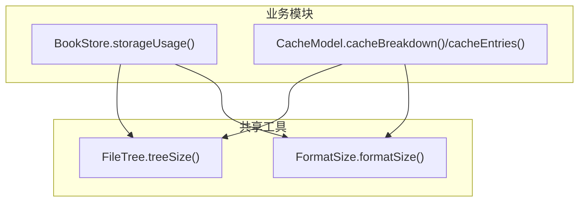
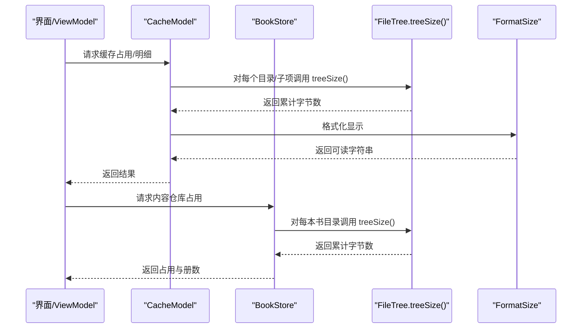
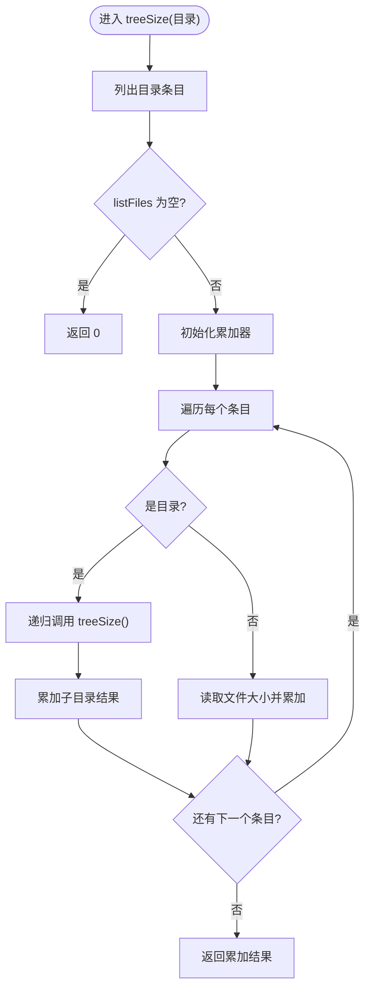
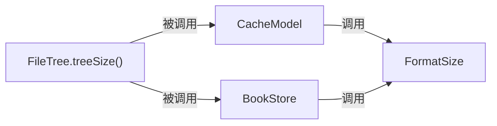

# 文件系统操作工具

<cite>
**本文引用的文件**
- [FileTree.kt](file://lib_book_common/src/main/java/com/ebook/common/util/FileTree.kt)
- [TreeSizeTest.kt](file://lib_book_common/src/test/java/com/ebook/common/util/TreeSizeTest.kt)
- [CacheModel.kt](file://module_me/src/main/java/com/ebook/me/repository/CacheModel.kt)
- [BookStore.kt](file://lib_book_common/src/main/java/com/ebook/common/store/BookStore.kt)
- [FormatSize.kt](file://lib_book_common/src/main/java/com/ebook/common/util/FormatSize.kt)
</cite>

## 目录
1. [简介](#简介)
2. [项目结构](#项目结构)
3. [核心组件](#核心组件)
4. [架构总览](#架构总览)
5. [详细组件分析](#详细组件分析)
6. [依赖关系分析](#依赖关系分析)
7. [性能考量](#性能考量)
8. [故障排查指南](#故障排查指南)
9. [结论](#结论)
10. [附录](#附录)

## 简介
本文件聚焦于仓库中的文件系统操作工具，围绕目录树占用空间计算的核心方法 treeSize() 展开。该实现位于 lib_book_common 模块的 util 包中，被“内容仓库”和“缓存管理”两个业务场景复用，统一口径避免重复实现与口径漂移。文档将解释其递归遍历算法、字节统计逻辑、异常处理策略；讨论大目录遍历的性能与内存特性；说明与普通文件的区分、空目录与不存在目录的处理方式；给出 UI 层正确调用方式（避免阻塞主线程）以及可移植性与单元测试策略；并对比递归与迭代实现的取舍及优化方向。

## 项目结构
- FileTree.treeSize() 作为域无关工具函数，位于共享库 lib_book_common：com.ebook.common.util.FileTree
- 上层使用方：
  - 内容仓库 BookStore：用于统计 filesDir/books 下书籍内容与暂存文件的占用
  - 缓存管理 CacheModel：用于统计 cacheDir 下图片、临时与其他缓存占用
- 辅助工具 FormatSize：将字节数格式化为人类可读大小
- 测试 TreeSizeTest：覆盖嵌套求和、普通文件参与、空目录/不存在目录归零等关键行为

图表来源
- [FileTree.kt:15-16](file://lib_book_common/src/main/java/com/ebook/common/util/FileTree.kt#L15-L16)
- [BookStore.kt:127-139](file://lib_book_common/src/main/java/com/ebook/common/store/BookStore.kt#L127-L139)
- [CacheModel.kt:61-92](file://module_me/src/main/java/com/ebook/me/repository/CacheModel.kt#L61-L92)
- [FormatSize.kt:15-20](file://lib_book_common/src/main/java/com/ebook/common/util/FormatSize.kt#L15-L20)

章节来源
- [FileTree.kt:1-16](file://lib_book_common/src/main/java/com/ebook/common/util/FileTree.kt#L1-L16)
- [BookStore.kt:116-139](file://lib_book_common/src/main/java/com/ebook/common/store/BookStore.kt#L116-L139)
- [CacheModel.kt:57-92](file://module_me/src/main/java/com/ebook/me/repository/CacheModel.kt#L57-L92)
- [FormatSize.kt:5-20](file://lib_book_common/src/main/java/com/ebook/common/util/FormatSize.kt#L5-L20)

## 核心组件
- FileTree.treeSize(): 以递归方式计算某目录下所有普通文件的字节总数，目录本身不计入；列举失败或目录不存在时返回 0
- BookStore.storageUsage(): 一次遍历 booksRoot，累加各子目录占用（含 .tmp 暂存）并统计书目目录数量
- CacheModel.cacheBreakdown()/cacheEntries(): 按 IMAGE/TEMP/OTHER 分类统计 cacheDir 占用，并在明细展示中使用 treeSize()
- FormatSize.formatSize(): 将字节数转换为 B/KB/MB/GB 的可读字符串

章节来源
- [FileTree.kt:5-16](file://lib_book_common/src/main/java/com/ebook/common/util/FileTree.kt#L5-L16)
- [BookStore.kt:116-139](file://lib_book_common/src/main/java/com/ebook/common/store/BookStore.kt#L116-L139)
- [CacheModel.kt:61-92](file://module_me/src/main/java/com/ebook/me/repository/CacheModel.kt#L61-L92)
- [FormatSize.kt:5-20](file://lib_book_common/src/main/java/com/ebook/common/util/FormatSize.kt#L5-L20)

## 架构总览
treeSize() 作为唯一计算点，被 BookStore 与 CacheModel 共同复用，确保“内容仓库占用”和“缓存占用”口径一致。UI 层通过 ViewModel 调用 Model/Repository，Model 在 IO 调度器上执行耗时 IO，再回主线程更新 UI。

图表来源
- [CacheModel.kt:61-92](file://module_me/src/main/java/com/ebook/me/repository/CacheModel.kt#L61-L92)
- [BookStore.kt:127-139](file://lib_book_common/src/main/java/com/ebook/common/store/BookStore.kt#L127-L139)
- [FileTree.kt:15-16](file://lib_book_common/src/main/java/com/ebook/common/util/FileTree.kt#L15-L16)
- [FormatSize.kt:15-20](file://lib_book_common/src/main/java/com/ebook/common/util/FormatSize.kt#L15-L20)

## 详细组件分析

### FileTree.treeSize() 递归遍历与字节统计
- 算法要点
  - 递归遍历当前目录的所有条目
  - 若为目录，则递归调用自身继续深入
  - 若为普通文件，则累加其长度
  - 目录本身不计入占用（inode 元数据不视为用户可见内容）
- 异常与边界
  - listFiles() 返回 null（如权限不足或路径不存在）时整体返回 0
  - 空目录返回 0
  - 不存在目录返回 0
- 复杂度
  - 时间复杂度 O(N)，N 为目录下普通文件总数（含递归子目录）
  - 空间复杂度 O(D)，D 为最大递归深度（即目录树的最大深度），由系统栈承载
- 代码片段路径
  - [FileTree.kt:15-16](file://lib_book_common/src/main/java/com/ebook/common/util/FileTree.kt#L15-L16)

图表来源
- [FileTree.kt:15-16](file://lib_book_common/src/main/java/com/ebook/common/util/FileTree.kt#L15-L16)

章节来源
- [FileTree.kt:5-16](file://lib_book_common/src/main/java/com/ebook/common/util/FileTree.kt#L5-L16)

### 与普通文件的区分逻辑
- 通过 isDirectory 判断条目类型
- 仅对普通文件调用 length() 计入占用
- 目录仅作为递归入口，不参与字节累加
- 代码片段路径
  - [FileTree.kt:15-16](file://lib_book_common/src/main/java/com/ebook/common/util/FileTree.kt#L15-L16)

章节来源
- [FileTree.kt:15-16](file://lib_book_common/src/main/java/com/ebook/common/util/FileTree.kt#L15-L16)

### 空目录与不存在目录的处理
- 空目录：无条目，直接返回 0
- 不存在目录：listFiles() 返回 null，短路返回 0
- 这对 UI 友好：无需为“尚无内容”做额外特判
- 代码片段路径
  - [FileTree.kt:15-16](file://lib_book_common/src/main/java/com/ebook/common/util/FileTree.kt#L15-L16)
- 测试覆盖
  - [TreeSizeTest.kt:41-44](file://lib_book_common/src/test/java/com/ebook/common/util/TreeSizeTest.kt#L41-L44)

章节来源
- [FileTree.kt:15-16](file://lib_book_common/src/main/java/com/ebook/common/util/FileTree.kt#L15-L16)
- [TreeSizeTest.kt:22-44](file://lib_book_common/src/test/java/com/ebook/common/util/TreeSizeTest.kt#L22-L44)

### 列举失败的降级策略
- listFiles() 可能因权限不足、路径不存在或 I/O 错误返回 null
- 当前实现将其降级为 0，保证调用方稳定获得数值型结果
- 注意：该策略对“部分子目录不可访问”的场景会静默忽略，不会抛出异常
- 代码片段路径
  - [FileTree.kt:15-16](file://lib_book_common/src/main/java/com/ebook/common/util/FileTree.kt#L15-L16)

章节来源
- [FileTree.kt:15-16](file://lib_book_common/src/main/java/com/ebook/common/util/FileTree.kt#L15-L16)

### 在 UI 层的正确使用（避免阻塞主线程）
- 原则：所有磁盘 IO 必须在后台线程执行（如 Dispatchers.IO），避免阻塞 UI
- 示例路径
  - CacheModel 在 suspend 函数内使用 withContext(Dispatchers.IO) 包裹 treeSize() 调用
  - 代码片段路径
    - [CacheModel.kt:61-64](file://module_me/src/main/java/com/ebook/me/repository/CacheModel.kt#L61-L64)
    - [CacheModel.kt:79-92](file://module_me/src/main/java/com/ebook/me/repository/CacheModel.kt#L79-L92)
    - [CacheModel.kt:118-133](file://module_me/src/main/java/com/ebook/me/repository/CacheModel.kt#L118-L133)
- 展示层建议使用 FormatSize 进行单位转换后再渲染
  - 代码片段路径
    - [FormatSize.kt:15-20](file://lib_book_common/src/main/java/com/ebook/common/util/FormatSize.kt#L15-L20)

章节来源
- [CacheModel.kt:61-92](file://module_me/src/main/java/com/ebook/me/repository/CacheModel.kt#L61-L92)
- [CacheModel.kt:118-133](file://module_me/src/main/java/com/ebook/me/repository/CacheModel.kt#L118-L133)
- [FormatSize.kt:15-20](file://lib_book_common/src/main/java/com/ebook/common/util/FormatSize.kt#L15-L20)

### 与 Android 文件系统的解耦设计与可移植性
- FileTree 仅依赖 java.io.File，不耦合 Android Context 或 API 版本差异
- 这使得同一套逻辑可在 JVM 单测中用临时目录验证
- 上层通过传入 File 根目录完成注入（如 CacheModel 接收 cacheRoot、BookStore 接收 booksRoot）
- 代码片段路径
  - [CacheModel.kt:57-64](file://module_me/src/main/java/com/ebook/me/repository/CacheModel.kt#L57-L64)
  - [BookStore.kt:19-22](file://lib_book_common/src/main/java/com/ebook/common/store/BookStore.kt#L19-L22)
  - [FileTree.kt:1-16](file://lib_book_common/src/main/java/com/ebook/common/util/FileTree.kt#L1-L16)

章节来源
- [CacheModel.kt:57-64](file://module_me/src/main/java/com/ebook/me/repository/CacheModel.kt#L57-L64)
- [BookStore.kt:19-22](file://lib_book_common/src/main/java/com/ebook/common/store/BookStore.kt#L19-L22)
- [FileTree.kt:1-16](file://lib_book_common/src/main/java/com/ebook/common/util/FileTree.kt#L1-L16)

### 单元测试策略
- 覆盖用例
  - 递归累加嵌套目录中的全部文件字节
  - 目录本身不计入，仅普通文件参与求和
  - 空目录与不存在目录归零
- 参考路径
  - [TreeSizeTest.kt:22-44](file://lib_book_common/src/test/java/com/ebook/common/util/TreeSizeTest.kt#L22-L44)
- 建议补充（可选）
  - 权限异常导致 listFiles 返回 null 的分支验证
  - 大目录下的栈深度与耗时基线（基准测试）

章节来源
- [TreeSizeTest.kt:22-44](file://lib_book_common/src/test/java/com/ebook/common/util/TreeSizeTest.kt#L22-L44)

### 为何选择递归实现而非迭代
- 优点
  - 简洁直观，易于维护与验证
  - 天然匹配目录树的层级结构
  - 在当前规模下性能足够，且已被现有用例锁定
- 代价
  - 深度过大可能导致栈溢出（极端深目录）
  - 无法直接并发化子目录遍历（除非显式改为并行流/协程）
- 迭代替代思路（概念性）
  - 使用显式栈模拟递归，控制最大深度并支持中断
  - 结合协程/线程池对子目录并发遍历，减少 I/O 等待
  - 需要新增取消信号与超时保护，防止长时间扫描

[本节为概念性讨论，不直接分析具体文件]

### 性能对比分析与优化方向
- 当前实现
  - 顺序递归，I/O 密集；适合中小规模目录
  - 已满足多数场景需求，且实现极简
- 可能的优化
  - 并发遍历：对子目录采用协程并发读取，汇总结果
  - 深度限制：设置最大递归深度，超出后跳过或记录警告
  - 增量统计：对频繁刷新的场景引入本地缓存（例如按 mtime 校验）
  - 取消与超时：提供取消令牌与超时控制，避免 UI 卡顿
  - 预分片：对超大目录先采样估算，再按需细化

[本节为通用指导，不直接分析具体文件]

## 依赖关系分析
- 依赖方向
  - BookStore 依赖 FileTree 计算每本书目录占用
  - CacheModel 依赖 FileTree 计算缓存目录及其子项占用
  - 两者均依赖 FormatSize 进行展示层格式化
- 外部依赖
  - 仅依赖 java.io.File，无 Android 平台耦合
- 耦合度
  - FileTree 作为纯函数工具，低耦合、高内聚
  - 上层通过参数注入根目录，便于替换与测试

图表来源
- [FileTree.kt:15-16](file://lib_book_common/src/main/java/com/ebook/common/util/FileTree.kt#L15-L16)
- [BookStore.kt:127-139](file://lib_book_common/src/main/java/com/ebook/common/store/BookStore.kt#L127-L139)
- [CacheModel.kt:61-92](file://module_me/src/main/java/com/ebook/me/repository/CacheModel.kt#L61-L92)
- [FormatSize.kt:15-20](file://lib_book_common/src/main/java/com/ebook/common/util/FormatSize.kt#L15-L20)

章节来源
- [FileTree.kt:15-16](file://lib_book_common/src/main/java/com/ebook/common/util/FileTree.kt#L15-L16)
- [BookStore.kt:127-139](file://lib_book_common/src/main/java/com/ebook/common/store/BookStore.kt#L127-L139)
- [CacheModel.kt:61-92](file://module_me/src/main/java/com/ebook/me/repository/CacheModel.kt#L61-L92)
- [FormatSize.kt:15-20](file://lib_book_common/src/main/java/com/ebook/common/util/FormatSize.kt#L15-L20)

## 性能考量
- 时间复杂度：O(N)，N 为普通文件总数（含递归子目录）
- 空间复杂度：O(D)，D 为目录树最大深度（系统栈）
- 大目录边界情况
  - 极深目录可能引发栈溢出风险（递归）
  - 极多子目录可能造成枚举开销增大
- 并发与取消
  - 当前未内置取消机制，建议在调用侧增加超时/取消
  - 可考虑基于协程的并发遍历提升吞吐
- 缓存策略
  - 对于高频刷新场景，可按目录 mtime 做增量缓存

[本节为通用指导，不直接分析具体文件]

## 故障排查指南
- 常见问题
  - 权限不足导致 listFiles 返回 null：表现为占用统计为 0，需检查存储权限或运行环境
  - 路径不存在：同样返回 0，确认传入根目录是否正确
  - 大目录扫描耗时过长：考虑增加超时/取消，或在后台任务中执行
- 定位建议
  - 在调用处打印根目录与耗时
  - 使用单测构造临时目录复现问题
  - 结合日志确认是否命中权限异常分支
- 相关路径
  - [FileTree.kt:15-16](file://lib_book_common/src/main/java/com/ebook/common/util/FileTree.kt#L15-L16)
  - [CacheModel.kt:61-92](file://module_me/src/main/java/com/ebook/me/repository/CacheModel.kt#L61-L92)

章节来源
- [FileTree.kt:15-16](file://lib_book_common/src/main/java/com/ebook/common/util/FileTree.kt#L15-L16)
- [CacheModel.kt:61-92](file://module_me/src/main/java/com/ebook/me/repository/CacheModel.kt#L61-L92)

## 结论
FileTree.treeSize() 以极简的递归实现提供了统一的目录占用统计能力，被内容仓库与缓存管理复用，确保口径一致、易于维护。其设计解耦 Android 平台细节，便于跨环境测试与迁移。对于大目录与高并发场景，可进一步引入并发遍历、深度限制与取消机制以提升鲁棒性与性能。配合 FormatSize 与 UI 层的后台调度，可安全、高效地为用户提供容量信息。

## 附录
- 关键代码片段路径
  - 递归遍历与字节统计：[FileTree.kt:15-16](file://lib_book_common/src/main/java/com/ebook/common/util/FileTree.kt#L15-L16)
  - 内容仓库占用统计：[BookStore.kt:127-139](file://lib_book_common/src/main/java/com/ebook/common/store/BookStore.kt#L127-L139)
  - 缓存分类统计与展示：[CacheModel.kt:61-92](file://module_me/src/main/java/com/ebook/me/repository/CacheModel.kt#L61-L92), [CacheModel.kt:118-133](file://module_me/src/main/java/com/ebook/me/repository/CacheModel.kt#L118-L133)
  - 字节格式化：[FormatSize.kt:15-20](file://lib_book_common/src/main/java/com/ebook/common/util/FormatSize.kt#L15-L20)
  - 单元测试覆盖：[TreeSizeTest.kt:22-44](file://lib_book_common/src/test/java/com/ebook/common/util/TreeSizeTest.kt#L22-L44)