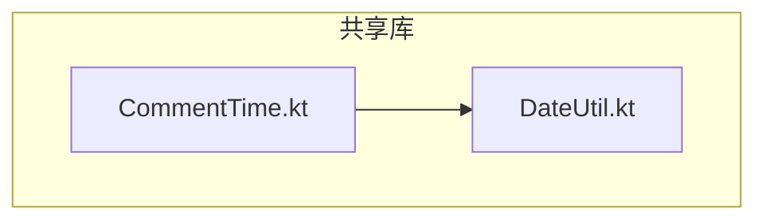
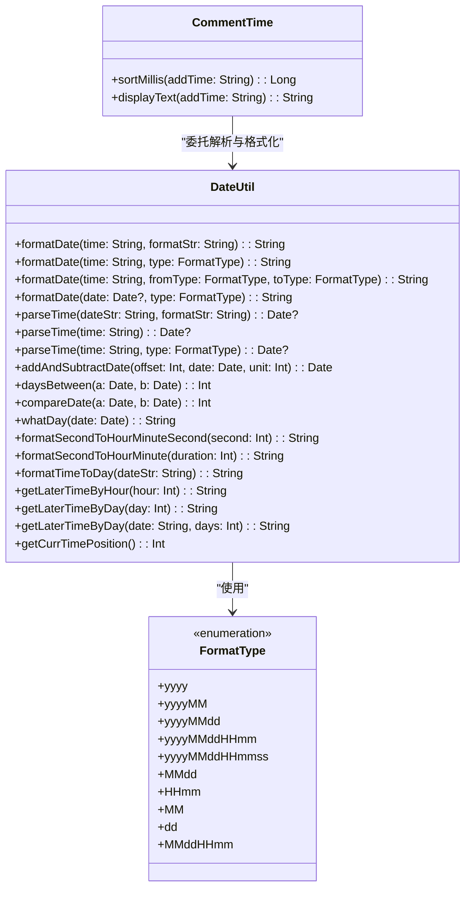
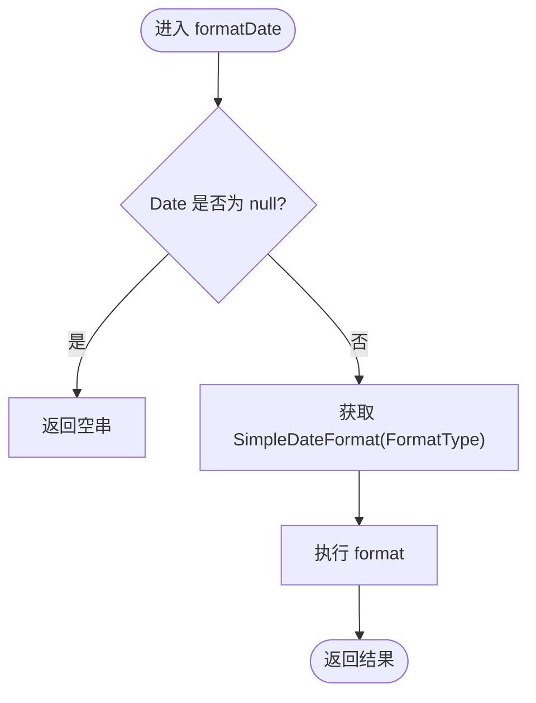
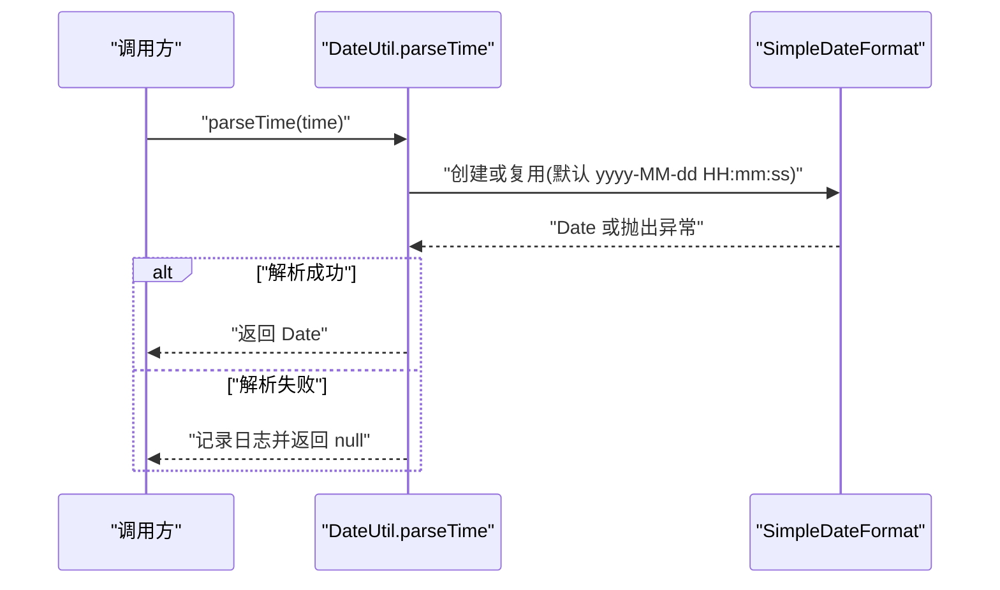
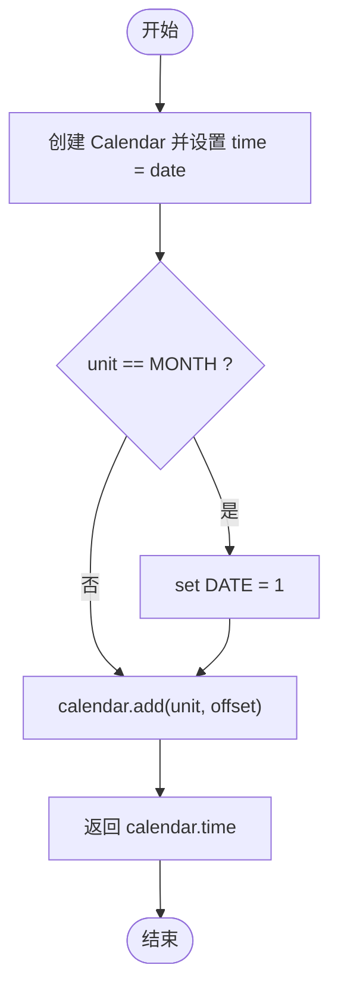
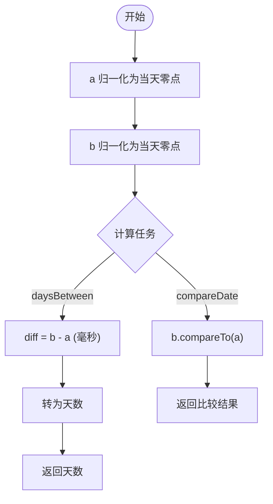
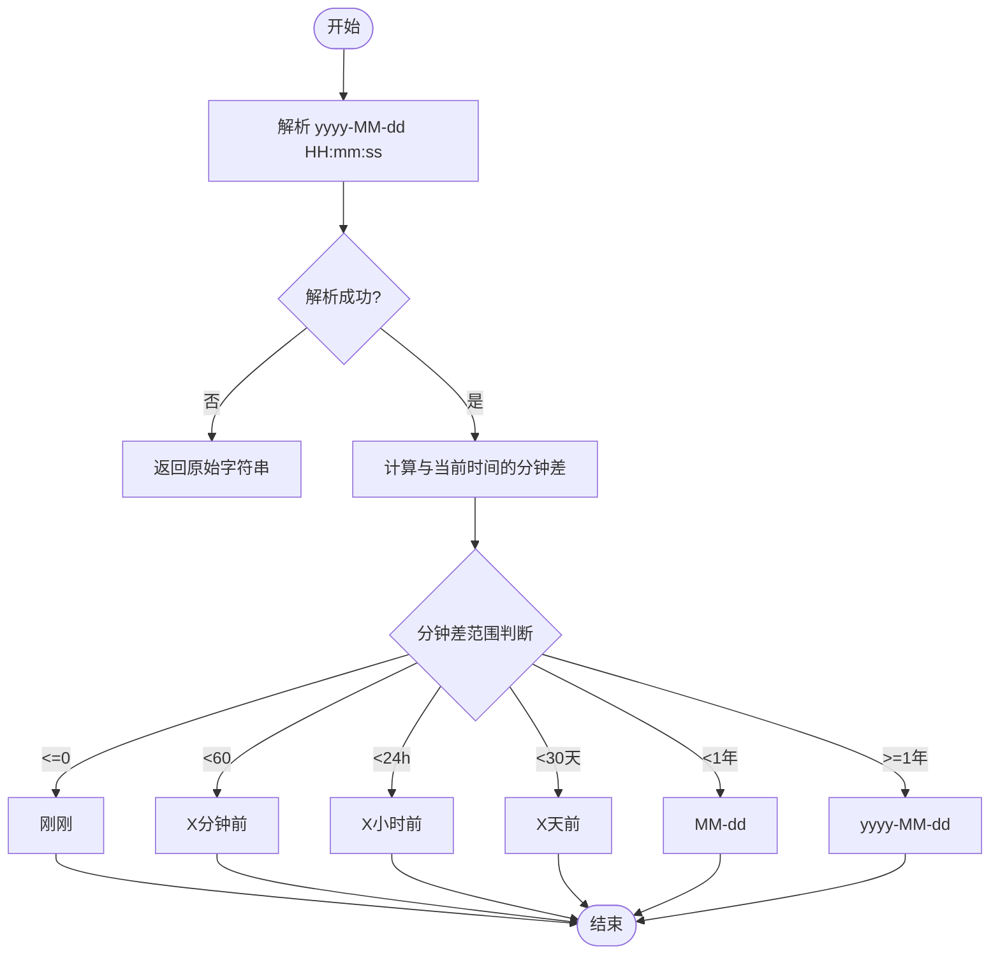
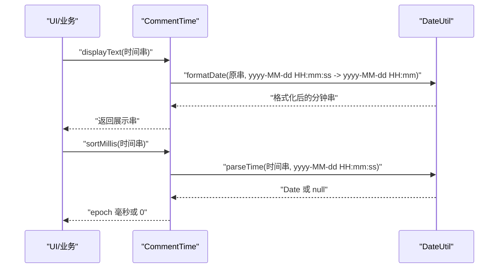
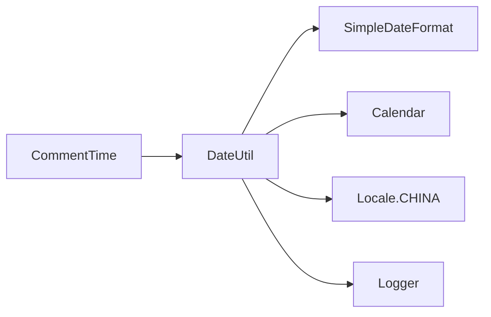

# 日期时间处理工具

<cite>
**本文引用的文件**   
- [DateUtil.kt](file://lib_book_common/src/main/java/com/ebook/common/util/DateUtil.kt)
- [CommentTime.kt](file://lib_book_common/src/main/java/com/ebook/common/domain/CommentTime.kt)
</cite>

## 目录
1. [简介](#简介)
2. [项目结构](#项目结构)
3. [核心组件](#核心组件)
4. [架构总览](#架构总览)
5. [详细组件分析](#详细组件分析)
6. [依赖关系分析](#依赖关系分析)
7. [性能考虑](#性能考虑)
8. [故障排查指南](#故障排查指南)
9. [结论](#结论)
10. [附录](#附录)

## 简介
本文件面向项目中的日期与时间处理工具类 DateUtil，系统化说明其格式化、解析、计算能力与设计取舍。重点覆盖：
- FormatType 枚举支持的格式类型（yyyy、yyyyMM、yyyyMMdd、yyyyMMddHHmm、yyyyMMddHHmmss、MMdd、HHmm、MM、dd、MMddHHmm）
- parseTime 多重载版本及其行为差异
- addAndSubtractDate 的时间加减运算策略
- daysBetween 与 compareDate 的日期比较逻辑
- 时区处理策略（Locale.CHINA）
- 异常安全保证（ParseException 捕获与日志记录）
- 性能优化考虑（SimpleDateFormat 复用）
- 与 Java Date API 的兼容性与向后兼容性
- 结合 CommentTime 的实际使用方式与边界情况处理建议

## 项目结构
DateUtil 位于共享模块 lib_book_common 的工具包下，作为跨模块复用的基础能力；CommentTime 作为领域层封装，统一对外暴露评论时间的排序键与展示串，内部委托给 DateUtil。

图示来源
- [DateUtil.kt:1-233](file://lib_book_common/src/main/java/com/ebook/common/util/DateUtil.kt#L1-L233)
- [CommentTime.kt:1-29](file://lib_book_common/src/main/java/com/ebook/common/domain/CommentTime.kt#L1-L29)

章节来源
- [DateUtil.kt:1-233](file://lib_book_common/src/main/java/com/ebook/common/util/DateUtil.kt#L1-L233)
- [CommentTime.kt:1-29](file://lib_book_common/src/main/java/com/ebook/common/domain/CommentTime.kt#L1-L29)

## 核心组件
- 格式化
  - formatDate(String, String)：按指定格式字符串输出
  - formatDate(String, FormatType)：将字符串先解析再按目标格式输出
  - formatDate(String, FormatType, FormatType)：在两个 FormatType 之间转换
  - formatDate(Date?, FormatType)：对 Date 对象直接格式化
- 解析
  - parseTime(String, String)：按自定义格式字符串解析
  - parseTime(String)：默认 yyyy-MM-dd HH:mm:ss
  - parseTime(String, FormatType)：按枚举指定的格式解析
- 计算与比较
  - addAndSubtractDate(offset, Date, unit)：基于 Calendar 进行时间单位偏移
  - daysBetween(a, b)：返回两日之间的天数差（按天对齐到零点）
  - compareDate(a, b)：比较两日先后（按天对齐到零点）
- 辅助
  - whatDay(Date)：中文星期
  - formatSecondToHourMinuteSecond / formatSecondToHourMinute：时长转可读文本
  - formatTimeToDay：相对时间“刚刚/分钟前/小时前/天前”等
  - getLaterTimeByHour/Day：未来时间生成
  - getCurrTimePosition：当前时间段位置（每半小时一个区间）

章节来源
- [DateUtil.kt:16-233](file://lib_book_common/src/main/java/com/ebook/common/util/DateUtil.kt#L16-L233)

## 架构总览
DateUtil 提供统一的日期时间处理能力，被 CommentTime 以最小依赖的方式消费，形成“领域封装 → 通用工具”的清晰分层。

图示来源
- [DateUtil.kt:12-233](file://lib_book_common/src/main/java/com/ebook/common/util/DateUtil.kt#L12-L233)
- [CommentTime.kt:1-29](file://lib_book_common/src/main/java/com/ebook/common/domain/CommentTime.kt#L1-L29)

## 详细组件分析

### 格式化流程（FormatType 与 SimpleDateFormat）
- 支持格式类型
  - yyyy、yyyyMM、yyyyMMdd、yyyyMMddHHmm、yyyyMMddHHmmss、MMdd、HHmm、MM、dd、MMddHHmm
- 关键实现要点
  - 通过 getSimpleDateFormat(type) 复用 SimpleDateFormat，并固定 Locale.CHINA 避免区域差异
  - formatDate(Date?, FormatType) 对 null 输入返回空串，保证调用方无需判空
- 设计收益
  - 统一时区与格式，减少分散的 SimpleDateFormat 实例化
  - 枚举驱动格式选择，降低字符串硬编码错误

图示来源
- [DateUtil.kt:39-58](file://lib_book_common/src/main/java/com/ebook/common/util/DateUtil.kt#L39-L58)

章节来源
- [DateUtil.kt:39-58](file://lib_book_common/src/main/java/com/ebook/common/util/DateUtil.kt#L39-L58)

### 解析流程（parseTime 多重载）
- 重载版本
  - parseTime(String, String)：按传入格式字符串解析
  - parseTime(String)：默认使用 yyyy-MM-dd HH:mm:ss
  - parseTime(String, FormatType)：按枚举格式解析
- 异常与日志
  - 捕获 ParseException 或 Exception，记录日志后返回 null，避免上层崩溃
- 使用示例路径
  - CommentTime.sortMillis 使用 parseTime(String, FormatType.yyyyMMddHHmmss) 取 epoch 毫秒用于排序
  - CommentTime.displayText 使用 formatDate(String, FormatType, FormatType) 做二次格式化

图示来源
- [DateUtil.kt:61-91](file://lib_book_common/src/main/java/com/ebook/common/util/DateUtil.kt#L61-L91)
- [CommentTime.kt:22-28](file://lib_book_common/src/main/java/com/ebook/common/domain/CommentTime.kt#L22-L28)

章节来源
- [DateUtil.kt:61-91](file://lib_book_common/src/main/java/com/ebook/common/util/DateUtil.kt#L61-L91)
- [CommentTime.kt:22-28](file://lib_book_common/src/main/java/com/ebook/common/domain/CommentTime.kt#L22-L28)

### 时间加减（addAndSubtractDate）
- 行为
  - 使用 Calendar 对给定 Date 进行单位偏移（如 MONTH、DAY 等）
  - 当单位为月份时，先将日期置为当月第一天，再进行加减，避免月末边界问题
- 复杂度
  - 时间 O(1)，空间 O(1)
- 适用场景
  - 需要按自然月语义进行加减的场景（例如“下个月同日”）

图示来源
- [DateUtil.kt:94-101](file://lib_book_common/src/main/java/com/ebook/common/util/DateUtil.kt#L94-L101)

章节来源
- [DateUtil.kt:94-101](file://lib_book_common/src/main/java/com/ebook/common/util/DateUtil.kt#L94-L101)

### 天数差与日期比较（daysBetween、compareDate）
- daysBetween(a, b)
  - 将 a、b 分别归一到当天零点（时分秒毫秒清零）
  - 计算毫秒差并转换为天数
- compareDate(a, b)
  - 同样归一到当天零点
  - 返回 b 与 a 的比较结果（正数表示 b 晚于 a，负数表示 b 早于 a，0 表示同一天）
- 注意
  - 比较与差值均基于“天”粒度，忽略具体时刻

图示来源
- [DateUtil.kt:104-140](file://lib_book_common/src/main/java/com/ebook/common/util/DateUtil.kt#L104-L140)

章节来源
- [DateUtil.kt:104-140](file://lib_book_common/src/main/java/com/ebook/common/util/DateUtil.kt#L104-L140)

### 相对时间显示（formatTimeToDay）
- 逻辑
  - 解析 yyyy-MM-dd HH:mm:ss
  - 根据当前时间与目标时间分钟差，呈现“刚刚/分钟前/小时前/天前/月内/年内”等
- 异常
  - 解析失败时返回原始字符串，确保 UI 不出现脏数据

图示来源
- [DateUtil.kt:177-196](file://lib_book_common/src/main/java/com/ebook/common/util/DateUtil.kt#L177-L196)

章节来源
- [DateUtil.kt:177-196](file://lib_book_common/src/main/java/com/ebook/common/util/DateUtil.kt#L177-L196)

### 与 CommentTime 的协作
- sortMillis：用 parseTime 将服务端时间串转为 epoch 毫秒，不可解析则归零，保证倒序稳定
- displayText：用 formatDate 将秒级时间串裁剪到分钟展示，不可解析返回空串

图示来源
- [CommentTime.kt:22-28](file://lib_book_common/src/main/java/com/ebook/common/domain/CommentTime.kt#L22-L28)
- [DateUtil.kt:27-36](file://lib_book_common/src/main/java/com/ebook/common/util/DateUtil.kt#L27-L36)
- [DateUtil.kt:82-91](file://lib_book_common/src/main/java/com/ebook/common/util/DateUtil.kt#L82-L91)

章节来源
- [CommentTime.kt:22-28](file://lib_book_common/src/main/java/com/ebook/common/domain/CommentTime.kt#L22-L28)
- [DateUtil.kt:27-36](file://lib_book_common/src/main/java/com/ebook/common/util/DateUtil.kt#L27-L36)
- [DateUtil.kt:82-91](file://lib_book_common/src/main/java/com/ebook/common/util/DateUtil.kt#L82-L91)

## 依赖关系分析
- 外部依赖
  - java.text.SimpleDateFormat：负责日期格式化与解析
  - java.util.Calendar：负责日期单位加减与对齐到零点
  - java.util.Locale：固定为中国时区，避免不同设备区域差异
  - com.xrn1997.common.util.Logger：统一日志输出
- 内部依赖
  - FormatType：集中管理常用格式，避免字符串散落
- 耦合度
  - DateUtil 仅依赖标准库与 Logger，低耦合高内聚
  - CommentTime 仅依赖 DateUtil，职责单一

图示来源
- [DateUtil.kt:1-11](file://lib_book_common/src/main/java/com/ebook/common/util/DateUtil.kt#L1-L11)
- [CommentTime.kt:1-4](file://lib_book_common/src/main/java/com/ebook/common/domain/CommentTime.kt#L1-L4)

章节来源
- [DateUtil.kt:1-11](file://lib_book_common/src/main/java/com/ebook/common/util/DateUtil.kt#L1-L11)
- [CommentTime.kt:1-4](file://lib_book_common/src/main/java/com/ebook/common/domain/CommentTime.kt#L1-L4)

## 性能考虑
- SimpleDateFormat 复用
  - 通过 getSimpleDateFormat(type) 为每种 FormatType 创建并复用实例，减少频繁构造开销
- 解析失败快速返回
  - 解析异常捕获后直接返回 null，避免异常堆栈污染主流程
- 时间对齐
  - daysBetween/compareDate 将时间对齐到当天零点，避免跨日界误差
- 建议
  - 高频格式化场景可考虑缓存 SimpleDateFormat 或使用线程安全的 DateTimeFormatter（若迁移至 Java 8+）
  - 批量解析时可预先准备格式器以减少锁竞争

[本节为通用性能建议，不直接分析具体文件]

## 故障排查指南
- 常见异常
  - 非法日期字符串：parseTime 捕获异常并记录日志，返回 null；调用方应判空处理
  - 时区不一致：统一使用 Locale.CHINA，避免因系统区域导致显示偏差
- 定位步骤
  - 检查传入时间串是否符合预期格式（如 yyyy-MM-dd HH:mm:ss）
  - 确认 FormatType 与实际数据匹配
  - 查看日志中 parseTime/formatTimeToDay 的错误信息
- 回归验证
  - 对边界用例（null、空串、非法字符）编写单元测试，断言返回空串或 null 的行为
  - 对跨月、闰年、年末等边界日期验证 addAndSubtractDate 的结果

章节来源
- [DateUtil.kt:61-91](file://lib_book_common/src/main/java/com/ebook/common/util/DateUtil.kt#L61-L91)
- [DateUtil.kt:177-196](file://lib_book_common/src/main/java/com/ebook/common/util/DateUtil.kt#L177-L196)

## 结论
DateUtil 提供了稳定的日期格式化、解析与计算能力，采用枚举化的格式管理与统一的时区策略，具备良好的可维护性与扩展性。配合 CommentTime 的领域封装，形成了清晰的“领域→工具”分层。建议在后续演进中：
- 继续完善边界用例的单测覆盖
- 在高并发场景评估是否引入线程安全的日期格式化方案
- 保持与 Java Date API 的兼容，确保既有调用方不受影响

[本节为总结性内容，不直接分析具体文件]

## 附录
- 使用示例（路径引用）
  - 解析并格式化：参见 [DateUtil.kt:27-36](file://lib_book_common/src/main/java/com/ebook/common/util/DateUtil.kt#L27-L36)
  - 默认解析：参见 [DateUtil.kt:72-80](file://lib_book_common/src/main/java/com/ebook/common/util/DateUtil.kt#L72-L80)
  - 指定格式解析：参见 [DateUtil.kt:82-91](file://lib_book_common/src/main/java/com/ebook/common/util/DateUtil.kt#L82-L91)
  - 时间加减：参见 [DateUtil.kt:94-101](file://lib_book_common/src/main/java/com/ebook/common/util/DateUtil.kt#L94-L101)
  - 天数差与比较：参见 [DateUtil.kt:104-140](file://lib_book_common/src/main/java/com/ebook/common/util/DateUtil.kt#L104-L140)
  - 相对时间显示：参见 [DateUtil.kt:177-196](file://lib_book_common/src/main/java/com/ebook/common/util/DateUtil.kt#L177-L196)
- 实际调用方参考
  - 评论时间解析与展示：参见 [CommentTime.kt:22-28](file://lib_book_common/src/main/java/com/ebook/common/domain/CommentTime.kt#L22-L28)