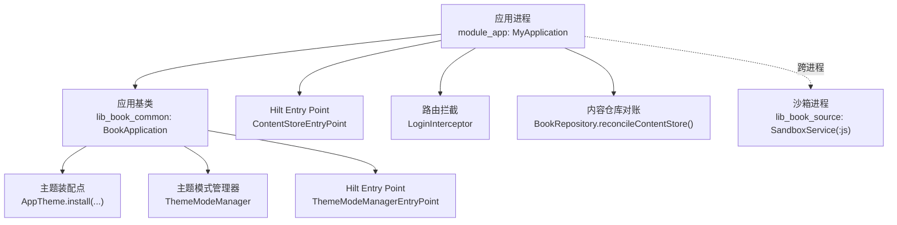
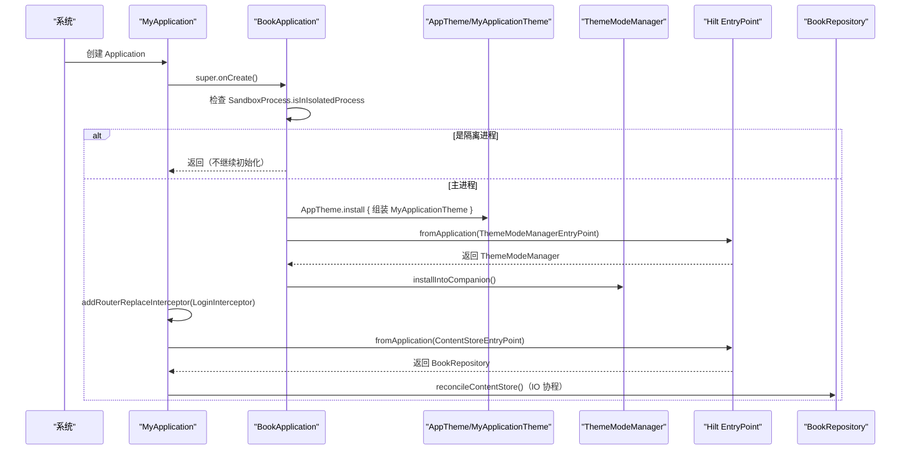
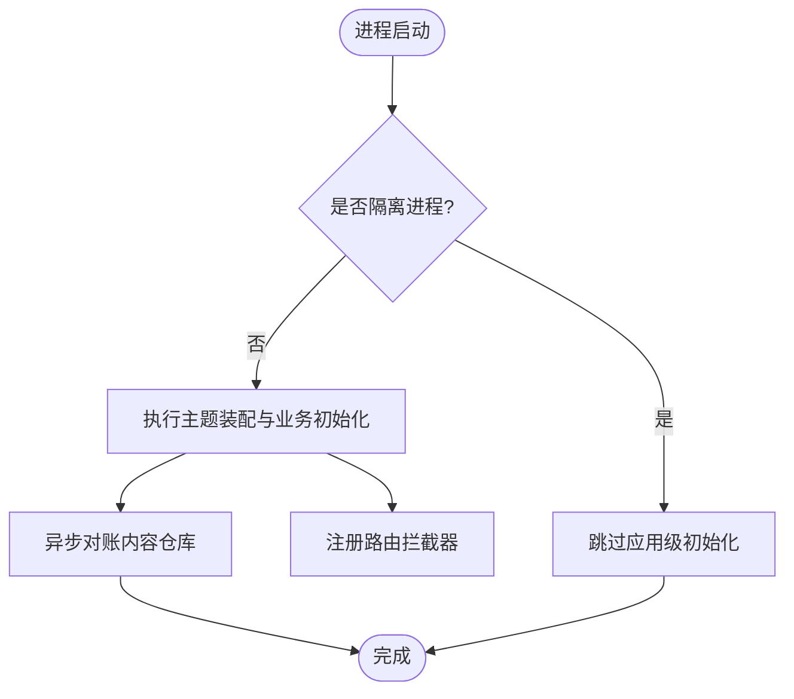
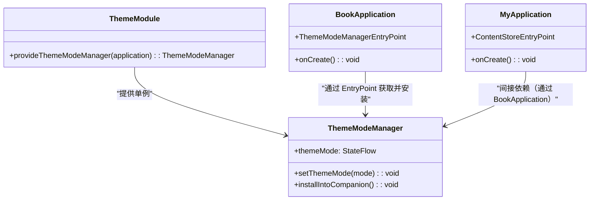
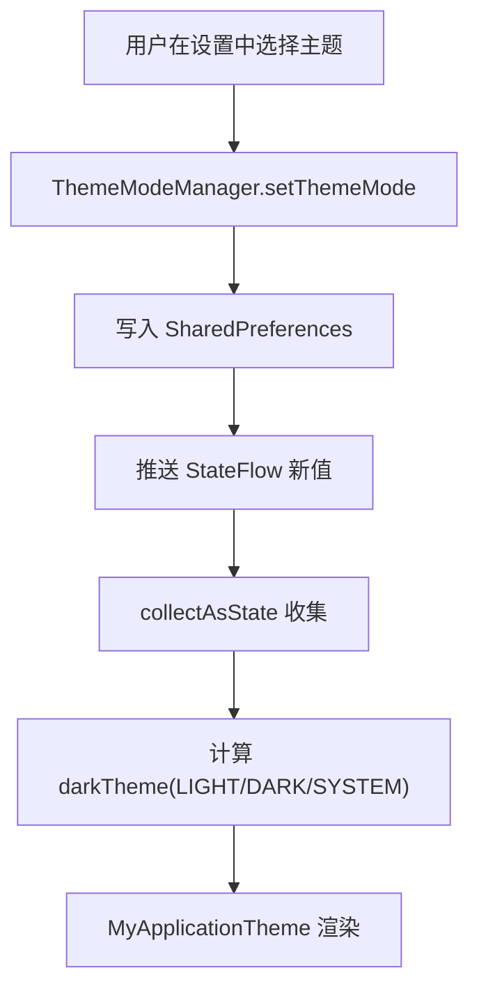
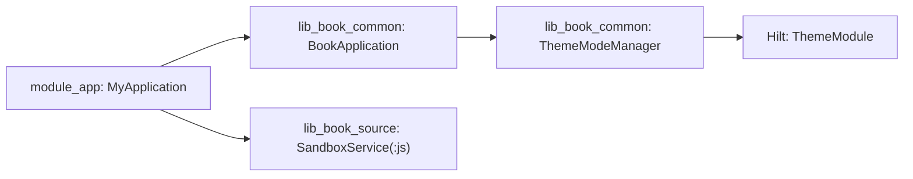

# 应用基类与初始化

<cite>
**本文引用的文件**
- [BookApplication.kt](file://lib_book_common/src/main/java/com/ebook/common/BookApplication.kt)
- [MyApplication.kt](file://module_app/src/main/java/com/ebook/MyApplication.kt)
- [SandboxProcess.kt](file://lib_book_source/src/main/java/com/ebook/source/sandbox/SandboxProcess.kt)
- [ThemeModeManager.kt](file://lib_book_common/src/main/java/com/ebook/common/domain/ThemeModeManager.kt)
- [ThemeModule.kt](file://lib_book_common/src/main/java/com/ebook/common/di/ThemeModule.kt)
- [AndroidManifest.xml（app）](file://module_app/src/main/AndroidManifest.xml)
- [AndroidManifest.xml（lib_book_source）](file://lib_book_source/src/main/AndroidManifest.xml)
</cite>

## 目录
1. [简介](#简介)
2. [项目结构](#项目结构)
3. [核心组件](#核心组件)
4. [架构总览](#架构总览)
5. [详细组件分析](#详细组件分析)
6. [依赖关系分析](#依赖关系分析)
7. [性能考虑](#性能考虑)
8. [故障排查指南](#故障排查指南)
9. [结论](#结论)
10. [附录](#附录)

## 简介
本文聚焦应用的启动基类与初始化流程，覆盖以下要点：
- BookApplication 的启动流程、进程门机制与主题装配
- Hilt 依赖注入配置与 EntryPointAccessors 的使用模式
- 沙箱进程的隔离处理与进程间通信边界
- Compose 主题动态切换机制与 ThemeModeManager 集成
- 扩展应用初始化、自定义主题模式、进程间通信的实践方式
- 应用生命周期管理、资源清理策略与异常处理机制

## 项目结构
- 应用入口与基类
  - 模块 module_app 提供 @HiltAndroidApp 的应用实现 MyApplication
  - 共享层 lib_book_common 提供 BookApplication 基类，统一主题装配与沙箱进程门
- 沙箱执行器
  - 模块 lib_book_source 提供 :js 隔离服务（Service），以独立进程运行
- 主题与注入
  - 主题模式由 ThemeModeManager 管理，并通过 Hilt 模块 ThemeModule 提供单例
  - 应用通过 Hilt EntryPoint 在 Application 中按需获取单例，避免字段注入导致沙箱进程崩溃

图表来源
- [MyApplication.kt:20-44](file://module_app/src/main/java/com/ebook/MyApplication.kt#L20-L44)
- [BookApplication.kt:17-59](file://lib_book_common/src/main/java/com/ebook/common/BookApplication.kt#L17-L59)
- [ThemeModeManager.kt:44-91](file://lib_book_common/src/main/java/com/ebook/common/domain/ThemeModeManager.kt#L44-L91)
- [AndroidManifest.xml（lib_book_source）:17-22](file://lib_book_source/src/main/AndroidManifest.xml#L17-L22)

章节来源
- [MyApplication.kt:20-44](file://module_app/src/main/java/com/ebook/MyApplication.kt#L20-L44)
- [BookApplication.kt:17-59](file://lib_book_common/src/main/java/com/ebook/common/BookApplication.kt#L17-L59)
- [AndroidManifest.xml（app）:31-43](file://module_app/src/main/AndroidManifest.xml#L31-L43)
- [AndroidManifest.xml（lib_book_source）:10-22](file://lib_book_source/src/main/AndroidManifest.xml#L10-L22)

## 核心组件
- BookApplication：定义应用级初始化入口、进程门与主题装配；使用 Hilt EntryPoint 获取 ThemeModeManager 并安装到伴生对象，供 Compose 重组时读取
- MyApplication：继承 BookApplication，注册路由拦截器，并在后台协程中对内容仓库进行一致性校验（删除/导入中断后的无主目录回收）
- SandboxProcess：统一的“是否处于隔离进程”判断入口，避免在沙箱进程中执行无用或不可用逻辑
- ThemeModeManager：三态主题（浅色/深色/跟随系统），持久化并暴露 StateFlow；通过 installIntoCompanion 挂入伴生对象，供非可组合作用域读取
- ThemeModule：Hilt 模块，提供 ThemeModeManager 单例绑定

章节来源
- [BookApplication.kt:17-59](file://lib_book_common/src/main/java/com/ebook/common/BookApplication.kt#L17-L59)
- [MyApplication.kt:20-44](file://module_app/src/main/java/com/ebook/MyApplication.kt#L20-L44)
- [SandboxProcess.kt:23-28](file://lib_book_source/src/main/java/com/ebook/source/sandbox/SandboxProcess.kt#L23-L28)
- [ThemeModeManager.kt:10-91](file://lib_book_common/src/main/java/com/ebook/common/domain/ThemeModeManager.kt#L10-L91)
- [ThemeModule.kt:17-26](file://lib_book_common/src/main/java/com/ebook/common/di/ThemeModule.kt#L17-L26)

## 架构总览
应用启动关键路径：
- 进程选择：若当前为 :js 隔离进程，BookApplication 与 MyApplication 均直接返回，跳过应用级初始化
- 主题装配：BookApplication 调用 AppTheme.install，订阅 ThemeModeManager 的 StateFlow，计算 darkTheme 并交由 MyApplicationTheme 渲染
- Hilt 接入：通过 EntryPointAccessors 从 SingletonComponent 取出 ThemeModeManager，并安装到伴生对象；MyApplication 再取 ContentStoreEntryPoint 做数据对账
- 路由与业务初始化：MyApplication 注册登录拦截器，并在 IO 协程中异步执行内容仓库对账，失败仅记录日志不影响启动

图表来源
- [MyApplication.kt:24-43](file://module_app/src/main/java/com/ebook/MyApplication.kt#L24-L43)
- [BookApplication.kt:18-48](file://lib_book_common/src/main/java/com/ebook/common/BookApplication.kt#L18-L48)
- [SandboxProcess.kt:23-28](file://lib_book_source/src/main/java/com/ebook/source/sandbox/SandboxProcess.kt#L23-L28)

## 详细组件分析

### BookApplication：启动流程、进程门与主题装配
- 进程门：在 onCreate 中通过 SandboxProcess.isInIsolatedProcess 判断，若在 :js 隔离进程则直接返回，避免在无 UI、无应用数据目录的环境中执行主题与 SP 操作
- 主题装配：通过 AppTheme.install 注册主题装配点，内部收集 ThemeModeManager.themeMode 的状态流，根据值决定 darkTheme，并包裹 MyApplicationTheme
- Hilt 注入：使用 EntryPointAccessors.fromApplication 从 SingletonComponent 获取 ThemeModeManager，随后调用 installIntoCompanion 将其挂到伴生对象，使得主题装配 lambda 可在非可组合作用域读取
- 设计约束：Application 上不使用 eager @Inject 字段，防止在 :js 进程因字段注入早于进程门而崩溃

章节来源
- [BookApplication.kt:18-48](file://lib_book_common/src/main/java/com/ebook/common/BookApplication.kt#L18-L48)
- [BookApplication.kt:51-59](file://lib_book_common/src/main/java/com/ebook/common/BookApplication.kt#L51-L59)

### MyApplication：业务初始化与数据对账
- 继承 BookApplication，保留 super.onCreate() 在最前，确保 Hilt 注入与基类初始化先执行
- 再次判断隔离进程，若是则直接返回
- 注册路由拦截器 LoginInterceptor，用于登录态校验
- 使用 CoroutineScope(IO) 异步执行 BookRepository.reconcileContentStore()，对删除/导入中断产生的无主目录进行回收；失败仅记日志，不阻塞启动

章节来源
- [MyApplication.kt:20-44](file://module_app/src/main/java/com/ebook/MyApplication.kt#L20-L44)

### 沙箱进程隔离与进程间通信
- 隔离判定：SandboxProcess.isInIsolatedProcess 基于 Build.VERSION.SDK_INT >= P 且 Process.isIsolated()，保证在低版本设备上不会访问不存在的方法
- 服务声明：lib_book_source 清单中将 SandboxService 声明为 isolatedProcess=true、process=":js"，exported=false，仅本应用可绑定
- 通信边界：主进程通过 bindService + BIND_AUTO_CREATE 拉起隔离服务；隔离进程无网络、读不到本应用数据目录，所有外呼需经守门客户端

图表来源
- [SandboxProcess.kt:23-28](file://lib_book_source/src/main/java/com/ebook/source/sandbox/SandboxProcess.kt#L23-L28)
- [AndroidManifest.xml（lib_book_source）:17-22](file://lib_book_source/src/main/AndroidManifest.xml#L17-L22)
- [MyApplication.kt:24-43](file://module_app/src/main/java/com/ebook/MyApplication.kt#L24-L43)
- [BookApplication.kt:18-28](file://lib_book_common/src/main/java/com/ebook/common/BookApplication.kt#L18-L28)

章节来源
- [SandboxProcess.kt:6-28](file://lib_book_source/src/main/java/com/ebook/source/sandbox/SandboxProcess.kt#L6-L28)
- [AndroidManifest.xml（lib_book_source）:10-22](file://lib_book_source/src/main/AndroidManifest.xml#L10-L22)

### Hilt 依赖注入配置与 EntryPointAccessors 使用模式
- ThemeModule：提供 ThemeModeManager 单例，绑定到 SingletonComponent，供全应用范围获取
- BookApplication：通过 EntryPointAccessors.fromApplication 获取 ThemeModeManager，避免在 Application 字段注入导致 :js 进程崩溃
- MyApplication：同样通过 EntryPointAccessors 获取 BookRepository，执行内容对账，遵循“不用 eager @Inject 字段”的规则

图表来源
- [ThemeModule.kt:17-26](file://lib_book_common/src/main/java/com/ebook/common/di/ThemeModule.kt#L17-L26)
- [ThemeModeManager.kt:44-91](file://lib_book_common/src/main/java/com/ebook/common/domain/ThemeModeManager.kt#L44-L91)
- [BookApplication.kt:44-59](file://lib_book_common/src/main/java/com/ebook/common/BookApplication.kt#L44-L59)
- [MyApplication.kt:38-43](file://module_app/src/main/java/com/ebook/MyApplication.kt#L38-L43)

章节来源
- [ThemeModule.kt:17-26](file://lib_book_common/src/main/java/com/ebook/common/di/ThemeModule.kt#L17-L26)
- [BookApplication.kt:44-59](file://lib_book_common/src/main/java/com/ebook/common/BookApplication.kt#L44-L59)
- [MyApplication.kt:38-43](file://module_app/src/main/java/com/ebook/MyApplication.kt#L38-L43)

### Compose 主题动态切换机制
- 主题装配点：AppTheme.install 在 BookApplication 中注册，内部订阅 ThemeModeManager.themeMode
- 状态流转：collectAsState 将 StateFlow 转为 Compose 状态，依据 LIGHT/DARK/SYSTEM 决定 darkTheme
- 渲染封装：MyApplicationTheme 接收 darkTheme，确保整应用配色一致
- 用户设置：设置页 ViewModel 调用 ThemeModeManager.setThemeMode，持久化后立刻触发重组，界面即时切换

图表来源
- [BookApplication.kt:29-42](file://lib_book_common/src/main/java/com/ebook/common/BookApplication.kt#L29-L42)
- [ThemeModeManager.kt:60-77](file://lib_book_common/src/main/java/com/ebook/common/domain/ThemeModeManager.kt#L60-L77)

章节来源
- [BookApplication.kt:29-42](file://lib_book_common/src/main/java/com/ebook/common/BookApplication.kt#L29-L42)
- [ThemeModeManager.kt:60-77](file://lib_book_common/src/main/java/com/ebook/common/domain/ThemeModeManager.kt#L60-L77)

### 应用生命周期管理与资源清理策略
- 启动顺序：MyApplication.onCreate -> super.onCreate(BookApplication) -> 进程门判断 -> 主题装配 -> 路由拦截 -> 异步数据对账
- 资源清理：
  - 内容仓库对账仅在启动时执行一次，失败不阻断启动，避免重复执行带来的风险
  - 隔离进程跳过应用级初始化，避免不必要的 I/O 与日志噪音
- 异常处理：
  - 数据对账使用 runCatching 捕获异常并记录日志
  - 主题模式加载使用 try-catch 风格（runCatching/getOrDefault）兜底，默认跟随系统

章节来源
- [MyApplication.kt:24-43](file://module_app/src/main/java/com/ebook/MyApplication.kt#L24-L43)
- [BookApplication.kt:18-28](file://lib_book_common/src/main/java/com/ebook/common/BookApplication.kt#L18-L28)
- [ThemeModeManager.kt:65-69](file://lib_book_common/src/main/java/com/ebook/common/domain/ThemeModeManager.kt#L65-L69)

## 依赖关系分析
- 模块依赖方向
  - module_app 依赖 lib_book_common（应用基类与主题管理）
  - lib_book_source 提供沙箱服务，被 module_app 通过 Service 绑定使用
- 运行时依赖
  - Hilt：ThemeModule 提供 ThemeModeManager；Application 通过 EntryPointAccessors 获取
  - Compose：AppTheme.install 与 MyApplicationTheme 负责主题装配
  - AndroidX：SharedPreferences 持久化主题模式
  - Coroutines：异步执行内容对账

图表来源
- [MyApplication.kt:20-44](file://module_app/src/main/java/com/ebook/MyApplication.kt#L20-L44)
- [BookApplication.kt:17-59](file://lib_book_common/src/main/java/com/ebook/common/BookApplication.kt#L17-L59)
- [ThemeModule.kt:17-26](file://lib_book_common/src/main/java/com/ebook/common/di/ThemeModule.kt#L17-L26)
- [AndroidManifest.xml（lib_book_source）:17-22](file://lib_book_source/src/main/AndroidManifest.xml#L17-L22)

章节来源
- [MyApplication.kt:20-44](file://module_app/src/main/java/com/ebook/MyApplication.kt#L20-L44)
- [BookApplication.kt:17-59](file://lib_book_common/src/main/java/com/ebook/common/BookApplication.kt#L17-L59)
- [ThemeModule.kt:17-26](file://lib_book_common/src/main/java/com/ebook/common/di/ThemeModule.kt#L17-L26)
- [AndroidManifest.xml（lib_book_source）:17-22](file://lib_book_source/src/main/AndroidManifest.xml#L17-L22)

## 性能考虑
- 启动性能
  - 进程门尽早短路，避免在 :js 进程执行无用初始化
  - 内容对账放入 IO 协程，不阻塞主线程
- 主题切换
  - 通过 StateFlow 驱动 Compose 重组，避免全量重建
  - 主题装配点集中，减少分散的主题控制逻辑
- 资源占用
  - 隔离进程无网络与数据目录访问，降低安全风险与开销
  - 仅在主进程执行主题与数据相关逻辑

## 故障排查指南
- 症状：应用启动即崩溃或在 :js 进程出现未预期异常
  - 检查是否在 Application 上使用 eager @Inject 字段；应改为 EntryPointAccessors 延迟获取
  - 确认进程门在 super.onCreate() 之后且逻辑正确
- 症状：主题不随设置变化
  - 检查 ThemeModeManager.setThemeMode 是否被调用并成功持久化
  - 确认 AppTheme.install 已注册且 collectAsState 正常收集 StateFlow
- 症状：内容对账失败但不影响启动
  - 查看日志中的对账失败信息；该行为符合预期，不影响应用正常运行
- 症状：沙箱进程无法连接或超时
  - 检查 SandboxService 是否正确声明为 isolatedProcess 与 process=":js"
  - 确认主进程通过 bindService + BIND_AUTO_CREATE 拉起，而非 startService

章节来源
- [MyApplication.kt:24-43](file://module_app/src/main/java/com/ebook/MyApplication.kt#L24-L43)
- [BookApplication.kt:18-28](file://lib_book_common/src/main/java/com/ebook/common/BookApplication.kt#L18-L28)
- [ThemeModeManager.kt:60-77](file://lib_book_common/src/main/java/com/ebook/common/domain/ThemeModeManager.kt#L60-L77)
- [AndroidManifest.xml（lib_book_source）:17-22](file://lib_book_source/src/main/AndroidManifest.xml#L17-L22)

## 结论
本项目通过 BookApplication 与 MyApplication 的配合，实现了清晰的启动流程、严格的进程门机制与集中的主题装配。Hilt 通过 EntryPointAccessors 在 Application 中按需获取单例，避免在 :js 进程引发崩溃。ThemeModeManager 以 StateFlow 驱动 Compose 主题切换，兼顾用户体验与性能。隔离进程通过清单与服务声明实现能力裁剪与通信边界，保障脚本解析的安全性与稳定性。整体架构在可扩展性、可维护性与安全性方面达到良好平衡。

## 附录
- 如何扩展应用初始化逻辑
  - 在 MyApplication.onCreate 中添加必要初始化步骤，注意保持 super.onCreate() 在最前，并在进程门之后执行
  - 如需访问依赖，使用 EntryPointAccessors 从 SingletonComponent 获取，避免字段注入
- 如何实现自定义主题模式
  - 在 ThemeModeManager 中新增枚举值与持久化逻辑，并在 BookApplication 的主题装配点中处理新模式的 darkTheme 计算
- 如何处理进程间通信
  - 主进程通过 bindService 拉起 :js 隔离服务；隔离进程内仅执行受限逻辑，外呼必须走守门客户端
- 应用生命周期与资源清理
  - 启动阶段执行必要的对账与拦截器注册；失败不阻断启动
  - 隔离进程跳过应用级初始化，减少无效 I/O
- 异常处理机制
  - 对账失败记录日志；主题模式加载有兜底默认值；进程门避免在受限环境执行危险操作