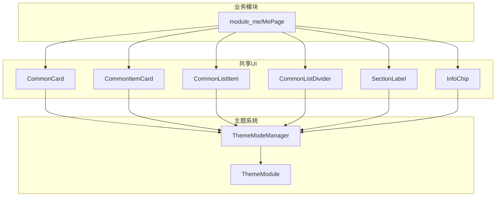
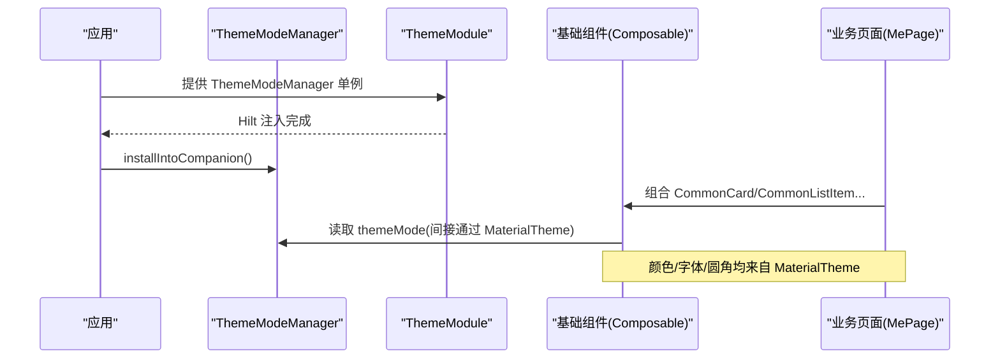
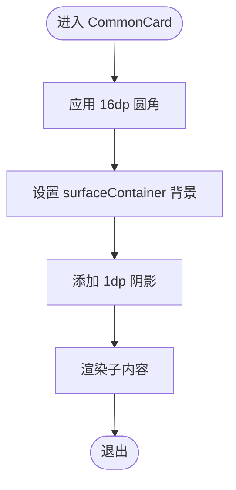
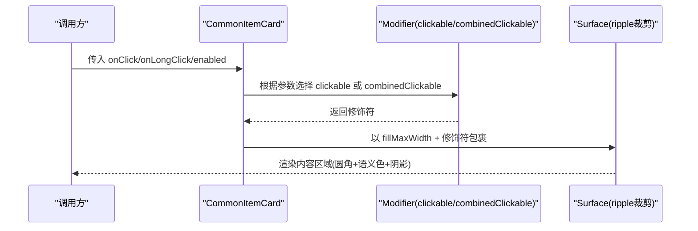
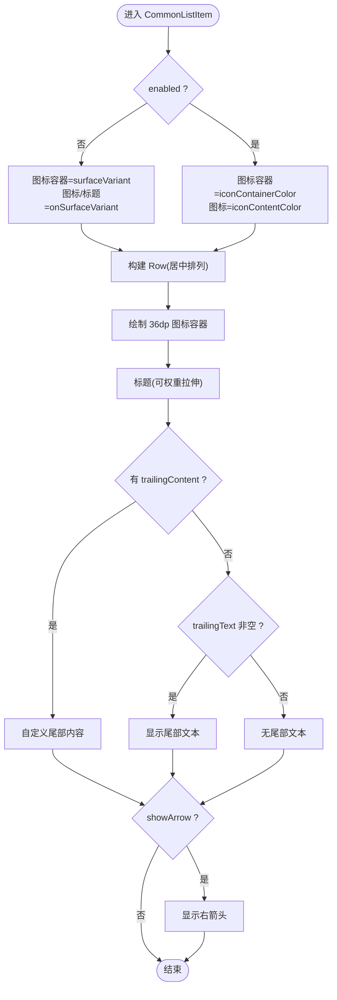
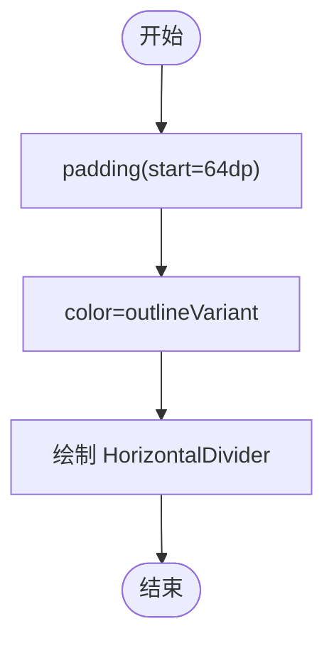
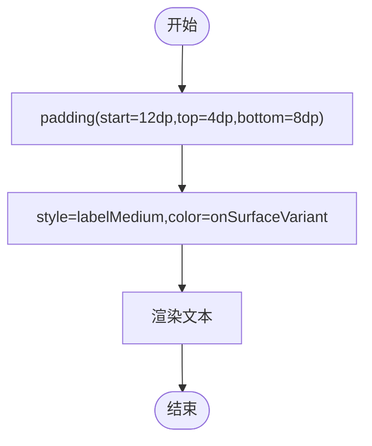
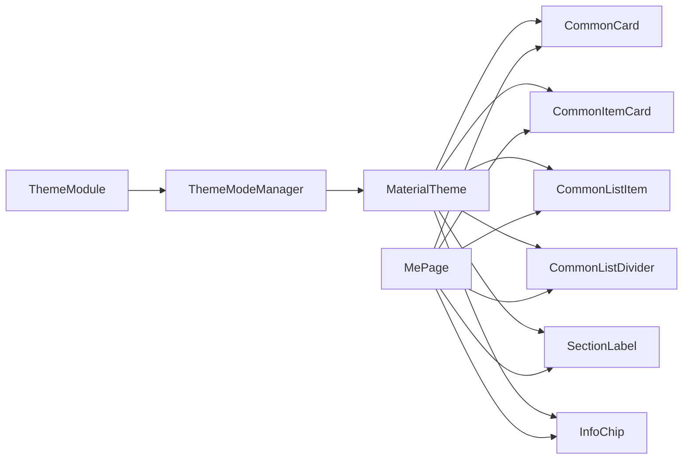

# 基础组件

<cite>
**本文引用的文件**
- [CommonUiComponents.kt](file://lib_book_common/src/main/java/com/ebook/common/ui/CommonUiComponents.kt)
- [ThemeModeManager.kt](file://lib_book_common/src/main/java/com/ebook/common/domain/ThemeModeManager.kt)
- [ThemeModule.kt](file://lib_book_common/src/main/java/com/ebook/common/di/ThemeModule.kt)
- [MePage.kt](file://module_me/src/main/java/com/ebook/me/page/MePage.kt)
</cite>

## 目录
1. [简介](#简介)
2. [项目结构](#项目结构)
3. [核心组件](#核心组件)
4. [架构总览](#架构总览)
5. [详细组件分析](#详细组件分析)
6. [依赖关系分析](#依赖关系分析)
7. [性能与可访问性](#性能与可访问性)
8. [故障排查指南](#故障排查指南)
9. [结论](#结论)
10. [附录：使用示例与扩展建议](#附录使用示例与扩展建议)

## 简介
本文件聚焦于跨模块共享的 Compose 基础 UI 组件，围绕以下目标展开：
- 分组卡片容器 CommonCard 的视觉规范（16dp 圆角、surfaceContainer 语义色、轻阴影）
- 列表条目卡 CommonItemCard 的交互逻辑（点击/长按、ripple 裁剪、enabled 状态管理）
- 菜单设置项 CommonListItem 的实现机制（36dp 彩色图标容器、标题与尾部布局、右侧箭头控制）
- 缩进分割线 CommonListDivider 的对齐逻辑
- 分组小标题 SectionLabel 的排版样式
- 组件的状态管理、可访问性支持与 Material Design 规范遵循
- 如何使用、如何自定义配置、如何扩展新的基础组件

## 项目结构
这些基础组件集中位于 lib_book_common 的 com.ebook.common.ui 包，作为跨模块共享的 UI 层。业务模块（如 module_me、module_book、module_find）通过引用该包复用统一视觉语言。主题与配色由 Material Theme 提供，并通过应用级主题管理器进行三态模式切换。

图表来源
- [CommonUiComponents.kt:85-308](file://lib_book_common/src/main/java/com/ebook/common/ui/CommonUiComponents.kt#L85-L308)
- [ThemeModeManager.kt:44-92](file://lib_book_common/src/main/java/com/ebook/common/domain/ThemeModeManager.kt#L44-L92)
- [ThemeModule.kt:17-26](file://lib_book_common/src/main/java/com/ebook/common/di/ThemeModule.kt#L17-L26)
- [MePage.kt:337-368](file://module_me/src/main/java/com/ebook/me/page/MePage.kt#L337-L368)

章节来源
- [CommonUiComponents.kt:33-77](file://lib_book_common/src/main/java/com/ebook/common/ui/CommonUiComponents.kt#L33-L77)
- [MePage.kt:77-138](file://module_me/src/main/java/com/ebook/me/page/MePage.kt#L77-L138)

## 核心组件
- CommonCard：分组容器，统一圆角、语义背景与轻微阴影，用于将一组相关条目聚合为一张“卡片”
- CommonItemCard：条目容器，承载任意内容并处理点击/长按、涟漪裁剪、禁用态
- CommonListItem：菜单/设置项，固定图标容器尺寸与间距，支持标题+尾部文本/内容+箭头
- CommonListDivider：从图标列起始处缩进的分割线，避免遮挡图标列
- SectionLabel：分组小标题，弱化文字，左对齐带内边距
- InfoChip：信息标签/胶囊，可点可选，统一圆角与语义色

章节来源
- [CommonUiComponents.kt:85-308](file://lib_book_common/src/main/java/com/ebook/common/ui/CommonUiComponents.kt#L85-L308)

## 架构总览
基础组件以 Material Theme 的颜色体系为唯一事实源，通过 CommonUiTokens 固化设计常量（圆角、间距等），确保跨模块视觉一致。主题模式通过 ThemeModeManager 暴露 StateFlow，应用启动时装配到 Compose 主题中，使所有组件在深浅色下表现一致。

图表来源
- [ThemeModule.kt:17-26](file://lib_book_common/src/main/java/com/ebook/common/di/ThemeModule.kt#L17-L26)
- [ThemeModeManager.kt:44-92](file://lib_book_common/src/main/java/com/ebook/common/domain/ThemeModeManager.kt#L44-L92)
- [CommonUiComponents.kt:85-308](file://lib_book_common/src/main/java/com/ebook/common/ui/CommonUiComponents.kt#L85-L308)
- [MePage.kt:77-138](file://module_me/src/main/java/com/ebook/me/page/MePage.kt#L77-L138)

## 详细组件分析

### CommonCard：分组卡片容器
- 视觉规范
  - 圆角：16dp（来自 CommonUiTokens.cardCorner）
  - 背景：MaterialTheme.colorScheme.surfaceContainer
  - 阴影：1dp 轻量阴影
- 职责边界
  - 仅负责“壳”：形状、语义色、阴影；内部内容由调用方决定
- 适用场景
  - 分组列表（菜单/设置项/分类区块）的统一容器

图表来源
- [CommonUiComponents.kt:85-98](file://lib_book_common/src/main/java/com/ebook/common/ui/CommonUiComponents.kt#L85-L98)

章节来源
- [CommonUiComponents.kt:47-77](file://lib_book_common/src/main/java/com/ebook/common/ui/CommonUiComponents.kt#L47-L77)
- [CommonUiComponents.kt:85-98](file://lib_book_common/src/main/java/com/ebook/common/ui/CommonUiComponents.kt#L85-L98)

### CommonItemCard：列表条目卡容器
- 视觉与布局
  - 圆角：12dp（CommonUiTokens.cardCornerSmall）
  - 背景：surfaceContainer
  - 默认内边距：12dp
  - 涟漪效果随 Surface 圆角裁剪，命中区即整卡
- 交互逻辑
  - 仅 onClick：使用 clickable
  - 同时存在 onLongClick：使用 combinedClickable，保证长按手势可用
  - enabled=false：仍渲染但不可点击，且向无障碍服务报告 disabled 状态
- 阴影高度
  - 默认 1dp；密集列表可传入 0dp 降低层级

图表来源
- [CommonUiComponents.kt:114-146](file://lib_book_common/src/main/java/com/ebook/common/ui/CommonUiComponents.kt#L114-L146)

章节来源
- [CommonUiComponents.kt:100-146](file://lib_book_common/src/main/java/com/ebook/common/ui/CommonUiComponents.kt#L100-L146)

### CommonListItem：菜单/设置项
- 布局结构
  - 左侧：36dp 方形圆角容器（常用 10dp 圆角）承载图标，图标 20dp
  - 中部：标题（bodyLarge），支持 weight 自适应
  - 右侧：优先 trailingContent；否则 trailingText；再之后是可选箭头
  - 整体行高与间距：水平 16dp、垂直 14dp 的内边距
- 启用态与禁用态
  - enabled=true：图标容器使用 iconContainerColor，图标前景 iconContentColor
  - enabled=false：图标容器回退到 surfaceVariant，图标与标题使用 onSurfaceVariant，整行仍可被点击但不可用（语义正确）
- 箭头显示
  - showArrow=true 时显示右箭头（仅导航类项）；纯展示项（如版本号）隐藏箭头

图表来源
- [CommonUiComponents.kt:164-228](file://lib_book_common/src/main/java/com/ebook/common/ui/CommonUiComponents.kt#L164-L228)

章节来源
- [CommonUiComponents.kt:148-228](file://lib_book_common/src/main/java/com/ebook/common/ui/CommonUiComponents.kt#L148-L228)

### CommonListDivider：缩进分割线
- 对齐逻辑
  - 左缩进 = 36dp（图标容器宽度）+ 12dp（图标与标题间隙）+ 16dp（行内左边距）= 64dp（CommonUiTokens.dividerIndent）
  - 颜色：outlineVariant，轻量且不抢视觉焦点
- 作用
  - 避免与图标列重叠，保持视觉对齐一致性

图表来源
- [CommonUiComponents.kt:230-239](file://lib_book_common/src/main/java/com/ebook/common/ui/CommonUiComponents.kt#L230-L239)

章节来源
- [CommonUiComponents.kt:75-77](file://lib_book_common/src/main/java/com/ebook/common/ui/CommonUiComponents.kt#L75-L77)
- [CommonUiComponents.kt:230-239](file://lib_book_common/src/main/java/com/ebook/common/ui/CommonUiComponents.kt#L230-L239)

### SectionLabel：分组小标题
- 排版样式
  - 字号：labelMedium
  - 颜色：onSurfaceVariant（弱化）
  - 位置：左对齐，start 12dp，上下 4dp/8dp 的留白
- 用途
  - 分组区块上方的小标题（如“通用”“关于”“书籍类型”）

图表来源
- [CommonUiComponents.kt:241-255](file://lib_book_common/src/main/java/com/ebook/common/ui/CommonUiComponents.kt#L241-L255)

章节来源
- [CommonUiComponents.kt:241-255](file://lib_book_common/src/main/java/com/ebook/common/ui/CommonUiComponents.kt#L241-L255)

### InfoChip：信息标签/胶囊
- 形态
  - 默认小圆角标签（4dp）；胶囊可通过 shape 传 50dp
  - 背景：surfaceVariant；文本：onSurfaceVariant
  - 可点击：onClick 非空时整体可点，并标注 Role.Button
- 用途
  - 评论条目的章节标签、书籍状态/分类/字数标签、搜索历史胶囊等

章节来源
- [CommonUiComponents.kt:257-308](file://lib_book_common/src/main/java/com/ebook/common/ui/CommonUiComponents.kt#L257-L308)

## 依赖关系分析
- 基础组件对 Material Theme 的依赖
  - 颜色：surfaceContainer、onSurfaceVariant、outlineVariant、primary/tertiary container 等
  - 字体：bodyLarge/bodyMedium/labelMedium/labelSmall
  - 图标：Icons.AutoMirrored.Filled.KeyboardArrowRight（仅 core 集）
- 主题系统的注入
  - ThemeModule 提供 ThemeModeManager 单例
  - ThemeModeManager 暴露 StateFlow 供应用装配主题
- 业务模块的使用
  - MePage 中使用 CommonCard、CommonListDivider、CommonListItem 等，验证了组件在真实页面中的组合方式

图表来源
- [CommonUiComponents.kt:85-308](file://lib_book_common/src/main/java/com/ebook/common/ui/CommonUiComponents.kt#L85-L308)
- [ThemeModule.kt:17-26](file://lib_book_common/src/main/java/com/ebook/common/di/ThemeModule.kt#L17-L26)
- [ThemeModeManager.kt:44-92](file://lib_book_common/src/main/java/com/ebook/common/domain/ThemeModeManager.kt#L44-L92)
- [MePage.kt:337-368](file://module_me/src/main/java/com/ebook/me/page/MePage.kt#L337-L368)

章节来源
- [CommonUiComponents.kt:85-308](file://lib_book_common/src/main/java/com/ebook/common/ui/CommonUiComponents.kt#L85-L308)
- [ThemeModule.kt:17-26](file://lib_book_common/src/main/java/com/ebook/common/di/ThemeModule.kt#L17-L26)
- [ThemeModeManager.kt:44-92](file://lib_book_common/src/main/java/com/ebook/common/domain/ThemeModeManager.kt#L44-L92)
- [MePage.kt:337-368](file://module_me/src/main/java/com/ebook/me/page/MePage.kt#L337-L368)

## 性能与可访问性
- 性能
  - CommonItemCard 将 clickable/combinedClickable 直接挂在 Surface 的 modifier 上，确保 ripple 按圆角裁剪，命中区域精确，减少无效点击计算
  - CommonListItem 使用 weight 分配标题空间，避免多余测量
  - InfoChip 可点击时仅包装一次 clickable，避免重复监听
- 可访问性
  - CommonItemCard 在 enabled=false 时仍挂 clickable，使 TalkBack 能正确识别“禁用”状态
  - InfoChip 点击时设置 role=Button，便于读屏器识别
  - 所有组件均基于 Material 语义色与 typography，确保对比度与可读性

[本节为通用指导，不直接分析具体文件]

## 故障排查指南
- 问题：点击无反馈或涟漪未显示
  - 检查是否给 Surface 添加了正确的 interactionModifier（clickable/combinedClickable）
  - 确认 Modifier 顺序：先 fillMaxWidth，再 then(interactionModifier)，最后才是内容 padding
- 问题：禁用态仍看起来可点击
  - 确保传入 enabled=false 给 clickable/combinedClickable，组件会将其写入无障碍语义
- 问题：分割线与图标列不对齐
  - 检查是否使用了 CommonListDivider；如需自定义，请沿用 dividerIndent=64dp 的缩进逻辑
- 问题：深色模式下对比度不足
  - 不要硬编码颜色；应使用 MaterialTheme.colorScheme 的语义色，配合 ThemeModeManager 的三态切换

章节来源
- [CommonUiComponents.kt:114-146](file://lib_book_common/src/main/java/com/ebook/common/ui/CommonUiComponents.kt#L114-L146)
- [CommonUiComponents.kt:164-228](file://lib_book_common/src/main/java/com/ebook/common/ui/CommonUiComponents.kt#L164-L228)
- [CommonUiComponents.kt:230-239](file://lib_book_common/src/main/java/com/ebook/common/ui/CommonUiComponents.kt#L230-L239)
- [ThemeModeManager.kt:44-92](file://lib_book_common/src/main/java/com/ebook/common/domain/ThemeModeManager.kt#L44-L92)

## 结论
- 基础组件以 Material Theme 为核心，通过 CommonUiTokens 固化设计常量，实现跨模块一致的视觉语言
- CommonCard 与 CommonItemCard 构成“容器-条目”两级卡片层次，清晰表达层级与交互
- CommonListItem 提供统一的菜单/设置项范式，兼顾图标、标题、尾部内容与箭头
- CommonListDivider 与 SectionLabel 完善了分组与分割的视觉节奏
- 组件内置 enabled 与无障碍语义支持，结合主题系统可在深浅色下保持一致体验

[本节为总结，不直接分析具体文件]

## 附录：使用示例与扩展建议

### 使用示例（路径参考）
- 分组卡片与分割线
  - 在个人主页中用 CommonCard 包裹统计行，并用 CommonListDivider 分隔不同区块
  - 参考：[MePage.kt:337-368](file://module_me/src/main/java/com/ebook/me/page/MePage.kt#L337-L368)
- 列表条目与菜单项
  - 使用 CommonItemCard 承载搜索结果或评论条目，传入 onClick/onLongClick/enabled
  - 使用 CommonListItem 呈现设置项，配置图标容器色、标题、尾部文本与箭头显隐
  - 参考：[CommonUiComponents.kt:114-146](file://lib_book_common/src/main/java/com/ebook/common/ui/CommonUiComponents.kt#L114-L146)、[CommonUiComponents.kt:164-228](file://lib_book_common/src/main/java/com/ebook/common/ui/CommonUiComponents.kt#L164-L228)
- 分组标题与信息标签
  - 使用 SectionLabel 标注分组小标题；使用 InfoChip 展示状态/分类/字数等标签
  - 参考：[CommonUiComponents.kt:241-255](file://lib_book_common/src/main/java/com/ebook/common/ui/CommonUiComponents.kt#L241-L255)、[CommonUiComponents.kt:257-308](file://lib_book_common/src/main/java/com/ebook/common/ui/CommonUiComponents.kt#L257-L308)

### 自定义配置要点
- 圆角与间距：通过 CommonUiTokens 统一管理，避免魔法值
- 颜色：一律使用 MaterialTheme.colorScheme 的语义色，确保深浅色适配
- 阴影：CommonItemCard 可根据列表密度调整 shadowElevation
- 箭头：CommonListItem 的 showArrow 控制导航提示的可见性
- 禁用态：通过 enabled 控制，不要自行改颜色以表达禁用，交由组件内部语义处理

### 扩展新基础组件的建议
- 命名与归属：新增通用组件应放入 lib_book_common 的 com.ebook.common.ui，保持跨模块共享
- 设计常量：新增圆角/间距等值时，优先考虑放入 CommonUiTokens
- 语义与可访问性：为可点击组件设置合适的 role，正确处理 enabled/disabled 状态
- 图标约束：仅使用 material-icons-core 核心集图标；扩展图标由业务模块自行引入
- 文档化：为新组件补充 KDoc，说明职责、参数、默认行为与使用场景

章节来源
- [CommonUiComponents.kt:47-77](file://lib_book_common/src/main/java/com/ebook/common/ui/CommonUiComponents.kt#L47-L77)
- [CommonUiComponents.kt:85-308](file://lib_book_common/src/main/java/com/ebook/common/ui/CommonUiComponents.kt#L85-L308)
- [MePage.kt:337-368](file://module_me/src/main/java/com/ebook/me/page/MePage.kt#L337-L368)