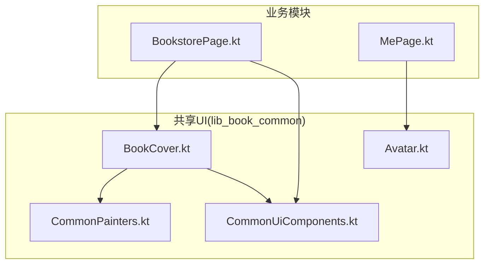
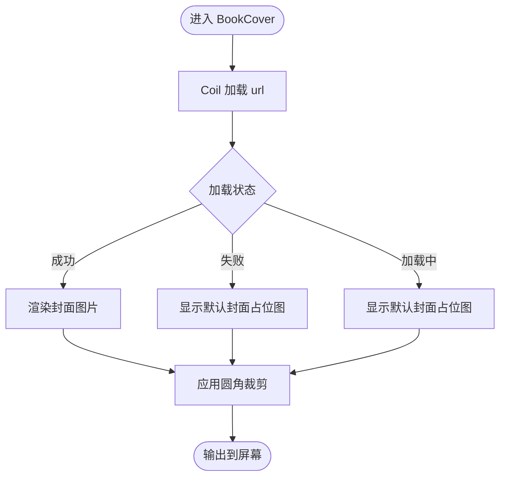
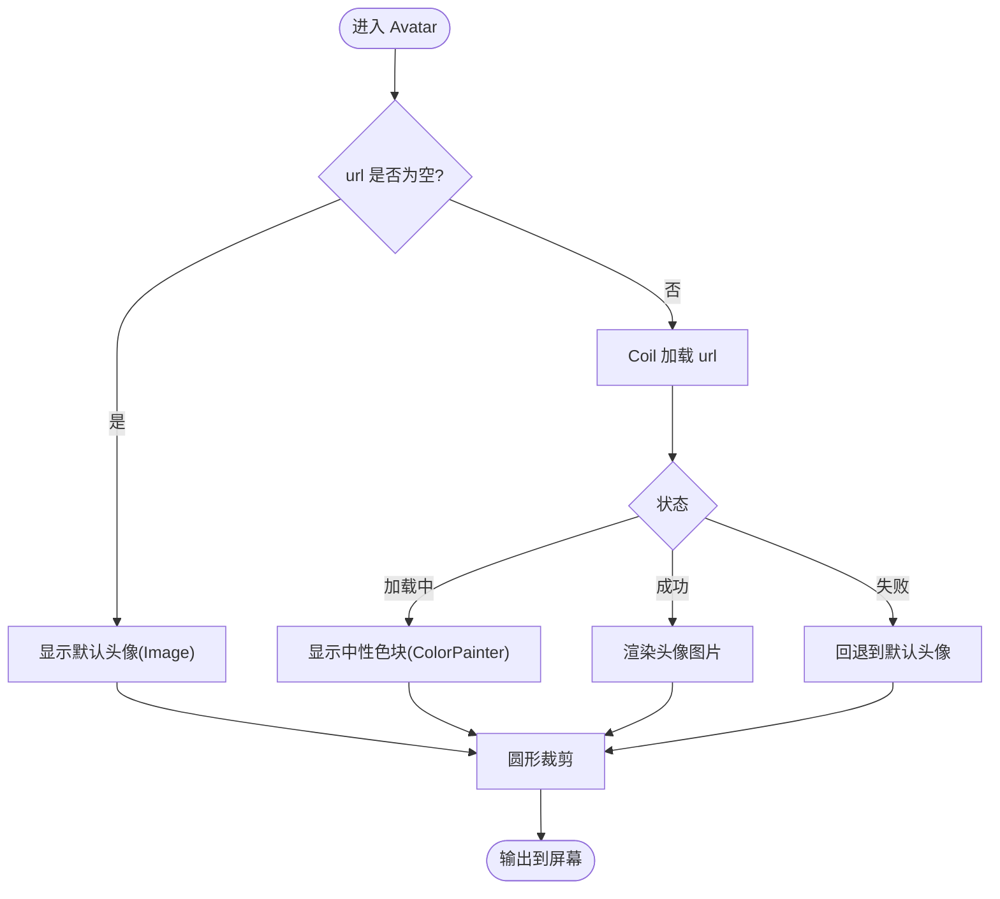
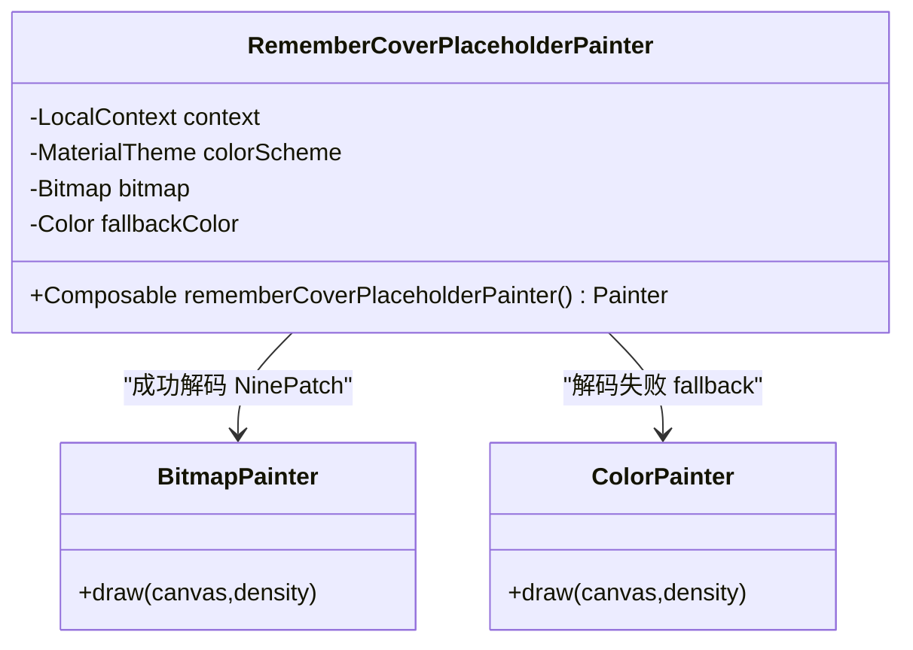
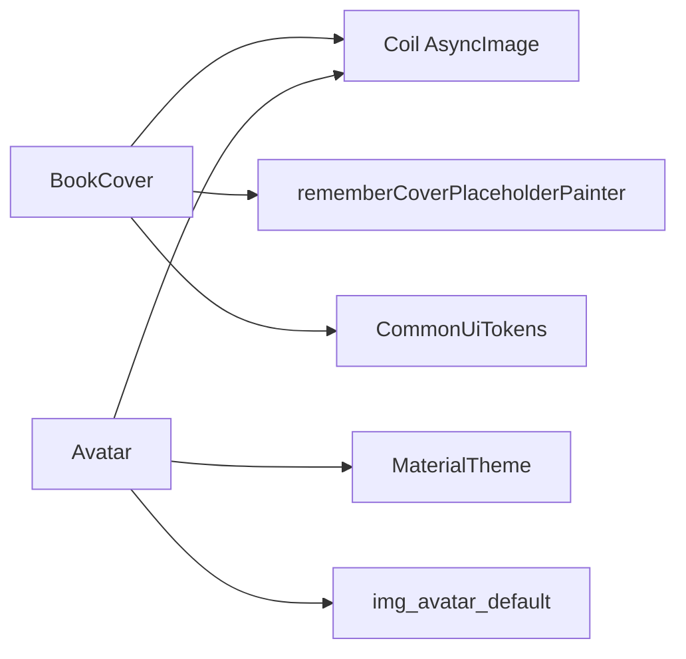

# 媒体组件

<cite>
**本文引用的文件**
- [lib_book_common/src/main/java/com/ebook/common/ui/BookCover.kt](file://lib_book_common/src/main/java/com/ebook/common/ui/BookCover.kt)
- [lib_book_common/src/main/java/com/ebook/common/ui/CommonPainters.kt](file://lib_book_common/src/main/java/com/ebook/common/ui/CommonPainters.kt)
- [lib_book_common/src/main/java/com/ebook/common/ui/CommonUiComponents.kt](file://lib_book_common/src/main/java/com/ebook/common/ui/CommonUiComponents.kt)
- [lib_book_common/src/main/java/com/ebook/common/ui/Avatar.kt](file://lib_book_common/src/main/java/com/ebook/common/ui/Avatar.kt)
- [module_find/src/main/java/com/ebook/find/page/BookstorePage.kt](file://module_find/src/main/java/com/ebook/find/page/BookstorePage.kt)
- [module_me/src/main/java/com/ebook/me/page/MePage.kt](file://module_me/src/main/java/com/ebook/me/page/MePage.kt)
</cite>

## 目录
1. [简介](#简介)
2. [项目结构](#项目结构)
3. [核心组件](#核心组件)
4. [架构总览](#架构总览)
5. [详细组件分析](#详细组件分析)
6. [依赖关系分析](#依赖关系分析)
7. [性能与内存管理](#性能与内存管理)
8. [故障排查指南](#故障排查指南)
9. [结论](#结论)
10. [附录：使用示例与配置](#附录使用示例与配置)

## 简介
本文件聚焦于共享媒体UI组件的实现与最佳实践，覆盖书籍封面（BookCover）与用户头像（Avatar）两大组件。重点说明：
- 基于 Coil 的网络图加载与统一占位图管理
- ContentScale.Crop 的裁切填充策略与圆角裁剪效果
- Avatar 的三态处理逻辑（空URL、加载中、失败回退）
- rememberCoverPlaceholderPainter 默认封面占位图的实现原理（NinePatch资源、Bitmap转换、fallback颜色机制）
- 性能优化、内存管理、异步加载处理
- 可访问性支持、主题集成与响应式适配

## 项目结构
媒体组件集中在 lib_book_common 的 com.ebook.common.ui 包中，被各业务模块复用：
- BookCover：统一的书籍封面加载与展示
- CommonPainters：rememberCoverPlaceholderPainter 提供默认封面占位图
- CommonUiTokens：统一设计常量（如封面圆角）
- Avatar：统一的用户头像加载与兜底
- 业务模块通过组合调用这些组件，避免重复拼装 AsyncImage + 占位 + 裁剪



图表来源
- [lib_book_common/src/main/java/com/ebook/common/ui/BookCover.kt:11-41](file://lib_book_common/src/main/java/com/ebook/common/ui/BookCover.kt#L11-L41)
- [lib_book_common/src/main/java/com/ebook/common/ui/CommonPainters.kt:13-38](file://lib_book_common/src/main/java/com/ebook/common/ui/CommonPainters.kt#L13-L38)
- [lib_book_common/src/main/java/com/ebook/common/ui/CommonUiComponents.kt:53-77](file://lib_book_common/src/main/java/com/ebook/common/ui/CommonUiComponents.kt#L53-L77)
- [module_find/src/main/java/com/ebook/find/page/BookstorePage.kt:530-579](file://module_find/src/main/java/com/ebook/find/page/BookstorePage.kt#L530-L579)
- [module_me/src/main/java/com/ebook/me/page/MePage.kt:303-329](file://module_me/src/main/java/com/ebook/me/page/MePage.kt#L303-L329)

章节来源
- [lib_book_common/src/main/java/com/ebook/common/ui/BookCover.kt:11-41](file://lib_book_common/src/main/java/com/ebook/common/ui/BookCover.kt#L11-L41)
- [lib_book_common/src/main/java/com/ebook/common/ui/CommonPainters.kt:13-38](file://lib_book_common/src/main/java/com/ebook/common/ui/CommonPainters.kt#L13-L38)
- [lib_book_common/src/main/java/com/ebook/common/ui/CommonUiComponents.kt:53-77](file://lib_book_common/src/main/java/com/ebook/common/ui/CommonUiComponents.kt#L53-L77)
- [module_find/src/main/java/com/ebook/find/page/BookstorePage.kt:530-579](file://module_find/src/main/java/com/ebook/find/page/BookstorePage.kt#L530-L579)
- [module_me/src/main/java/com/ebook/me/page/MePage.kt:303-329](file://module_me/src/main/java/com/ebook/me/page/MePage.kt#L303-L329)

## 核心组件
- BookCover：封装 Coil 网络图加载、统一占位图、圆角裁剪、Crop 填充策略
- Avatar：封装 Coil 网络图加载、圆形裁剪、三态兜底（空URL直接默认、加载中中性色块、失败默认头像）
- rememberCoverPlaceholderPainter：提供默认封面占位图，处理 NinePatch 资源解码与 fallback 颜色

章节来源
- [lib_book_common/src/main/java/com/ebook/common/ui/BookCover.kt:11-41](file://lib_book_common/src/main/java/com/ebook/common/ui/BookCover.kt#L11-L41)
- [lib_book_common/src/main/java/com/ebook/common/ui/Avatar.kt:15-62](file://lib_book_common/src/main/java/com/ebook/common/ui/Avatar.kt#L15-L62)
- [lib_book_common/src/main/java/com/ebook/common/ui/CommonPainters.kt:13-38](file://lib_book_common/src/main/java/com/ebook/common/ui/CommonPainters.kt#L13-L38)

## 架构总览
媒体组件采用“收敛点”模式：所有需要显示封面或头像的地方都调用共享组件，不再各自拼装 AsyncImage、占位符和裁剪逻辑。这降低了耦合、统一了视觉语言与行为，便于集中优化与维护。

```mermaid
sequenceDiagram
    participant Caller as "调用方(页面/卡片)"
    participant Cover as "BookCover"
    participant Coil as "Coil AsyncImage"
    participant Painter as "rememberCoverPlaceholderPainter"
    Caller->>Cover: 传入 url, modifier, contentDescription, shape
    Cover->>Coil: 设置 model=url, placeholder/error=Painter
    Cover->>Coil: 设置 contentScale=Crop, clip(shape)
    Coil-->>Caller: 成功时渲染图片; 失败/加载时渲染占位图
```

图表来源
- [lib_book_common/src/main/java/com/ebook/common/ui/BookCover.kt:27-41](file://lib_book_common/src/main/java/com/ebook/common/ui/BookCover.kt#L27-L41)
- [lib_book_common/src/main/java/com/ebook/common/ui/CommonPainters.kt:25-38](file://lib_book_common/src/main/java/com/ebook/common/ui/CommonPainters.kt#L25-L38)

章节来源
- [lib_book_common/src/main/java/com/ebook/common/ui/BookCover.kt:27-41](file://lib_book_common/src/main/java/com/ebook/common/ui/BookCover.kt#L27-L41)
- [lib_book_common/src/main/java/com/ebook/common/ui/CommonPainters.kt:25-38](file://lib_book_common/src/main/java/com/ebook/common/ui/CommonPainters.kt#L25-L38)

## 详细组件分析

### BookCover 书籍封面组件
- 职责：统一封装 Coil 网络图加载、统一占位图、圆角裁剪、Crop 填充策略
- 关键实现要点：
  - 使用 Coil 的 AsyncImage 进行网络图加载
  - placeholder 与 error 统一走 rememberCoverPlaceholderPainter()
  - contentScale 固定为 ContentScale.Crop，避免非标准比例封面拉伸变形
  - 通过 Modifier.clip(shape) 实现圆角裁剪，默认圆角来自 CommonUiTokens.coverCorner
  - contentDescription 用于无障碍描述
- 使用场景：书城横向书卡、搜索结果条目、书架等封面展示位置



图表来源
- [lib_book_common/src/main/java/com/ebook/common/ui/BookCover.kt:27-41](file://lib_book_common/src/main/java/com/ebook/common/ui/BookCover.kt#L27-L41)
- [lib_book_common/src/main/java/com/ebook/common/ui/CommonPainters.kt:25-38](file://lib_book_common/src/main/java/com/ebook/common/ui/CommonPainters.kt#L25-L38)

章节来源
- [lib_book_common/src/main/java/com/ebook/common/ui/BookCover.kt:11-41](file://lib_book_common/src/main/java/com/ebook/common/ui/BookCover.kt#L11-L41)
- [lib_book_common/src/main/java/com/ebook/common/ui/CommonUiComponents.kt:63-64](file://lib_book_common/src/main/java/com/ebook/common/ui/CommonUiComponents.kt#L63-L64)

### Avatar 用户头像组件
- 职责：统一封装头像加载与兜底，保证未登录或加载失败时不出现空白圆
- 三态处理逻辑：
  - 空 URL：不调用 Coil，直接展示默认头像（Image + ColorPainter），避免无意义请求
  - 加载中：显示中性色块（MaterialTheme.colorScheme.surfaceVariant），避免陌生剪影闪烁
  - 失败：回退到默认头像
- 圆形裁剪：通过 CircleShape 与 Modifier.clip 实现
- 使用场景：个人中心头像、列表项头像等



图表来源
- [lib_book_common/src/main/java/com/ebook/common/ui/Avatar.kt:36-62](file://lib_book_common/src/main/java/com/ebook/common/ui/Avatar.kt#L36-L62)

章节来源
- [lib_book_common/src/main/java/com/ebook/common/ui/Avatar.kt:15-62](file://lib_book_common/src/main/java/com/ebook/common/ui/Avatar.kt#L15-L62)

### rememberCoverPlaceholderPainter 默认封面占位图
- 职责：为 BookCover 提供默认的封面占位图，确保加载过程与失败时有统一视觉
- 实现原理：
  - 资源类型：NinePatch（.9.png），painterResource 不支持，必须通过 Context.getDrawable 获取
  - 转换为 Bitmap 后包装为 BitmapPainter，用于占位与错误状态
  - fallback 颜色：当资源加载失败时，回退到 MaterialTheme.colorScheme.surfaceVariant 的颜色占位
  - 使用 remember 缓存 Painter，避免重复解码
- 注意：NinePatch 的拉伸区域语义在转 Bitmap 后会丢失，但在占位图场景可接受



图表来源
- [lib_book_common/src/main/java/com/ebook/common/ui/CommonPainters.kt:13-38](file://lib_book_common/src/main/java/com/ebook/common/ui/CommonPainters.kt#L13-L38)

章节来源
- [lib_book_common/src/main/java/com/ebook/common/ui/CommonPainters.kt:13-38](file://lib_book_common/src/main/java/com/ebook/common/ui/CommonPainters.kt#L13-L38)

### 业务模块中的使用
- 书城页（BookstorePage）：使用 BookCover 展示书籍封面，外包 Card 提供阴影与圆角
- 个人页（MePage）：使用 Avatar 展示用户头像，结合光环与主题渐变背景

章节来源
- [module_find/src/main/java/com/ebook/find/page/BookstorePage.kt:530-579](file://module_find/src/main/java/com/ebook/find/page/BookstorePage.kt#L530-L579)
- [module_me/src/main/java/com/ebook/me/page/MePage.kt:303-329](file://module_me/src/main/java/com/ebook/me/page/MePage.kt#L303-L329)

## 依赖关系分析
- BookCover 依赖：
  - Coil Compose 的 AsyncImage
  - rememberCoverPlaceholderPainter 提供统一占位图
  - CommonUiTokens 提供默认圆角
- Avatar 依赖：
  - Coil Compose 的 AsyncImage
  - MaterialTheme 提供语义色
  - 默认头像资源（R.drawable.img_avatar_default）



图表来源
- [lib_book_common/src/main/java/com/ebook/common/ui/BookCover.kt:27-41](file://lib_book_common/src/main/java/com/ebook/common/ui/BookCover.kt#L27-L41)
- [lib_book_common/src/main/java/com/ebook/common/ui/CommonPainters.kt:25-38](file://lib_book_common/src/main/java/com/ebook/common/ui/CommonPainters.kt#L25-L38)
- [lib_book_common/src/main/java/com/ebook/common/ui/Avatar.kt:36-62](file://lib_book_common/src/main/java/com/ebook/common/ui/Avatar.kt#L36-L62)

章节来源
- [lib_book_common/src/main/java/com/ebook/common/ui/BookCover.kt:27-41](file://lib_book_common/src/main/java/com/ebook/common/ui/BookCover.kt#L27-L41)
- [lib_book_common/src/main/java/com/ebook/common/ui/CommonPainters.kt:25-38](file://lib_book_common/src/main/java/com/ebook/common/ui/CommonPainters.kt#L25-L38)
- [lib_book_common/src/main/java/com/ebook/common/ui/Avatar.kt:36-62](file://lib_book_common/src/main/java/com/ebook/common/ui/Avatar.kt#L36-L62)

## 性能与内存管理
- 异步加载：使用 Coil 的 AsyncImage，内部处理网络请求、缓存与生命周期绑定，避免主线程阻塞
- 内存优化：
  - rememberCoverPlaceholderPainter 使用 remember 缓存 Painter，避免重复解码 NinePatch 资源
  - ContentScale.Crop 减少图片缩放计算开销，直接裁切填充目标尺寸
  - 圆角裁剪通过 Modifier.clip 在绘制阶段处理，避免额外图层
- 占位图管理：统一占位图避免多处实现差异，减少内存占用与不一致风险
- 资源处理：NinePatch 转为 Bitmap 后由 Coil 管理生命周期，释放时机由框架控制

章节来源
- [lib_book_common/src/main/java/com/ebook/common/ui/CommonPainters.kt:25-38](file://lib_book_common/src/main/java/com/ebook/common/ui/CommonPainters.kt#L25-L38)
- [lib_book_common/src/main/java/com/ebook/common/ui/BookCover.kt:27-41](file://lib_book_common/src/main/java/com/ebook/common/ui/BookCover.kt#L27-L41)

## 故障排查指南
- 封面显示空白：
  - 检查 url 是否为空或无效
  - 确认 rememberCoverPlaceholderPainter 是否返回有效占位图
  - 查看 Coil 日志确认网络请求状态
- 头像显示空白：
  - 确认 Avatar 的三态逻辑是否正确（空URL、加载中、失败）
  - 检查默认头像资源是否存在且可加载
- 占位图不生效：
  - 确认 BookCover 的 placeholder 与 error 参数是否正确设置
  - 验证 rememberCoverPlaceholderPainter 的 fallback 颜色机制

章节来源
- [lib_book_common/src/main/java/com/ebook/common/ui/BookCover.kt:27-41](file://lib_book_common/src/main/java/com/ebook/common/ui/BookCover.kt#L27-L41)
- [lib_book_common/src/main/java/com/ebook/common/ui/Avatar.kt:36-62](file://lib_book_common/src/main/java/com/ebook/common/ui/Avatar.kt#L36-L62)
- [lib_book_common/src/main/java/com/ebook/common/ui/CommonPainters.kt:25-38](file://lib_book_common/src/main/java/com/ebook/common/ui/CommonPainters.kt#L25-L38)

## 结论
BookCover 与 Avatar 作为共享媒体组件，通过统一封装 Coil 网络图加载、占位图管理与裁剪策略，实现了视觉一致性与维护便利性。其设计遵循以下原则：
- 收敛点模式：避免业务模块重复实现
- 三态处理：确保加载过程中的用户体验稳定
- 主题集成：使用 MaterialTheme 语义色，支持深浅色切换
- 性能优化：合理缓存、裁切与异步加载

## 附录：使用示例与配置
- 配置不同加载策略：
  - BookCover：通过传入不同的 url、modifier、contentDescription、shape 实现不同尺寸与圆角
  - Avatar：通过传入空URL或有效URL控制默认头像与网络头像的切换
- 处理加载状态：
  - 使用 rememberCoverPlaceholderPainter 提供统一占位图
  - Avatar 内置加载中中性色块，避免剪影闪烁
- 自定义占位符：
  - 可替换 rememberCoverPlaceholderPainter 的实现以支持自定义占位图
  - Avatar 可通过外层修饰符添加光环、描边等装饰

章节来源
- [lib_book_common/src/main/java/com/ebook/common/ui/BookCover.kt:27-41](file://lib_book_common/src/main/java/com/ebook/common/ui/BookCover.kt#L27-L41)
- [lib_book_common/src/main/java/com/ebook/common/ui/Avatar.kt:36-62](file://lib_book_common/src/main/java/com/ebook/common/ui/Avatar.kt#L36-L62)
- [lib_book_common/src/main/java/com/ebook/common/ui/CommonPainters.kt:25-38](file://lib_book_common/src/main/java/com/ebook/common/ui/CommonPainters.kt#L25-L38)