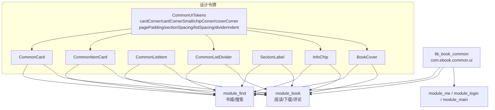
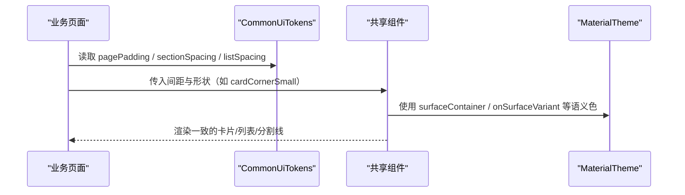
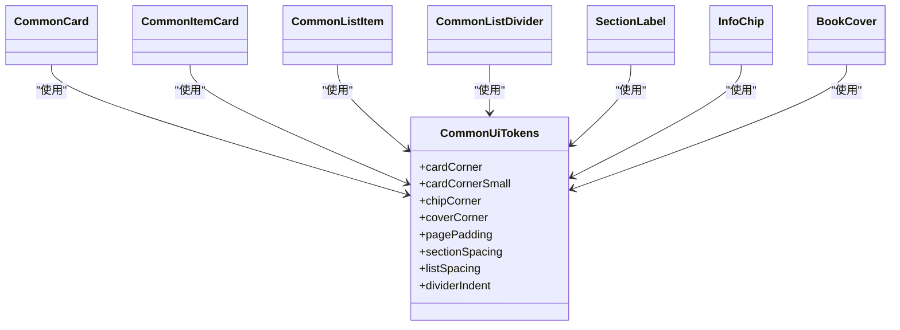

# 设计令牌

<cite>
**本文引用的文件**
- [CommonUiComponents.kt](file://lib_book_common/src/main/java/com/ebook/common/ui/CommonUiComponents.kt)
- [BookCover.kt](file://lib_book_common/src/main/java/com/ebook/common/ui/BookCover.kt)
- [BookstorePage.kt](file://module_find/src/main/java/com/ebook/find/page/BookstorePage.kt)
- [SearchActivity.kt](file://module_find/src/main/java/com/ebook/find/SearchActivity.kt)
- [ChapterDownloadSheet.kt](file://module_book/src/main/java/com/ebook/book/reader/ChapterDownloadSheet.kt)
- [ReaderPanels.kt](file://module_book/src/main/java/com/ebook/book/reader/ReaderPanels.kt)
</cite>

## 目录
1. [引言](#引言)
2. [项目结构](#项目结构)
3. [核心组件](#核心组件)
4. [架构总览](#架构总览)
5. [详细组件分析](#详细组件分析)
6. [依赖关系分析](#依赖关系分析)
7. [性能考量](#性能考量)
8. [故障排查指南](#故障排查指南)
9. [结论](#结论)
10. [附录：扩展与维护指南](#附录扩展与维护指南)

## 引言
本文件聚焦“设计令牌”体系，围绕 CommonUiTokens 的设计常量与共享 UI 组件，解释其设计理念、命名语义、层级关系、引用机制，以及如何在不同场景下保持全 App 视觉一致性。同时说明与 Material Design 主题、暗色模式的可定制性，并给出扩展新令牌的流程与维护建议。

## 项目结构
设计令牌位于跨模块共享库 lib_book_common 的 UI 包中，作为唯一事实来源（Single Source of Truth），被各业务模块在 Compose 界面中统一引用，从而避免魔法值散落导致的视觉漂移。

图表来源
- [CommonUiComponents.kt:47-77](file://lib_book_common/src/main/java/com/ebook/common/ui/CommonUiComponents.kt#L47-L77)
- [CommonUiComponents.kt:85-146](file://lib_book_common/src/main/java/com/ebook/common/ui/CommonUiComponents.kt#L85-L146)
- [CommonUiComponents.kt:230-239](file://lib_book_common/src/main/java/com/ebook/common/ui/CommonUiComponents.kt#L230-L239)
- [CommonUiComponents.kt:276-308](file://lib_book_common/src/main/java/com/ebook/common/ui/CommonUiComponents.kt#L276-L308)
- [BookCover.kt:27-41](file://lib_book_common/src/main/java/com/ebook/common/ui/BookCover.kt#L27-L41)

章节来源
- [CommonUiComponents.kt:47-77](file://lib_book_common/src/main/java/com/ebook/common/ui/CommonUiComponents.kt#L47-L77)

## 核心组件
- CommonUiTokens：定义圆角、间距、分割线缩进等设计常量，作为全仓“唯一事实来源”。
- CommonCard：分组容器卡片，采用较大圆角，承载一组条目。
- CommonItemCard：列表条目卡片，较小圆角，用于搜索结果、评论等条目。
- CommonListItem：带彩色图标容器的菜单/设置项行。
- CommonListDivider：从图标列起始处缩进的分割线，避免与图标重叠。
- SectionLabel：分组小标题标签。
- InfoChip：弱化背景的信息标签/胶囊。
- BookCover：统一的书籍封面展示组件，使用统一圆角裁剪。

这些组件共同实现“容器-条目”两级卡片层次：分组容器（16dp）包裹条目卡片（12dp），形成清晰的视觉层级与节奏。

章节来源
- [CommonUiComponents.kt:47-77](file://lib_book_common/src/main/java/com/ebook/common/ui/CommonUiComponents.kt#L47-L77)
- [CommonUiComponents.kt:85-146](file://lib_book_common/src/main/java/com/ebook/common/ui/CommonUiComponents.kt#L85-L146)
- [CommonUiComponents.kt:148-228](file://lib_book_common/src/main/java/com/ebook/common/ui/CommonUiComponents.kt#L148-L228)
- [CommonUiComponents.kt:230-239](file://lib_book_common/src/main/java/com/ebook/common/ui/CommonUiComponents.kt#L230-L239)
- [CommonUiComponents.kt:241-255](file://lib_book_common/src/main/java/com/ebook/common/ui/CommonUiComponents.kt#L241-L255)
- [CommonUiComponents.kt:276-308](file://lib_book_common/src/main/java/com/ebook/common/ui/CommonUiComponents.kt#L276-L308)
- [BookCover.kt:27-41](file://lib_book_common/src/main/java/com/ebook/common/ui/BookCover.kt#L27-L41)

## 架构总览
设计令牌通过“集中定义 + 组件封装 + 页面引用”的方式贯穿应用：

图表来源
- [CommonUiComponents.kt:47-77](file://lib_book_common/src/main/java/com/ebook/common/ui/CommonUiComponents.kt#L47-L77)
- [CommonUiComponents.kt:85-146](file://lib_book_common/src/main/java/com/ebook/common/ui/CommonUiComponents.kt#L85-L146)

## 详细组件分析

### 设计令牌体系与语义化命名
- 圆角规范
  - cardCorner = 16dp：分组容器卡圆角（如 CommonCard），体现外层“容器”层级。
  - cardCornerSmall = 12dp：条目卡圆角（如 CommonItemCard），体现内层“条目”层级。
  - chipCorner = 4dp：信息小标签默认圆角（InfoChip 默认；胶囊场景由调用方传 50dp）。
  - coverCorner = 10dp：书籍封面默认圆角（BookCover 默认）。
- 间距系统
  - pagePadding = 16dp：页面水平边距，保证内容与屏幕边缘呼吸空间。
  - sectionSpacing = 12dp：区块之间的垂直间距，用于分隔分类/章节等大块内容。
  - listSpacing = 8dp：列表条目之间的垂直间距，控制密集度与可读性。
- 分割线缩进
  - dividerIndent = 64dp：分割线从文字起始处缩进，避开左侧图标列，使列表更轻。

这些常量是跨模块的唯一事实来源，禁止在各页面重复写死数值，确保视觉一致性。

章节来源
- [CommonUiComponents.kt:47-77](file://lib_book_common/src/main/java/com/ebook/common/ui/CommonUiComponents.kt#L47-L77)

### 令牌在组件中的引用机制
- CommonCard 使用 cardCorner 作为容器圆角，配合 surfaceContainer 语义色与轻阴影，营造分组容器感。
- CommonItemCard 使用 cardCornerSmall 作为条目圆角，点击面覆盖整卡，涟漪按圆角裁剪；仅负责壳（形状、语义色、内边距），内容由插槽决定。
- CommonListDivider 使用 dividerIndent 做左缩进，避免与图标对齐冲突。
- InfoChip 默认 chipCorner；胶囊形态通过 shape 参数覆盖为 50dp。
- BookCover 默认 coverCorner 进行图片圆角裁剪，统一占位图与错误态。

章节来源
- [CommonUiComponents.kt:85-146](file://lib_book_common/src/main/java/com/ebook/common/ui/CommonUiComponents.kt#L85-L146)
- [CommonUiComponents.kt:230-239](file://lib_book_common/src/main/java/com/ebook/common/ui/CommonUiComponents.kt#L230-L239)
- [CommonUiComponents.kt:276-308](file://lib_book_common/src/main/java/com/ebook/common/ui/CommonUiComponents.kt#L276-L308)
- [BookCover.kt:27-41](file://lib_book_common/src/main/java/com/ebook/common/ui/BookCover.kt#L27-L41)

### 页面级使用示例
- 书城页面：LazyColumn 使用 pagePadding 作为左右内边距，使用 sectionSpacing 作为区块间隔，列表项之间使用 listSpacing 排列。
- 搜索结果：使用 CommonItemCard（12dp 圆角）+ surfaceContainer 语义色，行距使用 listSpacing。
- 阅读器面板：多处使用 pagePadding 与 sectionSpacing 保持布局一致，部分区域明确不复用 dividerIndent 以适配自身布局需求。
- 下载管理页：书行使用 CommonItemCard（12dp 圆角、listSpacing 行距），封面使用 BookCover（coverCorner 圆角）。

章节来源
- [BookstorePage.kt:118-122](file://module_find/src/main/java/com/ebook/find/page/BookstorePage.kt#L118-L122)
- [BookstorePage.kt:276-281](file://module_find/src/main/java/com/ebook/find/page/BookstorePage.kt#L276-L281)
- [SearchActivity.kt:262-268](file://module_find/src/main/java/com/ebook/find/SearchActivity.kt#L262-L268)
- [ChapterDownloadSheet.kt:587](file://module_book/src/main/java/com/ebook/book/reader/ChapterDownloadSheet.kt#L587)
- [ChapterDownloadSheet.kt:766](file://module_book/src/main/java/com/ebook/book/reader/ChapterDownloadSheet.kt#L766)
- [ReaderPanels.kt:1339-1343](file://module_book/src/main/java/com/ebook/book/reader/ReaderPanels.kt#L1339-L1343)

### 设计原则
- 层级关系：容器（16dp）与条目（12dp）两级卡片层次，清晰区分分组与条目，增强视觉组织。
- 语义化命名：cardCorner/cardCornerSmall/chipCorner/coverCorner、pagePadding/sectionSpacing/listSpacing、dividerIndent 等名称直接表达用途与语义，降低理解成本。
- 唯一事实来源：所有圆角与间距来自 CommonUiTokens，禁止硬编码魔法值，避免多模块视觉漂移。
- 可组合与可扩展：组件提供必要参数（如 shape、contentPadding、shadowElevation），在不破坏约定前提下支持局部定制。

章节来源
- [CommonUiComponents.kt:47-77](file://lib_book_common/src/main/java/com/ebook/common/ui/CommonUiComponents.kt#L47-L77)
- [CommonUiComponents.kt:85-146](file://lib_book_common/src/main/java/com/ebook/common/ui/CommonUiComponents.kt#L85-L146)

### 与 Material Design 主题的集成
- 颜色：组件广泛使用 MaterialTheme.colorScheme.surfaceContainer、onSurfaceVariant、outlineVariant 等语义色，自动适配浅色/深色主题。
- 排版：文本样式走 MaterialTypography（bodyLarge、labelMedium、labelSmall 等），保持一致的字号与字重。
- 交互：点击涟漪随圆角裁剪，禁用态通过 enabled 与语义色传达“看得见但点不动”，符合无障碍与交互预期。

章节来源
- [CommonUiComponents.kt:85-146](file://lib_book_common/src/main/java/com/ebook/common/ui/CommonUiComponents.kt#L85-L146)
- [CommonUiComponents.kt:148-228](file://lib_book_common/src/main/java/com/ebook/common/ui/CommonUiComponents.kt#L148-L228)
- [CommonUiComponents.kt:276-308](file://lib_book_common/src/main/java/com/ebook/common/ui/CommonUiComponents.kt#L276-L308)

### 暗色模式支持与可定制性
- 暗色模式：由于全部基于语义色与 Typography，切换主题时自动适配，无需额外处理。
- 可定制性：组件暴露关键参数（如 InfoChip 的 shape、textStyle、contentPadding；CommonItemCard 的 shadowElevation、contentPadding），允许在特定场景微调而不破坏整体规范。

章节来源
- [CommonUiComponents.kt:148-228](file://lib_book_common/src/main/java/com/ebook/common/ui/CommonUiComponents.kt#L148-L228)
- [CommonUiComponents.kt:276-308](file://lib_book_common/src/main/java/com/ebook/common/ui/CommonUiComponents.kt#L276-L308)

## 依赖关系分析
- 设计令牌依赖：无外部依赖，纯常量定义。
- 组件依赖：
  - CommonCard/CommonItemCard/CommonListItem/CommonListDivider/SectionLabel/InfoChip 均依赖 MaterialTheme（颜色/排版）。
  - BookCover 依赖 Coil 与占位图。
- 页面依赖：
  - 各业务模块页面通过引用 CommonUiTokens 与共享组件，间接依赖 MaterialTheme。

图表来源
- [CommonUiComponents.kt:47-77](file://lib_book_common/src/main/java/com/ebook/common/ui/CommonUiComponents.kt#L47-L77)
- [CommonUiComponents.kt:85-146](file://lib_book_common/src/main/java/com/ebook/common/ui/CommonUiComponents.kt#L85-L146)
- [CommonUiComponents.kt:230-239](file://lib_book_common/src/main/java/com/ebook/common/ui/CommonUiComponents.kt#L230-L239)
- [CommonUiComponents.kt:276-308](file://lib_book_common/src/main/java/com/ebook/common/ui/CommonUiComponents.kt#L276-L308)
- [BookCover.kt:27-41](file://lib_book_common/src/main/java/com/ebook/common/ui/BookCover.kt#L27-L41)

章节来源
- [CommonUiComponents.kt:47-77](file://lib_book_common/src/main/java/com/ebook/common/ui/CommonUiComponents.kt#L47-L77)

## 性能考量
- 减少重复计算：设计令牌集中定义，避免多处硬编码造成的冗余测量与绘制。
- 组件复用：共享组件封装了常用组合（圆角、语义色、点击面、内边距），减少页面复杂度和渲染开销。
- 列表优化：合理使用 listSpacing 与卡片阴影，在密集列表中可通过 shadowElevation=0.dp 提升滚动流畅度。

## 故障排查指南
- 视觉不一致：检查是否直接使用了硬编码的 dp 值而非 CommonUiTokens；确认组件是否正确引用了语义色。
- 圆角异常：确认当前场景应使用 cardCorner（容器）还是 cardCornerSmall（条目）；封面请使用 coverCorner。
- 分割线错位：确认是否误用了 dividerIndent 的场景；某些面板可能因布局需要选择不复用该缩进。
- 主题切换异常：确认未硬编码颜色；所有颜色应从 MaterialTheme.colorScheme 获取。

章节来源
- [CommonUiComponents.kt:85-146](file://lib_book_common/src/main/java/com/ebook/common/ui/CommonUiComponents.kt#L85-L146)
- [CommonUiComponents.kt:230-239](file://lib_book_common/src/main/java/com/ebook/common/ui/CommonUiComponents.kt#L230-L239)
- [BookCover.kt:27-41](file://lib_book_common/src/main/java/com/ebook/common/ui/BookCover.kt#L27-L41)

## 结论
CommonUiTokens 及其配套共享组件构成了应用的“设计语言中枢”，通过集中定义、语义化命名、组件封装与页面引用，实现了跨模块的视觉一致性与可维护性。遵循“容器-条目”两级卡片层次、严格间距系统与分割线缩进规则，结合 Material Design 语义色与排版，既保证了美观，也兼顾了可定制性与暗色模式支持。

## 附录：扩展与维护指南

### 如何扩展新的设计令牌
- 新增步骤
  - 在 CommonUiTokens 中添加新常量（例如新增一个间距或圆角），并在 KDoc 中说明用途与适用场景。
  - 在共享组件中引入新令牌（如在某组件默认值中使用），或在必要时提供参数供调用方选择。
  - 更新业务页面，替换硬编码值为新令牌，确保引用路径正确。
- 注意事项
  - 新令牌必须具有明确语义（如 spacingXxx、cornerXxx），避免模糊命名。
  - 保持与现有体系的兼容性（如与 MaterialTheme 语义色、Typography 的一致性）。
  - 如涉及组件默认行为变化，需评估对现有页面的影响并进行回归验证。

章节来源
- [CommonUiComponents.kt:47-77](file://lib_book_common/src/main/java/com/ebook/common/ui/CommonUiComponents.kt#L47-L77)

### 设计系统的维护策略
- 单一事实源：所有圆角与间距只从 CommonUiTokens 引用，禁止在页面中重复定义。
- 组件收敛：将跨模块共性沉淀到共享组件，减少散落的组合逻辑。
- 文档同步：当令牌或组件变更时，同步更新注释与相关文档，确保开发者理解意图。
- 测试与回归：对关键页面进行安装与打开验证，确保主题切换、暗色模式、横竖屏下的表现一致。

章节来源
- [CommonUiComponents.kt:47-77](file://lib_book_common/src/main/java/com/ebook/common/ui/CommonUiComponents.kt#L47-L77)
- [BookstorePage.kt:118-122](file://module_find/src/main/java/com/ebook/find/page/BookstorePage.kt#L118-L122)
- [SearchActivity.kt:262-268](file://module_find/src/main/java/com/ebook/find/SearchActivity.kt#L262-L268)