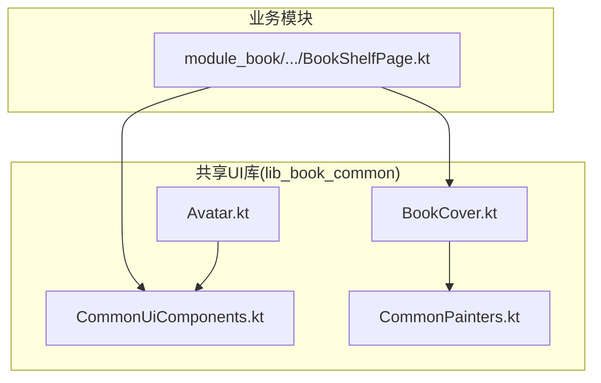
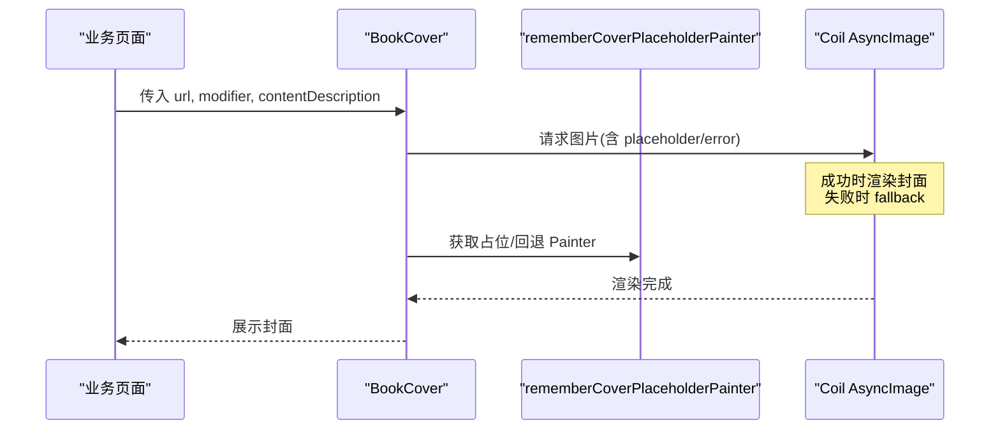
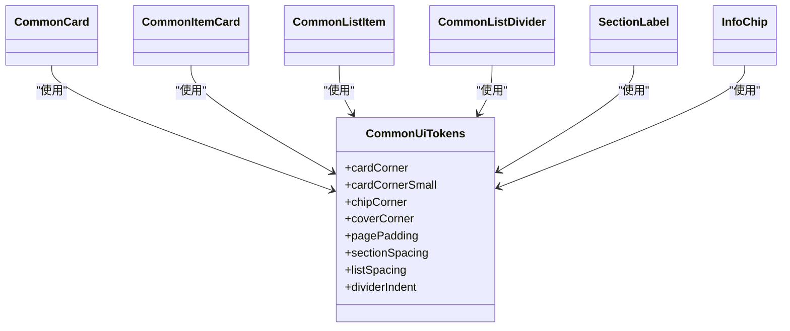
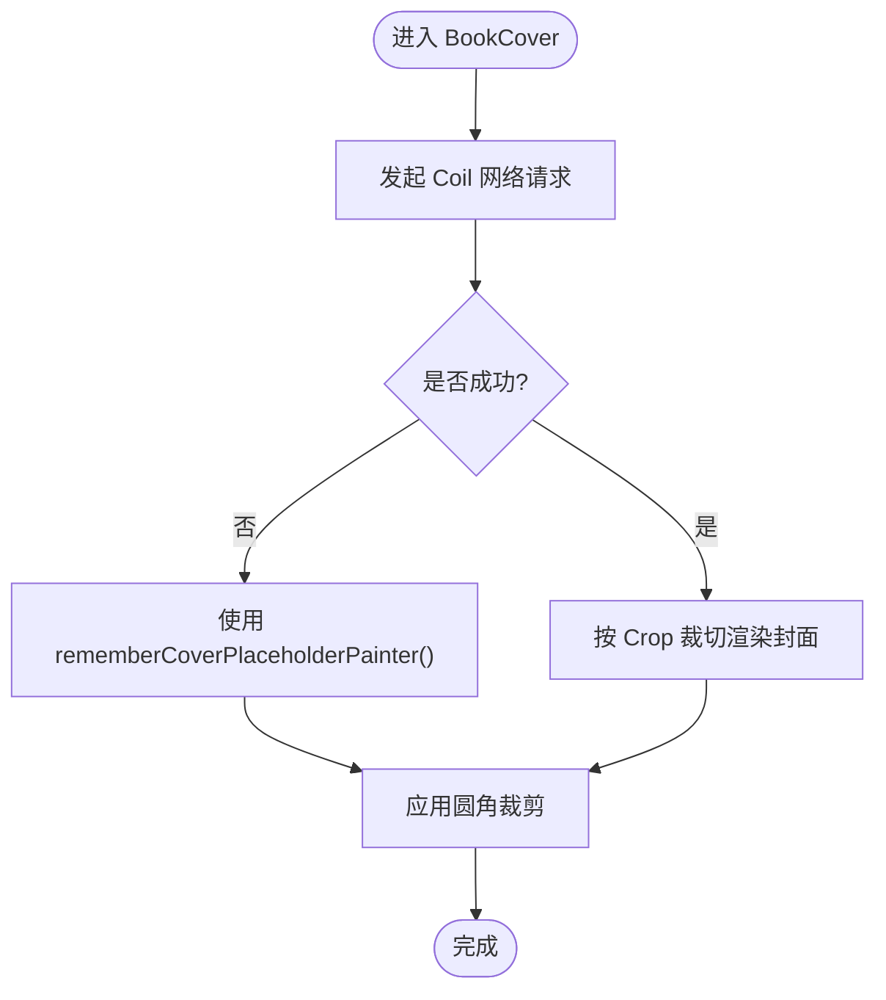
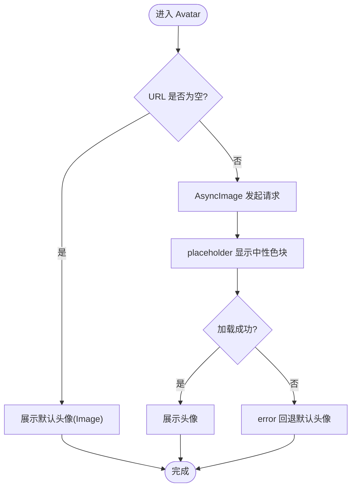
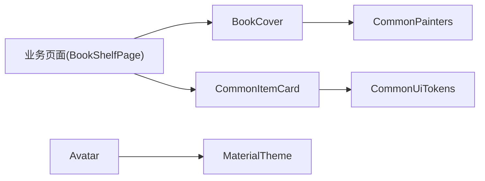

# 通用UI组件

<cite>
**本文引用的文件**
- [CommonUiComponents.kt](file://lib_book_common/src/main/java/com/ebook/common/ui/CommonUiComponents.kt)
- [BookCover.kt](file://lib_book_common/src/main/java/com/ebook/common/ui/BookCover.kt)
- [Avatar.kt](file://lib_book_common/src/main/java/com/ebook/common/ui/Avatar.kt)
- [CommonPainters.kt](file://lib_book_common/src/main/java/com/ebook/common/ui/CommonPainters.kt)
- [0006-shared-ui-components-in-lib-book-common.md](file://docs/adr/0006-shared-ui-components-in-lib-book-common.md)
- [BookShelfPage.kt](file://module_book/src/main/java/com/ebook/book/page/BookShelfPage.kt)
</cite>

## 目录
1. [引言](#引言)
2. [项目结构](#项目结构)
3. [核心组件](#核心组件)
4. [架构总览](#架构总览)
5. [详细组件分析](#详细组件分析)
6. [依赖关系分析](#依赖关系分析)
7. [性能与内存考量](#性能与内存考量)
8. [可访问性与主题集成](#可访问性与主题集成)
9. [使用与扩展指南](#使用与扩展指南)
10. [故障排查](#故障排查)
11. [结论](#结论)

## 引言
本文件系统化说明 lib_book_common 中“通用 UI 组件”的设计与实现，覆盖 CommonUiComponents、BookCover、Avatar、CommonPainters 的职责边界、资源管理、响应式适配、可访问性支持、状态与主题集成、动画与复用策略、性能优化与内存防护，并给出 Material Design 遵循要点与多语言考虑。文档同时提供图示与引用路径，便于快速定位源码。

## 项目结构
通用 UI 组件集中在 lib_book_common 模块的 com.ebook.common.ui 包中：
- CommonUiComponents.kt：共享设计常量与基础容器（卡片、列表项、分割线、分组标题、信息标签）
- BookCover.kt：书籍封面统一封装（Coil + 占位图 + 圆角裁剪）
- Avatar.kt：用户头像统一封装（网络图 + 三态兜底 + 圆形裁剪）
- CommonPainters.kt：默认封面占位 Painter 工厂

这些组件被业务模块（如 module_book、module_find、module_me）统一复用，保证全 App 视觉一致。

图表来源
- [CommonUiComponents.kt:33-77](file://lib_book_common/src/main/java/com/ebook/common/ui/CommonUiComponents.kt#L33-L77)
- [BookCover.kt:11-41](file://lib_book_common/src/main/java/com/ebook/common/ui/BookCover.kt#L11-L41)
- [Avatar.kt:15-62](file://lib_book_common/src/main/java/com/ebook/common/ui/Avatar.kt#L15-L62)
- [CommonPainters.kt:13-38](file://lib_book_common/src/main/java/com/ebook/common/ui/CommonPainters.kt#L13-L38)
- [BookShelfPage.kt:254-309](file://module_book/src/main/java/com/ebook/book/page/BookShelfPage.kt#L254-L309)

章节来源
- [0006-shared-ui-components-in-lib-book-common.md:1-27](file://docs/adr/0006-shared-ui-components-in-lib-book-common.md#L1-L27)

## 核心组件
- CommonUiTokens：统一设计常量（圆角、间距、分割线缩进等），作为唯一事实来源，避免各模块魔法值漂移。
- CommonCard / CommonItemCard：两级卡片体系（容器 16dp vs 条目 12dp），语义色 surfaceContainer，点击面随圆角裁剪，阴影高度可调。
- CommonListItem：菜单/设置项行，36dp 图标容器 + 标题 + 可选尾标 + 箭头；禁用态一次表达“看得见但点不动”。
- CommonListDivider / SectionLabel：轻量分割线与分组标题，配合列表层级。
- InfoChip：可配置的小标签/胶囊，统一展示型标签形态，支持点击与多行文本。
- BookCover：Coil 异步图片 + rememberCoverPlaceholderPainter() 占位 + Crop 裁切填充 + 圆角。
- Avatar：空 URL 直接默认图；加载中显示中性色块；失败回退默认图；圆形裁剪。
- CommonPainters.rememberCoverPlaceholderPainter：NinePatch 转 Bitmap 再包装为 BitmapPainter，取不到则回退到语义色块。

章节来源
- [CommonUiComponents.kt:47-308](file://lib_book_common/src/main/java/com/ebook/common/ui/CommonUiComponents.kt#L47-L308)
- [BookCover.kt:11-41](file://lib_book_common/src/main/java/com/ebook/common/ui/BookCover.kt#L11-L41)
- [Avatar.kt:15-62](file://lib_book_common/src/main/java/com/ebook/common/ui/Avatar.kt#L15-L62)
- [CommonPainters.kt:13-38](file://lib_book_common/src/main/java/com/ebook/common/ui/CommonPainters.kt#L13-L38)

## 架构总览
通用 UI 层职责清晰、耦合低：
- 视觉语言收敛：通过 CommonUiTokens 统一圆角与间距；MaterialTheme.colorScheme/typography 负责主题。
- 图片加载收敛：BookCover/Avatar 内部处理 Coil 生命周期与错误回退，调用方只关心数据与尺寸。
- 可访问性内建：按钮/图标/描述字段在组件内声明，确保 TalkBack 与辅助功能可用。
- 业务解耦：业务页仅组合这些组件，不重复实现卡片/头像/封面逻辑。

图表来源
- [BookCover.kt:26-41](file://lib_book_common/src/main/java/com/ebook/common/ui/BookCover.kt#L26-L41)
- [CommonPainters.kt:25-38](file://lib_book_common/src/main/java/com/ebook/common/ui/CommonPainters.kt#L25-L38)

## 详细组件分析

### CommonUiComponents：卡片与列表项
- 设计原则
  - 两级卡片层次：CommonCard(16dp) 包裹 CommonItemCard(12dp)，形成容器与条目的层级关系。
  - 语义色与排版：颜色取自 MaterialTheme.colorScheme，字体来自 MaterialTheme.typography，保证主题一致性。
  - 交互与可访问性：clickable/combinedClickable 挂载 Surface，ripple 受圆角裁剪；禁用态通过 enabled=false 传递语义（TalkBack 感知 disabled）。
  - 行为约束：图标仅限 material-icons-core，避免引入 iconsExtended 导致体积膨胀。
- 关键函数与职责
  - CommonCard：容器卡，surfaceContainer + 轻阴影。
  - CommonItemCard：条目卡，点击/长按、阴影、内边距、内容插槽。
  - CommonListItem：图标容器 + 标题 + 尾标/箭头；enabled=false 时整行置灰且不响应。
  - CommonListDivider：从文字起始处缩进的分割线。
  - SectionLabel：分组小标题。
  - InfoChip：可配形状、颜色、排版、内边距、行数，可点击。
- 复杂度与可扩展性
  - 参数化高，复用面广；新增变体优先通过参数（shape/contentPadding/textStyle）而非拆分组件。
- 错误处理
  - 禁用态语义由 Compose 基础设施提供；无额外异常分支。

图表来源
- [CommonUiComponents.kt:47-308](file://lib_book_common/src/main/java/com/ebook/common/ui/CommonUiComponents.kt#L47-L308)

章节来源
- [CommonUiComponents.kt:47-308](file://lib_book_common/src/main/java/com/ebook/common/ui/CommonUiComponents.kt#L47-L308)

### BookCover：封面加载机制
- 加载流程
  - 使用 Coil 的 AsyncImage，contentScale 固定为 Crop，避免非标准比例拉伸。
  - placeholder/error 均使用 rememberCoverPlaceholderPainter() 提供的占位/回退。
  - 外层 clip(shape) 应用圆角裁剪，默认圆角来自 CommonUiTokens.coverCorner。
- 资源管理
  - 占位图 NinePatch 通过 Context.getDrawable 解码为 Bitmap 再包装为 BitmapPainter；取不到则回退到语义色块。
  - 使用 remember 缓存 Painter，避免重复构造。
- 可访问性
  - 暴露 contentDescription 供无障碍服务读取。
- 性能
  - Crop 减少不必要的缩放计算；占位 Painter 全局记忆；失败快速回退。

图表来源
- [BookCover.kt:26-41](file://lib_book_common/src/main/java/com/ebook/common/ui/BookCover.kt#L26-L41)
- [CommonPainters.kt:25-38](file://lib_book_common/src/main/java/com/ebook/common/ui/CommonPainters.kt#L25-L38)

章节来源
- [BookCover.kt:11-41](file://lib_book_common/src/main/java/com/ebook/common/ui/BookCover.kt#L11-L41)
- [CommonPainters.kt:13-38](file://lib_book_common/src/main/java/com/ebook/common/ui/CommonPainters.kt#L13-L38)

### Avatar：头像显示逻辑
- 三态策略
  - 空 URL：直接展示默认头像（不走 Coil）。
  - 加载中：显示中性色块（避免先闪陌生剪影）。
  - 失败：回退到默认头像。
- 资源与可访问性
  - 默认头像在资源目录；圆形裁剪；contentDescription 由调用方传入或为空表示装饰。
- 主题与可配置
  - 加载中的背景色来自 MaterialTheme.colorScheme.surfaceVariant，跟随主题。
- 性能
  - 空 URL 分支避免无效网络请求；默认头像通过 painterResource 加载。

图表来源
- [Avatar.kt:36-62](file://lib_book_common/src/main/java/com/ebook/common/ui/Avatar.kt#L36-L62)

章节来源
- [Avatar.kt:15-62](file://lib_book_common/src/main/java/com/ebook/common/ui/Avatar.kt#L15-L62)

### CommonPainters：资源管理
- rememberCoverPlaceholderPainter
  - 将 NinePatch 资源解码为 Bitmap 后包装为 BitmapPainter，用于封面占位/错误回退。
  - 若资源不可用，回退到 MaterialTheme.colorScheme.surfaceVariant 的 ColorPainter。
  - 使用 remember 缓存 Painter，避免每次重组都重新解码。
- 注意事项
  - NinePatch 拉伸区域语义在转 Bitmap 后丢失，占位场景可接受。
  - 此处必须走 Context.getDrawable，因为 painterResource 不支持 NinePatch。

章节来源
- [CommonPainters.kt:13-38](file://lib_book_common/src/main/java/com/ebook/common/ui/CommonPainters.kt#L13-L38)

## 依赖关系分析
- 组件间依赖
  - BookCover 依赖 CommonPainters 的 rememberCoverPlaceholderPainter。
  - Avatar 依赖 MaterialTheme 语义色与默认头像资源。
  - CommonListItem/CommonItemCard 依赖 CommonUiTokens 与设计系统。
- 外部依赖
  - Coil 用于图片加载（Compose 集成）。
  - Material3 提供主题、颜色、排版、图标与交互。
- 业务侧接入
  - 业务页面通过组合上述组件实现界面，例如书架页使用 BookCover 与 CommonItemCard。

图表来源
- [BookShelfPage.kt:254-309](file://module_book/src/main/java/com/ebook/book/page/BookShelfPage.kt#L254-L309)
- [BookCover.kt:26-41](file://lib_book_common/src/main/java/com/ebook/common/ui/BookCover.kt#L26-L41)
- [CommonUiComponents.kt:47-308](file://lib_book_common/src/main/java/com/ebook/common/ui/CommonUiComponents.kt#L47-L308)
- [CommonPainters.kt:25-38](file://lib_book_common/src/main/java/com/ebook/common/ui/CommonPainters.kt#L25-L38)
- [Avatar.kt:36-62](file://lib_book_common/src/main/java/com/ebook/common/ui/Avatar.kt#L36-L62)

章节来源
- [BookShelfPage.kt:254-309](file://module_book/src/main/java/com/ebook/book/page/BookShelfPage.kt#L254-L309)

## 性能与内存考量
- 图片加载
  - Coil 内部已处理缓存与生命周期；BookCover/Avatar 通过 contentScale=Crop 减少不必要缩放。
  - rememberCoverPlaceholderPainter 使用 remember 缓存 Painter，避免重复解码与分配。
- 重组优化
  - 组件参数尽量稳定（如 shape、modifier），减少无谓重组。
  - 容器组件（Surface/Card）只在必要时施加阴影与点击面。
- 内存泄漏防护
  - 所有图片加载基于 Compose 组合生命周期，不会持有 Activity/Context 引用过长。
  - 默认头像与占位图通过资源加载，作用域受限。
- 主题与可访问性
  - 颜色、字号、对比度均来自 MaterialTheme，自动适配深浅色模式。
  - 按钮/图标/描述字段在组件内声明，TalkBack 友好。

章节来源
- [BookCover.kt:26-41](file://lib_book_common/src/main/java/com/ebook/common/ui/BookCover.kt#L26-L41)
- [CommonPainters.kt:25-38](file://lib_book_common/src/main/java/com/ebook/common/ui/CommonPainters.kt#L25-L38)
- [CommonUiComponents.kt:164-228](file://lib_book_common/src/main/java/com/ebook/common/ui/CommonUiComponents.kt#L164-L228)

## 可访问性与主题集成
- 可访问性
  - BookCover/Avatar 暴露 contentDescription；CommonListItem 的 Icon 使用 null 作为描述（纯装饰），点击面由 Row 的 clickable 承载语义。
  - 禁用态通过 enabled=false 传递语义，TalkBack 会识别“不可用”。
- 主题集成
  - 颜色全部来自 MaterialTheme.colorScheme（如 surfaceVariant、onSurfaceVariant、surfaceContainer）。
  - 字体来自 MaterialTheme.typography（bodyLarge、labelMedium、labelSmall）。
- 多语言支持
  - 文案不在组件内硬编码；业务侧通过 stringResource 传入（如封面描述、标签文案）。
  - 组件本身不包含本地化字符串，保持跨语言可用。

章节来源
- [CommonUiComponents.kt:164-228](file://lib_book_common/src/main/java/com/ebook/common/ui/CommonUiComponents.kt#L164-L228)
- [BookShelfPage.kt:305-309](file://module_book/src/main/java/com/ebook/book/page/BookShelfPage.kt#L305-L309)

## 使用与扩展指南
- 使用现有组件
  - 封面：在业务页面使用 BookCover，传入 url、尺寸修饰符与无障碍描述。
    - 参考路径：[BookShelfPage.kt:254-258](file://module_book/src/main/java/com/ebook/book/page/BookShelfPage.kt#L254-L258)、[BookShelfPage.kt:305-309](file://module_book/src/main/java/com/ebook/book/page/BookShelfPage.kt#L305-L309)
  - 头像：使用 Avatar，传入 url 与尺寸；空串即展示默认头像。
  - 列表项/卡片：使用 CommonItemCard/CommonListItem 构建条目；使用 CommonCard 包裹分组。
  - 标签：使用 InfoChip 渲染状态/分类/历史词条等。
- 扩展新组件
  - 新增跨模块复用的 UI 件应放入 com.ebook.common.ui，遵循 CommonUiTokens 与 Material 语义。
  - 若需自定义形状/颜色/排版，优先通过参数透传（如 InfoChip 的 shape/contentPadding/textStyle）。
  - 新增图片资源请放在 drawable-xxhdpi，并与组件同档，避免业务模块重复副本。
- 主题定制
  - 通过 MaterialTheme 配置 colorScheme/typography；组件无需硬编码颜色/字号。
  - 如需覆盖某组件默认样式，使用参数（如 InfoChip 的 containerColor/contentColor）。
- 动画效果
  - 组件未内置复杂动画；可在业务侧对容器或外层组合追加过渡（如点击涟漪由 clickable/Surface 提供）。
- 复用策略
  - 统一卡片层级、统一头像/封面封装、统一标签形态，消除各模块重复实现。
- 性能优化建议
  - 大图加载注意尺寸控制；避免在频繁重组处创建新对象。
  - 列表项 key 稳定且唯一（由业务侧保障），配合 LazyColumn/LazyRow 提升滚动性能。
- 内存泄漏防护
  - 避免在组件中持有长生命周期上下文引用；图片加载由 Coil 管理。
  - 默认图与占位图资源作用域有限，不会造成泄漏。

章节来源
- [BookShelfPage.kt:254-309](file://module_book/src/main/java/com/ebook/book/page/BookShelfPage.kt#L254-L309)
- [0006-shared-ui-components-in-lib-book-common.md:1-27](file://docs/adr/0006-shared-ui-components-in-lib-book-common.md#L1-L27)

## 故障排查
- 封面空白或无法显示
  - 检查 url 是否为空；确认网络可达；查看 error 回退是否生效。
  - 若 placeholder/error 仍异常，检查 rememberCoverPlaceholderPainter 是否能获取 NinePatch 资源。
- 头像显示异常
  - 空 URL 时应显示默认头像；加载中为中性色块；失败回退默认头像。
  - 若出现空白圆，检查 URL 非空但加载失败的分支是否正确回退。
- 主题不一致
  - 确认未硬编码颜色；使用 MaterialTheme.colorScheme；确保页面未重复包裹 MaterialTheme。
- 可访问性问题
  - 为图片/图标补充 contentDescription；禁用态通过 enabled=false 传递。
- 列表卡顿
  - 确保 item key 稳定且唯一；避免在重组中创建大量临时对象；合理使用 remember。

章节来源
- [BookCover.kt:26-41](file://lib_book_common/src/main/java/com/ebook/common/ui/BookCover.kt#L26-L41)
- [Avatar.kt:36-62](file://lib_book_common/src/main/java/com/ebook/common/ui/Avatar.kt#L36-L62)
- [CommonPainters.kt:25-38](file://lib_book_common/src/main/java/com/ebook/common/ui/CommonPainters.kt#L25-L38)
- [CommonUiComponents.kt:164-228](file://lib_book_common/src/main/java/com/ebook/common/ui/CommonUiComponents.kt#L164-L228)

## 结论
通用 UI 组件以“单一事实来源”的设计常量、统一的卡片/列表/标签形态、收敛的图片加载与可访问性支持，实现了跨模块一致的视觉与交互体验。BookCover 与 Avatar 将复杂的网络加载、错误回退与主题适配封装在组件内部，业务侧只需关注数据与尺寸。通过 Material3 主题与语义化参数，组件具备良好的可定制性与可维护性。遵循本文的使用与扩展指南，可在保证性能与内存安全的前提下，高效复用与扩展 UI 能力。