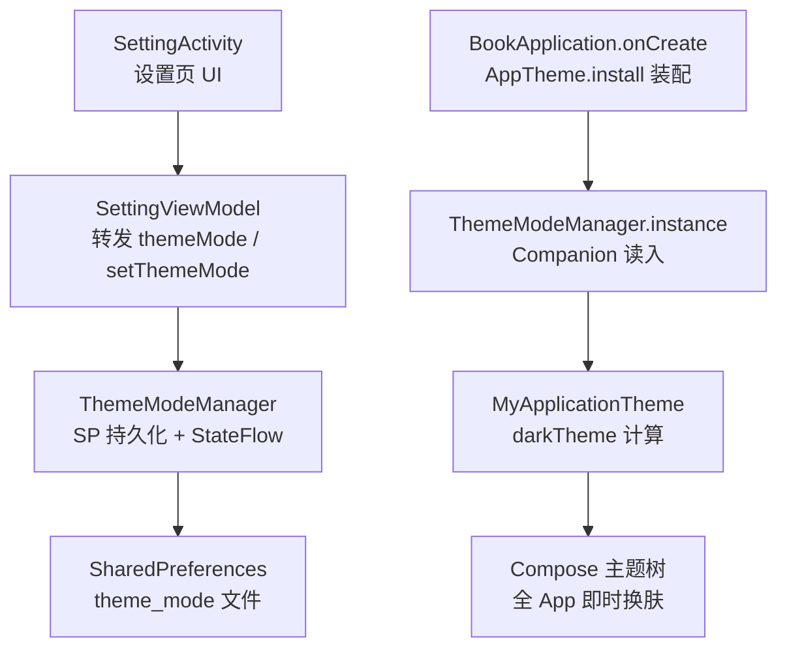
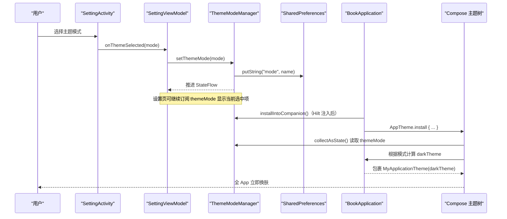
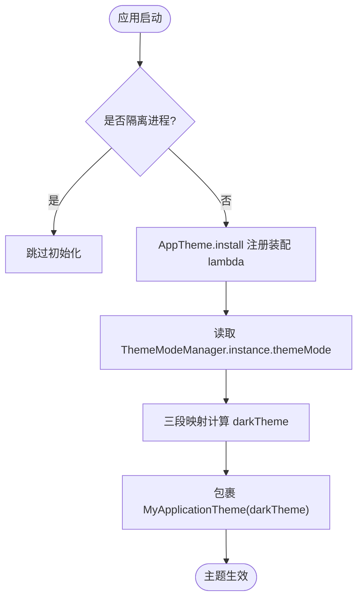
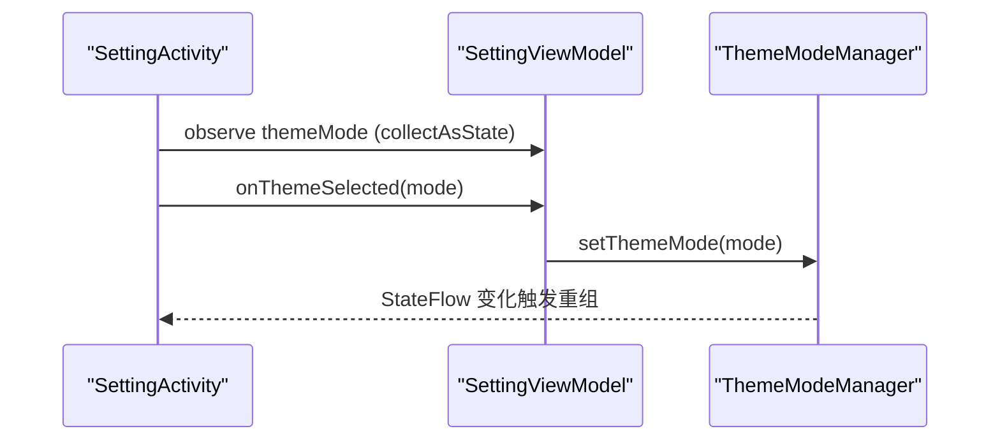
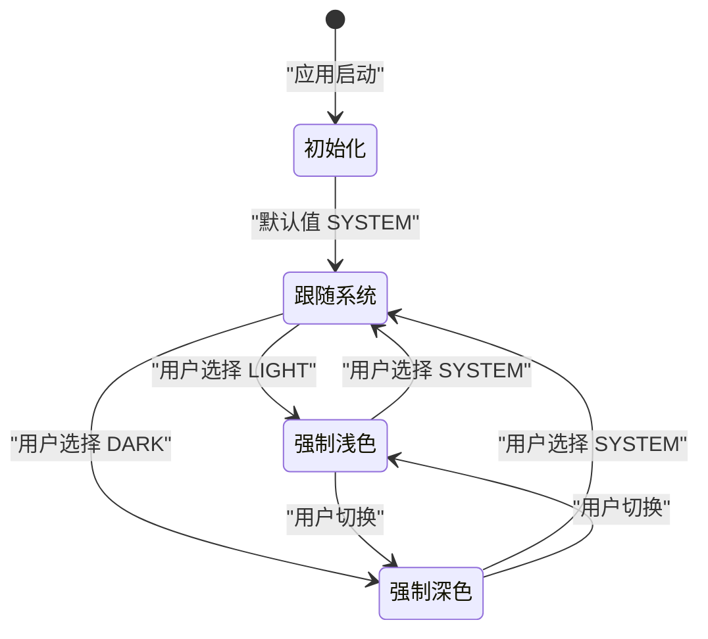
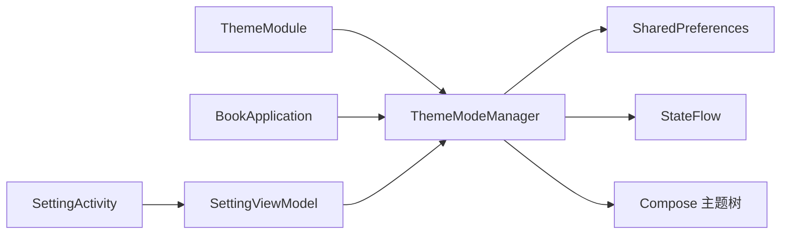

# 主题模式管理

<cite>
**本文引用的文件**
- [ThemeModeManager.kt](file://lib_book_common/src/main/java/com/ebook/common/domain/ThemeModeManager.kt)
- [ThemeModule.kt](file://lib_book_common/src/main/java/com/ebook/common/di/ThemeModule.kt)
- [BookApplication.kt](file://lib_book_common/src/main/java/com/ebook/common/BookApplication.kt)
- [SettingActivity.kt](file://module_me/src/main/java/com/ebook/me/view/SettingActivity.kt)
- [SettingViewModel.kt](file://module_me/src/main/java/com/ebook/me/mvvm/viewmodel/SettingViewModel.kt)
- [0031-theme-mode-three-state-companion-singleton.md](file://docs/adr/0031-theme-mode-three-state-companion-singleton.md)
</cite>

## 目录
1. [简介](#简介)
2. [项目结构](#项目结构)
3. [核心组件](#核心组件)
4. [架构总览](#架构总览)
5. [详细组件分析](#详细组件分析)
6. [依赖关系分析](#依赖关系分析)
7. [性能与线程安全](#性能与线程安全)
8. [故障排查指南](#故障排查指南)
9. [结论](#结论)
10. [附录：扩展与最佳实践](#附录：扩展与最佳实践)

## 简介
本文件聚焦“主题模式管理”的完整设计与实现，围绕 ThemeMode 三态（强制浅色、强制深色、跟随系统）的业务含义与使用场景，系统性说明 ThemeModeManager 的持久化策略、响应式更新、Companion 挂接模式，以及与 Compose 主题系统的装配点集成；同时覆盖应用启动恢复、用户设置变更到界面实时换肤的完整生命周期。最后给出扩展新主题模式、自定义持久化策略、异步切换处理以及与 BookApplication/Hilt 单例关系的实践要点。

## 项目结构
主题模式相关代码横跨共享库与业务模块：
- 领域模型与管理器：ThemeMode 枚举与 ThemeModeManager 位于 lib_book_common，提供持久化、StateFlow 暴露与 Companion 挂接。
- Hilt 注入：ThemeModule 负责将 ThemeModeManager 以 @Singleton 提供。
- 应用装配：BookApplication 在 onCreate 中通过 AppTheme.install 注册主题装配 lambda，并在 Hilt 注入完成后把管理器实例挂到 Companion 供 Compose 重组读取。
- 设置入口：module_me 的 SettingActivity/SettingViewModel 负责展示当前模式并提供 setThemeMode 写入入口。



图示来源
- [ThemeModeManager.kt:10-92](file://lib_book_common/src/main/java/com/ebook/common/domain/ThemeModeManager.kt#L10-L92)
- [BookApplication.kt:17-49](file://lib_book_common/src/main/java/com/ebook/common/BookApplication.kt#L17-L49)
- [SettingActivity.kt:132-134](file://module_me/src/main/java/com/ebook/me/view/SettingActivity.kt#L132-L134)
- [SettingViewModel.kt:163-172](file://module_me/src/main/java/com/ebook/me/mvvm/viewmodel/SettingViewModel.kt#L163-L172)

章节来源
- [ThemeModeManager.kt:10-92](file://lib_book_common/src/main/java/com/ebook/common/domain/ThemeModeManager.kt#L10-L92)
- [ThemeModule.kt:10-26](file://lib_book_common/src/main/java/com/ebook/common/di/ThemeModule.kt#L10-L26)
- [BookApplication.kt:17-49](file://lib_book_common/src/main/java/com/ebook/common/BookApplication.kt#L17-L49)
- [SettingActivity.kt:132-134](file://module_me/src/main/java/com/ebook/me/view/SettingActivity.kt#L132-L134)
- [SettingViewModel.kt:163-172](file://module_me/src/main/java/com/ebook/me/mvvm/viewmodel/SettingViewModel.kt#L163-L172)

## 核心组件
- ThemeMode 枚举：定义 LIGHT（强制浅色）、DARK（强制深色）、SYSTEM（跟随系统），默认语义为 SYSTEM，与 Compose isSystemInDarkTheme() 一致。
- ThemeModeManager：
  - 持久化：使用 SharedPreferences（文件 theme_mode，键 mode），保存时写枚举名，读取时做异常兜底并回退至 SYSTEM。
  - 状态流：内部 MutableStateFlow 持有当前值，对外暴露不可变 StateFlow。
  - 写入：setThemeMode(mode) 同步落盘并推进状态流，触发 Compose 重组换肤。
  - 挂接：installIntoCompanion() 将自身放入 Companion.instance，供 AppTheme 装配 lambda 在 Compose 作用域外读取。
- ThemeModule：Hilt 模块，@Provides 提供 ThemeModeManager 并以 @Singleton 绑定到 SingletonComponent。
- BookApplication：
  - 进程门：隔离进程跳过初始化，避免无意义的 SP 访问。
  - 装配点：AppTheme.install 内收集 ThemeModeManager.themeMode，按三段映射决定 darkTheme 并包裹 MyApplicationTheme。
  - 注入后挂接：通过 EntryPointAccessors 取出 ThemeModeManager 并调用 installIntoCompanion。
- 设置页：
  - SettingActivity/SettingViewModel 提供 themeMode 观察与 setThemeMode 写入，UI 层根据是否跟随系统进行开关与子菜单渲染。

章节来源
- [ThemeModeManager.kt:10-92](file://lib_book_common/src/main/java/com/ebook/common/domain/ThemeModeManager.kt#L10-L92)
- [ThemeModule.kt:10-26](file://lib_book_common/src/main/java/com/ebook/common/di/ThemeModule.kt#L10-L26)
- [BookApplication.kt:17-49](file://lib_book_common/src/main/java/com/ebook/common/BookApplication.kt#L17-L49)
- [SettingActivity.kt:132-134](file://module_me/src/main/java/com/ebook/me/view/SettingActivity.kt#L132-L134)
- [SettingViewModel.kt:163-172](file://module_me/src/main/java/com/ebook/me/mvvm/viewmodel/SettingViewModel.kt#L163-L172)

## 架构总览
主题模式管理的整体数据流与控制流如下：



图示来源
- [ThemeModeManager.kt:44-77](file://lib_book_common/src/main/java/com/ebook/common/domain/ThemeModeManager.kt#L44-L77)
- [BookApplication.kt:32-48](file://lib_book_common/src/main/java/com/ebook/common/BookApplication.kt#L32-L48)
- [SettingActivity.kt:132-134](file://module_me/src/main/java/com/ebook/me/view/SettingActivity.kt#L132-L134)
- [SettingViewModel.kt:163-172](file://module_me/src/main/java/com/ebook/me/mvvm/viewmodel/SettingViewModel.kt#L163-L172)

## 详细组件分析

### ThemeMode 三态设计
- LIGHT：强制浅色。适用于系统为深色但用户希望保持浅色的场景。
- DARK：强制深色。适用于系统为浅色但用户希望强制深色的场景。
- SYSTEM：跟随系统。默认值，与 isSystemInDarkTheme() 语义一致，老用户升级不改变观感。

三态是互斥的全局单值，任何页面不得维护本地镜像，统一由 ThemeModeManager 作为事实源。

章节来源
- [ThemeModeManager.kt:10-26](file://lib_book_common/src/main/java/com/ebook/common/domain/ThemeModeManager.kt#L10-L26)
- [0031-theme-mode-three-state-companion-singleton.md:5-14](file://docs/adr/0031-theme-mode-three-state-companion-singleton.md#L5-L14)

### ThemeModeManager 实现机制
- 持久化策略：
  - 使用 SharedPreferences，文件名 theme_mode，键 mode，存储枚举名称。
  - 读取时使用 runCatching 解析枚举，非法值回退至 SYSTEM，确保冷启动稳定。
- 响应式更新：
  - 内部 MutableStateFlow 承载当前模式，外部暴露不可变 StateFlow。
  - setThemeMode 同步落盘后立即推进状态流，触发 Compose 重组。
- Companion 挂接模式：
  - 通过 installIntoCompanion 将实例置入 Companion.instance，供 AppTheme 装配 lambda 在 Composable 作用域外读取。
  - instance 为 @Volatile 可空引用，未就绪时调用方按 SYSTEM 兜底。

```mermaid
classDiagram
    class ThemeMode {
        <<enum>>
        LIGHT
        DARK
        SYSTEM
    }

    class ThemeModeManager {
        -application : Application
        -sp : SharedPreferences
        -_themeMode : MutableStateFlow<ThemeMode>
        +themeMode : StateFlow<ThemeMode>
        +setThemeMode(mode) void
        -loadMode() ThemeMode
        +installIntoCompanion() void
        companion object {
            -PREFS_NAME : String
            -KEY_MODE : String
            +instance : ThemeModeManager?
        }
    }

    ThemeModeManager --> ThemeMode : "读写"
```

图示来源
- [ThemeModeManager.kt:10-92](file://lib_book_common/src/main/java/com/ebook/common/domain/ThemeModeManager.kt#L10-L92)

章节来源
- [ThemeModeManager.kt:44-92](file://lib_book_common/src/main/java/com/ebook/common/domain/ThemeModeManager.kt#L44-L92)

### BookApplication 与 Compose 主题装配
- 进程门：在沙箱/隔离进程提前返回，避免无意义的 SP 访问。
- 装配点：AppTheme.install 内从 ThemeModeManager.instance 取 themeMode，collectAsState 订阅变化，三段映射计算 darkTheme，包裹 MyApplicationTheme。
- 注入后挂接：通过 EntryPointAccessors 取出 Hilt 提供的 ThemeModeManager，并调用 installIntoCompanion。



图示来源
- [BookApplication.kt:17-49](file://lib_book_common/src/main/java/com/ebook/common/BookApplication.kt#L17-L49)

章节来源
- [BookApplication.kt:17-49](file://lib_book_common/src/main/java/com/ebook/common/BookApplication.kt#L17-L49)

### 设置页与 ViewModel 集成
- SettingActivity：通过 viewModel.themeMode 观察当前模式，并根据是否跟随系统显示开关与子菜单；onThemeSelected 回调到 VM。
- SettingViewModel：直接转发 ThemeModeManager.themeMode 暴露给 UI，并提供 setThemeMode 写入入口。



图示来源
- [SettingActivity.kt:132-134](file://module_me/src/main/java/com/ebook/me/view/SettingActivity.kt#L132-L134)
- [SettingViewModel.kt:163-172](file://module_me/src/main/java/com/ebook/me/mvvm/viewmodel/SettingViewModel.kt#L163-L172)

章节来源
- [SettingActivity.kt:132-134](file://module_me/src/main/java/com/ebook/me/view/SettingActivity.kt#L132-L134)
- [SettingViewModel.kt:163-172](file://module_me/src/main/java/com/ebook/me/mvvm/viewmodel/SettingViewModel.kt#L163-L172)

### 主题模式生命周期
- 默认值初始化：首次启动或无 SP 记录时，loadMode 回退至 SYSTEM，保证与 isSystemInDarkTheme() 默认一致。
- 用户设置变更：设置页调用 setThemeMode，SP 写入并推进 StateFlow，Compose 重组立即换肤。
- 应用启动恢复：BookApplication 装配 lambda 收集 StateFlow，三段映射计算 darkTheme，确保全 App 主题与应用偏好一致。



章节来源
- [ThemeModeManager.kt:65-69](file://lib_book_common/src/main/java/com/ebook/common/domain/ThemeModeManager.kt#L65-L69)
- [BookApplication.kt:32-42](file://lib_book_common/src/main/java/com/ebook/common/BookApplication.kt#L32-L42)
- [SettingViewModel.kt:163-172](file://module_me/src/main/java/com/ebook/me/mvvm/viewmodel/SettingViewModel.kt#L163-L172)

## 依赖关系分析
- Hilt 单例：ThemeModule 提供 @Singleton 的 ThemeModeManager，BookApplication 通过 EntryPointAccessors 获取并挂到 Companion。
- 耦合与内聚：
  - ThemeModeManager 高内聚：封装 SP 读写、StateFlow、Companion 挂接。
  - 低耦合：设置页仅通过 VM 调用 setThemeMode，UI 只观察 themeMode。
  - 装配点解耦：BookApplication 仅在安装阶段一次性挂接，后续由 Compose 自动重组。
- 外部依赖：
  - SharedPreferences 用于持久化。
  - Compose 的 collectAsState 用于重组驱动。
  - Hilt EntryPoint 用于在 Application 中取单例。



图示来源
- [ThemeModule.kt:10-26](file://lib_book_common/src/main/java/com/ebook/common/di/ThemeModule.kt#L10-L26)
- [BookApplication.kt:44-48](file://lib_book_common/src/main/java/com/ebook/common/BookApplication.kt#L44-L48)
- [ThemeModeManager.kt:44-92](file://lib_book_common/src/main/java/com/ebook/common/domain/ThemeModeManager.kt#L44-L92)

章节来源
- [ThemeModule.kt:10-26](file://lib_book_common/src/main/java/com/ebook/common/di/ThemeModule.kt#L10-L26)
- [BookApplication.kt:44-48](file://lib_book_common/src/main/java/com/ebook/common/BookApplication.kt#L44-L48)
- [ThemeModeManager.kt:44-92](file://lib_book_common/src/main/java/com/ebook/common/domain/ThemeModeManager.kt#L44-L92)

## 性能与线程安全
- 性能特性：
  - SP 写入轻量且同步，不会阻塞主线程明显开销。
  - StateFlow 推送为高效事件流，Compose collectAsState 会按需重组受影响节点。
- 线程安全：
  - ThemeModeManager.instance 使用 @Volatile 保证跨线程可见性。
  - StateFlow 本身线程安全，支持多订阅者并发读取。
  - loadMode 使用 runCatching 容错，避免坏值导致崩溃。
- 不可变性：
  - 对外暴露 StateFlow 而非可变字段，防止外部直接修改。
  - 写入入口唯一：setThemeMode，避免多源不一致。

章节来源
- [ThemeModeManager.kt:51-77](file://lib_book_common/src/main/java/com/ebook/common/domain/ThemeModeManager.kt#L51-L77)
- [ThemeModeManager.kt:83-89](file://lib_book_common/src/main/java/com/ebook/common/domain/ThemeModeManager.kt#L83-L89)

## 故障排查指南
- 症状：设置主题后界面未刷新
  - 检查是否在 BookApplication 中调用了 installIntoCompanion。
  - 确认 SettingViewModel.setThemeMode 被正确调用。
  - 验证 AppTheme.install 中的 collectAsState 订阅了 themeMode。
- 症状：首次启动主题异常
  - 检查 SP 中是否存在非法枚举名，loadMode 应回退至 SYSTEM。
  - 确认未误用 isSystemInDarkTheme() 替代管理器取值。
- 症状：隔离进程崩溃或日志异常
  - 确认 BookApplication 在隔离进程已提前返回，避免访问 SP。

章节来源
- [BookApplication.kt:25-28](file://lib_book_common/src/main/java/com/ebook/common/BookApplication.kt#L25-L28)
- [ThemeModeManager.kt:65-69](file://lib_book_common/src/main/java/com/ebook/common/domain/ThemeModeManager.kt#L65-L69)
- [BookApplication.kt:32-48](file://lib_book_common/src/main/java/com/ebook/common/BookApplication.kt#L32-L48)

## 结论
主题模式管理以 ThemeMode 三态为核心，通过 ThemeModeManager 提供统一的持久化与响应式状态，配合 BookApplication 的 AppTheme 装配点在 Compose 层实现即时换肤。该设计具备清晰的职责边界、稳定的默认行为、良好的容错性与可扩展性，适合在多模块应用中作为全局主题控制中枢。

## 附录：扩展与最佳实践
- 扩展新的主题模式
  - 在 ThemeMode 枚举中添加新值（例如 AUTO_HIGH_CONTRAST）。
  - 在 BookApplication 的三段映射中增加对应分支，计算新的 darkTheme 或其他主题参数。
  - 在设置页 UI 中增加选项与文案，并在 SettingViewModel 中无需改动即可生效。
- 自定义持久化策略
  - 替换 ThemeModeManager 的 SP 读写逻辑，改为 DataStore 或 Room，注意：
    - 冷启动需保证同步或快速加载，避免首帧闪烁。
    - 对非法值进行兜底回退。
  - 保持 setThemeMode 的同步推进 StateFlow 的行为不变。
- 处理主题切换的异步更新
  - 若引入异步持久化，应在收到成功回调后推进 StateFlow，失败时保持原值并上报错误。
  - 确保 Compose 侧 collectAsState 能观察到最新值并重组。
- 与 BookApplication 的依赖注入关系
  - 通过 Hilt Module 提供 ThemeModeManager 单例。
  - 在 BookApplication.onCreate 中使用 EntryPointAccessors 获取实例并调用 installIntoCompanion。
- 不可变设计与线程安全
  - 对外暴露 StateFlow，禁止外部直接修改内部状态。
  - Companion.instance 使用 @Volatile，确保跨线程可见性。
  - 所有读取路径对异常进行兜底，避免崩溃。

章节来源
- [ThemeModeManager.kt:10-92](file://lib_book_common/src/main/java/com/ebook/common/domain/ThemeModeManager.kt#L10-L92)
- [BookApplication.kt:32-48](file://lib_book_common/src/main/java/com/ebook/common/BookApplication.kt#L32-L48)
- [SettingViewModel.kt:163-172](file://module_me/src/main/java/com/ebook/me/mvvm/viewmodel/SettingViewModel.kt#L163-L172)
- [0031-theme-mode-three-state-companion-singleton.md:5-27](file://docs/adr/0031-theme-mode-three-state-companion-singleton.md#L5-L27)