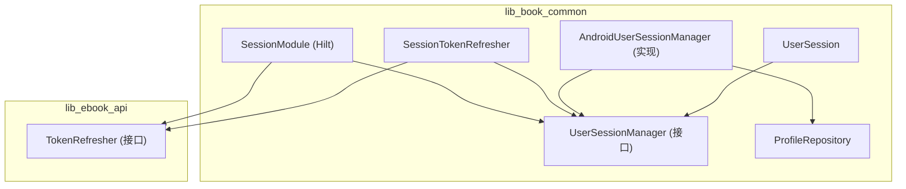
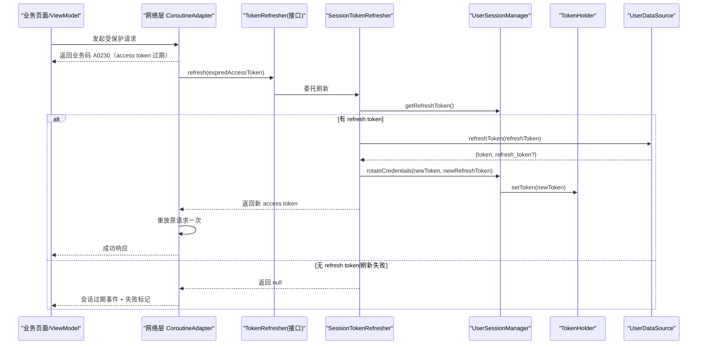
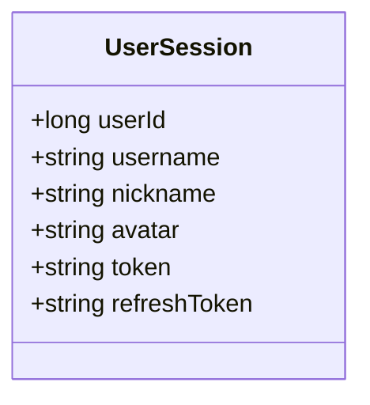
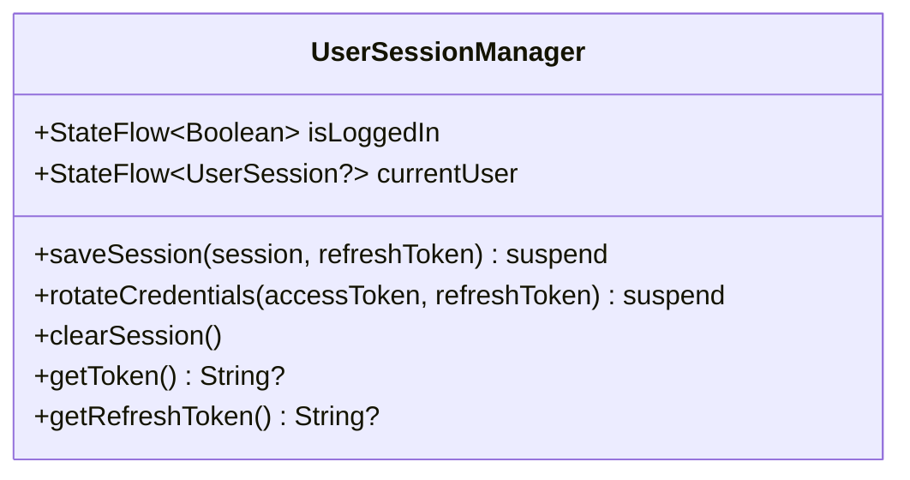
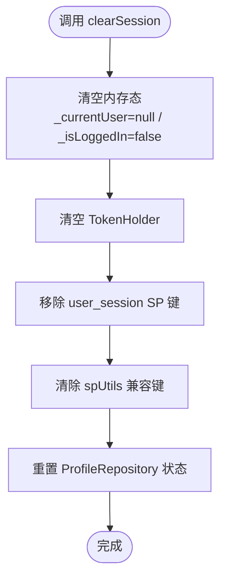
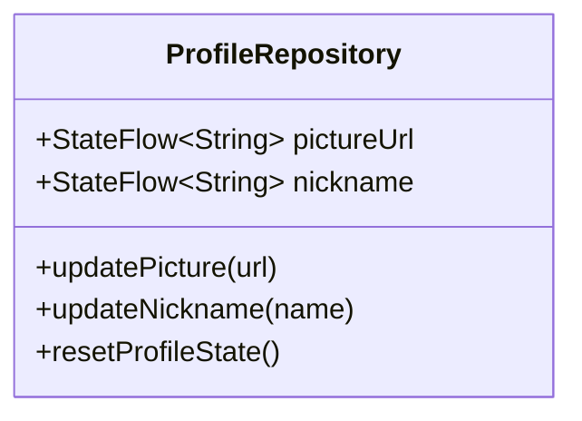
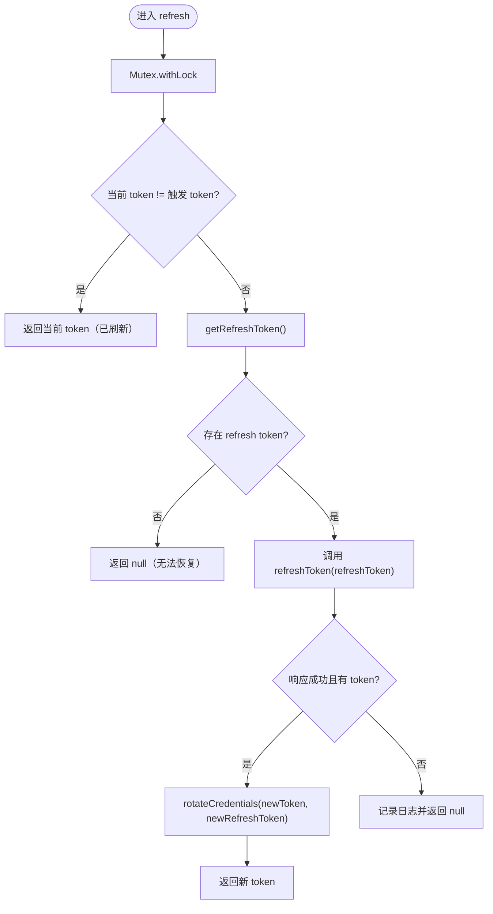
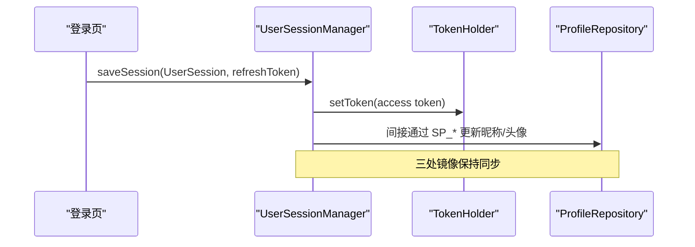

# 用户会话管理

<cite>
**本文引用的文件**
- [UserSession.kt](file://lib_book_common/src/main/java/com/ebook/common/domain/UserSession.kt)
- [UserSessionManager.kt](file://lib_book_common/src/main/java/com/ebook/common/domain/UserSessionManager.kt)
- [AndroidUserSessionManager.kt](file://lib_book_common/src/main/java/com/ebook/common/domain/AndroidUserSessionManager.kt)
- [ProfileRepository.kt](file://lib_book_common/src/main/java/com/ebook/common/repository/ProfileRepository.kt)
- [SessionTokenRefresher.kt](file://lib_book_common/src/main/java/com/ebook/common/domain/SessionTokenRefresher.kt)
- [TokenRefresher.kt](file://lib_ebook_api/src/main/java/com/ebook/api/auth/TokenRefresher.kt)
- [SessionModule.kt](file://lib_book_common/src/main/java/com/ebook/common/di/SessionModule.kt)
- [0011-token-identity-decoupling-token-only-refresh.md](file://docs/adr/0011-token-identity-decoupling-token-only-refresh.md)
- [0010-silent-refresh-seam-and-session-expiry-bus.md](file://docs/adr/0010-silent-refresh-seam-and-session-expiry-bus.md)
</cite>

## 目录
1. [引言](#引言)
2. [项目结构](#项目结构)
3. [核心组件](#核心组件)
4. [架构总览](#架构总览)
5. [详细组件分析](#详细组件分析)
6. [依赖关系分析](#依赖关系分析)
7. [性能考量](#性能考量)
8. [故障排查指南](#故障排查指南)
9. [结论](#结论)
10. [附录：扩展与示例](#附录扩展与示例)

## 引言
本文件聚焦“用户会话管理”领域，围绕 UserSession 数据模型、双 Token 机制、UserSessionManager 接口契约、会话生命周期（登录建立、静默刷新续期、退出清理），以及与网络层拦截器和 ProfileRepository 的三处镜像同步进行系统性说明。同时强调邮箱作为登录主标识的设计决策与密码不落盘的安全考虑。

## 项目结构
与用户会话管理相关的代码分布在以下模块与包：
- lib_book_common：领域模型与实现（UserSession、UserSessionManager、AndroidUserSessionManager）、仓库镜像（ProfileRepository）、刷新实现（SessionTokenRefresher）、Hilt 装配（SessionModule）
- lib_ebook_api：刷新器接口定义（TokenRefresher）
- docs/adr：认证相关决策记录（凭证与身份解耦、静默刷新与会话过期事件收口）



**图示来源**
- [UserSession.kt:6-17](file://lib_book_common/src/main/java/com/ebook/common/domain/UserSession.kt#L6-L17)
- [UserSessionManager.kt:13-62](file://lib_book_common/src/main/java/com/ebook/common/domain/UserSessionManager.kt#LL13-L62)
- [AndroidUserSessionManager.kt:28-162](file://lib_book_common/src/main/java/com/ebook/common/domain/AndroidUserSessionManager.kt#L28-L162)
- [ProfileRepository.kt:19-54](file://lib_book_common/src/main/java/com/ebook/common/repository/ProfileRepository.kt#L19-L54)
- [SessionTokenRefresher.kt:41-96](file://lib_book_common/src/main/java/com/ebook/common/domain/SessionTokenRefresher.kt#L41-L96)
- [TokenRefresher.kt:16-27](file://lib_ebook_api/src/main/java/com/ebook/api/auth/TokenRefresher.kt#L16-L27)
- [SessionModule.kt:22-37](file://lib_book_common/src/main/java/com/ebook/common/di/SessionModule.kt#L22-L37)

**章节来源**
- [UserSession.kt:6-17](file://lib_book_common/src/main/java/com/ebook/common/domain/UserSession.kt#L6-L17)
- [UserSessionManager.kt:13-62](file://lib_book_common/src/main/java/com/ebook/common/domain/UserSessionManager.kt#L13-L62)
- [AndroidUserSessionManager.kt:28-162](file://lib_book_common/src/main/java/com/ebook/common/domain/AndroidUserSessionManager.kt#L28-L162)
- [ProfileRepository.kt:19-54](file://lib_book_common/src/main/java/com/ebook/common/repository/ProfileRepository.kt#L19-L54)
- [SessionTokenRefresher.kt:41-96](file://lib_book_common/src/main/java/com/ebook/common/domain/SessionTokenRefresher.kt#L41-L96)
- [TokenRefresher.kt:16-27](file://lib_ebook_api/src/main/java/com/ebook/api/auth/TokenRefresher.kt#L16-L27)
- [SessionModule.kt:22-37](file://lib_book_common/src/main/java/com/ebook/common/di/SessionModule.kt#L22-L37)

## 核心组件
- UserSession：跨模块 seam 的用户会话信息，包含 userId、username、nickname、avatar、token、refreshToken。refreshToken 仅在登录瞬时填充用于持久化；会话恢复或静默刷新后不再维护该字段。
- UserSessionManager：纯 Kotlin 接口，提供 isLoggedIn/currentUser 状态流，以及 saveSession、rotateCredentials、clearSession、getToken、getRefreshToken 等方法。
- AndroidUserSessionManager：Android 平台实现，负责内存 StateFlow、SharedPreferences 持久化、TokenHolder 同步、兼容 SP_* 键、ProfileRepository 三处镜像清理。
- SessionTokenRefresher：基于 Mutex 的单飞刷新实现，调用 UserDataSource.refreshToken，成功后通过 rotateCredentials 仅更新凭证，不触碰身份。
- TokenRefresher：位于 lib_ebook_api 的刷新器接口，由上层注入具体实现。
- ProfileRepository：进程内昵称/头像 StateFlow，冷启动从 SP 读取，清会话时由 AndroidUserSessionManager 统一复位。
- SessionModule：Hilt 绑定 UserSessionManager 与 TokenRefresher 的实现。

**章节来源**
- [UserSession.kt:6-17](file://lib_book_common/src/main/java/com/ebook/common/domain/UserSession.kt#L6-L17)
- [UserSessionManager.kt:13-62](file://lib_book_common/src/main/java/com/ebook/common/domain/UserSessionManager.kt#L13-L62)
- [AndroidUserSessionManager.kt:28-162](file://lib_book_common/src/main/java/com/ebook/common/domain/AndroidUserSessionManager.kt#L28-L162)
- [SessionTokenRefresher.kt:41-96](file://lib_book_common/src/main/java/com/ebook/common/domain/SessionTokenRefresher.kt#L41-L96)
- [TokenRefresher.kt:16-27](file://lib_ebook_api/src/main/java/com/ebook/api/auth/TokenRefresher.kt#L16-L27)
- [ProfileRepository.kt:19-54](file://lib_book_common/src/main/java/com/ebook/common/repository/ProfileRepository.kt#L19-L54)
- [SessionModule.kt:22-37](file://lib_book_common/src/main/java/com/ebook/common/di/SessionModule.kt#L22-L37)

## 架构总览
下图展示登录建立会话、请求触发 A0230 后的静默刷新、轮换凭证并重放请求的整体流程。



**图示来源**
- [SessionTokenRefresher.kt:50-91](file://lib_book_common/src/main/java/com/ebook/common/domain/SessionTokenRefresher.kt#L50-L91)
- [TokenRefresher.kt:16-27](file://lib_ebook_api/src/main/java/com/ebook/api/auth/TokenRefresher.kt#L16-L27)
- [AndroidUserSessionManager.kt:87-98](file://lib_book_common/src/main/java/com/ebook/common/domain/AndroidUserSessionManager.kt#L87-L98)

## 详细组件分析

### UserSession 数据模型
- 字段与作用
  - userId：用户唯一标识（Long）
  - username：用户名（仅展示用，可重复）
  - nickname：昵称
  - avatar：头像 URL
  - token：当前访问令牌（access token，仅驻内存，通过 TokenHolder 管理）
  - refreshToken：刷新凭证（refresh token），登录结果映射时填充供 saveSession 持久化；会话恢复/静默刷新后不再维护该字段，读取统一走 UserSessionManager.getRefreshToken
- 约束与安全
  - 密码不落盘：历史明文密码在启动时清除，禁止再写入任何密码字段
  - 身份与凭证解耦：refresh 端点只换凭证，不回填 user；避免轮换误抹身份



**图示来源**
- [UserSession.kt:6-17](file://lib_book_common/src/main/java/com/ebook/common/domain/UserSession.kt#L6-L17)

**章节来源**
- [UserSession.kt:6-17](file://lib_book_common/src/main/java/com/ebook/common/domain/UserSession.kt#L6-L17)
- [0011-token-identity-decoupling-token-only-refresh.md:13-19](file://docs/adr/0011-token-identity-decoupling-token-only-refresh.md#L13-L19)

### UserSessionManager 接口与职责边界
- 职责
  - 暴露登录态 currentUser/isLoggedIn 的 StateFlow
  - 保存会话（登录/注册）：saveSession(session, refreshToken)
  - 轮换凭证（静默刷新专用）：rotateCredentials(accessToken, refreshToken)
  - 清理会话：clearSession()
  - 获取运行时 token：getToken()（从 TokenHolder 取）
  - 获取持久化 refresh token：getRefreshToken()
- 调用时机约定
  - 登录/注册成功后：调用 saveSession 写入身份 + 双 token（access 进内存，refresh 落盘）
  - 静默刷新成功后：调用 rotateCredentials 仅更新凭证，不触碰身份
  - 退出登录：调用 clearSession 一次性清理三处镜像
  - 网络层需要 token 时：通过 getToken() 获取当前内存 token
  - 刷新器需要 refresh token 时：通过 getRefreshToken() 获取



**图示来源**
- [UserSessionManager.kt:13-62](file://lib_book_common/src/main/java/com/ebook/common/domain/UserSessionManager.kt#L13-L62)

**章节来源**
- [UserSessionManager.kt:13-62](file://lib_book_common/src/main/java/com/ebook/common/domain/UserSessionManager.kt#L13-L62)

### AndroidUserSessionManager 实现要点
- 内存与持久化
  - StateFlow 维护 _isLoggedIn/_currentUser
  - SharedPreferences 存储 is_logged_in、refresh_token、user_id、username、nickname、avatar
  - 启动恢复：将持久化的 token 写入 TokenHolder（注意：access token 不落盘，冷启动为空，首请求经 A0230 静默轮换）
- 三处镜像清理
  - ① 本类内存态与 user_session SP
  - ② spUtils 兼容键（LoginInterceptor 使用）
  - ③ ProfileRepository 的昵称/头像 StateFlow（必须显式 resetProfileState）
- 关键方法
  - saveSession：设置内存态、写 SP、写兼容 SP_*、同步 TokenHolder
  - rotateCredentials：仅更新内存 token 与 refresh token，不碰身份字段
  - clearSession：一次性清理上述三处镜像



**图示来源**
- [AndroidUserSessionManager.kt:111-133](file://lib_book_common/src/main/java/com/ebook/common/domain/AndroidUserSessionManager.kt#L111-L133)

**章节来源**
- [AndroidUserSessionManager.kt:35-52](file://lib_book_common/src/main/java/com/ebook/common/domain/AndroidUserSessionManager.kt#L35-L52)
- [AndroidUserSessionManager.kt:61-98](file://lib_book_common/src/main/java/com/ebook/common/domain/AndroidUserSessionManager.kt#L61-L98)
- [AndroidUserSessionManager.kt:111-133](file://lib_book_common/src/main/java/com/ebook/common/domain/AndroidUserSessionManager.kt#L111-L133)

### ProfileRepository 镜像同步
- 作用：提供昵称/头像的进程内 StateFlow，冷启动从 SP 读取
- 与会话管理的协作：清会话时由 AndroidUserSessionManager 调用 resetProfileState 复位内存态，确保“我的”页不会残留上一身份



**图示来源**
- [ProfileRepository.kt:19-54](file://lib_book_common/src/main/java/com/ebook/common/repository/ProfileRepository.kt#L19-L54)

**章节来源**
- [ProfileRepository.kt:19-54](file://lib_book_common/src/main/java/com/ebook/common/repository/ProfileRepository.kt#L19-L54)
- [AndroidUserSessionManager.kt:111-133](file://lib_book_common/src/main/java/com/ebook/common/domain/AndroidUserSessionManager.kt#L111-L133)

### 双 Token 机制与静默刷新
- 设计原则
  - access token：短命、仅驻内存（TokenHolder），不落盘
  - refresh token：持久化，用于静默刷新
  - 刷新端点契约：只返回新凭证（token、可选 refresh_token），不返回 user
- 刷新流程
  - 单飞互斥：Mutex 串行化，避免并发多次刷新导致旧 refresh 失效引发失败
  - 复用判定：锁内比较 TokenHolder 当前 token 与触发过期的 token，若不同则直接复用
  - 轮换策略：成功后调用 rotateCredentials 仅更新凭证，不重建会话
  - 重放：成功刷新后重放原请求一次，再次 A0230 透传失败
- 异常处理
  - 取消异常上抛，不视为刷新失败
  - 其他异常记录日志并返回 null，触发会话过期事件



**图示来源**
- [SessionTokenRefresher.kt:50-91](file://lib_book_common/src/main/java/com/ebook/common/domain/SessionTokenRefresher.kt#L50-L91)

**章节来源**
- [SessionTokenRefresher.kt:50-91](file://lib_book_common/src/main/java/com/ebook/common/domain/SessionTokenRefresher.kt#L50-L91)
- [0010-silent-refresh-seam-and-session-expiry-bus.md:11-19](file://docs/adr/0010-silent-refresh-seam-and-session-expiry-bus.md#L11-L19)
- [0011-token-identity-decoupling-token-only-refresh.md:13-19](file://docs/adr/0011-token-identity-decoupling-token-only-refresh.md#L13-L19)

### 与网络层拦截器的集成
- 触发点：网络层检测业务码 A0230（access token 过期）后调用 TokenRefresher.refresh
- 刷新旁路：刷新调用直调 UserDataSource.refreshToken，不走 CoroutineAdapter，避免死循环
- 重放策略：刷新成功后重放一次原请求；若仍失败则透传
- 事件收口：刷新失败发会话过期事件（统一处置：清会话 + 提示 + 跳转登录），调用方一律通过共享 reportFailure 上报失败

**章节来源**
- [TokenRefresher.kt:16-27](file://lib_ebook_api/src/main/java/com/ebook/api/auth/TokenRefresher.kt#L16-L27)
- [SessionTokenRefresher.kt:50-91](file://lib_book_common/src/main/java/com/ebook/common/domain/SessionTokenRefresher.kt#L50-L91)
- [0010-silent-refresh-seam-and-session-expiry-bus.md:11-19](file://docs/adr/0010-silent-refresh-seam-and-session-expiry-bus.md#L11-L19)

### 会话生命周期管理
- 登录建立会话：调用 saveSession，写入身份 + 双 token（access 进内存，refresh 落盘），同步 TokenHolder
- 静默刷新续期：A0230 触发 → 单飞刷新 → rotateCredentials 仅更新凭证 → 重放请求
- 退出清理：clearSession 一次性清理三处镜像（内存、SP、ProfileRepository）



**图示来源**
- [AndroidUserSessionManager.kt:61-85](file://lib_book_common/src/main/java/com/ebook/common/domain/AndroidUserSessionManager.kt#L61-L85)
- [ProfileRepository.kt:23-38](file://lib_book_common/src/main/java/com/ebook/common/repository/ProfileRepository.kt#L23-L38)

**章节来源**
- [AndroidUserSessionManager.kt:61-85](file://lib_book_common/src/main/java/com/ebook/common/domain/AndroidUserSessionManager.kt#L61-L85)
- [ProfileRepository.kt:23-38](file://lib_book_common/src/main/java/com/ebook/common/repository/ProfileRepository.kt#L23-L38)

## 依赖关系分析
- 依赖方向
  - lib_book_common 依赖 lib_ebook_api（TokenRefresher 接口、UserDataSource）
  - lib_ebook_api 仅定义接口，不反向依赖上层
- Hilt 装配
  - SessionModule 将 UserSessionManager 绑定到 AndroidUserSessionManager
  - SessionModule 将 TokenRefresher 绑定到 SessionTokenRefresher

```mermaid
graph LR
    LBC["lib_book_common"] --> LEA["lib_ebook_api"]
    SM["SessionModule"] -->|@Binds| USMI["UserSessionManager -> AndroidUserSessionManager"]
    SM -->|@Binds| TRI["TokenRefresher -> SessionTokenRefresher"]
```

**图示来源**
- [SessionModule.kt:22-37](file://lib_book_common/src/main/java/com/ebook/common/di/SessionModule.kt#L22-L37)

**章节来源**
- [SessionModule.kt:22-37](file://lib_book_common/src/main/java/com/ebook/common/di/SessionModule.kt#L22-L37)

## 性能考量
- 静默刷新采用 Mutex 串行化，避免并发刷新风暴与旧 refresh 被硬删导致的失败
- access token 不落盘，减少 I/O 与攻击面；冷启动首个请求触发静默刷新为可接受代价
- 刷新旁路直调 DataSource，避免额外包装带来的开销与死循环风险
- 重放仅一次，防止刷新风暴

[本节为通用性能讨论，不直接分析具体文件]

## 故障排查指南
- 症状：登录后“我的”页仍显示上一个身份的昵称/头像
  - 原因：未调用 clearSession 统一清理三处镜像，或遗漏 ProfileRepository 复位
  - 解决：统一调用 AndroidUserSessionManager.clearSession
- 症状：频繁刷新或刷新失败
  - 原因：并发刷新导致旧 refresh 被服务端删除；刷新自身经过带鉴权客户端形成死循环
  - 解决：确保使用 SessionTokenRefresher 的单飞互斥；刷新调用直调 UserDataSource
- 症状：冷启动无法拉取受保护数据
  - 原因：access token 为空，需等待首个请求触发 A0230 静默刷新
  - 解决：确认网络层正确检测 A0230 并调用 TokenRefresher

**章节来源**
- [AndroidUserSessionManager.kt:111-133](file://lib_book_common/src/main/java/com/ebook/common/domain/AndroidUserSessionManager.kt#L111-L133)
- [SessionTokenRefresher.kt:50-91](file://lib_book_common/src/main/java/com/ebook/common/domain/SessionTokenRefresher.kt#L50-L91)

## 结论
本方案通过 UserSession 模型与 UserSessionManager 接口明确会话语义，以双 Token 机制与单飞刷新实现高可用的静默续期；通过三处镜像同步保证 UI 一致性；以 ADR 为依据将凭证与身份解耦、access token 不落盘，降低安全风险与耦合度。整体设计清晰、可扩展、便于维护。

[本节为总结性内容，不直接分析具体文件]

## 附录：扩展与示例
- 自定义会话状态
  - 可在 UserSession 中新增字段，并在 AndroidUserSessionManager.saveSession/loadSessionFromSp 中同步读写 SP
  - 示例路径参考：
    - [UserSession.kt:6-17](file://lib_book_common/src/main/java/com/ebook/common/domain/UserSession.kt#L6-L17)
    - [AndroidUserSessionManager.kt:61-85](file://lib_book_common/src/main/java/com/ebook/common/domain/AndroidUserSessionManager.kt#L61-L85)
- 处理会话过期场景
  - 网络层检测到 A0230 → 调用 TokenRefresher.refresh → 成功重放；失败发会话过期事件统一处置
  - 示例路径参考：
    - [SessionTokenRefresher.kt:50-91](file://lib_book_common/src/main/java/com/ebook/common/domain/SessionTokenRefresher.kt#L50-L91)
    - [0010-silent-refresh-seam-and-session-expiry-bus.md:11-19](file://docs/adr/0010-silent-refresh-seam-and-session-expiry-bus.md#L11-L19)
- 扩展新的会话属性
  - 在 UserSession 添加字段 → 在 saveSession 中持久化 → 在 loadSessionFromSp 中恢复 → 在 clearSession 中清理
  - 示例路径参考：
    - [AndroidUserSessionManager.kt:61-85](file://lib_book_common/src/main/java/com/ebook/common/domain/AndroidUserSessionManager.kt#L61-L85)
    - [AndroidUserSessionManager.kt:135-146](file://lib_book_common/src/main/java/com/ebook/common/domain/AndroidUserSessionManager.kt#L135-L146)
    - [AndroidUserSessionManager.kt:111-133](file://lib_book_common/src/main/java/com/ebook/common/domain/AndroidUserSessionManager.kt#L111-L133)

**章节来源**
- [UserSession.kt:6-17](file://lib_book_common/src/main/java/com/ebook/common/domain/UserSession.kt#L6-L17)
- [AndroidUserSessionManager.kt:61-85](file://lib_book_common/src/main/java/com/ebook/common/domain/AndroidUserSessionManager.kt#L61-L85)
- [AndroidUserSessionManager.kt:111-146](file://lib_book_common/src/main/java/com/ebook/common/domain/AndroidUserSessionManager.kt#L111-L146)
- [SessionTokenRefresher.kt:50-91](file://lib_book_common/src/main/java/com/ebook/common/domain/SessionTokenRefresher.kt#L50-L91)
- [0010-silent-refresh-seam-and-session-expiry-bus.md:11-19](file://docs/adr/0010-silent-refresh-seam-and-session-expiry-bus.md#L11-L19)