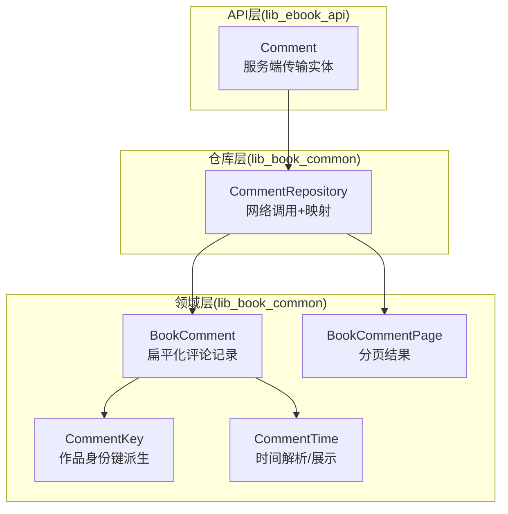
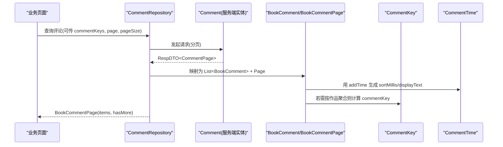
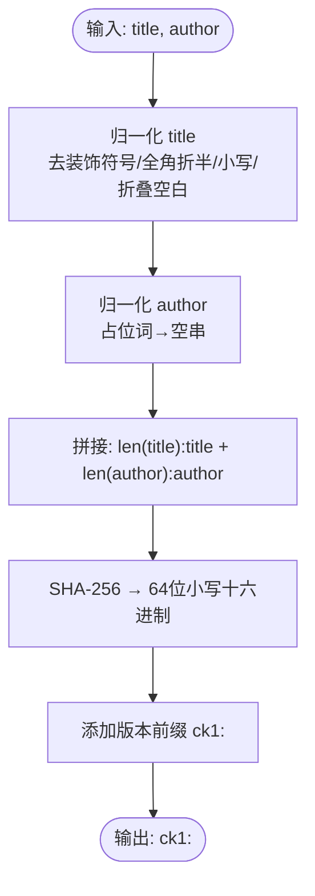
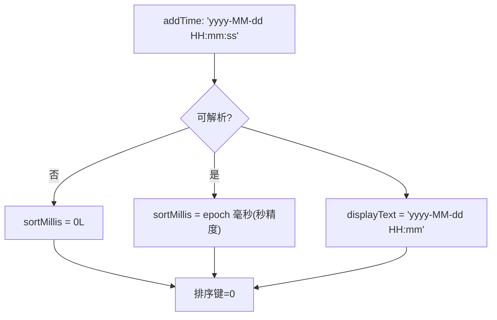
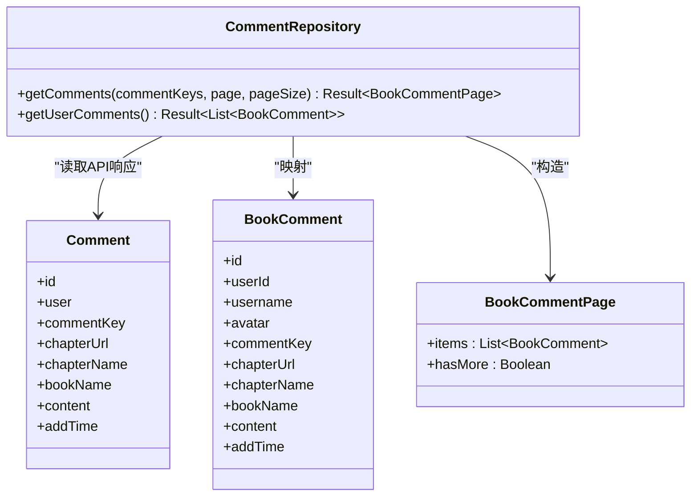
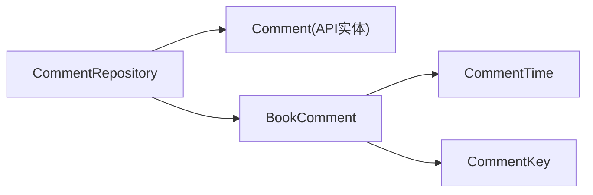

# 评论数据模型

<cite>
**本文引用的文件**
- [lib_book_common/src/main/java/com/ebook/common/domain/BookComment.kt](file://lib_book_common/src/main/java/com/ebook/common/domain/BookComment.kt)
- [lib_book_common/src/main/java/com/ebook/common/domain/CommentKey.kt](file://lib_book_common/src/main/java/com/ebook/common/domain/CommentKey.kt)
- [lib_book_common/src/main/java/com/ebook/common/domain/CommentTime.kt](file://lib_book_common/src/main/java/com/ebook/common/domain/CommentTime.kt)
- [lib_book_common/src/test/java/com/ebook/common/domain/CommentKeyTest.kt](file://lib_book_common/src/test/java/com/ebook/common/domain/CommentKeyTest.kt)
- [lib_book_common/src/test/java/com/ebook/common/domain/CommentTimeTest.kt](file://lib_book_common/src/test/java/com/ebook/common/domain/CommentTimeTest.kt)
- [lib_ebook_api/src/main/java/com/ebook/api/entity/Comment.kt](file://lib_ebook_api/src/main/java/com/ebook/api/entity/Comment.kt)
- [lib_book_common/src/main/java/com/ebook/common/domain/BookCommentPage.kt](file://lib_book_common/src/main/java/com/ebook/common/domain/BookCommentPage.kt)
- [lib_book_common/src/main/java/com/ebook/common/repository/CommentRepository.kt](file://lib_book_common/src/main/java/com/ebook/common/repository/CommentRepository.kt)
</cite>

## 目录
1. [引言](#引言)
2. [项目结构中的位置](#项目结构中的位置)
3. [核心组件](#核心组件)
4. [架构总览](#架构总览)
5. [详细组件分析](#详细组件分析)
6. [依赖关系分析](#依赖关系分析)
7. [性能与可用性考虑](#性能与可用性考虑)
8. [故障排查指南](#故障排查指南)
9. [结论](#结论)

## 引言
本文件围绕“评论数据模型”展开，重点解释 BookComment 扁平化领域模型的设计理念、字段语义与作用；深入说明 CommentKey 的派生算法（SHA-256、作者占位词归一、书名装饰符号处理、版本前缀 ck1）；阐述 CommentTime 的时间处理机制（排序键生成、展示格式化、时区策略）；并解释客户端领域模型与 API 实体的解耦原则，以及为何采用扁平化而非嵌套对象。文档还包含如何计算作品身份键、如何处理时间字符串解析、如何扩展新字段的实践指引，并强调完整性约束、空值处理策略、与后端服务的数据契约，以及客户端派生不透明 token 的设计优势。

## 项目结构中的位置
- 领域模型与工具位于 lib_book_common：BookComment、CommentKey、CommentTime、BookCommentPage。
- API 传输实体位于 lib_ebook_api：Comment（服务端载荷对齐蛇形命名）。
- 仓库层在 lib_book_common 的 CommentRepository，负责把 API 响应映射为领域模型与分页结果。

**图示来源**
- [lib_book_common/src/main/java/com/ebook/common/domain/BookComment.kt:7-18](file://lib_book_common/src/main/java/com/ebook/common/domain/BookComment.kt#L7-L18)
- [lib_book_common/src/main/java/com/ebook/common/domain/CommentKey.kt:20-84](file://lib_book_common/src/main/java/com/ebook/common/domain/CommentKey.kt#L20-L84)
- [lib_book_common/src/main/java/com/ebook/common/domain/CommentTime.kt:20-29](file://lib_book_common/src/main/java/com/ebook/common/domain/CommentTime.kt#L20-L29)
- [lib_book_common/src/main/java/com/ebook/common/domain/BookCommentPage.kt:14-17](file://lib_book_common/src/main/java/com/ebook/common/domain/BookCommentPage.kt#L14-L17)
- [lib_ebook_api/src/main/java/com/ebook/api/entity/Comment.kt:21-39](file://lib_ebook_api/src/main/java/com/ebook/api/entity/Comment.kt#L21-L39)
- [lib_book_common/src/main/java/com/ebook/common/repository/CommentRepository.kt:17-113](file://lib_book_common/src/main/java/com/ebook/common/repository/CommentRepository.kt#L17-L113)

**章节来源**
- [lib_book_common/src/main/java/com/ebook/common/domain/BookComment.kt:7-18](file://lib_book_common/src/main/java/com/ebook/common/domain/BookComment.kt#L7-L18)
- [lib_ebook_api/src/main/java/com/ebook/api/entity/Comment.kt:21-39](file://lib_ebook_api/src/main/java/com/ebook/api/entity/Comment.kt#L21-L39)
- [lib_book_common/src/main/java/com/ebook/common/repository/CommentRepository.kt:17-113](file://lib_book_common/src/main/java/com/ebook/common/repository/CommentRepository.kt#L17-L113)

## 核心组件
- BookComment：领域层扁平化评论记录，承载 id、userId、username、avatar、commentKey、chapterUrl、chapterName、bookName、content、addTime 等字段。
- CommentKey：客户端派生的作品身份键，基于 SHA-256 哈希，带版本前缀 ck1，确保跨用户一致且不可逆。
- CommentTime：统一的时间处理口径，提供 sortMillis（秒级 epoch 毫秒）与 displayText（到分钟的展示串），不做时区换算。
- BookCommentPage：领域层分页结果，仅保留 items 与 hasMore，屏蔽 total 等传输细节。

**章节来源**
- [lib_book_common/src/main/java/com/ebook/common/domain/BookComment.kt:7-18](file://lib_book_common/src/main/java/com/ebook/common/domain/BookComment.kt#L7-L18)
- [lib_book_common/src/main/java/com/ebook/common/domain/CommentKey.kt:20-84](file://lib_book_common/src/main/java/com/ebook/common/domain/CommentKey.kt#L20-L84)
- [lib_book_common/src/main/java/com/ebook/common/domain/CommentTime.kt:20-29](file://lib_book_common/src/main/java/com/ebook/common/domain/CommentTime.kt#L20-L29)
- [lib_book_common/src/main/java/com/ebook/common/domain/BookCommentPage.kt:14-17](file://lib_book_common/src/main/java/com/ebook/common/domain/BookCommentPage.kt#L14-L17)

## 架构总览
评论数据流从 API 层进入仓库层，再映射到领域模型，供业务层使用。领域模型与 API 实体解耦：API 实体保持与服务端契约一致（蛇形字段、嵌套 User），领域模型则采用扁平化、无冗余嵌套的结构，便于排序、合并、展示与本地存储。

**图示来源**
- [lib_book_common/src/main/java/com/ebook/common/repository/CommentRepository.kt:58-91](file://lib_book_common/src/main/java/com/ebook/common/repository/CommentRepository.kt#L58-L91)
- [lib_ebook_api/src/main/java/com/ebook/api/entity/Comment.kt:21-39](file://lib_ebook_api/src/main/java/com/ebook/api/entity/Comment.kt#L21-L39)
- [lib_book_common/src/main/java/com/ebook/common/domain/BookComment.kt:7-18](file://lib_book_common/src/main/java/com/ebook/common/domain/BookComment.kt#L7-L18)
- [lib_book_common/src/main/java/com/ebook/common/domain/CommentTime.kt:20-29](file://lib_book_common/src/main/java/com/ebook/common/domain/CommentTime.kt#L20-L29)
- [lib_book_common/src/main/java/com/ebook/common/domain/CommentKey.kt:41-49](file://lib_book_common/src/main/java/com/ebook/common/domain/CommentKey.kt#L41-L49)

## 详细组件分析

### BookComment 扁平化数据结构
- 设计目标：将 API 响应中的嵌套 User 与冗余字段拍平，形成可直接用于列表渲染、排序、合并的领域对象。
- 字段语义与作用：
  - id：评论唯一标识，用于删除等操作。
  - userId：评论者标识，结合 username/avatar 用于显示与判断是否本人评论。
  - username：显示用户名（非主登录标识）。
  - avatar：头像地址。
  - commentKey：作品/章节级聚合键（如 ck1:... 或 ck1:...#章序号），用于跨源合并与去重。
  - chapterUrl：章节定位（历史兼容字段，已废弃但保留）。
  - chapterName：当前章节名。
  - bookName：书籍名快照，便于列表快速展示。
  - content：评论内容。
  - addTime：服务端返回的墙钟时间字符串（Asia/Shanghai，yyyy-MM-dd HH:mm:ss），由 CommentTime 统一解析。
- 空值策略：chapterUrl/chapterName/bookName/content/commentKey 可为空，UI 侧做缺省处理；id/userId/addTime 作为核心字段应尽可能存在。

**章节来源**
- [lib_book_common/src/main/java/com/ebook/common/domain/BookComment.kt:7-18](file://lib_book_common/src/main/java/com/ebook/common/domain/BookComment.kt#L7-L18)
- [lib_ebook_api/src/main/java/com/ebook/api/entity/Comment.kt:21-39](file://lib_ebook_api/src/main/java/com/ebook/api/entity/Comment.kt#L21-L39)

### CommentKey 派生算法
- 设计动机：后端不存储书籍明细（避免合规风险），但评论需要一致的桶键以跨用户/跨源聚合。客户端通过确定性函数派生不透明 token，所有客户端无需协调即可得到相同键值。
- 算法要点：
  - 输入：标题(title)、作者(author)。
  - 归一化：移除书名装饰符号（《》「」『』〈〉），全角转半角，小写，折叠空白为单个空格。
  - 作者占位词归一：佚名/侠名/未知/不详/未署名/作者未知/n/a/na/none/unknown/author 等视为“无作者”，不参与哈希。
  - 边界防碰撞：采用长度前缀分隔 title 与 author，避免 AB+C 与 A+BC 撞键。
  - 哈希：对拼接后的文本进行 SHA-256，输出 64 位小写十六进制。
  - 版本前缀：ck1 表示算法版本；未来归一规则变更需升级前缀，以保证不同版本客户端互不可见。
- 复杂度：O(n) 线性处理字符，哈希为固定开销；空间占用极小。
- 稳定性：同一书/作者组合在不同客户端、不同设备得到相同 key；不可逆，服务端无法反推书名。

**图示来源**
- [lib_book_common/src/main/java/com/ebook/common/domain/CommentKey.kt:41-49](file://lib_book_common/src/main/java/com/ebook/common/domain/CommentKey.kt#L41-L49)
- [lib_book_common/src/main/java/com/ebook/common/domain/CommentKey.kt:57-84](file://lib_book_common/src/main/java/com/ebook/common/domain/CommentKey.kt#L57-L84)

**章节来源**
- [lib_book_common/src/main/java/com/ebook/common/domain/CommentKey.kt:20-84](file://lib_book_common/src/main/java/com/ebook/common/domain/CommentKey.kt#L20-L84)
- [lib_book_common/src/test/java/com/ebook/common/domain/CommentKeyTest.kt:18-70](file://lib_book_common/src/test/java/com/ebook/common/domain/CommentKeyTest.kt#L18-L70)

### CommentTime 时间处理机制
- 契约：服务端返回 Asia/Shanghai 的 yyyy-MM-dd HH:mm:ss 字符串。
- 排序键：sortMillis 精确到秒（epoch 毫秒），保证同一分钟内的两条评论能区分先后，避免稳定排序导致的顺序抖动。
- 展示串：displayText 裁到分钟（yyyy-MM-dd HH:mm），隐藏秒；不做时区换算，原样保留服务端墙钟文本，避免把 16:04 显示成 08:04。
- 容错：不可解析时，display 为空串，sortMillis 返回 0L，使该条排在末尾且不抛异常。

**图示来源**
- [lib_book_common/src/main/java/com/ebook/common/domain/CommentTime.kt:20-29](file://lib_book_common/src/main/java/com/ebook/common/domain/CommentTime.kt#L20-L29)

**章节来源**
- [lib_book_common/src/main/java/com/ebook/common/domain/CommentTime.kt:20-29](file://lib_book_common/src/main/java/com/ebook/common/domain/CommentTime.kt#L20-L29)
- [lib_book_common/src/test/java/com/ebook/common/domain/CommentTimeTest.kt:20-44](file://lib_book_common/src/test/java/com/ebook/common/domain/CommentTimeTest.kt#L20-L44)

### 与 API 实体的解耦与分页封装
- 解耦原则：API 实体 Comment 严格对齐服务端契约（蛇形字段、嵌套 User），领域模型 BookComment 扁平化、去除冗余嵌套，便于排序与展示；两者通过仓库层映射转换。
- 分页封装：BookCommentPage 仅暴露 items 与 hasMore，hasMore 由“返回条数达到请求 pageSize 即认为可能还有下一页”判定，不信任 total，增强鲁棒性。
- 仓库层职责：CommentRepository 负责调用网络、错误收口、映射到领域页型，并对空键列表的特殊分支进行处理（空键直接返回空页，避免命中“全局最新”分支）。

**图示来源**
- [lib_ebook_api/src/main/java/com/ebook/api/entity/Comment.kt:21-39](file://lib_ebook_api/src/main/java/com/ebook/api/entity/Comment.kt#L21-L39)
- [lib_book_common/src/main/java/com/ebook/common/domain/BookComment.kt:7-18](file://lib_book_common/src/main/java/com/ebook/common/domain/BookComment.kt#L7-L18)
- [lib_book_common/src/main/java/com/ebook/common/domain/BookCommentPage.kt:14-17](file://lib_book_common/src/main/java/com/ebook/common/domain/BookCommentPage.kt#L14-L17)
- [lib_book_common/src/main/java/com/ebook/common/repository/CommentRepository.kt:58-91](file://lib_book_common/src/main/java/com/ebook/common/repository/CommentRepository.kt#L58-L91)

**章节来源**
- [lib_book_common/src/main/java/com/ebook/common/repository/CommentRepository.kt:58-113](file://lib_book_common/src/main/java/com/ebook/common/repository/CommentRepository.kt#L58-L113)
- [lib_book_common/src/main/java/com/ebook/common/domain/BookCommentPage.kt:14-17](file://lib_book_common/src/main/java/com/ebook/common/domain/BookCommentPage.kt#L14-L17)

### 实践示例与扩展指引
- 计算作品身份键：调用 CommentKey.compute(title, author)，传入显示书名与作者；若作者为空或占位词，将被视为“无作者”。
- 处理时间字符串：使用 CommentTime.sortMillis(addTime) 获取排序键，使用 CommentTime.displayText(addTime) 获取展示串；不可解析时分别得到 0L 与空串。
- 扩展新字段：
  - 在 BookComment 中新增字段，并在仓库层映射处同步填充（例如从 Comment 对应字段映射而来）。
  - 如需参与聚合或排序，评估是否纳入 CommentKey 或 CommentTime 的处理逻辑；注意不要破坏现有不变量（如 ck1 版本前缀、时间展示格式）。
  - 为新字段补充单元测试，覆盖空值、边界与兼容性场景。

[以上步骤以现有实现为依据，具体映射点请参考仓库层的 toBookComment/toApiComment 相关代码]

**章节来源**
- [lib_book_common/src/main/java/com/ebook/common/domain/CommentKey.kt:41-49](file://lib_book_common/src/main/java/com/ebook/common/domain/CommentKey.kt#L41-L49)
- [lib_book_common/src/main/java/com/ebook/common/domain/CommentTime.kt:20-29](file://lib_book_common/src/main/java/com/ebook/common/domain/CommentTime.kt#L20-L29)
- [lib_book_common/src/main/java/com/ebook/common/domain/BookComment.kt:7-18](file://lib_book_common/src/main/java/com/ebook/common/domain/BookComment.kt#L7-L18)

## 依赖关系分析
- 领域层依赖：BookComment 依赖 CommentTime（时间解析）、CommentKey（聚合键）。
- 仓库层依赖：CommentRepository 依赖 API 层 Comment（网络响应）并映射为领域模型。
- 测试保障：CommentKeyTest 与 CommentTimeTest 锁住关键不变量（版本前缀、归一化、排序精度、展示格式）。

**图示来源**
- [lib_book_common/src/main/java/com/ebook/common/repository/CommentRepository.kt:58-91](file://lib_book_common/src/main/java/com/ebook/common/repository/CommentRepository.kt#L58-L91)
- [lib_book_common/src/main/java/com/ebook/common/domain/BookComment.kt:7-18](file://lib_book_common/src/main/java/com/ebook/common/domain/BookComment.kt#L7-L18)
- [lib_book_common/src/main/java/com/ebook/common/domain/CommentTime.kt:20-29](file://lib_book_common/src/main/java/com/ebook/common/domain/CommentTime.kt#L20-L29)
- [lib_book_common/src/main/java/com/ebook/common/domain/CommentKey.kt:41-49](file://lib_book_common/src/main/java/com/ebook/common/domain/CommentKey.kt#L41-L49)

**章节来源**
- [lib_book_common/src/test/java/com/ebook/common/domain/CommentKeyTest.kt:18-70](file://lib_book_common/src/test/java/com/ebook/common/domain/CommentKeyTest.kt#L18-L70)
- [lib_book_common/src/test/java/com/ebook/common/domain/CommentTimeTest.kt:20-44](file://lib_book_common/src/test/java/com/ebook/common/domain/CommentTimeTest.kt#L20-L44)

## 性能与可用性考虑
- 扁平化结构减少层级遍历与序列化开销，利于列表渲染与内存布局。
- CommentKey 哈希计算 O(n) 且固定开销，适合高频调用；版本前缀确保规则升级时的隔离性。
- CommentTime 解析仅在必要路径执行；不可解析时返回安全默认值，避免 UI 崩溃或脏显示。
- 分页 hasMore 不依赖 total，降低对服务端计数准确性的依赖，提升鲁棒性。

## 故障排查指南
- 评论顺序不一致：检查是否使用了 CommentTime.sortMillis 进行秒级排序；避免自行按分钟截取导致同分内乱序。
- 评论聚合错位：确认 commentKey 是否按 CommentKey.compute 计算；检查 title/author 是否被正确归一化，占位词是否被识别为空。
- 时间显示异常：确保使用 CommentTime.displayText 格式化；不要手动替换或进行时区换算。
- 空键列表加载全站：仓库层已对空键列表返回空页；若仍出现异常行为，检查调用方是否误传空列表。

**章节来源**
- [lib_book_common/src/main/java/com/ebook/common/domain/CommentTime.kt:20-29](file://lib_book_common/src/main/java/com/ebook/common/domain/CommentTime.kt#L20-L29)
- [lib_book_common/src/main/java/com/ebook/common/domain/CommentKey.kt:41-49](file://lib_book_common/src/main/java/com/ebook/common/domain/CommentKey.kt#L41-L49)
- [lib_book_common/src/main/java/com/ebook/common/repository/CommentRepository.kt:58-67](file://lib_book_common/src/main/java/com/ebook/common/repository/CommentRepository.kt#L58-L67)

## 结论
本项目通过 BookComment 扁平化领域模型、CommentKey 客户端派生不透明 token、CommentTime 统一时间处理，实现了评论数据的强一致聚合、合规性与鲁棒性。领域模型与 API 实体解耦，提升了可维护性与扩展性；分页封装屏蔽了服务端差异。配合完善的单测，确保了关键不变量的长期稳定。遵循本文档的约定与约束，可在不破坏现有契约的前提下安全地扩展评论功能。