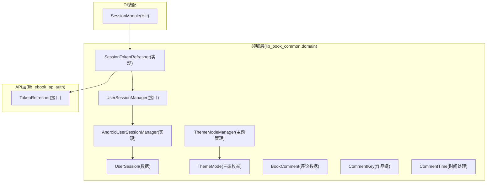
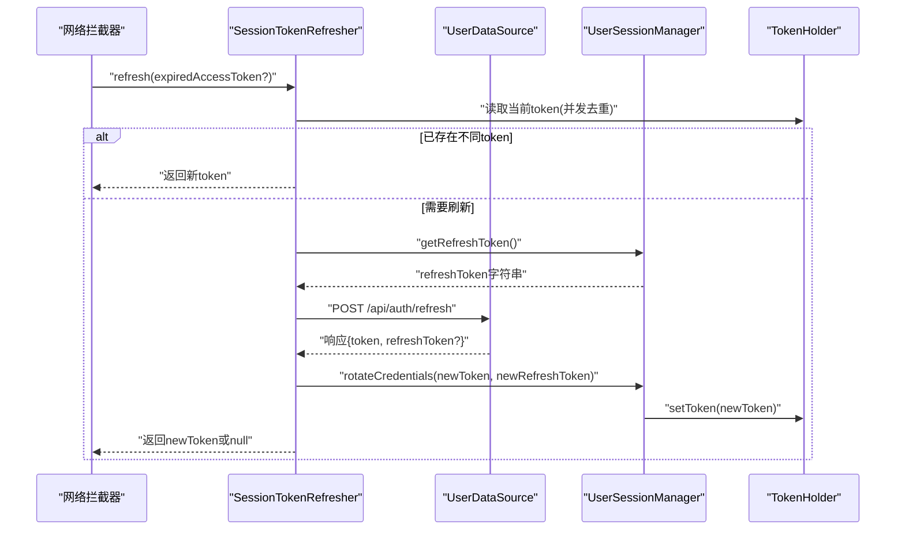
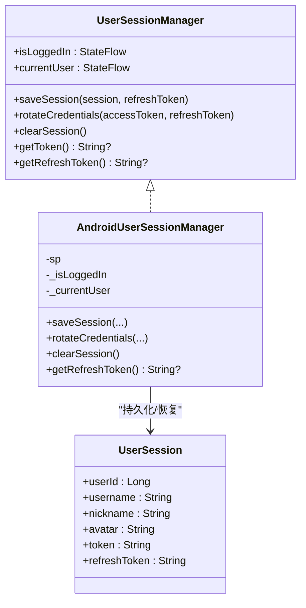
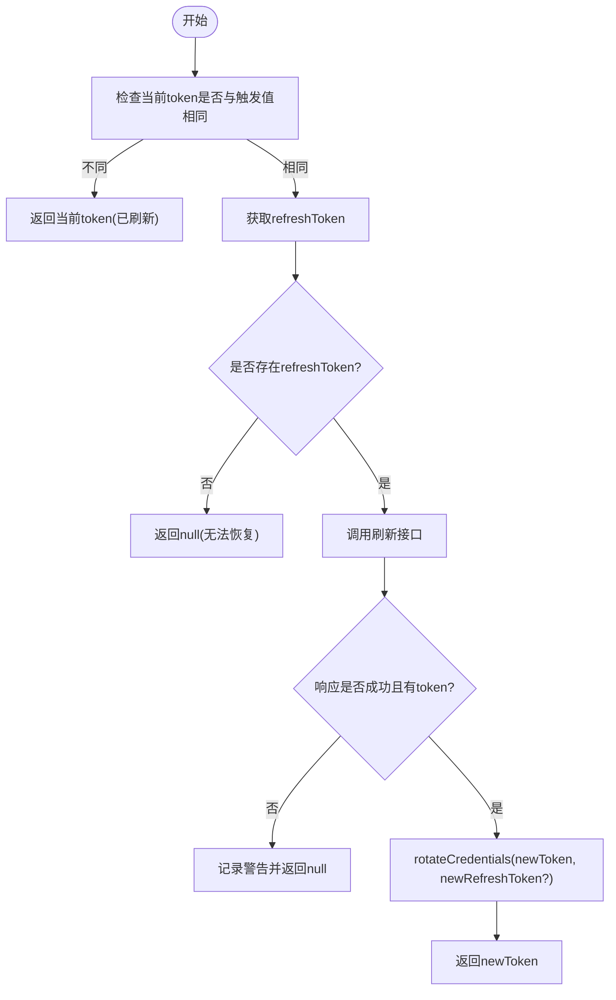
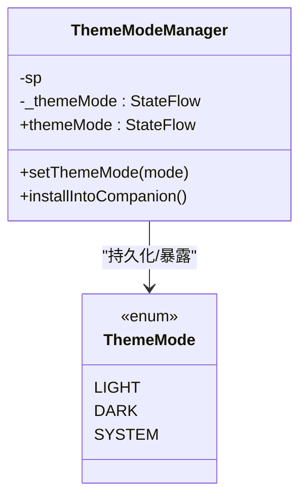
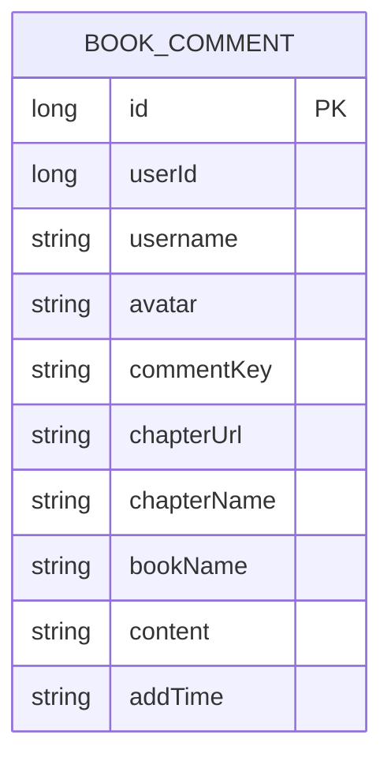
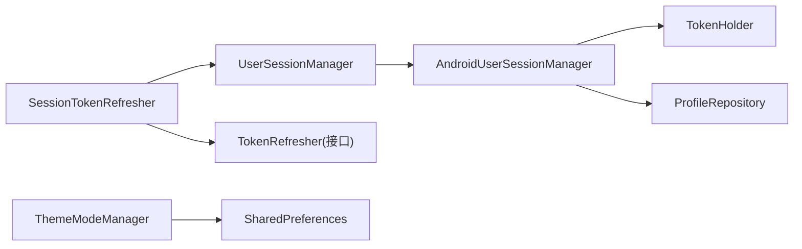

# 领域模型

<cite>
**本文引用的文件**
- [lib_book_common/src/main/java/com/ebook/common/domain/UserSessionManager.kt](file://lib_book_common/src/main/java/com/ebook/common/domain/UserSessionManager.kt)
- [lib_book_common/src/main/java/com/ebook/common/domain/AndroidUserSessionManager.kt](file://lib_book_common/src/main/java/com/ebook/common/domain/AndroidUserSessionManager.kt)
- [lib_book_common/src/main/java/com/ebook/common/domain/UserSession.kt](file://lib_book_common/src/main/java/com/ebook/common/domain/UserSession.kt)
- [lib_book_common/src/main/java/com/ebook/common/domain/SessionTokenRefresher.kt](file://lib_book_common/src/main/java/com/ebook/common/domain/SessionTokenRefresher.kt)
- [lib_book_common/src/main/java/com/ebook/common/domain/ThemeModeManager.kt](file://lib_book_common/src/main/java/com/ebook/common/domain/ThemeModeManager.kt)
- [lib_book_common/src/main/java/com/ebook/common/domain/BookComment.kt](file://lib_book_common/src/main/java/com/ebook/common/domain/BookComment.kt)
- [lib_book_common/src/main/java/com/ebook/common/domain/CommentKey.kt](file://lib_book_common/src/main/java/com/ebook/common/domain/CommentKey.kt)
- [lib_book_common/src/main/java/com/ebook/common/domain/CommentTime.kt](file://lib_book_common/src/main/java/com/ebook/common/domain/CommentTime.kt)
- [lib_ebook_api/src/main/java/com/ebook/api/auth/TokenRefresher.kt](file://lib_ebook_api/src/main/java/com/ebook/api/auth/TokenRefresher.kt)
- [lib_book_common/src/main/java/com/ebook/common/di/SessionModule.kt](file://lib_book_common/src/main/java/com/ebook/common/di/SessionModule.kt)
- [lib_book_common/src/test/java/com/ebook/common/domain/UserSessionManagerTest.kt](file://lib_book_common/src/test/java/com/ebook/common/domain/UserSessionManagerTest.kt)
- [lib_book_common/src/test/java/com/ebook/common/domain/FakeUserSessionManager.kt](file://lib_book_common/src/test/java/com/ebook/common/domain/FakeUserSessionManager.kt)
- [lib_book_common/src/test/java/com/ebook/common/domain/SessionTokenRefresherTest.kt](file://lib_book_common/src/test/java/com/ebook/common/domain/SessionTokenRefresherTest.kt)
- [lib_book_common/src/test/java/com/ebook/common/domain/CommentKeyTest.kt](file://lib_book_common/src/test/java/com/ebook/common/domain/CommentKeyTest.kt)
- [lib_book_common/src/test/java/com/ebook/common/domain/CommentTimeTest.kt](file://lib_book_common/src/test/java/com/ebook/common/domain/CommentTimeTest.kt)
</cite>

## 目录
1. [引言](#引言)
2. [项目结构](#项目结构)
3. [核心组件](#核心组件)
4. [架构总览](#架构总览)
5. [详细组件分析](#详细组件分析)
6. [依赖关系分析](#依赖关系分析)
7. [性能考量](#性能考量)
8. [故障排查指南](#故障排查指南)
9. [结论](#结论)
10. [附录：扩展与示例](#附录：扩展与示例)

## 引言
本文件聚焦本项目中的领域模型，围绕用户会话管理、双 Token 机制、主题模式三态管理以及书籍评论相关数据模型展开。目标是帮助读者理解：
- 会话状态如何以纯接口暴露并被 Android 实现承载；
- 双 Token（access + refresh）的持久化、轮换与静默刷新流程；
- 主题模式的三态枚举、持久化与 UI 装配点；
- 评论数据的扁平化设计、作品身份键生成规则与时间处理口径；
- 领域模型的不变式、约束与测试友好的设计原则；
- 与 UI 层的解耦方式与可扩展点。

## 项目结构
与领域模型直接相关的代码集中在 lib_book_common 模块的 domain 包中，辅以 lib_ebook_api 的 TokenRefresher 接口和 Hilt 装配模块 SessionModule。评论相关模型同样位于 lib_book_common/domain，便于跨模块复用。

图表来源
- [lib_book_common/src/main/java/com/ebook/common/domain/UserSessionManager.kt:13-62](file://lib_book_common/src/main/java/com/ebook/common/domain/UserSessionManager.kt#L13-L62)
- [lib_book_common/src/main/java/com/ebook/common/domain/AndroidUserSessionManager.kt:17-162](file://lib_book_common/src/main/java/com/ebook/common/domain/AndroidUserSessionManager.kt#L17-L162)
- [lib_book_common/src/main/java/com/ebook/common/domain/SessionTokenRefresher.kt:15-96](file://lib_book_common/src/main/java/com/ebook/common/domain/SessionTokenRefresher.kt#L15-L96)
- [lib_book_common/src/main/java/com/ebook/common/domain/ThemeModeManager.kt:10-92](file://lib_book_common/src/main/java/com/ebook/common/domain/ThemeModeManager.kt#L10-L92)
- [lib_book_common/src/main/java/com/ebook/common/domain/BookComment.kt:1-18](file://lib_book_common/src/main/java/com/ebook/common/domain/BookComment.kt#L1-L18)
- [lib_book_common/src/main/java/com/ebook/common/domain/CommentKey.kt:5-84](file://lib_book_common/src/main/java/com/ebook/common/domain/CommentKey.kt#L5-L84)
- [lib_book_common/src/main/java/com/ebook/common/domain/CommentTime.kt:6-29](file://lib_book_common/src/main/java/com/ebook/common/domain/CommentTime.kt#L6-L29)
- [lib_ebook_api/src/main/java/com/ebook/api/auth/TokenRefresher.kt](file://lib_ebook_api/src/main/java/com/ebook/api/auth/TokenRefresher.kt)
- [lib_book_common/src/main/java/com/ebook/common/di/SessionModule.kt](file://lib_book_common/src/main/java/com/ebook/common/di/SessionModule.kt)

章节来源
- [lib_book_common/src/main/java/com/ebook/common/domain/UserSessionManager.kt:13-62](file://lib_book_common/src/main/java/com/ebook/common/domain/UserSessionManager.kt#L13-L62)
- [lib_book_common/src/main/java/com/ebook/common/domain/ThemeModeManager.kt:10-92](file://lib_book_common/src/main/java/com/ebook/common/domain/ThemeModeManager.kt#L10-L92)
- [lib_book_common/src/main/java/com/ebook/common/domain/BookComment.kt:1-18](file://lib_book_common/src/main/java/com/ebook/common/domain/BookComment.kt#L1-L18)
- [lib_book_common/src/main/java/com/ebook/common/domain/CommentKey.kt:5-84](file://lib_book_common/src/main/java/com/ebook/common/domain/CommentKey.kt#L5-L84)
- [lib_book_common/src/main/java/com/ebook/common/domain/CommentTime.kt:6-29](file://lib_book_common/src/main/java/com/ebook/common/domain/CommentTime.kt#L6-L29)

## 核心组件
- UserSessionManager：认证状态的唯一入口，提供登录/登出、获取当前会话与 Token、旋转凭证等能力；所有读写均通过该接口完成，Android 实现负责持久化细节。
- AndroidUserSessionManager：具体实现，维护 StateFlow 状态、SharedPreferences 持久化、并同步到 TokenHolder；退出时统一清理三处镜像（SP、内存、ProfileRepository）。
- UserSession：跨模块 seam 类型，承载用户身份信息及登录瞬时刷新凭证；注意 access token 不落盘。
- SessionTokenRefresher：基于 Mutex 的互斥刷新器，对接 TokenRefresher 接口，完成静默刷新、并发去重、失败回退与凭证轮换。
- ThemeModeManager：管理“浅色/深色/跟随系统”三态主题，持久化至 SharedPreferences，并通过 StateFlow 暴露给 UI 装配点。
- BookComment/CommentKey/CommentTime：评论领域模型与辅助工具，确保评论数据扁平化、作品身份键稳定可复现、时间解析与展示口径统一。

章节来源
- [lib_book_common/src/main/java/com/ebook/common/domain/UserSessionManager.kt:13-62](file://lib_book_common/src/main/java/com/ebook/common/domain/UserSessionManager.kt#L13-L62)
- [lib_book_common/src/main/java/com/ebook/common/domain/AndroidUserSessionManager.kt:17-162](file://lib_book_common/src/main/java/com/ebook/common/domain/AndroidUserSessionManager.kt#L17-L162)
- [lib_book_common/src/main/java/com/ebook/common/domain/UserSession.kt:1-17](file://lib_book_common/src/main/java/com/ebook/common/domain/UserSession.kt#L1-L17)
- [lib_book_common/src/main/java/com/ebook/common/domain/SessionTokenRefresher.kt:15-96](file://lib_book_common/src/main/java/com/ebook/common/domain/SessionTokenRefresher.kt#L15-L96)
- [lib_book_common/src/main/java/com/ebook/common/domain/ThemeModeManager.kt:10-92](file://lib_book_common/src/main/java/com/ebook/common/domain/ThemeModeManager.kt#L10-L92)
- [lib_book_common/src/main/java/com/ebook/common/domain/BookComment.kt:1-18](file://lib_book_common/src/main/java/com/ebook/common/domain/BookComment.kt#L1-L18)
- [lib_book_common/src/main/java/com/ebook/common/domain/CommentKey.kt:5-84](file://lib_book_common/src/main/java/com/ebook/common/domain/CommentKey.kt#L5-L84)
- [lib_book_common/src/main/java/com/ebook/common/domain/CommentTime.kt:6-29](file://lib_book_common/src/main/java/com/ebook/common/domain/CommentTime.kt#L6-L29)

## 架构总览
领域层通过纯 Kotlin 接口暴露行为，Android 平台实现负责与 SharedPreferences、Hilt 注入的 TokenHolder、以及 ProfileRepository 交互。网络侧刷新由 API 层接口抽象，避免领域层耦合具体网络栈。主题模式作为独立领域服务，既持久化又通过 StateFlow 驱动 UI 重组。

图表来源
- [lib_book_common/src/main/java/com/ebook/common/domain/SessionTokenRefresher.kt:50-91](file://lib_book_common/src/main/java/com/ebook/common/domain/SessionTokenRefresher.kt#L50-L91)
- [lib_book_common/src/main/java/com/ebook/common/domain/AndroidUserSessionManager.kt:87-98](file://lib_book_common/src/main/java/com/ebook/common/domain/AndroidUserSessionManager.kt#L87-L98)

## 详细组件分析

### 用户会话管理与双Token机制
- 会话状态以 StateFlow 暴露，支持冷启动恢复；登录时将用户信息与 refresh token 持久化，access token 仅驻内存并由 TokenHolder 持有。
- rotateCredentials 用于静默刷新：仅更新内存 token 与落盘的 refresh token，不触碰用户身份字段，避免覆盖昵称/头像/uid。
- clearSession 统一清理三处镜像：user_session SP、spUtils 兼容键、ProfileRepository 进程内流，确保“已登出”一致性。

图表来源
- [lib_book_common/src/main/java/com/ebook/common/domain/UserSessionManager.kt:13-62](file://lib_book_common/src/main/java/com/ebook/common/domain/UserSessionManager.kt#L13-L62)
- [lib_book_common/src/main/java/com/ebook/common/domain/AndroidUserSessionManager.kt:17-162](file://lib_book_common/src/main/java/com/ebook/common/domain/AndroidUserSessionManager.kt#L17-L162)
- [lib_book_common/src/main/java/com/ebook/common/domain/UserSession.kt:1-17](file://lib_book_common/src/main/java/com/ebook/common/domain/UserSession.kt#L1-L17)

章节来源
- [lib_book_common/src/main/java/com/ebook/common/domain/UserSessionManager.kt:13-62](file://lib_book_common/src/main/java/com/ebook/common/domain/UserSessionManager.kt#L13-L62)
- [lib_book_common/src/main/java/com/ebook/common/domain/AndroidUserSessionManager.kt:54-133](file://lib_book_common/src/main/java/com/ebook/common/domain/AndroidUserSessionManager.kt#L54-L133)
- [lib_book_common/src/main/java/com/ebook/common/domain/UserSession.kt:1-17](file://lib_book_common/src/main/java/com/ebook/common/domain/UserSession.kt#L1-L17)

### 自动刷新机制（SessionTokenRefresher）
- 使用 Mutex 串行化刷新，避免并发刷新导致 refresh token 被服务端硬删除后的冲突。
- 进入临界区后先比对当前 TokenHolder 中的 token，若已不同则复用，避免重复请求。
- 未登录或缺 refresh token 时直接返回 null；刷新成功调用 rotateCredentials 只更新凭证，不重建会话。
- 取消异常原样上抛，避免上层误判为会话过期而错误踢出。

图表来源
- [lib_book_common/src/main/java/com/ebook/common/domain/SessionTokenRefresher.kt:50-91](file://lib_book_common/src/main/java/com/ebook/common/domain/SessionTokenRefresher.kt#L50-L91)
- [lib_book_common/src/main/java/com/ebook/common/domain/AndroidUserSessionManager.kt:87-98](file://lib_book_common/src/main/java/com/ebook/common/domain/AndroidUserSessionManager.kt#L87-L98)

章节来源
- [lib_book_common/src/main/java/com/ebook/common/domain/SessionTokenRefresher.kt:15-96](file://lib_book_common/src/main/java/com/ebook/common/domain/SessionTokenRefresher.kt#L15-L96)

### 主题模式三态管理
- 三态枚举 ThemeMode：LIGHT/DARK/SYSTEM，默认 SYSTEM，与系统深色语义一致。
- 通过 SharedPreferences 持久化 mode，StateFlow 暴露当前值；设置后立即推进状态，UI 重组生效。
- 安装点：应用启动后将实例挂入 Companion.instance，供主题装配 lambda 读取。

图表来源
- [lib_book_common/src/main/java/com/ebook/common/domain/ThemeModeManager.kt:10-92](file://lib_book_common/src/main/java/com/ebook/common/domain/ThemeModeManager.kt#L10-L92)

章节来源
- [lib_book_common/src/main/java/com/ebook/common/domain/ThemeModeManager.kt:10-92](file://lib_book_common/src/main/java/com/ebook/common/domain/ThemeModeManager.kt#L10-L92)

### 评论领域模型：BookComment/CommentKey/CommentTime
- BookComment：扁平化结构，无嵌套 User，字段包含评论 id、作者信息、关联书籍/章节、内容、添加时间。
- CommentKey：基于书名与作者的规范化文本计算 sha256，前缀 ck1 标识算法版本；归一化过程去除书名号装饰、全角转半角、小写、空白折叠；作者占位词视为空串参与哈希，保证显示词不影响桶键。
- CommentTime：统一解析与展示口径，排序键精确到秒，展示裁剪到分钟；不进行时区换算，避免墙钟时间错位。

图表来源
- [lib_book_common/src/main/java/com/ebook/common/domain/BookComment.kt:1-18](file://lib_book_common/src/main/java/com/ebook/common/domain/BookComment.kt#L1-L18)

章节来源
- [lib_book_common/src/main/java/com/ebook/common/domain/BookComment.kt:1-18](file://lib_book_common/src/main/java/com/ebook/common/domain/BookComment.kt#L1-L18)
- [lib_book_common/src/main/java/com/ebook/common/domain/CommentKey.kt:5-84](file://lib_book_common/src/main/java/com/ebook/common/domain/CommentKey.kt#L5-L84)
- [lib_book_common/src/main/java/com/ebook/common/domain/CommentTime.kt:6-29](file://lib_book_common/src/main/java/com/ebook/common/domain/CommentTime.kt#L6-L29)

## 依赖关系分析
- 领域层对外仅暴露纯 Kotlin 接口与数据类，Android 实现通过 Hilt 注入 TokenHolder、ProfileRepository、SharedPreferences。
- SessionTokenRefresher 依赖 lib_ebook_api 的 TokenRefresher 接口与 UserDataSource，避免对 Retrofit 的直接耦合。
- 主题模式管理器依赖 Application 上下文与 SharedPreferences，并通过 Companion.instance 为 Compose 主题装配提供全局读取点。

图表来源
- [lib_book_common/src/main/java/com/ebook/common/domain/AndroidUserSessionManager.kt:28-33](file://lib_book_common/src/main/java/com/ebook/common/domain/AndroidUserSessionManager.kt#L28-L33)
- [lib_book_common/src/main/java/com/ebook/common/domain/SessionTokenRefresher.kt:41-46](file://lib_book_common/src/main/java/com/ebook/common/domain/SessionTokenRefresher.kt#L41-L46)
- [lib_book_common/src/main/java/com/ebook/common/domain/ThemeModeManager.kt:44-49](file://lib_book_common/src/main/java/com/ebook/common/domain/ThemeModeManager.kt#L44-L49)

章节来源
- [lib_book_common/src/main/java/com/ebook/common/domain/AndroidUserSessionManager.kt:28-33](file://lib_book_common/src/main/java/com/ebook/common/domain/AndroidUserSessionManager.kt#L28-L33)
- [lib_book_common/src/main/java/com/ebook/common/domain/SessionTokenRefresher.kt:41-46](file://lib_book_common/src/main/java/com/ebook/common/domain/SessionTokenRefresher.kt#L41-L46)
- [lib_book_common/src/main/java/com/ebook/common/domain/ThemeModeManager.kt:44-49](file://lib_book_common/src/main/java/com/ebook/common/domain/ThemeModeManager.kt#L44-L49)

## 性能考量
- 刷新互斥：Mutex 串行化刷新，避免并发刷新的竞态与多余请求。
- 状态流：StateFlow 提供高效订阅与最小化重组，避免频繁 IO。
- 持久化：仅在关键路径（登录、刷新、切换主题）写入 SharedPreferences，减少磁盘 I/O。
- 评论时间解析：集中到 CommentTime，统一格式转换，避免多处重复解析带来的开销与不一致。

[本节为通用性能建议，无需特定文件引用]

## 故障排查指南
- 会话过期场景：当 refresh 失败且无可用 token 时，上层应上报会话过期事件并清会话；确认 clearSession 是否已清理三处镜像（SP、TokenHolder、ProfileRepository）。
- 刷新循环：确保 SessionTokenRefresher 不走 safeApiCall，避免 A0230 再次触发刷新形成死循环。
- 主题切换无效：检查 ThemeModeManager.setThemeMode 是否写入 SP 并推进 StateFlow；确认 Application 是否正确 installIntoCompanion。
- 评论时间显示不一致：统一使用 CommentTime.sortMillis 与 displayText，避免各页面自行解析导致顺序或展示差异。

章节来源
- [lib_book_common/src/main/java/com/ebook/common/domain/SessionTokenRefresher.kt:27-36](file://lib_book_common/src/main/java/com/ebook/common/domain/SessionTokenRefresher.kt#L27-L36)
- [lib_book_common/src/main/java/com/ebook/common/domain/AndroidUserSessionManager.kt:100-133](file://lib_book_common/src/main/java/com/ebook/common/domain/AndroidUserSessionManager.kt#L100-L133)
- [lib_book_common/src/main/java/com/ebook/common/domain/ThemeModeManager.kt:60-77](file://lib_book_common/src/main/java/com/ebook/common/domain/ThemeModeManager.kt#L60-L77)
- [lib_book_common/src/main/java/com/ebook/common/domain/CommentTime.kt:20-29](file://lib_book_common/src/main/java/com/ebook/common/domain/CommentTime.kt#L20-L29)

## 结论
本领域模型以清晰的分层与职责划分，将认证、主题与评论等核心业务抽象为可测试、可替换的实现。通过纯接口暴露能力、StateFlow 暴露状态、Mutex 保障并发安全、统一的时间与键生成策略，确保了跨模块的一致性与稳定性。后续扩展（新增会话状态、自定义主题模式、扩展评论元数据）均可在不破坏现有不变式的前提下进行。

[本节为总结性内容，无需特定文件引用]

## 附录：扩展与示例

### 扩展新的会话状态
- 在 UserSessionManager 接口新增方法或扩展 currentUser 的 StateFlow 携带更多状态。
- 在 AndroidUserSessionManager 中实现持久化逻辑与三处镜像同步。
- 参考已有保存与清理流程，确保新增状态与旧状态的一致性。

章节来源
- [lib_book_common/src/main/java/com/ebook/common/domain/UserSessionManager.kt:13-62](file://lib_book_common/src/main/java/com/ebook/common/domain/UserSessionManager.kt#L13-L62)
- [lib_book_common/src/main/java/com/ebook/common/domain/AndroidUserSessionManager.kt:61-85](file://lib_book_common/src/main/java/com/ebook/common/domain/AndroidUserSessionManager.kt#L61-L85)
- [lib_book_common/src/main/java/com/ebook/common/domain/AndroidUserSessionManager.kt:111-133](file://lib_book_common/src/main/java/com/ebook/common/domain/AndroidUserSessionManager.kt#L111-L133)

### 实现自定义主题模式
- 在 ThemeMode 中添加新的枚举值，并在 setThemeMode 中持久化与推进状态。
- 确保应用主题装配点能识别新模式并正确渲染。

章节来源
- [lib_book_common/src/main/java/com/ebook/common/domain/ThemeModeManager.kt:17-26](file://lib_book_common/src/main/java/com/ebook/common/domain/ThemeModeManager.kt#L17-L26)
- [lib_book_common/src/main/java/com/ebook/common/domain/ThemeModeManager.kt:60-69](file://lib_book_common/src/main/java/com/ebook/common/domain/ThemeModeManager.kt#L60-L69)

### 处理会话过期场景
- 在 SessionTokenRefresher.refresh 中捕获异常并返回 null，上层根据结果决定是否清会话。
- 确保 clearSession 清理三处镜像，避免残留状态。

章节来源
- [lib_book_common/src/main/java/com/ebook/common/domain/SessionTokenRefresher.kt:82-89](file://lib_book_common/src/main/java/com/ebook/common/domain/SessionTokenRefresher.kt#L82-L89)
- [lib_book_common/src/main/java/com/ebook/common/domain/AndroidUserSessionManager.kt:111-133](file://lib_book_common/src/main/java/com/ebook/common/domain/AndroidUserSessionManager.kt#L111-L133)

### 领域模型的不变式与验证
- 双 Token 不变式：access token 只驻内存，refresh token 落盘；rotateCredentials 不改动用户身份。
- 主题模式不变式：SYSTEM 为默认值，存储名称与枚举名一致。
- 评论键不变式：ck1 前缀表示算法版本，规范化规则变更需升版本号。
- 时间处理不变式：统一解析与展示口径，不进行额外时区换算。

章节来源
- [lib_book_common/src/main/java/com/ebook/common/domain/AndroidUserSessionManager.kt:87-98](file://lib_book_common/src/main/java/com/ebook/common/domain/AndroidUserSessionManager.kt#L87-L98)
- [lib_book_common/src/main/java/com/ebook/common/domain/ThemeModeManager.kt:65-69](file://lib_book_common/src/main/java/com/ebook/common/domain/ThemeModeManager.kt#L65-L69)
- [lib_book_common/src/main/java/com/ebook/common/domain/CommentKey.kt:20-49](file://lib_book_common/src/main/java/com/ebook/common/domain/CommentKey.kt#L20-L49)
- [lib_book_common/src/main/java/com/ebook/common/domain/CommentTime.kt:20-29](file://lib_book_common/src/main/java/com/ebook/common/domain/CommentTime.kt#L20-L29)

### 与 UI 层的解耦设计与测试友好
- 领域层仅提供纯 Kotlin 接口与数据类，Android 实现封装平台细节，便于单元测试与 Mock。
- 使用 StateFlow 暴露状态，ViewModel/Compose 可方便订阅与重组。
- 提供 FakeUserSessionManager 等替身，支撑 ViewModel 与页面的测试。

章节来源
- [lib_book_common/src/main/java/com/ebook/common/domain/UserSessionManager.kt:13-62](file://lib_book_common/src/main/java/com/ebook/common/domain/UserSessionManager.kt#L13-L62)
- [lib_book_common/src/test/java/com/ebook/common/domain/FakeUserSessionManager.kt](file://lib_book_common/src/test/java/com/ebook/common/domain/FakeUserSessionManager.kt)
- [lib_book_common/src/test/java/com/ebook/common/domain/UserSessionManagerTest.kt](file://lib_book_common/src/test/java/com/ebook/common/domain/UserSessionManagerTest.kt)
- [lib_book_common/src/test/java/com/ebook/common/domain/SessionTokenRefresherTest.kt](file://lib_book_common/src/test/java/com/ebook/common/domain/SessionTokenRefresherTest.kt)
- [lib_book_common/src/test/java/com/ebook/common/domain/CommentKeyTest.kt](file://lib_book_common/src/test/java/com/ebook/common/domain/CommentKeyTest.kt)
- [lib_book_common/src/test/java/com/ebook/common/domain/CommentTimeTest.kt](file://lib_book_common/src/test/java/com/ebook/common/domain/CommentTimeTest.kt)