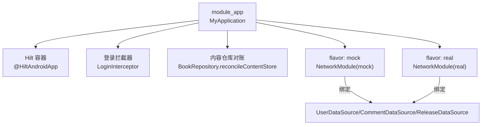
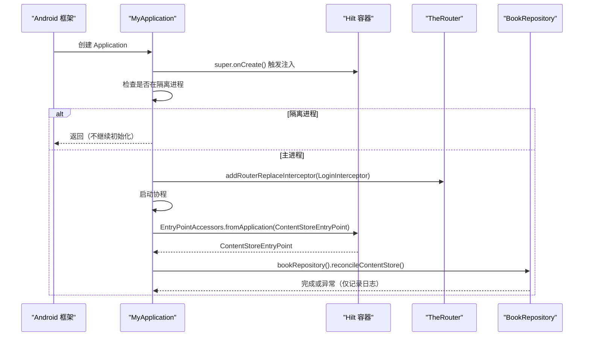
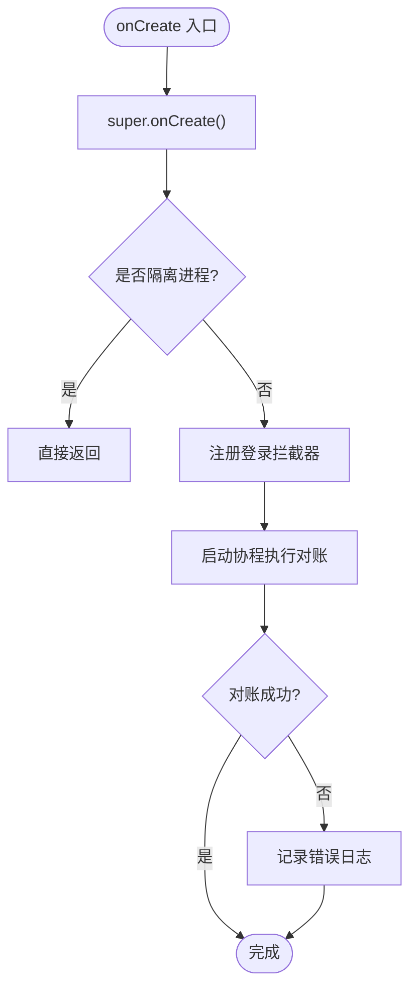
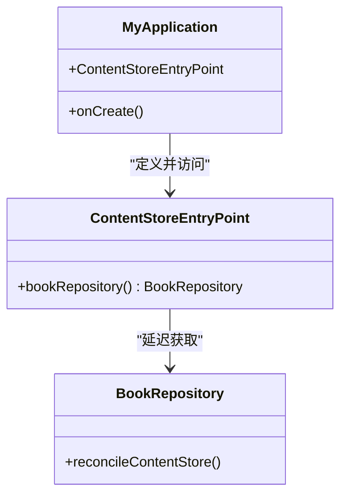
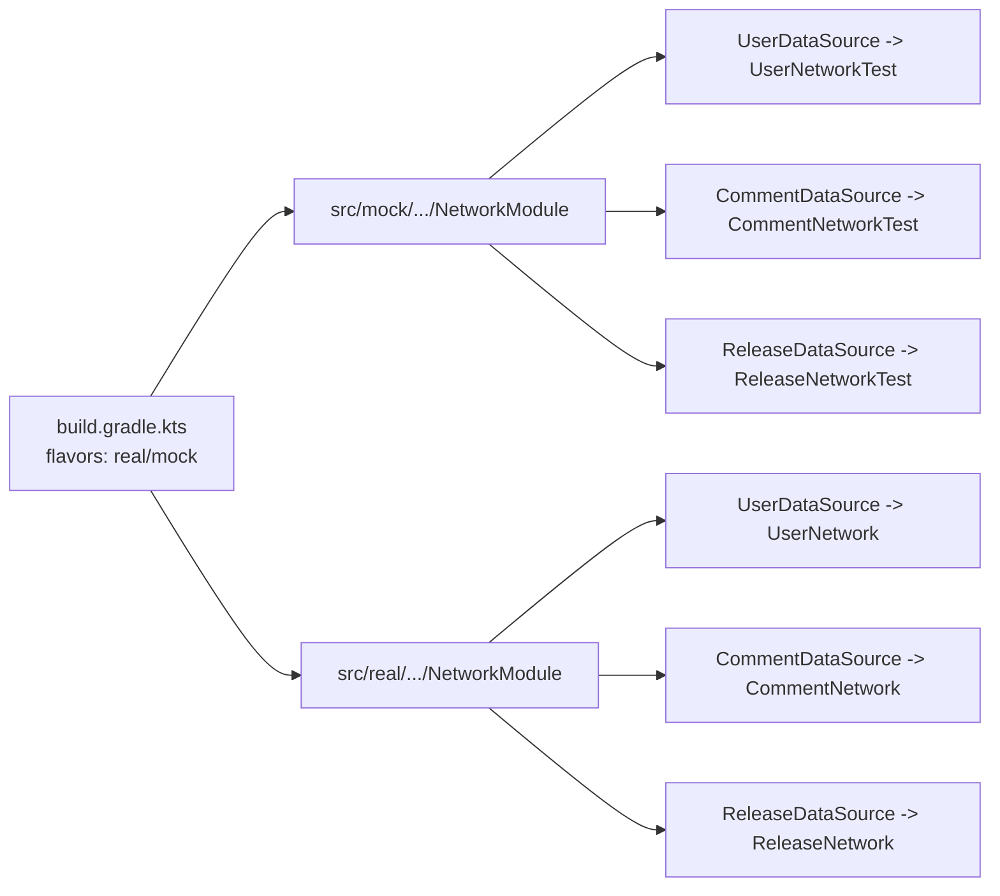
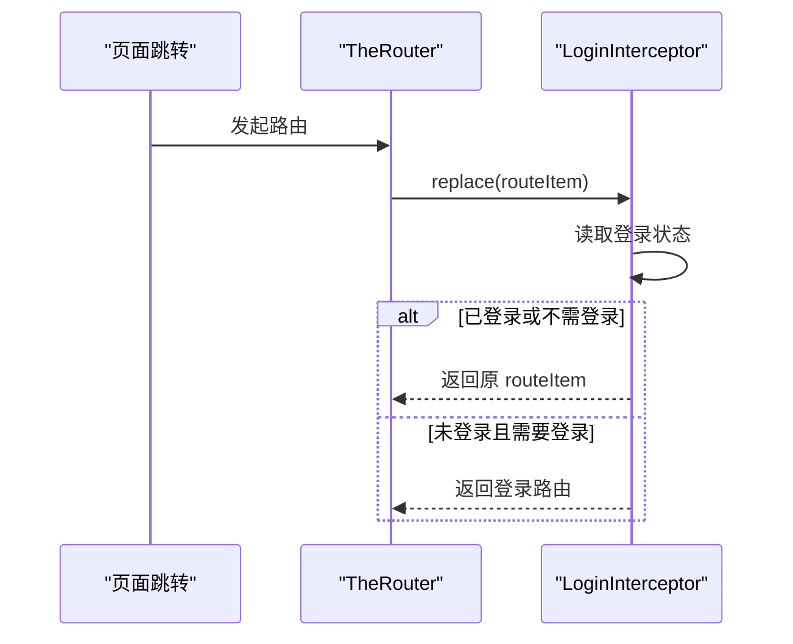
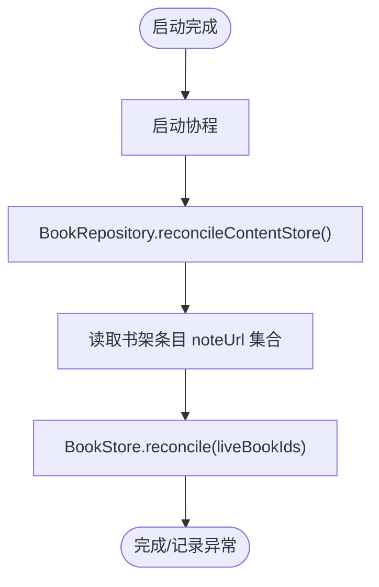
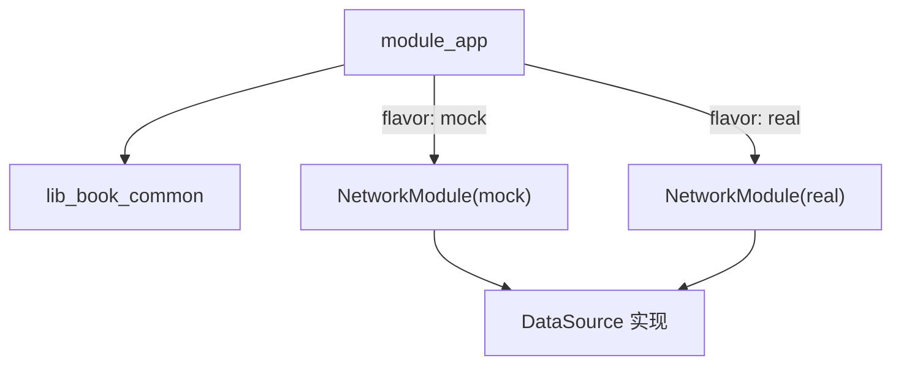

# 应用入口模块 (module_app)

<cite>
**本文引用的文件**
- [MyApplication.kt](file://module_app/src/main/java/com/ebook/MyApplication.kt)
- [NetworkModule (mock)](file://module_app/src/mock/java/com/ebook/di/NetworkModule.kt)
- [NetworkModule (real)](file://module_app/src/real/java/com/ebook/di/NetworkModule.kt)
- [build.gradle.kts](file://module_app/build.gradle.kts)
- [LoginInterceptor.kt](file://lib_book_common/src/main/java/com/ebook/common/interceptor/LoginInterceptor.kt)
- [BookRepository.kt](file://lib_book_common/src/main/java/com/ebook/common/repository/BookRepository.kt)
- [0028-untrusted-js-sandbox.md](file://docs/adr/0028-untrusted-js-sandbox.md)
</cite>

## 目录
1. [简介](#简介)
2. [项目结构](#项目结构)
3. [核心组件](#核心组件)
4. [架构总览](#架构总览)
5. [详细组件分析](#详细组件分析)
6. [依赖关系分析](#依赖关系分析)
7. [性能考量](#性能考量)
8. [故障排查指南](#故障排查指南)
9. [结论](#结论)

## 简介
本模块是应用的入口与装配层，负责：
- 进程启动时的安全门控（隔离沙箱进程直接返回）
- 登录拦截器注册
- 内容仓库对账的异步调度
- Hilt EntryPoint 的延迟注入，避免在 Application 上 eager 字段注入导致沙箱进程崩溃
- 通过 product flavor 提供 mock/real 双构建模式，切换网络数据源实现

## 项目结构
module_app 以单一入口类 MyApplication 为核心，配合 flavor source set 提供两套 NetworkModule：
- src/mock → 内存 Mock 数据源（User/Comment/Release）
- src/real → 真实后端实现（User/Comment/Release）
- build.gradle.kts 声明 network flavor dimension、applicationIdSuffix 与 release 混淆配置

图示来源
- [MyApplication.kt:19-61](file://module_app/src/main/java/com/ebook/MyApplication.kt#L19-L61)
- [NetworkModule (mock):14-37](file://module_app/src/mock/java/com/ebook/di/NetworkModule.kt#L14-L37)
- [NetworkModule (real):14-35](file://module_app/src/real/java/com/ebook/di/NetworkModule.kt#L14-L35)

章节来源
- [build.gradle.kts:17-36](file://module_app/build.gradle.kts#L17-L36)
- [NetworkModule (mock):14-37](file://module_app/src/mock/java/com/ebook/di/NetworkModule.kt#L14-L37)
- [NetworkModule (real):14-35](file://module_app/src/real/java/com/ebook/di/NetworkModule.kt#L14-L35)

## 核心组件
- MyApplication：应用初始化、进程门、登录拦截、对账调度、EntryPoint 定义
- ContentStoreEntryPoint：Hilt 入口点，延迟获取 BookRepository 以执行对账
- NetworkModule（mock/real）：按 flavor 绑定 DataSource 的具体实现
- LoginInterceptor：TheRouter 跳转前检查登录态并替换路由
- BookRepository.reconcileContentStore：回收无主目录与残留文件

章节来源
- [MyApplication.kt:19-61](file://module_app/src/main/java/com/ebook/MyApplication.kt#L19-L61)
- [LoginInterceptor.kt:14-42](file://lib_book_common/src/main/java/com/ebook/common/interceptor/LoginInterceptor.kt#L14-L42)
- [BookRepository.kt:842-855](file://lib_book_common/src/main/java/com/ebook/common/repository/BookRepository.kt#L842-L855)

## 架构总览
应用启动序列如下：
- Android 框架实例化 Application
- Hilt 生成代码注入父类基类与依赖（super.onCreate 内部）
- MyApplication.onCreate 先调用 super.onCreate，再执行进程门与业务初始化
- 若处于隔离沙箱进程，直接返回，不再装配主题/仓库等需要应用数据的逻辑
- 否则注册登录拦截器，并在协程中通过 EntryPointAccessors 获取 BookRepository 执行对账

图示来源
- [MyApplication.kt:24-43](file://module_app/src/main/java/com/ebook/MyApplication.kt#L24-L43)
- [BookRepository.kt:842-855](file://lib_book_common/src/main/java/com/ebook/common/repository/BookRepository.kt#L842-L855)

## 详细组件分析

### MyApplication 初始化流程与进程门
- super.onCreate() 必须保留且置于最前，因为 Hilt 的字段注入发生在父类 onCreate 内部；跳过会破坏框架契约
- 进程门：SandboxProcess.isInIsolatedProcess 为真时立即 return，避免加载 Room/SP 等依赖应用数据目录的能力
- 登录拦截：addRouterReplaceInterceptor(new LoginInterceptor())，用于保护需登录的路由
- 对账调度：在 IO 协程中通过 EntryPointAccessors 获取 BookRepository 并执行 reconcileContentStore；失败仅记日志，不影响启动

图示来源
- [MyApplication.kt:24-43](file://module_app/src/main/java/com/ebook/MyApplication.kt#L24-L43)

章节来源
- [MyApplication.kt:24-43](file://module_app/src/main/java/com/ebook/MyApplication.kt#L24-L43)

### Hilt 配置与 EntryPointAccessors 使用
- @HiltAndroidApp 标记 MyApplication，启用 Hilt Android 支持
- 为避免在 Application 上 eager @Inject 字段导致沙箱进程崩溃，采用 @EntryPoint + InstallIn(SingletonComponent::class) 暴露 BookRepository
- 通过 EntryPointAccessors.fromApplication 在“用到它的那一刻”取到依赖，从而将注入时机从 Application 生命周期延后到业务方法调用

图示来源
- [MyApplication.kt:19-61](file://module_app/src/main/java/com/ebook/MyApplication.kt#L19-L61)
- [BookRepository.kt:842-855](file://lib_book_common/src/main/java/com/ebook/common/repository/BookRepository.kt#L842-L855)

章节来源
- [MyApplication.kt:19-61](file://module_app/src/main/java/com/ebook/MyApplication.kt#L19-L61)

### 双构建模式（mock/real）与 NetworkModule 替换机制
- flavorDimensions 声明 network，创建 real 与 mock 两种 flavor
- mock flavor 设置 applicationIdSuffix=".mock"，便于并行安装
- 两份同名 NetworkModule 位于不同 source set，通过 Hilt 编译期选择实现绑定
  - mock：UserDataSource/CommentDataSource/ReleaseDataSource 指向测试实现，载荷来自 assets JSON
  - real：指向真实网络实现，基址经 BuildConfig 注入；ReleaseDataSource 仍走公开 Releases API

图示来源
- [build.gradle.kts:17-36](file://module_app/build.gradle.kts#L17-L36)
- [NetworkModule (mock):14-37](file://module_app/src/mock/java/com/ebook/di/NetworkModule.kt#L14-L37)
- [NetworkModule (real):14-35](file://module_app/src/real/java/com/ebook/di/NetworkModule.kt#L14-L35)

章节来源
- [build.gradle.kts:17-36](file://module_app/build.gradle.kts#L17-L36)
- [NetworkModule (mock):14-37](file://module_app/src/mock/java/com/ebook/di/NetworkModule.kt#L14-L37)
- [NetworkModule (real):14-35](file://module_app/src/real/java/com/ebook/di/NetworkModule.kt#L14-L35)

### 登录拦截器配置
- 在 MyApplication.onCreate 中注册 LoginInterceptor
- 拦截优先级 6，未登录且目标路由携带 needLogin=true 时，替换为目标登录页路由
- 已登录则放行

图示来源
- [MyApplication.kt:29-30](file://module_app/src/main/java/com/ebook/MyApplication.kt#L29-L30)
- [LoginInterceptor.kt:14-42](file://lib_book_common/src/main/java/com/ebook/common/interceptor/LoginInterceptor.kt#L14-L42)

章节来源
- [LoginInterceptor.kt:14-42](file://lib_book_common/src/main/java/com/ebook/common/interceptor/LoginInterceptor.kt#L14-L42)

### 内容仓库对账逻辑
- 启动时异步执行 BookRepository.reconcileContentStore
- 作用：回收 DB 已无书的目录、导入中断遗留的 .tmp 目录与散落文件
- 调用时机不变式：仅在进程启动时跑一次，避免导入进行中误删正在写入的目录
- 失败兜底：捕获异常并记录日志，不阻断应用启动

图示来源
- [MyApplication.kt:31-43](file://module_app/src/main/java/com/ebook/MyApplication.kt#L31-L43)
- [BookRepository.kt:842-855](file://lib_book_common/src/main/java/com/ebook/common/repository/BookRepository.kt#L842-L855)

章节来源
- [BookRepository.kt:842-855](file://lib_book_common/src/main/java/com/ebook/common/repository/BookRepository.kt#L842-L855)

### 为什么避免在 Application 上使用 eager @Inject 字段
- Hilt 的字段注入发生在 super.onCreate() 内部；而进程门写在 super.onCreate() 之后
- 若在 Application 上加一个 @Inject 字段，等于把进程门之前的初始化提前到注入之前
- 在 :js 沙箱进程中，框架仍会实例化 Application，但无法访问应用数据目录（Room/SP），导致崩溃
- 正确做法：使用 EntryPointAccessors 在“真正需要依赖时”取对象，如 MyApplication.ContentStoreEntryPoint

章节来源
- [MyApplication.kt:46-61](file://module_app/src/main/java/com/ebook/MyApplication.kt#L46-L61)
- [0028-untrusted-js-sandbox.md:37-39](file://docs/adr/0028-untrusted-js-sandbox.md#L37-L39)

### 进程门的双重保护机制
- 第一道门：MyApplication.onCreate 中的 SandboxProcess.isInIsolatedProcess 判断，早于任何应用数据访问
- 第二道门：BookApplication 中同样存在进程门（同仓约定），确保主题与仓库等初始化也受保护
- 目的：隔离进程零权限、不可读应用数据，任何依赖应用状态的初始化都会失败

章节来源
- [MyApplication.kt:24-28](file://module_app/src/main/java/com/ebook/MyApplication.kt#L24-L28)
- [0028-untrusted-js-sandbox.md:37-39](file://docs/adr/0028-untrusted-js-sandbox.md#L37-L39)

### 如何扩展应用初始化逻辑与处理沙箱进程
- 扩展点：在 MyApplication.onCreate 中 super.onCreate() 之后添加逻辑，但务必尊重进程门
- 若新逻辑依赖应用数据（Room/SP/文件），需在进程门之后执行，或在协程内延迟执行
- 若涉及 DI 依赖，请使用 EntryPointAccessors 在运行时取，避免 Application 字段注入

章节来源
- [MyApplication.kt:24-43](file://module_app/src/main/java/com/ebook/MyApplication.kt#L24-L43)
- [MyApplication.kt:46-61](file://module_app/src/main/java/com/ebook/MyApplication.kt#L46-L61)

## 依赖关系分析
- module_app 依赖 lib_book_common（含 BookRepository、LoginInterceptor 等）
- 通过 flavor source set 注入不同的 NetworkModule，决定数据源实现
- Hilt 在 @HiltAndroidApp 下管理依赖图；EntryPoint 允许绕过常规注入时机限制

图示来源
- [build.gradle.kts:48-64](file://module_app/build.gradle.kts#L48-L64)
- [NetworkModule (mock):14-37](file://module_app/src/mock/java/com/ebook/di/NetworkModule.kt#L14-L37)
- [NetworkModule (real):14-35](file://module_app/src/real/java/com/ebook/di/NetworkModule.kt#L14-L35)

章节来源
- [build.gradle.kts:48-64](file://module_app/build.gradle.kts#L48-L64)

## 性能考量
- 对账任务在 IO 协程中执行，避免阻塞主线程
- 对账失败仅记录日志，不重试也不影响启动，保证冷启动稳定性
- 通过 EntryPoint 延迟注入减少不必要的依赖初始化成本

[本节为通用指导，无需特定文件引用]

## 故障排查指南
- 登录跳转无效：确认 LoginInterceptor 已注册且路由映射正确；检查目标路由是否需要登录参数
- 内容仓库对账失败：查看日志输出；该失败不影响启动，但若长期不清理可能导致磁盘占用增长
- 沙箱进程崩溃：确认进程门在 super.onCreate() 之后且早于任何应用数据访问；检查是否误加 Application 上的 @Inject 字段
- 双构建问题：确认当前 flavor 是否正确（real 连接后端，mock 使用本地资产）；检查 applicationIdSuffix 是否冲突

章节来源
- [MyApplication.kt:24-43](file://module_app/src/main/java/com/ebook/MyApplication.kt#L24-L43)
- [LoginInterceptor.kt:14-42](file://lib_book_common/src/main/java/com/ebook/common/interceptor/LoginInterceptor.kt#L14-L42)

## 结论
module_app 作为应用入口，聚焦三件事：安全的进程门、可插拔的网络数据源、以及必要的启动期维护（登录拦截与内容对账）。通过 Hilt EntryPoint 延迟注入与 flavor 机制，既保证了沙箱进程的安全性，又提供了开发/测试/生产环境的灵活切换。遵循本文约束扩展初始化逻辑，可避免常见陷阱并确保系统稳定运行。