# 应用入口模块 (module_app)

<cite>
**本文引用的文件**   
- [MyApplication.kt](file://module_app/src/main/java/com/ebook/MyApplication.kt)
- [AndroidManifest.xml](file://module_app/src/main/AndroidManifest.xml)
- [build.gradle.kts](file://module_app/build.gradle.kts)
- [NetworkModule.kt（mock）](file://module_app/src/mock/java/com/ebook/di/NetworkModule.kt)
- [NetworkModule.kt（real）](file://module_app/src/real/java/com/ebook/di/NetworkModule.kt)
- [BookApplication.kt](file://lib_book_common/src/main/java/com/ebook/common/BookApplication.kt)
- [SandboxProcess.kt](file://lib_book_source/src/main/java/com/ebook/source/sandbox/SandboxProcess.kt)
- [settings.gradle.kts](file://settings.gradle.kts)
</cite>

## 目录
1. [简介](#简介)
2. [项目结构](#项目结构)
3. [核心组件](#核心组件)
4. [架构总览](#架构总览)
5. [详细组件分析](#详细组件分析)
6. [依赖与构建配置](#依赖与构建配置)
7. [依赖注入与网络环境切换](#依赖注入与网络环境切换)
8. [应用启动流程](#应用启动流程)
9. [扩展指南](#扩展指南)
10. [调试与问题排查](#调试与问题排查)
11. [结论](#结论)

## 简介
module_app 是整个 Android 应用的入口模块，负责：
- 声明 Application、权限、应用级属性及网络安全性配置。
- 通过 Hilt 完成依赖注入图装配。
- 判断是否处于沙箱隔离进程并跳过主进程初始化。
- 注册路由拦截器并异步执行内容仓库对账。
- 使用 flavor 维度在 real 与 mock 两种网络实现之间切换。
- 统一版本名、版本码生成策略以及多模块依赖装配。

该模块是理解应用生命周期、Hilt 注入时机、沙箱进程隔离和构建产物差异的关键切入点。

## 项目结构
module_app 采用“功能模块 + 构建变体”的组织方式：
- main 源集包含应用入口类、清单文件和资源。
- mock 源集提供 Mock 网络数据源绑定。
- real 源集提供真实后端网络数据源绑定。
- build.gradle.kts 定义 flavor dimension、productFlavors、混淆与编译目标等构建选项。

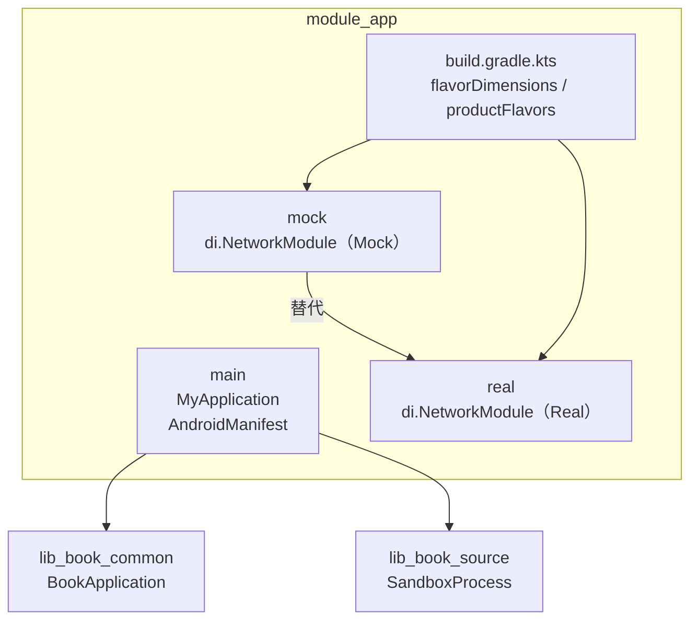
```mermaid
graph TB
    subgraph "module_app"
        MAIN["main<br/>MyApplication<br/>AndroidManifest"]
        MOCK["mock<br/>di.NetworkModule（Mock）"]
        REAL["real<br/>di.NetworkModule（Real）"]
        BUILD["build.gradle.kts<br/>flavorDimensions / productFlavors"]
    end

    BOOK_COMMON["lib_book_common<br/>BookApplication"]
    LIB_SOURCE["lib_book_source<br/>SandboxProcess"]

    MAIN --> BOOK_COMMON
    MAIN --> LIB_SOURCE
    MOCK -->|替代| REAL
    BUILD --> MOCK
    BUILD --> REAL
```

**图表来源**
- [MyApplication.kt:1-66](file://module_app/src/main/java/com/ebook/MyApplication.kt#L1-L66)
- [AndroidManifest.xml:1-44](file://module_app/src/main/AndroidManifest.xml#L1-L44)
- [build.gradle.kts:1-96](file://module_app/build.gradle.kts#L1-L96)
- [NetworkModule.kt（mock）:1-37](file://module_app/src/mock/java/com/ebook/di/NetworkModule.kt#L1-L37)
- [NetworkModule.kt（real）:1-35](file://module_app/src/real/java/com/ebook/di/NetworkModule.kt#L1-L35)
- [BookApplication.kt:1-64](file://lib_book_common/src/main/java/com/ebook/common/BookApplication.kt#L1-L64)
- [SandboxProcess.kt:1-28](file://lib_book_source/src/main/java/com/ebook/source/sandbox/SandboxProcess.kt#L1-L28)

**章节来源**
- [MyApplication.kt:1-66](file://module_app/src/main/java/com/ebook/MyApplication.kt#L1-L66)
- [AndroidManifest.xml:1-44](file://module_app/src/main/AndroidManifest.xml#L1-L44)
- [build.gradle.kts:1-96](file://module_app/build.gradle.kts#L1-L96)

## 核心组件
- MyApplication：应用入口，继承 BookApplication，承担 Hilt 初始化后的业务初始化、沙箱进程门、路由拦截、内容仓库对账。
- BookApplication：通用基类，处理主题装配与 Hilt EntryPoint 访问，同样具备沙箱进程门。
- SandboxProcess：唯一用于判断当前进程是否为系统隔离进程的辅助对象。
- NetworkModule（real / mock）：通过 Dagger/Hilt 的 Module 接口将 DataSource 绑定到具体实现，实现网络层的环境切换。

**章节来源**
- [MyApplication.kt:1-66](file://module_app/src/main/java/com/ebook/MyApplication.kt#L1-L66)
- [BookApplication.kt:1-64](file://lib_book_common/src/main/java/com/ebook/common/BookApplication.kt#L1-L64)
- [SandboxProcess.kt:1-28](file://lib_book_source/src/main/java/com/ebook/source/sandbox/SandboxProcess.kt#L1-L28)
- [NetworkModule.kt（real）:1-35](file://module_app/src/real/java/com/ebook/di/NetworkModule.kt#L1-L35)
- [NetworkModule.kt（mock）:1-37](file://module_app/src/mock/java/com/ebook/di/NetworkModule.kt#L1-L37)

## 架构总览
从应用启动到依赖可用，整体顺序如下：
1. Android 创建 Application 实例。
2. 基类 BookApplication.onCreate 先于 MyApplication.onCreate 执行。
3. BookApplication 中通过 Hilt EntryPoint 获取 ThemeModeManager 并完成 Compose 主题装配。
4. MyApplication.onCreate 继续执行：检查沙箱进程、注册路由拦截、异步执行内容仓库对账。
5. 依赖注入图由 Hilt 生成并在 Application 生命周期内可用。
6. 根据 flavor 选择 real 或 mock 的网络实现。

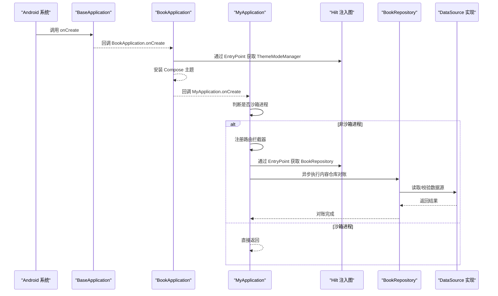
```mermaid
sequenceDiagram
    participant AMS as "Android 系统"
    participant BaseApp as "BaseApplication"
    participant BookApp as "BookApplication"
    participant MyApp as "MyApplication"
    participant Hilt as "Hilt 注入图"
    participant Repo as "BookRepository"
    participant Net as "DataSource 实现"

    AMS->>BaseApp: 调用 onCreate
    BaseApp-->>BookApp: 回调 BookApplication.onCreate
    BookApp->>Hilt: 通过 EntryPoint 获取 ThemeModeManager
    BookApp-->>BookApp: 安装 Compose 主题
    BookApp-->>MyApp: 回调 MyApplication.onCreate
    MyApp->>MyApp: 判断是否沙箱进程
    alt 非沙箱进程
        MyApp->>MyApp: 注册路由拦截器
        MyApp->>Hilt: 通过 EntryPoint 获取 BookRepository
        MyApp->>Repo: 异步执行内容仓库对账
        Repo->>Net: 读取/校验数据源
        Net-->>Repo: 返回结果
        Repo-->>MyApp: 对账完成
    else 沙箱进程
        MyApp-->>MyApp: 直接返回
    end
```

**图表来源**
- [BookApplication.kt:1-64](file://lib_book_common/src/main/java/com/ebook/common/BookApplication.kt#L1-L64)
- [MyApplication.kt:1-66](file://module_app/src/main/java/com/ebook/MyApplication.kt#L1-L66)
- [SandboxProcess.kt:1-28](file://lib_book_source/src/main/java/com/ebook/source/sandbox/SandboxProcess.kt#L1-L28)

## 详细组件分析

### MyApplication：应用入口与业务初始化
MyApplication 的核心职责包括：
- 标记为 Hilt 应用类，使 Hilt 能够生成注入代码。
- 在 super.onCreate 之后立即判断沙箱进程，避免在隔离进程中执行 UI 或存储相关逻辑。
- 注册登录路由拦截器。
- 延迟通过 Hilt EntryPoint 获取 BookRepository，并异步执行内容仓库对账；对账失败仅记录日志，不阻断应用启动。
- 明确禁止在 Application 字段上进行 eager 注入，以避免在 JS 或其他非 Android 环境中误触发 Room 等 Android 依赖。

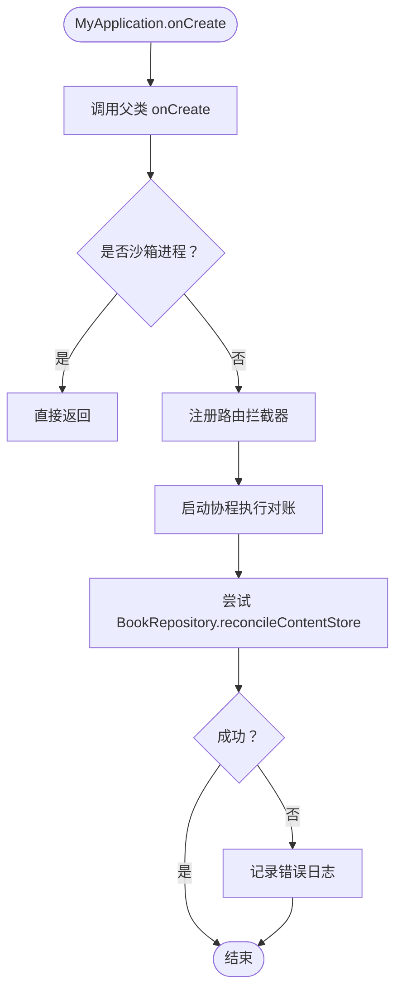
```mermaid
flowchart TD
    Start(["MyApplication.onCreate"]) --> SuperCall["调用父类 onCreate"]
    SuperCall --> CheckSandbox{"是否沙箱进程？"}
    CheckSandbox -->|是| ReturnEarly["直接返回"]
    CheckSandbox -->|否| RegisterInterceptor["注册路由拦截器"]
    RegisterInterceptor --> LaunchAsync["启动协程执行对账"]
    LaunchAsync --> TryReconcile["尝试 BookRepository.reconcileContentStore"]
    TryReconcile --> Success{"成功？"}
    Success -->|是| End(["结束"])
    Success -->|否| LogError["记录错误日志"]
    LogError --> End
```

**图表来源**
- [MyApplication.kt:1-66](file://module_app/src/main/java/com/ebook/MyApplication.kt#L1-L66)

**章节来源**
- [MyApplication.kt:1-66](file://module_app/src/main/java/com/ebook/MyApplication.kt#L1-L66)

### BookApplication：主题装配与基类生命周期
BookApplication 负责：
- 再次判断沙箱进程，避免在隔离进程中初始化主题与 SharedPreferences。
- 安装 Compose 主题，并根据 ThemeModeManager 的持久化状态决定浅色、深色或跟随系统。
- 通过 Hilt EntryPoint 获取 ThemeModeManager 并挂入伴生对象，供 Compose 重组时读取。

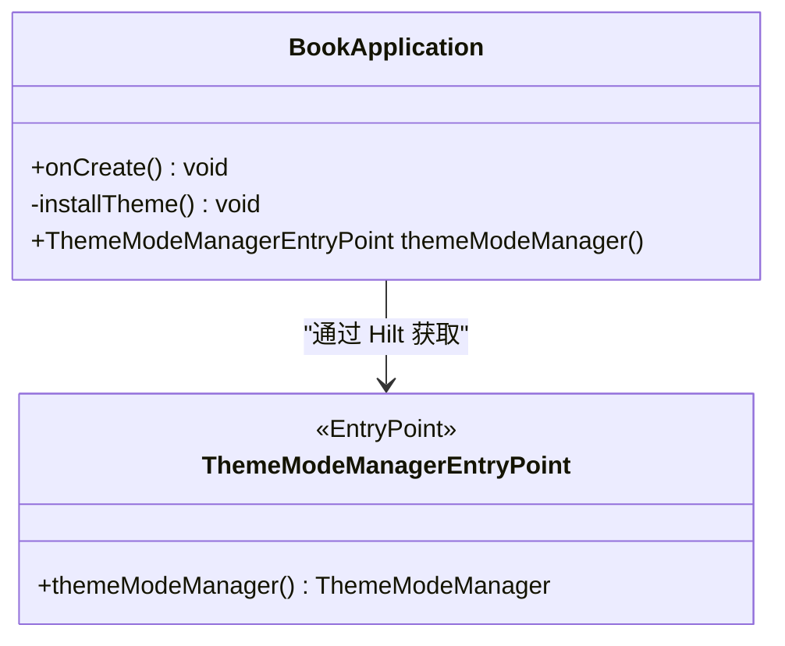
```mermaid
classDiagram
    class BookApplication {
        +onCreate() void
        -installTheme() void
        +ThemeModeManagerEntryPoint themeModeManager()
    }
    class ThemeModeManagerEntryPoint {
        <<EntryPoint>>
        +themeModeManager() ThemeModeManager
    }
    BookApplication --> ThemeModeManagerEntryPoint : "通过 Hilt 获取"
```

**图表来源**
- [BookApplication.kt:1-64](file://lib_book_common/src/main/java/com/ebook/common/BookApplication.kt#L1-L64)

**章节来源**
- [BookApplication.kt:1-64](file://lib_book_common/src/main/java/com/ebook/common/BookApplication.kt#L1-L64)

### SandboxProcess：沙箱进程判断
SandboxProcess 提供单一入口判断当前进程是否为系统隔离进程：
- 优先检查 SDK 版本，再调用 Process.isIsolated。
- 保证在低版本设备上不会发生 NoSuchMethodError。
- 单测环境下 SDK_INT 为 0，因此判据恒为 false，便于 JVM 测试。

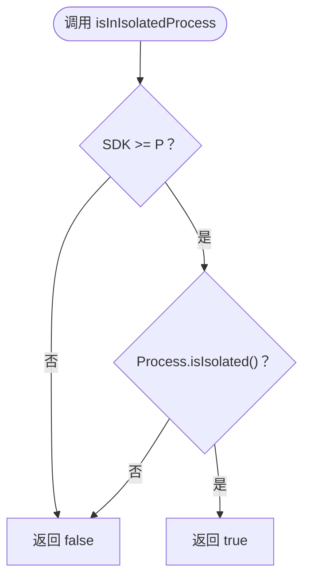
```mermaid
flowchart TD
    Enter(["调用 isInIsolatedProcess"]) --> CheckSDK{"SDK >= P？"}
    CheckSDK -->|否| NotIsolated["返回 false"]
    CheckSDK -->|是| CheckProcess{"Process.isIsolated()？"}
    CheckProcess -->|是| Isolated["返回 true"]
    CheckProcess -->|否| NotIsolated
```

**图表来源**
- [SandboxProcess.kt:1-28](file://lib_book_source/src/main/java/com/ebook/source/sandbox/SandboxProcess.kt#L1-L28)

**章节来源**
- [SandboxProcess.kt:1-28](file://lib_book_source/src/main/java/com/ebook/source/sandbox/SandboxProcess.kt#L1-L28)

### NetworkModule：real 与 mock 网络实现
两个同名但位于不同 flavor source set 的 NetworkModule 通过 @Binds 将抽象 DataSource 绑定到具体实现：
- real 绑定真实 UserNetwork、CommentNetwork、ReleaseNetwork。
- mock 绑定内存或本地 JSON 载荷的 UserNetworkTest、CommentNetworkTest、ReleaseNetworkTest。
- 两者互斥，由 Gradle flavor dimension 控制。

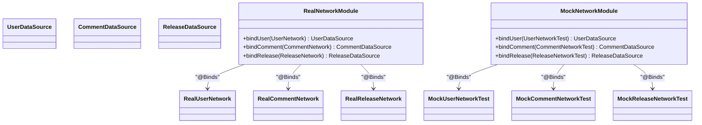
```mermaid
classDiagram
    class UserDataSource
    class CommentDataSource
    class ReleaseDataSource

    class RealUserNetwork
    class RealCommentNetwork
    class RealReleaseNetwork

    class MockUserNetworkTest
    class MockCommentNetworkTest
    class MockReleaseNetworkTest

    class RealNetworkModule {
        +bindUser(UserNetwork) UserDataSource
        +bindComment(CommentNetwork) CommentDataSource
        +bindRelease(ReleaseNetwork) ReleaseDataSource
    }

    class MockNetworkModule {
        +bindUser(UserNetworkTest) UserDataSource
        +bindComment(CommentNetworkTest) CommentDataSource
        +bindRelease(ReleaseNetworkTest) ReleaseDataSource
    }

    RealNetworkModule --> RealUserNetwork : "@Binds"
    RealNetworkModule --> RealCommentNetwork : "@Binds"
    RealNetworkModule --> RealReleaseNetwork : "@Binds"
    MockNetworkModule --> MockUserNetworkTest : "@Binds"
    MockNetworkModule --> MockCommentNetworkTest : "@Binds"
    MockNetworkModule --> MockReleaseNetworkTest : "@Binds"
```

**图表来源**
- [NetworkModule.kt（real）:1-35](file://module_app/src/real/java/com/ebook/di/NetworkModule.kt#L1-L35)
- [NetworkModule.kt（mock）:1-37](file://module_app/src/mock/java/com/ebook/di/NetworkModule.kt#L1-L37)

**章节来源**
- [NetworkModule.kt（real）:1-35](file://module_app/src/real/java/com/ebook/di/NetworkModule.kt#L1-L35)
- [NetworkModule.kt（mock）:1-37](file://module_app/src/mock/java/com/ebook/di/NetworkModule.kt#L1-L37)

## 依赖与构建配置

### AndroidManifest 关键项
- application 名称指向 com.ebook.MyApplication。
- 仅声明互联网、网络状态、前台服务三项权限，遵循最小权限原则。
- 相机特性 required=false，避免无相机设备被过滤。
- 启用 cleartext 流量和网络安全配置文件。

**章节来源**
- [AndroidManifest.xml:1-44](file://module_app/src/main/AndroidManifest.xml#L1-L44)

### build.gradle.kts 关键项
- 命名空间为 com.ebook。
- 版本号 APP_VERSION_NAME 为 1.4.0，versionCode 由三段式版本名反解生成。
- flavorDimensions 增加 network，productFlavors 提供 real 与 mock。
- mock flavor 追加 .mock 后缀，避免与 real 包冲突。
- release 类型开启 R8 混淆并使用 proguard-rules.pro。
- Java/Kotlin 编译目标为 17。
- 非 isModule 模式下依赖 module_main、module_find、module_me、module_book、module_login。

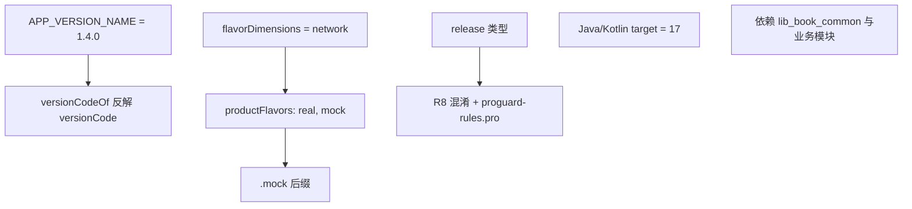
```mermaid
flowchart TD
    VersionName["APP_VERSION_NAME = 1.4.0"] --> CodeGen["versionCodeOf 反解 versionCode"]
    FlavorDim["flavorDimensions = network"] --> Flavors["productFlavors: real, mock"]
    Flavors --> AppIdSuffix[".mock 后缀"]
    BuildType["release 类型"] --> Minify["R8 混淆 + proguard-rules.pro"]
    CompileTarget["Java/Kotlin target = 17"]
    Deps["依赖 lib_book_common 与业务模块"]
```

**图表来源**
- [build.gradle.kts:1-96](file://module_app/build.gradle.kts#L1-L96)

**章节来源**
- [build.gradle.kts:1-96](file://module_app/build.gradle.kts#L1-L96)

### settings.gradle.kts 模块集合
根工程包含 module_app、lib_book_common、lib_book_source、module_main、module_book、module_find、module_me、lib_ebook_api、module_login、lib_ebook_db。module_app 作为应用聚合模块，组合各业务模块。

**章节来源**
- [settings.gradle.kts:1-65](file://settings.gradle.kts#L1-L65)

## 依赖注入与网络环境切换

### Hilt 初始化与 EntryPoint 使用
- MyApplication 使用 @HiltAndroidApp 注解，使 Hilt 在 Application 生命周期中生成注入代码。
- 为避免在 Application 字段上 eager 注入导致 JS 或非 Android 环境崩溃，MyApplication 使用 @EntryPoint + @InstallIn(SingletonComponent::class) 暴露 ContentStoreEntryPoint，仅在需要时通过 EntryPointAccessors 获取 BookRepository。
- BookApplication 也通过 ThemeModeManagerEntryPoint 以同样方式获取 ThemeModeManager。

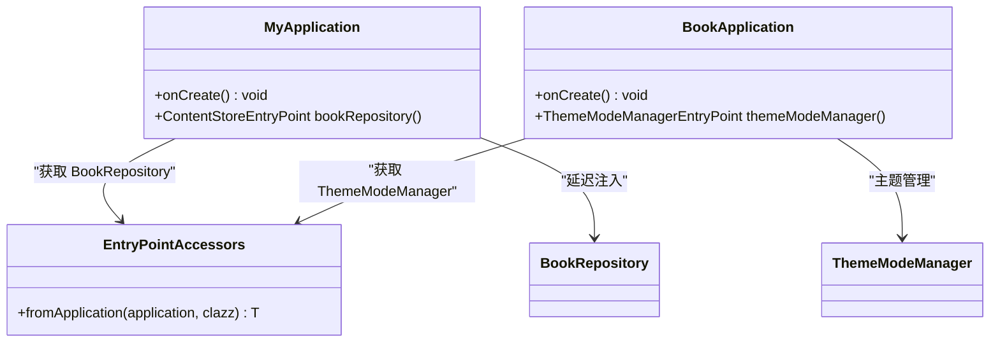
```mermaid
classDiagram
    class MyApplication {
        +onCreate() void
        +ContentStoreEntryPoint bookRepository()
    }
    class BookApplication {
        +onCreate() void
        +ThemeModeManagerEntryPoint themeModeManager()
    }
    class EntryPointAccessors {
        +fromApplication(application, clazz) T
    }
    class BookRepository
    class ThemeModeManager

    MyApplication --> EntryPointAccessors : "获取 BookRepository"
    BookApplication --> EntryPointAccessors : "获取 ThemeModeManager"
    MyApplication --> BookRepository : "延迟注入"
    BookApplication --> ThemeModeManager : "主题管理"
```

**图表来源**
- [MyApplication.kt:1-66](file://module_app/src/main/java/com/ebook/MyApplication.kt#L1-L66)
- [BookApplication.kt:1-64](file://lib_book_common/src/main/java/com/ebook/common/BookApplication.kt#L1-L64)

**章节来源**
- [MyApplication.kt:1-66](file://module_app/src/main/java/com/ebook/MyApplication.kt#L1-L66)
- [BookApplication.kt:1-64](file://lib_book_common/src/main/java/com/ebook/common/BookApplication.kt#L1-L64)

### 网络环境切换机制
- real flavor：NetworkModule 绑定真实 UserNetwork、CommentNetwork、ReleaseNetwork。
- mock flavor：NetworkModule 绑定 UserNetworkTest、CommentNetworkTest、ReleaseNetworkTest，后者使用本地 JSON 资产模拟后端响应。
- ReleaseDataSource 在 real 中打 GitHub/Gitcode Releases API，在 mock 中使用固定 release_latest.json，以保证离线可演练更新弹窗。

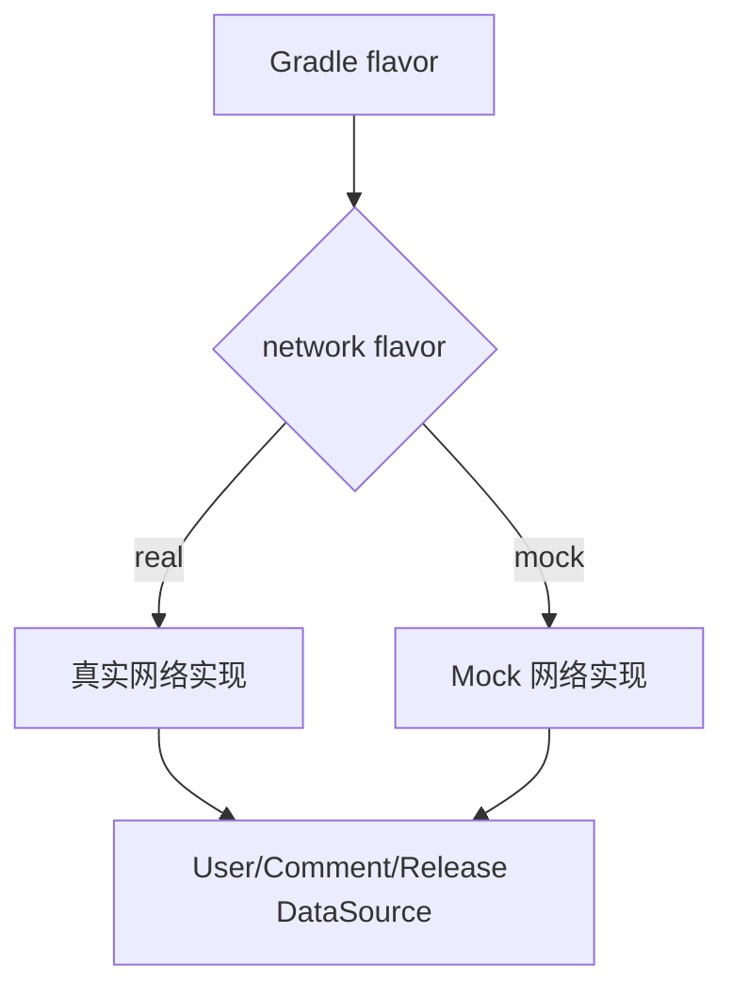
```mermaid
flowchart TD
    Flavor["Gradle flavor"] --> Choice{"network flavor"}
    Choice -->|real| RealImpl["真实网络实现"]
    Choice -->|mock| MockImpl["Mock 网络实现"]
    RealImpl --> DataSource["User/Comment/Release DataSource"]
    MockImpl --> DataSource
```

**图表来源**
- [NetworkModule.kt（real）:1-35](file://module_app/src/real/java/com/ebook/di/NetworkModule.kt#L1-L35)
- [NetworkModule.kt（mock）:1-37](file://module_app/src/mock/java/com/ebook/di/NetworkModule.kt#L1-L37)

**章节来源**
- [NetworkModule.kt（real）:1-35](file://module_app/src/real/java/com/ebook/di/NetworkModule.kt#L1-L35)
- [NetworkModule.kt（mock）:1-37](file://module_app/src/mock/java/com/ebook/di/NetworkModule.kt#L1-L37)

## 应用启动流程

### 启动时序
1. Android 创建 Application。
2. BaseApplication → BookApplication.onCreate：
   - 判断沙箱进程并跳过主题初始化。
   - 安装 Compose 主题。
   - 通过 Hilt EntryPoint 获取 ThemeModeManager。
3. MyApplication.onCreate：
   - 再次判断沙箱进程。
   - 注册路由拦截器。
   - 启动协程异步执行内容仓库对账。
4. 依赖注入图在 Hilt 初始化后可用，DataSource 实现由 flavor 决定。

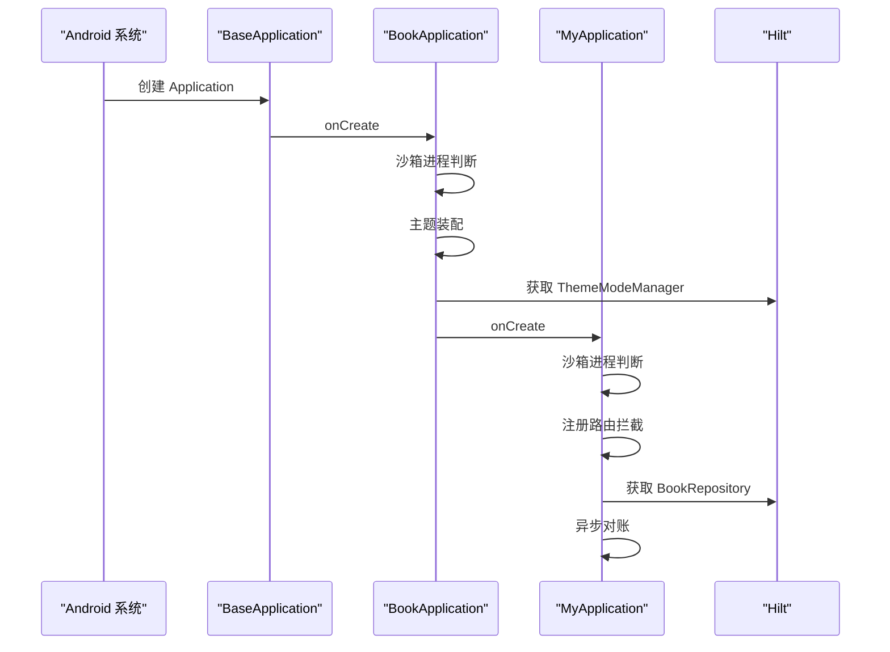
```mermaid
sequenceDiagram
    participant System as "Android 系统"
    participant Base as "BaseApplication"
    participant Common as "BookApplication"
    participant App as "MyApplication"
    participant DI as "Hilt"

    System->>Base: 创建 Application
    Base->>Common: onCreate
    Common->>Common: 沙箱进程判断
    Common->>Common: 主题装配
    Common->>DI: 获取 ThemeModeManager
    Common->>App: onCreate
    App->>App: 沙箱进程判断
    App->>App: 注册路由拦截
    App->>DI: 获取 BookRepository
    App->>App: 异步对账
```

**图表来源**
- [BookApplication.kt:1-64](file://lib_book_common/src/main/java/com/ebook/common/BookApplication.kt#L1-L64)
- [MyApplication.kt:1-66](file://module_app/src/main/java/com/ebook/MyApplication.kt#L1-L66)

**章节来源**
- [BookApplication.kt:1-64](file://lib_book_common/src/main/java/com/ebook/common/BookApplication.kt#L1-L64)
- [MyApplication.kt:1-66](file://module_app/src/main/java/com/ebook/MyApplication.kt#L1-L66)

### 环境判断与错误处理
- 沙箱进程：通过 SandboxProcess.isInIsolatedProcess 判断，避免在隔离进程中执行 UI、SharedPreferences 等不可用操作。
- 内容仓库对账：使用 runCatching 捕获异常并记录日志，确保对账失败不影响应用启动。
- 网络实现：由 flavor 决定，mock 构建无需真实后端，real 构建依赖后端可达性。

**章节来源**
- [SandboxProcess.kt:1-28](file://lib_book_source/src/main/java/com/ebook/source/sandbox/SandboxProcess.kt#L1-L28)
- [MyApplication.kt:1-66](file://module_app/src/main/java/com/ebook/MyApplication.kt#L1-L66)
- [NetworkModule.kt（mock）:1-37](file://module_app/src/mock/java/com/ebook/di/NetworkModule.kt#L1-L37)

## 扩展指南

### 添加新的网络实现
若需要新增一个数据源，例如 NewDataSource：
1. 在 lib_ebook_api 或对应库中定义 NewDataSource 接口。
2. 在 real 源集中实现 NewNetwork，并在 real 的 NetworkModule 中添加 @Binds fun bindNew(impl: NewNetwork): NewDataSource。
3. 在 mock 源集中实现 NewNetworkTest，并在 mock 的 NetworkModule 中添加 @Binds fun bindNew(impl: NewNetworkTest): NewDataSource。
4. 在需要使用的模块中通过 Hilt 注入 NewDataSource，无需关心 flavor。

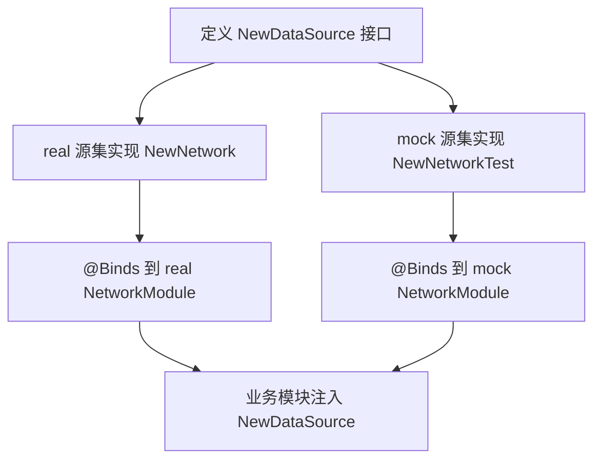
```mermaid
flowchart TD
    Define["定义 NewDataSource 接口"] --> RealImpl["real 源集实现 NewNetwork"]
    Define --> MockImpl["mock 源集实现 NewNetworkTest"]
    RealImpl --> BindReal["@Binds 到 real NetworkModule"]
    MockImpl --> BindMock["@Binds 到 mock NetworkModule"]
    BindReal --> Use["业务模块注入 NewDataSource"]
    BindMock --> Use
```

**图表来源**
- [NetworkModule.kt（real）:1-35](file://module_app/src/real/java/com/ebook/di/NetworkModule.kt#L1-L35)
- [NetworkModule.kt（mock）:1-37](file://module_app/src/mock/java/com/ebook/di/NetworkModule.kt#L1-L37)

**章节来源**
- [NetworkModule.kt（real）:1-35](file://module_app/src/real/java/com/ebook/di/NetworkModule.kt#L1-L35)
- [NetworkModule.kt（mock）:1-37](file://module_app/src/mock/java/com/ebook/di/NetworkModule.kt#L1-L37)

### 添加新的模块依赖
如果需要在应用启动时加载新模块：
1. 在 settings.gradle.kts 中 include 新模块。
2. 在 module_app/build.gradle.kts 的 dependencies 块中添加 implementation(project(":new_module"))。
3. 若新模块有独立 flavor 或资源，确保其 AndroidManifest 与资源命名不与现有模块冲突。
4. 若新模块依赖 Hilt，确保其 Module 安装在 SingletonComponent 并提供正确的 @Binds/@Provides。

**章节来源**
- [settings.gradle.kts:1-65](file://settings.gradle.kts#L1-L65)
- [build.gradle.kts:1-96](file://module_app/build.gradle.kts#L1-L96)

## 调试与问题排查

### 常见初始化问题
- Application 字段注入导致 JS 或非 Android 环境崩溃：应使用 @EntryPoint 延迟注入，而非字段注入。
- 沙箱进程误判导致未初始化：检查 SandboxProcess 的 SDK 版本判断与 Process.isIsolated 调用顺序。
- mock flavor 仍请求真实后端：确认 gradle task 使用的是 mock flavor，且 NetworkModule 绑定的是 Mock 实现。
- 内容仓库对账失败影响启动：对账失败只记录日志，不影响启动；需查看日志定位具体原因。
- 权限缺失导致功能异常：确认已声明 INTERNET、ACCESS_NETWORK_STATE、FOREGROUND_SERVICE，并检查网络安全性配置。

### 调试技巧
- 使用 mock flavor 进行离线联调，避免依赖外部服务器。
- 在 MyApplication 中对账逻辑周围增加日志，观察协程执行时机。
- 通过 Hilt 生成的组件路径验证注入图是否正确装配。
- 对比 real 与 mock 的 NetworkModule，确认 flavor 正确切换。
- 使用 Android Studio 的进程列表确认是否进入沙箱进程。

**章节来源**
- [MyApplication.kt:1-66](file://module_app/src/main/java/com/ebook/MyApplication.kt#L1-L66)
- [SandboxProcess.kt:1-28](file://lib_book_source/src/main/java/com/ebook/source/sandbox/SandboxProcess.kt#L1-L28)
- [AndroidManifest.xml:1-44](file://module_app/src/main/AndroidManifest.xml#L1-L44)
- [NetworkModule.kt（real）:1-35](file://module_app/src/real/java/com/ebook/di/NetworkModule.kt#L1-L35)
- [NetworkModule.kt（mock）:1-37](file://module_app/src/mock/java/com/ebook/di/NetworkModule.kt#L1-L37)

## 结论
module_app 作为应用入口模块，承担了 Hilt 初始化、沙箱进程隔离、路由拦截、内容仓库对账以及 flavor 维度的网络环境切换等关键职责。通过延迟注入、进程门和 flavor 替换，项目在保持灵活性的同时避免了在不适用环境中执行危险操作。开发者在扩展网络实现或新增模块依赖时，应遵循现有的 EntryPoint、@Binds 与 flavor source set 模式，以确保注入图稳定、构建产物可控、启动流程健壮。