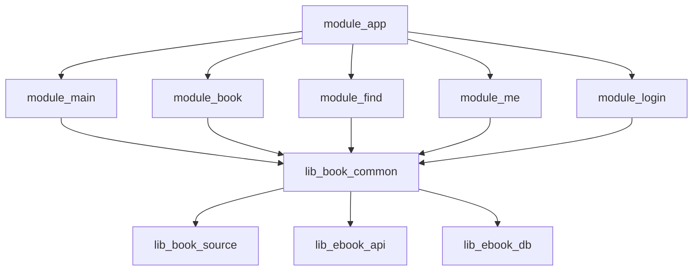
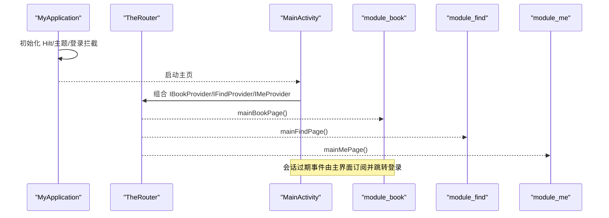
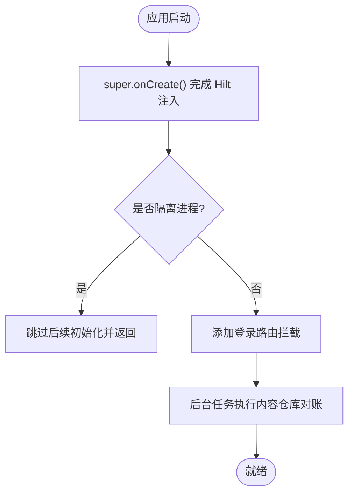
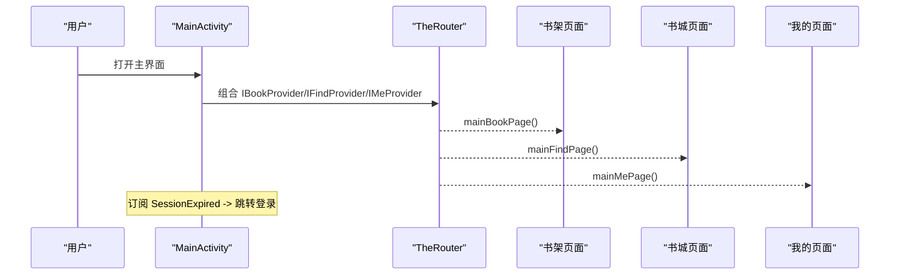
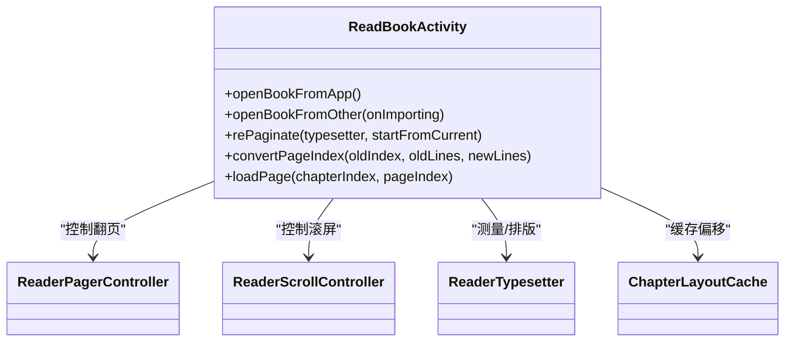
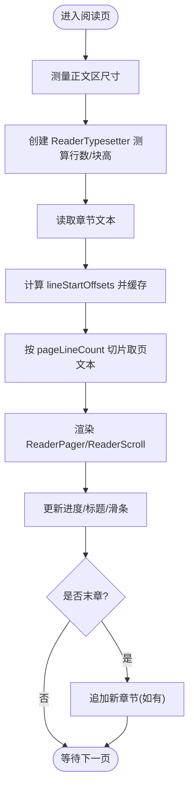
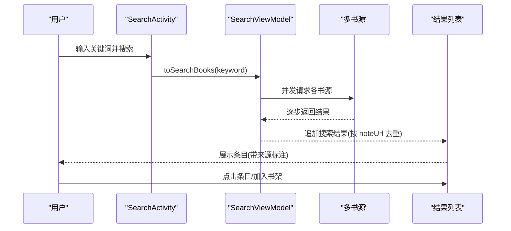
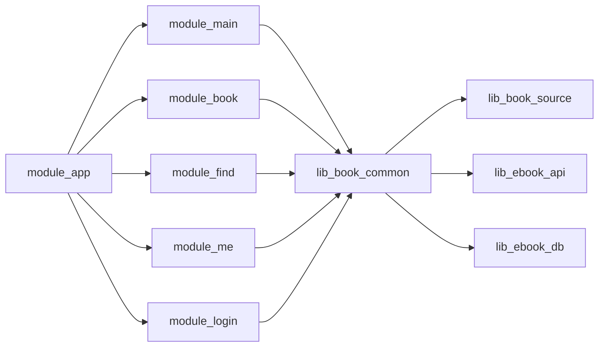

# 核心模块

<cite>
**本文引用的文件**
- [README.MD](file://README.MD)
- [MyApplication.kt](file://module_app/src/main/java/com/ebook/MyApplication.kt)
- [MainActivity.kt](file://module_main/src/main/java/com/ebook/main/MainActivity.kt)
- [ReadBookActivity.kt](file://module_book/src/main/java/com/ebook/book/ReadBookActivity.kt)
- [SearchActivity.kt](file://module_find/src/main/java/com/ebook/find/SearchActivity.kt)
- [BookApplication.kt](file://lib_book_common/src/main/java/com/ebook/common/BookApplication.kt)
- [RetrofitBuilder.kt](file://lib_ebook_api/src/main/java/com/ebook/api/RetrofitBuilder.kt)
- [AppDatabase.kt](file://lib_ebook_db/src/main/java/com/ebook/db/AppDatabase.kt)
</cite>

## 目录
1. [简介](#简介)
2. [项目结构](#项目结构)
3. [核心组件](#核心组件)
4. [架构总览](#架构总览)
5. [详细组件分析](#详细组件分析)
6. [依赖关系分析](#依赖关系分析)
7. [性能考量](#性能考量)
8. [故障排查指南](#故障排查指南)
9. [结论](#结论)

## 简介
本项目是一个基于 Kotlin、MVVM、Compose 的安卓小说阅读器，采用多模块与共享库解耦设计。应用入口负责 Hilt 初始化、双构建模式（real/mock）与路由拦截；主界面提供底部导航与 Tab 容器；书籍阅读模块实现翻页/滚屏两种模式、分页排版、阅读设置与章节下载；书城搜索模块实现多书源聚合搜索与分类浏览；个人中心管理缓存与设置；登录模块处理认证与会话；共享库提供通用 UI、Provider 接口与业务基类；网络库封装 Retrofit/OkHttp；数据库库以 Room 组织实体与 DAO；书源库实现规则解析与 JS 沙箱执行器。

**Section sources**
- [README.MD:10-120](file://README.MD#L10-L120)

## 项目结构
依赖方向遵循：业务模块 → lib_book_common → lib_book_source → lib_ebook_api / lib_ebook_db。功能模块互不直接依赖，跨模块通过 TheRouter + Provider 进行导航与服务调用。

**Diagram sources**
- [README.MD:86-104](file://README.MD#L86-L104)

**Section sources**
- [README.MD:86-104](file://README.MD#L86-L104)

## 核心组件
- 应用入口（module_app）：Hilt 装配、登录拦截、内容仓库对账、隔离进程门控。
- 主界面（module_main）：底部导航、NavHost 组合三个 Tab 页面，会话过期统一处置。
- 书籍阅读（module_book）：ReaderPager/ReaderScroll 控制器、ReaderTypesetter 排版、进度保存与换源、下载中心入口。
- 书城搜索（module_find）：多书源并发聚合、历史面板与清除动画、加载更多。
- 个人中心（module_me）：缓存管理、设置与关于（版本检查、协议）。
- 登录（module_login）：邮箱为主标识、三步注册、双 token 静默续期、密码不落盘。
- 共享库（lib_book_common）：主题装配、Provider 接口、BaseViewModel/Activity、UI 组件与工具。
- 网络库（lib_ebook_api）：RetrofitBuilder、数据实体、OkHttp 拦截器。
- 数据库库（lib_ebook_db）：Room 数据库装配、八张表、迁移策略。
- 书源库（lib_book_source）：原生解析器、脚本解释器、JS 沙箱执行器（QuickJS + JNI）。

**Section sources**
- [README.MD:86-120](file://README.MD#L86-L120)

## 架构总览
整体采用 MVVM + Compose，Hilt 注入，协程 Flow 异步，TheRouter 跨模块导航。阅读页将“正文层”和“控制层”分离：正文使用阅读背景主题（四档纸张色），控制层随深浅色切换。书城与搜索通过多书源聚合，结果标注所属源；默认源由 Room 计算，首帧 Unknown 留空态。

**Diagram sources**
- [MyApplication.kt:19-61](file://module_app/src/main/java/com/ebook/MyApplication.kt#L19-L61)
- [MainActivity.kt:57-97](file://module_main/src/main/java/com/ebook/main/MainActivity.kt#L57-L97)
- [MainActivity.kt:139-197](file://module_main/src/main/java/com/ebook/main/MainActivity.kt#L139-L197)

**Section sources**
- [MyApplication.kt:19-61](file://module_app/src/main/java/com/ebook/MyApplication.kt#L19-L61)
- [MainActivity.kt:57-97](file://module_main/src/main/java/com/ebook/main/MainActivity.kt#L57-L97)
- [MainActivity.kt:139-197](file://module_main/src/main/java/com/ebook/main/MainActivity.kt#L139-L197)

## 详细组件分析

### 应用入口模块（module_app）
- 初始化流程：在 Application 中调用父类初始化（含 Hilt 注入与 lib_common 基类初始化），随后添加路由登录拦截器，并在独立作用域内执行内容仓库对账（回收无主目录）。
- Hilt 配置：通过 @HiltAndroidApp 标记，使用 EntryPointAccessors 延迟获取 BookRepository，避免在隔离进程触发注入导致崩溃。
- 双构建模式：real/mock flavor 通过不同 NetworkModule 注入真实或内存数据源；独立模块开发时可通过 isModule=true 让功能模块作为独立 App 运行。

**Diagram sources**
- [MyApplication.kt:24-43](file://module_app/src/main/java/com/ebook/MyApplication.kt#L24-L43)

**Section sources**
- [MyApplication.kt:19-61](file://module_app/src/main/java/com/ebook/MyApplication.kt#L19-L61)
- [README.MD:60-84](file://README.MD#L60-L84)

### 主界面模块（module_main）
- 主界面架构：继承 Compose 基类，禁用 Toolbar，启用沉浸式状态栏避让交由各 Tab 自行处理；使用 Scaffold + NavigationBar + NavHost 承载三个 Tab。
- 底部导航：选中态由回退栈派生，单一数据源避免状态不一致。
- 路由配置：通过 TheRouter 获取 Provider 暴露的 Composable 页面（IBookProvider.mainBookPage、IFindProvider.mainFindPage、IMeProvider.mainMePage）。
- 会话控制：订阅 SessionEventBus 的 SessionExpired 事件，清会话、提示并跳转登录页。

**Diagram sources**
- [MainActivity.kt:57-97](file://module_main/src/main/java/com/ebook/main/MainActivity.kt#L57-L97)
- [MainActivity.kt:139-197](file://module_main/src/main/java/com/ebook/main/MainActivity.kt#L139-L197)

**Section sources**
- [MainActivity.kt:57-97](file://module_main/src/main/java/com/ebook/main/MainActivity.kt#L57-L97)
- [MainActivity.kt:139-197](file://module_main/src/main/java/com/ebook/main/MainActivity.kt#L139-L197)

### 书籍阅读模块（module_book）
- 阅读器核心逻辑：包含 ReaderPager（三页窗口状态机）与 ReaderScroll（连续列表）两套控制器，共用同一套排版与加载逻辑；音量键支持翻页与滚一屏。
- 分页排版系统：通过 ReaderTypesetter 实测行数与块高，按当前样式生成 lineStartOffsets；ChapterLayoutCache 缓存同章排版偏移；loadPage 按 pageLineCount 切片取原文子串渲染。
- 阅读设置管理：字体、背景、段落间距变化通过版本号驱动重组，触发 rePaginate 重新测算与定位；亮度通过 applyReaderBrightness 恢复。
- 章节下载功能：菜单入口进入 DownloadManageActivity，携带 note_url、tag、durChapter 等参数；下载任务需先入库再拉起前台服务。

**Diagram sources**
- [ReadBookActivity.kt:86-144](file://module_book/src/main/java/com/ebook/book/ReadBookActivity.kt#L86-L144)
- [ReadBookActivity.kt:251-290](file://module_book/src/main/java/com/ebook/book/ReadBookActivity.kt#L251-L290)
- [ReadBookActivity.kt:308-377](file://module_book/src/main/java/com/ebook/book/ReadBookActivity.kt#L308-L377)

**Diagram sources**
- [ReadBookActivity.kt:508-560](file://module_book/src/main/java/com/ebook/book/ReadBookActivity.kt#L508-L560)
- [ReadBookActivity.kt:527-542](file://module_book/src/main/java/com/ebook/book/ReadBookActivity.kt#L527-L542)

**Section sources**
- [ReadBookActivity.kt:86-144](file://module_book/src/main/java/com/ebook/book/ReadBookActivity.kt#L86-L144)
- [ReadBookActivity.kt:251-290](file://module_book/src/main/java/com/ebook/book/ReadBookActivity.kt#L251-L290)
- [ReadBookActivity.kt:308-377](file://module_book/src/main/java/com/ebook/book/ReadBookActivity.kt#L308-L377)
- [ReadBookActivity.kt:508-560](file://module_book/src/main/java/com/ebook/book/ReadBookActivity.kt#L508-L560)
- [ReadBookActivity.kt:527-542](file://module_book/src/main/java/com/ebook/book/ReadBookActivity.kt#L527-L542)

### 书城搜索模块（module_find）
- 多书源搜索：发起搜索后，多个书源并发聚合结果，边收边追加到列表；每轮显示源进度行，全部结束（含失败）即消失。
- 分类浏览：书城顶部可切换浏览源，默认源由 Room 现算，首帧 Unknown 留空态；分类条目来源包括原生 kinds 与脚本 exploreUrl。
- 搜索结果处理：以 noteUrl 为 key，重复出现会抛异常防止 LazyColumn 冲突；点击条目跳转详情页；支持加入书架与搜索历史快捷点选与一键清除（粒子爆炸动画）。

**Diagram sources**
- [SearchActivity.kt:129-156](file://module_find/src/main/java/com/ebook/find/SearchActivity.kt#L129-L156)
- [SearchActivity.kt:244-294](file://module_find/src/main/java/com/ebook/find/SearchActivity.kt#L244-L294)

**Section sources**
- [SearchActivity.kt:129-156](file://module_find/src/main/java/com/ebook/find/SearchActivity.kt#L129-L156)
- [SearchActivity.kt:244-294](file://module_find/src/main/java/com/ebook/find/SearchActivity.kt#L244-L294)
- [SearchActivity.kt:354-380](file://module_find/src/main/java/com/ebook/find/SearchActivity.kt#L354-L380)

### 个人中心模块（module_me）
- 用户信息管理：昵称/头像修改（拍照/相册 + 圆形裁剪）、评论管理（长按删除）。
- 缓存管理：区分 cacheDir（图片/临时/其他）与 books 目录占用统计；仅清理 cacheDir，书籍删除唯一入口在书架页。
- 设置配置：主题模式（浅色/深色/跟随系统）、关于（用户协议/隐私政策/开源许可）、版本更新检查（ReleaseRepository 策略）。

**Section sources**
- [README.MD:18-25](file://README.MD#L18-L25)

### 登录模块（module_login）
- 用户认证流程：邮箱为主标识，三步注册（发码→建号→登录），忘记密码走邮箱验证码，已登录可凭旧密码改密。
- Token 管理：access token 只驻内存不落盘，refresh token 持久化；A0230 过期单飞静默刷新，失败则统一会话过期处置。
- 会话控制：SessionEventBus 集中处理会话过期事件，主界面订阅并跳转登录页。

**Section sources**
- [README.MD:17-19](file://README.MD#L17-L19)
- [MainActivity.kt:68-79](file://module_main/src/main/java/com/ebook/main/MainActivity.kt#L68-L79)

### 共享库（lib_book_common）
- 通用组件：Compose UI 组件（卡片/列表项/标签/封面/头像）、CommonUiTokens 设计常量。
- Provider 接口定义：IBookProvider、IFindProvider、IMeProvider 暴露主 Tab 的 Composable 页面。
- 业务基类：BaseViewModel/BaseRefreshViewModel、BaseMvvmActivity/BaseMvvmRefreshActivity，统一命令通道与覆盖层。
- 主题装配：BookApplication 安装 AppTheme，根据 ThemeModeManager 选择深浅色。

**Section sources**
- [BookApplication.kt:17-49](file://lib_book_common/src/main/java/com/ebook/common/BookApplication.kt#L17-L49)
- [README.MD:97-120](file://README.MD#L97-L120)

### 网络库（lib_ebook_api）
- Retrofit 服务定义：通过 RetrofitBuilder 复用 Hilt 提供的 Call.Factory（AuthInterceptor + 白名单 + debug 日志），显式注册 kotlinx 转换器与 ScalarsConverterFactory。
- 数据实体模型：位于 service/entity 包，按后端契约序列化。
- 网络拦截器：AuthInterceptor 附加 access token（仅白名单 host），EncodingInterceptor 处理编码问题。

**Section sources**
- [RetrofitBuilder.kt:13-44](file://lib_ebook_api/src/main/java/com/ebook/api/RetrofitBuilder.kt#L13-L44)
- [README.MD:116-120](file://README.MD#L116-L120)

### 数据库库（lib_ebook_db）
- Room 实体设计：八张表（书架、书籍信息、章节目录、搜索历史、下载队列、作品分组、书源、按书暂停标记），自然键与自增键并存策略。
- DAO 接口：AppDatabase 暴露各表的 DAO 方法，读写由上层仓库调用。
- 数据迁移策略：version 递增、迁移链紧邻追加、导出 schema JSON，禁止 fallbackToDestructiveMigration。

**Section sources**
- [AppDatabase.kt:8-76](file://lib_ebook_db/src/main/java/com/ebook/db/AppDatabase.kt#L8-L76)
- [README.MD:174-178](file://README.MD#L174-L178)

### 书源库（lib_book_source）
- 书源解析引擎：原生解析器（Jsoup）与脚本解释器（规则词法/求值/取文）共存，按 SourceDefinition 路由。
- JavaScript 沙箱：vendored QuickJS + JNI 桥，零权限隔离进程，主线程守卫防止回调死锁。
- 规则解析器：ScriptRuleSet 装载 JSON 规则，首次求值才执行，错误类型化抛出便于区分“未装配执行器”与“执行失败”。

**Section sources**
- [README.MD:97-120](file://README.MD#L97-L120)

## 依赖关系分析
模块间依赖严格分层，功能模块通过 Provider 接口与 TheRouter 解耦，共享库提供领域通用能力，基础库提供网络与存储能力。

**Diagram sources**
- [README.MD:86-104](file://README.MD#L86-L104)

**Section sources**
- [README.MD:86-104](file://README.MD#L86-L104)

## 性能考量
- 阅读排版：使用 ReaderTypesetter 实测行数与块高，避免心算误差；ChapterLayoutCache 缓存同章偏移减少重复计算。
- 列表分页：书城与搜索页以 noteUrl 为 key 去重，避免 LazyColumn 冲突；触底加载通过基类 RefreshableList 统一管理。
- 网络请求：RetrofitBuilder 复用 Call.Factory，避免重复创建 OkHttpClient；debug 脱敏日志提升调试效率。
- 数据库迁移：严格迁移链与 schema 导出，确保升级过程稳定可靠。

[本节为通用指导，无需具体文件分析]

## 故障排查指南
- 阅读页空白：检查 loadPage 返回值是否为 null，确认 readerTypesetter 与 pageLineCount 是否就绪；若书源失效，会报告 failure 并提示重新导入或换源。
- 搜索无结果：确认多书源聚合是否全部结束，检查 SourceProgressRow 是否仍在运行；历史面板开合受键盘状态影响，无键盘环境有宽限期兜底。
- 会话过期：主界面订阅 SessionExpired 事件，清会话并跳转登录；若频繁过期，检查 refresh 逻辑与网络拦截器。
- 数据库升级失败：确认 version 递增、迁移链紧邻追加、schema JSON 提交；禁止启用 fallbackToDestructiveMigration。

**Section sources**
- [ReadBookActivity.kt:308-377](file://module_book/src/main/java/com/ebook/book/ReadBookActivity.kt#L308-L377)
- [SearchActivity.kt:129-156](file://module_find/src/main/java/com/ebook/find/SearchActivity.kt#L129-L156)
- [MainActivity.kt:68-79](file://module_main/src/main/java/com/ebook/main/MainActivity.kt#L68-L79)
- [AppDatabase.kt:35-39](file://lib_ebook_db/src/main/java/com/ebook/db/AppDatabase.kt#L35-L39)

## 结论
本项目通过清晰的多模块架构与共享库设计，实现了电子书阅读的核心功能：应用入口与主界面提供稳定的宿主与导航；阅读模块具备强大的分页排版与设置管理能力；书城搜索支持多书源聚合与交互体验；个人中心与登录模块完善用户体系；网络与数据库库提供可靠的底层支撑；书源库实现灵活的规则解析与沙箱执行。整体代码结构合理、职责分明，具备良好的可维护性与扩展性。

[本节为总结，无需具体文件分析]