# 核心模块

<cite>
**本文引用的文件**   
- [MyApplication.kt](file://module_app/src/main/java/com/ebook/MyApplication.kt)
- [MainActivity.kt](file://module_main/src/main/java/com/ebook/main/MainActivity.kt)
- [SplashActivity.kt](file://module_main/src/main/java/com/ebook/main/SplashActivity.kt)
- [IBookProvider.kt](file://lib_book_common/src/main/java/com/ebook/common/provider/IBookProvider.kt)
- [IFindProvider.kt](file://lib_book_common/src/main/java/com/ebook/common/provider/IFindProvider.kt)
- [IMeProvider.kt](file://lib_book_common/src/main/java/com/ebook/common/provider/IMeProvider.kt)
- [BookProvider.kt](file://module_book/src/main/java/com/ebook/book/provider/BookProvider.kt)
- [FindProvider.kt](file://module_find/src/main/java/com/ebook/find/provider/FindProvider.kt)
- [MeProvider.kt](file://module_me/src/main/java/com/ebook/me/provider/MeProvider.kt)
- [LoginProvider.kt](file://module_login/src/main/java/com/ebook/login/provider/LoginProvider.kt)
- [BookDetailActivity.kt](file://module_book/src/main/java/com/ebook/book/BookDetailActivity.kt)
- [ReadBookActivity.kt](file://module_book/src/main/java/com/ebook/book/ReadBookActivity.kt)
- [SearchActivity.kt](file://module_find/src/main/java/com/ebook/find/SearchActivity.kt)
- [LoginActivity.kt](file://module_login/src/main/java/com/ebook/login/LoginActivity.kt)
</cite>

## 目录
1. [引言](#引言)
2. [项目结构](#项目结构)
3. [核心模块总览](#核心模块总览)
4. [应用入口与沙箱进程：module_app](#应用入口与沙箱进程module_app)
5. [主界面与底部导航：module_main](#主界面与底部导航module_main)
6. [书籍管理与阅读：module_book](#书籍管理与阅读module_book)
7. [书城搜索聚合：module_find](#书城搜索聚合module_find)
8. [个人中心：module_me](#个人中心module_me)
9. [登录与会话：module_login](#登录与会话module_login)
10. [模块间交互关系](#模块间交互关系)
11. [典型用户工作流](#典型用户工作流)
12. [依赖分析](#依赖分析)
13. [性能与可维护性要点](#性能与可维护性要点)
14. [故障排查指南](#故障排查指南)
15. [结论](#结论)

## 引言
本项目是一个 Android 小说阅读器，采用多模块架构：`module_app` 作为应用启动和全局初始化入口；`module_main` 提供主页容器和底部导航；`module_book` 管理书架、详情和阅读；`module_find` 负责书城搜索和多书源聚合；`module_me` 提供个人中心与设置；`module_login` 负责认证流程。模块之间通过 `lib_book_common` 中定义的 Provider 接口解耦，并通过 TheRouter 进行页面跳转。

## 项目结构
从业务角度，核心代码分布在以下模块：
- `module_app`：应用生命周期、Hilt 注入、路由拦截、内容仓库对账、沙箱进程门控。
- `module_main`：闪屏页、主页容器、三个 Tab 的 Compose 导航、会话过期统一处理。
- `module_book`：书架、书籍详情、阅读页、下载管理和导入等。
- `module_find`：书城首页、搜索结果页、历史面板、多书源并发聚合。
- `module_me`：用户信息、设置、缓存管理、书源管理等。
- `module_login`：登录、注册、找回密码、验证用户。
- `lib_book_common`：领域模型、数据库、网络、主题、共享 UI、Provider 接口等公共能力。

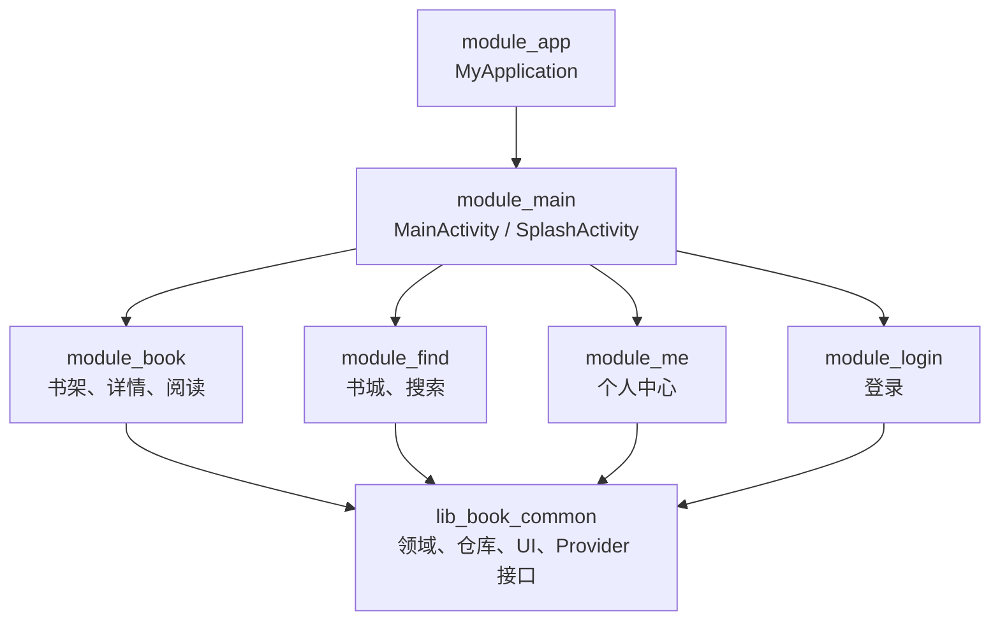
```mermaid
graph TB
    App["module_app<br/>MyApplication"] --> Main["module_main<br/>MainActivity / SplashActivity"]
    Main --> BookTab["module_book<br/>书架、详情、阅读"]
    Main --> FindTab["module_find<br/>书城、搜索"]
    Main --> MeTab["module_me<br/>个人中心"]
    Main --> Login["module_login<br/>登录"]
    BookTab --> Common["lib_book_common<br/>领域、仓库、UI、Provider 接口"]
    FindTab --> Common
    MeTab --> Common
    Login --> Common
```

**图表来源**
- [MyApplication.kt:1-66](file://module_app/src/main/java/com/ebook/MyApplication.kt#L1-L66)
- [MainActivity.kt:1-290](file://module_main/src/main/java/com/ebook/main/MainActivity.kt#L1-L290)
- [SplashActivity.kt:1-339](file://module_main/src/main/java/com/ebook/main/SplashActivity.kt#L1-L339)
- [BookDetailActivity.kt:1-528](file://module_book/src/main/java/com/ebook/book/BookDetailActivity.kt#L1-L528)
- [SearchActivity.kt:1-781](file://module_find/src/main/java/com/ebook/find/SearchActivity.kt#L1-L781)
- [LoginActivity.kt:1-323](file://module_login/src/main/java/com/ebook/login/LoginActivity.kt#L1-L323)

**章节来源**
- [MyApplication.kt:1-66](file://module_app/src/main/java/com/ebook/MyApplication.kt#L1-L66)
- [MainActivity.kt:1-290](file://module_main/src/main/java/com/ebook/main/MainActivity.kt#L1-L290)
- [SplashActivity.kt:1-339](file://module_main/src/main/java/com/ebook/main/SplashActivity.kt#L1-L339)

## 核心模块总览
| 模块 | 主要职责 | 关键类 | 对外暴露方式 |
|---|---|---|---|
| `module_app` | 应用初始化、Hilt、路由拦截、内容仓库对账、沙箱进程隔离 | `MyApplication` | 不直接暴露业务，提供全局 DI 与启动约束 |
| `module_main` | 闪屏加载、会话预载、主页容器、底部导航、会话过期处置 | `SplashActivity`、`MainActivity` | 作为宿主组合各模块 Compose 页面 |
| `module_book` | 书架展示、书籍详情、阅读体验、下载与导入 | `BookDetailActivity`、`ReadBookActivity` | 通过 `IBookProvider` 暴露书架页 |
| `module_find` | 书城、搜索输入、历史面板、多书源结果聚合 | `SearchActivity` | 通过 `IFindProvider` 暴露书城页 |
| `module_me` | 用户信息、设置、缓存、书源管理 | 多个 ViewModel 与页面 | 通过 `IMeProvider` 暴露我的页 |
| `module_login` | 邮箱密码登录、注册、重置密码、会话登出 | `LoginActivity` | 通过 `ILoginProvider` 暴露服务端登出能力 |

**章节来源**
- [IBookProvider.kt:1-23](file://lib_book_common/src/main/java/com/ebook/common/provider/IBookProvider.kt#L1-L23)
- [IFindProvider.kt:1-13](file://lib_book_common/src/main/java/com/ebook/common/provider/IFindProvider.kt#L1-L13)
- [IMeProvider.kt:1-13](file://lib_book_common/src/main/java/com/ebook/common/provider/IMeProvider.kt#L1-L13)
- [BookProvider.kt:1-16](file://module_book/src/main/java/com/ebook/book/provider/BookProvider.kt#L1-L16)
- [FindProvider.kt:1-19](file://module_find/src/main/java/com/ebook/find/provider/FindProvider.kt#L1-L19)
- [MeProvider.kt:1-20](file://module_me/src/main/java/com/ebook/me/provider/MeProvider.kt#L1-L20)
- [LoginProvider.kt:1-36](file://module_login/src/main/java/com/ebook/login/provider/LoginProvider.kt#L1-L36)

## 应用入口与沙箱进程：module_app
`MyApplication` 继承 `BookApplication`，是 Hilt 应用入口。其核心职责包括：
- 调用父类 `onCreate()`，确保 Hilt 组件创建和字段注入按契约执行。
- 若当前运行在沙箱进程，则直接返回，避免在主进程中误执行非沙箱逻辑。
- 注册路由替换拦截器 `LoginInterceptor`，用于未登录时的路由拦截。
- 使用协程在后台执行内容仓库对账，回收无主内容目录；失败仅记录日志，不影响启动。
- 通过 `@EntryPoint` 延迟获取 `BookRepository`，避免在 JS 进程或其他子进程中过早访问 Room。

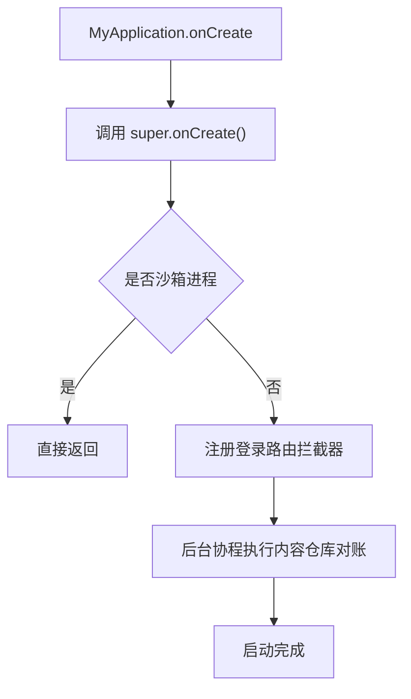
```mermaid
flowchart TD
    Start["MyApplication.onCreate"] --> Super["调用 super.onCreate()"]
    Super --> Isolated{"是否沙箱进程"}
    Isolated -->|是| Return["直接返回"]
    Isolated -->|否| Router["注册登录路由拦截器"]
    Router --> Background["后台协程执行内容仓库对账"]
    Background --> Done["启动完成"]
```

**图表来源**
- [MyApplication.kt:1-66](file://module_app/src/main/java/com/ebook/MyApplication.kt#L1-L66)

**章节来源**
- [MyApplication.kt:1-66](file://module_app/src/main/java/com/ebook/MyApplication.kt#L1-L66)

## 主界面与底部导航：module_main
### 闪屏页：SplashActivity
`SplashActivity` 承担冷启动期间的两个任务：
- 显示欢迎图并保证最小展示时长。
- 异步预载会话：如果本地已有持久化会话，则在跳转前完成，使主页首帧即处于已登录状态。
- 尝试恢复阅读：如果上次异常关闭且阅读标记存在，则先垫入主页再打开阅读器，避免把阅读器当作任务栈根。

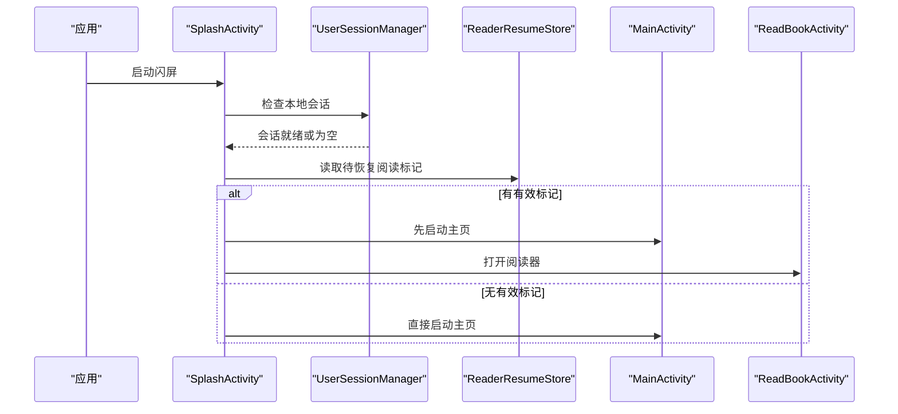
```mermaid
sequenceDiagram
    participant App as "应用"
    participant Splash as "SplashActivity"
    participant Session as "UserSessionManager"
    participant Resume as "ReaderResumeStore"
    participant MainActivity as "MainActivity"
    participant Reader as "ReadBookActivity"

    App->>Splash: 启动闪屏
    Splash->>Session: 检查本地会话
    Session-->>Splash: 会话就绪或为空
    Splash->>Resume: 读取待恢复阅读标记
    alt 有有效标记
        Splash->>MainActivity: 先启动主页
        Splash->>Reader: 打开阅读器
    else 无有效标记
        Splash->>MainActivity: 直接启动主页
    end
```

**图表来源**
- [SplashActivity.kt:1-339](file://module_main/src/main/java/com/ebook/main/SplashActivity.kt#L1-L339)
- [ReadBookActivity.kt:1-1068](file://module_book/src/main/java/com/ebook/book/ReadBookActivity.kt#L1-L1068)

### 主页：MainActivity
`MainActivity` 是三个 Tab 的宿主容器：
- 订阅 `SessionEventBus`，收到 `SessionExpired` 时清理会话、提示用户并跳转到登录页。
- 使用 Compose Navigation 管理三个目的地：书架、书城、我的。
- 底部导航 `MainBottomBar` 是无状态根，选中态由 `NavHost` 的回退栈派生，避免本地状态与导航状态不一致。
- 通过 `TheRouter.get(...)` 获取各模块 Provider，组合对应 Compose 页面，而不是 Fragment。

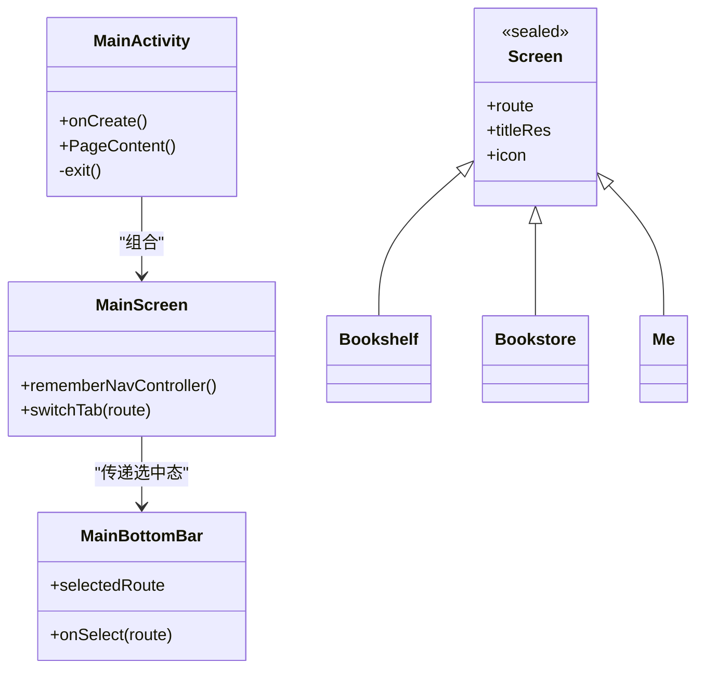
```mermaid
classDiagram
    class MainActivity {
        +onCreate()
        +PageContent()
        -exit()
    }
    class Screen {
        <<sealed>>
        +route
        +titleRes
        +icon
    }
    class MainScreen {
        +rememberNavController()
        +switchTab(route)
    }
    class MainBottomBar {
        +selectedRoute
        +onSelect(route)
    }

    MainActivity --> MainScreen : "组合"
    MainScreen --> MainBottomBar : "传递选中态"
    Screen <|-- Bookshelf
    Screen <|-- Bookstore
    Screen <|-- Me
```

**图表来源**
- [MainActivity.kt:1-290](file://module_main/src/main/java/com/ebook/main/MainActivity.kt#L1-L290)

**章节来源**
- [MainActivity.kt:1-290](file://module_main/src/main/java/com/ebook/main/MainActivity.kt#L1-L290)
- [SplashActivity.kt:1-339](file://module_main/src/main/java/com/ebook/main/SplashActivity.kt#L1-L339)

## 书籍管理与阅读：module_book
### 书籍详情页：BookDetailActivity
`BookDetailActivity` 支持两种入口：
- 从书架进入：直接使用本地书架实体数据，不重复拉取网络。
- 从搜索进入：需要发起网络请求获取书籍详情和章节目录。

它通过 `BitIntentDataManager` 在进程内暂存书架实体，并在点击“开始阅读”时构造 `ReadBookActivity` 的 Intent。

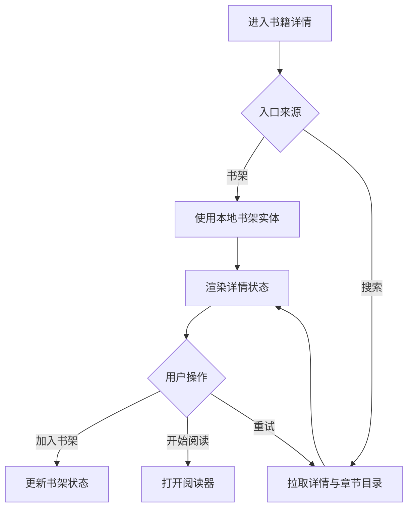
```mermaid
flowchart TD
    Enter["进入书籍详情"] --> Source{"入口来源"}
    Source -->|书架| Local["使用本地书架实体"]
    Source -->|搜索| Network["拉取详情与章节目录"]
    Local --> Render["渲染详情状态"]
    Network --> Render
    Render --> Action{"用户操作"}
    Action -->|加入书架| Shelf["更新书架状态"]
    Action -->|开始阅读| Read["打开阅读器"]
    Action -->|重试| Network
```

**图表来源**
- [BookDetailActivity.kt:1-528](file://module_book/src/main/java/com/ebook/book/BookDetailActivity.kt#L1-L528)

### 阅读页：ReadBookActivity
`ReadBookActivity` 是 Compose 实现的核心阅读界面，包含：
- 翻页控制器 `ReaderPagerController` 与滚屏控制器 `ReaderScrollController`。
- 顶部栏、底部栏、章节目录、字体、亮度、更多设置等面板。
- 三种打开书籍的方式：应用内点书、应用外打开文本、启动页恢复。
- 进度保存与恢复：进入即保存进度，退出时由 `ReaderResumeStore` 判断是否需要异常恢复。

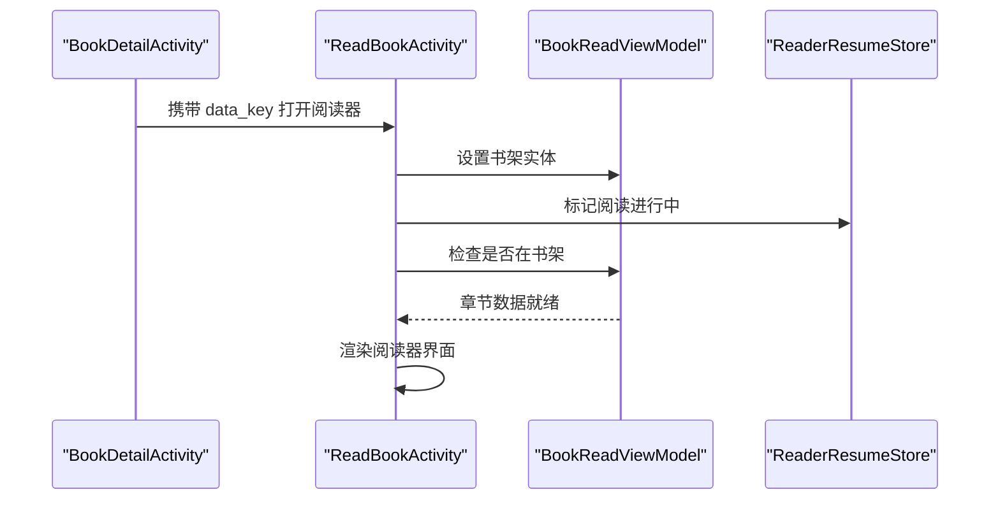
```mermaid
sequenceDiagram
    participant Detail as "BookDetailActivity"
    participant Reader as "ReadBookActivity"
    participant VM as "BookReadViewModel"
    participant Store as "ReaderResumeStore"

    Detail->>Reader: 携带 data_key 打开阅读器
    Reader->>VM: 设置书架实体
    Reader->>Store: 标记阅读进行中
    Reader->>VM: 检查是否在书架
    VM-->>Reader: 章节数据就绪
    Reader->>Reader: 渲染阅读器界面
```

**图表来源**
- [BookDetailActivity.kt:1-528](file://module_book/src/main/java/com/ebook/book/BookDetailActivity.kt#L1-L528)
- [ReadBookActivity.kt:1-1068](file://module_book/src/main/java/com/ebook/book/ReadBookActivity.kt#L1-L1068)

**章节来源**
- [BookDetailActivity.kt:1-528](file://module_book/src/main/java/com/ebook/book/BookDetailActivity.kt#L1-L528)
- [ReadBookActivity.kt:1-1068](file://module_book/src/main/java/com/ebook/book/ReadBookActivity.kt#L1-L1068)

## 书城搜索聚合：module_find
`SearchActivity` 是书城搜索的主入口，核心特点包括：
- 搜索为多书源并发聚合，结果边收边追加到列表。
- 历史记录面板通过软键盘弹出状态驱动，带圆形揭示动画。
- 搜索结果使用 `LazyColumn`，条目 key 为 `noteUrl`，避免跨源重复导致的异常。
- 加载更多由基类控制，失败可重试。

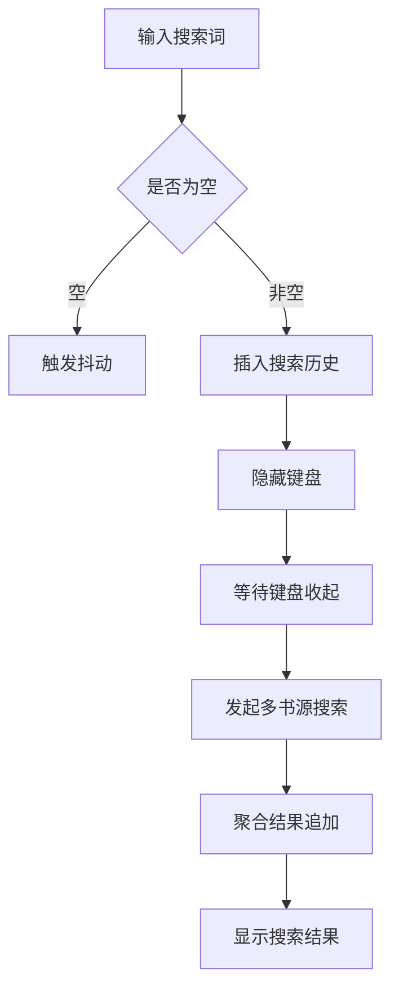
```mermaid
flowchart TD
    Input["输入搜索词"] --> Validate{"是否为空"}
    Validate -->|空| Shake["触发抖动"]
    Validate -->|非空| History["插入搜索历史"]
    History --> HideKeyboard["隐藏键盘"]
    HideKeyboard --> Delay["等待键盘收起"]
    Delay --> Search["发起多书源搜索"]
    Search --> Aggregate["聚合结果追加"]
    Aggregate --> List["显示搜索结果"]
```

**图表来源**
- [SearchActivity.kt:1-781](file://module_find/src/main/java/com/ebook/find/SearchActivity.kt#L1-L781)

**章节来源**
- [SearchActivity.kt:1-781](file://module_find/src/main/java/com/ebook/find/SearchActivity.kt#L1-L781)

## 个人中心：module_me
`module_me` 通过 `MeProvider` 向 `module_main` 暴露我的页。该模块包含用户信息、设置、缓存管理、书源管理等功能，通常以 ViewModel 管理状态，页面层只负责展示和用户交互回调。由于文档重点在核心业务模块，此处不展开具体页面实现，但应理解：
- `MeProvider` 是模块对外暴露的 Compose 页面入口。
- 模块内部遵循 MVVM 分层，状态由 ViewModel 产生，UI 消费状态。
- 与 `module_main` 的集成方式与其他模块一致：通过 TheRouter SPI 注册 Provider。

**章节来源**
- [MeProvider.kt:1-20](file://module_me/src/main/java/com/ebook/me/provider/MeProvider.kt#L1-L20)

## 登录与会话：module_login
`LoginActivity` 是标准表单登录页：
- 使用邮箱作为登录主标识，密码最多 64 位。
- 支持跳转到注册页和忘记密码页。
- 登录成功后的会话管理由后端与会话刷新机制处理，前端通过 `UserSessionManager` 和 `SessionEventBus` 感知会话状态。
- `LoginProvider` 暴露服务端登出能力，供其他模块调用。

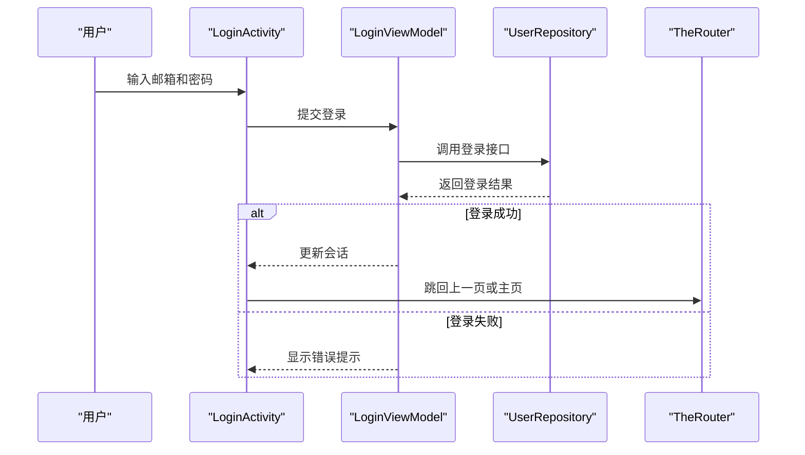
```mermaid
sequenceDiagram
    participant User as "用户"
    participant Login as "LoginActivity"
    participant VM as "LoginViewModel"
    participant Repo as "UserRepository"
    participant Router as "TheRouter"

    User->>Login: 输入邮箱和密码
    Login->>VM: 提交登录
    VM->>Repo: 调用登录接口
    Repo-->>VM: 返回登录结果
    alt 登录成功
        VM-->>Login: 更新会话
        Login->>Router: 跳回上一页或主页
    else 登录失败
        VM-->>Login: 显示错误提示
    end
```

**图表来源**
- [LoginActivity.kt:1-323](file://module_login/src/main/java/com/ebook/login/LoginActivity.kt#L1-L323)
- [LoginProvider.kt:1-36](file://module_login/src/main/java/com/ebook/login/provider/LoginProvider.kt#L1-L36)

**章节来源**
- [LoginActivity.kt:1-323](file://module_login/src/main/java/com/ebook/login/LoginActivity.kt#L1-L323)
- [LoginProvider.kt:1-36](file://module_login/src/main/java/com/ebook/login/provider/LoginProvider.kt#L1-L36)

## 模块间交互关系
模块间通过 `lib_book_common` 中的 Provider 接口解耦，`module_main` 作为宿主组合各模块页面：

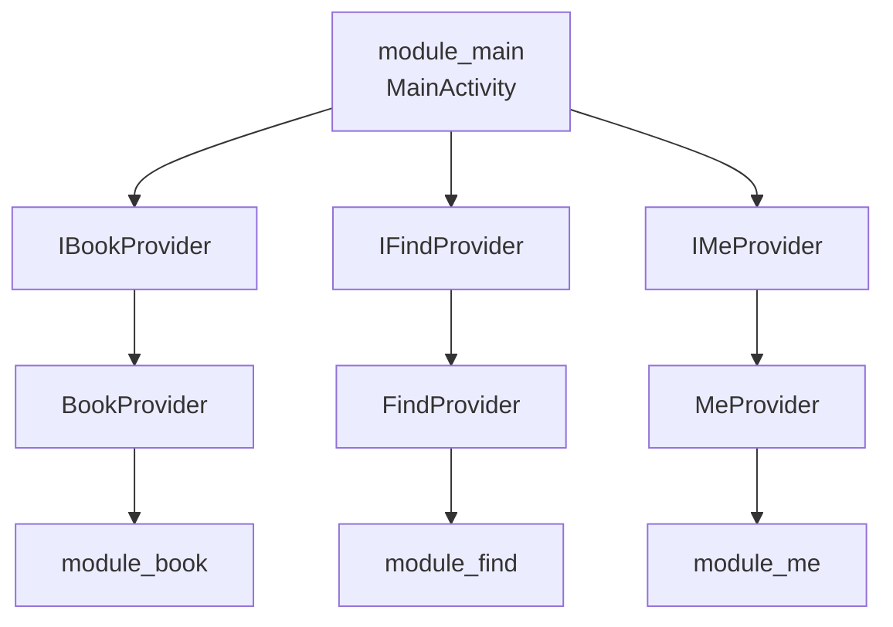
```mermaid
graph TB
    Main["module_main<br/>MainActivity"] --> IBook["IBookProvider"]
    Main --> IFind["IFindProvider"]
    Main --> IMe["IMeProvider"]

    IBook --> BookProv["BookProvider"]
    IFind --> FindProv["FindProvider"]
    IMe --> MeProv["MeProvider"]

    BookProv --> BookModule["module_book"]
    FindProv --> FindModule["module_find"]
    MeProv --> MeModule["module_me"]
```

**图表来源**
- [MainActivity.kt:201-290](file://module_main/src/main/java/com/ebook/main/MainActivity.kt#L201-L290)
- [IBookProvider.kt:1-23](file://lib_book_common/src/main/java/com/ebook/common/provider/IBookProvider.kt#L1-L23)
- [IFindProvider.kt:1-13](file://lib_book_common/src/main/java/com/ebook/common/provider/IFindProvider.kt#L1-L13)
- [IMeProvider.kt:1-13](file://lib_book_common/src/main/java/com/ebook/common/provider/IMeProvider.kt#L1-L13)
- [BookProvider.kt:1-16](file://module_book/src/main/java/com/ebook/book/provider/BookProvider.kt#L1-L16)
- [FindProvider.kt:1-19](file://module_find/src/main/java/com/ebook/find/provider/FindProvider.kt#L1-L19)
- [MeProvider.kt:1-20](file://module_me/src/main/java/com/ebook/me/provider/MeProvider.kt#L1-L20)

**章节来源**
- [MainActivity.kt:201-290](file://module_main/src/main/java/com/ebook/main/MainActivity.kt#L201-L290)
- [IBookProvider.kt:1-23](file://lib_book_common/src/main/java/com/ebook/common/provider/IBookProvider.kt#L1-L23)
- [IFindProvider.kt:1-13](file://lib_book_common/src/main/java/com/ebook/common/provider/IFindProvider.kt#L1-L13)
- [IMeProvider.kt:1-13](file://lib_book_common/src/main/java/com/ebook/common/provider/IMeProvider.kt#L1-L13)

## 典型用户工作流
### 从书架阅读一本书
1. 用户在书架点击书籍。
2. 进入书籍详情页，查看封面、作者、来源、简介。
3. 点击“开始阅读”，跳转到阅读页。
4. 阅读器加载章节内容，支持翻页、滚屏、设置字体和亮度。

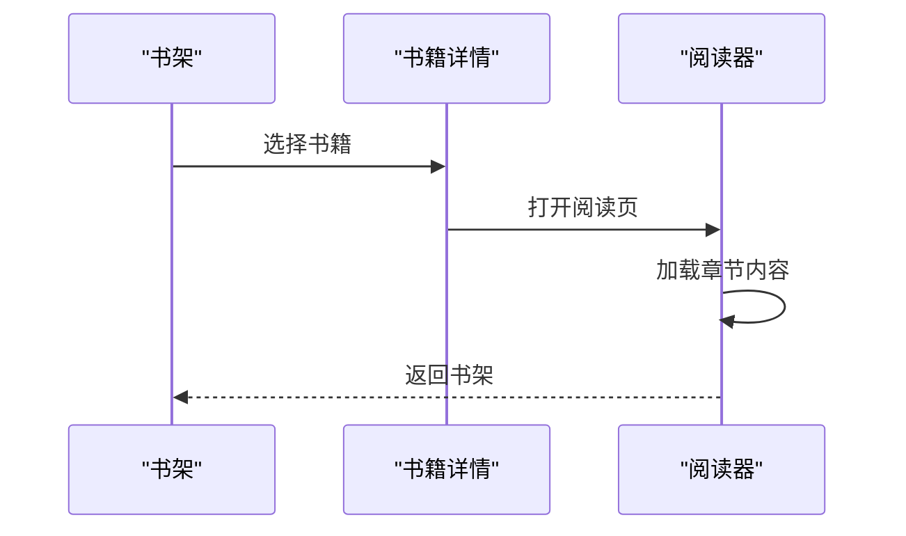
```mermaid
sequenceDiagram
    participant Shelf as "书架"
    participant Detail as "书籍详情"
    participant Reader as "阅读器"

    Shelf->>Detail: 选择书籍
    Detail->>Reader: 打开阅读页
    Reader->>Reader: 加载章节内容
    Reader-->>Shelf: 返回书架
```

**图表来源**
- [BookDetailActivity.kt:1-528](file://module_book/src/main/java/com/ebook/book/BookDetailActivity.kt#L1-L528)
- [ReadBookActivity.kt:1-1068](file://module_book/src/main/java/com/ebook/book/ReadBookActivity.kt#L1-L1068)

### 从书城搜索并加入书架
1. 用户在书城输入关键词。
2. 系统并发查询多个书源，聚合结果。
3. 用户点击搜索结果，进入书籍详情。
4. 点击“加入书架”，书籍加入本地书架。

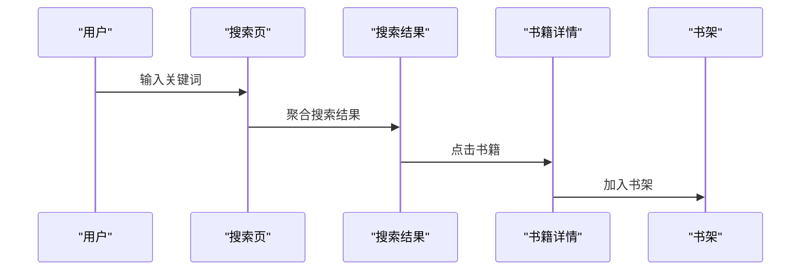
```mermaid
sequenceDiagram
    participant User as "用户"
    participant Search as "搜索页"
    participant Result as "搜索结果"
    participant Detail as "书籍详情"
    participant Shelf as "书架"

    User->>Search: 输入关键词
    Search->>Result: 聚合搜索结果
    Result->>Detail: 点击书籍
    Detail->>Shelf: 加入书架
```

**图表来源**
- [SearchActivity.kt:1-781](file://module_find/src/main/java/com/ebook/find/SearchActivity.kt#L1-L781)
- [BookDetailActivity.kt:1-528](file://module_book/src/main/java/com/ebook/book/BookDetailActivity.kt#L1-L528)

## 依赖分析
- `module_main` 依赖 `lib_book_common` 中的 Provider 接口，但不直接依赖 `module_book`、`module_find`、`module_me` 的具体实现。
- 各功能模块通过 TheRouter 的 `@ServiceProvider` 注解注册自己的 Provider。
- `module_app` 依赖 `lib_book_common` 和 `lib_book_source`，用于沙箱进程和仓库对账。
- `module_login` 通过 `ILoginProvider` 暴露服务端登出能力，供其他模块间接调用。

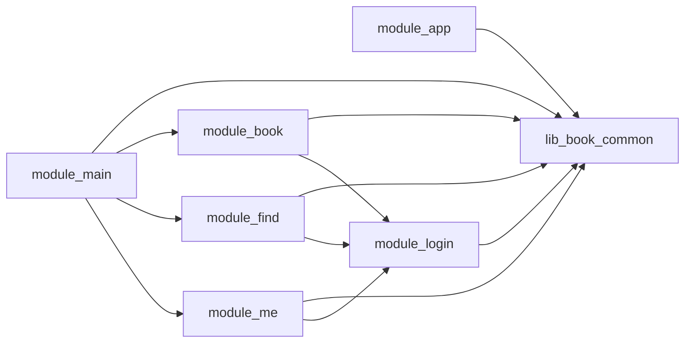
```mermaid
graph LR
    ModuleApp["module_app"] --> LibCommon["lib_book_common"]
    ModuleMain["module_main"] --> LibCommon
    ModuleBook["module_book"] --> LibCommon
    ModuleFind["module_find"] --> LibCommon
    ModuleMe["module_me"] --> LibCommon
    ModuleLogin["module_login"] --> LibCommon
    ModuleMain --> ModuleBook
    ModuleMain --> ModuleFind
    ModuleMain --> ModuleMe
    ModuleBook --> ModuleLogin
    ModuleFind --> ModuleLogin
    ModuleMe --> ModuleLogin
```

**图表来源**
- [MyApplication.kt:1-66](file://module_app/src/main/java/com/ebook/MyApplication.kt#L1-L66)
- [MainActivity.kt:201-290](file://module_main/src/main/java/com/ebook/main/MainActivity.kt#L201-L290)
- [BookProvider.kt:1-16](file://module_book/src/main/java/com/ebook/book/provider/BookProvider.kt#L1-L16)
- [FindProvider.kt:1-19](file://module_find/src/main/java/com/ebook/find/provider/FindProvider.kt#L1-L19)
- [MeProvider.kt:1-20](file://module_me/src/main/java/com/ebook/me/provider/MeProvider.kt#L1-L20)
- [LoginProvider.kt:1-36](file://module_login/src/main/java/com/ebook/login/provider/LoginProvider.kt#L1-L36)

**章节来源**
- [MyApplication.kt:1-66](file://module_app/src/main/java/com/ebook/MyApplication.kt#L1-L66)
- [MainActivity.kt:201-290](file://module_main/src/main/java/com/ebook/main/MainActivity.kt#L201-L290)

## 性能与可维护性要点
- 会话预载放在 `SplashActivity`，避免主页首帧二次加载。
- 内容仓库对账在后台协程执行，失败不影响启动。
- 阅读器进度保存和恢复机制减少用户中断损失。
- 搜索聚合结果边收边追加，提升响应速度。
- Provider 接口解耦模块，便于独立开发和测试。

## 故障排查指南
- 如果主页未登录就跳转到登录页，检查 `SessionEventBus` 是否正确处理 `SessionExpired`。
- 如果阅读器无法恢复，检查 `ReaderResumeStore` 是否有待恢复标记，以及书籍是否仍存在。
- 如果搜索结果不显示，检查多书源聚合逻辑和网络请求是否成功。
- 如果登录后仍显示未登录，检查 `UserSessionManager` 是否成功持久化会话。

**章节来源**
- [MainActivity.kt:1-120](file://module_main/src/main/java/com/ebook/main/MainActivity.kt#L1-L120)
- [SplashActivity.kt:100-339](file://module_main/src/main/java/com/ebook/main/SplashActivity.kt#L100-L339)
- [SearchActivity.kt:300-781](file://module_find/src/main/java/com/ebook/find/SearchActivity.kt#L300-L781)
- [LoginActivity.kt:1-323](file://module_login/src/main/java/com/ebook/login/LoginActivity.kt#L1-L323)

## 结论
本项目的核心模块分工明确：`module_app` 负责应用初始化和沙箱隔离，`module_main` 负责主页和导航，`module_book` 负责书籍管理和阅读，`module_find` 负责书城搜索，`module_me` 负责个人中心，`module_login` 负责登录。模块间通过 Provider 接口和 TheRouter 解耦，整体架构清晰，易于扩展和维护。开发者应重点关注会话管理、阅读恢复、搜索聚合和模块间通信的实现细节。