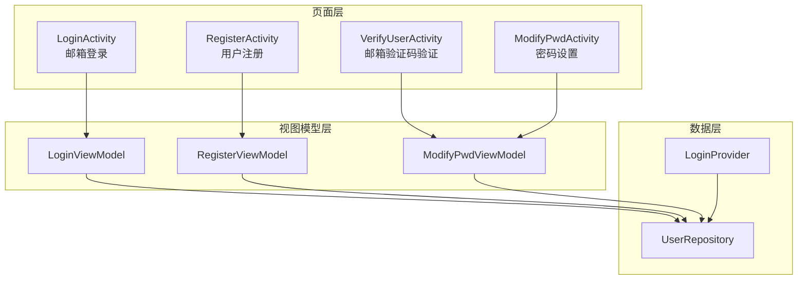
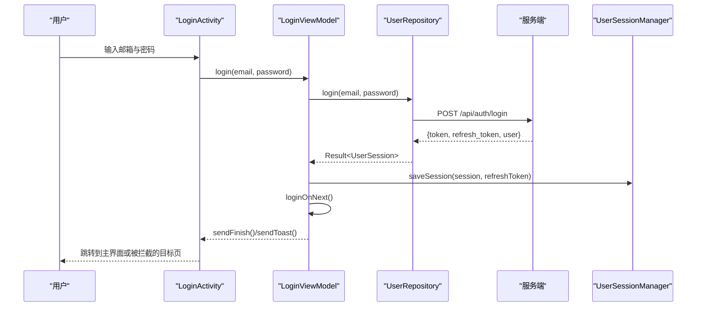
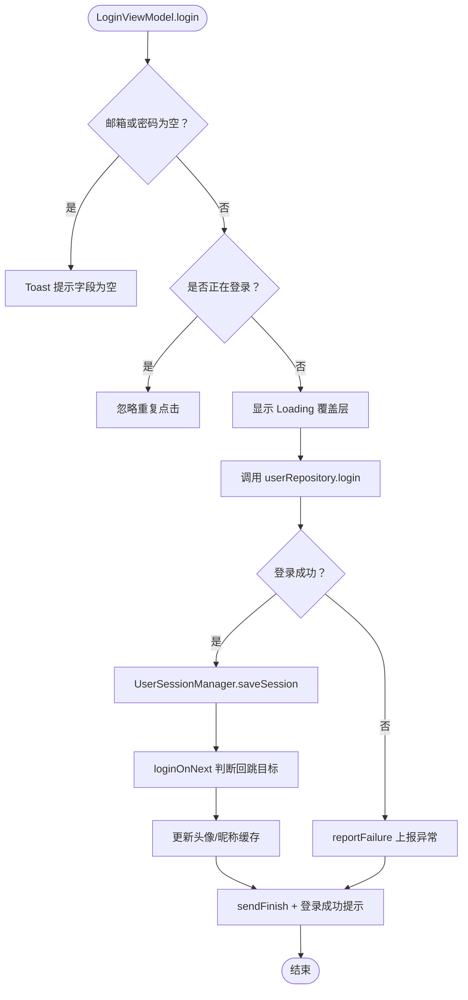
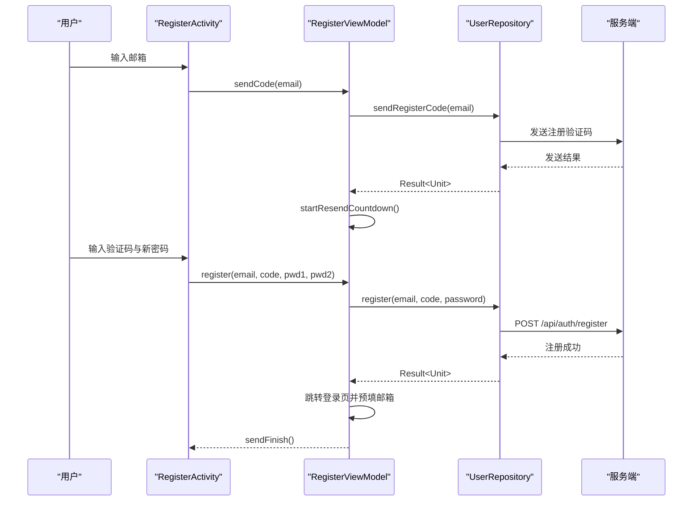
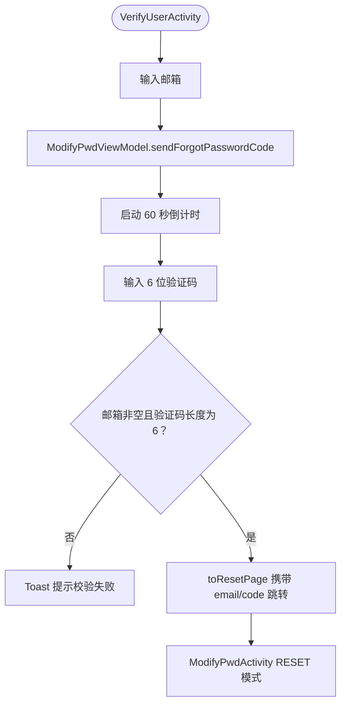
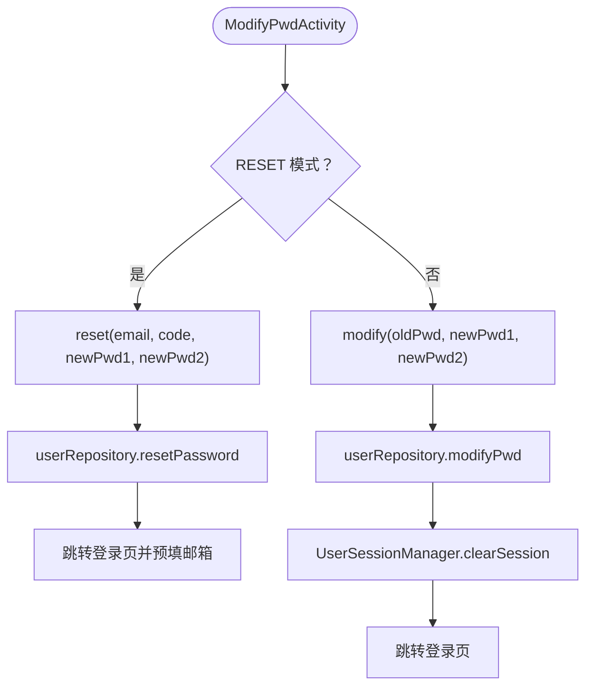
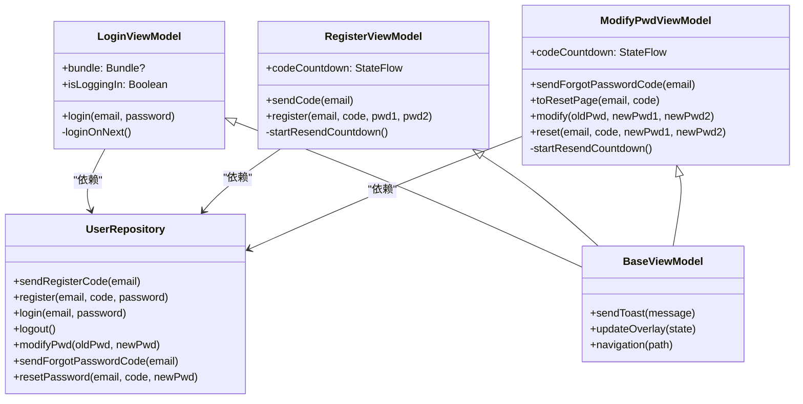
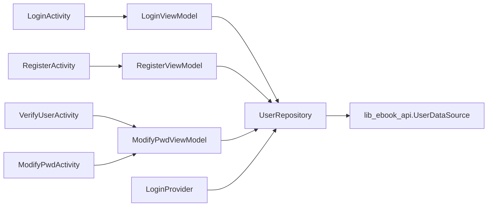

# 登录模块（module_login）

<cite>
**本文引用的文件**   
- [LoginActivity.kt](file://module_login/src/main/java/com/ebook/login/LoginActivity.kt)
- [RegisterActivity.kt](file://module_login/src/main/java/com/ebook/login/RegisterActivity.kt)
- [VerifyUserActivity.kt](file://module_login/src/main/java/com/ebook/login/VerifyUserActivity.kt)
- [ModifyPwdActivity.kt](file://module_login/src/main/java/com/ebook/login/ModifyPwdActivity.kt)
- [LoginViewModel.kt](file://module_login/src/main/java/com/ebook/login/mvvm/viewmodel/LoginViewModel.kt)
- [RegisterViewModel.kt](file://module_login/src/main/java/com/ebook/login/mvvm/viewmodel/RegisterViewModel.kt)
- [ModifyPwdViewModel.kt](file://module_login/src/main/java/com/ebook/login/mvvm/viewmodel/ModifyPwdViewModel.kt)
- [UserRepository.kt](file://module_login/src/main/java/com/ebook/login/repository/UserRepository.kt)
- [LoginProvider.kt](file://module_login/src/main/java/com/ebook/login/provider/LoginProvider.kt)
- [login-modernization-spec.md](file://docs/login-modernization-spec.md)
</cite>

## 目录
1. [简介](#简介)
2. [项目结构](#项目结构)
3. [核心组件](#核心组件)
4. [架构总览](#架构总览)
5. [详细组件分析](#详细组件分析)
6. [依赖关系分析](#依赖关系分析)
7. [性能与可靠性考虑](#性能与可靠性考虑)
8. [安全最佳实践](#安全最佳实践)
9. [故障排查指南](#故障排查指南)
10. [结论](#结论)

## 简介
本模块实现应用的用户认证入口，包含邮箱登录、用户注册、邮箱验证码验证身份和密码修改四大主流程。整体采用 MVVM + Compose UI 分层：Activity 作为有状态外壳，Compose 无状态屏幕负责展示，ViewModel 负责表单校验、网络调用与会话导航，Repository 统一对接网络数据层。服务端契约以“邮箱为主标识”，登录返回双 token（access 与 refresh），注册仅激活账号不发放 token；密码不持久化，会话恢复走 token。

本模块同时提供跨模块的 `ILoginProvider` 能力，让其他模块通过 TheRouter SPI 调用登录域的服务端登出能力，而不直接耦合 module_login。

**章节来源**
- [login-modernization-spec.md:1-76](file://docs/login-modernization-spec.md#L1-L76)

## 项目结构
module_login 按功能维度组织：
- `login/`：四个页面 Activity，每个页面由一个无状态 Composable 屏幕组成。
- `mvvm/viewmodel/`：三个 ViewModel，分别对应登录、注册、密码管理。
- `repository/`：认证相关接口封装。
- `provider/`：TheRouter SPI 暴露的服务提供者。

**图示来源**
- [LoginActivity.kt:1-120](file://module_login/src/main/java/com/ebook/login/LoginActivity.kt#L1-L120)
- [RegisterActivity.kt:1-120](file://module_login/src/main/java/com/ebook/login/RegisterActivity.kt#L1-L120)
- [VerifyUserActivity.kt:1-120](file://module_login/src/main/java/com/ebook/login/VerifyUserActivity.kt#L1-L120)
- [ModifyPwdActivity.kt:1-120](file://module_login/src/main/java/com/ebook/login/ModifyPwdActivity.kt#L1-L120)
- [LoginViewModel.kt:1-107](file://module_login/src/main/java/com/ebook/login/mvvm/viewmodel/LoginViewModel.kt#L1-L107)
- [RegisterViewModel.kt:1-139](file://module_login/src/main/java/com/ebook/login/mvvm/viewmodel/RegisterViewModel.kt#L1-L139)
- [ModifyPwdViewModel.kt:1-180](file://module_login/src/main/java/com/ebook/login/mvvm/viewmodel/ModifyPwdViewModel.kt#L1-L180)
- [UserRepository.kt:1-94](file://module_login/src/main/java/com/ebook/login/repository/UserRepository.kt#L1-L94)
- [LoginProvider.kt:1-36](file://module_login/src/main/java/com/ebook/login/provider/LoginProvider.kt#L1-L36)

**章节来源**
- [LoginActivity.kt:1-200](file://module_login/src/main/java/com/ebook/login/LoginActivity.kt#L1-L200)
- [RegisterActivity.kt:1-200](file://module_login/src/main/java/com/ebook/login/RegisterActivity.kt#L1-L200)
- [VerifyUserActivity.kt:1-180](file://module_login/src/main/java/com/ebook/login/VerifyUserActivity.kt#L1-L180)
- [ModifyPwdActivity.kt:1-200](file://module_login/src/main/java/com/ebook/login/ModifyPwdActivity.kt#L1-L200)
- [UserRepository.kt:1-94](file://module_login/src/main/java/com/ebook/login/repository/UserRepository.kt#L1-L94)
- [LoginProvider.kt:1-36](file://module_login/src/main/java/com/ebook/login/provider/LoginProvider.kt#L1-L36)

## 核心组件
- LoginActivity：邮箱登录入口，处理预填邮箱、登录按钮点击、跳转注册和忘记密码。
- RegisterActivity：三步注册（邮箱 → 获取验证码 → 验证码+密码），成功后跳转登录页并预填邮箱。
- VerifyUserActivity：忘记密码第一步，邮箱发码后输入验证码进入下一步。
- ModifyPwdActivity：双模式密码设置，已登录改密或重置密码。
- LoginViewModel：登录表单校验、会话保存、回跳目标判断、资料缓存更新。
- RegisterViewModel：注册发码倒计时、注册表单校验、跳转登录。
- ModifyPwdViewModel：忘记密码发码、重置跳转、已登录改密、密码重置。
- UserRepository：统一封装登录、注册、发码、改密、重置等 API。
- LoginProvider：跨模块暴露服务端登出能力。

**章节来源**
- [LoginActivity.kt:1-200](file://module_login/src/main/java/com/ebook/login/LoginActivity.kt#L1-L200)
- [RegisterActivity.kt:1-200](file://module_login/src/main/java/com/ebook/login/RegisterActivity.kt#L1-L200)
- [VerifyUserActivity.kt:1-180](file://module_login/src/main/java/com/ebook/login/VerifyUserActivity.kt#L1-L180)
- [ModifyPwdActivity.kt:1-200](file://module_login/src/main/java/com/ebook/login/ModifyPwdActivity.kt#L1-L200)
- [LoginViewModel.kt:1-107](file://module_login/src/main/java/com/ebook/login/mvvm/viewmodel/LoginViewModel.kt#L1-L107)
- [RegisterViewModel.kt:1-139](file://module_login/src/main/java/com/ebook/login/mvvm/viewmodel/RegisterViewModel.kt#L1-L139)
- [ModifyPwdViewModel.kt:1-180](file://module_login/src/main/java/com/ebook/login/mvvm/viewmodel/ModifyPwdViewModel.kt#L1-L180)
- [UserRepository.kt:1-94](file://module_login/src/main/java/com/ebook/login/repository/UserRepository.kt#L1-L94)
- [LoginProvider.kt:1-36](file://module_login/src/main/java/com/ebook/login/provider/LoginProvider.kt#L1-L36)

## 架构总览
登录模块遵循以下分层原则：
- 页面层只持有编辑态和路由参数，不承载业务逻辑。
- ViewModel 集中处理表单校验、网络请求、错误提示与页面跳转。
- Repository 统一将服务响应映射为 Result，并把会话实体转换为用户会话。
- 会话持久化和 token 注入由公共域 UserSessionManager 与拦截器承担，登录模块不直接操作敏感存储。

**图示来源**
- [LoginActivity.kt:1-200](file://module_login/src/main/java/com/ebook/login/LoginActivity.kt#L1-L200)
- [LoginViewModel.kt:1-107](file://module_login/src/main/java/com/ebook/login/mvvm/viewmodel/LoginViewModel.kt#L1-L107)
- [UserRepository.kt:1-94](file://module_login/src/main/java/com/ebook/login/repository/UserRepository.kt#L1-L94)

## 详细组件分析

### LoginActivity 与邮箱登录流程
LoginActivity 是登录入口，主要职责：
- 维护 email/password 两个编辑态。
- 从 Intent 读取预填邮箱，并在 singleTask 复用实例时通过 prefillEmail 触发重组。
- 关闭 Toolbar 和系统窗口适配，使用品牌标题区。
- 点击登录时调用 LoginViewModel.login。

LoginViewModel.login 的流程：
1. 非空校验邮箱与密码，失败则 Toast 提示。
2. 防重复登录标志 isLoggingIn 防止并发提交。
3. 显示 Loading 覆盖层。
4. 调用 userRepository.login，成功后：
   - 调用 UserSessionManager.saveSession 保存身份与双 token。
   - 执行 loginOnNext 根据路由来源决定回跳目标。
   - 更新头像与昵称缓存。
5. 异常经 reportFailure 上报，最终清理 loading 与登录标志。

loginOnNext 的路由策略：
- 如果来源路径不是 LOGIN_PATH 且不以 LOGIN_PATH 开头，认为是被拦截的目标页，登录后直接导航回该原始页面。
- 否则认为本次是主动发起的登录流程，导航到主界面并使用 CLEAR_TOP + SINGLE_TOP 清理中间页。
- 最后发送 finish 与成功提示。

**图示来源**
- [LoginViewModel.kt:1-107](file://module_login/src/main/java/com/ebook/login/mvvm/viewmodel/LoginViewModel.kt#L1-L107)
- [LoginActivity.kt:1-200](file://module_login/src/main/java/com/ebook/login/LoginActivity.kt#L1-L200)

**章节来源**
- [LoginActivity.kt:1-200](file://module_login/src/main/java/com/ebook/login/LoginActivity.kt#L1-L200)
- [LoginViewModel.kt:1-107](file://module_login/src/main/java/com/ebook/login/mvvm/viewmodel/LoginViewModel.kt#L1-L107)

### RegisterActivity 与用户注册流程
RegisterActivity 负责注册页 UI 外壳：
- 收集 countdownSeconds 倒计时状态。
- 调用 RegisterViewModel.sendCode 获取验证码。
- 点击注册时调用 RegisterViewModel.register。

RegisterViewModel.register 的核心逻辑：
1. 客户端只做完整性校验：
   - 邮箱非空。
   - 验证码长度等于 6。
   - 两次密码非空且一致。
2. 成功后调用 userRepository.register。
3. 注册成功不发 token，跳转登录页并预填邮箱，然后 finish。

注册发码流程：
- sendRegisterCode 调用仓库发送注册专用验证码。
- 成功后启动 60 秒倒计时，倒计时期间禁用发码按钮。
- 失败不锁按钮，允许立即重试。

**图示来源**
- [RegisterActivity.kt:1-200](file://module_login/src/main/java/com/ebook/login/RegisterActivity.kt#L1-L200)
- [RegisterViewModel.kt:1-139](file://module_login/src/main/java/com/ebook/login/mvvm/viewmodel/RegisterViewModel.kt#L1-L139)
- [UserRepository.kt:1-94](file://module_login/src/main/java/com/ebook/login/repository/UserRepository.kt#L1-L94)

**章节来源**
- [RegisterActivity.kt:1-200](file://module_login/src/main/java/com/ebook/login/RegisterActivity.kt#L1-L200)
- [RegisterViewModel.kt:1-139](file://module_login/src/main/java/com/ebook/login/mvvm/viewmodel/RegisterViewModel.kt#L1-L139)

### VerifyUserActivity 与用户验证机制
VerifyUserActivity 是忘记密码流程的第一步，用于邮箱验证码验证身份：
- 输入邮箱后调用 ModifyPwdViewModel.sendForgotPasswordCode。
- 输入 6 位验证码后调用 ModifyPwdViewModel.toResetPage。
- toResetPage 携带 email 和 code 跳转到 ModifyPwdActivity 的 RESET 模式。

验证码校验不在客户端做语义判断，仅做长度和非空检查；验证码有效性由服务端在重置时校验，避免本地状态与服务端过期次数不一致。

**图示来源**
- [VerifyUserActivity.kt:1-180](file://module_login/src/main/java/com/ebook/login/VerifyUserActivity.kt#L1-L180)
- [ModifyPwdViewModel.kt:1-180](file://module_login/src/main/java/com/ebook/login/mvvm/viewmodel/ModifyPwdViewModel.kt#L1-L180)

**章节来源**
- [VerifyUserActivity.kt:1-180](file://module_login/src/main/java/com/ebook/login/VerifyUserActivity.kt#L1-L180)
- [ModifyPwdViewModel.kt:1-180](file://module_login/src/main/java/com/ebook/login/mvvm/viewmodel/ModifyPwdViewModel.kt#L1-L180)

### ModifyPwdActivity 与密码修改功能
ModifyPwdActivity 支持两种模式：
- MODE_RESET：忘记密码第二步，只显示新密码两次，提交走 reset。
- MODE_LOGGED_IN：已登录改密，显示旧密码和新密码两次，提交走 modify。

ModifyPwdViewModel 的关键方法：
- modify：校验旧密码和新密码非空且两次一致，调用 userRepository.modifyPwd。成功后调用 UserSessionManager.clearSession 清会话，并跳转登录页。
- reset：校验两次新密码非空且一致，调用 userRepository.resetPassword。成功后跳转登录页并预填邮箱。

**图示来源**
- [ModifyPwdActivity.kt:1-200](file://module_login/src/main/java/com/ebook/login/ModifyPwdActivity.kt#L1-L200)
- [ModifyPwdViewModel.kt:1-180](file://module_login/src/main/java/com/ebook/login/mvvm/viewmodel/ModifyPwdViewModel.kt#L1-L180)
- [UserRepository.kt:1-94](file://module_login/src/main/java/com/ebook/login/repository/UserRepository.kt#L1-L94)

**章节来源**
- [ModifyPwdActivity.kt:1-200](file://module_login/src/main/java/com/ebook/login/ModifyPwdActivity.kt#L1-L200)
- [ModifyPwdViewModel.kt:1-180](file://module_login/src/main/java/com/ebook/login/mvvm/viewmodel/ModifyPwdViewModel.kt#L1-L180)

### MVVM 设计：表单状态、网络请求与错误提示
各 ViewModel 共同遵循以下模式：
- 表单状态由 Activity/Composable 层 remember 持有，ViewModel 只在提交时收集完整表单。
- 网络请求统一通过 Repository 的 suspend 函数，并由 CoroutineAdapter.safeApiCall 包装成 Result。
- 错误提示统一使用 BaseViewModel 的 sendToast，异常上报使用 reportFailure。
- 加载状态使用 updateOverlay(Overlay.Loading) 与 Overlay.None。
- 页面导航使用 TheRouter.build(...).navigation()，必要时配合 sendFinish。

**图示来源**
- [LoginViewModel.kt:1-107](file://module_login/src/main/java/com/ebook/login/mvvm/viewmodel/LoginViewModel.kt#L1-L107)
- [RegisterViewModel.kt:1-139](file://module_login/src/main/java/com/ebook/login/mvvm/viewmodel/RegisterViewModel.kt#L1-L139)
- [ModifyPwdViewModel.kt:1-180](file://module_login/src/main/java/com/ebook/login/mvvm/viewmodel/ModifyPwdViewModel.kt#L1-L180)
- [UserRepository.kt:1-94](file://module_login/src/main/java/com/ebook/login/repository/UserRepository.kt#L1-L94)

**章节来源**
- [LoginViewModel.kt:1-107](file://module_login/src/main/java/com/ebook/login/mvvm/viewmodel/LoginViewModel.kt#L1-L107)
- [RegisterViewModel.kt:1-139](file://module_login/src/main/java/com/ebook/login/mvvm/viewmodel/RegisterViewModel.kt#L1-L139)
- [ModifyPwdViewModel.kt:1-180](file://module_login/src/main/java/com/ebook/login/mvvm/viewmodel/ModifyPwdViewModel.kt#L1-L180)
- [UserRepository.kt:1-94](file://module_login/src/main/java/com/ebook/login/repository/UserRepository.kt#L1-L94)

## 依赖关系分析
登录模块对外暴露的能力边界如下：
- 内部依赖：UserRepository、TheRouter、BaseViewModel、Common 中的 UserSessionManager、ProfileRepository、ErrorCode、KeyCode、reportFailure。
- 外部依赖：lib_ebook_api 提供的 UserDataSource、DTO、CoroutineAdapter。
- 跨模块依赖：ILoginProvider 由 LoginProvider 实现，供其他模块调用服务端登出。

**图示来源**
- [LoginActivity.kt:1-200](file://module_login/src/main/java/com/ebook/login/LoginActivity.kt#L1-L200)
- [RegisterActivity.kt:1-200](file://module_login/src/main/java/com/ebook/login/RegisterActivity.kt#L1-L200)
- [VerifyUserActivity.kt:1-180](file://module_login/src/main/java/com/ebook/login/VerifyUserActivity.kt#L1-L180)
- [ModifyPwdActivity.kt:1-200](file://module_login/src/main/java/com/ebook/login/ModifyPwdActivity.kt#L1-L200)
- [LoginViewModel.kt:1-107](file://module_login/src/main/java/com/ebook/login/mvvm/viewmodel/LoginViewModel.kt#L1-L107)
- [RegisterViewModel.kt:1-139](file://module_login/src/main/java/com/ebook/login/mvvm/viewmodel/RegisterViewModel.kt#L1-L139)
- [ModifyPwdViewModel.kt:1-180](file://module_login/src/main/java/com/ebook/login/mvvm/viewmodel/ModifyPwdViewModel.kt#L1-L180)
- [UserRepository.kt:1-94](file://module_login/src/main/java/com/ebook/login/repository/UserRepository.kt#L1-L94)
- [LoginProvider.kt:1-36](file://module_login/src/main/java/com/ebook/login/provider/LoginProvider.kt#L1-L36)

**章节来源**
- [UserRepository.kt:1-94](file://module_login/src/main/java/com/ebook/login/repository/UserRepository.kt#L1-L94)
- [LoginProvider.kt:1-36](file://module_login/src/main/java/com/ebook/login/provider/LoginProvider.kt#L1-L36)

## 性能与可靠性考虑
- 登录防重复提交：LoginViewModel 使用 isLoggingIn 标记，避免短时间内多次点击导致并发请求。
- 验证码倒计时：RegisterViewModel 与 ModifyPwdViewModel 使用 viewModelScope Job 控制倒计时，配置变更不会丢失进度，并与服务端 60 秒频控对齐，减少 A0241 尝试超限。
- 网络异常统一处理：所有 Repository 方法使用 safeApiCall 转为 Result，ViewModel 仅在 onSuccess 分支执行业务逻辑，onFailure 走 reportFailure 上报。
- 导航一致性：登录成功后根据来源路径判断回跳目标，避免中间页泄漏；主界面使用 CLEAR_TOP + SINGLE_TOP 保证栈稳定。
- 资源释放：倒计时任务在重新发码或页面销毁前取消，避免旧任务覆盖新状态。

[本节为通用性能建议，不直接分析具体代码行]

## 安全最佳实践
- 密码不持久化：登录模块不保存明文密码；启动恢复走 token，会话恢复由 UserSessionManager 与 TokenHolder 管理。
- 双 token 认证：登录成功后保存 access 与 refresh token，后续刷新由网络层全局处理；refresh 失败时统一会话过期事件处理。
- 令牌安全：token 写入 TokenHolder，AuthInterceptor 自动附加到请求头；登出由服务端作废全部 refresh token。
- 密码强度与格式：客户端仅做基本完整性校验，邮箱格式与验证码正确性交给服务端业务码，避免本地规则与服务端不一致。
- 日志脱敏：ModifyPwdViewModel 明确注释日志不输出密码，降低敏感信息泄露风险。
- 会话生命周期：已登录改密成功后显式调用 UserSessionManager.clearSession，确保 token、isLoggedIn 及进程内身份流同步失效。

**章节来源**
- [LoginViewModel.kt:1-107](file://module_login/src/main/java/com/ebook/login/mvvm/viewmodel/LoginViewModel.kt#L1-L107)
- [RegisterViewModel.kt:1-139](file://module_login/src/main/java/com/ebook/login/mvvm/viewmodel/RegisterViewModel.kt#L1-L139)
- [ModifyPwdViewModel.kt:1-180](file://module_login/src/main/java/com/ebook/login/mvvm/viewmodel/ModifyPwdViewModel.kt#L1-L180)
- [login-modernization-spec.md:1-76](file://docs/login-modernization-spec.md#L1-L76)

## 故障排查指南
常见问题与定位建议：
- 登录成功却停留在中间页：检查 loginOnNext 的来源路径是否为 LOGIN_PATH 或其带参形式；若为主动登录应导航主界面并 finish。
- 注册成功后仍看到注册页：确认 RegisterViewModel.register 成功后调用了 sendFinish，且 Activity 继承 BaseMvvmActivity 以消费命令通道。
- 验证码按钮一直禁用：检查倒计时是否在服务端成功后启动，以及 startResendCountdown 是否正确递减至 0。
- 已登录改密后未退出：确认 ModifyPwdViewModel.modify 成功后调用了 UserSessionManager.clearSession，并跳转登录页。
- 网络异常未提示：检查 Repository 的 safeApiCall 返回值是否被正确处理，ViewModel 是否在 onFailure 中调用 reportFailure。
- 跨模块登出无效：确认调用方使用 ILoginProvider.logout，而非直接访问 module_login 内部类；后端会作废该用户全部 refresh token。

**章节来源**
- [LoginActivity.kt:1-200](file://module_login/src/main/java/com/ebook/login/LoginActivity.kt#L1-L200)
- [RegisterActivity.kt:1-200](file://module_login/src/main/java/com/ebook/login/RegisterActivity.kt#L1-L200)
- [VerifyUserActivity.kt:1-180](file://module_login/src/main/java/com/ebook/login/VerifyUserActivity.kt#L1-L180)
- [ModifyPwdActivity.kt:1-200](file://module_login/src/main/java/com/ebook/login/ModifyPwdActivity.kt#L1-L200)
- [LoginViewModel.kt:1-107](file://module_login/src/main/java/com/ebook/login/mvvm/viewmodel/LoginViewModel.kt#L1-L107)
- [RegisterViewModel.kt:1-139](file://module_login/src/main/java/com/ebook/login/mvvm/viewmodel/RegisterViewModel.kt#L1-L139)
- [ModifyPwdViewModel.kt:1-180](file://module_login/src/main/java/com/ebook/login/mvvm/viewmodel/ModifyPwdViewModel.kt#L1-L180)
- [UserRepository.kt:1-94](file://module_login/src/main/java/com/ebook/login/repository/UserRepository.kt#L1-L94)
- [LoginProvider.kt:1-36](file://module_login/src/main/java/com/ebook/login/provider/LoginProvider.kt#L1-L36)

## 结论
module_login 以清晰的 MVVM 分层实现了完整的用户认证流程：邮箱登录、注册、邮箱验证码验证身份和密码修改。其关键优势包括：
- 登录流程清晰，回跳逻辑稳健，能区分拦截回跳与主动登录。
- 注册与忘记密码流程统一使用 60 秒验证码倒计时，与服务端频控对齐。
- 密码不持久化，会话恢复走 token，改密成功后统一清理会话。
- Repository 统一 Result 包装，ViewModel 专注业务与导航，UI 层保持无状态可预览。
- 通过 LoginProvider 暴露跨模块能力，便于其他模块调用服务端登出。

对于扩展与定制，开发者可以：
- 在 UserRepository 新增认证相关端点，并保持 Result 包装风格。
- 在 ViewModel 中增加自定义表单校验规则，并通过 sendToast 反馈给用户。
- 在 Navigation 层扩展 TheRouter 路由，但需避免与现有 LOGIN_PATH、MODIFY_PATH、MODIFY_PWD_PATH 冲突。
- 在 Session 层结合 UserSessionManager 管理更复杂的会话生命周期，例如多账号切换或静默刷新策略。

[本节为总结性内容，不直接分析具体代码行]