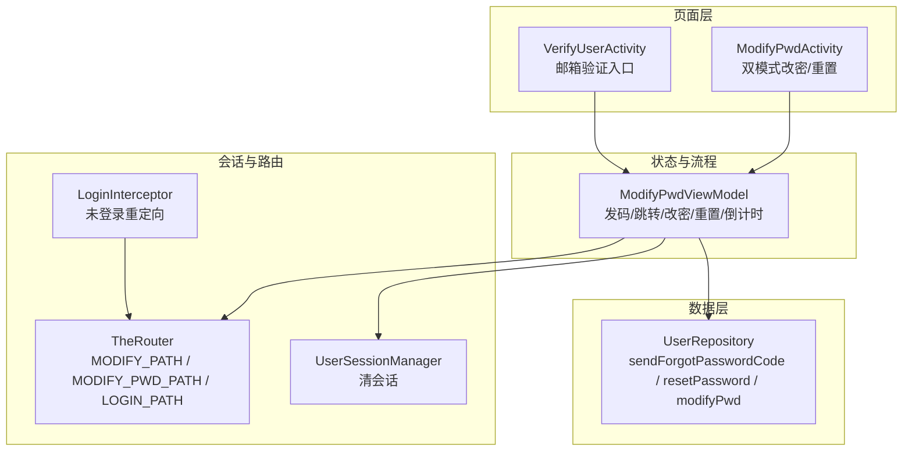
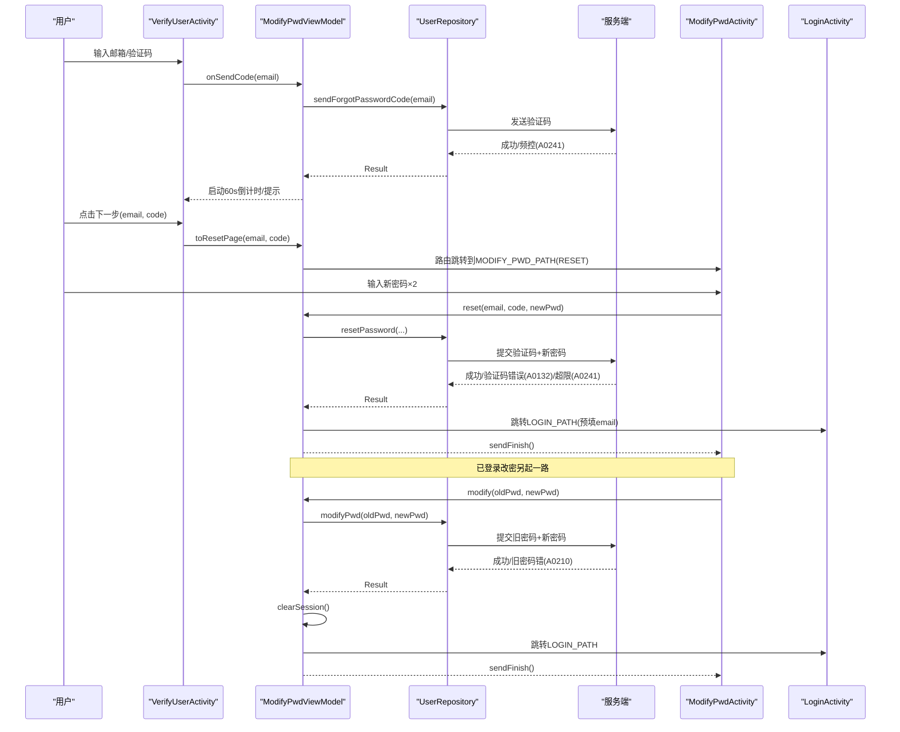
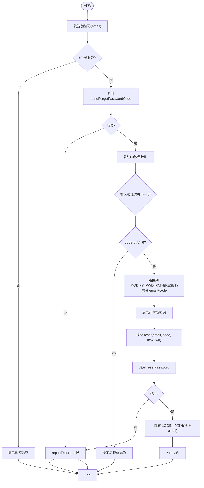
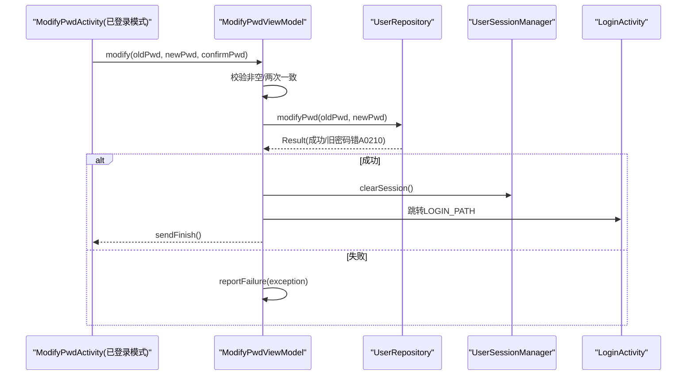
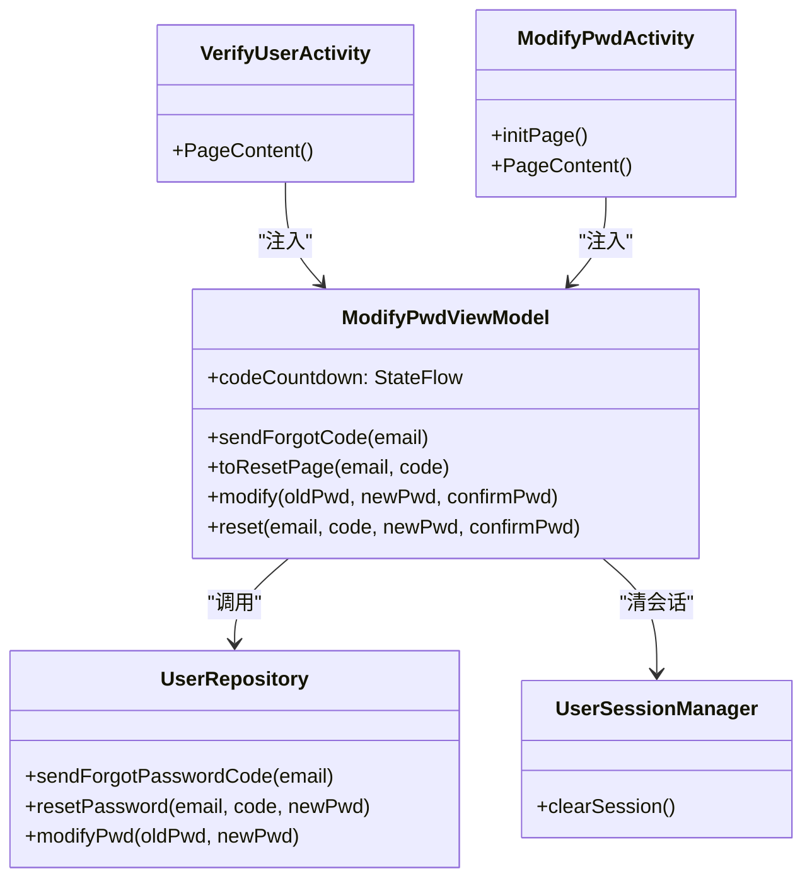

# 密码重置模块

<cite>
**本文引用的文件**
- [VerifyUserActivity.kt](file://module_login/src/main/java/com/ebook/login/VerifyUserActivity.kt)
- [ModifyPwdActivity.kt](file://module_login/src/main/java/com/ebook/login/ModifyPwdActivity.kt)
- [ModifyPwdViewModel.kt](file://module_login/src/main/java/com/ebook/login/mvvm/viewmodel/ModifyPwdViewModel.kt)
- [UserRepository.kt](file://module_login/src/main/java/com/ebook/login/repository/UserRepository.kt)
- [LoginActivity.kt](file://module_login/src/main/java/com/ebook/login/LoginActivity.kt)
- [LoginInterceptor.kt](file://lib_book_common/src/main/java/com/ebook/common/interceptor/LoginInterceptor.kt)
</cite>

## 目录
1. [简介](#简介)
2. [项目结构](#项目结构)
3. [核心组件](#核心组件)
4. [架构总览](#架构总览)
5. [详细组件分析](#详细组件分析)
6. [依赖关系分析](#依赖关系分析)
7. [性能与可用性考虑](#性能与可用性考虑)
8. [故障排查指南](#故障排查指南)
9. [结论](#结论)
10. [附录：扩展与自定义](#附录：扩展与自定义)

## 简介
本模块提供“密码重置”能力，统一覆盖两类场景：
- 已登录改密：校验旧密码后修改新密码，成功后主动清会话并回到登录页。
- 忘记密码重置：通过邮箱验证码完成身份核验，再设置新密码；成功后引导用户重新登录（可预填邮箱）。

该模块采用 MVVM + Compose 页面、TheRouter 跨模块路由、Hilt 注入仓库与服务，错误上报走统一的 reportFailure 通道，会话管理由 UserSessionManager 集中收口。

## 项目结构
密码重置相关代码集中在 module_login，按职责划分为：
- 页面层：VerifyUserActivity（邮箱验证码第一步）、ModifyPwdActivity（双模式改密/重置第二步）
- 状态与流程：ModifyPwdViewModel（倒计时、发码、跳转、改密/重置、会话清理）
- 数据层：UserRepository（封装各端点调用，统一 Result 包装）
- 路由与会话：TheRouter 路由键来自 KeyCode.Login，登录拦截器在需要时重定向到登录页

图表来源
- [VerifyUserActivity.kt:35-66](file://module_login/src/main/java/com/ebook/login/VerifyUserActivity.kt#L35-L66)
- [ModifyPwdActivity.kt:33-50](file://module_login/src/main/java/com/ebook/login/ModifyPwdActivity.kt#L33-L50)
- [ModifyPwdViewModel.kt:25-39](file://module_login/src/main/java/com/ebook/login/mvvm/viewmodel/ModifyPwdViewModel.kt#L25-L39)
- [UserRepository.kt:19-30](file://module_login/src/main/java/com/ebook/login/repository/UserRepository.kt#L19-L30)
- [LoginInterceptor.kt:40-45](file://lib_book_common/src/main/java/com/ebook/common/interceptor/LoginInterceptor.kt#L40-L45)

章节来源
- [VerifyUserActivity.kt:35-66](file://module_login/src/main/java/com/ebook/login/VerifyUserActivity.kt#L35-L66)
- [ModifyPwdActivity.kt:33-50](file://module_login/src/main/java/com/ebook/login/ModifyPwdActivity.kt#L33-L50)
- [ModifyPwdViewModel.kt:25-39](file://module_login/src/main/java/com/ebook/login/mvvm/viewmodel/ModifyPwdViewModel.kt#L25-L39)
- [UserRepository.kt:19-30](file://module_login/src/main/java/com/ebook/login/repository/UserRepository.kt#L19-L30)
- [LoginInterceptor.kt:40-45](file://lib_book_common/src/main/java/com/ebook/common/interceptor/LoginInterceptor.kt#L40-L45)

## 核心组件
- VerifyUserActivity：负责邮箱输入、获取验证码、输入验证码后进入重置第二步。持有 TheRouter 路径 MODIFY_PATH。
- ModifyPwdActivity：双模式入口。RESET 模式仅输入两次新密码；已登录模式需先输入旧密码。持有路径 MODIFY_PWD_PATH。
- ModifyPwdViewModel：共享逻辑中心。包含：
  - 发码倒计时 StateFlow，避免横竖屏丢失进度
  - 发码 → 校验 → 跳转 RESET 模式
  - 已登录改密：旧密码校验 → 成功清会话 → 回登录页
  - 忘记密码重置：验证码+新密码提交 → 成功后回登录页（预填邮箱）
- UserRepository：统一封装 sendForgotPasswordCode、resetPassword、modifyPwd 等网络调用，返回 Result，失败经 reportFailure 上报。
- LoginInterceptor：全局拦截未登录访问，重定向至 LOGIN_PATH。
- LoginActivity：登录页，接收重置成功后携带的 email 参数进行预填或提示。

章节来源
- [VerifyUserActivity.kt:35-66](file://module_login/src/main/java/com/ebook/login/VerifyUserActivity.kt#L35-L66)
- [ModifyPwdActivity.kt:33-95](file://module_login/src/main/java/com/ebook/login/ModifyPwdActivity.kt#L33-L95)
- [ModifyPwdViewModel.kt:25-180](file://module_login/src/main/java/com/ebook/login/mvvm/viewmodel/ModifyPwdViewModel.kt#L25-L180)
- [UserRepository.kt:19-84](file://module_login/src/main/java/com/ebook/login/repository/UserRepository.kt#L19-L84)
- [LoginInterceptor.kt:40-45](file://lib_book_common/src/main/java/com/ebook/common/interceptor/LoginInterceptor.kt#L40-L45)
- [LoginActivity.kt:45-55](file://module_login/src/main/java/com/ebook/login/LoginActivity.kt#L45-L55)

## 架构总览
密码重置涉及两条主链路：
- 忘记密码重置：VerifyUserActivity → ModifyPwdViewModel.sendForgotCode → 服务端发码 → 用户输入验证码 → ModifyPwdViewModel.toResetPage → ModifyPwdActivity(RESET) → ModifyPwdViewModel.reset → 成功后跳转 LOGIN_PATH
- 已登录改密：ModifyPwdActivity(默认) → ModifyPwdViewModel.modify → 服务端校验旧密码 → 成功清会话 → 跳转 LOGIN_PATH

图表来源
- [VerifyUserActivity.kt:52-66](file://module_login/src/main/java/com/ebook/login/VerifyUserActivity.kt#L52-L66)
- [ModifyPwdViewModel.kt:59-111](file://module_login/src/main/java/com/ebook/login/mvvm/viewmodel/ModifyPwdViewModel.kt#L59-L111)
- [UserRepository.kt:71-83](file://module_login/src/main/java/com/ebook/login/repository/UserRepository.kt#L71-L83)
- [ModifyPwdActivity.kt:63-78](file://module_login/src/main/java/com/ebook/login/ModifyPwdActivity.kt#L63-L78)
- [ModifyPwdViewModel.kt:121-172](file://module_login/src/main/java/com/ebook/login/mvvm/viewmodel/ModifyPwdViewModel.kt#L121-L172)

## 详细组件分析

### 忘记密码重置流程（邮箱验证码 → 重置密码）
- 发码：
  - VerifyUserActivity 收集 email，调用 VM.sendForgotCode
  - VM 校验 email 非空后发起请求，成功后启动 60 秒倒计时，防止频繁发码触发 A0241
- 验证与跳转：
  - 用户输入 6 位验证码，VM 做完整性校验（长度=6），然后路由到 ModifyPwdActivity(RESET 模式)，携带 email 与 code
- 重置密码：
  - ModifyPwdActivity(RESET) 仅显示两次新密码
  - VM.reset 调用仓库提交 email + code + newPassword
  - 成功后提示并跳转 LOGIN_PATH（预填 email），关闭当前页

图表来源
- [VerifyUserActivity.kt:52-66](file://module_login/src/main/java/com/ebook/login/VerifyUserActivity.kt#L52-L66)
- [ModifyPwdViewModel.kt:59-111](file://module_login/src/main/java/com/ebook/login/mvvm/viewmodel/ModifyPwdViewModel.kt#L59-L111)
- [UserRepository.kt:71-83](file://module_login/src/main/java/com/ebook/login/repository/UserRepository.kt#L71-L83)
- [ModifyPwdActivity.kt:63-78](file://module_login/src/main/java/com/ebook/login/ModifyPwdActivity.kt#L63-L78)

章节来源
- [VerifyUserActivity.kt:52-66](file://module_login/src/main/java/com/ebook/login/VerifyUserActivity.kt#L52-L66)
- [ModifyPwdViewModel.kt:59-111](file://module_login/src/main/java/com/ebook/login/mvvm/viewmodel/ModifyPwdViewModel.kt#L59-L111)
- [UserRepository.kt:71-83](file://module_login/src/main/java/com/ebook/login/repository/UserRepository.kt#L71-L83)
- [ModifyPwdActivity.kt:63-78](file://module_login/src/main/java/com/ebook/login/ModifyPwdActivity.kt#L63-L78)

### 已登录改密流程（旧密码验证 → 修改成功 → 清会话）
- ModifyPwdActivity 默认模式显示“旧密码 + 新密码×2”
- VM.modify 校验字段完整且两次密码一致后，调用 modifyPwd
- 成功后提示，调用 UserSessionManager.clearSession 清会话（token、登录态、资料镜像），然后跳转 LOGIN_PATH 并关闭当前页

图表来源
- [ModifyPwdActivity.kt:63-78](file://module_login/src/main/java/com/ebook/login/ModifyPwdActivity.kt#L63-L78)
- [ModifyPwdViewModel.kt:121-145](file://module_login/src/main/java/com/ebook/login/mvvm/viewmodel/ModifyPwdViewModel.kt#L121-L145)
- [UserRepository.kt:64-69](file://module_login/src/main/java/com/ebook/login/repository/UserRepository.kt#L64-L69)

章节来源
- [ModifyPwdActivity.kt:63-78](file://module_login/src/main/java/com/ebook/login/ModifyPwdActivity.kt#L63-L78)
- [ModifyPwdViewModel.kt:121-145](file://module_login/src/main/java/com/ebook/login/mvvm/viewmodel/ModifyPwdViewModel.kt#L121-L145)
- [UserRepository.kt:64-69](file://module_login/src/main/java/com/ebook/login/repository/UserRepository.kt#L64-L69)

### 双模式设计与页面切换
- ModifyPwdActivity 通过 EXTRA_MODE 区分 RESET 与已登录模式：
  - RESET：隐藏旧密码框，标题改为“重置密码”，提交走 reset
  - 已登录：显示旧密码框，提交走 modify
- 路由与参数传递：
  - VerifyUserActivity 通过 TheRouter 构建 MODIFY_PWD_PATH，传入 mode=reset、email、code
  - 已登录改密从“我的”或设置入口直接进入 MODIFY_PWD_PATH，不传 mode，默认已登录模式
- 页面栈管理：
  - 重置/改密成功后均调用 sendFinish() 关闭当前页，避免残留中间页
  - 登录拦截器在需要时重定向到 LOGIN_PATH，保证鉴权一致性

章节来源
- [ModifyPwdActivity.kt:33-95](file://module_login/src/main/java/com/ebook/login/ModifyPwdActivity.kt#L33-L95)
- [ModifyPwdViewModel.kt:96-111](file://module_login/src/main/java/com/ebook/login/mvvm/viewmodel/ModifyPwdViewModel.kt#L96-L111)
- [LoginInterceptor.kt:40-45](file://lib_book_common/src/main/java/com/ebook/common/interceptor/LoginInterceptor.kt#L40-L45)

### 共享倒计时逻辑
- codeCountdown 为 StateFlow<Int>，对外暴露只读视图
- startResendCountdown 使用 viewModelScope 启动协程，每秒递减至 0
- 仅在发送验证码成功后启动，失败不锁按钮，用户可立即重试
- 横竖屏切换不会丢失倒计时进度（驻留 ViewModel）

章节来源
- [ModifyPwdViewModel.kt:41-88](file://module_login/src/main/java/com/ebook/login/mvvm/viewmodel/ModifyPwdViewModel.kt#L41-L88)
- [VerifyUserActivity.kt:52-66](file://module_login/src/main/java/com/ebook/login/VerifyUserActivity.kt#L52-L66)

## 依赖关系分析
- 页面依赖 ViewModel：VerifyUserActivity/ModifyPwdActivity 通过 Hilt viewModels() 注入 ModifyPwdViewModel
- ViewModel 依赖仓库与会话：UserRepository 封装网络；UserSessionManager 集中处理会话清理
- 路由依赖：TheRouter 基于 KeyCode.Login 常量定义路径，确保跨模块导航稳定
- 错误上报：统一通过 reportFailure 记录异常，避免重复 UI 提示

图表来源
- [VerifyUserActivity.kt:47-66](file://module_login/src/main/java/com/ebook/login/VerifyUserActivity.kt#L47-L66)
- [ModifyPwdActivity.kt:48-51](file://module_login/src/main/java/com/ebook/login/ModifyPwdActivity.kt#L48-L51)
- [ModifyPwdViewModel.kt:35-39](file://module_login/src/main/java/com/ebook/login/mvvm/viewmodel/ModifyPwdViewModel.kt#L35-L39)
- [UserRepository.kt:26-30](file://module_login/src/main/java/com/ebook/login/repository/UserRepository.kt#L26-L30)

章节来源
- [VerifyUserActivity.kt:47-66](file://module_login/src/main/java/com/ebook/login/VerifyUserActivity.kt#L47-L66)
- [ModifyPwdActivity.kt:48-51](file://module_login/src/main/java/com/ebook/login/ModifyPwdActivity.kt#L48-L51)
- [ModifyPwdViewModel.kt:35-39](file://module_login/src/main/java/com/ebook/login/mvvm/viewmodel/ModifyPwdViewModel.kt#L35-L39)
- [UserRepository.kt:26-30](file://module_login/src/main/java/com/ebook/login/repository/UserRepository.kt#L26-L30)

## 性能与可用性考虑
- 倒计时驻留 ViewModel：避免配置变更导致的状态丢失，减少不必要网络请求
- 本地轻量校验：仅做非空与格式校验（如验证码长度），复杂规则交由服务端，避免客户端与服务端状态不一致
- 错误上报收敛：统一 reportFailure，避免重复提示与日志噪音
- 会话清理单点：clearSession 一次覆盖所有镜像，避免遗漏导致的状态不一致
- 路由直跳：使用 TheRouter 同步跳转，避免事件消费顺序导致的导航丢失

[本节为通用指导，不直接分析具体文件]

## 故障排查指南
- 验证码频控（A0241）：
  - 现象：频繁点击“获取验证码”被限流
  - 定位：检查是否已启动 60 秒倒计时；确认仅在发送成功后启动
  - 参考实现位置：[ModifyPwdViewModel.kt:59-88](file://module_login/src/main/java/com/ebook/login/mvvm/viewmodel/ModifyPwdViewModel.kt#L59-L88)
- 验证码错误（A0132）：
  - 现象：重置失败提示验证码错误
  - 定位：服务端校验；前端只做长度校验，无需额外逻辑
  - 参考实现位置：[ModifyPwdViewModel.kt:96-111](file://module_login/src/main/java/com/ebook/login/mvvm/viewmodel/ModifyPwdViewModel.kt#L96-L111)
- 旧密码错误（A0210）：
  - 现象：已登录改密失败
  - 定位：服务端校验旧密码；失败经 reportFailure 上报
  - 参考实现位置：[ModifyPwdViewModel.kt:121-145](file://module_login/src/main/java/com/ebook/login/mvvm/viewmodel/ModifyPwdViewModel.kt#L121-L145)
- 页面未关闭：
  - 现象：重置/改密成功后仍停留在中间页
  - 定位：确认调用 sendFinish()；基类 MvvmBinder 才会消费命令
  - 参考实现位置：[ModifyPwdViewModel.kt:132-145](file://module_login/src/main/java/com/ebook/login/mvvm/viewmodel/ModifyPwdViewModel.kt#L132-L145), [ModifyPwdViewModel.kt:160-172](file://module_login/src/main/java/com/ebook/login/mvvm/viewmodel/ModifyPwdViewModel.kt#L160-L172)
- 未登录重定向：
  - 现象：访问受保护页面被跳转到登录页
  - 定位：LoginInterceptor 将目标替换为 LOGIN_PATH
  - 参考实现位置：[LoginInterceptor.kt:40-45](file://lib_book_common/src/main/java/com/ebook/common/interceptor/LoginInterceptor.kt#L40-L45)

章节来源
- [ModifyPwdViewModel.kt:59-172](file://module_login/src/main/java/com/ebook/login/mvvm/viewmodel/ModifyPwdViewModel.kt#L59-L172)
- [LoginInterceptor.kt:40-45](file://lib_book_common/src/main/java/com/ebook/common/interceptor/LoginInterceptor.kt#L40-L45)

## 结论
密码重置模块以双模式设计清晰分离“已登录改密”和“忘记密码重置”两条路径，通过 ViewModel 集中管理状态与流程，仓库层统一封装网络与错误上报，会话管理单点收口，路由直跳保障导航可靠性。整体实现兼顾可用性与可维护性，便于后续扩展与定制。

[本节为总结性内容，不直接分析具体文件]

## 附录：扩展与自定义
- 扩展发码策略：
  - 如需增加二次校验（如图形验证码），可在 VerifyUserActivity 中新增输入项，并在 VM.sendForgotCode 前增加本地校验；后端接口不变则无需改动仓库
  - 若后端新增参数，需在 UserRepository 对应方法签名与 Request DTO 中补齐，保持 Result 语义
  - 参考位置：[VerifyUserActivity.kt:52-66](file://module_login/src/main/java/com/ebook/login/VerifyUserActivity.kt#L52-L66), [UserRepository.kt:71-76](file://module_login/src/main/java/com/ebook/login/repository/UserRepository.kt#L71-L76)
- 自定义验证规则：
  - 前端建议仅保留必要的前置校验（非空、格式、长度），复杂规则由服务端校验，避免前后端不一致
  - 如需增强本地校验，建议在 VM 层集中处理，并通过 sendToast 反馈
  - 参考位置：[ModifyPwdViewModel.kt:96-111](file://module_login/src/main/java/com/ebook/login/mvvm/viewmodel/ModifyPwdViewModel.kt#L96-L111), [ModifyPwdViewModel.kt:121-145](file://module_login/src/main/java/com/ebook/login/mvvm/viewmodel/ModifyPwdViewModel.kt#L121-L145)
- 接入新的重置渠道（如短信）：
  - 在 UserRepository 新增 sendSmsCode/resetBySms 等方法，复用 CoroutineAdapter 与 Result 模式
  - 在 VM 新增对应方法与倒计时逻辑（复用 startResendCountdown），在相应 Activity 中绑定 UI
  - 注意：不同渠道的频控策略可能不同，需在 VM 中区分倒计时时长
- 错误处理与用户体验：
  - 所有网络异常与业务异常统一通过 reportFailure 上报，避免重复提示
  - 对关键失败（如 A0132/A0210/A0241）可在 VM 层补充更友好的提示文案
  - 参考位置：[UserRepository.kt:19-30](file://module_login/src/main/java/com/ebook/login/repository/UserRepository.kt#L19-L30), [ModifyPwdViewModel.kt:59-88](file://module_login/src/main/java/com/ebook/login/mvvm/viewmodel/ModifyPwdViewModel.kt#L59-L88)
- 路由与页面栈：
  - 新增路由请在 KeyCode 中声明，并在目标 Activity 上标注 @Route
  - 确保成功后调用 sendFinish()，避免页面残留
  - 参考位置：[ModifyPwdViewModel.kt:96-111](file://module_login/src/main/java/com/ebook/login/mvvm/viewmodel/ModifyPwdViewModel.kt#L96-L111), [ModifyPwdActivity.kt:33-50](file://module_login/src/main/java/com/ebook/login/ModifyPwdActivity.kt#L33-L50)

章节来源
- [VerifyUserActivity.kt:52-66](file://module_login/src/main/java/com/ebook/login/VerifyUserActivity.kt#L52-L66)
- [ModifyPwdViewModel.kt:59-172](file://module_login/src/main/java/com/ebook/login/mvvm/viewmodel/ModifyPwdViewModel.kt#L59-L172)
- [UserRepository.kt:19-83](file://module_login/src/main/java/com/ebook/login/repository/UserRepository.kt#L19-L83)
- [ModifyPwdActivity.kt:33-50](file://module_login/src/main/java/com/ebook/login/ModifyPwdActivity.kt#L33-L50)