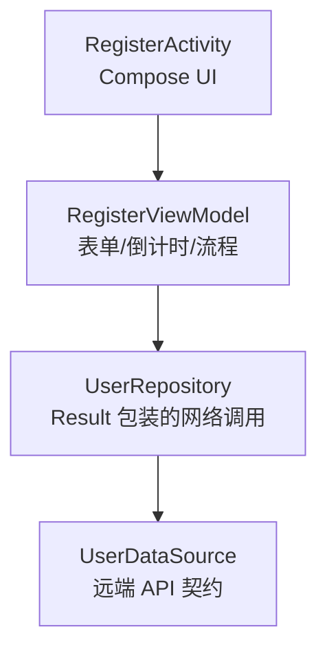
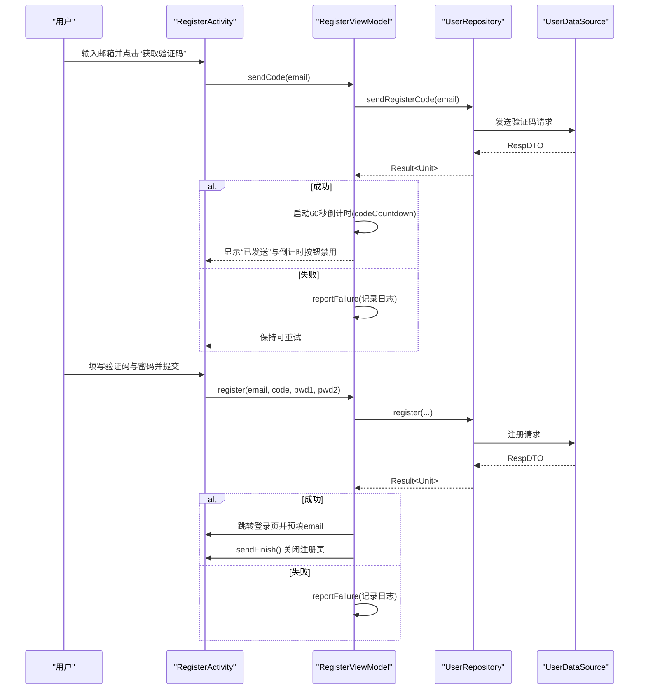
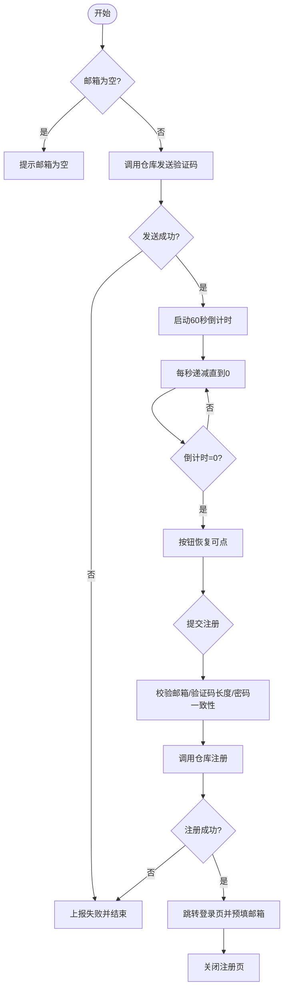
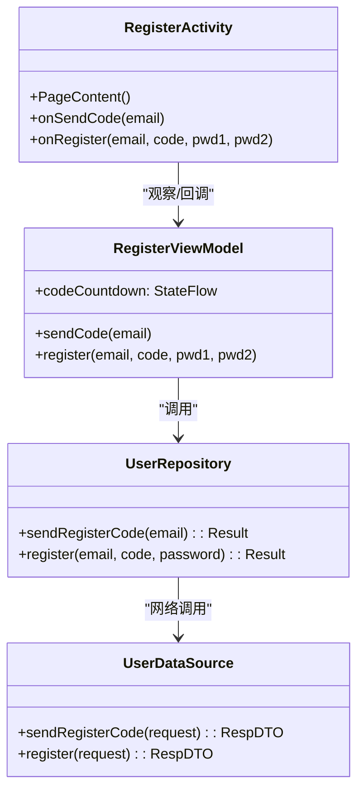

# 注册模块

<cite>
**本文引用的文件**
- [RegisterActivity.kt](file://module_login/src/main/java/com/ebook/login/RegisterActivity.kt)
- [RegisterViewModel.kt](file://module_login/src/main/java/com/ebook/login/mvvm/viewmodel/RegisterViewModel.kt)
- [UserRepository.kt](file://module_login/src/main/java/com/ebook/login/repository/UserRepository.kt)
- [UserDataSource.kt](file://lib_ebook_api/src/main/java/com/ebook/api/service/user/UserDataSource.kt)
</cite>

## 目录
1. [简介](#简介)
2. [项目结构](#项目结构)
3. [核心组件](#核心组件)
4. [架构总览](#架构总览)
5. [详细组件分析](#详细组件分析)
6. [依赖关系分析](#依赖关系分析)
7. [性能与可用性考量](#性能与可用性考量)
8. [故障排查指南](#故障排查指南)
9. [结论](#结论)
10. [附录：扩展与定制示例](#附录：扩展与定制示例)

## 简介
本模块实现邮箱验证码三步注册流程：输入邮箱 → 获取验证码（带倒计时）→ 提交验证码+密码完成注册。注册成功后不保存会话，直接跳转登录页并预填邮箱，由用户主动登录。该设计遵循“注册即激活但不发 token”的约定，避免在注册态持有凭据。

## 项目结构
注册相关代码按 MVVM 分层组织：
- UI 层：RegisterActivity 负责 Compose 界面、事件收集与回调转发。
- 状态与业务编排：RegisterViewModel 负责表单校验、发码与注册流程控制、倒计时 StateFlow。
- 数据访问：UserRepository 封装网络调用，将异常统一转为 Result。
- 接口契约：UserDataSource 定义远端 API 契约（发送验证码、注册等）。

图表来源
- [RegisterActivity.kt:52-71](file://module_login/src/main/java/com/ebook/login/RegisterActivity.kt#L52-L71)
- [RegisterViewModel.kt:24-139](file://module_login/src/main/java/com/ebook/login/mvvm/viewmodel/RegisterViewModel.kt#L24-L139)
- [UserRepository.kt:19-48](file://module_login/src/main/java/com/ebook/login/repository/UserRepository.kt#L19-L48)
- [UserDataSource.kt:16-47](file://lib_ebook_api/src/main/java/com/ebook/api/service/user/UserDataSource.kt#L16-L47)

章节来源
- [RegisterActivity.kt:52-71](file://module_login/src/main/java/com/ebook/login/RegisterActivity.kt#L52-L71)
- [RegisterViewModel.kt:24-139](file://module_login/src/main/java/com/ebook/login/mvvm/viewmodel/RegisterViewModel.kt#L24-L139)
- [UserRepository.kt:19-48](file://module_login/src/main/java/com/ebook/login/repository/UserRepository.kt#L19-L48)
- [UserDataSource.kt:16-47](file://lib_ebook_api/src/main/java/com/ebook/api/service/user/UserDataSource.kt#L16-L47)

## 核心组件
- RegisterActivity
  - 承载注册页面 UI，订阅 ViewModel 的 codeCountdown，转发 onSendCode/onRegister 到 ViewModel。
  - 使用 BaseMvvmActivity 以启用 loading 覆盖层与一次性命令通道（sendFinish 等）。
- RegisterViewModel
  - 暴露 codeCountdown: StateFlow<Int>，驱动倒计时 UI。
  - sendCode(email)：校验邮箱非空，调用仓库发码；成功则启动 60 秒倒计时并提示已发送。
  - register(email, code, pwd1, pwd2)：进行完整性校验（邮箱非空、验证码长度 6、密码两次一致），调用仓库注册；成功后跳转登录页并预填邮箱，关闭当前页。
- UserRepository
  - 对 UserDataSource 的调用进行 safeApiCall 包装，统一返回 Result；注册/发码方法返回 Result<Unit>。
- UserDataSource
  - 声明 sendRegisterCode、register 等远端接口契约。

章节来源
- [RegisterActivity.kt:52-71](file://module_login/src/main/java/com/ebook/login/RegisterActivity.kt#L52-L71)
- [RegisterViewModel.kt:31-139](file://module_login/src/main/java/com/ebook/login/mvvm/viewmodel/RegisterViewModel.kt#L31-L139)
- [UserRepository.kt:27-48](file://module_login/src/main/java/com/ebook/login/repository/UserRepository.kt#L27-L48)
- [UserDataSource.kt:16-47](file://lib_ebook_api/src/main/java/com/ebook/api/service/user/UserDataSource.kt#L16-L47)

## 架构总览
注册流程通过 ViewModel 协调 UI 与 Repository，UI 仅负责展示与事件转发；网络错误与业务错误在 Repository 层统一收敛为 Result，便于上层处理。

图表来源
- [RegisterActivity.kt:57-71](file://module_login/src/main/java/com/ebook/login/RegisterActivity.kt#L57-L71)
- [RegisterViewModel.kt:53-131](file://module_login/src/main/java/com/ebook/login/mvvm/viewmodel/RegisterViewModel.kt#L53-L131)
- [UserRepository.kt:35-48](file://module_login/src/main/java/com/ebook/login/repository/UserRepository.kt#L35-L48)
- [UserDataSource.kt:21-25](file://lib_ebook_api/src/main/java/com/ebook/api/service/user/UserDataSource.kt#L21-L25)

## 详细组件分析

### 三步注册流程与状态管理
- 步骤一：输入邮箱并点击“获取验证码”
  - Activity 将 email 传给 ViewModel 的 sendCode。
  - ViewModel 先校验邮箱非空，再发起网络请求；成功后提示“已发送”并启动倒计时。
- 步骤二：验证码倒计时
  - ViewModel 维护 MutableStateFlow 作为内部状态，对外暴露只读 StateFlow<Int>。
  - 启动一个协程任务，从 60 递减到 1，每秒更新一次；归零后恢复可点击。
  - 倒计时期间按钮禁用，与服务端 60 秒频控对齐，避免重复触发。
- 步骤三：验证码+密码注册
  - 前端进行完整性校验：邮箱非空、验证码长度为 6、两次密码一致。
  - 调用仓库注册；成功后跳转登录页并携带 email 预填，同时关闭注册页。

图表来源
- [RegisterViewModel.kt:53-131](file://module_login/src/main/java/com/ebook/login/mvvm/viewmodel/RegisterViewModel.kt#L53-L131)
- [RegisterActivity.kt:57-71](file://module_login/src/main/java/com/ebook/login/RegisterActivity.kt#L57-L71)

章节来源
- [RegisterViewModel.kt:35-87](file://module_login/src/main/java/com/ebook/login/mvvm/viewmodel/RegisterViewModel.kt#L35-L87)
- [RegisterViewModel.kt:89-131](file://module_login/src/main/java/com/ebook/login/mvvm/viewmodel/RegisterViewModel.kt#L89-L131)
- [RegisterActivity.kt:57-71](file://module_login/src/main/java/com/ebook/login/RegisterActivity.kt#L57-L71)

### RegisterViewModel 的发码倒计时与 60 秒频控
- 倒计时实现
  - 使用 MutableStateFlow 保存剩余秒数，通过协程循环每秒赋值，最终归零。
  - Job 句柄用于取消旧任务，防止重发时状态被覆盖。
- 60 秒频控
  - 常量 CODE_RESEND_COUNTDOWN = 60，与服务端发码频控窗口一致。
  - UI 在倒计时期间禁用“获取验证码”按钮，避免连点导致服务端限流报错。
- 与 Compose 集成
  - Activity 通过 collectAsStateWithLifecycle 订阅 StateFlow，保证配置变更（如旋转）不丢失进度。

章节来源
- [RegisterViewModel.kt:35-87](file://module_login/src/main/java/com/ebook/login/mvvm/viewmodel/RegisterViewModel.kt#L35-L87)
- [RegisterActivity.kt:57-71](file://module_login/src/main/java/com/ebook/login/RegisterActivity.kt#L57-L71)

### 注册表单验证规则
- 邮箱格式
  - 前端校验邮箱非空；具体格式合法性交由服务端业务码判断。
- 验证码长度
  - 要求长度为 6；否则提示验证码无效。
- 密码一致性
  - 要求两次密码均非空且相等；不一致时提示密码不一致。
- 说明
  - 客户端只做最小必要的前置校验，真正的业务有效性在服务端判定。

章节来源
- [RegisterViewModel.kt:95-111](file://module_login/src/main/java/com/ebook/login/mvvm/viewmodel/RegisterViewModel.kt#L95-L111)

### 注册成功后的跳转与会话策略
- 不保存会话的原因
  - 注册即激活但不发放 token，因此不在本地保存会话，避免无凭据状态下的误用。
- 跳转到登录页并预填邮箱
  - 成功后通过路由跳转到登录页，并在参数中传递 email，以便自动预填。
  - 调用 sendFinish() 关闭注册页，确保返回栈干净。

章节来源
- [RegisterViewModel.kt:112-131](file://module_login/src/main/java/com/ebook/login/mvvm/viewmodel/RegisterViewModel.kt#L112-L131)

## 依赖关系分析
- RegisterActivity 依赖 RegisterViewModel，仅做 UI 绑定与事件转发。
- RegisterViewModel 依赖 UserRepository，通过 Result 分支处理成功与失败。
- UserRepository 依赖 UserDataSource，所有网络调用经 CoroutineAdapter 安全包装。
- UserDataSource 定义 API 契约，具体实现由网络层装配。

图表来源
- [RegisterActivity.kt:52-71](file://module_login/src/main/java/com/ebook/login/RegisterActivity.kt#L52-L71)
- [RegisterViewModel.kt:31-139](file://module_login/src/main/java/com/ebook/login/mvvm/viewmodel/RegisterViewModel.kt#L31-L139)
- [UserRepository.kt:27-48](file://module_login/src/main/java/com/ebook/login/repository/UserRepository.kt#L27-L48)
- [UserDataSource.kt:16-47](file://lib_ebook_api/src/main/java/com/ebook/api/service/user/UserDataSource.kt#L16-L47)

章节来源
- [RegisterActivity.kt:52-71](file://module_login/src/main/java/com/ebook/login/RegisterActivity.kt#L52-L71)
- [RegisterViewModel.kt:31-139](file://module_login/src/main/java/com/ebook/login/mvvm/viewmodel/RegisterViewModel.kt#L31-L139)
- [UserRepository.kt:27-48](file://module_login/src/main/java/com/ebook/login/repository/UserRepository.kt#L27-L48)
- [UserDataSource.kt:16-47](file://lib_ebook_api/src/main/java/com/ebook/api/service/user/UserDataSource.kt#L16-L47)

## 性能与可用性考量
- 倒计时驻留于 ViewModel，横竖屏切换不丢失进度，用户体验更稳定。
- 使用 StateFlow 单向数据流，避免竞态与重复渲染。
- 60 秒频控减少服务端压力与错误提示噪音。
- 前端轻量校验降低无效请求次数，但严格校验交给服务端。
- Loading 覆盖层提升反馈，失败路径统一上报日志，避免重复弹窗。

## 故障排查指南
- 发送验证码失败
  - 现象：按钮未禁用或无法进入倒计时。
  - 原因：邮箱为空或网络/业务异常。
  - 处理：检查邮箱是否为空；查看报告日志；确认网络可达与后端服务正常。
- 验证码长度校验失败
  - 现象：提交注册时提示验证码无效。
  - 原因：验证码不足 6 位。
  - 处理：引导用户重新获取并正确输入。
- 密码不一致
  - 现象：提交注册时提示密码不一致。
  - 原因：两次密码不同或其中一处为空。
  - 处理：提示用户重新输入并确保一致。
- 注册成功后仍停留在注册页
  - 现象：登录后回退出现注册页。
  - 原因：未调用 sendFinish() 或未继承 BaseMvvmActivity。
  - 处理：确保使用 BaseMvvmActivity 并在成功后调用 sendFinish()。
- 登录页未预填邮箱
  - 现象：跳转登录页后邮箱字段为空。
  - 原因：未在参数中传递 email。
  - 处理：检查跳转逻辑是否正确携带 email。

章节来源
- [RegisterViewModel.kt:53-131](file://module_login/src/main/java/com/ebook/login/mvvm/viewmodel/RegisterViewModel.kt#L53-L131)
- [RegisterActivity.kt:43-55](file://module_login/src/main/java/com/ebook/login/RegisterActivity.kt#L43-L55)

## 结论
注册模块采用清晰的 MVVM 分层与响应式状态管理，通过 ViewModel 集中处理发码、倒计时与注册流程；前端只做必要的完整性校验，业务有效性交由服务端保障。注册成功后不保存会话，而是引导用户主动登录，符合安全与体验的最佳实践。

## 附录：扩展与定制示例
以下示例以现有代码为基础，给出扩展思路与定位路径（不直接粘贴代码）：

- 如何扩展注册流程（例如增加邀请码字段）
  - 在 RegisterActivity 的 Compose 界面中添加新字段，并将值传入 onRegister。
  - 在 RegisterViewModel.register 中接收新字段并加入前置校验。
  - 在 UserRepository.register 中构造新的请求体并调用 UserDataSource.register。
  - 参考路径：
    - [RegisterActivity.kt:80-167](file://module_login/src/main/java/com/ebook/login/RegisterActivity.kt#L80-L167)
    - [RegisterViewModel.kt:89-131](file://module_login/src/main/java/com/ebook/login/mvvm/viewmodel/RegisterViewModel.kt#L89-L131)
    - [UserRepository.kt:41-48](file://module_login/src/main/java/com/ebook/login/repository/UserRepository.kt#L41-L48)
    - [UserDataSource.kt:21-25](file://lib_ebook_api/src/main/java/com/ebook/api/service/user/UserDataSource.kt#L21-L25)

- 如何处理验证码发送失败
  - 在 sendCode 的 onFailure 分支添加自定义处理（如特定错误码重试、降级提示）。
  - 可在 ViewModel 中增加重试计数与退避策略，或根据错误类型差异化提示。
  - 参考路径：
    - [RegisterViewModel.kt:53-72](file://module_login/src/main/java/com/ebook/login/mvvm/viewmodel/RegisterViewModel.kt#L53-L72)
    - [UserRepository.kt:35-39](file://module_login/src/main/java/com/ebook/login/repository/UserRepository.kt#L35-L39)

- 如何自定义倒计时样式
  - 在 AuthCodeField 中替换 TextButton 的样式或文案模板，支持动态颜色或动画。
  - 可通过回调参数或主题样式注入，使不同页面拥有不同的倒计时外观。
  - 参考路径：
    - [RegisterActivity.kt:169-209](file://module_login/src/main/java/com/ebook/login/RegisterActivity.kt#L169-L209)

- 如何调整频控时长
  - 修改 RegisterViewModel 中的 CODE_RESEND_COUNTDOWN 常量以匹配新的服务端策略。
  - 同步更新 UI 文案与提示信息，确保与行为一致。
  - 参考路径：
    - [RegisterViewModel.kt:134-138](file://module_login/src/main/java/com/ebook/login/mvvm/viewmodel/RegisterViewModel.kt#L134-L138)