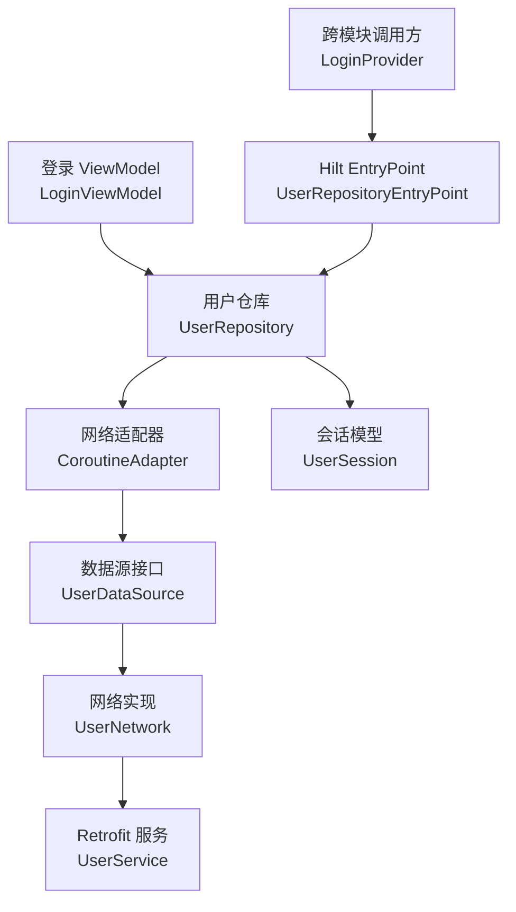
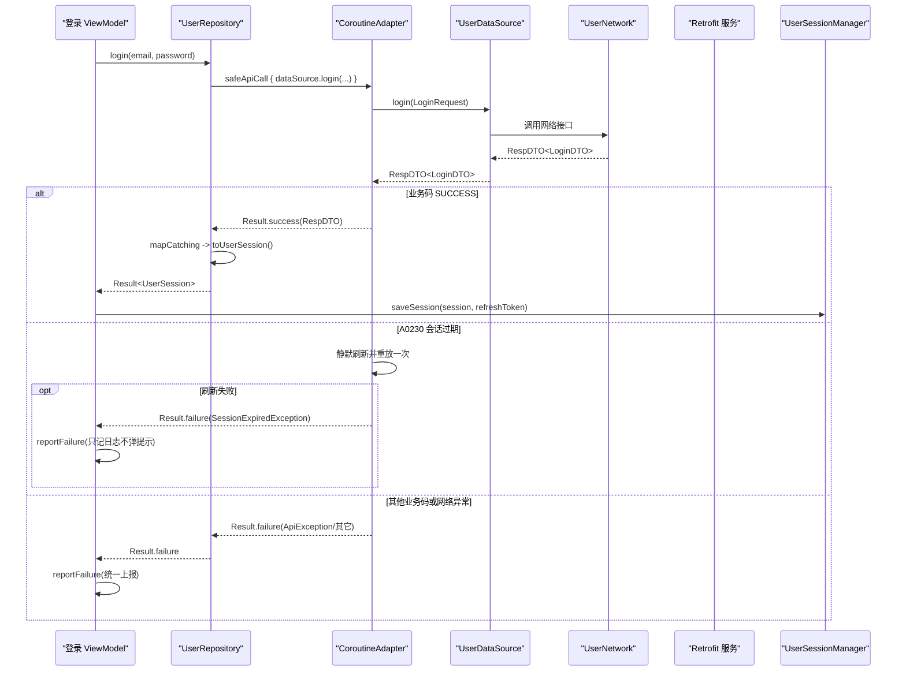
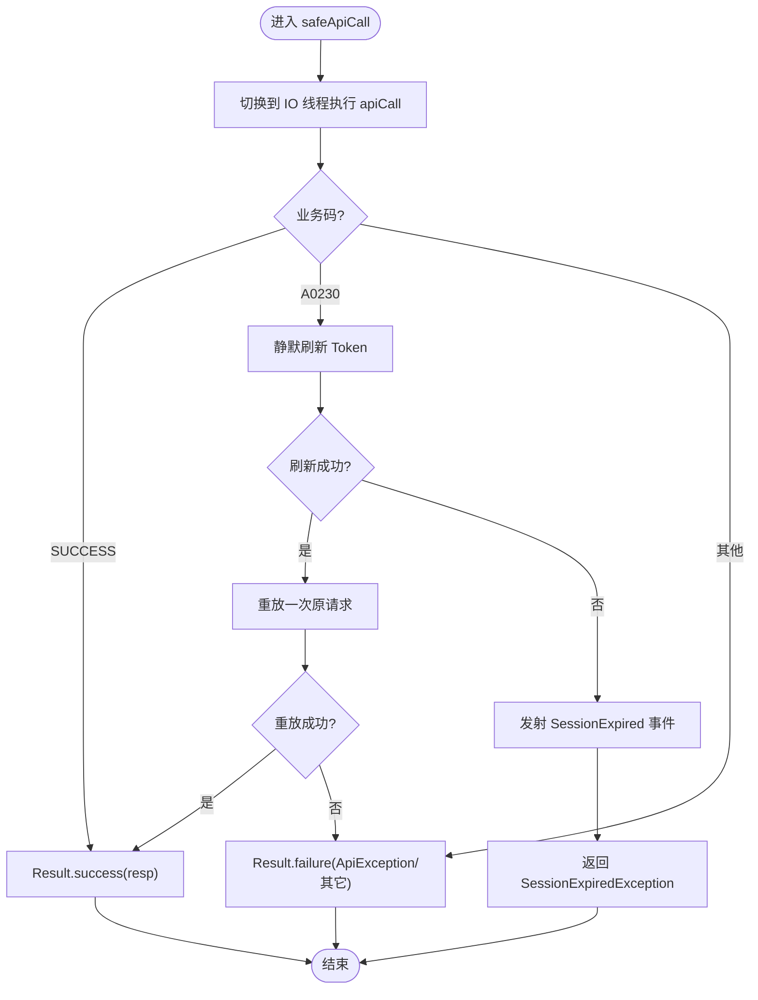
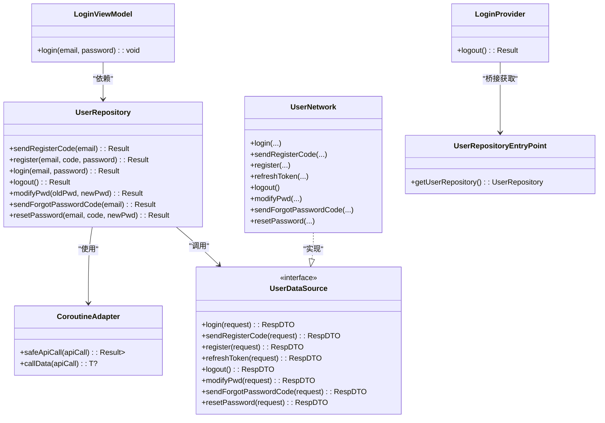

# 用户数据仓库 (UserRepository)

<cite>
**本文引用的文件**
- [module_login/src/main/java/com/ebook/login/repository/UserRepository.kt](file://module_login/src/main/java/com/ebook/login/repository/UserRepository.kt)
- [lib_ebook_api/src/main/java/com/ebook/api/service/user/UserDataSource.kt](file://lib_ebook_api/src/main/java/com/ebook/api/service/user/UserDataSource.kt)
- [lib_ebook_api/src/main/java/com/ebook/api/service/user/UserNetwork.kt](file://lib_ebook_api/src/main/java/com/ebook/api/service/user/UserNetwork.kt)
- [lib_ebook_api/src/main/java/com/ebook/api/utils/CoroutineAdapter.kt](file://lib_ebook_api/src/main/java/com/ebook/api/utils/CoroutineAdapter.kt)
- [lib_ebook_api/src/main/java/com/ebook/api/entity/LoginDTO.kt](file://lib_ebook_api/src/main/java/com/ebook/api/entity/LoginDTO.kt)
- [lib_book_common/src/main/java/com/ebook/common/domain/UserSession.kt](file://lib_book_common/src/main/java/com/ebook/common/domain/UserSession.kt)
- [module_login/src/main/java/com/ebook/login/provider/LoginProvider.kt](file://module_login/src/main/java/com/ebook/login/provider/LoginProvider.kt)
- [module_login/src/main/java/com/ebook/login/mvvm/viewmodel/LoginViewModel.kt](file://module_login/src/main/java/com/ebook/login/mvvm/viewmodel/LoginViewModel.kt)
</cite>

## 目录
1. [简介](#简介)
2. [项目结构定位](#项目结构定位)
3. [核心组件](#核心组件)
4. [架构总览](#架构总览)
5. [详细组件分析](#详细组件分析)
6. [依赖关系分析](#依赖关系分析)
7. [性能与异常特性](#性能与异常特性)
8. [故障排查指南](#故障排查指南)
9. [结论](#结论)
10. [附录：新增认证接口与扩展实践](#附录新增认证接口与扩展实践)

## 简介
本文件围绕“用户数据仓库 UserRepository”展开，解释其作为认证相关所有端点的统一入口：登录、注册、改密、忘记密码、登出。重点说明：
- CoroutineAdapter.safeApiCall 的统一异常处理、Result 包装、业务码转换；
- 各方法的职责边界（sendRegisterCode 与 sendForgotPasswordCode 的区别、login 返回的 UserSession 结构、logout 的服务端行为）；
- Hilt EntryPoint 的作用：TheRouter 创建的 Provider 通过 EntryPoint 桥接获取仓库实例；
- 给出如何新增认证接口、统一错误处理、扩展数据转换的具体实践路径。

## 项目结构定位
- 仓库层位于 module_login，封装认证域的数据访问能力，对外暴露简洁的 suspend 方法，全部经 CoroutineAdapter 统一处理网络与业务异常。
- 网络实现位于 lib_ebook_api，包含 UserDataSource 接口与 UserNetwork 实现，将请求路由到具体服务端 API。
- 会话模型在 lib_book_common，UserSession 是跨模块 seam 类型，登录响应 LoginDTO 在此处被转换为 UserSession。
- 跨模块调用通过 TheRouter + Hilt EntryPoint：LoginProvider 由 TheRouter 创建，再通过 EntryPointAccessors 从 Hilt 图中取出 UserRepository。

图表来源
- [module_login/src/main/java/com/ebook/login/mvvm/viewmodel/LoginViewModel.kt:29-107](file://module_login/src/main/java/com/ebook/login/mvvm/viewmodel/LoginViewModel.kt#L29-L107)
- [module_login/src/main/java/com/ebook/login/repository/UserRepository.kt:27-84](file://module_login/src/main/java/com/ebook/login/repository/UserRepository.kt#L27-L84)
- [lib_ebook_api/src/main/java/com/ebook/api/utils/CoroutineAdapter.kt:29-62](file://lib_ebook_api/src/main/java/com/ebook/api/utils/CoroutineAdapter.kt#L29-L62)
- [lib_ebook_api/src/main/java/com/ebook/api/service/user/UserDataSource.kt:16-47](file://lib_ebook_api/src/main/java/com/ebook/api/service/user/UserDataSource.kt#L16-L47)
- [lib_ebook_api/src/main/java/com/ebook/api/service/user/UserNetwork.kt:20-67](file://lib_ebook_api/src/main/java/com/ebook/api/service/user/UserNetwork.kt#L20-L67)
- [lib_book_common/src/main/java/com/ebook/common/domain/UserSession.kt:1-17](file://lib_book_common/src/main/java/com/ebook/common/domain/UserSession.kt#L1-L17)
- [module_login/src/main/java/com/ebook/login/provider/LoginProvider.kt:21-35](file://module_login/src/main/java/com/ebook/login/provider/LoginProvider.kt#L21-L35)

章节来源
- [module_login/src/main/java/com/ebook/login/repository/UserRepository.kt:19-94](file://module_login/src/main/java/com/ebook/login/repository/UserRepository.kt#L19-L94)
- [lib_ebook_api/src/main/java/com/ebook/api/service/user/UserDataSource.kt:16-47](file://lib_ebook_api/src/main/java/com/ebook/api/service/user/UserDataSource.kt#L16-L47)
- [lib_ebook_api/src/main/java/com/ebook/api/service/user/UserNetwork.kt:20-67](file://lib_ebook_api/src/main/java/com/ebook/api/service/user/UserNetwork.kt#L20-L67)
- [lib_ebook_api/src/main/java/com/ebook/api/utils/CoroutineAdapter.kt:17-150](file://lib_ebook_api/src/main/java/com/ebook/api/utils/CoroutineAdapter.kt#L17-L150)
- [lib_book_common/src/main/java/com/ebook/common/domain/UserSession.kt:1-17](file://lib_book_common/src/main/java/com/ebook/common/domain/UserSession.kt#L1-L17)
- [module_login/src/main/java/com/ebook/login/provider/LoginProvider.kt:11-35](file://module_login/src/main/java/com/ebook/login/provider/LoginProvider.kt#L11-L35)

## 核心组件
- UserRepository：认证域统一入口，提供 sendRegisterCode、register、login、logout、modifyPwd、sendForgotPasswordCode、resetPassword 等方法。每个方法都经 CoroutineAdapter.safeApiCall 包裹，返回 Result，并在成功分支做必要的数据映射。
- CoroutineAdapter：统一网络请求适配，负责 IO 线程切换、RespDTO 业务码翻译为 Result、A0230 会话过期静默刷新与重放、未知异常统一上报与包装。
- UserDataSource/UserNetwork：认证端点的数据源抽象与实际网络实现，将参数转为 DTO 并调用 Retrofit 服务。
- UserSession/LoginDTO：登录响应的领域模型，UserSession 作为跨模块 seam 类型承载用户身份与 token 信息。
- LoginProvider + UserRepositoryEntryPoint：跨模块 Provider 通过 Hilt EntryPoint 从 Hilt 图获取 UserRepository，解耦 TheRouter 创建流程与依赖注入。

章节来源
- [module_login/src/main/java/com/ebook/login/repository/UserRepository.kt:27-94](file://module_login/src/main/java/com/ebook/login/repository/UserRepository.kt#L27-L94)
- [lib_ebook_api/src/main/java/com/ebook/api/utils/CoroutineAdapter.kt:17-150](file://lib_ebook_api/src/main/java/com/ebook/api/utils/CoroutineAdapter.kt#L17-L150)
- [lib_ebook_api/src/main/java/com/ebook/api/service/user/UserDataSource.kt:16-47](file://lib_ebook_api/src/main/java/com/ebook/api/service/user/UserDataSource.kt#L16-L47)
- [lib_ebook_api/src/main/java/com/ebook/api/service/user/UserNetwork.kt:20-67](file://lib_ebook_api/src/main/java/com/ebook/api/service/user/UserNetwork.kt#L20-L67)
- [lib_book_common/src/main/java/com/ebook/common/domain/UserSession.kt:1-17](file://lib_book_common/src/main/java/com/ebook/common/domain/UserSession.kt#L1-L17)
- [module_login/src/main/java/com/ebook/login/provider/LoginProvider.kt:21-35](file://module_login/src/main/java/com/ebook/login/provider/LoginProvider.kt#L21-L35)

## 架构总览
认证链路以 Repository 为中心，上层 ViewModel 仅关注业务结果与 UI 状态，网络异常与会话管理下沉至 CoroutineAdapter。跨模块调用通过 Provider + EntryPoint 桥接，避免模块间直接耦合。

图表来源
- [module_login/src/main/java/com/ebook/login/mvvm/viewmodel/LoginViewModel.kt:45-73](file://module_login/src/main/java/com/ebook/login/mvvm/viewmodel/LoginViewModel.kt#L45-L73)
- [module_login/src/main/java/com/ebook/login/repository/UserRepository.kt:50-55](file://module_login/src/main/java/com/ebook/login/repository/UserRepository.kt#L50-L55)
- [lib_ebook_api/src/main/java/com/ebook/api/utils/CoroutineAdapter.kt:41-62](file://lib_ebook_api/src/main/java/com/ebook/api/utils/CoroutineAdapter.kt#L41-L62)
- [lib_ebook_api/src/main/java/com/ebook/api/service/user/UserDataSource.kt:18-20](file://lib_ebook_api/src/main/java/com/ebook/api/service/user/UserDataSource.kt#L18-L20)
- [lib_ebook_api/src/main/java/com/ebook/api/service/user/UserNetwork.kt:28-30](file://lib_ebook_api/src/main/java/com/ebook/api/service/user/UserNetwork.kt#L28-L30)
- [lib_ebook_api/src/main/java/com/ebook/api/entity/LoginDTO.kt:6-16](file://lib_ebook_api/src/main/java/com/ebook/api/entity/LoginDTO.kt#L6-L16)

## 详细组件分析

### UserRepository：认证统一入口
- 职责边界
  - sendRegisterCode：发送注册专用验证码（与忘记密码发码端点分离），成功后返回 Unit。
  - register：邮箱+验证码+密码注册，注册即激活但不发放 token，需用户主动登录。
  - login：邮箱+密码登录，成功返回 UserSession（含 userId、username、nickname、avatar、token、refreshToken）。
  - logout：服务端作废该用户全部 refresh token，本地会话清理由调用方负责。
  - modifyPwd：已登录改密，旧密码由服务端校验，成功后原会话失效需重新登录。
  - sendForgotPasswordCode：发送忘记密码验证码（与注册发码端点分离），60 秒频控。
  - resetPassword：邮箱+验证码+新密码重置，验证码由服务端校验。
- 统一异常与结果
  - 所有方法使用 coroutineAdapter.safeApiCall 包裹，统一返回 Result<T>，调用方仅需处理 onSuccess/onFailure。
  - 成功时进行必要的数据映射（如 login 将 LoginDTO 转为 UserSession）。
- 示例参考路径
  - 发送注册验证码：[module_login/src/main/java/com/ebook/login/repository/UserRepository.kt:35-39](file://module_login/src/main/java/com/ebook/login/repository/UserRepository.kt#L35-L39)
  - 登录：[module_login/src/main/java/com/ebook/login/repository/UserRepository.kt:50-55](file://module_login/src/main/java/com/ebook/login/repository/UserRepository.kt#L50-L55)
  - 登出：[module_login/src/main/java/com/ebook/login/repository/UserRepository.kt:57-62](file://module_login/src/main/java/com/ebook/login/repository/UserRepository.kt#L57-L62)
  - 改密：[module_login/src/main/java/com/ebook/login/repository/UserRepository.kt:64-69](file://module_login/src/main/java/com/ebook/login/repository/UserRepository.kt#L64-L69)
  - 忘记密码发码：[module_login/src/main/java/com/ebook/login/repository/UserRepository.kt:71-76](file://module_login/src/main/java/com/ebook/login/repository/UserRepository.kt#L71-L76)
  - 重置密码：[module_login/src/main/java/com/ebook/login/repository/UserRepository.kt:78-83](file://module_login/src/main/java/com/ebook/login/repository/UserRepository.kt#L78-L83)

章节来源
- [module_login/src/main/java/com/ebook/login/repository/UserRepository.kt:19-84](file://module_login/src/main/java/com/ebook/login/repository/UserRepository.kt#L19-L84)

### CoroutineAdapter：统一异常处理与业务码转换
- 职责
  - 将网络请求切到 IO 线程执行。
  - 将 RespDTO 的业务码转换为 Result：SUCCESS 成功，USER_ERROR_A0230 走会话过期处理，其余转为失败。
  - 捕获网络/未知异常，统一包装为 ApiException 或其他异常并记录日志。
  - A0230 静默刷新：单飞刷新（并发安全）→ 成功则用新 token 重放一次原请求；失败则发射会话过期事件，由全局订阅方统一处置（清会话、提示、跳转登录）。
- 关键流程
  - safeApiCall：try/catch 包裹请求，按业务码分支处理，取消异常原样抛出。
  - handleTokenExpired：刷新失败时 emit SessionEvent.SessionExpired，返回 SessionExpiredException 标记，调用方可据此“只记日志、不再弹 Toast”。
- 示例参考路径
  - 通用封装：[lib_ebook_api/src/main/java/com/ebook/api/utils/CoroutineAdapter.kt:41-62](file://lib_ebook_api/src/main/java/com/ebook/api/utils/CoroutineAdapter.kt#L41-L62)
  - 会话过期处理：[lib_ebook_api/src/main/java/com/ebook/api/utils/CoroutineAdapter.kt:64-112](file://lib_ebook_api/src/main/java/com/ebook/api/utils/CoroutineAdapter.kt#L64-L112)
  - 会话过期判断工具：[lib_ebook_api/src/main/java/com/ebook/api/utils/CoroutineAdapter.kt:132-149](file://lib_ebook_api/src/main/java/com/ebook/api/utils/CoroutineAdapter.kt#L132-L149)

图表来源
- [lib_ebook_api/src/main/java/com/ebook/api/utils/CoroutineAdapter.kt:41-112](file://lib_ebook_api/src/main/java/com/ebook/api/utils/CoroutineAdapter.kt#L41-L112)

章节来源
- [lib_ebook_api/src/main/java/com/ebook/api/utils/CoroutineAdapter.kt:17-150](file://lib_ebook_api/src/main/java/com/ebook/api/utils/CoroutineAdapter.kt#L17-L150)

### UserDataSource / UserNetwork：认证端点契约与实现
- UserDataSource 定义认证相关接口（登录、注册发码、注册、刷新 token、登出、改密、忘记密码发码、重置密码等）。
- UserNetwork 基于 RetrofitBuilder 构建网络客户端，并将请求转发到 UserService。
- 示例参考路径
  - 接口定义：[lib_ebook_api/src/main/java/com/ebook/api/service/user/UserDataSource.kt:16-47](file://lib_ebook_api/src/main/java/com/ebook/api/service/user/UserDataSource.kt#L16-L47)
  - 网络实现：[lib_ebook_api/src/main/java/com/ebook/api/service/user/UserNetwork.kt:20-67](file://lib_ebook_api/src/main/java/com/ebook/api/service/user/UserNetwork.kt#L20-L67)

章节来源
- [lib_ebook_api/src/main/java/com/ebook/api/service/user/UserDataSource.kt:16-47](file://lib_ebook_api/src/main/java/com/ebook/api/service/user/UserDataSource.kt#L16-L47)
- [lib_ebook_api/src/main/java/com/ebook/api/service/user/UserNetwork.kt:20-67](file://lib_ebook_api/src/main/java/com/ebook/api/service/user/UserNetwork.kt#L20-L67)

### UserSession 与登录响应映射
- LoginDTO：服务端登录响应载荷，包含用户信息与双 token（access token 与 refresh_token）。
- UserSession：跨模块 seam 类型，承载用户身份、头像、昵称及 token 信息；refreshToken 仅在登录瞬时有效，后续维护由会话管理器负责。
- 示例参考路径
  - LoginDTO：[lib_ebook_api/src/main/java/com/ebook/api/entity/LoginDTO.kt:6-16](file://lib_ebook_api/src/main/java/com/ebook/api/entity/LoginDTO.kt#L6-L16)
  - UserSession：[lib_book_common/src/main/java/com/ebook/common/domain/UserSession.kt:1-17](file://lib_book_common/src/main/java/com/ebook/common/domain/UserSession.kt#L1-L17)
  - 登录映射（toUserSession）：见 UserRepository 中 login 的成功分支映射位置 [module_login/src/main/java/com/ebook/login/repository/UserRepository.kt:50-55](file://module_login/src/main/java/com/ebook/login/repository/UserRepository.kt#L50-L55)

章节来源
- [lib_ebook_api/src/main/java/com/ebook/api/entity/LoginDTO.kt:6-16](file://lib_ebook_api/src/main/java/com/ebook/api/entity/LoginDTO.kt#L6-L16)
- [lib_book_common/src/main/java/com/ebook/common/domain/UserSession.kt:1-17](file://lib_book_common/src/main/java/com/ebook/common/domain/UserSession.kt#L1-L17)
- [module_login/src/main/java/com/ebook/login/repository/UserRepository.kt:50-55](file://module_login/src/main/java/com/ebook/login/repository/UserRepository.kt#L50-L55)

### Hilt EntryPoint 与 TheRouter Provider 桥接
- LoginProvider 由 TheRouter 创建，非 Hilt 注入；初始化时通过 EntryPointAccessors.fromApplication 获取 UserRepositoryEntryPoint，再调用 getUserRepository() 取得仓库实例。
- UserRepositoryEntryPoint 声明在 SingletonComponent，供应用级 EntryPoint 解析。
- 示例参考路径
  - Provider 桥接：[module_login/src/main/java/com/ebook/login/provider/LoginProvider.kt:21-35](file://module_login/src/main/java/com/ebook/login/provider/LoginProvider.kt#L21-L35)
  - EntryPoint 声明：[module_login/src/main/java/com/ebook/login/repository/UserRepository.kt:86-94](file://module_login/src/main/java/com/ebook/login/repository/UserRepository.kt#L86-L94)

章节来源
- [module_login/src/main/java/com/ebook/login/provider/LoginProvider.kt:11-35](file://module_login/src/main/java/com/ebook/login/provider/LoginProvider.kt#L11-L35)
- [module_login/src/main/java/com/ebook/login/repository/UserRepository.kt:86-94](file://module_login/src/main/java/com/ebook/login/repository/UserRepository.kt#L86-L94)

## 依赖关系分析
- UserRepository 依赖 UserDataSource 与 CoroutineAdapter；
- CoroutineAdapter 依赖 TokenRefresher、SessionEventBus、TokenHolder；
- UserNetwork 依赖 RetrofitBuilder；
- LoginProvider 依赖 UserRepositoryEntryPoint；
- LoginViewModel 依赖 UserRepository、UserSessionManager、ProfileRepository。

图表来源
- [module_login/src/main/java/com/ebook/login/repository/UserRepository.kt:27-94](file://module_login/src/main/java/com/ebook/login/repository/UserRepository.kt#L27-L94)
- [lib_ebook_api/src/main/java/com/ebook/api/service/user/UserDataSource.kt:16-47](file://lib_ebook_api/src/main/java/com/ebook/api/service/user/UserDataSource.kt#L16-L47)
- [lib_ebook_api/src/main/java/com/ebook/api/service/user/UserNetwork.kt:20-67](file://lib_ebook_api/src/main/java/com/ebook/api/service/user/UserNetwork.kt#L20-L67)
- [module_login/src/main/java/com/ebook/login/provider/LoginProvider.kt:21-35](file://module_login/src/main/java/com/ebook/login/provider/LoginProvider.kt#L21-L35)
- [module_login/src/main/java/com/ebook/login/mvvm/viewmodel/LoginViewModel.kt:29-107](file://module_login/src/main/java/com/ebook/login/mvvm/viewmodel/LoginViewModel.kt#L29-L107)

章节来源
- [module_login/src/main/java/com/ebook/login/repository/UserRepository.kt:27-94](file://module_login/src/main/java/com/ebook/login/repository/UserRepository.kt#L27-L94)
- [lib_ebook_api/src/main/java/com/ebook/api/service/user/UserDataSource.kt:16-47](file://lib_ebook_api/src/main/java/com/ebook/api/service/user/UserDataSource.kt#L16-L47)
- [lib_ebook_api/src/main/java/com/ebook/api/service/user/UserNetwork.kt:20-67](file://lib_ebook_api/src/main/java/com/ebook/api/service/user/UserNetwork.kt#L20-L67)
- [module_login/src/main/java/com/ebook/login/provider/LoginProvider.kt:21-35](file://module_login/src/main/java/com/ebook/login/provider/LoginProvider.kt#L21-L35)
- [module_login/src/main/java/com/ebook/login/mvvm/viewmodel/LoginViewModel.kt:29-107](file://module_login/src/main/java/com/ebook/login/mvvm/viewmodel/LoginViewModel.kt#L29-L107)

## 性能与异常特性
- 线程模型：网络请求统一在 IO 线程执行，避免阻塞主线程。
- 异常收敛：所有业务码与网络异常在 CoroutineAdapter 统一处理，调用方无需关心细节；A0230 会话过期走静默刷新与重放，失败时通过全局事件统一处置。
- 去抖与幂等：登录页有防重复点击保护（isLoggingIn），减少重复请求。
- 结果包装：Repository 返回 Result<T>，调用方可简单分支处理成功/失败，降低错误分支复杂度。

章节来源
- [lib_ebook_api/src/main/java/com/ebook/api/utils/CoroutineAdapter.kt:41-62](file://lib_ebook_api/src/main/java/com/ebook/api/utils/CoroutineAdapter.kt#L41-L62)
- [module_login/src/main/java/com/ebook/login/mvvm/viewmodel/LoginViewModel.kt:45-73](file://module_login/src/main/java/com/ebook/login/mvvm/viewmodel/LoginViewModel.kt#L45-L73)

## 故障排查指南
- 登录失败
  - 检查前端输入校验（邮箱/密码非空）与后端业务码；
  - 若返回 A0230，确认静默刷新是否成功，失败时查看全局会话过期事件是否触发。
- 登出后仍保留旧会话
  - 确保调用方清理本地会话（UserSessionManager.clearSession），仓库仅负责服务端作废 refresh token。
- 验证码频控
  - 注册发码与忘记密码发码分别对应不同端点，注意 60 秒频控限制（A0241）。
- 会话过期且刷新失败
  - 观察 SessionExpiredException 是否被识别，调用方应“只记日志、不再弹 Toast”，避免重复提示。

章节来源
- [module_login/src/main/java/com/ebook/login/repository/UserRepository.kt:57-62](file://module_login/src/main/java/com/ebook/login/repository/UserRepository.kt#L57-L62)
- [lib_ebook_api/src/main/java/com/ebook/api/utils/CoroutineAdapter.kt:64-112](file://lib_ebook_api/src/main/java/com/ebook/api/utils/CoroutineAdapter.kt#L64-L112)
- [module_login/src/main/java/com/ebook/login/mvvm/viewmodel/LoginViewModel.kt:45-73](file://module_login/src/main/java/com/ebook/login/mvvm/viewmodel/LoginViewModel.kt#L45-L73)

## 结论
UserRepository 作为认证域的统一数据入口，将网络异常、业务码、会话过期等复杂逻辑下沉至 CoroutineAdapter，并通过 Result 包装简化调用方处理。登录返回 UserSession，登出在服务端作废会话，本地清理由调用方负责。跨模块通过 LoginProvider + UserRepositoryEntryPoint 桥接 Hilt 实例，实现模块解耦。整体设计清晰、可扩展性强，便于新增认证接口与统一错误处理。

## 附录：新增认证接口与扩展实践

### 新增认证接口步骤
- 定义接口方法（UserDataSource）
  - 在 UserDataSource 中添加新的 suspend 方法，定义请求与响应类型。
  - 示例参考路径：[lib_ebook_api/src/main/java/com/ebook/api/service/user/UserDataSource.kt:16-47](file://lib_ebook_api/src/main/java/com/ebook/api/service/user/UserDataSource.kt#L16-L47)
- 实现网络调用（UserNetwork）
  - 在 UserNetwork 中实现该方法，调用对应的 Retrofit 服务。
  - 示例参考路径：[lib_ebook_api/src/main/java/com/ebook/api/service/user/UserNetwork.kt:20-67](file://lib_ebook_api/src/main/java/com/ebook/api/service/user/UserNetwork.kt#L20-L67)
- 暴露仓库方法（UserRepository）
  - 在 UserRepository 中添加对应方法，使用 coroutineAdapter.safeApiCall 包裹，并进行必要的 mapCatching 数据映射。
  - 示例参考路径：[module_login/src/main/java/com/ebook/login/repository/UserRepository.kt:35-83](file://module_login/src/main/java/com/ebook/login/repository/UserRepository.kt#L35-L83)
- 调用方集成
  - 在 ViewModel 或 Provider 中调用新方法，处理 Result 的成功/失败分支。
  - 示例参考路径：[module_login/src/main/java/com/ebook/login/mvvm/viewmodel/LoginViewModel.kt:45-73](file://module_login/src/main/java/com/ebook/login/mvvm/viewmodel/LoginViewModel.kt#L45-L73)

### 统一错误处理
- 所有网络请求经 CoroutineAdapter.safeApiCall 统一处理，业务码 SUCCESS 转为成功，A0230 走静默刷新与重放，其他异常包装为失败。
- 会话过期且刷新失败时，调用方应识别 SessionExpiredException，仅记录日志不重复提示。
- 示例参考路径：
  - 统一封装：[lib_ebook_api/src/main/java/com/ebook/api/utils/CoroutineAdapter.kt:41-62](file://lib_ebook_api/src/main/java/com/ebook/api/utils/CoroutineAdapter.kt#L41-L62)
  - 会话过期处理：[lib_ebook_api/src/main/java/com/ebook/api/utils/CoroutineAdapter.kt:64-112](file://lib_ebook_api/src/main/java/com/ebook/api/utils/CoroutineAdapter.kt#L64-L112)
  - 调用方上报：[module_login/src/main/java/com/ebook/login/mvvm/viewmodel/LoginViewModel.kt:67-67](file://module_login/src/main/java/com/ebook/login/mvvm/viewmodel/LoginViewModel.kt#L67-L67)

### 扩展数据转换逻辑
- 登录响应从 LoginDTO 转换为 UserSession，映射逻辑集中在 Repository 的成功分支。
- 如需新增字段，先在 LoginDTO 与 UserSession 中同步扩展，再在 Repository 的 mapCatching 中进行映射。
- 示例参考路径：
  - LoginDTO：[lib_ebook_api/src/main/java/com/ebook/api/entity/LoginDTO.kt:6-16](file://lib_ebook_api/src/main/java/com/ebook/api/entity/LoginDTO.kt#L6-L16)
  - UserSession：[lib_book_common/src/main/java/com/ebook/common/domain/UserSession.kt:1-17](file://lib_book_common/src/main/java/com/ebook/common/domain/UserSession.kt#L1-L17)
  - 映射位置：[module_login/src/main/java/com/ebook/login/repository/UserRepository.kt:50-55](file://module_login/src/main/java/com/ebook/login/repository/UserRepository.kt#L50-L55)

章节来源
- [lib_ebook_api/src/main/java/com/ebook/api/service/user/UserDataSource.kt:16-47](file://lib_ebook_api/src/main/java/com/ebook/api/service/user/UserDataSource.kt#L16-L47)
- [lib_ebook_api/src/main/java/com/ebook/api/service/user/UserNetwork.kt:20-67](file://lib_ebook_api/src/main/java/com/ebook/api/service/user/UserNetwork.kt#L20-L67)
- [module_login/src/main/java/com/ebook/login/repository/UserRepository.kt:35-83](file://module_login/src/main/java/com/ebook/login/repository/UserRepository.kt#L35-L83)
- [lib_ebook_api/src/main/java/com/ebook/api/utils/CoroutineAdapter.kt:41-112](file://lib_ebook_api/src/main/java/com/ebook/api/utils/CoroutineAdapter.kt#L41-L112)
- [lib_ebook_api/src/main/java/com/ebook/api/entity/LoginDTO.kt:6-16](file://lib_ebook_api/src/main/java/com/ebook/api/entity/LoginDTO.kt#L6-L16)
- [lib_book_common/src/main/java/com/ebook/common/domain/UserSession.kt:1-17](file://lib_book_common/src/main/java/com/ebook/common/domain/UserSession.kt#L1-L17)
- [module_login/src/main/java/com/ebook/login/mvvm/viewmodel/LoginViewModel.kt:45-73](file://module_login/src/main/java/com/ebook/login/mvvm/viewmodel/LoginViewModel.kt#L45-L73)