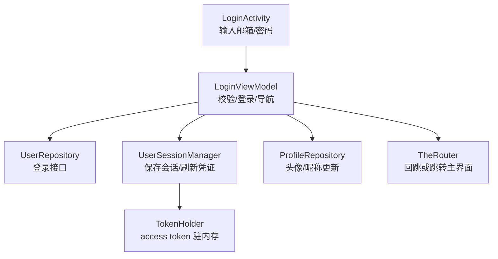
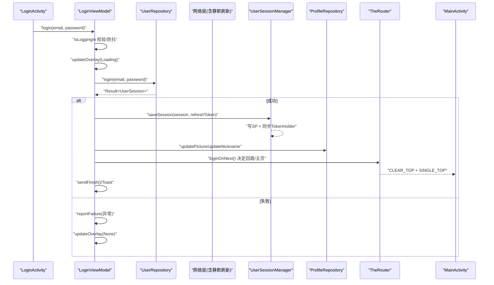
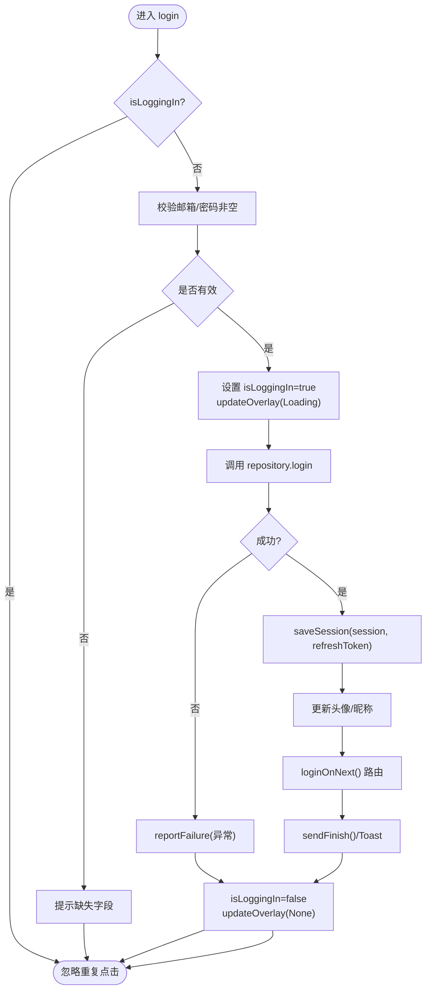
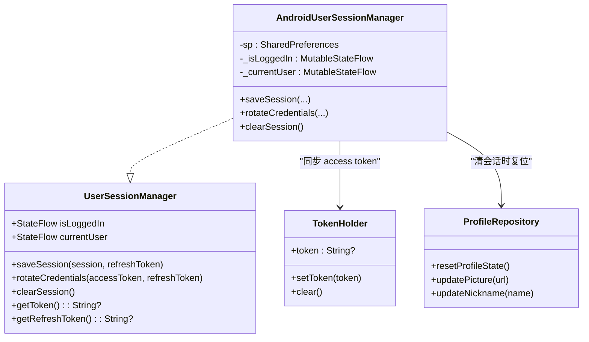
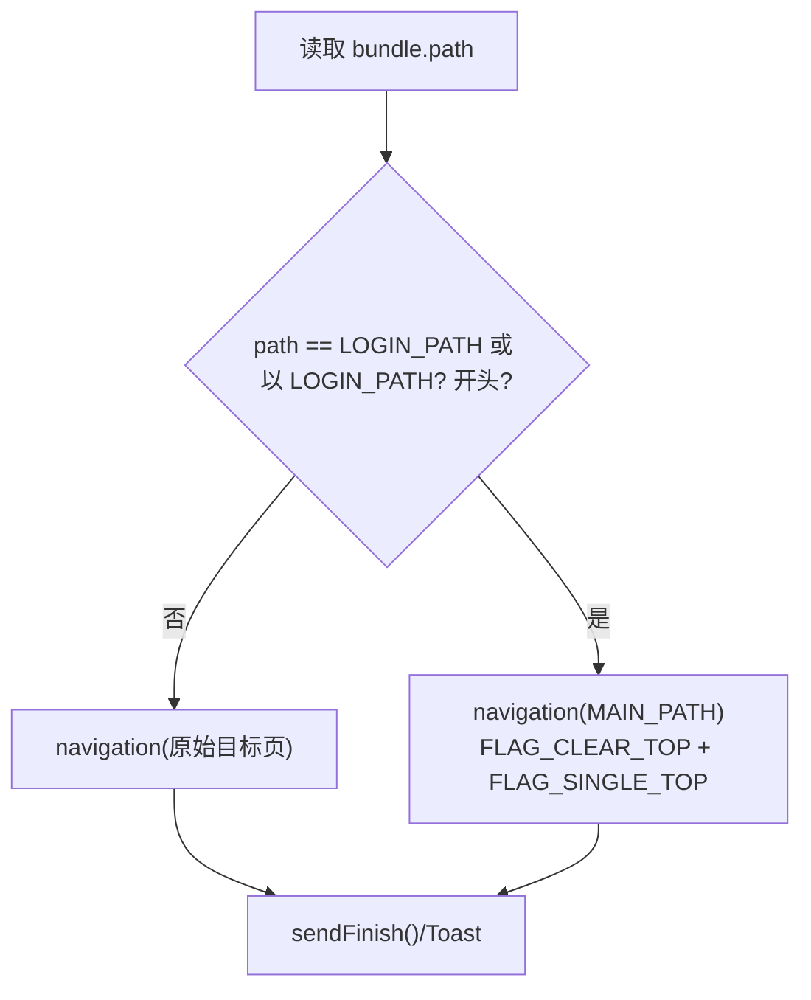
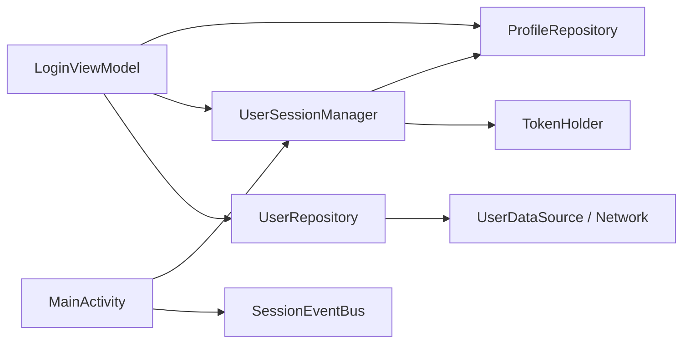

# 登录业务逻辑 (LoginViewModel)

<cite>
**本文引用的文件**   
- [LoginViewModel.kt](file://module_login/src/main/java/com/ebook/login/mvvm/viewmodel/LoginViewModel.kt)
- [UserRepository.kt](file://module_login/src/main/java/com/ebook/login/repository/UserRepository.kt)
- [AndroidUserSessionManager.kt](file://lib_book_common/src/main/java/com/ebook/common/domain/AndroidUserSessionManager.kt)
- [UserSessionManager.kt](file://lib_book_common/src/main/java/com/ebook/common/domain/UserSessionManager.kt)
- [ProfileRepository.kt](file://lib_book_common/src/main/java/com/ebook/common/repository/ProfileRepository.kt)
- [LoginActivity.kt](file://module_login/src/main/java/com/ebook/login/LoginActivity.kt)
- [MainActivity.kt](file://module_main/src/main/java/com/ebook/main/MainActivity.kt)
- [login-modernization-spec.md](file://docs/login-modernization-spec.md)
</cite>

## 目录
1. [简介](#简介)
2. [项目结构](#项目结构)
3. [核心组件](#核心组件)
4. [架构总览](#架构总览)
5. [详细组件分析](#详细组件分析)
6. [依赖关系分析](#依赖关系分析)
7. [性能与健壮性](#性能与健壮性)
8. [故障排查指南](#故障排查指南)
9. [结论](#结论)
10. [附录：扩展与示例](#附录：扩展与示例)

## 简介
本文件聚焦登录业务的实现与协作，围绕 LoginViewModel 的状态管理、表单验证、异步登录处理，以及 UserSessionManager 的会话保存、TokenHolder 的 access token 同步、ProfileRepository 的用户资料更新展开。重点解释 loginOnNext 的回跳逻辑（拦截回跳 vs 主动登录）、主界面路由处理与页面栈清理机制，并说明 isLoggingIn 防重复点击、updateOverlay Loading 状态管理等关键细节。文末提供扩展新认证流程、处理网络异常与会话管理的实践建议。

## 项目结构
登录相关代码分布在三个层次：
- 表现层：module_login 的 LoginActivity 负责 UI 输入与调用 ViewModel；
- 业务编排层：LoginViewModel 负责校验、发起登录、保存会话、导航与提示；
- 数据与会话层：UserRepository 封装登录接口；AndroidUserSessionManager 持久化会话并同步 TokenHolder；ProfileRepository 维护昵称/头像内存态与 SP 镜像。

**图示来源**
- [LoginActivity.kt:49-193](file://module_login/src/main/java/com/ebook/login/LoginActivity.kt#L49-L193)
- [LoginViewModel.kt:29-107](file://module_login/src/main/java/com/ebook/login/mvvm/viewmodel/LoginViewModel.kt#L29-L107)
- [UserRepository.kt:50-55](file://module_login/src/main/java/com/ebook/login/repository/UserRepository.kt#L50-L55)
- [AndroidUserSessionManager.kt:61-85](file://lib_book_common/src/main/java/com/ebook/common/domain/AndroidUserSessionManager.kt#L61-L85)
- [ProfileRepository.kt:20-38](file://lib_book_common/src/main/java/com/ebook/common/repository/ProfileRepository.kt#L20-L38)

**章节来源**
- [LoginActivity.kt:49-193](file://module_login/src/main/java/com/ebook/login/LoginActivity.kt#L49-L193)
- [LoginViewModel.kt:29-107](file://module_login/src/main/java/com/ebook/login/mvvm/viewmodel/LoginViewModel.kt#L29-L107)

## 核心组件
- LoginViewModel：承担登录入口、表单非空校验、异步登录、会话保存、个人资料更新与回跳/清栈导航。
- UserRepository：将登录请求包装为 Result，统一通过 CoroutineAdapter 处理网络与业务码异常。
- AndroidUserSessionManager：保存会话信息到 SharedPreferences，并将 refresh token 持久化；同时将 access token 写入 TokenHolder，供网络层自动附加。
- ProfileRepository：维护昵称与头像的 StateFlow，并在登录成功后与 SP 同步。
- MainActivity：订阅会话过期事件，执行清会话、提示并跳转登录页。

**章节来源**
- [LoginViewModel.kt:29-107](file://module_login/src/main/java/com/ebook/login/mvvm/viewmodel/LoginViewModel.kt#L29-L107)
- [UserRepository.kt:19-84](file://module_login/src/main/java/com/ebook/login/repository/UserRepository.kt#L19-L84)
- [AndroidUserSessionManager.kt:17-162](file://lib_book_common/src/main/java/com/ebook/common/domain/AndroidUserSessionManager.kt#L17-L162)
- [ProfileRepository.kt:12-54](file://lib_book_common/src/main/java/com/ebook/common/repository/ProfileRepository.kt#L12-L54)
- [MainActivity.kt:57-79](file://module_main/src/main/java/com/ebook/main/MainActivity.kt#L57-L79)

## 架构总览
登录链路从 UI 触发到导航落地的时序如下：

**图示来源**
- [LoginViewModel.kt:45-73](file://module_login/src/main/java/com/ebook/login/mvvm/viewmodel/LoginViewModel.kt#L45-L73)
- [LoginViewModel.kt:88-106](file://module_login/src/main/java/com/ebook/login/mvvm/viewmodel/LoginViewModel.kt#L88-L106)
- [UserRepository.kt:50-55](file://module_login/src/main/java/com/ebook/login/repository/UserRepository.kt#L50-L55)
- [AndroidUserSessionManager.kt:61-85](file://lib_book_common/src/main/java/com/ebook/common/domain/AndroidUserSessionManager.kt#L61-L85)
- [ProfileRepository.kt:30-38](file://lib_book_common/src/main/java/com/ebook/common/repository/ProfileRepository.kt#L30-L38)
- [MainActivity.kt:71-78](file://module_main/src/main/java/com/ebook/main/MainActivity.kt#L71-L78)

## 详细组件分析

### LoginViewModel：状态管理与登录编排
- 表单验证：仅做非空检查（邮箱/密码），具体业务规则交由服务端返回的业务码处理。
- 防重复点击：使用 isLoggingIn 标志位，在协程启动前设置、finally 中复位，避免并发提交。
- Loading 覆盖层：通过 updateOverlay(Loading) 显示加载，finally 中确保 reset。
- 异步登录：调用 userRepository.login，成功后：
  - 保存会话：userSessionManager.saveSession(session, refreshToken)，内部会持久化 refresh token 并将 access token 同步至 TokenHolder。
  - 个人资料更新：调用 profileRepository.updatePicture/updateNickname，保持本地昵称/头像与网络一致。
  - 导航回跳：loginOnNext 根据 bundle 中的路径判断是“被拦截回跳”还是“主动登录”，分别走原始目标页或直接回主界面。
- 错误上报：失败分支使用 reportFailure 上报异常，不重复弹 Toast，由全局会话过期机制接管。

**图示来源**
- [LoginViewModel.kt:45-73](file://module_login/src/main/java/com/ebook/login/mvvm/viewmodel/LoginViewModel.kt#L45-L73)
- [LoginViewModel.kt:88-106](file://module_login/src/main/java/com/ebook/login/mvvm/viewmodel/LoginViewModel.kt#L88-L106)

**章节来源**
- [LoginViewModel.kt:45-73](file://module_login/src/main/java/com/ebook/login/mvvm/viewmodel/LoginViewModel.kt#L45-L73)
- [LoginViewModel.kt:88-106](file://module_login/src/main/java/com/ebook/login/mvvm/viewmodel/LoginViewModel.kt#L88-L106)

### UserSessionManager：会话保存与 TokenHolder 同步
- saveSession：
  - 更新内存态（isLoggedIn/currentUser）。
  - 将 access token 写入 TokenHolder（仅驻内存），refresh token 持久化到 SharedPreferences。
  - 兼容旧 LoginInterceptor：同时写入 spUtils 的登录标记与用户信息键。
- rotateCredentials：
  - 仅更新内存 token 与持久化的 refresh token，不触碰身份字段，符合“刷新只续期凭证”的设计。
- clearSession：
  - 一次性失效三处镜像：本类内存态 + user_session SP + spUtils 兼容键 + ProfileRepository 的内存流，避免登出后仍残留头像/昵称。

**图示来源**
- [UserSessionManager.kt:13-62](file://lib_book_common/src/main/java/com/ebook/common/domain/UserSessionManager.kt#L13-L62)
- [AndroidUserSessionManager.kt:61-133](file://lib_book_common/src/main/java/com/ebook/common/domain/AndroidUserSessionManager.kt#L61-L133)
- [ProfileRepository.kt:20-54](file://lib_book_common/src/main/java/com/ebook/common/repository/ProfileRepository.kt#L20-L54)

**章节来源**
- [AndroidUserSessionManager.kt:61-133](file://lib_book_common/src/main/java/com/ebook/common/domain/AndroidUserSessionManager.kt#L61-L133)

### ProfileRepository：用户资料更新
- 维护昵称与头像的 StateFlow，初始值来自 SP。
- 登录成功后立即更新内存与 SP，保证“我的”等页面即时渲染最新资料。
- resetProfileState 用于登出时清空内存态，配合 UserSessionManager.clearSession 完成完整清理。

**章节来源**
- [ProfileRepository.kt:20-54](file://lib_book_common/src/main/java/com/ebook/common/repository/ProfileRepository.kt#L20-L54)

### loginOnNext：回跳逻辑与页面栈清理
- 判断依据：bundle 中的 path（KeyCode.Login.PATH）是否为“被拦截的目标页”。
  - 若 path 不是 LOGIN_PATH 或其带参形式，视为“拦截回跳”，直接导航回原始目标页。
  - 否则视为“主动登录”，导航到主界面并使用 CLEAR_TOP + SINGLE_TOP，复用栈底主界面并清理中间页（如注册/改密），防止返回栈露出中间页。
- 随后发送 finish 与成功提示，结束登录页生命周期。

**图示来源**
- [LoginViewModel.kt:88-106](file://module_login/src/main/java/com/ebook/login/mvvm/viewmodel/LoginViewModel.kt#L88-L106)

**章节来源**
- [LoginViewModel.kt:88-106](file://module_login/src/main/java/com/ebook/login/mvvm/viewmodel/LoginViewModel.kt#L88-L106)

### MainActivity：会话过期统一处置
- 订阅 SessionEventBus 的会话过期事件，执行：
  - 清除会话（UserSessionManager.clearSession）
  - 提示用户
  - 跳转登录页
- 作为应用内最长驻留宿主，集中处理“救不回来”的过期场景。

**章节来源**
- [MainActivity.kt:71-78](file://module_main/src/main/java/com/ebook/main/MainActivity.kt#L71-L78)

## 依赖关系分析
- LoginViewModel 依赖 UserRepository、UserSessionManager、ProfileRepository，并通过 TheRouter 进行跨模块导航。
- UserRepository 依赖 UserDataSource（网络层）与 CoroutineAdapter，统一将异常转为 Result。
- AndroidUserSessionManager 依赖 TokenHolder 与 ProfileRepository，负责会话持久化与内存态同步。
- MainActivity 依赖 SessionEventBus 与 UserSessionManager，负责会话过期收口。

**图示来源**
- [LoginViewModel.kt:29-34](file://module_login/src/main/java/com/ebook/login/mvvm/viewmodel/LoginViewModel.kt#L29-L34)
- [UserRepository.kt:26-30](file://module_login/src/main/java/com/ebook/login/repository/UserRepository.kt#L26-L30)
- [AndroidUserSessionManager.kt:28-33](file://lib_book_common/src/main/java/com/ebook/common/domain/AndroidUserSessionManager.kt#L28-L33)
- [MainActivity.kt:62-67](file://module_main/src/main/java/com/ebook/main/MainActivity.kt#L62-L67)

**章节来源**
- [LoginViewModel.kt:29-34](file://module_login/src/main/java/com/ebook/login/mvvm/viewmodel/LoginViewModel.kt#L29-L34)
- [UserRepository.kt:26-30](file://module_login/src/main/java/com/ebook/login/repository/UserRepository.kt#L26-L30)
- [AndroidUserSessionManager.kt:28-33](file://lib_book_common/src/main/java/com/ebook/common/domain/AndroidUserSessionManager.kt#L28-L33)
- [MainActivity.kt:62-67](file://module_main/src/main/java/com/ebook/main/MainActivity.kt#L62-L67)

## 性能与健壮性
- 防重复点击：isLoggingIn 在协程作用域内保护，避免并发登录导致重复请求与状态混乱。
- Loading 覆盖层：updateOverlay 显式控制，finally 中确保重置，避免 UI 卡死。
- 网络异常：统一经 CoroutineAdapter.safeApiCall 转 Result，失败分支用 reportFailure 上报，避免重复提示与分散的错误处理。
- 会话持久化：refresh token 落盘，access token 仅驻内存，降低敏感信息泄露风险；冷启动由首请求静默刷新补齐。
- 导航幂等：CLEAR_TOP + SINGLE_TOP 保证主界面唯一实例且无中间页残留。

[本节为通用指导，无需特定文件引用]

## 故障排查指南
- 登录按钮多次点击无效：确认 isLoggingIn 逻辑未被提前 return 绕过；检查 finally 块是否复位。
- 登录后头像/昵称未更新：确认 profileRepository.updatePicture/updateNickname 被调用；检查 SP 与 StateFlow 的读写一致性。
- 回跳到错误页面：核对 bundle.path 是否为 LOGIN_PATH 或其带参形式；确认拦截器写入的 therouter_path 正确。
- 会话过期未跳转：检查 MainActivity 是否订阅 SessionEventBus 的 SessionExpired；确认 clearSession 已执行。
- 静默刷新失败：关注网络层对 A0230 的处理，若刷新失败应发出会话过期事件，由主界面统一处置。

**章节来源**
- [LoginViewModel.kt:45-73](file://module_login/src/main/java/com/ebook/login/mvvm/viewmodel/LoginViewModel.kt#L45-L73)
- [AndroidUserSessionManager.kt:87-98](file://lib_book_common/src/main/java/com/ebook/common/domain/AndroidUserSessionManager.kt#L87-L98)
- [MainActivity.kt:71-78](file://module_main/src/main/java/com/ebook/main/MainActivity.kt#L71-L78)

## 结论
LoginViewModel 将登录流程的职责收敛于单一编排点：表单校验、异步登录、会话持久化、资料更新与导航回跳。UserSessionManager 作为认证 seam，统一管理会话与 token 的驻内存策略，并与 ProfileRepository 协同维持用户资料的一致性。loginOnNext 通过路径判断区分拦截回跳与主动登录，结合 CLEAR_TOP/SINGLE_TOP 清理页面栈，确保用户体验连贯。整体设计遵循“刷新单飞、过期统一收口”的原则，具备良好可维护性与扩展性。

[本节为总结，无需特定文件引用]

## 附录：扩展与示例
- 新增认证流程（例如第三方登录）：
  - 在 UserRepository 中增加对应端点的封装方法，统一使用 safeApiCall 包裹，返回 Result。
  - 在 LoginViewModel 中新增入口方法，复用 isLoggingIn 与 updateOverlay 模式，成功后调用 UserSessionManager.saveSession 与 ProfileRepository 更新。
  - 如需不同回跳逻辑，可在 bundle 中携带来源路径，loginOnNext 按相同规则判定。
- 处理网络异常：
  - 不要捕获并吞掉异常，交由 CoroutineAdapter 统一转换；失败分支使用 reportFailure 上报，避免重复提示。
  - 对于会话过期（A0230），不在调用方自行判断，交由网络层静默刷新与主界面事件统一处理。
- 扩展会话管理逻辑：
  - 如需额外持久化字段，优先在 AndroidUserSessionManager 的 saveSession/clearSession 中处理，保持三处镜像一致。
  - 若需接入新的 token 类型，需在 TokenHolder 与 AuthInterceptor 的配合下保证仅对白名单 host 附加。

**章节来源**
- [UserRepository.kt:19-84](file://module_login/src/main/java/com/ebook/login/repository/UserRepository.kt#L19-L84)
- [AndroidUserSessionManager.kt:61-133](file://lib_book_common/src/main/java/com/ebook/common/domain/AndroidUserSessionManager.kt#L61-L133)
- [login-modernization-spec.md:48-55](file://docs/login-modernization-spec.md#L48-L55)