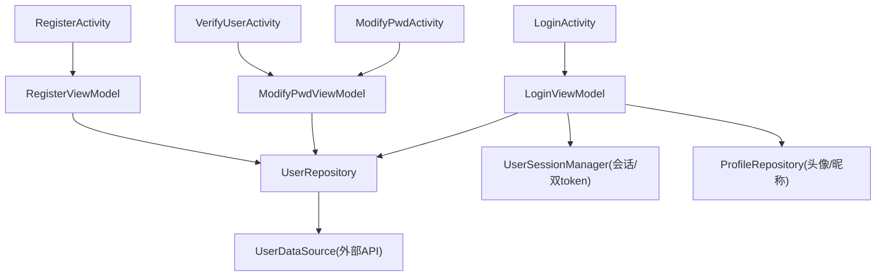
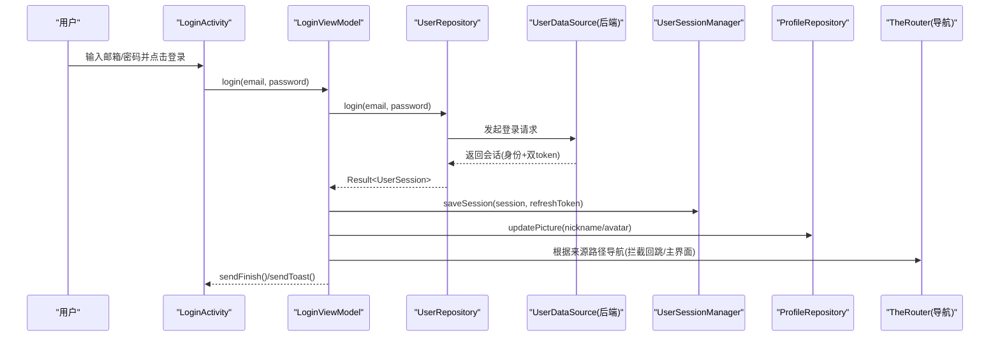
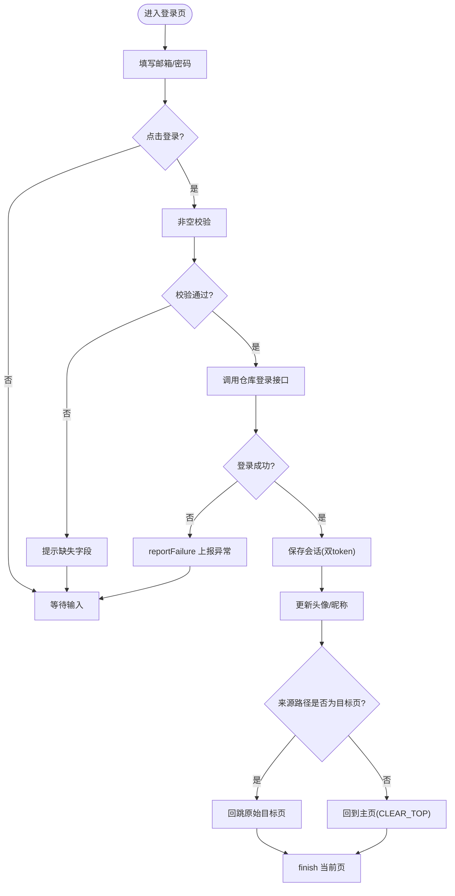
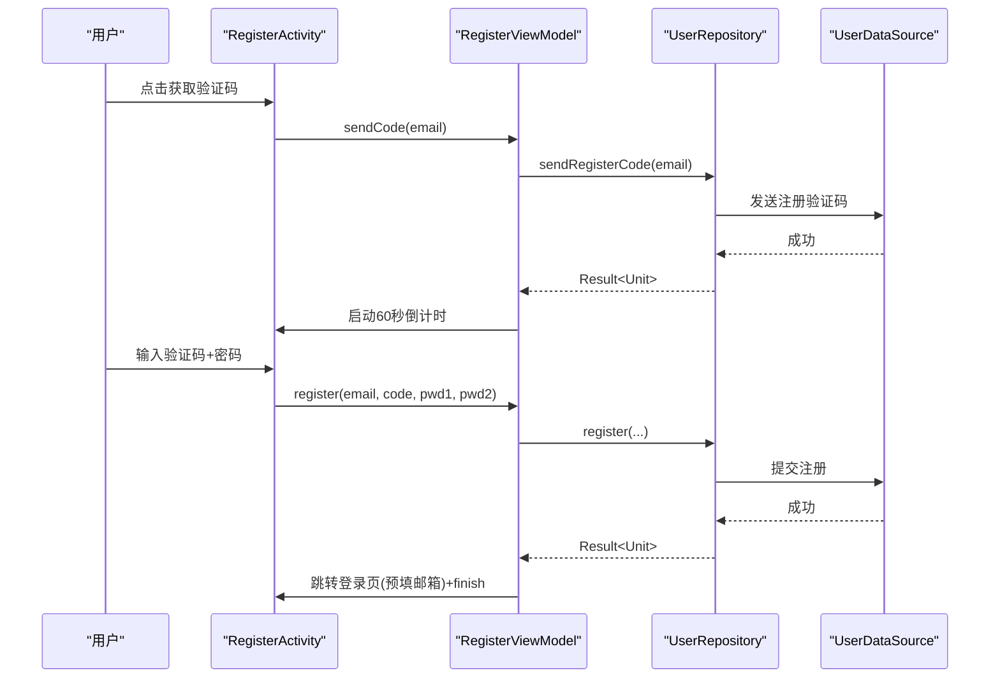
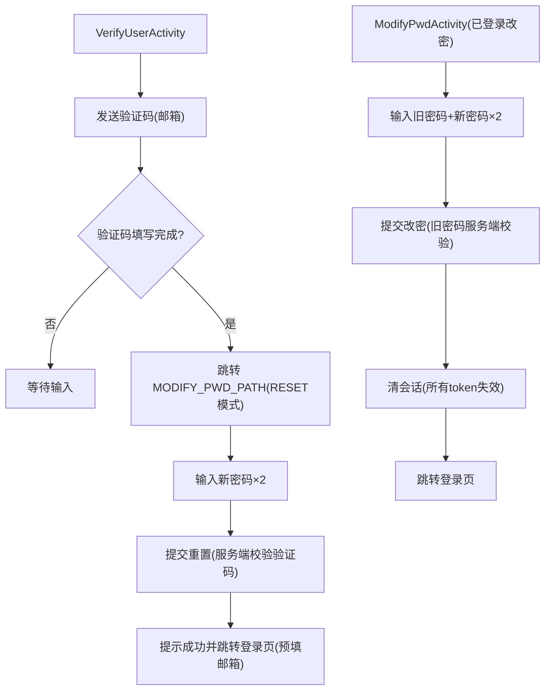
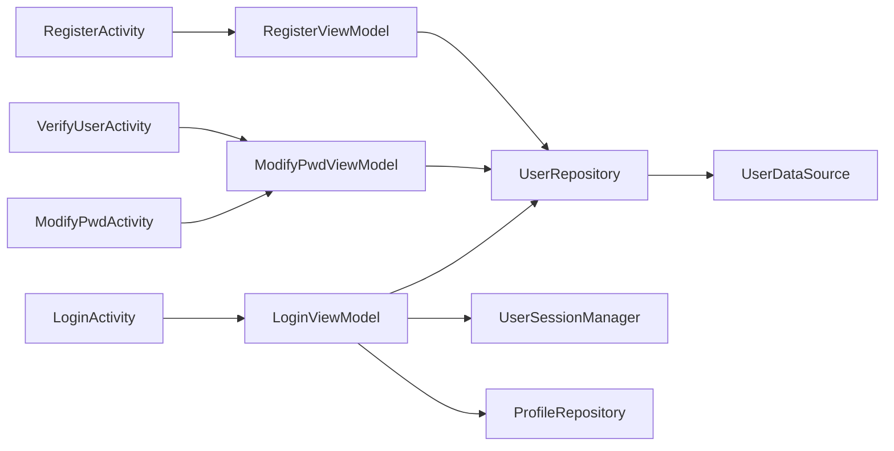

# 登录模块 (module_login)

<cite>
**本文引用的文件**
- [LoginActivity.kt](file://module_login/src/main/java/com/ebook/login/LoginActivity.kt)
- [LoginViewModel.kt](file://module_login/src/main/java/com/ebook/login/mvvm/viewmodel/LoginViewModel.kt)
- [UserRepository.kt](file://module_login/src/main/java/com/ebook/login/repository/UserRepository.kt)
- [RegisterActivity.kt](file://module_login/src/main/java/com/ebook/login/RegisterActivity.kt)
- [RegisterViewModel.kt](file://module_login/src/main/java/com/ebook/login/mvvm/viewmodel/RegisterViewModel.kt)
- [VerifyUserActivity.kt](file://module_login/src/main/java/com/ebook/login/VerifyUserActivity.kt)
- [ModifyPwdActivity.kt](file://module_login/src/main/java/com/ebook/login/ModifyPwdActivity.kt)
- [ModifyPwdViewModel.kt](file://module_login/src/main/java/com/ebook/login/mvvm/viewmodel/ModifyPwdViewModel.kt)
- [login-modernization-spec.md](file://docs/docs/login-modernization-spec.md)
</cite>

## 目录
1. [简介](#简介)
2. [项目结构](#项目结构)
3. [核心组件](#核心组件)
4. [架构总览](#架构总览)
5. [详细组件分析](#详细组件分析)
6. [依赖关系分析](#依赖关系分析)
7. [性能与健壮性](#性能与健壮性)
8. [故障排查指南](#故障排查指南)
9. [结论](#结论)
10. [附录：扩展指引](#附录：扩展指引)

## 简介
本模块负责邮箱为主标识的认证流程，包括登录、注册（三步）、密码重置与已登录改密。通过 ViewModel + Repository 的分层组织，结合 Hilt 注入、TheRouter 路由、Compose UI，实现表单校验、异步处理、会话建立与回跳逻辑。Token 管理与会话生命周期由共享库负责；网络层统一处理静默刷新与全局过期处置，页面侧仅关注业务成功与“救不回来”的错误分支。

## 项目结构
- 页面层（UI）
  - LoginActivity：登录页（邮箱+密码），单例模式避免重复实例导致的状态丢失
  - RegisterActivity：注册页（邮箱→验证码→密码）
  - VerifyUserActivity：忘记密码第一步（邮箱验证身份）
  - ModifyPwdActivity：密码设置页（双模式：已登录改密 / 忘记密码重置）
- 视图模型层（MVVM）
  - LoginViewModel：登录状态、防重、保存会话、回跳与资料缓存更新
  - RegisterViewModel：发码倒计时、注册流程
  - ModifyPwdViewModel：忘记密码发码与重置、已登录改密并清会话
- 数据层
  - UserRepository：统一封装登录、注册、改密、重置等端点调用，返回 Result
- 路由与导航
  - 使用 TheRouter 进行跨模块页面跳转；登录成功后根据来源路径决定回跳目标或清理中间页回到主页
- 主题与交互
  - Compose Material 3；登录页关闭 Toolbar，内容延伸至状态栏并由 statusBarsPadding 避让

图表来源
- [LoginActivity.kt:49-192](file://module_login/src/main/java/com/ebook/login/LoginActivity.kt#L49-L192)
- [LoginViewModel.kt:22-106](file://module_login/src/main/java/com/ebook/login/mvvm/viewmodel/LoginViewModel.kt#L22-L106)
- [RegisterActivity.kt:40-70](file://module_login/src/main/java/com/ebook/login/RegisterActivity.kt#L40-L70)
- [RegisterViewModel.kt:24-139](file://module_login/src/main/java/com/ebook/login/mvvm/viewmodel/RegisterViewModel.kt#L24-L139)
- [VerifyUserActivity.kt:35-66](file://module_login/src/main/java/com/ebook/login/VerifyUserActivity.kt#L35-L66)
- [ModifyPwdActivity.kt:33-95](file://module_login/src/main/java/com/ebook/login/ModifyPwdActivity.kt#L33-L95)
- [ModifyPwdViewModel.kt:25-180](file://module_login/src/main/java/com/ebook/login/mvvm/viewmodel/ModifyPwdViewModel.kt#L25-L180)
- [UserRepository.kt:19-94](file://module_login/src/main/java/com/ebook/login/repository/UserRepository.kt#L19-L94)

章节来源
- [LoginActivity.kt:49-192](file://module_login/src/main/java/com/ebook/login/LoginActivity.kt#L49-L192)
- [RegisterActivity.kt:40-70](file://module_login/src/main/java/com/ebook/login/RegisterActivity.kt#L40-L70)
- [VerifyUserActivity.kt:35-66](file://module_login/src/main/java/com/ebook/login/VerifyUserActivity.kt#L35-L66)
- [ModifyPwdActivity.kt:33-95](file://module_login/src/main/java/com/ebook/login/ModifyPwdActivity.kt#L33-L95)

## 核心组件
- 登录流程
  - 客户端只做非空校验，账号/密码正确性交由服务端业务码判定
  - 登录成功后保存会话（身份+双 token），并将 access token 同步到 TokenHolder，后续请求自动携带
  - 根据来源路径回跳原始页面或回到主页；同时刷新本地资料缓存（头像/昵称）
- 注册流程（三步）
  - 发码（注册专用端点，与服务端 60 秒频控对齐）
  - 输入验证码与新密码（两次一致）
  - 注册即激活但不发放 token，成功后引导至登录页并预填邮箱
- 忘记密码流程
  - 发送验证码（与注册发码分离）
  - 验证通过后进入重置页，提交新密码由服务端校验验证码
- 已登录改密
  - 旧密码由服务端校验；成功后视为会话失效，清除会话并跳转登录页
- 会话与 Token
  - 双 token 持久化由 UserSessionManager 负责；access token 只驻内存不落盘
  - A0230 过期由网络层统一处理：先尝试静默刷新，失败则触发全局会话过期处置（清会话、提示、跳转登录）

章节来源
- [LoginViewModel.kt:22-106](file://module_login/src/main/java/com/ebook/login/mvvm/viewmodel/LoginViewModel.kt#L22-L106)
- [RegisterViewModel.kt:24-139](file://module_login/src/main/java/com/ebook/login/mvvm/viewmodel/RegisterViewModel.kt#L24-L139)
- [ModifyPwdViewModel.kt:25-180](file://module_login/src/main/java/com/ebook/login/mvvm/viewmodel/ModifyPwdViewModel.kt#L25-L180)
- [UserRepository.kt:19-94](file://module_login/src/main/java/com/ebook/login/repository/UserRepository.kt#L19-L94)

## 架构总览
下图展示从用户操作到后端调用的完整调用链，以及登录成功后的会话建立与导航决策。

图表来源
- [LoginActivity.kt:68-172](file://module_login/src/main/java/com/ebook/login/LoginActivity.kt#L68-L172)
- [LoginViewModel.kt:45-106](file://module_login/src/main/java/com/ebook/login/mvvm/viewmodel/LoginViewModel.kt#L45-L106)
- [UserRepository.kt:50-55](file://module_login/src/main/java/com/ebook/login/repository/UserRepository.kt#L50-L55)

## 详细组件分析

### 登录页面与状态管理（LoginActivity + LoginViewModel）
- 表单与状态
  - 邮箱与密码为 Compose 局部状态；支持 singleTask 复用时的预填邮箱
  - 关闭 Toolbar，内容延伸至状态栏并通过 statusBarsPadding 避让
- 防重复与加载覆盖
  - isLoggingIn 防止重复触发；统一使用 Overlay.Loading/None 控制加载态
- 登录成功后的导航策略
  - 若来源路径为被拦截的目标页（非 LOGIN_PATH），直接回跳原页
  - 否则 CLEAR_TOP + SINGLE_TOP 回到主页，并结束当前页面
- 会话与资料更新
  - 保存会话后，将头像/昵称更新至 ProfileRepository，供「我的」页渲染

图表来源
- [LoginActivity.kt:68-172](file://module_login/src/main/java/com/ebook/login/LoginActivity.kt#L68-L172)
- [LoginViewModel.kt:45-106](file://module_login/src/main/java/com/ebook/login/mvvm/viewmodel/LoginViewModel.kt#L45-L106)

章节来源
- [LoginActivity.kt:49-192](file://module_login/src/main/java/com/ebook/login/LoginActivity.kt#L49-L192)
- [LoginViewModel.kt:22-106](file://module_login/src/main/java/com/ebook/login/mvvm/viewmodel/LoginViewModel.kt#L22-L106)

### 注册流程（RegisterActivity + RegisterViewModel）
- 三步注册
  - 第一步：输入邮箱，发送验证码（注册专用端点，与服务端 60 秒频控对齐）
  - 第二步：输入验证码与新密码（两次一致）
  - 第三步：注册即激活但不发放 token，成功后跳转登录页并预填邮箱
- 倒计时
  - 使用 StateFlow 驱动 UI，横竖屏切换不丢进度
  - 失败不锁按钮，允许立即重试

图表来源
- [RegisterActivity.kt:57-70](file://module_login/src/main/java/com/ebook/login/RegisterActivity.kt#L57-L70)
- [RegisterViewModel.kt:53-131](file://module_login/src/main/java/com/ebook/login/mvvm/viewmodel/RegisterViewModel.kt#L53-L131)
- [UserRepository.kt:35-48](file://module_login/src/main/java/com/ebook/login/repository/UserRepository.kt#L35-L48)

章节来源
- [RegisterActivity.kt:40-70](file://module_login/src/main/java/com/ebook/login/RegisterActivity.kt#L40-L70)
- [RegisterViewModel.kt:24-139](file://module_login/src/main/java/com/ebook/login/mvvm/viewmodel/RegisterViewModel.kt#L24-L139)

### 忘记密码与重置（VerifyUserActivity + ModifyPwdActivity/ViewModel）
- 忘记密码第一步
  - 输入邮箱，发送验证码（与注册发码分离）
  - 验证通过后进入重置页（RESET 模式）
- 密码设置页（双模式）
  - RESET 模式：仅需新密码×2，提交走重置端点（验证码由服务端校验）
  - 已登录改密：需旧密码+新密码×2，提交走改密端点；成功后清会话并跳转登录页

图表来源
- [VerifyUserActivity.kt:47-66](file://module_login/src/main/java/com/ebook/login/VerifyUserActivity.kt#L47-L66)
- [ModifyPwdActivity.kt:48-78](file://module_login/src/main/java/com/ebook/login/ModifyPwdActivity.kt#L48-L78)
- [ModifyPwdViewModel.kt:59-171](file://module_login/src/main/java/com/ebook/login/mvvm/viewmodel/ModifyPwdViewModel.kt#L59-L171)

章节来源
- [VerifyUserActivity.kt:35-66](file://module_login/src/main/java/com/ebook/login/VerifyUserActivity.kt#L35-L66)
- [ModifyPwdActivity.kt:33-95](file://module_login/src/main/java/com/ebook/login/ModifyPwdActivity.kt#L33-L95)
- [ModifyPwdViewModel.kt:25-180](file://module_login/src/main/java/com/ebook/login/mvvm/viewmodel/ModifyPwdViewModel.kt#L25-L180)

### 数据层与错误上报（UserRepository）
- 所有方法经 CoroutineAdapter.safeApiCall 包裹，统一将传输异常与业务码异常转为 Result
- 登录返回 UserSession，其余写操作返回 Unit
- 调用方一律通过 reportFailure 上报异常，避免重复提示

章节来源
- [UserRepository.kt:19-94](file://module_login/src/main/java/com/ebook/login/repository/UserRepository.kt#L19-L94)

## 依赖关系分析
- 页面依赖 ViewModel，ViewModel 依赖 Repository
- Repository 依赖 UserDataSource（网络服务）
- 会话管理与资料缓存通过 UserSessionManager、ProfileRepository 协作
- 导航通过 TheRouter 完成跨模块跳转

图表来源
- [LoginActivity.kt:49-192](file://module_login/src/main/java/com/ebook/login/LoginActivity.kt#L49-L192)
- [LoginViewModel.kt:22-106](file://module_login/src/main/java/com/ebook/login/mvvm/viewmodel/LoginViewModel.kt#L22-L106)
- [RegisterActivity.kt:40-70](file://module_login/src/main/java/com/ebook/login/RegisterActivity.kt#L40-L70)
- [RegisterViewModel.kt:24-139](file://module_login/src/main/java/com/ebook/login/mvvm/viewmodel/RegisterViewModel.kt#L24-L139)
- [VerifyUserActivity.kt:35-66](file://module_login/src/main/java/com/ebook/login/VerifyUserActivity.kt#L35-L66)
- [ModifyPwdActivity.kt:33-95](file://module_login/src/main/java/com/ebook/login/ModifyPwdActivity.kt#L33-L95)
- [ModifyPwdViewModel.kt:25-180](file://module_login/src/main/java/com/ebook/login/mvvm/viewmodel/ModifyPwdViewModel.kt#L25-L180)
- [UserRepository.kt:19-94](file://module_login/src/main/java/com/ebook/login/repository/UserRepository.kt#L19-L94)

## 性能与健壮性
- 防重复点击：登录入口在请求进行中忽略后续触发，避免并发登录
- 加载覆盖层：统一使用 Overlay 控制 loading，提升用户体验一致性
- 倒计时稳定：验证码倒计时使用 StateFlow 并在 ViewModel 中维护，配置变更不丢进度
- 错误上报集中：异常统一经 reportFailure 上报，减少重复提示与分散处理
- 会话刷新透明：A0230 过期在网络层统一处理，页面仅处理“救不回来”的异常情况

[本节提供通用指导，无需特定文件引用]

## 故障排查指南
- 登录无响应或提示丢失
  - 检查是否继承 BaseMvvmActivity；命令通道（sendToast/sendFinish/loading）由基类消费
  - 参考：[LoginActivity.kt:49-192](file://module_login/src/main/java/com/ebook/login/LoginActivity.kt#L49-L192)、[RegisterActivity.kt:40-70](file://module_login/src/main/java/com/ebook/login/RegisterActivity.kt#L40-L70)
- 注册成功但页面残留
  - 确认 RegisterViewModel 调用 sendFinish() 并跳转登录页
  - 参考：[RegisterViewModel.kt:112-131](file://module_login/src/main/java/com/ebook/login/mvvm/viewmodel/RegisterViewModel.kt#L112-L131)
- 忘记密码流程跳转异常
  - VerifyUserActivity 应跳转到 MODIFY_PWD_PATH 且带 email/code；ModifyPwdActivity 以 RESET 模式解析参数
  - 参考：[VerifyUserActivity.kt:47-66](file://module_login/src/main/java/com/ebook/login/VerifyUserActivity.kt#L47-L66)、[ModifyPwdActivity.kt:57-78](file://module_login/src/main/java/com/ebook/login/ModifyPwdActivity.kt#L57-L78)
- 改密后仍显示已登录状态
  - 确保 modify 成功后调用 clearSession()，三处镜像（SP/兼容键/内存流）会被一并清理
  - 参考：[ModifyPwdViewModel.kt:121-144](file://module_login/src/main/java/com/ebook/login/mvvm/viewmodel/ModifyPwdViewModel.kt#L121-L144)
- 登录成功未回跳到原始页面
  - 检查来源路径是否为被拦截目标页；若是则回跳，否则回到主页
  - 参考：[LoginViewModel.kt:75-106](file://module_login/src/main/java/com/ebook/login/mvvm/viewmodel/LoginViewModel.kt#L75-L106)

章节来源
- [LoginActivity.kt:49-192](file://module_login/src/main/java/com/ebook/login/LoginActivity.kt#L49-L192)
- [RegisterActivity.kt:40-70](file://module_login/src/main/java/com/ebook/login/RegisterActivity.kt#L40-L70)
- [RegisterViewModel.kt:112-131](file://module_login/src/main/java/com/ebook/login/mvvm/viewmodel/RegisterViewModel.kt#L112-L131)
- [VerifyUserActivity.kt:47-66](file://module_login/src/main/java/com/ebook/login/VerifyUserActivity.kt#L47-L66)
- [ModifyPwdActivity.kt:57-78](file://module_login/src/main/java/com/ebook/login/ModifyPwdActivity.kt#L57-L78)
- [ModifyPwdViewModel.kt:121-144](file://module_login/src/main/java/com/ebook/login/mvvm/viewmodel/ModifyPwdViewModel.kt#L121-L144)
- [LoginViewModel.kt:75-106](file://module_login/src/main/java/com/ebook/login/mvvm/viewmodel/LoginViewModel.kt#L75-L106)

## 结论
本模块以邮箱为主标识，实现了完整的认证闭环：登录、注册（三步）、忘记密码与已登录改密。通过 ViewModel 管理状态与异步流程，Repository 统一数据层调用，网络层负责 Token 静默刷新与全局会话过期处理。页面层专注表单、导航与用户体验，保持职责清晰、可维护性强。

[本节总结性内容，无需特定文件引用]

## 附录：扩展指引
- 新增一种登录方式（例如手机号+验证码）
  - 在 UserRepository 新增对应 suspend 方法，返回 Result（如会话或校验结果）
  - 新建或复用页面（Composable），通过 BaseMvvmActivity 承载，使用 viewModels() 注入 ViewModel
  - 在 ViewModel 中做前端校验（非空/格式/长度），调用 Repository 并处理 Result 的成功/失败分支
  - 成功后保存会话（UserSessionManager.saveSession），并按来源路径导航（TheRouter.build(...).navigation()）
  - 参考路径：[UserRepository.kt:50-55](file://module_login/src/main/java/com/ebook/login/repository/UserRepository.kt#L50-L55)、[LoginViewModel.kt:45-106](file://module_login/src/main/java/com/ebook/login/mvvm/viewmodel/LoginViewModel.kt#L45-L106)
- 扩展认证流程（增加新的业务步骤）
  - 在 ViewModel 中增加对应函数，使用 viewModelScope.launch 执行协程任务
  - 通过 Overlay 控制加载态，使用 sendToast 反馈用户
  - 对于需要倒计时的步骤，使用 StateFlow 驱动 UI，保证配置变更不丢进度
  - 参考路径：[RegisterViewModel.kt:53-87](file://module_login/src/main/java/com/ebook/login/mvvm/viewmodel/RegisterViewModel.kt#L53-L87)
- 处理网络异常
  - 所有 API 调用经 CoroutineAdapter.safeApiCall 包装，统一返回 Result
  - 失败分支使用 reportFailure 上报，避免重复提示
  - 参考路径：[UserRepository.kt:19-25](file://module_login/src/main/java/com/ebook/login/repository/UserRepository.kt#L19-L25)

章节来源
- [UserRepository.kt:19-94](file://module_login/src/main/java/com/ebook/login/repository/UserRepository.kt#L19-L94)
- [LoginViewModel.kt:45-106](file://module_login/src/main/java/com/ebook/login/mvvm/viewmodel/LoginViewModel.kt#L45-L106)
- [RegisterViewModel.kt:53-87](file://module_login/src/main/java/com/ebook/login/mvvm/viewmodel/RegisterViewModel.kt#L53-L87)