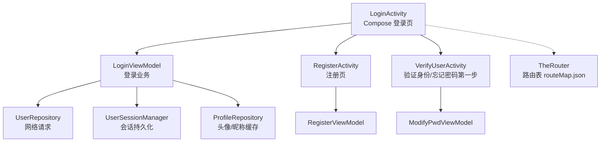
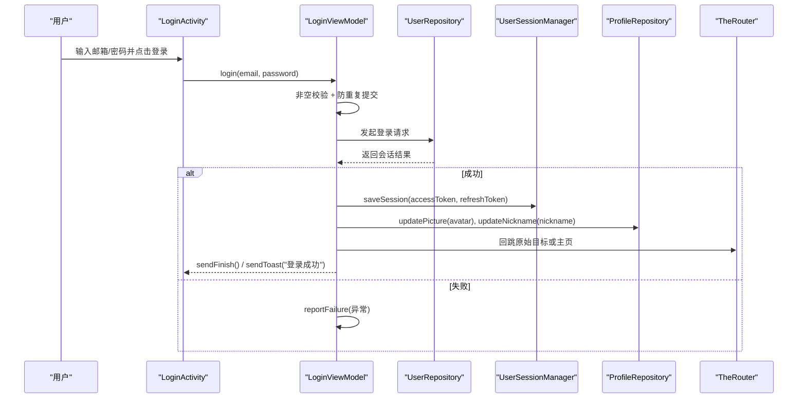
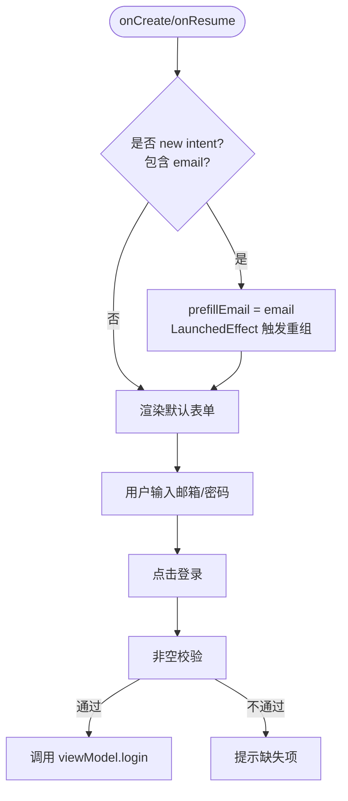
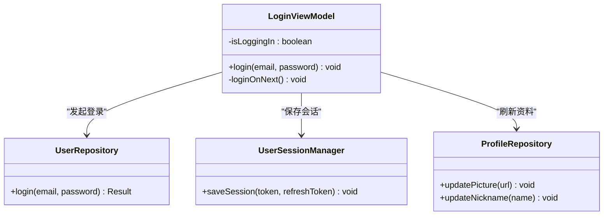
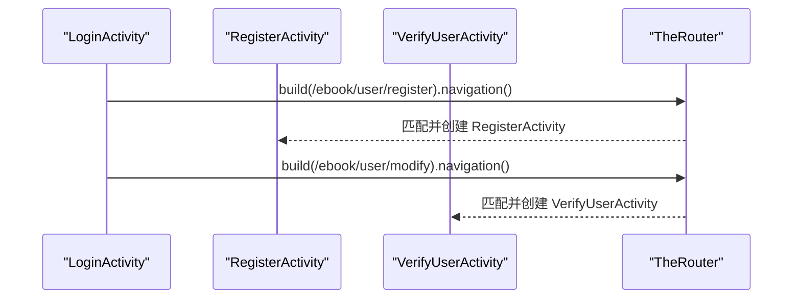
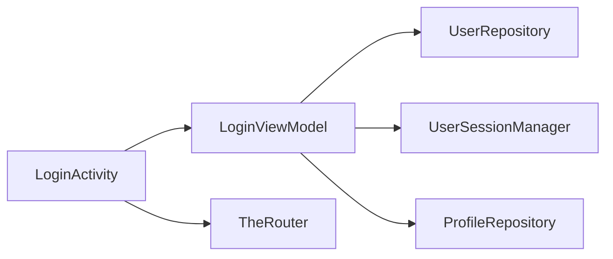

# 登录界面 (LoginActivity)

<cite>
**本文引用的文件**
- [LoginActivity.kt](file://module_login/src/main/java/com/ebook/login/LoginActivity.kt)
- [LoginViewModel.kt](file://module_login/src/main/java/com/ebook/login/mvvm/viewmodel/LoginViewModel.kt)
- [RegisterActivity.kt](file://module_login/src/main/java/com/ebook/login/RegisterActivity.kt)
- [VerifyUserActivity.kt](file://module_login/src/main/java/com/ebook/login/VerifyUserActivity.kt)
- [routeMap.json](file://module_login/src/main/assets/therouter/routeMap.json)
- [KeyCode.kt](file://lib_book_common/src/main/java/com/ebook/common/event/KeyCode.kt)
- [LoginInterceptor.kt](file://lib_book_common/src/main/java/com/ebook/common/interceptor/LoginInterceptor.kt)
</cite>

## 目录
1. [简介](#简介)
2. [项目结构](#项目结构)
3. [核心组件](#核心组件)
4. [架构总览](#架构总览)
5. [详细组件分析](#详细组件分析)
6. [依赖关系分析](#依赖关系分析)
7. [性能与可用性考量](#性能与可用性考量)
8. [故障排查指南](#故障排查指南)
9. [结论](#结论)
10. [附录：扩展指引](#附录：扩展指引)

## 简介
本文件聚焦登录界面 LoginActivity 的 Compose UI 实现、Material Design 3 主题适配、邮箱+密码表单布局，以及 singleTask 启动模式下的 onNewIntent 处理、预填邮箱机制、状态栏避让策略。同时说明登录按钮点击流程、防重复提交逻辑、Loading 覆盖层显示；并解释注册与忘记密码入口跳转逻辑、TheRouter 路由配置。最后给出如何扩展第三方登录、自定义表单样式、处理键盘弹出与布局适配的实践建议。

## 项目结构
登录功能位于 module_login 模块，UI 使用 Jetpack Compose，业务逻辑通过 Hilt 注入 ViewModel，跨模块导航统一由 TheRouter 管理。

图表来源
- [LoginActivity.kt:49-193](file://module_login/src/main/java/com/ebook/login/LoginActivity.kt#L49-L193)
- [LoginViewModel.kt:29-107](file://module_login/src/main/java/com/ebook/login/mvvm/viewmodel/LoginViewModel.kt#L29-L107)
- [RegisterActivity.kt:52-71](file://module_login/src/main/java/com/ebook/login/RegisterActivity.kt#L52-L71)
- [VerifyUserActivity.kt:47-66](file://module_login/src/main/java/com/ebook/login/VerifyUserActivity.kt#L47-L66)
- [routeMap.json:1-45](file://module_login/src/main/assets/therouter/routeMap.json#L1-L45)

章节来源
- [LoginActivity.kt:49-193](file://module_login/src/main/java/com/ebook/login/LoginActivity.kt#L49-L193)
- [routeMap.json:1-45](file://module_login/src/main/assets/therouter/routeMap.json#L1-L45)

## 核心组件
- LoginActivity：登录主页面，Compose 实现的 Material Design 3 表单，singleTask 启动模式，处理 onNewIntent 预填邮箱与状态栏避让。
- LoginViewModel：登录校验、发起登录、保存会话、回跳原目标或主页、刷新资料缓存、Loading 覆盖层控制。
- RegisterActivity：三步注册（邮箱→验证码→密码），含倒计时发码复用组件。
- VerifyUserActivity：忘记密码第一步，邮箱+验证码验证身份，成功后进入修改密码第二步。
- TheRouter 路由：各 Activity 通过 @Route 声明路径，运行时通过 routeMap.json 解析。

章节来源
- [LoginActivity.kt:49-193](file://module_login/src/main/java/com/ebook/login/LoginActivity.kt#L49-L193)
- [LoginViewModel.kt:29-107](file://module_login/src/main/java/com/ebook/login/mvvm/viewmodel/LoginViewModel.kt#L29-L107)
- [RegisterActivity.kt:52-71](file://module_login/src/main/java/com/ebook/login/RegisterActivity.kt#L52-L71)
- [VerifyUserActivity.kt:47-66](file://module_login/src/main/java/com/ebook/login/VerifyUserActivity.kt#L47-L66)
- [routeMap.json:1-45](file://module_login/src/main/assets/therouter/routeMap.json#L1-L45)

## 架构总览
登录流程以“页面—ViewModel—仓库—会话”的分层组织：
- 页面负责展示与用户交互（Compose UI）。
- ViewModel 负责一次性命令、网络调用与会话管理。
- 仓库封装网络请求与错误上报。
- 会话管理器统一持久化 token 与身份信息，并同步到 TokenHolder。

图表来源
- [LoginActivity.kt:143-154](file://module_login/src/main/java/com/ebook/login/LoginActivity.kt#L143-L154)
- [LoginViewModel.kt:45-73](file://module_login/src/main/java/com/ebook/login/mvvm/viewmodel/LoginViewModel.kt#L45-L73)
- [LoginViewModel.kt:88-106](file://module_login/src/main/java/com/ebook/login/mvvm/viewmodel/LoginViewModel.kt#L88-L106)

## 详细组件分析

### LoginActivity：Compose UI、Material Design 3 与 singleTask
- 主题适配：Surface 使用 MaterialTheme.colorScheme.background，文本颜色使用 colorScheme.onSurfaceVariant，标题使用 primary，遵循 M3 语义色。
- 状态栏避让：enableFitsSystemWindows 关闭，手动使用 statusBarsPadding 让内容避开系统状态栏，避免沉浸式带来的遮挡。
- 表单布局：邮箱与密码均使用 OutlinedTextField，分别设置 Email/Password 键盘类型；密码输入限制长度与服务端一致；登录按钮高度统一为 56dp。
- 单例行为与预填邮箱：启用 singleTask，onNewIntent 中更新 setIntent 并记录 prefillEmail；通过 LaunchedEffect(prefillEmail) 触发重组，将 email 字段预填，保证注册成功等场景携带参数可被消费。
- 注册与忘记密码入口：TextButton 分别跳转到 RegisterActivity 与 VerifyUserActivity。

图表来源
- [LoginActivity.kt:59-84](file://module_login/src/main/java/com/ebook/login/LoginActivity.kt#L59-L84)
- [LoginActivity.kt:143-154](file://module_login/src/main/java/com/ebook/login/LoginActivity.kt#L143-L154)
- [LoginActivity.kt:180-184](file://module_login/src/main/java/com/ebook/login/LoginActivity.kt#L180-L184)

章节来源
- [LoginActivity.kt:49-193](file://module_login/src/main/java/com/ebook/login/LoginActivity.kt#L49-L193)

### LoginViewModel：登录流程、防重复提交与 Loading 覆盖层
- 防重复提交：isLoggingIn 标志在请求期间锁定后续点击，避免并发登录。
- 客户端校验：仅做非空检查，账号/密码正确性交由服务端业务码判定。
- 加载反馈：updateOverlay(Overlay.Loading) 显示全屏 Loading，finally 中恢复 Overlay.None。
- 会话建立：成功时调用 UserSessionManager.saveSession，同时将头像/昵称写入 ProfileRepository。
- 回跳逻辑：优先走拦截器携带的原目标路径（非 LOGIN_PATH），否则 CLEAR_TOP + SINGLE_TOP 回到主界面并 finish 当前页。

图表来源
- [LoginViewModel.kt:29-107](file://module_login/src/main/java/com/ebook/login/mvvm/viewmodel/LoginViewModel.kt#L29-L107)

章节来源
- [LoginViewModel.kt:29-107](file://module_login/src/main/java/com/ebook/login/mvvm/viewmodel/LoginViewModel.kt#L29-L107)

### 注册与忘记密码入口：跳转逻辑与 TheRouter
- 注册入口：toRegisterActivity 直接启动 RegisterActivity；该 Activity 通过 @Route(path = KeyCode.Login.REGISTER_PATH) 注册，routeMap.json 中映射至 com.ebook.login.RegisterActivity。
- 忘记密码入口：toForgetPwdActivity 启动 VerifyUserActivity；该 Activity 通过 @Route(path = KeyCode.Login.MODIFY_PATH) 注册，routeMap.json 中映射至 com.ebook.login.VerifyUserActivity。
- 常量定义：所有路径常量集中在 KeyCode.Login 中，便于集中管理与跨模块引用。

图表来源
- [LoginActivity.kt:186-192](file://module_login/src/main/java/com/ebook/login/LoginActivity.kt#L186-L192)
- [RegisterActivity.kt:52-54](file://module_login/src/main/java/com/ebook/login/RegisterActivity.kt#L52-L54)
- [VerifyUserActivity.kt:47-49](file://module_login/src/main/java/com/ebook/login/VerifyUserActivity.kt#L47-L49)
- [routeMap.json:19-41](file://module_login/src/main/assets/therouter/routeMap.json#L19-L41)
- [KeyCode.kt:27-40](file://lib_book_common/src/main/java/com/ebook/common/event/KeyCode.kt#L27-L40)

章节来源
- [LoginActivity.kt:186-192](file://module_login/src/main/java/com/ebook/login/LoginActivity.kt#L186-L192)
- [RegisterActivity.kt:52-71](file://module_login/src/main/java/com/ebook/login/RegisterActivity.kt#L52-L71)
- [VerifyUserActivity.kt:47-66](file://module_login/src/main/java/com/ebook/login/VerifyUserActivity.kt#L47-L66)
- [routeMap.json:1-45](file://module_login/src/main/assets/therouter/routeMap.json#L1-L45)
- [KeyCode.kt:27-40](file://lib_book_common/src/main/java/com/ebook/common/event/KeyCode.kt#L27-L40)

### 鉴权拦截与回跳
- 当目标页需要登录且未登录时，LoginInterceptor 会将路由替换为 LOGIN_PATH，从而引导用户登录。
- 登录成功后，LoginViewModel 根据 bundle 中的 therouter_path 判断：若是原始目标则回跳该页；若为主动跳转登录，则回到主界面并清理中间页。

章节来源
- [LoginInterceptor.kt:21-41](file://lib_book_common/src/main/java/com/ebook/common/interceptor/LoginInterceptor.kt#L21-L41)
- [LoginViewModel.kt:88-106](file://module_login/src/main/java/com/ebook/login/mvvm/viewmodel/LoginViewModel.kt#L88-L106)

## 依赖关系分析
- LoginActivity 依赖 BaseMvvmActivity（来自 lib_common）提供 MVVM 基类能力与覆盖层绑定。
- LoginViewModel 依赖 UserRepository、UserSessionManager、ProfileRepository，完成登录、会话与资料缓存。
- 页面间跳转通过 TheRouter 解耦，路由表由构建期工具生成并在运行期读取。

图表来源
- [LoginActivity.kt:49-52](file://module_login/src/main/java/com/ebook/login/LoginActivity.kt#L49-L52)
- [LoginViewModel.kt:29-34](file://module_login/src/main/java/com/ebook/login/mvvm/viewmodel/LoginViewModel.kt#L29-L34)
- [routeMap.json:1-45](file://module_login/src/main/assets/therouter/routeMap.json#L1-L45)

章节来源
- [LoginActivity.kt:49-52](file://module_login/src/main/java/com/ebook/login/LoginActivity.kt#L49-L52)
- [LoginViewModel.kt:29-34](file://module_login/src/main/java/com/ebook/login/mvvm/viewmodel/LoginViewModel.kt#L29-L34)
- [routeMap.json:1-45](file://module_login/src/main/assets/therouter/routeMap.json#L1-L45)

## 性能与可用性考量
- 防重复提交：isLoggingIn 防止并发登录，减少无效网络请求与资源消耗。
- Loading 覆盖层：在请求期间显示全局 Loading，提升用户感知与体验一致性。
- 键盘类型优化：邮箱使用 Email 键盘，密码使用 Password 键盘，提高输入效率。
- 状态栏避让：通过 statusBarsPadding 确保内容不被系统栏遮挡，提升可读性与可用性。
- 回跳逻辑优化：优先回跳原始目标页，减少多余导航步骤，提升任务完成率。

[本节为通用指导，无需具体文件引用]

## 故障排查指南
- 登录无响应：检查 isLoggingIn 是否被卡住；确认 finally 分支正常执行并关闭 Loading。
- 登录成功不回跳：核对 bundle 中的 therouter_path 是否为 LOGIN_PATH 或其带参形式；如为主页回退，应使用 CLEAR_TOP + SINGLE_TOP。
- 注册/忘记密码跳转失效：确认 routeMap.json 中对应路径已存在且 Activity 已用 @Route 注解声明；独立模式下需确保测试宿主占位路由存在。
- 预填邮箱无效：检查 onNewIntent 是否正确调用 setIntent 与更新 prefillEmail；确认 LaunchedEffect(prefillEmail) 能触发重组。
- 会话过期导致异常：网络层会静默刷新，失败后上报；页面不应自行处理会话过期分支，交由上层统一处置。

章节来源
- [LoginViewModel.kt:45-73](file://module_login/src/main/java/com/ebook/login/mvvm/viewmodel/LoginViewModel.kt#L45-L73)
- [LoginViewModel.kt:88-106](file://module_login/src/main/java/com/ebook/login/mvvm/viewmodel/LoginViewModel.kt#L88-L106)
- [LoginActivity.kt:180-184](file://module_login/src/main/java/com/ebook/login/LoginActivity.kt#L180-L184)
- [routeMap.json:1-45](file://module_login/src/main/assets/therouter/routeMap.json#L1-L45)

## 结论
LoginActivity 采用 Compose + Material Design 3，实现了清晰直观的邮箱+密码登录表单；通过 singleTask + onNewIntent 妥善处理了预填邮箱与状态栏避让；LoginViewModel 保证了登录流程的健壮性（防重复提交、Loading 覆盖层、会话持久化与资料刷新）；注册与忘记密码通过 TheRouter 解耦跳转，路径集中管理。整体设计兼顾可用性与可维护性。

[本节为总结，无需具体文件引用]

## 附录：扩展指引

### 扩展新的登录方式（如第三方登录）
- 新增入口：在 LoginActivity 中添加第三方登录按钮（例如 TextButton），并绑定点击事件。
- 调用 ViewModel：在 LoginViewModel 中新增第三方登录方法，封装授权流程与回调。
- 会话建立：成功后调用 UserSessionManager.saveSession，并刷新 ProfileRepository。
- 回跳逻辑：复用现有 loginOnNext 逻辑，保持回跳一致性。

章节来源
- [LoginActivity.kt:143-154](file://module_login/src/main/java/com/ebook/login/LoginActivity.kt#L143-L154)
- [LoginViewModel.kt:45-73](file://module_login/src/main/java/com/ebook/login/mvvm/viewmodel/LoginViewModel.kt#L45-L73)
- [LoginViewModel.kt:88-106](file://module_login/src/main/java/com/ebook/login/mvvm/viewmodel/LoginViewModel.kt#L88-L106)

### 自定义表单样式
- 主题色：使用 MaterialTheme.colorScheme 的 primary、background、onSurfaceVariant 等语义色，避免硬编码颜色。
- 组件尺寸：统一按钮高度（登录 56dp，注册/验证统一 AuthButtonHeight），输入框宽度 fillMaxWidth。
- 间距与对齐：使用 Spacer 与 padding 控制布局节奏，保持视觉一致性。

章节来源
- [LoginActivity.kt:85-172](file://module_login/src/main/java/com/ebook/login/LoginActivity.kt#L85-L172)
- [RegisterActivity.kt:91-167](file://module_login/src/main/java/com/ebook/login/RegisterActivity.kt#L91-L167)

### 处理键盘弹出与布局适配
- 键盘类型：OutlintedTextField 设置 KeyboardOptions 的 keyboardType，提升输入体验。
- 滚动适配：注册/验证页使用 verticalScroll 包裹 Column，避免键盘遮挡输入框。
- 状态栏避让：登录页使用 statusBarsPadding 手动避让，确保内容不被系统栏覆盖。

章节来源
- [LoginActivity.kt:114-138](file://module_login/src/main/java/com/ebook/login/LoginActivity.kt#L114-L138)
- [RegisterActivity.kt:95-101](file://module_login/src/main/java/com/ebook/login/RegisterActivity.kt#L95-L101)
- [VerifyUserActivity.kt:86-92](file://module_login/src/main/java/com/ebook/login/VerifyUserActivity.kt#L86-L92)