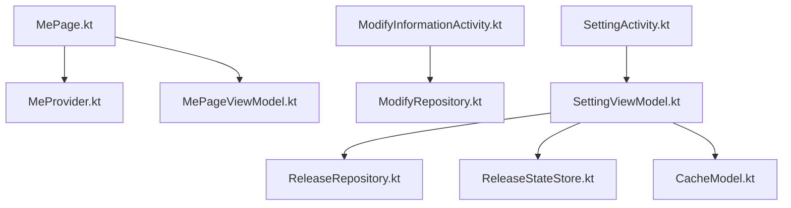
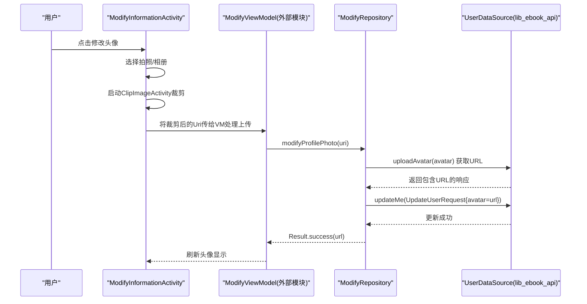
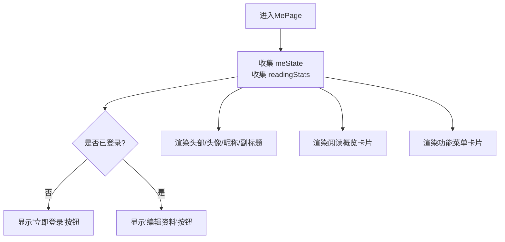
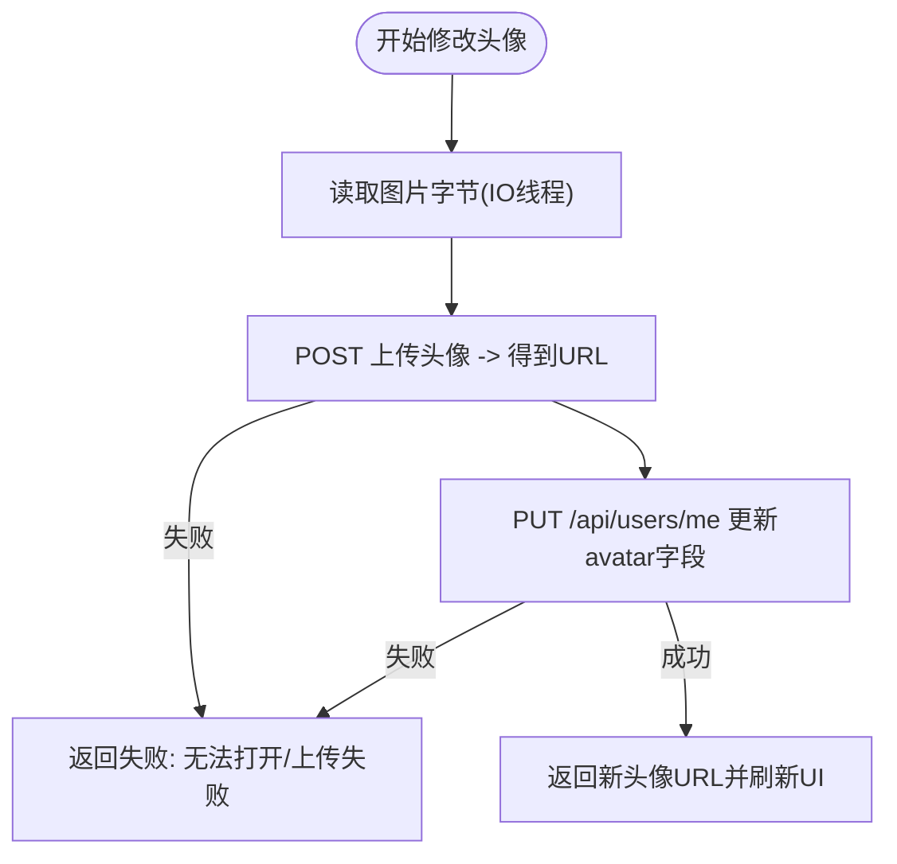
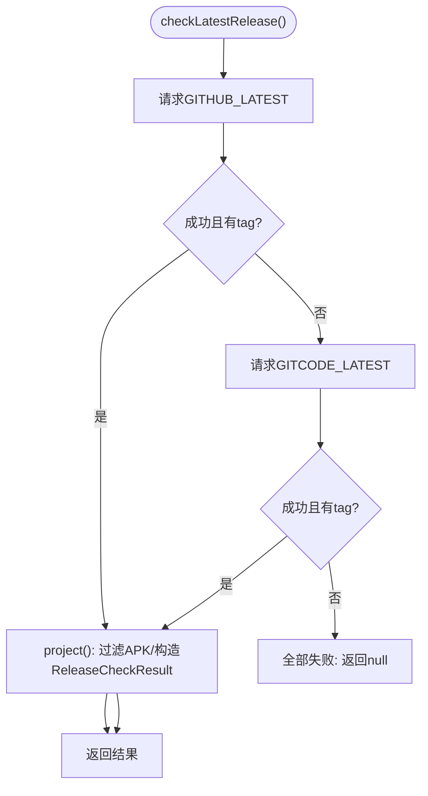
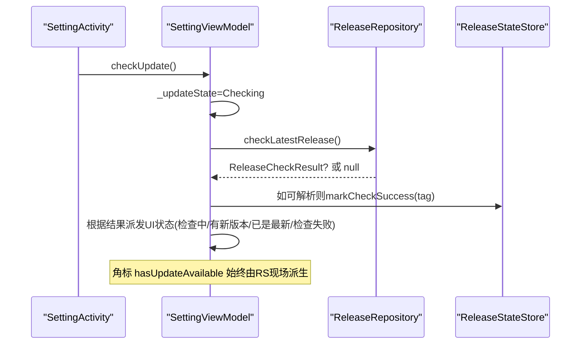
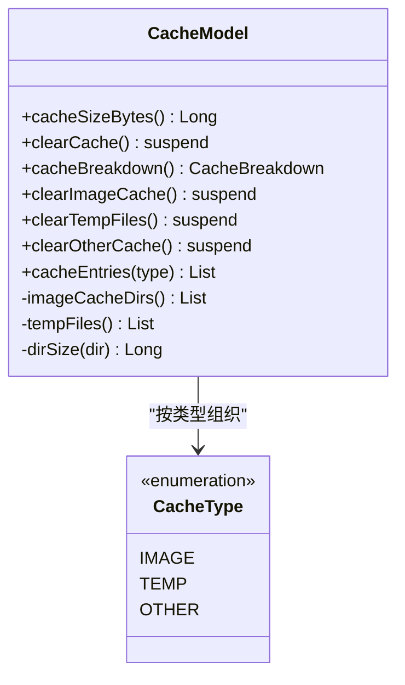

# 个人中心模块 (module_me)

<cite>
**本文引用的文件**
- [MePage.kt](file://module_me/src/main/java/com/ebook/me/page/MePage.kt)
- [MeProvider.kt](file://module_me/src/main/java/com/ebook/me/provider/MeProvider.kt)
- [ModifyInformationActivity.kt](file://module_me/src/main/java/com/ebook/me/view/ModifyInformationActivity.kt)
- [ModifyRepository.kt](file://module_me/src/main/java/com/ebook/me/repository/ModifyRepository.kt)
- [ReleaseRepository.kt](file://module_me/src/main/java/com/ebook/me/repository/ReleaseRepository.kt)
- [ReleaseStateStore.kt](file://module_me/src/main/java/com/ebook/me/repository/ReleaseStateStore.kt)
- [SettingViewModel.kt](file://module_me/src/main/java/com/ebook/me/mvvm/viewmodel/SettingViewModel.kt)
- [SettingActivity.kt](file://module_me/src/main/java/com/ebook/me/view/SettingActivity.kt)
- [CacheModel.kt](file://module_me/src/main/java/com/ebook/me/repository/CacheModel.kt)
- [MePageViewModel.kt](file://module_me/src/main/java/com/ebook/me/mvvm/viewmodel/MePageViewModel.kt)
</cite>

## 目录
1. [引言](#引言)
2. [项目结构](#项目结构)
3. [核心组件](#核心组件)
4. [架构总览](#架构总览)
5. [详细组件分析](#详细组件分析)
6. [依赖关系分析](#依赖关系分析)
7. [性能考量](#性能考量)
8. [故障排查指南](#故障排查指南)
9. [结论](#结论)
10. [附录：扩展与自定义设置项指南](#附录：扩展与自定义设置项指南)

## 引言
本模块实现“个人中心”全链路能力：用户信息管理、个人设置（缓存管理、更新检查与退出登录）、头像上传裁剪、版本发布源检查与状态持久化等。界面层以 Compose 为主，采用 MVVM + Hilt 注入；跨模块导航使用 TheRouter；网络与数据通过 lib_ebook_api 的 DataSource 接口解耦；本地配置通过 SharedPreferences（更新状态）与应用 cacheDir（缓存）完成。

## 项目结构
- 页面入口
  - MePage：主页（我的）Compose 界面与行为编排
  - SettingActivity / SettingScreen：设置页（通用+关于+账号）
  - ModifyInformationActivity：个人资料编辑（头像、昵称、密码）
- Repository / Model
  - ModifyRepository：昵称/头像更新
  - ReleaseRepository：版本发布检查策略（多源 failover、APK 过滤）
  - ReleaseStateStore：更新检查状态持久化与限频
  - CacheModel：缓存计算与清理（cacheDir）
- 提供与路由
  - MeProvider：TheRouter ServiceProvider 暴露 MePage
  - 各 Activity 通过 @Route 注册到 TheRouter



图表来源
- [MePage.kt:79-131](file://module_me/src/main/java/com/ebook/me/page/MePage.kt#L79-L131)
- [MeProvider.kt:15-19](file://module_me/src/main/java/com/ebook/me/provider/MeProvider.kt#L15-L19)
- [ModifyInformationActivity.kt:70-172](file://module_me/src/main/java/com/ebook/me/view/ModifyInformationActivity.kt#L70-L172)
- [SettingActivity.kt:72-131](file://module_me/src/main/java/com/ebook/me/view/SettingActivity.kt#L72-L131)
- [ReleaseRepository.kt:35-126](file://module_me/src/main/java/com/ebook/me/repository/ReleaseRepository.kt#L35-L126)
- [ReleaseStateStore.kt:32-129](file://module_me/src/main/java/com/ebook/me/repository/ReleaseStateStore.kt#L32-L129)
- [CacheModel.kt:53-154](file://module_me/src/main/java/com/ebook/me/repository/CacheModel.kt#L53-L154)

章节来源
- [MePage.kt:79-131](file://module_me/src/main/java/com/ebook/me/page/MePage.kt#L79-L131)
- [MeProvider.kt:15-19](file://module_me/src/main/java/com/ebook/me/provider/MeProvider.kt#L15-L19)
- [SettingActivity.kt:72-131](file://module_me/src/main/java/com/ebook/me/view/SettingActivity.kt#L72-L131)

## 核心组件
- MePage/MePageViewModel：组合头像/昵称回退逻辑、阅读统计；通过 TheRouter 跳转到评论、资料、设置
- ModifyRepository：昵称部分更新、头像两步上传流程；异常信息走字符串资源
- ReleaseRepository：按顺序尝试 GitHub/Gitcode 端点；过滤非 .apk；返回 ReleaseCheckResult
- ReleaseStateStore：SharedPreferences 存储上次 tag 与成功时间；派生 hasUpdateAvailable、限频控制
- SettingViewModel：缓存大小展示、静默/主动更新检查、角标派生、退出登录调用 UserSessionManager
- SettingActivity：设置 UI，组合更新弹窗、缓存跳转、退出确认与登出流程
- CacheModel：计算 cacheDir 大小/明细/分类清理，格式化为可读单位
- ModifyInformationActivity：头像选择（拍照/相册）→ ClipImageActivity 裁剪 → ViewModel 触发上传

章节来源
- [MePageViewModel.kt:65-103](file://module_me/src/main/java/com/ebook/me/mvvm/viewmodel/MePageViewModel.kt#L65-L103)
- [ModifyRepository.kt:19-82](file://module_me/src/main/java/com/ebook/me/repository/ModifyRepository.kt#L19-L82)
- [ReleaseRepository.kt:35-126](file://module_me/src/main/java/com/ebook/me/repository/ReleaseRepository.kt#L35-L126)
- [ReleaseStateStore.kt:32-129](file://module_me/src/main/java/com/ebook/me/repository/ReleaseStateStore.kt#L32-L129)
- [SettingViewModel.kt:43-200](file://module_me/src/main/java/com/ebook/me/mvvm/viewmodel/SettingViewModel.kt#L43-L200)
- [SettingActivity.kt:72-131](file://module_me/src/main/java/com/ebook/me/view/SettingActivity.kt#L72-L131)
- [CacheModel.kt:53-154](file://module_me/src/main/java/com/ebook/me/repository/CacheModel.kt#L53-L154)

## 架构总览
个人中心模块遵循 MVVM，职责清晰分层：
- View 层：Composable/Activity 负责渲染和事件分发（MyPage、SettingActivity、ModifyInformationActivity）
- ViewModel 层：汇总领域状态、发起业务用例、编排结果映射为 UI State（MePageViewModel、SettingViewModel）
- Repository 层：封装领域策略与数据源（ModifyRepository、ReleaseRepository、CacheModel、ReleaseStateStore）
- 跨模块与底层：Hilt 注入 Provider/Datasource（UserDataSource、ReleaseDataSource），TheRouter 跨模块跳转



图表来源
- [ModifyInformationActivity.kt:92-113](file://module_me/src/main/java/com/ebook/me/view/ModifyInformationActivity.kt#L92-L113)
- [ModifyRepository.kt:53-81](file://module_me/src/main/java/com/ebook/me/repository/ModifyRepository.kt#L53-L81)

## 详细组件分析

### 我的页(MePage)与状态管理
- 页面由 Compose 构建，顶部渐变头、头像光环、昵称与副标题、右侧按钮（登录/编辑资料）；深色模式自动切换渐变色与图标颜色
- MePageViewModel 合并登录态、昵称、头像 URL 生成单一 meState；同时从 BookRepository 读取书架统计（藏书数/最近在读），独立于登录态
- 路由：统一使用 TheRouter 跳转至登录、评论、资料、设置
- 深色主题与状态栏自适应：通过检测渐变起始色，动态调整状态栏图标深浅以保证可读性



图表来源
- [MePage.kt:79-131](file://module_me/src/main/java/com/ebook/me/page/MePage.kt#L79-L131)
- [MePageViewModel.kt:65-103](file://module_me/src/main/java/com/ebook/me/mvvm/viewmodel/MePageViewModel.kt#L65-L103)

章节来源
- [MePage.kt:79-131](file://module_me/src/main/java/com/ebook/me/page/MePage.kt#L79-L131)
- [MePageViewModel.kt:65-103](file://module_me/src/main/java/com/ebook/me/mvvm/viewmodel/MePageViewModel.kt#L65-L103)

### 个人资料修改(ModifyRepository/ModifyInformationActivity)
- 昵称修改：PUT /api/users/me 仅携带 nickname；失败文案来自字符串资源
- 头像修改：两步流程
  1) 在 IO 线程读取图片字节并 multipart 上传 avatar，得到 URL
  2) PUT /api/users/me 提交 {avatar:url} 更新资料
- Activity 侧：ModalBottomSheet 选拍照/相册；拍照落临时文件；统一进入圆形裁剪活动，再交给 ViewModel 执行上传
- 错误处理：IO/解析失败会转为统一异常，上层 UI 可捕获提示



图表来源
- [ModifyRepository.kt:26-81](file://module_me/src/main/java/com/ebook/me/repository/ModifyRepository.kt#L26-L81)
- [ModifyInformationActivity.kt:92-113](file://module_me/src/main/java/com/ebook/me/view/ModifyInformationActivity.kt#L92-L113)

章节来源
- [ModifyRepository.kt:26-81](file://module_me/src/main/java/com/ebook/me/repository/ModifyRepository.kt#L26-L81)
- [ModifyInformationActivity.kt:70-172](file://module_me/src/main/java/com/ebook/me/view/ModifyInformationActivity.kt#L70-L172)

### 版本更新检查(ReleaseRepository & ReleaseStateStore)
- 多源 Failover：按顺序请求 GitHub 最新 release 与 Gitcode 最新 release；任一成功即返回；均失败返回 null（表示检查失败）
- 过滤 APK：只识别 .apk 附件作为下载链接；无安装包时 apkDownloadUrl 为 null（UI 隐藏下载入口）
- 空 tag 判定：远端响应没有 tag 视为该源无效，继续下一个源
- 取消传播：CancellationException 原样抛出，避免页面销毁后仍白打一次备用源
- 本地持久化：ReleaseStateStore 记录 lastCheckedTag 与 successTime；角标 hasUpdateAvailable 每次现场派生（比较当前版本与 lastCheckedTag）；限频窗口 7 天（shouldAutoRefresh）



图表来源
- [ReleaseRepository.kt:46-70](file://module_me/src/main/java/com/ebook/me/repository/ReleaseRepository.kt#L46-L70)
- [ReleaseRepository.kt:77-88](file://module_me/src/main/java/com/ebook/me/repository/ReleaseRepository.kt#L77-L88)
- [ReleaseStateStore.kt:72-77](file://module_me/src/main/java/com/ebook/me/repository/ReleaseStateStore.kt#L72-L77)

章节来源
- [ReleaseRepository.kt:35-126](file://module_me/src/main/java/com/ebook/me/repository/ReleaseRepository.kt#L35-L126)
- [ReleaseStateStore.kt:32-129](file://module_me/src/main/java/com/ebook/me/repository/ReleaseStateStore.kt#L32-L129)

### 设置页(SettingViewModel & SettingActivity)
- 功能分组
  - 通用：展示缓存大小（点击进入缓存管理页面，不在本页直接清理）
  - 关于：版本号行触发检查；有新版时在版本号旁展示角标；失败时弹出错误提示
  - 账号：退出登录（调 UserSessionManager.clearSession；登录态由 Flow 控制显隐）
- 更新检查
  - 主动检查：点击立即弹窗（Checking/HasUpdate/UpToDate/CheckError）
  - 静默刷新：进入设置页时，距上次成功检查≥7天才发请求；不弹窗，仅派生角标
  - 取消机制：关闭“检查中”弹窗即取消在途任务，避免恢复时重新推送弹窗
- 版本比较与角标派生
  - 比较基准：ReleaseStateStore.currentVersionName；远程 tag 经 AppVersion.normalize/parse
  - 成功写入：仅当能解析版本时才记录成功时间与 tag，保证限频窗口正确且不会用“无法判定”覆盖旧结论
- 缓存与退出
  - 刷新：onResume 时刷新缓存大小与角标，保证长期驻留时的状态一致性
  - 退出：先登出服务端会话（尽力而为），随后清本地会话，不阻塞



图表来源
- [SettingViewModel.kt:138-177](file://module_me/src/main/java/com/ebook/me/mvvm/viewmodel/SettingViewModel.kt#L138-L177)
- [ReleaseRepository.kt:46-88](file://module_me/src/main/java/com/ebook/me/repository/ReleaseRepository.kt#L46-L88)
- [ReleaseStateStore.kt:96-100](file://module_me/src/main/java/com/ebook/me/repository/ReleaseStateStore.kt#L96-L100)

章节来源
- [SettingActivity.kt:72-131](file://module_me/src/main/java/com/ebook/me/view/SettingActivity.kt#L72-L131)
- [SettingViewModel.kt:43-200](file://module_me/src/main/java/com/ebook/me/mvvm/viewmodel/SettingViewModel.kt#L43-L200)

### 缓存管理系统(CacheModel)
- 计算：递归统计 cacheDir 大小、按类别区分（图片缓存/临时文件/其他）
- 清理：支持清空全部、清空图片缓存、清空临时文件、清空其他缓存
- 明细：列出各类别条目（IMAGE/OTHER 以目录粒度，TEMP 以文件粒度），并按大小降序展示
- 格式：byte→可读大小（B/KB/MB/GB），使用 Locale.US 固定数值小数点



图表来源
- [CacheModel.kt:53-154](file://module_me/src/main/java/com/ebook/me/repository/CacheModel.kt#L53-L154)

章节来源
- [CacheModel.kt:53-154](file://module_me/src/main/java/com/ebook/me/repository/CacheModel.kt#L53-L154)

## 依赖关系分析
- 跨模块
  - TheRouter：页面注册与路由跳转（Login/Me/Setting/CACHE/ABOUT 路径）
  - lib_ebook_api：UserDataSource（昵称/头像更新）、ReleaseDataSource（检查最新版本）
- 内模块
  - Hilt：@HiltViewModel/@Inject/@AndroidEntryPoint 统一管理生命周期与依赖
  - Common：BaseViewModel/NoOpModel/Logger/ToastUtil 等基类工具
- 数据流
  - SettingActivity -> SettingViewModel -> ReleaseRepository -> ReleaseDataSource
  - ModifyInformationActivity -> ModifyRepository -> UserDataSource
  - MePage -> MePageViewModel -> ProfileRepository/UserSessionManager/BookRepository

```mermaid
graph LR
    SA["SettingActivity"] --> SVM["SettingViewModel"]
    SVM --> RR["ReleaseRepository"]
    RR --> RD["ReleaseDataSource(lib_ebook_api)]
    MA["ModifyInformationActivity"] --> MR["ModifyRepository"]
    MR --> UD["UserDataSource(lib_ebook_api)]
    MP["MePage"] --> MVP["MePageViewModel"]
    MVP --> PR["ProfileRepository"]
    MVP --> USM["UserSessionManager"]
    MVP --> BR["BookRepository"]
```

图表来源
- [SettingActivity.kt:72-131](file://module_me/src/main/java/com/ebook/me/view/SettingActivity.kt#L72-L131)
- [ReleaseRepository.kt:35-70](file://module_me/src/main/java/com/ebook/me/repository/ReleaseRepository.kt#L35-L70)
- [ModifyInformationActivity.kt:70-113](file://module_me/src/main/java/com/ebook/me/view/ModifyInformationActivity.kt#L70-L113)
- [MePageViewModel.kt:65-103](file://module_me/src/main/java/com/ebook/me/mvvm/viewmodel/MePageViewModel.kt#L65-L103)

章节来源
- [ReleaseRepository.kt:35-70](file://module_me/src/main/java/com/ebook/me/repository/ReleaseRepository.kt#L35-L70)
- [ModifyInformationActivity.kt:70-113](file://module_me/src/main/java/com/ebook/me/view/ModifyInformationActivity.kt#L70-L113)
- [MePageViewModel.kt:65-103](file://module_me/src/main/java/com/ebook/me/mvvm/viewmodel/MePageViewModel.kt#L65-L103)

## 性能考量
- IO 隔离：头像读取、缓存计算/清理均在 Dispatchers.IO，避免阻塞主线程
- 流式收敛：meState 由 combine + stateIn 合并，WhileSubscribed 控制订阅期节省电量
- 重复请求保护：SettingViewModel 的 checkJob 防重入；关闭弹窗即刻取消在途任务
- 角标派生：hasUpdateAvailable 不持久化结论，仅在需要时基于持久 tag 派生，避免误刷
- 缓存分类与差值统计：OTHER 通过总量减两项的方式减少并发竞争导致的误差

## 故障排查指南
- 头像上传失败
  - 检查 IO 是否能打开 Uri（modifyProfilePhoto 的 openInputStream）
  - 检查服务器是否返回有效的 URL（uploadAvatar 响应 data.url 是否为空）
  - 日志：Repository 层抛出的异常消息来自字符串资源，便于在 UI 层呈现
- 版本更新检查失败
  - 两源都失败或 tag 为空会返回 null，UI 应显示“检查失败”
  - 若远端契约变化导致 JSON 解析失败，会被 catch 并切换到备用源
  - APK 被过滤：如无 .apk 附件，apkDownloadUrl 为 null，应在 UI 隐藏下载入口
- 退出登录未完成
  - 务必 await 登出协程后再 finish；设置页的 onLogout 使用 lifecycleScope.launch 等待完成

章节来源
- [ModifyRepository.kt:53-81](file://module_me/src/main/java/com/ebook/me/repository/ModifyRepository.kt#L53-L81)
- [ReleaseRepository.kt:46-70](file://module_me/src/main/java/com/ebook/me/repository/ReleaseRepository.kt#L46-L70)
- [SettingViewModel.kt:179-200](file://module_me/src/main/java/com/ebook/me/mvvm/viewmodel/SettingViewModel.kt#L179-L200)

## 结论
个人中心模块以 Compose + MVVM 构建，职责边界清晰：页面关注渲染与交互，ViewModel 聚合状态与业务流程，Repository 负责具体策略与数据访问。版本更新检查采用稳健的多源策略与严格的失败边界，设置页具备静默刷新与限频控制；个人资料修改完整覆盖昵称/头像路径；缓存管理提供了直观的大小与细粒度清理能力。整体具备良好的可扩展性与可维护性。

## 附录：扩展与自定义设置项指南
- 新增设置项
  - 在 SettingActivity/SettingScreen 中添加新的列表项（CommonListItem），并在对应的 onClick 回调中实现行为（跳转/动作）
  - 如需全局开关：优先复用现有 Preference/SP 通道（可参考 ReleaseStateStore 模式新建 Store），并通过 StateFlow 下发到 UI
- 主题与字体
  - 设置页未集成主题/字体选项：若需新增，建议通过 SettingViewModel 暴露状态，结合 Settings Screen 提供切换入口；字体大小可通过 Theme 配置传入或集中管理
- 会话与权限
  - 退出登录一律调 UserSessionManager.clearSession，不要单独操作 SP 或其他镜像位
  - 涉及跨模块跳转（登录/注册/隐私协议等）使用 TheRouter，确保在独立模式下存在占位路由避免静默失效
- 测试与验证
  - 新增仓库方法需提供对应单元测试（尤其对网络/IO 边界与解析逻辑）
  - 涉及版本更新的改动需校验“失败不覆盖结论”以及“角标派生与限频窗口”的行为