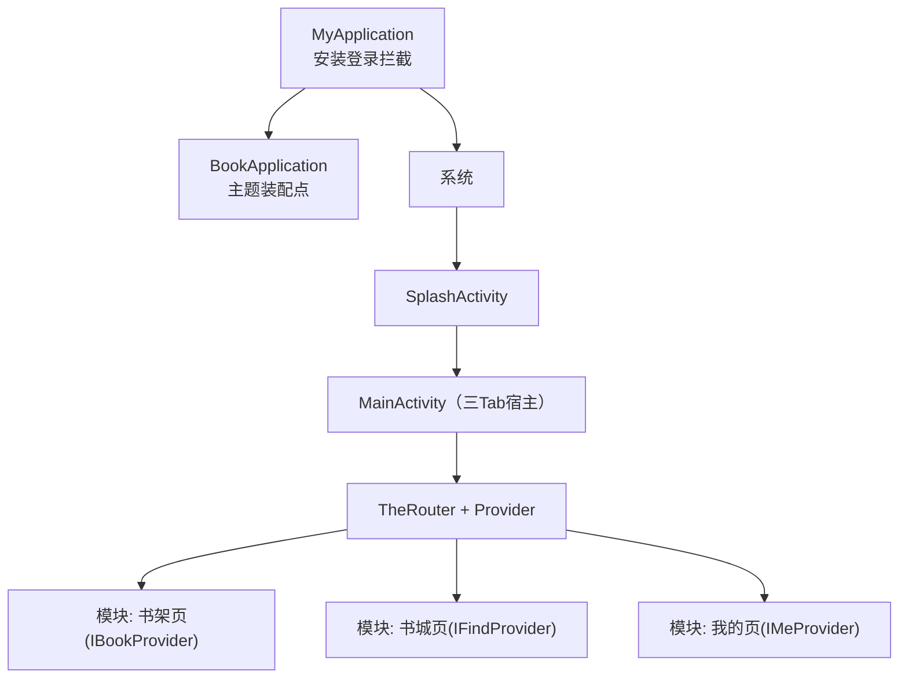
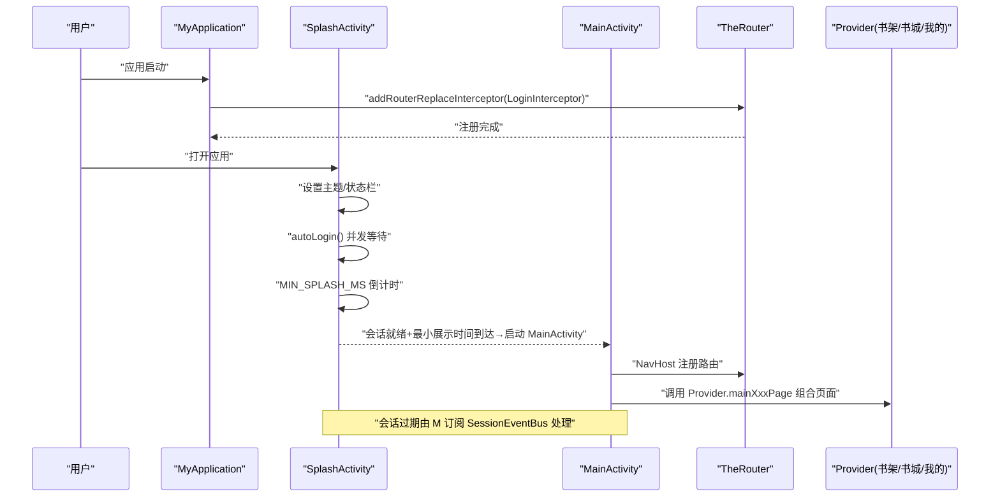
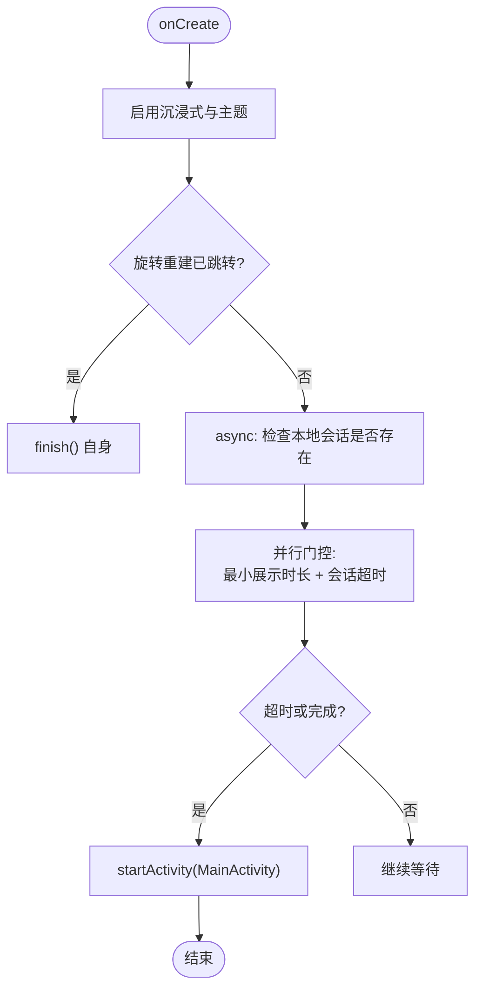
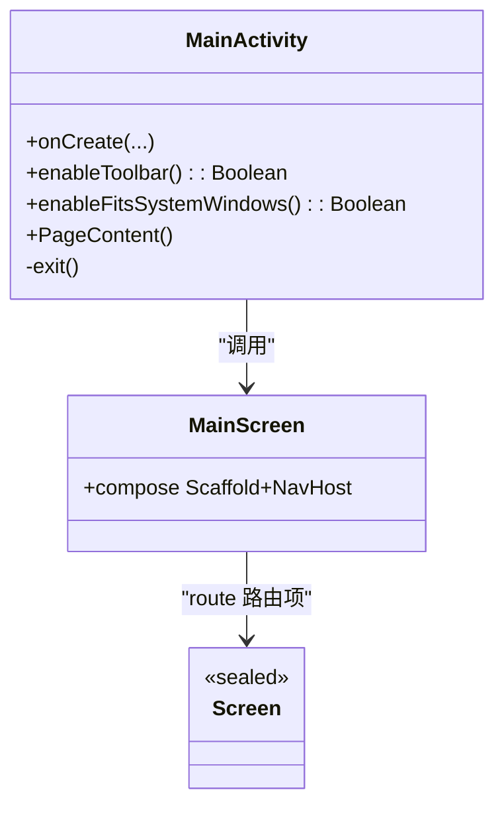
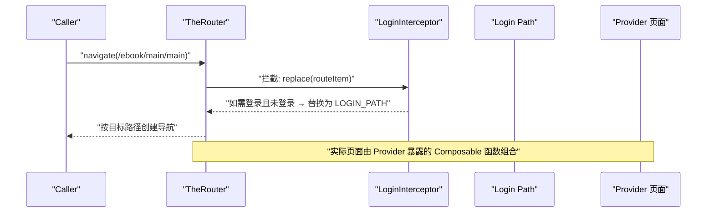
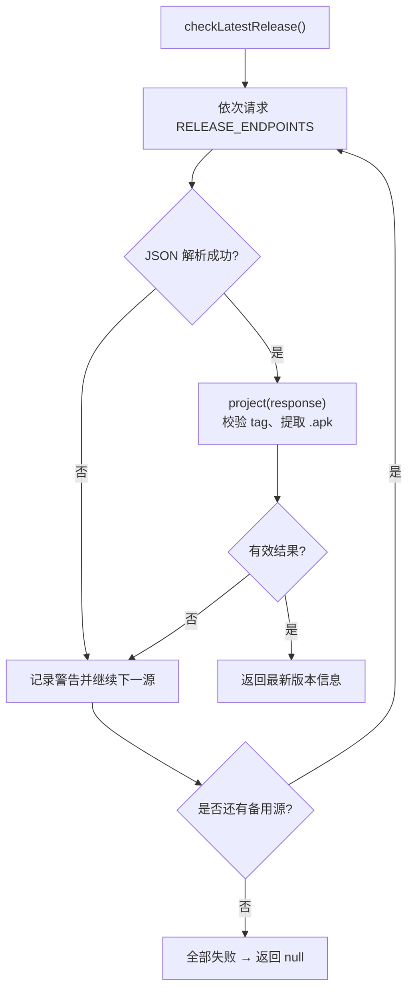
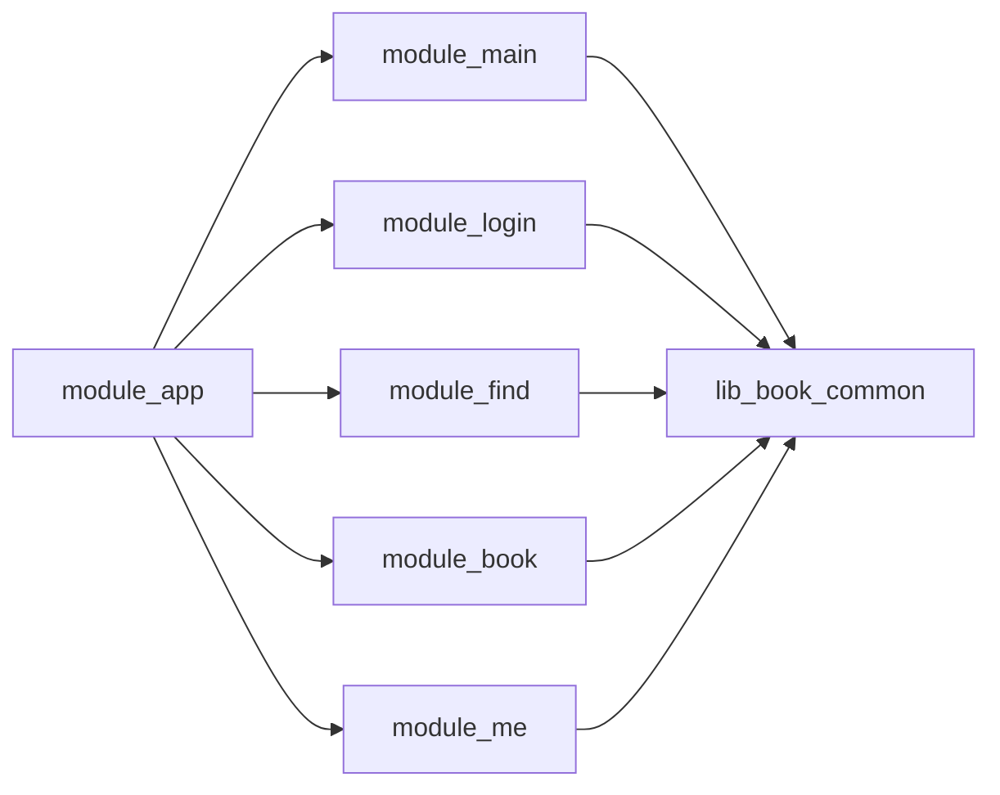

# 主模块（module_main）

<cite>
**本文引用的文件**
- [SplashActivity.kt](file://module_main/src/main/java/com/ebook/main/SplashActivity.kt)
- [MainActivity.kt](file://module_main/src/main/java/com/ebook/main/MainActivity.kt)
- [MyApplication.kt](file://module_app/src/main/java/com/ebook/MyApplication.kt)
- [BookApplication.kt](file://lib_book_common/src/main/java/com/ebook/common/BookApplication.kt)
- [LoginInterceptor.kt](file://lib_book_common/src/main/java/com/ebook/common/interceptor/LoginInterceptor.kt)
- [KeyCode.kt](file://lib_book_common/src/main/java/com/ebook/common/event/KeyCode.kt)
- [IBookProvider.kt](file://lib_book_common/src/main/java/com/ebook/common/provider/IBookProvider.kt)
- [IFindProvider.kt](file://lib_book_common/src/main/java/com/ebook/common/provider/IFindProvider.kt)
- [IMeProvider.kt](file://lib_book_common/src/main/java/com/ebook/common/provider/IMeProvider.kt)
- [ReleaseRepository.kt](file://module_me/src/main/java/com/ebook/me/repository/ReleaseRepository.kt)
- [AndroidManifest.xml](file://module_main/src/main/AndroidManifest.xml)
</cite>

## 目录
1. [简介](#简介)
2. [项目结构](#项目结构)
3. [核心组件](#核心组件)
4. [架构总览](#架构总览)
5. [详细组件分析](#详细组件分析)
6. [依赖关系分析](#依赖关系分析)
7. [性能与启动优化](#性能与启动优化)
8. [故障排查](#故障排查)
9. [结论](#结论)

## 简介
本模块负责应用的启动流程与主页 Tab 导航容器。应用从 SplashActivity 启动，执行会话恢复与最小展示时长控制后跳转到 MainActivity；MainActivity 作为三个功能 Tab（书架、书城、我的）的宿主容器，使用 Jetpack Compose 导航并通过 TheRouter 与 Provider 集成各模块页面。此外，模块还承担会话过期的统一处置入口，并配合登录拦截器实现跨模块权限检查。版本更新检测由 module_me 实现，本模块通过事件总线在必要时跳转处理。

## 项目结构
- 入口 Activity：SplashActivity、MainActivity
- 路由常量：KeyCode（Main/ Login/ Book/ Find/ Me）
- 跨模块集成：IBookProvider / IFindProvider / IMeProvider（由 TheRouter 生成对应模块实现）
- 登录拦截：LoginInterceptor（TheRouter 拦截未登录访问）
- 应用装配：MyApplication（注册登录拦截）、BookApplication（主题装配点）

**图表来源**
- [MyApplication.kt:1-15](file://module_app/src/main/java/com/ebook/MyApplication.kt#L1-L15)
- [BookApplication.kt:1-16](file://lib_book_common/src/main/java/com/ebook/common/BookApplication.kt#L1-L16)
- [SplashActivity.kt:69-170](file://module_main/src/main/java/com/ebook/main/SplashActivity.kt#L69-L170)
- [MainActivity.kt:57-197](file://module_main/src/main/java/com/ebook/main/MainActivity.kt#L57-L197)
- [IBookProvider.kt:1-15](file://lib_book_common/src/main/java/com/ebook/common/provider/IBookProvider.kt#L1-L15)
- [IFindProvider.kt:1-15](file://lib_book_common/src/main/java/com/ebook/common/provider/IFindProvider.kt#L1-L15)
- [IMeProvider.kt:1-15](file://lib_book_common/src/main/java/com/ebook/common/provider/IMeProvider.kt#L1-L15)

**章节来源**
- [AndroidManifest.xml:1-27](file://module_main/src/main/AndroidManifest.xml#L1-L27)
- [MyApplication.kt:1-15](file://module_app/src/main/java/com/ebook/MyApplication.kt#L1-L15)
- [BookApplication.kt:1-16](file://lib_book_common/src/main/java/com/ebook/common/BookApplication.kt#L1-L16)
- [SplashActivity.kt:69-170](file://module_main/src/main/java/com/ebook/main/SplashActivity.kt#L69-L170)
- [MainActivity.kt:57-197](file://module_main/src/main/java/com/ebook/main/MainActivity.kt#L57-L197)

## 核心组件
- SplashActivity：启动页与会话预载的门控调度，保障首次渲染前会话就绪
- MainActivity：主页宿主，承载三 Tab NavHost 与会话过期事件处置
- LoginInterceptor：TheRouter 登录检查拦截器
- Provider 接口：跨模块页面注入点（书架/书城/我的）
- ReleaseRepository：版本更新检查策略层（位于 module_me），对外提供最新版本获取

**章节来源**
- [SplashActivity.kt:69-170](file://module_main/src/main/java/com/ebook/main/SplashActivity.kt#L69-L170)
- [MainActivity.kt:57-197](file://module_main/src/main/java/com/ebook/main/MainActivity.kt#L57-L197)
- [LoginInterceptor.kt:1-42](file://lib_book_common/src/main/java/com/ebook/common/interceptor/LoginInterceptor.kt#L1-L42)
- [IBookProvider.kt:1-15](file://lib_book_common/src/main/java/com/ebook/common/provider/IBookProvider.kt#L1-L15)
- [IFindProvider.kt:1-15](file://lib_book_common/src/main/java/com/ebook/common/provider/IFindProvider.kt#L1-L15)
- [IMeProvider.kt:1-15](file://lib_book_common/src/main/java/com/ebook/common/provider/IMeProvider.kt#L1-L15)
- [ReleaseRepository.kt:1-127](file://module_me/src/main/java/com/ebook/me/repository/ReleaseRepository.kt#L1-L127)

## 架构总览
- 启动阶段：MyApplication 安装 TheRouter 登录拦截 → SplashActivity 主题/状态栏设置 → 并行计算“最小展示时长”和“会话恢复”，两者均完成才进入 MainActivity
- 页面阶段：MainActivity 创建 NavHost，按路由组合各模块提供的 Composable 页面（书架/书城/我的）
- 权限与登录：TheRouter 在路由分发时经 LoginInterceptor 校验是否需要登录，未登录则重定向至登录路由
- 事件驱动：SessionEventBus 发射会话过期事件，MainActivity 订阅处理（清会话、提示、跳转登录）

**图表来源**
- [MyApplication.kt:1-15](file://module_app/src/main/java/com/ebook/MyApplication.kt#L1-L15)
- [SplashActivity.kt:69-170](file://module_main/src/main/java/com/ebook/main/SplashActivity.kt#L69-L170)
- [MainActivity.kt:68-197](file://module_main/src/main/java/com/ebook/main/MainActivity.kt#L68-L197)
- [IBookProvider.kt:1-15](file://lib_book_common/src/main/java/com/ebook/common/provider/IBookProvider.kt#L1-L15)
- [IFindProvider.kt:1-15](file://lib_book_common/src/main/java/com/ebook/common/provider/IFindProvider.kt#L1-L15)
- [IMeProvider.kt:1-15](file://lib_book_common/src/main/java/com/ebook/common/provider/IMeProvider.kt#L1-L15)

## 详细组件分析

### SplashActivity 启动逻辑与会话门控
- 责任边界：仅做“会话预载 + 最小展示时长”的门控调度；跳过按钮可旁路等待直接进入主页
- 关键点
  - enableEdgeToEdge 与状态栏深色模式适配，保证欢迎图沉浸观感
  - autoLogin 优先检查本地持久化会话存在即认为就绪，不再额外网络请求
  - withTimeoutOrNull(AUTO_LOGIN_TIMEOUT_MS) 防止弱网无网阻塞启动
  - navigated 持久化标志防旋转重建重复跳转
  - 计时任务与协程范围在 onDestroy 中释放
- 与主题一致性的考虑：使用 AppTheme.Content，避免与主页动态配色分裂

**图表来源**
- [SplashActivity.kt:69-170](file://module_main/src/main/java/com/ebook/main/SplashActivity.kt#L69-L170)

**章节来源**
- [SplashActivity.kt:69-170](file://module_main/src/main/java/com/ebook/main/SplashActivity.kt#L69-L170)

### MainActivity 布局与页面导航（Compose + NavHost）
- 设计要点
  - 继承 BaseActivity（Compose 基类），禁用基类 Toolbar 与 insets 自动偏移，交由各 Tab 自行处理
  - 使用 rememberNavController 管理返回栈，以 currentBackStackEntryAsState 派生选中态，避免额外状态源
  - NavigationBar 与 NavHost 的组合采用 singleTop 与 state 保留，确保切回 Tab 不销毁重建
  - 三个 Tab 的页面内容由 TheRouter 解析到的 Provider 函数组合
- 会话过期处理
  - 收集 SessionEventBus.events，收到 SessionExpired 则清理会话、提示并跳转到登录路由
  - 该处理放在长驻活的 MainActivity，避免在短期 Activity 里做长时订阅

**图表来源**
- [MainActivity.kt:57-197](file://module_main/src/main/java/com/ebook/main/MainActivity.kt#L57-L197)

**章节来源**
- [MainActivity.kt:57-197](file://module_main/src/main/java/com/ebook/main/MainActivity.kt#L57-L197)

### TheRouter 路由配置与使用模式
- 路由定义
  - 常量集中存放在 KeyCode（例如 MAIN_PATH、LOGIN_PATH），由模块通过 @Route 注解声明具体路径映射（由构建期工具生成路由表）
- 拦截器
  - MyApplication 中通过 addRouterReplaceInterceptor 注入 LoginInterceptor
  - LoginInterceptor 读取本地登录标记，若需要登录但未登录，则替换为 LOGIN_PATH
- 跨模块页面组合
  - 主页通过 TheRouter.get 取到各 Provider 暴露的 Composable 方法，解耦模块依赖

**图表来源**
- [MyApplication.kt:1-15](file://module_app/src/main/java/com/ebook/MyApplication.kt#L1-L15)
- [LoginInterceptor.kt:1-42](file://lib_book_common/src/main/java/com/ebook/common/interceptor/LoginInterceptor.kt#L1-L42)
- [MainActivity.kt:184-194](file://module_main/src/main/java/com/ebook/main/MainActivity.kt#L184-L194)
- [KeyCode.kt:4-98](file://lib_book_common/src/main/java/com/ebook/common/event/KeyCode.kt#L4-L98)

**章节来源**
- [MyApplication.kt:1-15](file://module_app/src/main/java/com/ebook/MyApplication.kt#L1-L15)
- [LoginInterceptor.kt:1-42](file://lib_book_common/src/main/java/com/ebook/common/interceptor/LoginInterceptor.kt#L1-L42)
- [KeyCode.kt:4-98](file://lib_book_common/src/main/java/com/ebook/common/event/KeyCode.kt#L4-L98)
- [IBookProvider.kt:1-15](file://lib_book_common/src/main/java/com/ebook/common/provider/IBookProvider.kt#L1-L15)
- [IFindProvider.kt:1-15](file://lib_book_common/src/main/java/com/ebook/common/provider/IFindProvider.kt#L1-L15)
- [IMeProvider.kt:1-15](file://lib_book_common/src/main/java/com/ebook/common/provider/IMeProvider.kt#L1-L15)
- [MainActivity.kt:184-194](file://module_main/src/main/java/com/ebook/main/MainActivity.kt#L184-L194)

### 权限检查与会话管理
- 权限清单：当前模块只声明了访问网络状态所需的权限；其他运行时权限由各业务模块在其 manifest 中按需声明
- 会话管理
  - 启动时基于本地持久化快速恢复到可用会话，不强制网络认证
  - 会话过期由 MainActivity 集中处理，触发清会话并导航到登录页
- 登录拦截
  - 通过 TheRouter 拦截器统一拦截需登录的页面，无需在各页面重复判断

**章节来源**
- [AndroidManifest.xml:1-27](file://module_main/src/main/AndroidManifest.xml#L1-L27)
- [SplashActivity.kt:127-137](file://module_main/src/main/java/com/ebook/main/SplashActivity.kt#L127-L137)
- [MainActivity.kt:68-80](file://module_main/src/main/java/com/ebook/main/MainActivity.kt#L68-L80)
- [LoginInterceptor.kt:21-41](file://lib_book_common/src/main/java/com/ebook/common/interceptor/LoginInterceptor.kt#L21-L41)

### 版本更新检测机制说明
- 策略层位于 module_me 的 ReleaseRepository，维护多发布端点的 failover 顺序（GitHub → Gitcode）
- 对远端响应进行判空与过滤（只认可 APK 附件），失败或不可用结果直接换下一个源
- 当所有源均失败则返回 null，由调用方判定为“检查失败”

**图表来源**
- [ReleaseRepository.kt:46-110](file://module_me/src/main/java/com/ebook/me/repository/ReleaseRepository.kt#L46-L110)

**章节来源**
- [ReleaseRepository.kt:13-127](file://module_me/src/main/java/com/ebook/me/repository/ReleaseRepository.kt#L13-L127)

### 模块集成方式与生命周期管理
- 页面集成：通过 Provider 暴露 Composable 函数，由主页 NavHost 根据 route 组合；ViewModel 使用 hiltViewModel() 绑定到 NavBackStackEntry，切换 Tab 保留状态、退出栈销毁
- 活动生命周期：SplashActivity 在完成会话门控后 finish，降低驻留；MainActivity 作为长驻宿主管理跨页面事件（如会话过期）
- 应用装配：MyApplication 在 onCreate 中初始化 TheRouter 拦截器，BookApplication 安装主题装配点，确保全应用主题一致

**章节来源**
- [MainActivity.kt:184-197](file://module_main/src/main/java/com/ebook/main/MainActivity.kt#L184-L197)
- [MyApplication.kt:1-15](file://module_app/src/main/java/com/ebook/MyApplication.kt#L1-L15)
- [BookApplication.kt:1-16](file://lib_book_common/src/main/java/com/ebook/common/BookApplication.kt#L1-L16)
- [AndroidManifest.xml:12-24](file://module_main/src/main/AndroidManifest.xml#L12-L24)

## 依赖关系分析
- 本模块依赖方向
  - lib_book_common：提供 Provider 接口、事件键、拦截器、主题等
  - module_login/module_find/module_book/module_me：通过 TheRouter + Provider 向主页暴露页面（间接依赖方向）
  - module_app：作为应用装配入口持有 MyApplication，依赖主模块与其他功能模块
- 关键耦合点
  - MainActivity 对 TheRouter/Provider 的解耦使用，避免直接导入功能模块代码
  - 会话事件集中处理减少分散式订阅
  - 启动门控将 UI 就绪与业务状态就绪同步，避免二次加载

**图表来源**
- [module_app/build.gradle.kts:47-57](file://module_app/build.gradle.kts#L47-L57)
- [IBookProvider.kt:1-15](file://lib_book_common/src/main/java/com/ebook/common/provider/IBookProvider.kt#L1-L15)
- [IFindProvider.kt:1-15](file://lib_book_common/src/main/java/com/ebook/common/provider/IFindProvider.kt#L1-L15)
- [IMeProvider.kt:1-15](file://lib_book_common/src/main/java/com/ebook/common/provider/IMeProvider.kt#L1-L15)

**章节来源**
- [module_app/build.gradle.kts:47-57](file://module_app/build.gradle.kts#L47-L57)
- [MainActivity.kt:184-197](file://module_main/src/main/java/com/ebook/main/MainActivity.kt#L184-L197)

## 性能与启动优化
- 启动链路优化
  - 会话预载与最小展示时长并行执行，缩短首屏白屏时间
  - 自动登录使用超时兜底，避免弱网卡死启动
  - SplashActivity 在完成导航后立即 finish，减少 Activity 数量
- 页面切换优化
  - 使用 launchSingleTop 与 state 保留，切回 Tab 时不重建，提高切换流畅度
  - 移除多余的 insets 消费，让各 Tab 的 TopAppBar 与 NavigationBar 自行处理避让，减少重排
- 内存与线程
  - 使用 SupervisorJob 隔离子任务，避免单任务异常影响全局
  - 及时取消协程作用域，避免泄露

[本节为通用指导，不直接引用具体代码行]

## 故障排查
- 启动闪退或空白
  - 检查 SessionEventBus 是否为空集合导致空安全异常；确认 SessionEventBus 已在公共模块正确初始化
  - 确认 SplashActivity 的最小展示时长与超时值合理，不会长时间阻塞或过早跳转
- 页面不显示或跳转失效
  - TheRouter 路由是否被编译进路由表？需重新构建一次，确保 KSP/transform 产出路由映射
  - 各 Provider 函数是否由对应模块 @Provide 注册，确保 get 到非空实现
- 登录后仍拦截到登录页
  - 检查 SP_IS_LOGIN 是否成功写库；确认 LoginInterceptor 优先级与匹配规则是否符合预期
- 会话过期无反应
  - MainActivity 是否在正确的作用域收集 SessionEventBus.events；确认 clearSession 与跳转逻辑均可执行

**章节来源**
- [MainActivity.kt:68-80](file://module_main/src/main/java/com/ebook/main/MainActivity.kt#L68-L80)
- [LoginInterceptor.kt:21-41](file://lib_book_common/src/main/java/com/ebook/common/interceptor/LoginInterceptor.kt#L21-L41)
- [SplashActivity.kt:99-107](file://module_main/src/main/java/com/ebook/main/SplashActivity.kt#L99-L107)

## 结论
module_main 通过清晰的责任划分将“启动准备”和“主界面容器”解耦，既保障了首帧前的会话就绪，也提供了稳定的 Tab 导航宿主。借助 TheRouter 与 Provider，功能模块以松耦合方式接入；通过 LoginInterceptor 与 SessionEventBus，统一管控登录鉴权与会话生命周期。新增功能可在 Provider 中暴露页面，并以 Route 与常量统一管理，保持跨模块一致性。