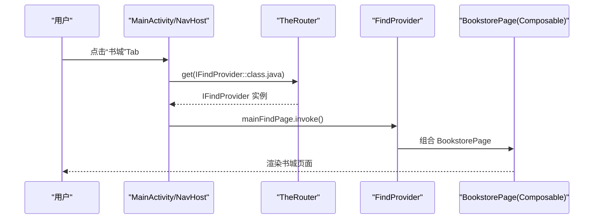
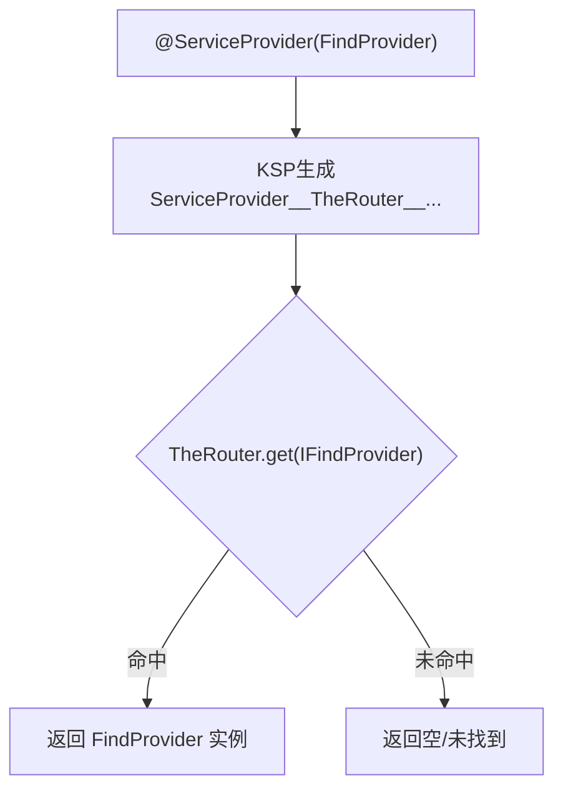
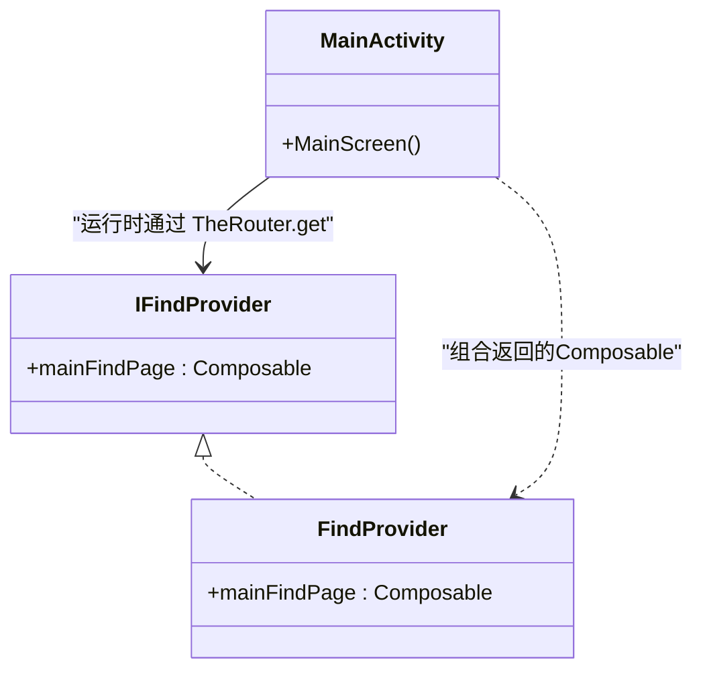
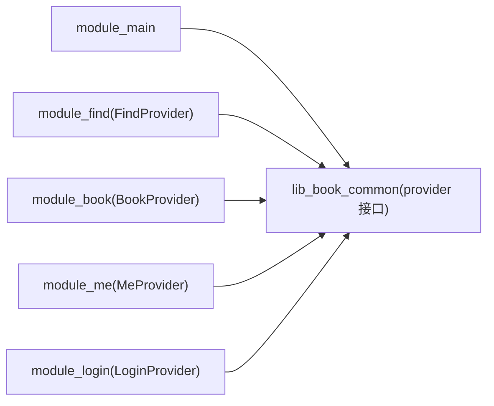

# Provider集成

<cite>
**本文引用的文件**
- [IFindProvider.kt](file://lib_book_common/src/main/java/com/ebook/common/provider/IFindProvider.kt)
- [FindProvider.kt](file://module_find/src/main/java/com/ebook/find/provider/FindProvider.kt)
- [IBookProvider.kt](file://lib_book_common/src/main/java/com/ebook/common/provider/IBookProvider.kt)
- [IMeProvider.kt](file://lib_book_common/src/main/java/com/ebook/common/provider/IMeProvider.kt)
- [ILoginProvider.kt](file://lib_book_common/src/main/java/com/ebook/common/provider/ILoginProvider.kt)
- [BookProvider.kt](file://module_book/src/main/java/com/ebook/book/provider/BookProvider.kt)
- [MeProvider.kt](file://module_me/src/main/java/com/ebook/me/provider/MeProvider.kt)
- [LoginProvider.kt](file://module_login/src/main/java/com/ebook/login/provider/LoginProvider.kt)
- [MainActivity.kt](file://module_main/src/main/java/com/ebook/main/MainActivity.kt)
- [RouteArgs.kt](file://lib_book_common/src/main/java/com/ebook/common/event/RouteArgs.kt)
- [KeyCode.kt](file://lib_book_common/src/main/java/com/ebook/common/event/KeyCode.kt)
- [ServiceProvider__TheRouter__848588106.kt](file://module_find/build/generated/ksp/release/kotlin/a/ServiceProvider__TheRouter__848588106.kt)
- [ContentStoreModule.kt](file://lib_book_common/src/main/java/com/ebook/common/di/ContentStoreModule.kt)
</cite>

## 目录
1. [简介](#简介)
2. [项目结构](#项目结构)
3. [核心组件](#核心组件)
4. [架构总览](#架构总览)
5. [详细组件分析](#详细组件分析)
6. [依赖关系分析](#依赖关系分析)
7. [性能与行为特征](#性能与行为特征)
8. [故障排查](#故障排查)
9. [结论](#结论)
10. [附录：新增Provider步骤与最佳实践](#附录新增provider步骤与最佳实践)

## 简介
本文件聚焦“Provider集成的SPI机制”，深入解析 FindProvider 在 TheRouter SPI 体系中的实现原理，以及与 module_main 宿主、Compose 组合、Hilt 依赖注入的协作方式。重点包括：
- IFindProvider 接口的职责与跨模块解耦边界
- @ServiceProvider 注解如何驱动自动注册与运行时实例解析
- 宿主 NavHost 如何按路由组合各模块页面
- 路由路径与参数传递约定
- 冲突检测与解决策略
- 扩展指南与模块间通信最佳实践

## 项目结构
从架构上看，本项目通过 lib_book_common 暴露一组 Provider 接口（如 IFindProvider），在各业务模块中以具体 Provider 实现类通过 TheRouter 注解式 SPI 进行发布。宿主 module_main 作为导航容器，通过 TheRouter 在运行时查找并调用这些 Provider 返回的 Compose 页面，从而完成跨模块导航。

```mermaid
graph TB
    subgraph "宿主"
        MA["MainActivity<br/>NavHost/Tab路由"]
    end

    subgraph "共享能力(lib_book_common)"
        IFP["IFindProvider(接口)"]
        IBP["IBookProvider(接口)"]
        IMP["IMeProvider(接口)"]
        ILP["ILoginProvider(接口)"]
        KA["KeyCode(路径常量)"]
        RA["RouteArgs(跨模块传参键)"]
    end

    subgraph "功能模块"
        FP["FindProvider(书城)"]
        BP["BookProvider(书架)"]
        MP["MeProvider(我的)"]
        LP["LoginProvider(登录服务)"]
    end

    MA -->|@Route + Navigation| MA
    MA -->|TheRouter.get(IFindProvider)| FP
    MA -->|TheRouter.get(IBookProvider)| BP
    MA -->|TheRouter.get(IMeProvider)| MP

    FP --> IFP
    BP --> IBP
    MP --> IMP
    LP --> ILP

    MA -.-> KA
    MA -.-> RA
```

图表来源
- [MainActivity.kt:184-196](file://module_main/src/main/java/com/ebook/main/MainActivity.kt#L184-L196)
- [IFindProvider.kt:5-13](file://lib_book_common/src/main/java/com/ebook/common/provider/IFindProvider.kt#L5-L13)
- [FindProvider.kt:8-18](file://module_find/src/main/java/com/ebook/find/provider/FindProvider.kt#L8-L18)
- [KeyCode.kt:4-98](file://lib_book_common/src/main/java/com/ebook/common/event/KeyCode.kt#L4-L98)
- [RouteArgs.kt:1-33](file://lib_book_common/src/main/java/com/ebook/common/event/RouteArgs.kt#L1-L33)

章节来源
- [MainActivity.kt:45-115](file://module_main/src/main/java/com/ebook/main/MainActivity.kt#L45-L115)
- [IFindProvider.kt:5-13](file://lib_book_common/src/main/java/com/ebook/common/provider/IFindProvider.kt#L5-L13)
- [FindProvider.kt:8-18](file://module_find/src/main/java/com/ebook/find/provider/FindProvider.kt#L8-L18)

## 核心组件
- IFindProvider：位于共享模块，定义跨模块暴露的“页面级服务”，提供一个 Compose 入口，以便宿主以纯函数式组合页面，避免 Fragment 耦合。
- FindProvider：书城模块的实际实现，使用 @ServiceProvider 注解向 TheRouter 声明自身为 IFindProvider 的可解析服务；mainFindPage 直接返回 Composable 页面，由宿主 NavHost 直接组合。
- 其他 Provider：IBookProvider、IMeProvider、ILoginProvider 及对应实现类，遵循同样模式，用于跨模块暴露UI或能力。

章节来源
- [IFindProvider.kt:5-13](file://lib_book_common/src/main/java/com/ebook/common/provider/IFindProvider.kt#L5-L13)
- [FindProvider.kt:8-18](file://module_find/src/main/java/com/ebook/find/provider/FindProvider.kt#L8-L18)
- [IBookProvider.kt:5-13](file://lib_book_common/src/main/java/com/ebook/common/provider/IBookProvider.kt#L5-L13)
- [IMeProvider.kt:5-13](file://lib_book_common/src/main/java/com/ebook/common/provider/IMeProvider.kt#L5-L13)
- [ILoginProvider.kt:3-19](file://lib_book_common/src/main/java/com/ebook/common/provider/ILoginProvider.kt#L3-L19)
- [BookProvider.kt:8-14](file://module_book/src/main/java/com/ebook/book/provider/BookProvider.kt#L8-L14)
- [MeProvider.kt:9-19](file://module_me/src/main/java/com/ebook/me/provider/MeProvider.kt#L9-L19)
- [LoginProvider.kt:11-34](file://module_login/src/main/java/com/ebook/login/provider/LoginProvider.kt#L11-L34)

## 架构总览
整体流程是：宿主 module_main 定义底部 Tab 和路由，按需通过 TheRouter 查找对应的 Provider 并调用其 Composable 入口，从而实现“宿主只管路由与装配，业务模块提供可组合页面”的分层设计。同时，业务页面内部仍可使用 Hilt 进行依赖注入，二者分工清晰：TheRouter 负责“跨模块发现”，Hilt 负责“单模块内构造依赖”。



图表来源
- [MainActivity.kt:184-196](file://module_main/src/main/java/com/ebook/main/MainActivity.kt#L184-L196)
- [FindProvider.kt:8-18](file://module_find/src/main/java/com/ebook/find/provider/FindProvider.kt#L8-L18)
- [ServiceProvider__TheRouter__848588106.kt:16-25](file://module_find/build/generated/ksp/release/kotlin/a/ServiceProvider__TheRouter__848588106.kt#L16-L25)

章节来源
- [MainActivity.kt:184-196](file://module_main/src/main/java/com/ebook/main/MainActivity.kt#L184-L196)
- [FindProvider.kt:8-18](file://module_find/src/main/java/com/ebook/find/provider/FindProvider.kt#L8-L18)
- [ServiceProvider__TheRouter__848588106.kt:16-25](file://module_find/build/generated/ksp/release/kotlin/a/ServiceProvider__TheRouter__848588106.kt#L16-L25)

## 详细组件分析

### IFindProvider 的作用与语义
- 作用：作为跨模块契约，将“书城主页面”抽象为一个可组合的函数，使宿主无需感知书城的具体实现细节。
- 语义：仅暴露页面级能力；页面内部 ViewModel 的生命周期与数据绑定遵循 Compose 与 Hilt 默认规则（与宿主 NavBackStackEntry 绑定的作用域）。

章节来源
- [IFindProvider.kt:5-13](file://lib_book_common/src/main/java/com/ebook/common/provider/IFindProvider.kt#L5-L13)

### @ServiceProvider 注解机制
- 注解标注在具体 Provider 实现类上（例如 FindProvider），由 TheRouter 的 KSP 处理期生成拦截器代码，将接口到实现的映射注册到运行时。
- 运行时调用 TheRouter.get(IFindProvider::class.java) 时，生成的拦截器会按接口类型匹配并返回对应实现实例。
- 生成的拦截器仅做接口到实现的桥接，不承载业务逻辑。



图表来源
- [FindProvider.kt:14-18](file://module_find/src/main/java/com/ebook/find/provider/FindProvider.kt#L14-L18)
- [ServiceProvider__TheRouter__848588106.kt:16-25](file://module_find/build/generated/ksp/release/kotlin/a/ServiceProvider__TheRouter__848588106.kt#L16-L25)

章节来源
- [FindProvider.kt:8-18](file://module_find/src/main/java/com/ebook/find/provider/FindProvider.kt#L8-L18)
- [ServiceProvider__TheRouter__848588106.kt:16-25](file://module_find/build/generated/ksp/release/kotlin/a/ServiceProvider__TheRouter__848588106.kt#L16-L25)

### 跨模块导航的实现原理
- 路径声明：使用 @Route(path = KeyCode.Main.MAIN_PATH) 等路径注解声明 Activity（如 MainActivity）的访问路由，配合 TheRouter 进行启动。
- 页面组合：NavHost 中各 composable(route){ } 回调通过 TheRouter.get 获取 Provider，再调用其 Composable 入口函数，从而把不同模块的页面无缝拼入同一导航树。
- 优势：宿主只维护路由与装配，业务模块以接口形式暴露能力，实现高内聚低耦合。

章节来源
- [MainActivity.kt:57-115](file://module_main/src/main/java/com/ebook/main/MainActivity.kt#L57-L115)
- [MainActivity.kt:184-196](file://module_main/src/main/java/com/ebook/main/MainActivity.kt#L184-L196)
- [KeyCode.kt:6-98](file://lib_book_common/src/main/java/com/ebook/common/event/KeyCode.kt#L6-L98)

### Compose 页面的组合方式
- Provider 返回类型为 @Composable () -> Unit，宿主直接 invoke，避免了 View/Fragment 容器的复杂性。
- 每个 Tab 页都通过独立 NavBackStackEntry 管理状态，切换后回到原 Tab 保留状态。
- Hilt 注入作用域由 Compose 的 hiltViewModel 默认行为决定（基于当前 back stack entry）。

章节来源
- [MainActivity.kt:184-196](file://module_main/src/main/java/com/ebook/main/MainActivity.kt#L184-L196)
- [FindProvider.kt:14-18](file://module_find/src/main/java/com/ebook/find/provider/FindProvider.kt#L14-L18)

### 与 Hilt 依赖注入的协作
- Provider 本身由 TheRouter 创建并持有，不在 Hilt 图中；但 Provider 所返回的页面内的视图模型、仓储等仍可由 Hilt 注入，两者分工明确：TheRouter 负责跨模块定位，Hilt 负责模块内资源构造。
- 对于非UI的能力型 Provider（如登录），可通过 EntryPointAccessors 从应用上下文桥接到 Hilt 图，示例见 LoginProvider 对 UserRepository 的获取。



图表来源
- [IFindProvider.kt:5-13](file://lib_book_common/src/main/java/com/ebook/common/provider/IFindProvider.kt#L5-L13)
- [FindProvider.kt:14-18](file://module_find/src/main/java/com/ebook/find/provider/FindProvider.kt#L14-L18)
- [MainActivity.kt:184-196](file://module_main/src/main/java/com/ebook/main/MainActivity.kt#L184-L196)

章节来源
- [LoginProvider.kt:21-34](file://module_login/src/main/java/com/ebook/login/provider/LoginProvider.kt#L21-L34)

## 依赖关系分析
- 依赖方向：module_main → lib_book_common（Provider 接口）
- 模块内部：各 provider 模块仅依赖 lib_book_common 暴露的接口，互不直接依赖对方。
- 运行时：TheRouter 通过 KSP 生成的拦截器将接口映射到具体实现，保证运行时的可插拔。



图表来源
- [IFindProvider.kt:5-13](file://lib_book_common/src/main/java/com/ebook/common/provider/IFindProvider.kt#L5-L13)
- [FindProvider.kt:8-18](file://module_find/src/main/java/com/ebook/find/provider/FindProvider.kt#L8-L18)
- [BookProvider.kt:8-14](file://module_book/src/main/java/com/ebook/book/provider/BookProvider.kt#L8-L14)
- [MeProvider.kt:9-19](file://module_me/src/main/java/com/ebook/me/provider/MeProvider.kt#L9-L19)
- [LoginProvider.kt:11-34](file://module_login/src/main/java/com/ebook/login/provider/LoginProvider.kt#L11-L34)

章节来源
- [MainActivity.kt:184-196](file://module_main/src/main/java/com/ebook/main/MainActivity.kt#L184-L196)

## 性能与行为特征
- Provider 在运行时以接口解析，无全局字典扫描开销；实际对象由生成代码直返实现类。
- Compose 组合函数仅在需要渲染时执行，切换 Tab 会重建或重用对应 BackStackEntry 状态，降低不必要重建成本。
- Hilt 注入集中在页面内部（hiltViewModel），生命周期与导航栈一致，便于内存回收。

[本节为一般性说明，不直接分析特定文件]

## 故障排查
- 跳转失效/页面未显示：
  - 确认被跳目标 Activity 已通过 @Route 声明正确的 path（如主界面路径在主模块），确保 TheRouter 能识别。
  - 在宿主侧打印 the route 与 navController 状态，核对 composable(route) 分支是否匹配。
- Provider 为空：
  - 确认实现类正确添加了 @ServiceProvider 注解。
  - 重新构建触发 KSP 生成，否则生成代码缺失会导致运行时解析不到实现。
- 跨模块传参丢失：
  - 检查跨模块 Bundle key 是否统一到 RouteArgs 中定义的常量，避免手写字符串导致不一致。

章节来源
- [RouteArgs.kt:10-33](file://lib_book_common/src/main/java/com/ebook/common/event/RouteArgs.kt#L10-L33)
- [MainActivity.kt:184-196](file://module_main/src/main/java/com/ebook/main/MainActivity.kt#L184-L196)
- [FindProvider.kt:14-18](file://module_find/src/main/java/com/ebook/find/provider/FindProvider.kt#L14-L18)

## 结论
该项目通过 Provider 接口 + TheRouter SPI 实现了稳定的跨模块能力暴露与按需组合。宿主专注路由与装配，业务模块专注于各自页面与领域逻辑；页面内部的 Hilt 注入与导航栈联动，兼顾模块化与工程化效率。该方案清晰区分了“发现/组装”和“构造/业务”的职责边界，利于扩展与维护。

[本节为总结性内容，不直接分析特定文件]

## 附录：新增Provider步骤与最佳实践

- 新增步骤
  1. 在 lib_book_common 中新增接口（若已有则复用），如 IXXXProvider，暴露一个或多个 Composable 入口。
  2. 在对应业务模块实现该接口类，使用 @ServiceProvider 注解注册。
  3. 在宿主 module_main 的 NavHost 中添加对应 composable(route){ } 分支，并通过 TheRouter.get(IXXXProvider::class.java)?.invoke() 组合页面。
  4. 如需 Activity 路由，使用 @Route(path = ...) 标注并配置路径常量（建议在 KeyCode 中统一声明）。
  5. 跨模块传参键建议统一写进 RouteArgs，避免字符串硬编码。

- 路由路径配置方法
  - 使用 KeyCode.*.*_PATH 集中声明路径常量。
  - Activity 通过 @Route(path=...) 声明可被 TheRouter 发现的跳转目标。

- 参数传递机制
  - 跨模块通过 TheRouter.with(...).with(...).navigation(...) 传参时，key 必须使用 RouteArgs 中统一的常量，避免编译期不可察觉的键名差异。

- 模块解耦的优势
  - 宿主不依赖任何业务模块的具体实现，仅依赖 lib_book_common 的接口。
  - 业务模块间互不引用，减少循环依赖风险。

- 与 Hilt 的协作要点
  - Provider 由 TheRouter 管理生命周期；页面内部依赖使用 Hilt（如 hiltViewModel）以获得与 NavBackStackEntry 绑定的生命周期。
  - 能力型 Provider 可通过 EntryPointAccessors 桥接到 Hilt，示例参考 LoginProvider。

- 新增 Provider 的步骤清单
  1. 定义接口（或复用现有接口）
  2. 实现类加 @ServiceProvider
  3. 宿主添加路由映射与组合逻辑
  4. 若需 Activity 跳转，添加 @Route 与路径常量
  5. 跨模块传参使用 RouteArgs
  6. 构建并验证：重新生成 TheRouter 路由表后再安装调试包

- 路由冲突解决方案
  - 路径命名空间化：按模块划分前缀（如 /ebook/find/*、/ebook/me/*）。
  - 避免重复：在开发规范中约定所有路径在 KeyCode 下集中管理与审计。
  - 冲突定位：当多模块声明同名 path，优先通过搜索路径关键字快速定位，修改后重新生成路由表。

- 模块间通信最佳实践
  - 优先通过 Provider 接口暴露“最小必要能力”，避免跨模块直接调用具体类。
  - UI 组合走 Provider + Compose；非 UI 能力通过能力型 Provider 暴露 suspend/coroutine 能力。
  - 会话与鉴权统一走 SessionEventBus 与 UserSessionManager，避免零散清理。

章节来源
- [KeyCode.kt:6-98](file://lib_book_common/src/main/java/com/ebook/common/event/KeyCode.kt#L6-L98)
- [RouteArgs.kt:10-33](file://lib_book_common/src/main/java/com/ebook/common/event/RouteArgs.kt#L10-L33)
- [MainActivity.kt:184-196](file://module_main/src/main/java/com/ebook/main/MainActivity.kt#L184-L196)
- [FindProvider.kt:14-18](file://module_find/src/main/java/com/ebook/find/provider/FindProvider.kt#L14-L18)
- [LoginProvider.kt:21-34](file://module_login/src/main/java/com/ebook/login/provider/LoginProvider.kt#L21-L34)
- [ContentStoreModule.kt:21-87](file://lib_book_common/src/main/java/com/ebook/common/di/ContentStoreModule.kt#L21-L87)