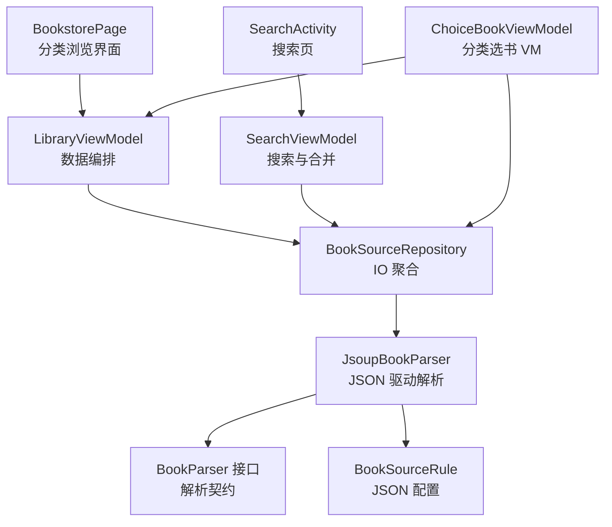
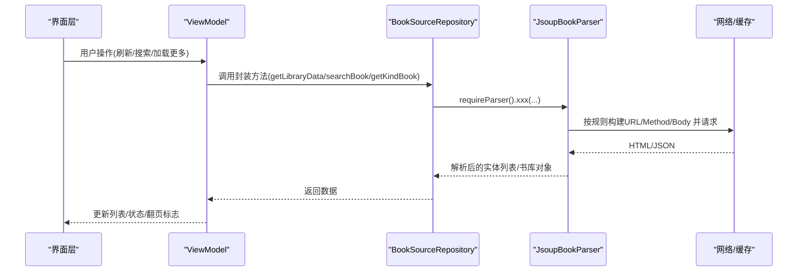
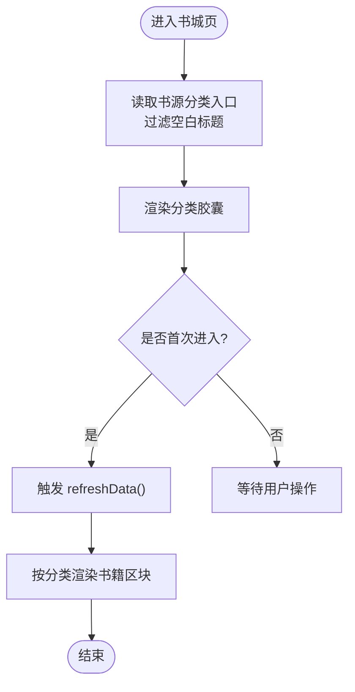
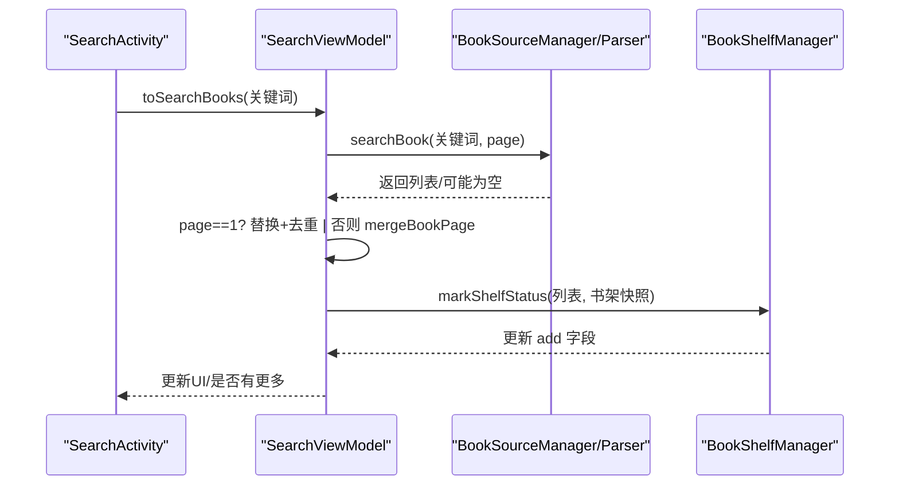
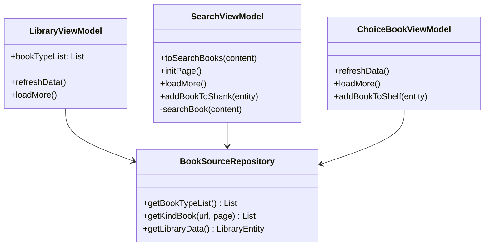
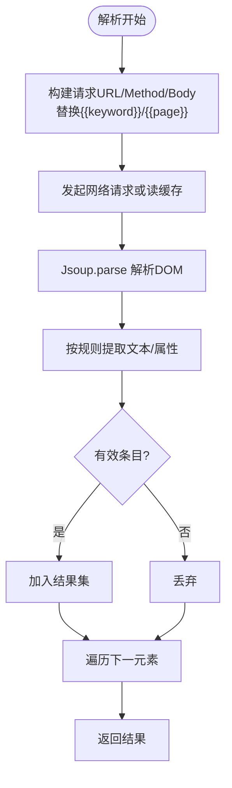
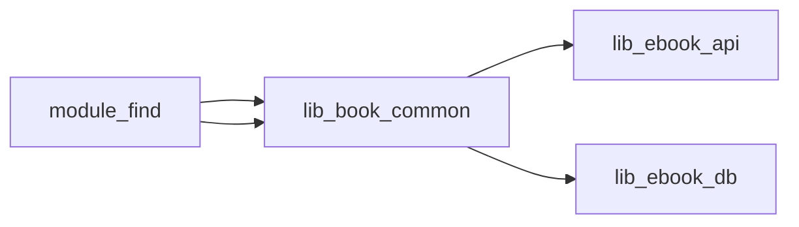

# 书城模块 (module_find)

<cite>
**本文引用的文件**
- [BookstorePage.kt](file://module_find/src/main/java/com/ebook/find/page/BookstorePage.kt)
- [SearchActivity.kt](file://module_find/src/main/java/com/ebook/find/SearchActivity.kt)
- [BookSourceRepository.kt](file://module_find/src/main/java/com/ebook/find/repository/BookSourceRepository.kt)
- [LibraryViewModel.kt](file://module_find/src/main/java/com/ebook/find/mvvm/viewmodel/LibraryViewModel.kt)
- [SearchViewModel.kt](file://module_find/src/main/java/com/ebook/find/mvvm/viewmodel/SearchViewModel.kt)
- [ChoiceBookViewModel.kt](file://module_find/src/main/java/com/ebook/find/mvvm/viewmodel/ChoiceBookViewModel.kt)
- [BookType.kt](file://module_find/src/main/java/com/ebook/find/entity/BookType.kt)
- [JsoupBookParser.kt](file://lib_book_common/src/main/java/com/ebook/common/analyze/source/JsoupBookParser.kt)
- [BookParser.kt](file://lib_book_common/src/main/java/com/ebook/common/analyze/source/BookParser.kt)
- [BookSourceRule.kt](file://lib_ebook_api/src/main/java/com/ebook/api/entity/BookSourceRule.kt)
- [SearchBookItem.kt](file://module_find/src/main/java/com/ebook/find/view/SearchBookItem.kt)
- [BookPageMergeTest.kt](file://module_find/src/test/java/com/ebook/find/mvvm/viewmodel/BookPageMergeTest.kt)
- [AGENTS.md](file://AGENTS.md)
</cite>

## 目录
1. [简介](#简介)
2. [项目结构](#项目结构)
3. [核心组件](#核心组件)
4. [架构总览](#架构总览)
5. [关键组件详解](#关键组件详解)
6. [依赖关系分析](#依赖关系分析)
7. [性能与可用性](#性能与可用性)
8. [故障排查指南](#故障排查指南)
9. [书源扩展与自定义规则指南](#书源扩展与自定义规则指南)
10. [结论](#结论)

## 简介
本模块实现“书城浏览”和“搜索发现”两大能力：书城侧提供按分类浏览的分类入口、书库首页区块渲染；搜索侧提供关键词检索、历史记录面板、分页加载更多、搜索结果标记书架状态。底层通过 JSON 配置驱动的书源解析器完成网络抓取、HTML 解析、章节提取与缓存策略，配合 Repository 将数据交给 ViewModel 管理并通过 Compose UI 呈现。

## 项目结构
- 页面与交互
  - BookstorePage：书城主界面（Compose），分类胶囊流 + 书籍类型分组 + 搜索入口
  - SearchActivity：搜索页（Compose），历史面板揭示动画、输入框、结果列表、加载更多
  - SearchBookItem：搜索结果/选书列表条目
- 视图模型与数据流
  - LibraryViewModel：书城 Tab 的刷新、首屏加载逻辑
  - SearchViewModel：搜索关键词入参、分页搜索、搜索结果合并、书架事件同步
  - ChoiceBookViewModel：分类选书页（按 kind URL）分页加载与书架同步
- 仓库与解析
  - BookSourceRepository：分类入口、分类书籍、书库数据的 IO 聚合层
  - JsoupBookParser：JSON 驱动的书源解析器（搜索、详情、章节、分类、主页）
  - BookParser：解析器接口抽象
  - BookSourceRule：书源 JSON 配置的数据结构（URL/方法/选择器/分页等）

图表来源
- [BookstorePage.kt:72-193](file://module_find/src/main/java/com/ebook/find/page/BookstorePage.kt#L72-L193)
- [LibraryViewModel.kt:18-49](file://module_find/src/main/java/com/ebook/find/mvvm/viewmodel/LibraryViewModel.kt#L18-L49)
- [SearchActivity.kt:125-232](file://module_find/src/main/java/com/ebook/find/SearchActivity.kt#L125-L232)
- [SearchViewModel.kt:31-199](file://module_find/src/main/java/com/ebook/find/mvvm/viewmodel/SearchViewModel.kt#L31-L199)
- [ChoiceBookViewModel.kt:28-142](file://module_find/src/main/java/com/ebook/find/mvvm/viewmodel/ChoiceBookViewModel.kt#L28-L142)
- [BookSourceRepository.kt:22-51](file://module_find/src/main/java/com/ebook/find/repository/BookSourceRepository.kt#L22-L51)
- [JsoupBookParser.kt:29-192](file://lib_book_common/src/main/java/com/ebook/common/analyze/source/JsoupBookParser.kt#L29-L192)
- [BookParser.kt:9-20](file://lib_book_common/src/main/java/com/ebook/common/analyze/source/BookParser.kt#L9-L20)
- [BookSourceRule.kt:10-193](file://lib_ebook_api/src/main/java/com/ebook/api/entity/BookSourceRule.kt#L10-L193)

小节来源
- [BookstorePage.kt:72-193](file://module_find/src/main/java/com/ebook/find/page/BookstorePage.kt#L72-L193)
- [SearchActivity.kt:125-232](file://module_find/src/main/java/com/ebook/find/SearchActivity.kt#L125-L232)
- [LibraryViewModel.kt:18-49](file://module_find/src/main/java/com/ebook/find/mvvm/viewmodel/LibraryViewModel.kt#L18-L49)
- [SearchViewModel.kt:31-199](file://module_find/src/main/java/com/ebook/find/mvvm/viewmodel/SearchViewModel.kt#L31-L199)
- [BookSourceRepository.kt:22-51](file://module_find/src/main/java/com/ebook/find/repository/BookSourceRepository.kt#L22-L51)
- [JsoupBookParser.kt:29-192](file://lib_book_common/src/main/java/com/ebook/common/analyze/source/JsoupBookParser.kt#L29-L192)
- [BookParser.kt:9-20](file://lib_book_common/src/main/java/com/ebook/common/analyze/source/BookParser.kt#L9-L20)
- [BookSourceRule.kt:10-193](file://lib_ebook_api/src/main/java/com/ebook/api/entity/BookSourceRule.kt#L10-L193)

## 核心组件
- 书城页面（BookstorePage）
  - 以 Compose 组合函数构建，包含顶部标题栏、分类胶囊流、搜索胶囊、分类书籍区块
  - 使用 RefreshableList 承载列表刷新信号与下拉刷新/加载逻辑映射
  - 首次自动刷新：LaunchedEffect 触发 refreshData
  - 分类跳转：通过路由传 url/title 至分类选书页
- 搜索页（SearchActivity）
  - 继承通用刷新 Activity，启用加载更多，禁用下拉刷新
  - 历史面板由键盘显隐驱动，配合圆形揭示动画（兼容旧 View 行为）
  - 查询后自动收起键盘并发起搜索，空输入抖动提示
- 书城 ViewModel（LibraryViewModel）
  - 读取当前书源的分类入口（内存级，无 IO）
  - 刷新书库数据，异常时安全停止刷新并记录日志
- 搜索 ViewModel（SearchViewModel）
  - 维护当前搜索词、页码、书架快照
  - 分页搜索：page=1 替换列表并去重；page>1 调用 mergeBookPage 合并
  - 同步书架事件，更新列表项“已加书架”状态
- 分类选书 ViewModel（ChoiceBookViewModel）
  - 从 SavedStateHandle 取分类 URL，首屏自动刷新
  - 同搜索页的分页合并与更到底部判断
- 仓库层（BookSourceRepository）
  - 暴露 getBookTypeList/getKindBook/getLibraryData
  - 统一在 IO 线程调度并委托 BookSourceManager（内部含解析器）
- 解析器（JsoupBookParser）
  - 基于 JSON 规则（BookSourceRule）构造请求 URL/方法/Body，用 Jsoup 解析 HTML
  - 搜索：编码关键词、计算页码、请求并解析条目
  - 分类：根据 ruleFind.url/kinds 获取分类书籍
  - 主页：带 ACache 磁盘缓存读取与失效重抓
  - 书籍详情与目录：规则化提取信息、处理反向目录、相对 URL 拼装

小节来源
- [BookstorePage.kt:72-193](file://module_find/src/main/java/com/ebook/find/page/BookstorePage.kt#L72-L193)
- [SearchActivity.kt:125-232](file://module_find/src/main/java/com/ebook/find/SearchActivity.kt#L125-L232)
- [LibraryViewModel.kt:18-49](file://module_find/src/main/java/com/ebook/find/mvvm/viewmodel/LibraryViewModel.kt#L18-L49)
- [SearchViewModel.kt:31-199](file://module_find/src/main/java/com/ebook/find/mvvm/viewmodel/SearchViewModel.kt#L31-L199)
- [ChoiceBookViewModel.kt:28-142](file://module_find/src/main/java/com/ebook/find/mvvm/viewmodel/ChoiceBookViewModel.kt#L28-L142)
- [BookSourceRepository.kt:22-51](file://module_find/src/main/java/com/ebook/find/repository/BookSourceRepository.kt#L22-L51)
- [JsoupBookParser.kt:29-192](file://lib_book_common/src/main/java/com/ebook/common/analyze/source/JsoupBookParser.kt#L29-L192)

## 架构总览
书城/搜索遵循 MVVM + Repository 模式：
- View（Compose）：不直接访问网络或数据库，仅持有少量纯视图状态
- ViewModel：编排状态、发起异步任务、合并结果、同步书架事件
- Repository：负责 IO 切换、复用解析器的具体实现
- 解析器：以 JSON 为唯一可配点，适配不同站点

图表来源
- [LibraryViewModel.kt:25-44](file://module_find/src/main/java/com/ebook/find/mvvm/viewmodel/LibraryViewModel.kt#L25-L44)
- [SearchViewModel.kt:125-167](file://module_find/src/main/java/com/ebook/find/mvvm/viewmodel/SearchViewModel.kt#L125-L167)
- [BookSourceRepository.kt:42-50](file://module_find/src/main/java/com/ebook/find/repository/BookSourceRepository.kt#L42-L50)
- [JsoupBookParser.kt:38-69](file://lib_book_common/src/main/java/com/ebook/common/analyze/source/JsoupBookParser.kt#L38-L69)
- [JsoupBookParser.kt:170-192](file://lib_book_common/src/main/java/com/ebook/common/analyze/source/JsoupBookParser.kt#L170-L192)
- [JsoupBookParser.kt:196-232](file://lib_book_common/src/main/java/com/ebook/common/analyze/source/JsoupBookParser.kt#L196-L232)

## 关键组件详解

### 书城分类浏览界面（BookstorePage）
- 顶部工具栏：语义色容器背景
- 分类胶囊：流式布局展示“书籍类型”，点击跳转分类选书页并传递 url/title
- 搜索胶囊：点击进入搜索页
- 分类书籍区块：LazyColumn 逐项渲染每类书籍
- 刷新信号绑定：通过 MvvmBinder 将 ViewModel 的刷新通道映射到本地 isRefreshing

图表来源
- [BookstorePage.kt:72-113](file://module_find/src/main/java/com/ebook/find/page/BookstorePage.kt#L72-L113)
- [BookstorePage.kt:116-193](file://module_find/src/main/java/com/ebook/find/page/BookstorePage.kt#L116-L193)
- [LibraryViewModel.kt:18-44](file://module_find/src/main/java/com/ebook/find/mvvm/viewmodel/LibraryViewModel.kt#L18-L44)
- [BookSourceRepository.kt:30-40](file://module_find/src/main/java/com/ebook/find/repository/BookSourceRepository.kt#L30-L40)

小节来源
- [BookstorePage.kt:72-193](file://module_find/src/main/java/com/ebook/find/page/BookstorePage.kt#L72-L193)
- [BookType.kt:14-17](file://module_find/src/main/java/com/ebook/find/entity/BookType.kt#L14-L17)

### 搜索页与结果展示（SearchActivity + SearchViewModel）
- 输入与历史面板
  - 页面进入即加载全量历史、聚焦输入框、延迟显示软键盘
  - 软键盘弹出关闭“兜底强制开面板”标志；键盘收起且未搜索过则退出页面
  - 空输入抖动提示；有内容时隐藏键盘并发起搜索
- 搜索结果
  - page=1：直接替换列表并按 noteUrl 去重
  - page>1：通过 mergeBookPage 去重追加；若无新条目则置“没有更多”
  - 每次成功拉取后递增页码（空页不递增）
- 书架同步
  - 初始化加载书架快照，持续收集书架事件，实时更新列表项“已加书架”状态
  - “加入书架”失败时 toast 提示错误原因

图表来源
- [SearchActivity.kt:125-232](file://module_find/src/main/java/com/ebook/find/SearchActivity.kt#L125-L232)
- [SearchViewModel.kt:125-167](file://module_find/src/main/java/com/ebook/find/mvvm/viewmodel/SearchViewModel.kt#L125-L167)
- [JsoupBookParser.kt:38-69](file://lib_book_common/src/main/java/com/ebook/common/analyze/source/JsoupBookParser.kt#L38-L69)
- [BookPageMergeTest.kt:15-51](file://module_find/src/test/java/com/ebook/find/mvvm/viewmodel/BookPageMergeTest.kt#L15-L51)

小节来源
- [SearchActivity.kt:125-232](file://module_find/src/main/java/com/ebook/find/SearchActivity.kt#L125-L232)
- [SearchViewModel.kt:31-199](file://module_find/src/main/java/com/ebook/find/mvvm/viewmodel/SearchViewModel.kt#L31-L199)
- [SearchBookItem.kt:44-156](file://module_find/src/main/java/com/ebook/find/view/SearchBookItem.kt#L44-L156)

### 书源数据仓库（BookSourceRepository）
- 分类入口：从当前书源规则的 find.kinds 映射为 BookType 列表，过滤空白标题
- 分类书籍：按 kind URL + 页码请求，IO 线程执行
- 书库数据：委托解析器获取，并在解析器内完成 ACache 缓存与失效策略

小节来源
- [BookSourceRepository.kt:22-51](file://module_find/src/main/java/com/ebook/find/repository/BookSourceRepository.kt#L22-L51)

### 数据管理模式（LibraryViewModel / SearchViewModel / ChoiceBookViewModel）
- LibraryViewModel：仅封装书城 Tab 的首屏刷新与异常保护
- SearchViewModel：搜索流程控制、合并逻辑、分页管理、书架同步
- ChoiceBookViewModel：分类选书分页与书架同步（与搜索页类似但独立 URL）

图表来源
- [LibraryViewModel.kt:18-49](file://module_find/src/main/java/com/ebook/find/mvvm/viewmodel/LibraryViewModel.kt#L18-L49)
- [SearchViewModel.kt:31-199](file://module_find/src/main/java/com/ebook/find/mvvm/viewmodel/SearchViewModel.kt#L31-L199)
- [ChoiceBookViewModel.kt:28-142](file://module_find/src/main/java/com/ebook/find/mvvm/viewmodel/ChoiceBookViewModel.kt#L28-L142)
- [BookSourceRepository.kt:22-51](file://module_find/src/main/java/com/ebook/find/repository/BookSourceRepository.kt#L22-L51)

### JSON 规则解析与网页抓取
- BookSourceRule 定义了书源的 URL/方法/请求体模板、搜索与发现规则、目录与正文规则等
- JsoupBookParser 根据规则构造请求（编码关键词、替换占位符、页码换算）、发送请求并解析
- 搜索结果/分类条目均走统一解析流程：选择列表、解析字段、过滤无效项
- 目录与详情解析支持反转顺序、相对 URL 补全等

图表来源
- [BookSourceRule.kt:10-193](file://lib_ebook_api/src/main/java/com/ebook/api/entity/BookSourceRule.kt#L10-L193)
- [JsoupBookParser.kt:38-69](file://lib_book_common/src/main/java/com/ebook/common/analyze/source/JsoupBookParser.kt#L38-L69)
- [JsoupBookParser.kt:76-95](file://lib_book_common/src/main/java/com/ebook/common/analyze/source/JsoupBookParser.kt#L76-L95)
- [JsoupBookParser.kt:170-192](file://lib_book_common/src/main/java/com/ebook/common/analyze/source/JsoupBookParser.kt#L170-L192)
- [JsoupBookParser.kt:99-166](file://lib_book_common/src/main/java/com/ebook/common/analyze/source/JsoupBookParser.kt#L99-L166)

### 章节列表提取与正文读取（概览）
- 章节列表：依据 TocRule.list/name/url 提取，支持 reverse 反转顺序及重新编号
- 详情获取：优先使用 chapterUrl（目录页），否则回退到详情页
- 本章不在本模块源码中实现分页推进细节，但整体流程由解析器统一管理，遵循统一接口契约

小节来源
- [JsoupBookParser.kt:99-166](file://lib_book_common/src/main/java/com/ebook/common/analyze/source/JsoupBookParser.kt#L99-L166)
- [BookParser.kt:9-20](file://lib_book_common/src/main/java/com/ebook/common/analyze/source/BookParser.kt#L9-L20)

## 依赖关系分析
- module_find 依赖 lib_book_common（BookParser/JsoupBookParser、BookShelfManager、基础 UI 组件、BaseRefreshViewModel）
- 解析器依赖 lib_ebook_api（BookSourceRule、网络客户端封装）
- 通过 Hilt 注入各层级依赖，避免硬耦合

[本图为概念性依赖示意，不映射具体代码行]

小节来源
- [AGENTS.md:1-150](file://AGENTS.md#L1-L150)

## 性能与可用性
- 缓存策略
  - 书库数据缓存（ACache）在解析器内部处理，减少重复下载
- 列表页去重与“到底”判定
  - 首屏按 noteUrl 去重，避免 LazyColumn key 冲突
  - 后续页通过 mergeBookPage 去重追加；整页重复或空页视为“没有更多”
- 分页与空页防护
  - 仅在返回非空结果时递增页码，防止越界无限请求
- UI 流畅性
  - 历史面板与软键盘联动，减少不必要的重组与闪烁
  - 使用共享组件与语义色保持视觉一致性和可读性

小节来源
- [BookPageMergeTest.kt:15-51](file://module_find/src/test/java/com/ebook/find/mvvm/viewmodel/BookPageMergeTest.kt#L15-L51)
- [SearchViewModel.kt:142-167](file://module_find/src/main/java/com/ebook/find/mvvm/viewmodel/SearchViewModel.kt#L142-L167)
- [ChoiceBookViewModel.kt:84-109](file://module_find/src/main/java/com/ebook/find/mvvm/viewmodel/ChoiceBookViewModel.kt#L84-L109)
- [JsoupBookParser.kt:196-232](file://lib_book_common/src/main/java/com/ebook/common/analyze/source/JsoupBookParser.kt#L196-L232)

## 故障排查指南
- 搜索结果为空或一直加载
  - 检查 BookSourceRule.searchUrl/searchBody 是否包含占位符 {{keyword}}
  - 校验 PageRule.searchPage 是否包含 /{{page}}；缺失将导致每页都请求首页
  - 查看日志定位网络错误或 JSoup 选择器不匹配
- 加载更多始终不触发“没有更多”
  - 确认 mergeBookPage 正常工作：如果返回空表示无新条目
  - 验证后端是否返回重复首页内容（软 404），此时需依靠去重判末
- 书架状态不同步
  - 确认 BookRepository.bookShelfEvents 订阅正常
  - 检查 BookShelfManager 是否正确回调 Added/Removed，并触发 updateBookAddState
- 分类入口空白或无法加载
  - Rule.find.kinds 是否为空或 title 空白；Repository 已过滤空白标题
  - 校验 find.url 模板包含 {{kind}} 与 {{page}}
- 网络/字符集问题
  - URLEncoder 失败会降级为原始字符串；若乱码检查 charset
  - 请求头是否需要 userAgent 等；可在 BookSourceRule.headers 中设置

小节来源
- [SearchViewModel.kt:125-167](file://module_find/src/main/java/com/ebook/find/mvvm/viewmodel/SearchViewModel.kt#L125-L167)
- [ChoiceBookViewModel.kt:84-109](file://module_find/src/main/java/com/ebook/find/mvvm/viewmodel/ChoiceBookViewModel.kt#L84-L109)
- [BookSourceRepository.kt:30-40](file://module_find/src/main/java/com/ebook/find/repository/BookSourceRepository.kt#L30-L40)
- [JsoupBookParser.kt:38-69](file://lib_book_common/src/main/java/com/ebook/common/analyze/source/JsoupBookParser.kt#L38-L69)
- [AGENTS.md:150-350](file://AGENTS.md#L150-L350)

## 书源扩展与自定义规则指南
- 新增/编辑书源
  - 使用 BookSourceRule 定义：
    - 基础信息：name/url/charset/method/headers/body
    - 搜索：searchUrl（必须包含 {{keyword}}）、searchMethod/searchBody、searchPage、ruleSearch
    - 发现/分类：ruleFind.url（必须包含 {{kind}} 与 {{page}}）、kinds、ruleSearch
    - 目录/正文：ruleToc 与 ruleContent（按需配置）
  - 选择器使用标准 CSS 选择器语法（list/name/url/intro 等）
- 注意事项
  - {{page}} 必须以 /{{page}} 结尾才会被 ListPageUrl 正确处理首页与分页
  - ruleFind.kinds 中的条目若 title 为空会被过滤，不会显示为空白胶囊
  - POST 搜索需在 searchBody 中使用 {{keyword}} 与 {{page}}
- 调试建议
  - 开启日志输出，打印真实 URL/Method/Body
  - 先在浏览器中验证 URL/Body 能否拿到正确 HTML
  - 逐步缩小选择器范围定位 list/name/url/intro

小节来源
- [BookSourceRule.kt:10-193](file://lib_ebook_api/src/main/java/com/ebook/api/entity/BookSourceRule.kt#L10-L193)
- [JsoupBookParser.kt:38-69](file://lib_book_common/src/main/java/com/ebook/common/analyze/source/JsoupBookParser.kt#L38-L69)
- [BookstorePage.kt:148-167](file://module_find/src/main/java/com/ebook/find/page/BookstorePage.kt#L148-L167)
- [BookType.kt:14-17](file://module_find/src/main/java/com/ebook/find/entity/BookType.kt#L14-L17)

## 结论
本模块以 JSON 驱动的书源解析为核心，结合稳定的 MVVM 分层与统一的解析接口，实现了“书城浏览”与“搜索发现”两条主线能力。搜索与分类均采用一致的分页与去重策略，保障弱网与软 404 场景下的稳健性；解析器集中负责网络与 DOM 处理，降低上层复杂度。通过合理的缓存、事件同步与 UI 动画，保证了良好的可用性与体验。后续在扩展书源时，遵循上述规则与注意点即可快速适配新站点。