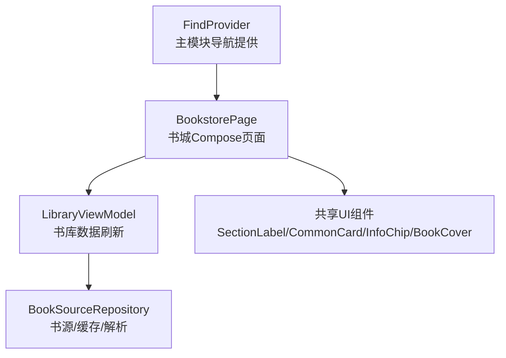
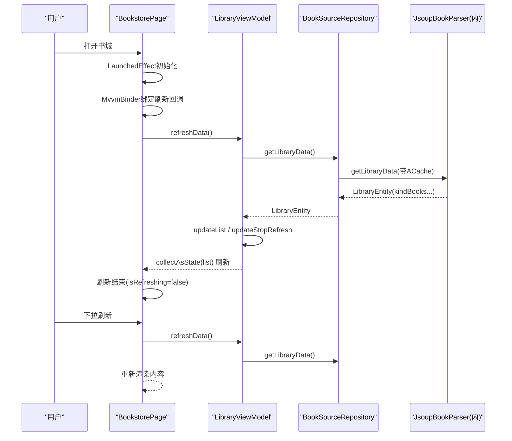
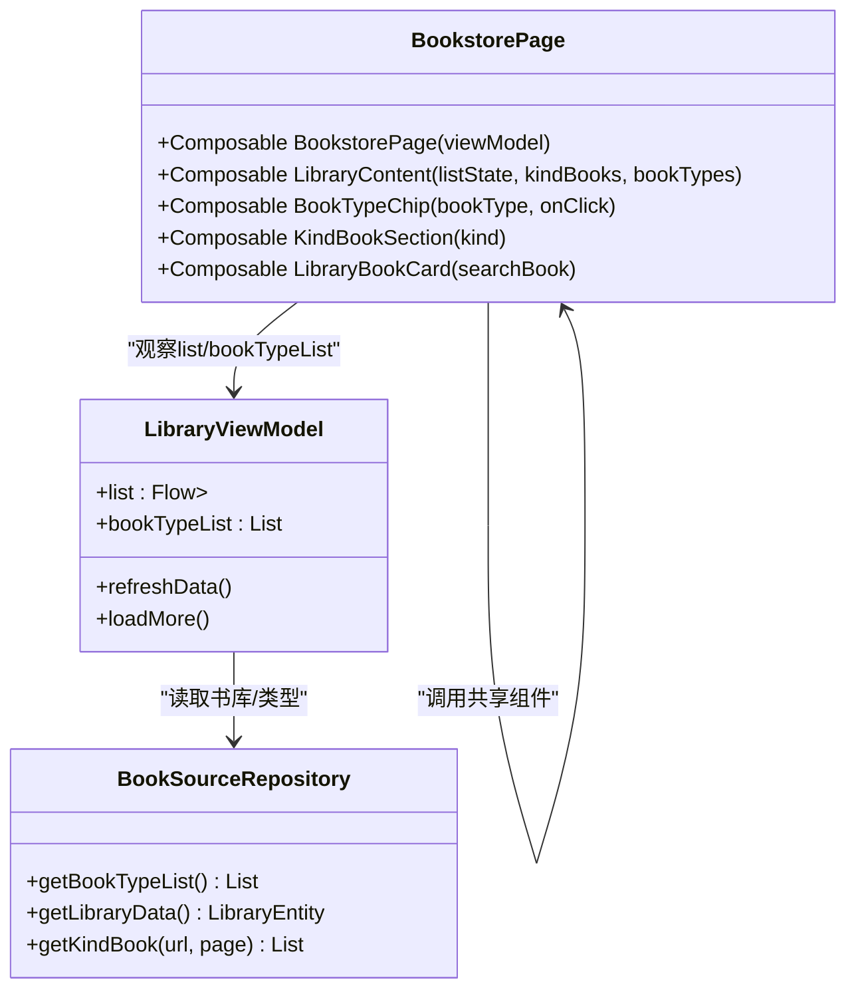

# 书城浏览界面

<cite>
**本文引用的文件**
- [BookstorePage.kt](file://module_find/src/main/java/com/ebook/find/page/BookstorePage.kt)
- [LibraryViewModel.kt](file://module_find/src/main/java/com/ebook/find/mvvm/viewmodel/LibraryViewModel.kt)
- [FindProvider.kt](file://module_find/src/main/java/com/ebook/find/provider/FindProvider.kt)
- [BookSourceRepository.kt](file://module_find/src/main/java/com/ebook/find/repository/BookSourceRepository.kt)
- [BookType.kt](file://module_find/src/main/java/com/ebook/find/entity/BookType.kt)
- [SearchBookEntity.kt](file://lib_ebook_db/src/main/java/com/ebook/db/entity/SearchBookEntity.kt)
- [LibraryKindBookListEntity.kt](file://lib_ebook_db/src/main/java/com/ebook/db/entity/LibraryKindBookListEntity.kt)
- [CommonUiComponents.kt](file://lib_book_common/src/main/java/com/ebook/common/ui/CommonUiComponents.kt)
- [AGENTS.md](file://AGENTS.md)
</cite>

## 目录
1. [简介](#简介)
2. [项目结构](#项目结构)
3. [核心组件](#核心组件)
4. [架构总览](#架构总览)
5. [组件详解](#组件详解)
6. [依赖关系分析](#依赖关系分析)
7. [性能与加载策略](#性能与加载策略)
8. [问题排查指南](#问题排查指南)
9. [结论](#结论)
10. [附录](#附录)

## 简介
本页面为书城浏览界面，使用 Jetpack Compose 重写并统一 Material3 视觉语言。整体采用“分类标题 + 书类型胶囊（流式排布）+ 搜索入口 + 分类书籍区块”的布局方式。数据层面通过 ViewModel 管理刷新信号与书库列表，UI 状态由 Compose State 驱动，实现下拉刷新与自动首次加载。

## 项目结构
- 页面入口：`FindProvider` 暴露 Composable 给宿主 NavHost 组合。
- 页面实现：`BookstorePage`（包含 `LibraryContent`、`BookTypeChip`、`KindBookSection`、`LibraryBookCard`）。
- 视图模型：`LibraryViewModel` 负责书库数据刷新与加载控制。
- 仓库层：`BookSourceRepository` 封装书源规则解析、缓存读取、分页查询。
- UI 共享组件：来自 `lib_book_common` 的 `CommonCard`、`SectionLabel`、`InfoChip`、`BookCover` 等，统一设计令牌与语义色。

图表来源
- [FindProvider.kt:14-19](file://module_find/src/main/java/com/ebook/find/provider/FindProvider.kt#L14-L19)
- [BookstorePage.kt:70-114](file://module_find/src/main/java/com/ebook/find/page/BookstorePage.kt#L70-L114)
- [LibraryViewModel.kt:18-49](file://module_find/src/main/java/com/ebook/find/mvvm/viewmodel/LibraryViewModel.kt#L18-L49)
- [BookSourceRepository.kt:21-51](file://module_find/src/main/java/com/ebook/find/repository/BookSourceRepository.kt#L21-L51)

小节来源
- [BookstorePage.kt:70-114](file://module_find/src/main/java/com/ebook/find/page/BookstorePage.kt#L70-L114)
- [FindProvider.kt:14-19](file://module_find/src/main/java/com/ebook/find/provider/FindProvider.kt#L14-L19)

## 核心组件
- BookstorePage：顶层页面，完成工具栏渲染、下拉刷新容器绑定、数据收集与初始刷新触发。
- LibraryContent：构建书城内容区，包含分类标题、书类型胶囊区、搜索条目区、分类书籍区块列表。
- LibraryViewModel：继承 BaseRefreshViewModel，管理书库数据的加载、刷新和停止刷新逻辑。
- BookSourceRepository：读取当前书源规则生成分类入口；调用解析器获取书库数据（含缓存失效重抓）。
- 共享UI组件：统一卡片、标签、分组标题、封面渲染，确保全书一致性与Material语义配色。

小节来源
- [BookstorePage.kt:70-114](file://module_find/src/main/java/com/ebook/find/page/BookstorePage.kt#L70-L114)
- [BookstorePage.kt:123-194](file://module_find/src/main/java/com/ebook/find/page/BookstorePage.kt#L123-L194)
- [LibraryViewModel.kt:18-49](file://module_find/src/main/java/com/ebook/find/mvvm/viewmodel/LibraryViewModel.kt#L18-L49)
- [BookSourceRepository.kt:30-50](file://module_find/src/main/java/com/ebook/find/repository/BookSourceRepository.kt#L30-L50)
- [CommonUiComponents.kt:85-98](file://lib_book_common/src/main/java/com/ebook/common/ui/CommonUiComponents.kt#L85-L98)
- [CommonUiComponents.kt:239-278](file://lib_book_common/src/main/java/com/ebook/common/ui/CommonUiComponents.kt#L239-L278)

## 架构总览
书城页遵循 MVVM + Compose 响应式架构：
- View层：BookstorePage/LibrayContent 负责呈现与交互（点击跳转、下拉刷新）。
- ViewModel层：LibraryViewModel 持有业务状态，暴露 list Flow 和 refresh/loadMore 接口。
- Repository层：BookSourceRepository 封装书源规则访问、解析器调用及缓存策略。
- 数据流向：页面订阅 VM.list → VM 拉取数据 → Repository 读取/解析 → 更新list → 页面重组渲染。

图表来源
- [BookstorePage.kt:70-114](file://module_find/src/main/java/com/ebook/find/page/BookstorePage.kt#L70-L114)
- [LibraryViewModel.kt:25-44](file://module_find/src/main/java/com/ebook/find/mvvm/viewmodel/LibraryViewModel.kt#L25-L44)
- [BookSourceRepository.kt:47-50](file://module_find/src/main/java/com/ebook/find/repository/BookSourceRepository.kt#L47-L50)

## 组件详解

### 书城页面 BookstorePage
- 刷新容器：使用 RefreshableList 作为下拉刷新容器，设置 onRefresh、onLoadMore 与 enableLoadMore=false（书城不加载更多）。
- 刷新信号：通过 MvvmBinder.bindRefresh 将 VM 的刷新通道映射到本地 isRefreshing 状态，避免手动维护 Channel 生命周期。
- 初始刷新：LaunchedEffect(Unit) 中立即进入刷新态并触发 viewModel.refreshData()，对齐旧 Fragment 行为。
- 顶部栏：TopAppBar 使用 colorSurface 作为背景，标题文本取自资源。

小节来源
- [BookstorePage.kt:70-114](file://module_find/src/main/java/com/ebook/find/page/BookstorePage.kt#L70-L114)

### 分类内容 LibraryContent
- 外层 LazyColumn：定义 pagePadding 与 sectionSpacing，统一间距规范。
- 分类标题：SectionLabel 输出“书籍类型”分组标题。
- 书类型胶囊区：CommonCard 包裹 FlowRow，按水平+垂直 spacing 排列各分类胶囊。每个 BookTypeChip 点击后通过 TheRouter 携带 url/title 跳转到选分类书页（ChoiceBookActivity）。
- 搜索胶囊：以 surfaceVariant 底色与 50dp 圆角矩形展示搜索提示文本，点击跳转到搜索页。
- 分类书籍区块：items(kindBooks) 渲染 KindBookSection。

小节来源
- [BookstorePage.kt:123-194](file://module_find/src/main/java/com/ebook/find/page/BookstorePage.kt#L123-L194)

### 书类型胶囊 BookTypeChip
- 复用 InfoChip，配置 50dp 胶囊圆角、primaryContainer 主题色、labelLarge 字体，提供点击回调。
- 数据源为 BookType 列表，内部字段 bookType 为显示文案，url 用于分类列表页导航。

小节来源
- [BookstorePage.kt:196-214](file://module_find/src/main/java/com/ebook/find/page/BookstorePage.kt#L196-L214)
- [BookType.kt:1-17](file://module_find/src/main/java/com/ebook/find/entity/BookType.kt#L1-L17)

### 分类书籍区块 KindBookSection
- 头部行：显示分类名 kindName，右侧“更多”按钮链接至该分类列表页（若 kindUrl 非空）。
- 横向列表：LazyRow 展示该分类下的书籍卡片，item key 使用 noteUrl。
- 样式：标题 style titleSmall/SemiBold，“更多”使用 primary 文本色。

小节来源
- [BookstorePage.kt:216-262](file://module_find/src/main/java/com/ebook/find/page/BookstorePage.kt#L216-L262)

### 书籍卡片 LibraryBookCard
- 外框 Card：高度固定、圆角 coverCorner，浅阴影。
- 封面：共享 BookCover 全屏填充。
- 信息区：书名加粗一行省略，作者小字灰色省略；点击整卡跳转详情页并标记 from=FROM_SEARCH。

小节来源
- [BookstorePage.kt:264-313](file://module_find/src/main/java/com/ebook/find/page/BookstorePage.kt#L264-L313)

### 数据模型
- BookType：书城“书籍类型”胶囊数据源（title/url），由当前书源规则 kinds 映射而来。
- SearchBookEntity：书城结果条目传输模型，字段包含封面、名称、作者、字数、章节状态、tag/origin等。
- LibraryKindBookListEntity：内存传输模型，承载某个分类名与书籍列表（books），用于 UI 分组渲染。

小节来源
- [BookType.kt:1-17](file://module_find/src/main/java/com/ebook/find/entity/BookType.kt#L1-L17)
- [SearchBookEntity.kt:1-25](file://lib_ebook_db/src/main/java/com/ebook/db/entity/SearchBookEntity.kt#L1-L25)
- [LibraryKindBookListEntity.kt:1-16](file://lib_ebook_db/src/main/java/com/ebook/db/entity/LibraryKindBookListEntity.kt#L1-L16)

## 依赖关系分析

图表来源
- [BookstorePage.kt:70-114](file://module_find/src/main/java/com/ebook/find/page/BookstorePage.kt#L70-L114)
- [LibraryViewModel.kt:18-49](file://module_find/src/main/java/com/ebook/find/mvvm/viewmodel/LibraryViewModel.kt#L18-L49)
- [BookSourceRepository.kt:30-50](file://module_find/src/main/java/com/ebook/find/repository/BookSourceRepository.kt#L30-L50)

小节来源
- [BookstorePage.kt:70-114](file://module_find/src/main/java/com/ebook/find/page/BookstorePage.kt#L70-L114)
- [LibraryViewModel.kt:18-49](file://module_find/src/main/java/com/ebook/find/mvvm/viewmodel/LibraryViewModel.kt#L18-L49)
- [BookSourceRepository.kt:30-50](file://module_find/src/main/java/com/ebook/find/repository/BookSourceRepository.kt#L30-L50)

## 性能与加载策略
- 流式排布优化：书类型胶囊区采用 FlowRow，长分类名不再被固定网格裁剪，减少不必要的换行和溢出处理。
- 列表分区渲染：使用 LazyColumn items(kindBooks, key=it.kindName) 避免重复条目导致的异常；书籍子列表使用 LazyRow item key=noteUrl。
- 首次加载合并：LaunchedEffect 内直接进入刷新态后立即触发 viewModel.refreshData()，对齐历史体验并减少用户等待感知。
- 加载更多关闭：enableLoadMore=false，书城不需要无限滚动加载。
- 统一设计令牌：间距与圆角从 CommonUiTokens 取值，保证计算与绘制一致性。

小节来源
- [BookstorePage.kt:123-194](file://module_find/src/main/java/com/ebook/find/page/BookstorePage.kt#L123-L194)
- [BookstorePage.kt:216-262](file://module_find/src/main/java/com/ebook/find/page/BookstorePage.kt#L216-L262)
- [BookstorePage.kt:264-313](file://module_find/src/main/java/com/ebook/find/page/BookstorePage.kt#L264-L313)
- [CommonUiComponents.kt:47-77](file://lib_book_common/src/main/java/com/ebook/common/ui/CommonUiComponents.kt#L47-L77)

## 问题排查指南
- 刷新未生效
  - 检查是否已调用 MvvmBinder.bindRefresh 且 refreshView.finishRefresh() 能正确置回 isRefreshing。
  - 确认 viewModel.refreshData() 抛出异常时 VM 仍会调用 updateStopRefresh()，避免停留在加载中。
- 类别胶囊空白或跳转无效
  - BookType 列表由 repository.getBookTypeList() 过滤空白 title；若规则少写字段将出现空串，需补全规则或在源数据层校验。
- 分类书籍为空
  - 若库无数据（书源无分类），按成功处理并停止刷新；检查后端返回是否为空结构。
- 横向列表重复导致崩溃
  - 务必保证 LazyRow/items 的 key 唯一（searchBook.noteUrl），避免重复条目抛异常。
- 主题颜色错乱
  - 避免硬编码颜色，全部走 MaterialTheme.colorScheme（surface/surfaceVariant/onSurfaceVariant 等）。

小节来源
- [BookstorePage.kt:70-114](file://module_find/src/main/java/com/ebook/find/page/BookstorePage.kt#L70-L114)
- [LibraryViewModel.kt:25-44](file://module_find/src/main/java/com/ebook/find/mvvm/viewmodel/LibraryViewModel.kt#L25-L44)
- [BookSourceRepository.kt:30-40](file://module_find/src/main/java/com/ebook/find/repository/BookSourceRepository.kt#L30-L40)

## 结论
书城浏览界面通过 Compose + MVVM 实现了响应式、可维护的页面结构。分类标题、书类型胶囊流式布局和分类书籍区块清晰分层；下拉刷新机制借助 RefreshableList 与 MvvmBinder 解耦了 UI 与数据刷新。基于共享UI组件与Material语义色，确保了全书一致的视觉体验与良好的扩展性。

## 附录

### 扩展新分类入口的方法
- 在书源规则 ruleFind.kinds 中添加对应分类条目（title/url）。
- getBookTypeList 会将符合非空 title 的项映射为 BookType 并在“书籍类型”区域渲染。
- 如需自定义胶囊外观，可在 BookTypeChip 基础上调整 InfoChip 的形状、颜色与文本样式。

小节来源
- [BookType.kt:1-17](file://module_find/src/main/java/com/ebook/find/entity/BookType.kt#L1-L17)
- [BookSourceRepository.kt:30-40](file://module_find/src/main/java/com/ebook/find/repository/BookSourceRepository.kt#L30-L40)
- [BookstorePage.kt:196-214](file://module_find/src/main/java/com/ebook/find/page/BookstorePage.kt#L196-L214)

### 自定义书籍卡片样式指南
- 保持外层宽度/高度比例稳定，推荐沿用固定高度（例如示例中的卡片高度）以保证封面与文字排版一致。
- 封面圆角使用 CommonUiTokens.coverCorner，文字使用 Material typography 体系（bodySmall、标题 Small/SemiBold）。
- 点击整卡跳转详情时保持 from 来源标识与数据传递方式与现有实现一致（TheRouter withString/withObject）。

小节来源
- [BookstorePage.kt:264-313](file://module_find/src/main/java/com/ebook/find/page/BookstorePage.kt#L264-L313)
- [CommonUiComponents.kt:47-77](file://lib_book_common/src/main/java/com/ebook/common/ui/CommonUiComponents.kt#L47-L77)

### 响应式布局与Material3主题应用要点
- 页面级 PaddingValues 统一使用 CommonUiTokens.pagePadding；区块间间距使用 sectionSpacing。
- TopAppBar containerColor 使用 surface，保证与系统深色/浅色模式一致。
- 所有色彩选择 MaterialTheme.colorScheme，禁止硬编码颜色；卡片阴影用轻 elevation（如 1dp）营造层次。

小节来源
- [BookstorePage.kt:93-113](file://module_find/src/main/java/com/ebook/find/page/BookstorePage.kt#L93-L113)
- [CommonUiComponents.kt:85-98](file://lib_book_common/src/main/java/com/ebook/common/ui/CommonUiComponents.kt#L85-L98)