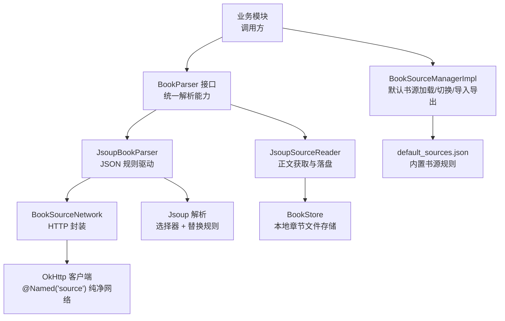
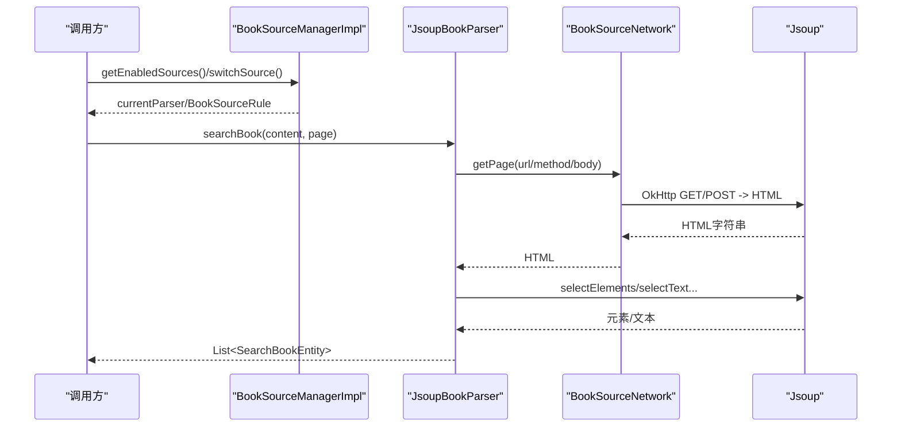
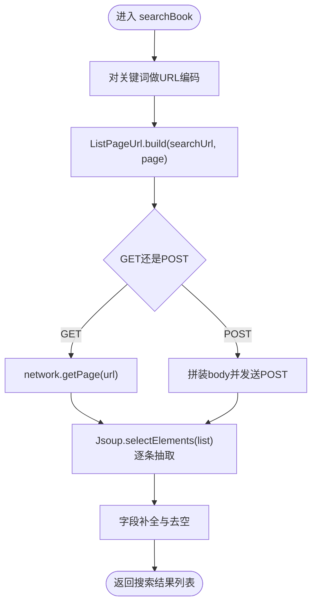
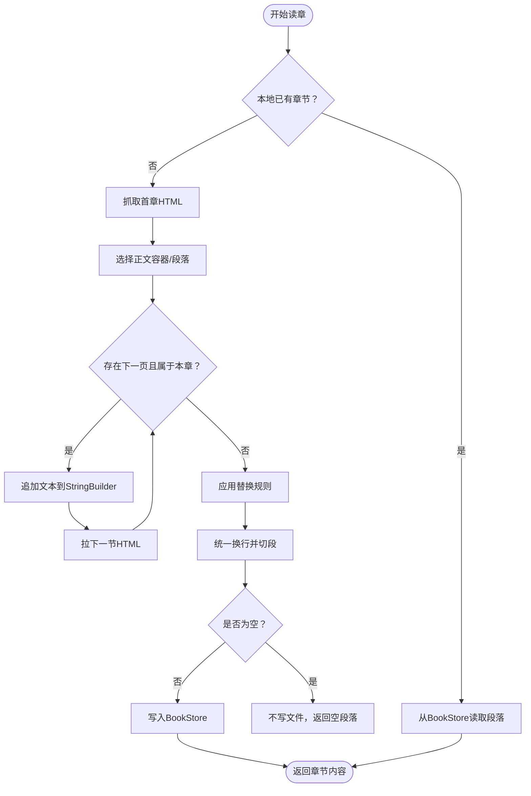
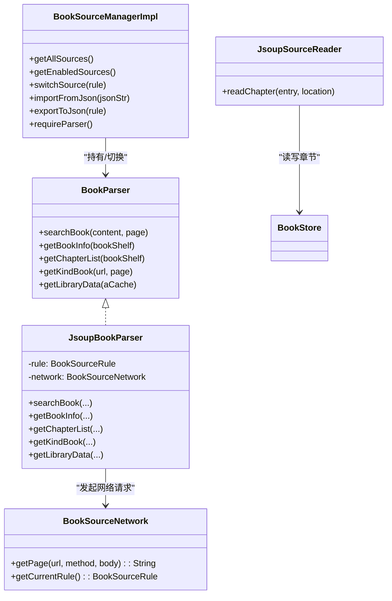

# 书源管理

<cite>
**本文引用的文件**
- [BookSourceManagerImpl.kt](file://lib_book_common/src/main/java/com/ebook/common/analyze/source/BookSourceManagerImpl.kt)
- [BookParser.kt](file://lib_book_common/src/main/java/com/ebook/common/analyze/source/BookParser.kt)
- [JsoupBookParser.kt](file://lib_book_common/src/main/java/com/ebook/common/analyze/source/JsoupBookParser.kt)
- [JsoupSourceReader.kt](file://lib_book_common/src/main/java/com/ebook/common/analyze/source/JsoupSourceReader.kt)
- [BookSourceRule.kt](file://lib_ebook_api/src/main/java/com/ebook/api/entity/BookSourceRule.kt)
- [BookSourceNetwork.kt](file://lib_ebook_api/src/main/java/com/ebook/api/service/source/BookSourceNetwork.kt)
- [default_sources.json](file://lib_book_common/src/main/assets/default_sources.json)
- [AnalyzeModule.kt](file://lib_book_common/src/main/java/com/ebook/common/di/AnalyzeModule.kt)
- [ContentStoreModule.kt](file://lib_book_common/src/main/java/com/ebook/common/di/ContentStoreModule.kt)
</cite>

## 目录
1. [简介](#简介)
2. [项目结构](#项目结构)
3. [核心组件](#核心组件)
4. [架构总览](#架构总览)
5. [详细组件分析](#详细组件分析)
6. [依赖分析](#依赖分析)
7. [性能与稳定性](#性能与稳定性)
8. [故障排查指南](#故障排查指南)
9. [结论](#结论)
10. [附录：自定义书源开发规范](#附录：自定义书源开发规范)

## 简介
本章节文档围绕“书源管理”展开，系统性梳理并解释以下方面：
- BookSourceRepository 的网络请求封装（通过 lib_ebook_api 的 BookSourceNetwork）。
- BookSourceManagerImpl 的书源加载、切换与导入导出。
- JsoupBookParser 的网页抓取与解析流程（搜索、书籍信息、目录列表、分类发现、书库数据）。
- JSON 配置结构与规则项含义、正则替换能力。
- Jsoup 选择器提取章节列表与正文分页拼接算法。
- 缓存策略（本地 ACache）、网络重试机制、错误处理与降级方案。
- 动态加载、多站点适配、性能优化方法。
- 自定义书源的开发指南、规则编写规范与调试测试要点。
- 书源导入导出功能与批量管理能力说明。

本项目当前为单书源运行期（未来规划多书源），默认书源由 assets 中的 default_sources.json 提供，运行时切换仅用于管理不同 JSON 配置实例。

## 项目结构
本模块位于 lib_book_common，核心代码集中在 analyze/source，实体在 lib_ebook_api，装配在 di 中，默认书源配置在 assets。

**图示来源**
- [BookParser.kt:9-20](file://lib_book_common/src/main/java/com/ebook/common/analyze/source/BookParser.kt#L9-L20)
- [JsoupBookParser.kt:25-36](file://lib_book_common/src/main/java/com/ebook/common/analyze/source/JsoupBookParser.kt#L25-L36)
- [JsoupSourceReader.kt:23-39](file://lib_book_common/src/main/java/com/ebook/common/analyze/source/JsoupSourceReader.kt#L23-L39)
- [BookSourceNetwork.kt:1-34](file://lib_ebook_api/src/main/java/com/ebook/api/service/source/BookSourceNetwork.kt#L1-L34)
- [BookSourceManagerImpl.kt:14-39](file://lib_book_common/src/main/java/com/ebook/common/analyze/source/BookSourceManagerImpl.kt#L14-L39)
- [default_sources.json:1-83](file://lib_book_common/src/main/assets/default_sources.json#L1-L83)

**章节来源**
- [BookSourceManagerImpl.kt:14-107](file://lib_book_common/src/main/java/com/ebook/common/analyze/source/BookSourceManagerImpl.kt#L14-L107)
- [AnalyzeModule.kt:11-18](file://lib_book_common/src/main/java/com/ebook/common/di/AnalyzeModule.kt#L11-L18)
- [ContentStoreModule.kt:51-86](file://lib_book_common/src/main/java/com/ebook/common/di/ContentStoreModule.kt#L51-L86)

## 核心组件
- 书源管理器（BookSourceManagerImpl）：负责默认书源加载、启用状态过滤、切换书源生成解析器、导入导出规则、持久化当前书源。
- 解析器接口（BookParser）：定义搜索、书籍详情、目录列表、分类发现、书库数据的统一能力。
- 解析实现（JsoupBookParser）：基于 BookSourceRule JSON 配置，用 Jsoup 进行元素选择与内容清洗，协调 ListPageUrl 渲染分页模板。
- 正文读取器（JsoupSourceReader）：聚焦“读一章正文”的能力，从文件或网络读取，自动多页拼接与清理，写入 BookStore。
- 网络封装（BookSourceNetwork）：构造完整 URL、选择 GET/POST、组装请求头与表单体、按 charset 解码响应。
- 规则模型（BookSourceRule 及其子类型）：完全 JSON 驱动的规则描述集合，包含搜索、详情、目录、正文、发现等。

**章节来源**
- [BookSourceManagerImpl.kt:14-107](file://lib_book_common/src/main/java/com/ebook/common/analyze/source/BookSourceManagerImpl.kt#L14-L107)
- [BookParser.kt:9-20](file://lib_book_common/src/main/java/com/ebook/common/analyze/source/BookParser.kt#L9-L20)
- [JsoupBookParser.kt:25-193](file://lib_book_common/src/main/java/com/ebook/common/analyze/source/JsoupBookParser.kt#L25-L193)
- [JsoupSourceReader.kt:23-178](file://lib_book_common/src/main/java/com/ebook/common/analyze/source/JsoupSourceReader.kt#L23-L178)
- [BookSourceNetwork.kt:1-34](file://lib_ebook_api/src/main/java/com/ebook/api/service/source/BookSourceNetwork.kt#L1-L34)
- [BookSourceRule.kt:11-200+](file://lib_ebook_api/src/main/java/com/ebook/api/entity/BookSourceRule.kt#L11-L200+)

## 架构总览
下图展示了“用户操作 → 管理器 → 解析器 → 网络 → Jsoup → 结果”的主链路，以及本地正文读取路径的解耦设计。

**图示来源**
- [BookSourceManagerImpl.kt:55-77](file://lib_book_common/src/main/java/com/ebook/common/analyze/source/BookSourceManagerImpl.kt#L55-L77)
- [JsoupBookParser.kt:37-95](file://lib_book_common/src/main/java/com/ebook/common/analyze/source/JsoupBookParser.kt#L37-L95)
- [BookSourceNetwork.kt:18-31](file://lib_ebook_api/src/main/java/com/ebook/api/service/source/BookSourceNetwork.kt#L18-L31)

## 详细组件分析

### BookSourceManagerImpl：书源加载、切换、导入导出与当前源持久化
- 启动时从 assets 读取 default_sources.json，按 enabled 过滤并填充内存列表。
- 支持导入一条规则的 JSON 字符串（校验 name/url 非空），也支持将规则编码为 JSON。
- switchSource(rule) 时根据 rule 创建 JsoupBookParser；后续 requireParser() 会返回该解析器或抛出未初始化异常。
- 当前书源 URL 持久化到 SharedPreferences，便于下次启动恢复。

重点特性：
- 使用 @Named("source") 的 OkHttpClient 访问第三方网站，避免携带用户认证 token。
- 对解析过程全量记录日志，方便追踪请求 URL 与方法、解析行数。

**章节来源**
- [BookSourceManagerImpl.kt:14-107](file://lib_book_common/src/main/java/com/ebook/common/analyze/source/BookSourceManagerImpl.kt#L14-L107)

### JsoupBookParser：JSON 规则驱动的网站抓取与解析
能力涵盖：
- 搜索：URL 模板替换 {{keyword}}，利用 ListPageUrl 渲染 {{page}}，合并 GET/POST 请求，使用 SearchRule 选择器抽取条目。
- 书籍详情：解析名称、作者（可前缀移除）、封面、简介、目录地址。
- 目录列表：优先用 bookInfo.chapterUrl，否则回退到 noteUrl，利用 TocRule.list 抽取章节。
- 分类发现：FindRule.url 支持 {{kind}}/{{page}}，复/SearchRule 或自身规则进行抽取。
- 书库数据：支持 ACache 作为轻量级缓存键。

注意：
- 编码安全：URLEncoder 失败时降级为原始内容继续。
- 空数据兜底：捕获异常后返回空列表，避免上层崩溃。
- 选择器失效场景通过日志与空值保护降低影响。

**图示来源**
- [JsoupBookParser.kt:37-95](file://lib_book_common/src/main/java/com/ebook/common/analyze/source/JsoupBookParser.kt#L37-L95)
- [BookSourceNetwork.kt:18-31](file://lib_ebook_api/src/main/java/com/ebook/api/service/source/BookSourceNetwork.kt#L18-L31)

**章节来源**
- [JsoupBookParser.kt:25-193](file://lib_book_common/src/main/java/com/ebook/common/analyze/source/JsoupBookParser.kt#L25-L193)

### JsoupSourceReader：章节正文读取、多页拼接与落盘
职责边界：
- 不感知搜索/目录/分类等“发现类”能力，只负责“给我这一章的正文”。
- 如果本地已有章节段落则直接返回；否则从网络抓取并存入 BookStore，再返回内容。

抓取策略：
- 以目录页给出的原始章节 URL 为基准，循环抓下一页，直到：
  - 不存在 nextPage 选择器或解析结果为空；
  - 同章分页判定失败（ChapterPageMatcher）；
  - 达到 MAX_CONTENT_PAGES 上限防死循环。
- 正文优先取 
 段落，否则回退 wholeText。
- 全文应用替换规则（支持正则，enabled 开关），然后统一换行并按 \n 拆段存储。
- 空正文不落盘，交由调用方视为失败并处理重试。

本地读取路径可用于测试和已缓存场景：readChapterFromFile 无需 DI 图即可运行。

**图示来源**
- [JsoupSourceReader.kt:41-178](file://lib_book_common/src/main/java/com/ebook/common/analyze/source/JsoupSourceReader.kt#L41-L178)

**章节来源**
- [JsoupSourceReader.kt:23-178](file://lib_book_common/src/main/java/com/ebook/common/analyze/source/JsoupSourceReader.kt#L23-L178)
- [ContentStoreModule.kt:60-71](file://lib_book_common/src/main/java/com/ebook/common/di/ContentStoreModule.kt#L60-L71)

### BookSourceNetwork：网络请求封装
- 统一拼出完整 URL（相对路径以 rule.url 为基址）。
- 基于 method/body 决定 GET 或 POST，表单体由 BookSourceService 构建。
- 最后依据 rule.charset 转换响应编码。
- 不使用用户认证的 OkHttpClient，避免 token 泄漏。

**章节来源**
- [BookSourceNetwork.kt:1-34](file://lib_ebook_api/src/main/java/com/ebook/api/service/source/BookSourceNetwork.kt#L1-L34)

### 默认书源规则：JSON 结构与语义
default_sources.json 提供了预置书源（如“笔趣阁”），其中 key 包括：
- name/url/enabled/group/weight/charset/method/body 等基础项。
- searchUrl/searchMethod/searchBody/searchPage/ruleSearch 等搜索相关。
- ruleBookInfo/ruleToc/ruleContent/ruleFind/ruleRank 等解析规则。
- replaceRules 为可选的正则替换清单，支持 enable 控制。

使用建议：
- 新增/改造站点首先尝试调整 JSON 规则（选择器、替换规则），尽量避免硬编码改动。
- 分页模板必须含 {{page}}，否则“加载更多”只会重复首页。
- 列表“到底”的判断不仅看是否空页，还要结合去重逻辑防止软 404 导致的伪重复。

**章节来源**
- [default_sources.json:1-83](file://lib_book_common/src/main/assets/default_sources.json#L1-L83)
- [BookSourceRule.kt:11-200+](file://lib_ebook_api/src/main/java/com/ebook/api/entity/BookSourceRule.kt#L11-L200+)

## 依赖分析

**图示来源**
- [BookParser.kt:9-20](file://lib_book_common/src/main/java/com/ebook/common/analyze/source/BookParser.kt#L9-L20)
- [JsoupBookParser.kt:25-36](file://lib_book_common/src/main/java/com/ebook/common/analyze/source/JsoupBookParser.kt#L25-L36)
- [BookSourceManagerImpl.kt:20-39](file://lib_book_common/src/main/java/com/ebook/common/analyze/source/BookSourceManagerImpl.kt#L20-L39)
- [BookSourceNetwork.kt:1-34](file://lib_ebook_api/src/main/java/com/ebook/api/service/source/BookSourceNetwork.kt#L1-L34)
- [JsoupSourceReader.kt:23-39](file://lib_book_common/src/main/java/com/ebook/common/analyze/source/JsoupSourceReader.kt#L23-L39)

**章节来源**
- [AnalyzeModule.kt:11-18](file://lib_book_common/src/main/java/com/ebook/common/di/AnalyzeModule.kt#L11-L18)

## 性能与稳定性

### 缓存策略
- 本地轻量缓存：JsoupBookParser.getLibraryData 通过 ACache 缓存 key LIBRARY_CACHE_KEY 的结果，减少频繁网络开销。
- 章节文件缓存：JsoupSourceReader.readChapter 优先从 BookStore 读取已有段落，避免重复网络 IO。
- 多页拼接限制：MAX_CONTENT_PAGES 防止极端情况下的无限翻页造成性能与资源问题。

### 网络重试与健壮性
- 单次请求层面的重试未在解析层显式实现，通常由更上层的调度或调用方策略决定。若需全局重试可在 OkHttp 层面加拦截器，但需谨慎避免重复请求造成站点负载上升。
- 编码容错：URLEncoder 失败则回落原始内容，保证解析可继续。

### 错误处理与降级
- 解析异常捕获：searchBook/getKindBook 等均捕获异常并返回空列表，不会中断主流程。
- 空内容策略：正文为空不落盘，避免“假缓存”的坏体验；调用方可据此判定失败并提示用户。
- 错误链记录：抓取失败会写入 ErrorAnalyzeContentManager 的错误地址表，便于复盘定位。

[本节为通用指导，不涉及具体代码片段]

## 故障排查指南
常见问题及处理建议：
- 页面无法抓取或结果为空：
  - 检查 BookSourceRule 的选择器是否正确，确认页面结构变更。
  - 验证 URL 模板是否包含 {{page}}，避免“加载更多”重复请求首页。
  - 核对字符集是否正确，必要时调整 rule.charset。
- 章节内容为空：
  - 检查 ContentRule.content 选择器是否能命中，是否被替换规则清空。
  - 关注 ChapterPageMatcher 判定，确保下一页链接属于本章。
  - 查看 ErrorAnalyzeContentManager 中是否有错误 URL 积累，集中修复。
- 导入书源无效：
  - 确保导入 JSON 中 name 与 url 非空。
  - 通过 exportToJson 输出当前规则，对比校验格式正确性。

**章节来源**
- [JsoupBookParser.kt:66-69](file://lib_book_common/src/main/java/com/ebook/common/analyze/source/JsoupBookParser.kt#L66-L69)
- [JsoupSourceReader.kt:157-176](file://lib_book_common/src/main/java/com/ebook/common/analyze/source/JsoupSourceReader.kt#L157-L176)
- [BookSourceManagerImpl.kt:80-97](file://lib_book_common/src/main/java/com/ebook/common/analyze/source/BookSourceManagerImpl.kt#L80-L97)

## 结论
- 书源体系采用“JSON 驱动 + Jsoup 解析 + 纯网络客户端”的设计，使得新站点的适配成本低、可维护性强。
- 管理器层屏蔽了默认书源的加载与切换细节；解析层专注数据抽取，读取层专注正文落盘。
- 通过 ACache、BookStore、分页数上限等手段实现良好的性能与稳定性平衡。
- 后续可按 ADR-0016 扩展多书源聚合能力，而当前实现已预留 BookSourceManager 的导入/导出/切换等钩子。

[本节总结上文内容，无特定文件引用]

## 附录：自定义书源开发规范

- 新增/修改书源
  - 在 default_sources.json 或导入的 JSON 中增改规则；优先通过选择器与替换规则完成适配。
  - 确保所有涉及分页的模板包含 {{page}}，并使用规则中的 PageRule 参数。
- 规则编写要点
  - 搜索结果：list/name/author/bookUrl/coversUrl 等选择器要准确匹配。
  - 书籍详情：name/author/intro/coverUrl/tocUrl 清晰定义，必要时设置 authorPrefix/introPrefix 清理前后缀。
  - 目录列表：list/listPageUrl/nextPage/reverse 合理组合，必要时反转顺序。
  - 正文内容：content 精确选中正文容器；nextPage 仅在本章分页有效；replaceRules 去除广告、水印与无关文本。
- 调试与测试
  - 利用 requireParser 获取 JsoupBookParser 后手动执行 searchBook/getBookInfo/getChapterList/getKindBook 验证各阶段输出。
  - 通过日志观察实际请求 URL、方法与返回 HTML，快速定位选择器问题。
  - 对正文抓取，关注“空正文不落盘”的行为，配合 ErrorAnalyzeContentManager 排查异常地址。
  - 可使用本地章节文件读取（JsoupSourceReader 的 readChapterFromFile 静态方法）验证段落组织是否正确，无须网络环境。
- 导入导出与批量管理
  - importFromJson：接收 JSON 字符串，成功后加入内存 sources 列表。
  - exportToJson：将 BookSourceRule 对象序列化为 JSON，便于分享与备份。
  - saveCurrentSource：保存当前选中的书源 URL，重启后恢复。
  - 注意：当前为单书源运行期，批量管理主要用于“添加/编辑/分享/删除记忆”，尚未实现“同时并发多书源聚合查询”。

**章节来源**
- [BookSourceManagerImpl.kt:80-107](file://lib_book_common/src/main/java/com/ebook/common/analyze/source/BookSourceManagerImpl.kt#L80-L107)
- [default_sources.json:1-83](file://lib_book_common/src/main/assets/default_sources.json#L1-L83)
- [JsoupSourceReader.kt:56-77](file://lib_book_common/src/main/java/com/ebook/common/analyze/source/JsoupSourceReader.kt#L56-L77)
- [AnalyzeModule.kt:11-18](file://lib_book_common/src/main/java/com/ebook/common/di/AnalyzeModule.kt#L11-L18)