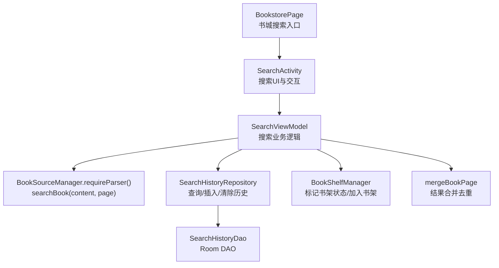
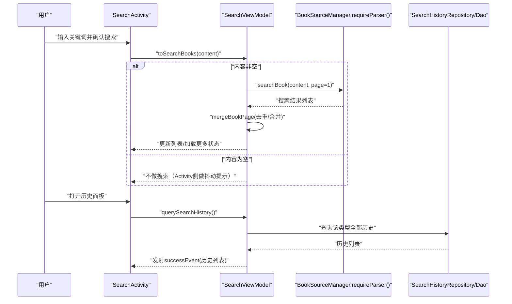
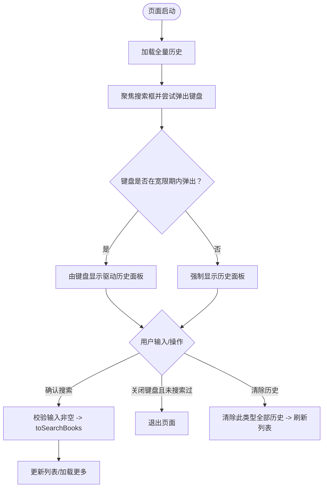
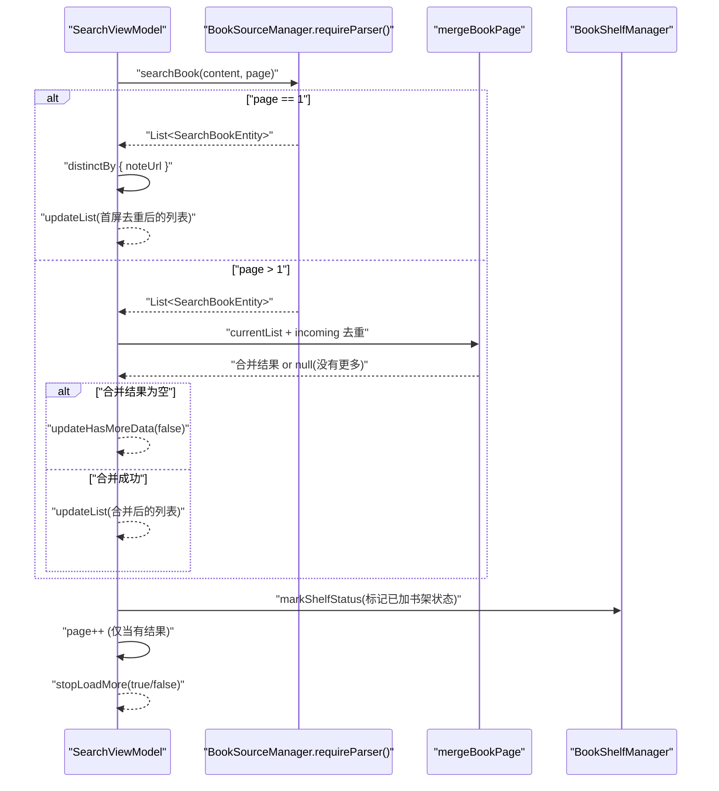
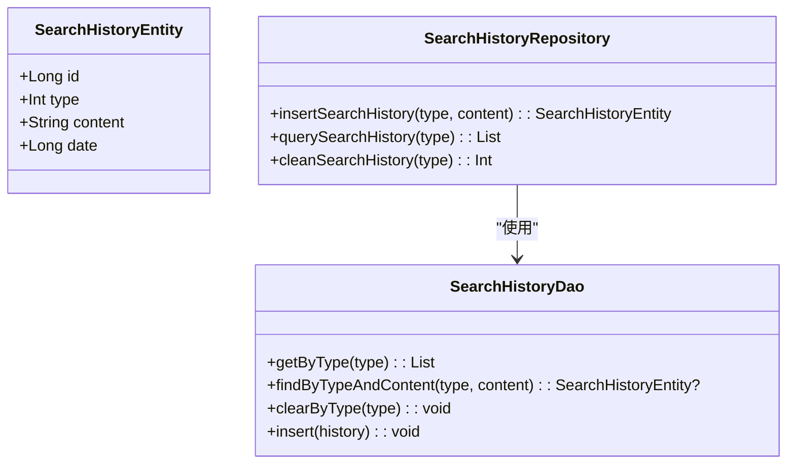
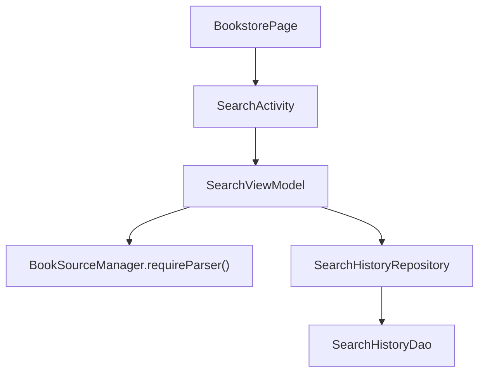

# 搜索功能

<cite>
**本文引用的文件**
- [SearchActivity.kt](file://module_find/src/main/java/com/ebook/find/SearchActivity.kt)
- [SearchViewModel.kt](file://module_find/src/main/java/com/ebook/find/mvvm/viewmodel/SearchViewModel.kt)
- [SearchHistoryRepository.kt](file://module_find/src/main/java/com/ebook/find/repository/SearchHistoryRepository.kt)
- [BookPageMerge.kt](file://module_find/src/main/java/com/ebook/find/mvvm/viewmodel/BookPageMerge.kt)
- [SearchBookItem.kt](file://module_find/src/main/java/com/ebook/find/view/SearchBookItem.kt)
- [BookstorePage.kt](file://module_find/src/main/java/com/ebook/find/page/BookstorePage.kt)
- [SearchHistoryEntity.kt](file://lib_ebook_db/src/main/java/com/ebook/db/entity/SearchHistoryEntity.kt)
- [SearchHistoryDao.kt](file://lib_ebook_db/src/main/java/com/ebook/db/dao/SearchHistoryDao.kt)
- [JsoupBookParser.kt](file://lib_book_common/src/main/java/com/ebook/common/analyze/source/JsoupBookParser.kt)
</cite>

## 目录
1. [简介](#简介)
2. [项目结构（搜索相关）](#项目结构搜索相关)
3. [核心组件](#核心组件)
4. [架构总览](#架构总览)
5. [详细组件分析](#详细组件分析)
6. [依赖关系分析](#依赖关系分析)
7. [性能考量](#性能考量)
8. [故障排查指南](#故障排查指南)
9. [结论](#结论)
10. [附录](#附录)

## 简介
本章节文档面向搜索功能的实现细节，聚焦于以下要点：
- SearchActivity 的搜索界面与交互：搜索框、历史面板、键盘行为、圆形揭示动画。
- SearchViewModel 的搜索逻辑：关键词搜索、分页加载更多、结果合并去重、书架状态同步。
- 搜索历史持久化：存储实体、DAO 访问层与仓库封装，历史面板的数据来源与管理。
- 搜索结果展示：列表项 UI、状态与标签、加入书架交互。
- 错误处理与健壮性：网络异常兜底、“没有更多”判定、无键盘环境的兼容。
- 扩展与优化：自定义搜索接口接入、建议系统扩展、性能调优策略。

## 项目结构（搜索相关）
搜索功能位于 module_find 模块，配合 lib_ebook_db 提供数据持久化能力，并通过 lib_book_common 的网络解析能力进行跨站点搜索。核心文件与作用如下：
- SearchActivity：搜索页 Compose 实现，负责界面交互、历史面板呈现与键盘联动。
- SearchViewModel：搜索业务逻辑，含搜索执行、分页加载、结果合并、书架状态同步及历史维护。
- SearchHistoryRepository：搜索历史的增删改查封装。
- BookPageMerge：分页追加结果的去重与合并算法。
- SearchBookItem：搜索结果条目卡片 UI。
- BookstorePage：书城入口，点击跳转搜索页的入口点之一。
- SearchHistoryEntity / SearchHistoryDao：Room 实体与数据访问对象。
- JsoupBookParser：书源解析器，提供 searchBook 网络请求与解析。

**图表来源**
- [SearchActivity.kt:125-230](file://module_find/src/main/java/com/ebook/find/SearchActivity.kt#L125-L230)
- [SearchViewModel.kt:31-198](file://module_find/src/main/java/com/ebook/find/mvvm/viewmodel/SearchViewModel.kt#L31-L198)
- [SearchHistoryRepository.kt:17-42](file://module_find/src/main/java/com/ebook/find/repository/SearchHistoryRepository.kt#L17-L42)
- [SearchHistoryDao.kt:17-66](file://lib_ebook_db/src/main/java/com/ebook/db/dao/SearchHistoryDao.kt#L17-L66)
- [BookPageMerge.kt:1-23](file://module_find/src/main/java/com/ebook/find/mvvm/viewmodel/BookPageMerge.kt#L1-L23)

**章节来源**
- [SearchActivity.kt:125-230](file://module_find/src/main/java/com/ebook/find/SearchActivity.kt#L125-L230)
- [SearchViewModel.kt:31-198](file://module_find/src/main/java/com/ebook/find/mvvm/viewmodel/SearchViewModel.kt#L31-L198)
- [SearchHistoryRepository.kt:17-42](file://module_find/src/main/java/com/ebook/find/repository/SearchHistoryRepository.kt#L17-L42)
- [BookstorePage.kt:160-180](file://module_find/src/main/java/com/ebook/find/page/BookstorePage.kt#L160-L180)

## 核心组件
- SearchActivity：基于 BaseMvvmRefreshActivity 的 Compose 页面，覆盖基类骨架以实现搜索栏+结果列表+历史面板布局；利用 WindowInsets.isImeVisible 驱动历史面板展现与收起逻辑；内置圆形揭示动画和键盘宽限容错机制；触底加载更多由基类统一支持。
- SearchViewModel：继承 BaseRefreshViewModel，维护当前搜索关键字与页码；发起分页搜索并在首屏按 noteUrl 去重，后续页通过 mergeBookPage 增量合并；订阅书架事件并刷新列表“已加书架”状态；提供搜索历史增删查等能力。
- SearchHistoryRepository：提供 insertSearchHistory（upsert）、querySearchHistory（按类型倒序）、cleanSearchHistory（按类型清空）等 API。
- BookPageMerge：按 noteUrl 集合过滤 incoming 的新增项，为空返回 null 表示“没有更多”。
- SearchBookItem：显示封面、书名、作者、来源、状态/分类/字数标签、最新章节或简介，并提供“加入书架”按钮。
- BookstorePage：书城页包含搜索胶囊入口，使用 TheRouter 跳转到搜索页。

**章节来源**
- [SearchActivity.kt:125-230](file://module_find/src/main/java/com/ebook/find/SearchActivity.kt#L125-L230)
- [SearchViewModel.kt:31-198](file://module_find/src/main/java/com/ebook/find/mvvm/viewmodel/SearchViewModel.kt#L31-L198)
- [SearchHistoryRepository.kt:17-42](file://module_find/src/main/java/com/ebook/find/repository/SearchHistoryRepository.kt#L17-L42)
- [BookPageMerge.kt:1-23](file://module_find/src/main/java/com/ebook/find/mvvm/viewmodel/BookPageMerge.kt#L1-L23)
- [SearchBookItem.kt:44-156](file://module_find/src/main/java/com/ebook/find/view/SearchBookItem.kt#L44-L156)
- [BookstorePage.kt:160-180](file://module_find/src/main/java/com/ebook/find/page/BookstorePage.kt#L160-L180)

## 架构总览
搜索功能的调用链从用户输入触发，经 ViewModel 调用书源解析器进行网络搜索，随后进行分页合并与列表更新；同时，搜索历史在本地数据库中进行增删查管理，历史面板在软键盘弹起时以圆形揭示动画展示。

**图表来源**
- [SearchActivity.kt:164-230](file://module_find/src/main/java/com/ebook/find/SearchActivity.kt#L164-L230)
- [SearchViewModel.kt:129-167](file://module_find/src/main/java/com/ebook/find/mvvm/viewmodel/SearchViewModel.kt#L129-L167)
- [SearchHistoryRepository.kt:22-41](file://module_find/src/main/java/com/ebook/find/repository/SearchHistoryRepository.kt#L22-L41)

## 详细组件分析

### SearchActivity（搜索界面与交互）
- 界面骨架：覆盖 HomePage 以自定义顶部搜索栏 + 基类列表区（包含加载、空态、网络错误覆盖层）+ 覆盖在列表区之上的历史面板；阴影条注意尺寸对齐旧 View 背景。
- 键盘与历史面板联动：使用 isImeVisible 监听软键盘弹出/收起；首次进入自动聚焦并尝试弹出键盘；若无键盘弹出（物理键盘/模拟机），宽限期后强制打开历史面板；未进行过搜索且键盘收起则退出页面，对齐旧语义。
- 圆形揭示动画：基于 Animatable + GenericShape 自顶角圆形裁剪，开/关时长与缓动曲线对齐旧实现，布局期才读取形状轮廓避免动画期间重组。
- 搜索框交互：支持清空操作、回车搜索（IME_ACTION）、防抖输入（实际搜索由 Activity 提交到 VM）；返回键语义根据是否历史可见切换为“返回”或“搜索”。
- 加载更多：开启 loadMore，失败时重置加载更多状态。

**图表来源**
- [SearchActivity.kt:180-200](file://module_find/src/main/java/com/ebook/find/SearchActivity.kt#L180-L200)
- [SearchActivity.kt:125-198](file://module_find/src/main/java/com/ebook/find/SearchActivity.kt#L125-L198)

**章节来源**
- [SearchActivity.kt:93-108](file://module_find/src/main/java/com/ebook/find/SearchActivity.kt#L93-L108)
- [SearchActivity.kt:164-230](file://module_find/src/main/java/com/ebook/find/SearchActivity.kt#L164-L230)
- [BookstorePage.kt:160-180](file://module_find/src/main/java/com/ebook/find/page/BookstorePage.kt#L160-L180)

### SearchViewModel（搜索逻辑与分页）
- 分页搜索：保存 durSearchKey 与 page，page=1 替换列表并按 noteUrl 去重；page>1 通过 mergeBookPage 增量合并；当 no new items 时置“没有更多”，仅当有结果时递增页码。
- 书架状态同步：初始化装载书架快照，订阅 bookShelfEvents 动态刷新列表中书籍的“是否已加书架”状态。
- 历史维护：insertSearchHistory upsert（同 type+content 更新时间戳）；cleanSearchHistory 按类型清空并发射空列表；querySearchHistory 按类型查询全量历史。
- 错误处理：捕获网络/解析异常，停止加载更多并清除 loading 覆盖层。

**图表来源**
- [SearchViewModel.kt:77-167](file://module_find/src/main/java/com/ebook/find/mvvm/viewmodel/SearchViewModel.kt#L77-L167)
- [BookPageMerge.kt:1-23](file://module_find/src/main/java/com/ebook/find/mvvm/viewmodel/BookPageMerge.kt#L1-L23)

**章节来源**
- [SearchViewModel.kt:77-198](file://module_find/src/main/java/com/ebook/find/mvvm/viewmodel/SearchViewModel.kt#L77-L198)
- [BookPageMerge.kt:1-23](file://module_find/src/main/java/com/ebook/find/mvvm/viewmodel/BookPageMerge.kt#L1-L23)

### 搜索历史持久化（实体、DAO、仓库）
- 实体：SearchHistoryEntity，type 区分搜索入口（BOOK），content 作为精准查重与展示用，date 用于排序与更新重搜记录。
- DAO：SearchHistoryDao，提供 getByType（按类型倒序）、findByTypeAndContent（精确查找）、clearByType（按类型清空）等。
- 仓库：SearchHistoryRepository，所有方法切换到 IO 线程，提供 upsert、查询全量、清空能力；插入后在 VM 中触发全量历史刷新。

**图表来源**
- [SearchHistoryEntity.kt:19-43](file://lib_ebook_db/src/main/java/com/ebook/db/entity/SearchHistoryEntity.kt#L19-L43)
- [SearchHistoryDao.kt:17-66](file://lib_ebook_db/src/main/java/com/ebook/db/dao/SearchHistoryDao.kt#L17-L66)
- [SearchHistoryRepository.kt:17-42](file://module_find/src/main/java/com/ebook/find/repository/SearchHistoryRepository.kt#L17-L42)

**章节来源**
- [SearchHistoryEntity.kt:19-43](file://lib_ebook_db/src/main/java/com/ebook/db/entity/SearchHistoryEntity.kt#L19-L43)
- [SearchHistoryDao.kt:17-66](file://lib_ebook_db/src/main/java/com/ebook/db/dao/SearchHistoryDao.kt#L17-L66)
- [SearchHistoryRepository.kt:17-42](file://module_find/src/main/java/com/ebook/find/repository/SearchHistoryRepository.kt#L17-L42)
- [SearchViewModel.kt:81-118](file://module_find/src/main/java/com/ebook/find/mvvm/viewmodel/SearchViewModel.kt#L81-L118)

### 搜索结果展示（列表项）
- SearchBookItem：卡片形式，显示封面、书名、作者、来源、状态/分类/字数标签、最新章节或简介；“加入书架”按钮启用状态由 searchBook.add 控制。
- 文案与格式：字数格式化在主线程执行以避免 DateFormat 多线程问题；信息标签统一使用 InfoChip，视觉一致性遵循共享设计语言。

**章节来源**
- [SearchBookItem.kt:44-156](file://module_find/src/main/java/com/ebook/find/view/SearchBookItem.kt#L44-L156)

## 依赖关系分析
- SearchActivity 依赖 SearchViewModel（注入）、TheRouter（导航）、基类组件（LoadMore、Cover）。
- SearchViewModel 依赖 BookSourceManager（网络搜索）、BookShelfManager（书架状态同步与加入收藏）、SearchHistoryRepository（历史管理）。
- SearchHistoryRepository 依赖 SearchHistoryDao（Room DAO）。
- BookstorePage 提供搜索入口并路由到 SearchActivity。

**图表来源**
- [SearchActivity.kt:125-198](file://module_find/src/main/java/com/ebook/find/SearchActivity.kt#L125-L198)
- [SearchViewModel.kt:31-75](file://module_find/src/main/java/com/ebook/find/mvvm/viewmodel/SearchViewModel.kt#L31-L75)
- [SearchHistoryRepository.kt:17-42](file://module_find/src/main/java/com/ebook/find/repository/SearchHistoryRepository.kt#L17-L42)
- [SearchHistoryDao.kt:17-66](file://lib_ebook_db/src/main/java/com/ebook/db/dao/SearchHistoryDao.kt#L17-L66)
- [BookstorePage.kt:160-180](file://module_find/src/main/java/com/ebook/find/page/BookstorePage.kt#L160-L180)

**章节来源**
- [SearchViewModel.kt:31-75](file://module_find/src/main/java/com/ebook/find/mvvm/viewmodel/SearchViewModel.kt#L31-L75)
- [SearchHistoryRepository.kt:17-42](file://module_find/src/main/java/com/ebook/find/repository/SearchHistoryRepository.kt#L17-L42)

## 性能考量
- 结果去重：首屏使用 distinctBy(noteUrl)，后续页使用 mergeBookPage 去重，避免 LazyColumn item key 重复导致异常。
- 翻页效率：仅在有新结果时递增 page，防止空页浪费与越界重复。
- 历史面板动画：避免在动画过程中触发重组，仅在形状生成时读取轮廓。
- 字数格式化缓存：WordFormatter 复用，避免频繁构造 DecimalFormat。
- IO 隔离：Repository 内部切换至 Dispatchers.IO，保持主线程响应性。

**章节来源**
- [SearchViewModel.kt:142-167](file://module_find/src/main/java/com/ebook/find/mvvm/viewmodel/SearchViewModel.kt#L142-L167)
- [BookPageMerge.kt:1-23](file://module_find/src/main/java/com/ebook/find/mvvm/viewmodel/BookPageMerge.kt#L1-L23)
- [SearchHistoryRepository.kt:22-41](file://module_find/src/main/java/com/ebook/find/repository/SearchHistoryRepository.kt#L22-L41)
- [SearchBookItem.kt:141-156](file://module_find/src/main/java/com/ebook/find/view/SearchBookItem.kt#L141-L156)

## 故障排查指南
- 网络错误：catch 内记录日志、停止加载更多、清除覆盖层；可通过 log 定位具体异常类型。
- 软键盘兼容：无键盘环境下使用宽限期强制打开历史面板；若页面在未搜索时直接返回，检查 keyboardShownOnce 状态流转。
- 加载更多失效：check 是否有新结果再递增 page；确保 mergeBookPage 正确返回 null 以停用加载更多。
- 历史面板不显示：确认 isImeVisible 与 panelForcedOpen 逻辑，核查 querySearchHistory 是否被调用并正常返回数据。
- “加入购物车”失败：addBookToShelf 内部捕获失败并 toast；可在上层叠加 overlay/loading 提示。

**章节来源**
- [SearchViewModel.kt:142-167](file://module_find/src/main/java/com/ebook/find/mvvm/viewmodel/SearchViewModel.kt#L142-L167)
- [SearchActivity.kt:170-190](file://module_find/src/main/java/com/ebook/find/SearchActivity.kt#L170-L190)
- [SearchViewModel.kt:169-177](file://module_find/src/main/java/com/ebook/find/mvvm/viewmodel/SearchViewModel.kt#L169-L177)

## 结论
搜索功能采用 MVVM 架构，将界面交互（SearchActivity）与业务逻辑（SearchViewModel）解耦，使用 Room 持久化搜索历史并通过 Repository 抽象 IO 细节。搜索过程具备完善的分页加载与结果去重策略，结合键盘交互与圆形揭示动画提升用户体验。错误处理覆盖网络异常与无键盘环境，保证基本可用性。未来可扩展多书源聚合、搜索建议、缓存与更丰富的交互行为，并持续优化性能和可维护性。

## 附录

### 关键词搜索算法说明
- 关键词进入 SearchViewModel.toSearchBooks：空内容直接跳过（Activity 侧可触发抖动提示）。
- 首屏按 noteUrl 去重，后续页通过 mergeBookPage 增量合并，空页或全重复即视为“没有更多”。
- 书源解析：经由 BookSourceManager.requireParser().searchBook(content, page) 获取网络结果，具体 URL/模板由 JSoupBookParser 内部规则决定。

**章节来源**
- [SearchViewModel.kt:129-167](file://module_find/src/main/java/com/ebook/find/mvvm/viewmodel/SearchViewModel.kt#L129-L167)
- [BookPageMerge.kt:1-23](file://module_find/src/main/java/com/ebook/find/mvvm/viewmodel/BookPageMerge.kt#L1-L23)
- [JsoupBookParser.kt](file://lib_book_common/src/main/java/com/ebook/common/analyze/source/JsoupBookParser.kt)

### 历史面板实现原理
- 数据来源：SearchHistoryRepository.querySearchHistory 按 type 查询全部历史（倒序）。
- 展示时机：软键盘弹出或通过宽限期强制打开；键盘收起后，若从未搜索则退出页面，否则收起面板。
- 动画：使用 Animatable 进度控制圆形裁剪半径，缓动曲线近似 accelerate_decelerate；开/关时长分别设为固定毫秒数，避免动画过程中重组。
- 管理操作：删除历史记录类型为清空某类型全部历史（不影响其他类型），成功后发射空列表刷新历史面板。

**章节来源**
- [SearchActivity.kt:170-200](file://module_find/src/main/java/com/ebook/find/SearchActivity.kt#L170-L200)
- [SearchHistoryRepository.kt:38-41](file://module_find/src/main/java/com/ebook/find/repository/SearchHistoryRepository.kt#L38-L41)
- [SearchViewModel.kt:94-118](file://module_find/src/main/java/com/ebook/find/mvvm/viewmodel/SearchViewModel.kt#L94-L118)

### 搜索框交互设计与结果合并
- 搜索框：支持 IME 动作搜索，焦点请求与键盘显示联动，清空按键重置输入。
- 合并算法：mergeBookPage 以 noteUrl 为唯一键过滤新增条目，为空返回 null，表示没有更多。
- 书架状态：markShelfStatus 对每页结果标记“已加书架”；列表项按钮禁用当已加入，事件触发后实时刷新对应项状态。

**章节来源**
- [SearchBookItem.kt:117-136](file://module_find/src/main/java/com/ebook/find/view/SearchBookItem.kt#L117-L136)
- [BookPageMerge.kt:1-23](file://module_find/src/main/java/com/ebook/find/mvvm/viewmodel/BookPageMerge.kt#L1-L23)
- [SearchViewModel.kt:142-167](file://module_find/src/main/java/com/ebook/find/mvvm/viewmodel/SearchViewModel.kt#L142-L167)

### 自定义搜索接口集成与结果格式化
- 集成方式：替换或增强 BookSourceManager.requireParser().searchBook 的实现（JSoupBookParser 所在处），保持返回 SearchBookEntity 列表与分页参数一致。
- 结果格式化：统一使用 SearchBookItem 渲染，遵循 InfoChip、BookCover 等共享组件；数值字段（如字数）在主线程格式化，避免并发问题。
- 缓存与重试：在网络不稳定时可考虑在 Repository 层引入短时缓存或重试策略（例如 ACache），但需确保去重与分页语义不变。

**章节来源**
- [SearchBookItem.kt:44-156](file://module_find/src/main/java/com/ebook/find/view/SearchBookItem.kt#L44-L156)
- [SearchViewModel.kt:142-167](file://module_find/src/main/java/com/ebook/find/mvvm/viewmodel/SearchViewModel.kt#L142-L167)
- [JsoupBookParser.kt](file://lib_book_common/src/main/java/com/ebook/common/analyze/source/JsoupBookParser.kt)