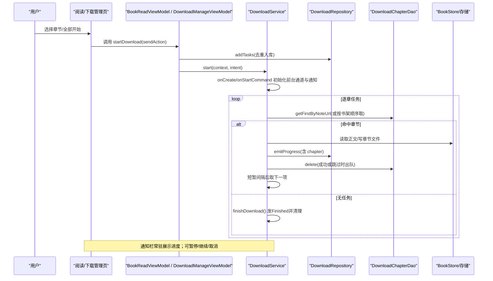
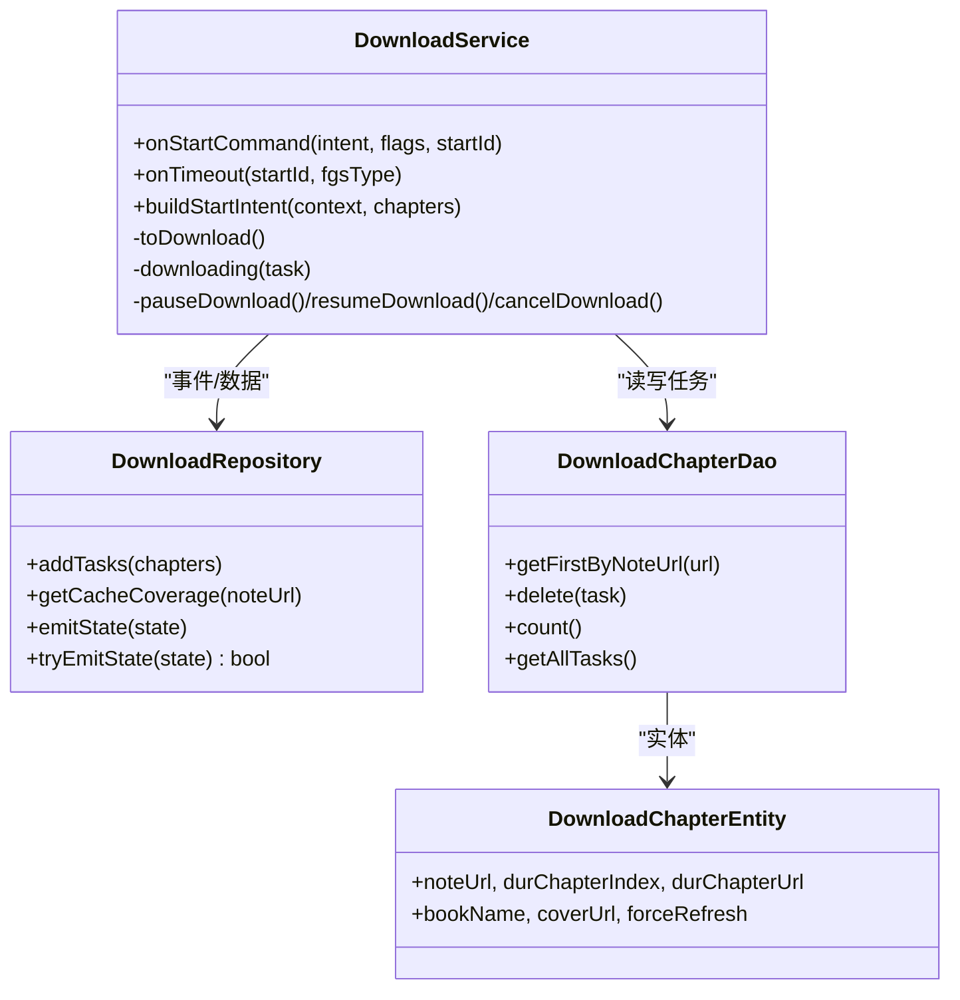
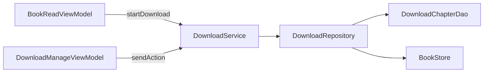

# 下载服务

<cite>
**本文引用的文件**   
- [DownloadService.kt](file://module_book/src/main/java/com/ebook/book/service/DownloadService.kt)
- [DownloadRepository.kt](file://module_book/src/main/java/com/ebook/book/repository/DownloadRepository.kt)
- [DownloadChapterEntity.kt](file://lib_ebook_db/src/main/java/com/ebook/db/entity/DownloadChapterEntity.kt)
- [DownloadChapterDao.kt](file://lib_ebook_db/src/main/java/com/ebook/db/dao/DownloadChapterDao.kt)
- [AppDatabase.kt](file://lib_ebook_db/src/main/java/com/ebook/db/AppDatabase.kt)
- [DownloadManageActivity.kt](file://module_book/src/main/java/com/ebook/book/DownloadManageActivity.kt)
- [DownloadManageViewModel.kt](file://module_book/src/main/java/com/ebook/book/mvvm/viewmodel/DownloadManageViewModel.kt)
- [BookReadViewModel.kt](file://module_book/src/main/java/com/ebook/book/mvvm/viewmodel/BookReadViewModel.kt)
- [0018-download-foreground-service-data-sync-quota.md](file://docs/adr/0018-download-foreground-service-data-sync-quota.md)
</cite>

## 目录
1. [简介](#简介)
2. [项目结构](#项目结构)
3. [核心组件](#核心组件)
4. [架构总览](#架构总览)
5. [详细组件分析](#详细组件分析)
6. [依赖关系分析](#依赖关系分析)
7. [性能与资源控制](#性能与资源控制)
8. [故障排查指南](#故障排查指南)
9. [结论](#结论)
10. [附录：配置与调优](#附录：配置与调优)

## 简介
本文档面向 Android 端下载子系统，系统性说明前台服务 DownloadService 的并发下载控制、队列管理与任务生命周期；解析进度实时推送与通知系统集成；覆盖断点续传、流量控制、存储空间管理等实现要点；并提供下载任务的状态监控、异常处理策略以及配置参数调优与性能优化建议。读者无需深入了解底层实现即可掌握该服务的使用方法与设计权衡。

## 项目结构
下载子系统横跨业务模块 module_book 与基础数据库 lib_ebook_db，以“服务层 + 仓库层 + 数据层”分层组织：
- Service 层（前台服务）：负责持久化任务调度、网络抓取、文件落盘、通知与系统配额保护。
- Repository 层（仓库）：统一封装下载任务数据的增删查、事件状态流、覆盖率统计等。
- Data 层（Room 数据库）：持久化未完成任务、提供响应式观察与排序查询。
- UI/VM 层：通过 ViewModel 发起下载动作、消费共享状态并渲染分组管理界面。

```mermaid
graph TB
  subgraph "UI/ViewModel"
    A["DownloadManageActivity"] 
    B["DownloadManageViewModel"]
    C["BookReadViewModel"]
  end

  subgraph "Service"
    S["DownloadService"]
  end

  subgraph "Repository"
    R["DownloadRepository"]
  end

  subgraph "Data(Room)"
    D1["DownloadChapterDao"]
    D2["DownloadChapterEntity"]
    DB["AppDatabase"]
  end

  A --> B
  A -->|意图控制| S
  B -->|状态收集/动作下发| R
  B -->|任务分组/覆盖率| R
  C -->|startDownload(入库+启动)| S
  S -->|状态推进| R
  S -->|读取/删除任务| D1
  D1 --> D2
  DB --> D1
```

图表来源
- [DownloadManageActivity.kt](file://module_book/src/main/java/com/ebook/book/DownloadManageActivity.kt)
- [DownloadManageViewModel.kt](file://module_book/src/main/java/com/ebook/book/mvvm/viewmodel/DownloadManageViewModel.kt)
- [DownloadService.kt](file://module_book/src/main/java/com/ebook/book/service/DownloadService.kt)
- [DownloadRepository.kt](file://module_book/src/main/java/com/ebook/book/repository/DownloadRepository.kt)
- [DownloadChapterDao.kt](file://lib_ebook_db/src/main/java/com/ebook/db/dao/DownloadChapterDao.kt)
- [DownloadChapterEntity.kt](file://lib_ebook_db/src/main/java/com/ebook/db/entity/DownloadChapterEntity.kt)
- [AppDatabase.kt](file://lib_ebook_db/src/main/java/com/ebook/db/AppDatabase.kt)

章节来源
- [DownloadManageActivity.kt:72-108](file://module_book/src/main/java/com/ebook/book/DownloadManageActivity.kt#L72-L108)
- [DownloadManageViewModel.kt:56-159](file://module_book/src/main/java/com/ebook/book/mvvm/viewmodel/DownloadManageViewModel.kt#L56-L159)
- [DownloadService.kt:51-200](file://module_book/src/main/java/com/ebook/book/service/DownloadService.kt#L51-L200)
- [DownloadRepository.kt:21-172](file://module_book/src/main/java/com/ebook/book/repository/DownloadRepository.kt#L21-L172)
- [DownloadChapterDao.kt:21-127](file://lib_ebook_db/src/main/java/com/ebook/db/dao/DownloadChapterDao.kt#L21-L127)
- [DownloadChapterEntity.kt:23-86](file://lib_ebook_db/src/main/java/com/ebook/db/entity/DownloadChapterEntity.kt#L23-L86)
- [AppDatabase.kt:34-64](file://lib_ebook_db/src/main/java/com/ebook/db/AppDatabase.kt#L34-L64)

## 核心组件
- DownloadService：前台数据同步服务，承载“按章抓取→写入章节文件→更新进度与通知→队头迭代”的主循环；具备启动/暂停/取消/继续、超时与启动限制保护、常驻通知动作。
- DownloadRepository：任务数据与事件中枢，维护 downloadState SharedFlow（replay=1，带缓冲）、提供任务入队/出队/计数、队列剩余 Flow、全书缓存覆盖率统计。
- DownloadChapterDao / Entity：基于 Room 的未完成任务表，确保同一章节唯一排队、按书顺序取队头/队尾、支持按书取消、数量观察。
- UI 与 VM：下载管理页按书分组展示，订阅状态流，发送控制指令；阅读器侧发起批量下载并拉起服务。

章节来源
- [DownloadService.kt:51-115](file://module_book/src/main/java/com/ebook/book/service/DownloadService.kt#L51-L115)
- [DownloadRepository.kt:35-172](file://module_book/src/main/java/com/ebook/book/repository/DownloadRepository.kt#L35-L172)
- [DownloadChapterDao.kt:21-127](file://lib_ebook_db/src/main/java/com/ebook/db/dao/DownloadChapterDao.kt#L21-L127)
- [DownloadChapterEntity.kt:23-86](file://lib_ebook_db/src/main/java/com/ebook/db/entity/DownloadChapterEntity.kt#L23-L86)

## 架构总览
下载流程从用户触发到文件落盘的时序如下：



图表来源
- [BookReadViewModel.kt:82-86](file://module_book/src/main/java/com/ebook/book/mvvm/viewmodel/BookReadViewModel.kt#L82-L86)
- [DownloadManageViewModel.kt:119-136](file://module_book/src/main/java/com/ebook/book/mvvm/viewmodel/DownloadManageViewModel.kt#L119-L136)
- [DownloadService.kt:117-237](file://module_book/src/main/java/com/ebook/book/service/DownloadService.kt#L117-L237)
- [DownloadRepository.kt:81-99](file://module_book/src/main/java/com/ebook/book/repository/DownloadRepository.kt#L81-L99)

## 详细组件分析

### DownloadService（前台服务与并发控制）
职责
- 作为 dataSync 类型前台服务运行，声明在清单中并通过两参 startForeground 建立常驻通知。
- 接收三种 Intent 动作：开始、暂停、取消；也支持 START_STICKY 重启后按库恢复。
- 维持两个布尔位标：isStartDownload（批次控制）与 isDownloading（当前线程抓取标记），保证同批不重复并发抓取单章节。
- 维护 skippedCount：失败章重试耗尽时仅出队不入库，收尾提示据此告知跳过的数量。

关键机制
- 启动与续跑
  - 首次 onStartCommand 构建通知通道并 startForeground。
  - 若携带章节列表则入队，否则尝试按书架顺序取第一章续跑。
  - 自动续跑会在“前台态不可用”时直接收尾，避免空转被系统回收。
- 主循环与退避
  - toDownload → 取第一章 → while 内 downloading 抓取并落盘，失败时最多重试多次，随后出队。
  - 每章间延迟 800ms，缓解后端压力与设备 CPU。
  - 失败章最终会删除行记录，避免队头阻塞导致无限重试。
- 控制命令
  - ACTION_PAUSE/ACTION_RESUME/ACTION_CANCEL 通过 Intent.action 直达，幂等安全。
- 配额与异常收口
  - onTimeout 仅做轻量收尾（清空回调、写 replay 状态、停服）。
  - 启动被拒由 DownloadService.start 捕获并返回 false，页面提示“系统限制”。

章节来源
- [DownloadService.kt:51-237](file://module_book/src/main/java/com/ebook/book/service/DownloadService.kt#L51-L237)
- [DownloadService.kt:263-420](file://module_book/src/main/java/com/ebook/book/service/DownloadService.kt#L263-L420)
- [DownloadService.kt:351-420](file://module_book/src/main/java/com/ebook/book/service/DownloadService.kt#L351-L420)
- [0018-download-foreground-service-data-sync-quota.md:1-63](file://docs/adr/0018-download-foreground-service-data-sync-quota.md#L1-L63)

#### 服务类图（核心交互）


图表来源
- [DownloadService.kt:117-420](file://module_book/src/main/java/com/ebook/book/service/DownloadService.kt#L117-L420)
- [DownloadRepository.kt:81-172](file://module_book/src/main/java/com/ebook/book/repository/DownloadRepository.kt#L81-L172)
- [DownloadChapterDao.kt:21-127](file://lib_ebook_db/src/main/java/com/ebook/db/dao/DownloadChapterDao.kt#L21-L127)
- [DownloadChapterEntity.kt:23-86](file://lib_ebook_db/src/main/java/com/ebook/db/entity/DownloadChapterEntity.kt#L23-L86)

### DownloadRepository（队列与状态中枢）
关键点
- SharedFlow 事件通道：downloadState，replay=1，extraBufferCapacity=64。保证晚开页面立即拿到最新进度；Finish/Paused 必须发出以避免“幽灵进度”。
- 任务存取：addTasks 对 durChapterUrl 去重再 insertAll；deleteTasksForBook 支持按书取消；count/observeRemainingCount 支撑角标与通知文案。
- 覆盖率：计算 total/chapters with BookStore.hasChapter 判定，用于“已缓存 y/z”进度条。
- tryEmitState：在 stopSelf/onDestroy 前仍可将 Paused/Finished 写入 replay，避免界面停在中间态。

章节来源
- [DownloadRepository.kt:35-172](file://module_book/src/main/java/com/ebook/book/repository/DownloadRepository.kt#L35-L172)

### DownloadChapterDao/Entity（数据模型与访问器）
- 表只保留“未完成任务”，行数即剩余量；durChapterUrl 唯一索引保障同章不重复。
- 关键查询：getFirstByNoteUrl（按序队头）、getLastByNoteUrl（队尾判断是否仍有任务）、getAllTasks（管理页分组）、observeRemainingCount（Flow 观察）。
- 上锁语义：成功落盘、已命中缓存且无强制刷新、重试耗尽均要删除行；暂停时不出队。

章节来源
- [DownloadChapterDao.kt:21-127](file://lib_ebook_db/src/main/java/com/ebook/db/dao/DownloadChapterDao.kt#L21-L127)
- [DownloadChapterEntity.kt:23-86](file://lib_ebook_db/src/main/java/com/ebook/db/entity/DownloadChapterEntity.kt#L23-L86)

### UI/ViewModel（管理与阅读侧交互）
- DownloadManageActivity：打开时 loadGroups + resumeIfPending；收集 downloadState 变化驱动分组刷新；聚合“剩余 N 章”和“已缓存 y/z”两条进度。
- DownloadManageViewModel：分组建模（remaining/isActive），状态流代理，sendAction 通过 DownloadService.start 下发控制命令；cancelBook 删除队列任务。
- BookReadViewModel：集中 startDownload——先 addTasks 再 start，防止后台启动被拒导致任务丢失。

章节来源
- [DownloadManageActivity.kt:72-108](file://module_book/src/main/java/com/ebook/book/DownloadManageActivity.kt#L72-L108)
- [DownloadManageViewModel.kt:56-159](file://module_book/src/main/java/com/ebook/book/mvvm/viewmodel/DownloadManageViewModel.kt#L56-L159)
- [BookReadViewModel.kt:82-86](file://module_book/src/main/java/com/ebook/book/mvvm/viewmodel/BookReadViewModel.kt#L82-L86)

## 依赖关系分析
- 耦合关系
  - DownloadService 强依赖 DownloadRepository 完成状态流转与任务统计，强依赖 DownloadChapterDao 完成队头选取与出队。
  - DownloadRepository 依赖 BookShelfDao/ChapterListDao/BookStore 组合完成“按书架遍历取任务”和“覆盖率统计”。
- 解耦点
  - UI 与 Service 通过 Intent 控制，无 Binder 绑定，生命周期无关性强。
  - 状态通过 SharedFlow 回传，UI 只需关注下游变更，与服务如何执行解耦。
- 潜在风险
  - 若 DAO 查询或存储服务不可用，需在上层做好异常隔离，避免整个下载链中断（已有 try/catch 及少量降级逻辑）。



图表来源
- [BookReadViewModel.kt:82-86](file://module_book/src/main/java/com/ebook/book/mvvm/viewmodel/BookReadViewModel.kt#L82-L86)
- [DownloadManageViewModel.kt:119-136](file://module_book/src/main/java/com/ebook/book/mvvm/viewmodel/DownloadManageViewModel.kt#L119-L136)
- [DownloadService.kt:117-237](file://module_book/src/main/java/com/ebook/book/service/DownloadService.kt#L117-L237)
- [DownloadRepository.kt:35-172](file://module_book/src/main/java/com/ebook/book/repository/DownloadRepository.kt#L35-L172)

章节来源
- [DownloadRepository.kt:35-172](file://module_book/src/main/java/com/ebook/book/repository/DownloadRepository.kt#L35-L172)
- [DownloadService.kt:117-237](file://module_book/src/main/java/com/ebook/book/service/DownloadService.kt#L117-L237)

## 性能与资源控制
- 并发控制
  - 同一批请求只维持 isDownloading= true，避免重复抓取；per-book 顺序抓取保证章节顺序与文件一致性。
- 速率限制
  - 章间 postDelayed ~800ms，平滑后端访问与 I/O 峰值。
- 资源与配额
  - dataSync 前台服务受 24h/6h 限额约束；onTimeout 快速收尾；启动被拒通过 DownloadService.start 捕获并提示。
- 内存与 IO
  - 只持必要字段于内存；大文本写入走分块落盘（由章节写入路径保证）；覆盖率统计按需计算。
- 通知与系统交互
  - 常驻通知 onlyAlertOnce 避免频繁响铃；ONGOING 标志保证不被误消。
- 存储管理
  - 使用 BookStore.hasChapter 判断是否已缓存；覆盖率和增量统计不影响其他模块。

[本节为通用指导，不直接分析具体代码文件]

## 故障排查指南
常见症状与定位
- “下载后没有结束提示/始终进行中”
  - 检查 Finish/Paused 是否发出；查看 tryEmitState 是否被触发（onTimeout/前台不可用时）。
  - 确认通知渠道创建成功，常量 ID 未被复用覆盖。
- “反复抓取同一章/通知不消失”
  - 失败路径必须 outqueue（DELETE by id）；否则 getFirstByNoteUrl 永远取到该章导致死循环。
- “点全部开始无反应/闪退”
  - 服务可能被系统拒绝启动：检查 DownloadService.start 返回值；页面应收到 download_start_restricted 提示。
- “后台任务丢失/进程销毁未继续”
  - 确保“先入库再拉服务”；START_STICKY 重启后会自动续跑。
- “权限相关错误”
  - 前台服务需在 Manifest 声明 foregroundServiceType=dataSync 并持有相应权限；通知权限不足不会导致 startForeground 失败，但按钮动作可能无法显示效果。

章节来源
- [DownloadService.kt:106-115](file://module_book/src/main/java/com/ebook/book/service/DownloadService.kt#L106-L115)
- [DownloadService.kt:117-200](file://module_book/src/main/java/com/ebook/book/service/DownloadService.kt#L117-L200)
- [DownloadChapterDao.kt:33-52](file://lib_ebook_db/src/main/java/com/ebook/db/dao/DownloadChapterDao.kt#L33-L52)
- [0018-download-foreground-service-data-sync-quota.md:24-63](file://docs/adr/0018-download-foreground-service-data-sync-quota.md#L24-L63)

## 结论
本下载服务以“前台 dataSync 服务 + Room 未完成任务表 + SharedFlow 状态推送”为核心，实现了可控的并发抓取、稳定的通知反馈、完善的配额与启动限制保护。通过明确的任务生命周期（入队→抓取→落盘→出队）与幂等控制接口，能够在系统限制下保持稳定运行；同时兼顾了用户体验（实时进度、分组管理）与系统健壮性（失败重试、配额超时收尾）。

[本节为总结性内容，不直接引用具体代码文件]

## 附录：配置与调优
- 下载队列优先级
  - 默认按“书架顺序 + 章节号升序”；可通过扩展 DAO 与 Repository 实现跨书优先或批量插入时指定 tag/tag_order，以决定优先哪本书、哪些章节。
- 重试与退避
  - 现有单章最多重试固定次数；可在 downloading 处引入指数退避（如 baseDelay * 2^attempt）降低服务端压力，结合网络质量动态调整。
- 速率与并发
  - 章间间隔默认约 800ms；可按目标服务器 TPS 与设备性能缩放。如需更高吞吐，可在多段并行度上评估代价（需注意磁盘写放大与锁竞争）。
- 断点续传
  - 章节写入路径需支持按偏移追加（当前通过章节文件存在性判断“已缓存”）。如遇写入失败，确保事务边界与原子落盘（先写临时文件，成功再原子替换）。
- 流量控制
  - 建议在 HTTP 客户端层面设置连接池大小、超时、重试次数，避免突发流量压垮远端。
- 存储规划
  - 预估容量 = 期望下载的章节数 × 平均章节大小；监控 Device Storage 使用率，不足时阻止新的 addTasks。
- 通知体验
  - 根据场景切换通知按钮文本（继续/暂停/取消），必要时将“已完成/跳过 X 章”放入消息体以提升透明度。

[本节为通用指导，不直接分析具体代码文件]