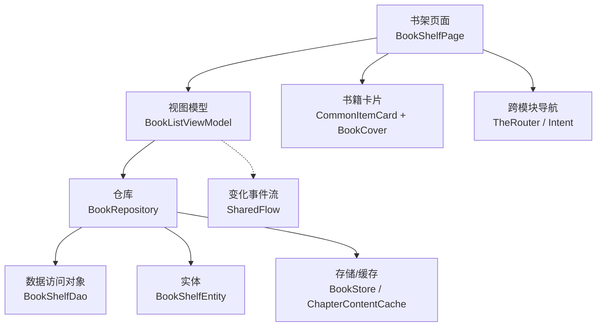
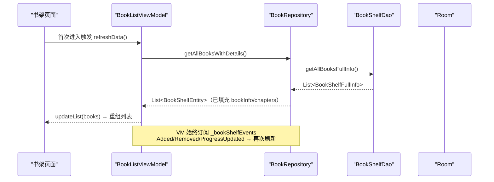
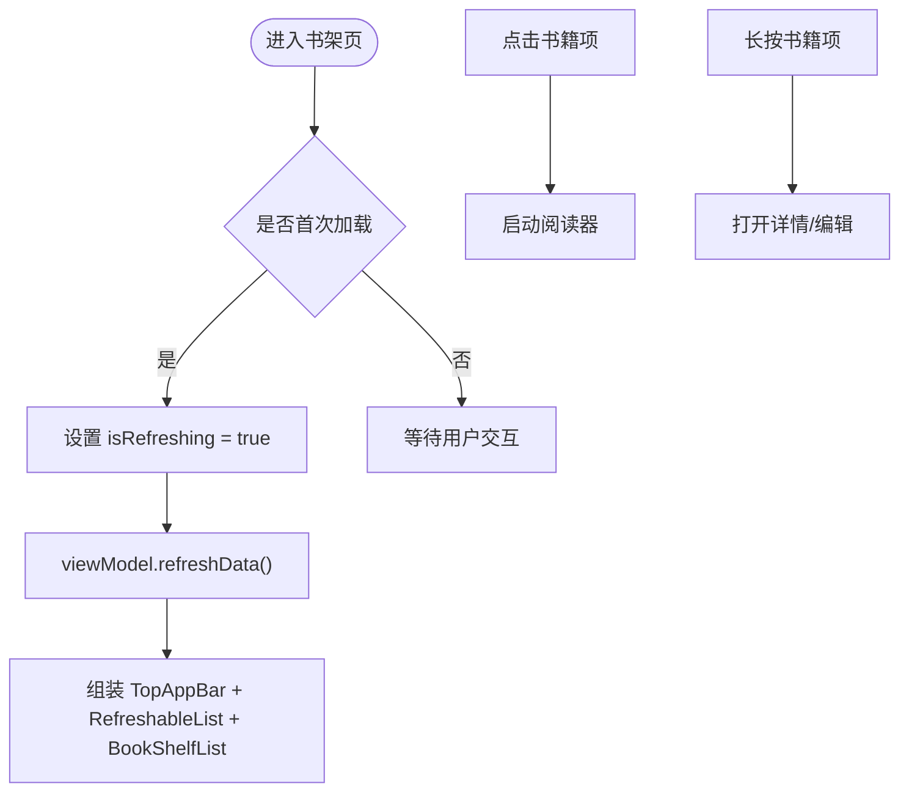
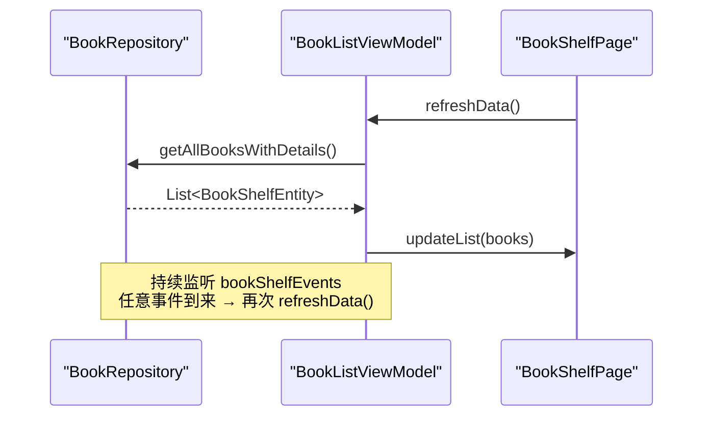
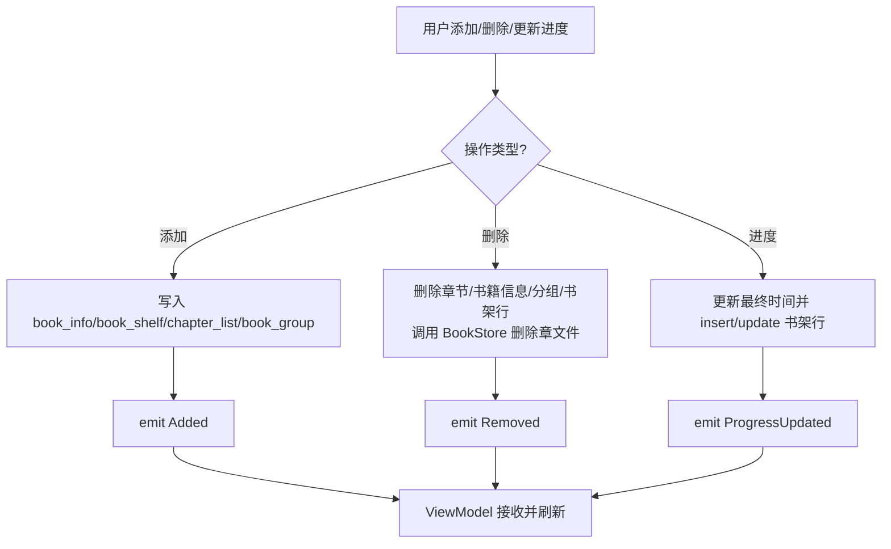
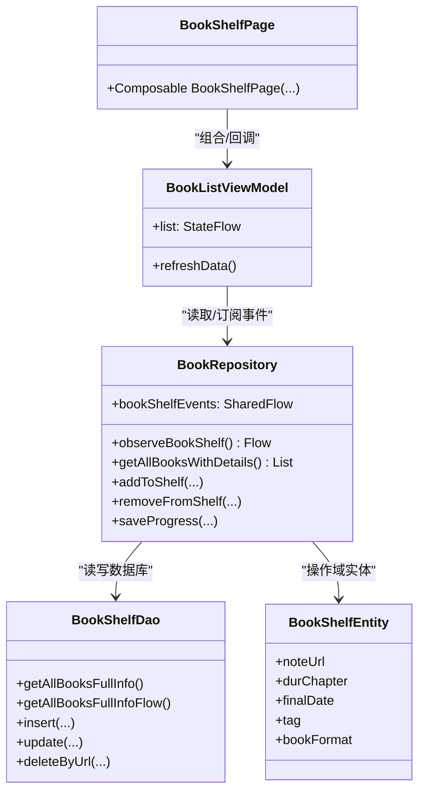

# 书架管理功能

<cite>
**本文引用的文件**
- [BookShelfPage.kt](file://module_book/src/main/java/com/ebook/book/page/BookShelfPage.kt)
- [BookListViewModel.kt](file://module_book/src/main/java/com/ebook/book/mvvm/viewmodel/BookListViewModel.kt)
- [BookRepository.kt](file://lib_book_common/src/main/java/com/ebook/common/repository/BookRepository.kt)
- [BookShelfDao.kt](file://lib_ebook_db/src/main/java/com/ebook/db/dao/BookShelfDao.kt)
- [BookShelfEntity.kt](file://lib_ebook_db/src/main/java/com/ebook/db/entity/BookShelfEntity.kt)
- [BookCover.kt](file://lib_book_common/src/main/java/com/ebook/common/ui/BookCover.kt)
- [CommonUiComponents.kt](file://lib_book_common/src/main/java/com/ebook/common/ui/CommonUiComponents.kt)
- [BookShelfManager.kt](file://lib_book_common/src/main/java/com/ebook/common/manager/BookShelfManager.kt)
</cite>

## 目录
1. [简介](#简介)
2. [项目结构](#项目结构)
3. [核心组件](#核心组件)
4. [架构总览](#架构总览)
5. [详细组件分析](#详细组件分析)
6. [依赖分析](#依赖分析)
7. [性能考虑](#性能考虑)
8. [故障排除指南](#故障排除指南)
9. [结论](#结论)
10. [附录](#附录)

## 简介
本章节面向书架管理功能，系统梳理 BookShelfPage 的数据绑定、用户交互与 MVVM 数据流；解释书籍添加、删除、排序等核心操作及与 BookRepository 的交互；描述书架页面 ViewModel 的状态管理与事件驱动刷新机制；详解书籍卡片（封面）渲染逻辑与性能优化；并补充批量操作、搜索过滤、分类管理等高级能力的实现思路与约束。文档严格基于仓库代码事实进行组织，便于在保留可读性的同时保证技术准确性。

## 项目结构
书架管理横跨“业务模块 UI”“ViewModel 状态编排”“仓库层数据封装”“数据库 DAO/实体”以及“共享 UI 组件”，形成从页面到持久化的一条完整链路：
- UI 层：BookShelfPage（Compose 页面）、共享卡片组件（CommonItemCard、BookCover）
- VM 层：BookListViewModel（BaseRefreshViewModel 派生，负责刷新与事件收集）
- 仓储层：BookRepository（书架 CRUD、事件发布、统一读取章节正文）
- 数据访问层：BookShelfDao、BookShelfEntity（Room DAO/实体，定义书架表结构与查询）
- 辅助能力：BookShelfManager（封装跨搜索/选择流程中「加入书架」相关通用逻辑）

图表来源
- [BookShelfPage.kt:75-176](file://module_book/src/main/java/com/ebook/book/page/BookShelfPage.kt#L75-L176)
- [BookListViewModel.kt:13-57](file://module_book/src/main/java/com/ebook/book/mvvm/viewmodel/BookListViewModel.kt#L13-L57)
- [BookRepository.kt:31-200](file://lib_book_common/src/main/java/com/ebook/common/repository/BookRepository.kt#L31-L200)
- [BookShelfDao.kt:18-109](file://lib_ebook_db/src/main/java/com/ebook/db/dao/BookShelfDao.kt#L18-L109)
- [BookShelfEntity.kt:11-76](file://lib_ebook_db/src/main/java/com/ebook/db/entity/BookShelfEntity.kt#L11-L76)

章节来源
- [BookShelfPage.kt:75-176](file://module_book/src/main/java/com/ebook/book/page/BookShelfPage.kt#L75-L176)
- [BookListViewModel.kt:13-57](file://module_book/src/main/java/com/ebook/book/mvvm/viewmodel/BookListViewModel.kt#L13-L57)
- [BookRepository.kt:31-200](file://lib_book_common/src/main/java/com/ebook/common/repository/BookRepository.kt#L31-L200)
- [BookShelfDao.kt:18-109](file://lib_ebook_db/src/main/java/com/ebook/db/dao/BookShelfDao.kt#L18-L109)
- [BookShelfEntity.kt:11-76](file://lib_ebook_db/src/main/java/com/ebook/db/entity/BookShelfEntity.kt#L11-L76)

## 核心组件
- 书架页面：采用 Compose 的 Scaffold+TopAppBar+RefreshableList，完成顶层布局、下拉刷新、列表展示和条目点击/长按回调。
- 视图模型：继承 BaseRefreshViewModel，集中刷新数据和响应式事件，订阅仓库发布的书架变化事件自动刷新列表。
- 仓库：抽象书架增删改查、阅读进度保存、事件发布；并提供统一的章节内容加载入口（本地书/网络书一致）。
- 数据访问：通过 Room DAO 提供书架全量/观察查询、按 URL 查找、插入更新删除；实体定义书架主键、阅读进度、最后时间、标签、匹配名/作者等字段。
- UI 组件：共享卡片容器 CommonItemCard 承载条目交互；BookCover 以 Coil 加载封面，使用占位图、圆角裁剪与固定缩放策略提升一致性。

章节来源
- [BookShelfPage.kt:75-176](file://module_book/src/main/java/com/ebook/book/page/BookShelfPage.kt#L75-L176)
- [BookListViewModel.kt:13-57](file://module_book/src/main/java/com/ebook/book/mvvm/viewmodel/BookListViewModel.kt#L13-L57)
- [BookRepository.kt:31-200](file://lib_book_common/src/main/java/com/ebook/common/repository/BookRepository.kt#L31-L200)
- [BookShelfDao.kt:18-109](file://lib_ebook_db/src/main/java/com/ebook/db/dao/BookShelfDao.kt#L18-L109)
- [BookShelfEntity.kt:11-76](file://lib_ebook_db/src/main/java/com/ebook/db/entity/BookShelfEntity.kt#L11-L76)
- [BookCover.kt:11-41](file://lib_book_common/src/main/java/com/ebook/common/ui/BookCover.kt#L11-L41)
- [CommonUiComponents.kt:100-146](file://lib_book_common/src/main/java/com/ebook/common/ui/CommonUiComponents.kt#L100-L146)

## 架构总览
书架功能遵循严格的 MVVM 分层，并通过 SharedFlow 实现事件解耦：
- View（BookShelfPage）只负责组合 UI 与处理用户输入，将数据请求交给 ViewModel。
- ViewModel（BookListViewModel）持有列表状态，对外暴露可被 observe/listen 的状态流；内部订阅仓库事件，触发统一刷新流程。
- Repository（BookRepository）隔离底层数据源，封装书架操作并发出事件；统一章节读取管线屏蔽本地/网络差异。
- DAO/Entity（BookShelfDao/BookShelfEntity）直接对接 Room 数据库，保证关系一致性、排序与事务完整性。

图表来源
- [BookShelfPage.kt:97-100](file://module_book/src/main/java/com/ebook/book/page/BookShelfPage.kt#L97-L100)
- [BookListViewModel.kt:28-56](file://module_book/src/main/java/com/ebook/book/mvvm/viewmodel/BookListViewModel.kt#L28-L56)
- [BookRepository.kt:78-104](file://lib_book_common/src/main/java/com/ebook/common/repository/BookRepository.kt#L78-L104)
- [BookShelfDao.kt:31-33](file://lib_ebook_db/src/main/java/com/ebook/db/dao/BookShelfDao.kt#L31-L33)

章节来源
- [BookShelfPage.kt:97-100](file://module_book/src/main/java/com/ebook/book/page/BookShelfPage.kt#L97-L100)
- [BookListViewModel.kt:28-56](file://module_book/src/main/java/com/ebook/book/mvvm/viewmodel/BookListViewModel.kt#L28-L56)
- [BookRepository.kt:78-104](file://lib_book_common/src/main/java/com/ebook/common/repository/BookRepository.kt#L78-L104)
- [BookShelfDao.kt:31-33](file://lib_ebook_db/src/main/java/com/ebook/db/dao/BookShelfDao.kt#L31-L33)

## 详细组件分析

### BookShelfPage：数据绑定与用户交互设计
- 顶栏：标题文字 + 两个 action 图标（导入本地书、下载管理）；下载角标根据 DownloadManageViewModel 的 remainingCount 自动显示任务剩余数。
- 刷新流程：LaunchedEffect 在首次组合时设置 isRefreshing=true 并调用 viewModel.refreshData()；RefreshableList 的下拉刷新同样委托给 viewModel，结束后恢复状态。
- 列表展示：BookShelfList 使用 LazyColumn，按 common tokens 设定间距；每行以 noteUrl 为 key 减少重组开销。
- 用户交互：
  - 单击：跳转到阅读器页，携带 data_key 用于后续读档。
  - 长按：跳转详情/编辑界面，传入 data_key 以便跨模块路由。

章节来源
- [BookShelfPage.kt:75-176](file://module_book/src/main/java/com/ebook/book/page/BookShelfPage.kt#L75-L176)

### BookListViewModel：MVVM 状态管理与数据流
- 职责边界：负责刷新书架列表；订阅仓库变化事件（Added/Removed/ProgressUpdated），统一触发刷新，避免在 UI 层散落订阅逻辑。
- 数据获取：refreshData 中调用仓库的一次性查询（getAllBooksWithDetails），得到已关联 bookInfo 且章节已显式排序的结果，随后 updateList。
- 错误复位：异常捕获后仍会 stopRefresh，确保刷新指示器不被卡住（包括空书架场景）。

图表来源
- [BookListViewModel.kt:28-56](file://module_book/src/main/java/com/ebook/book/mvvm/viewmodel/BookListViewModel.kt#L28-L56)
- [BookRepository.kt:78-104](file://lib_book_common/src/main/java/com/ebook/common/repository/BookRepository.kt#L78-L104)

章节来源
- [BookListViewModel.kt:28-56](file://module_book/src/main/java/com/ebook/book/mvvm/viewmodel/BookListViewModel.kt#L28-L56)

### BookRepository：书架操作与事件发布
- 读取：observeBookShelf 提供 Flow 式观察；getAllBooksWithDetails 一次性查询，附带孤立记录清理与章节显式排序（按章节序号）。
- 写入：addToShelf 级联写入 book_info、book_shelf、chapter_list 与 book_group；removeFromShelf 删除章节、书籍信息、分组行与书架行，并调用 BookStore 删除章文件、失效内存缓存。
- 事件：所有写操作完成后通过 SharedFlow 发出 Added/Removed/ProgressUpdated 事件；VM 侧统一响应。
- 章节读取：loadChapter 是本地/网络统一入口，读取后规范化段落，再写入 ChapterContentCache。

图表来源
- [BookRepository.kt:118-161](file://lib_book_common/src/main/java/com/ebook/common/repository/BookRepository.kt#L118-L161)
- [BookRepository.kt:180-199](file://lib_book_common/src/main/java/com/ebook/common/repository/BookRepository.kt#L180-L199)

章节来源
- [BookRepository.kt:118-161](file://lib_book_common/src/main/java/com/ebook/common/repository/BookRepository.kt#L118-L161)
- [BookRepository.kt:180-199](file://lib_book_common/src/main/java/com/ebook/common/repository/BookRepository.kt#L180-L199)

### 持久化与排序：DAO 与实体
- 实体 BookShelfEntity：主键 note_url；记录当前章节、页码、最后阅读时间、标签、书籍格式、文本编码、匹配名/作者等；包含 @Ignore 字段用于 UI 填充（bookInfo/chapterList）。
- DAO BookShelfDao：提供带事务的全量查询（含 Relation 拼装）、Flow 观察、按 URL 查询、upsert、更新与删除；默认排序为 final_date DESC，保证最近阅读优先。
- 关联与一致：@Relation 关联无 ORDER BY，因此由 Repository 侧对 chapterList 按 durChapterIndex 做显式排序；孤立记录（info 为 null）由一次性查询回收清理。

章节来源
- [BookShelfEntity.kt:11-76](file://lib_ebook_db/src/main/java/com/ebook/db/entity/BookShelfEntity.kt#L11-L76)
- [BookShelfDao.kt:18-109](file://lib_ebook_db/src/main/java/com/ebook/db/dao/BookShelfDao.kt#L18-L109)
- [BookRepository.kt:78-104](file://lib_book_common/src/main/java/com/ebook/common/repository/BookRepository.kt#L78-L104)

### 书籍卡片组件：渲染与性能
- CommonItemCard：提供统一卡片容器，支持单击/长按、阴影层级与内边距可调；通过 combinedClickable/clickable 决定交互模式，保持 ripple 随圆角裁剪，视觉统一。
- BookCover：基于 Coil 的 AsyncImage，统一设置 placeholder/error 占位图、固定缩放（Crop）、圆角裁剪；避免重复编写图片加载逻辑。
- 性能要点：LazyColumn 使用 noteUrl 作为 item key 防止重组抖动；封面使用统一占位图和裁剪策略降低绘制压力；共享设计 token 控制间距/圆角，减少不必要重绘区域。

章节来源
- [CommonUiComponents.kt:100-146](file://lib_book_common/src/main/java/com/ebook/common/ui/CommonUiComponents.kt#L100-L146)
- [BookCover.kt:11-41](file://lib_book_common/src/main/java/com/ebook/common/ui/BookCover.kt#L11-L41)
- [BookShelfPage.kt:182-200](file://module_book/src/main/java/com/ebook/book/page/BookShelfPage.kt#L182-L200)

### 与外部模块的交互（下载/详情/导入）
- 导入本地书：页面通过 Activity 跳转 ImportBookActivity，不在本页面维护导入结果流，保持职责单一。
- 下载管理：点击图标经 TheRouter 跳转，角标展示下载队列剩余数（来自 DownloadManageViewModel）。
- 书籍详情：长按书籍通过 BitIntentDataManager 传递序列化后的数据，再以 TheRouter 的 detail 路径导航，解耦模块间强耦合。

章节来源
- [BookShelfPage.kt:107-172](file://module_book/src/main/java/com/ebook/book/page/BookShelfPage.kt#L107-L172)

### 高级功能说明（批量化、搜索、分类）
- 批量操作：仓库侧提供 insertAll，可配合 UI 勾选多项后合并提交；删除走 removeShelf 单条路径或基于 DAO 按 URL 批量取回后进行循环删除；建议在 UI 上增加批量确认与失败重试提示。
- 搜索过滤：书架展示未内置搜索框；若需筛选，可在 VM 层维护一个 filtered list 派生自当前列表（如按名称/作者/标签），注意将搜索状态放在 VM 中以保证旋转/切 Tab 不丢失。
- 分类管理：实体包含 tag 字段，适合用于分类标记；可在 VM 层基于 tag 分组展示或在 DAO 层扩展分组聚合查询；如需跨模块分类联动，可将 tag 纳入共享领域模型并由多个页面消费。

[本节为概念性指导，不直接分析具体文件]

## 依赖分析
组件之间的依赖方向清晰且低耦合：
- BookShelfPage 仅依赖 BookListViewModel 与共享 UI 组件，通过 Hilt 注入；跳转通过 TheRouter/Intent 解耦模块间引用。
- BookListViewModel 依赖 BookRepository 暴露的状态与事件；通过 viewModelScope 安全协程。
- BookRepository 依赖 DAO、存储与解析器映射，但不感知 UI。
- DAO 与实体由 lib_ebook_db 提供，Repository 对其稳定依赖。

图表来源
- [BookShelfPage.kt:75-176](file://module_book/src/main/java/com/ebook/book/page/BookShelfPage.kt#L75-L176)
- [BookListViewModel.kt:23-56](file://module_book/src/main/java/com/ebook/book/mvvm/viewmodel/BookListViewModel.kt#L23-L56)
- [BookRepository.kt:41-161](file://lib_book_common/src/main/java/com/ebook/common/repository/BookRepository.kt#L41-L161)
- [BookShelfDao.kt:18-109](file://lib_ebook_db/src/main/java/com/ebook/db/dao/BookShelfDao.kt#L18-L109)
- [BookShelfEntity.kt:11-76](file://lib_ebook_db/src/main/java/com/ebook/db/entity/BookShelfEntity.kt#L11-L76)

章节来源
- [BookShelfPage.kt:75-176](file://module_book/src/main/java/com/ebook/book/page/BookShelfPage.kt#L75-L176)
- [BookListViewModel.kt:23-56](file://module_book/src/main/java/com/ebook/book/mvvm/viewmodel/BookListViewModel.kt#L23-L56)
- [BookRepository.kt:41-161](file://lib_book_common/src/main/java/com/ebook/common/repository/BookRepository.kt#L41-L161)
- [BookShelfDao.kt:18-109](file://lib_ebook_db/src/main/java/com/ebook/db/dao/BookShelfDao.kt#L18-L109)
- [BookShelfEntity.kt:11-76](file://lib_ebook_db/src/main/java/com/ebook/db/entity/BookShelfEntity.kt#L11-L76)

## 性能考虑
- 懒加载与虚拟滚动：使用 LazyColumn，仅在可见区域渲染条目；item key 使用稳定的 noteUrl 避免错位重建。
- 统一封面渲染：BookCover 集中处理占位、错误、缩放策略，减少各页面重复实现与不一致导致的重绘。
- 事件驱动的增量刷新：仓库发出 Added/Removed/ProgressUpdated 事件，VM 侧统一刷新，避免页面轮询造成额外开销。
- IO 调度：仓库所有磁盘/网络操作均切换到 IO 线程；Room 查询与写入自然在主库线程外执行，避免阻塞 UI。
- 去重与排序：一次性查询时显式对 chapterList 按索引排序，修复历史数据可能的乱序问题，避免页面二次排序导致卡顿。

[本节为总体性能建议，不直接分析特定文件]

## 故障排除指南
- 下拉刷新不停止：检查 refreshData 是否在 finally 中调用停止刷新；VM 中已在异常分支也复位，确保 UI 状态一致。
- 书架事件未触发刷新：确认 VM 是否在 init 时订阅了 repository 的事件流；新增/删除/进度更新都应触发 refreshData。
- 章节顺序错乱：确认仓库是否对所有返回章节按 durChapterIndex 排序；若在 UI 层再次排序可能覆盖预期顺序。
- 离线章节缺失：章节正文统一由 loadChapter 负责；若内容空白，会被按“内容缺失”处理，不落缓存；检查 ChapterReader 与 BookStore 是否存在相应章文件。
- 下载入口角标不更新：确认 DownloadManageViewModel 的 remainingCount 是否正确收集与发布；UI 侧通过 collectAsState 订阅并显示 Badge。

章节来源
- [BookListViewModel.kt:28-56](file://module_book/src/main/java/com/ebook/book/mvvm/viewmodel/BookListViewModel.kt#L28-L56)
- [BookRepository.kt:118-161](file://lib_book_common/src/main/java/com/ebook/common/repository/BookRepository.kt#L118-L161)
- [BookRepository.kt:180-199](file://lib_book_common/src/main/java/com/ebook/common/repository/BookRepository.kt#L180-L199)
- [BookShelfPage.kt:125-142](file://module_book/src/main/java/com/ebook/book/page/BookShelfPage.kt#L125-L142)

## 结论
书架管理功能通过清晰的 MVVM 分层、稳定的事件驱动机制与标准化的 UI 组件，实现了可维护、可扩展的阅读管理体验。ViewModel 聚焦状态编排与事件收口，Repository 统一数据与事件输出，DAO/实体负责持久化保障，UI 仅关注组合与交互。在此基础上，借助批量操作、搜索过滤与分类管理等扩展点，可持续增强书架管理能力。

[本节总结性内容，不直接分析特定文件]

## 附录
- 相关设计约定与架构决策可参考仓库文档，以保障长期演进一致性：
  - MVVM 基类与命令通道约定（Hilt + BaseMvvmRefreshActivity/ViewModel）
  - 共享 UI 组件规范（ADR-0006）
  - 异步与事件总线约定（Coroutines + Flow + SharedFlow）
  - 前台服务与下载配额（ADR-0018）
  - 多书源规划（ADR-0016，尚未实现，请勿误用）
  - 本地书导入与正文化清洗、存储层约定（见 superpowers/specs/plans 文档）

[本节为指引性说明，不直接分析特定文件]