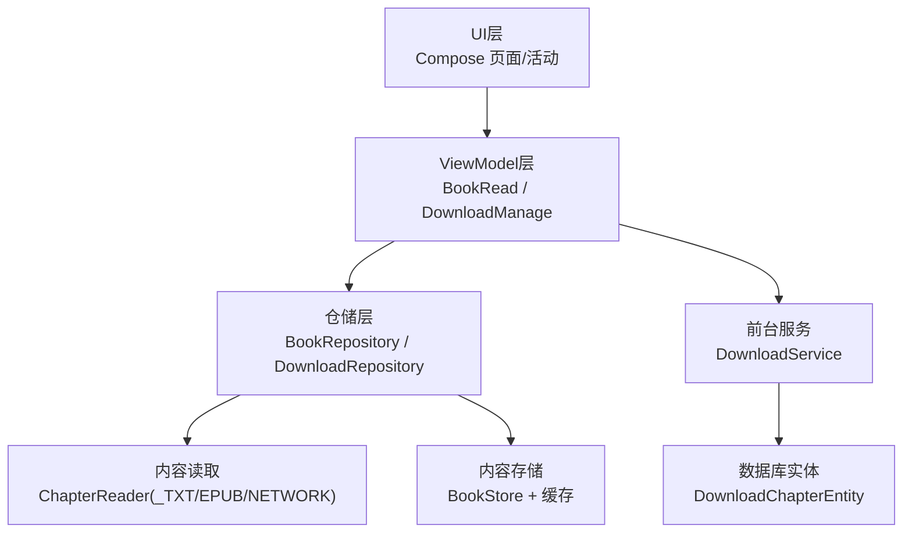
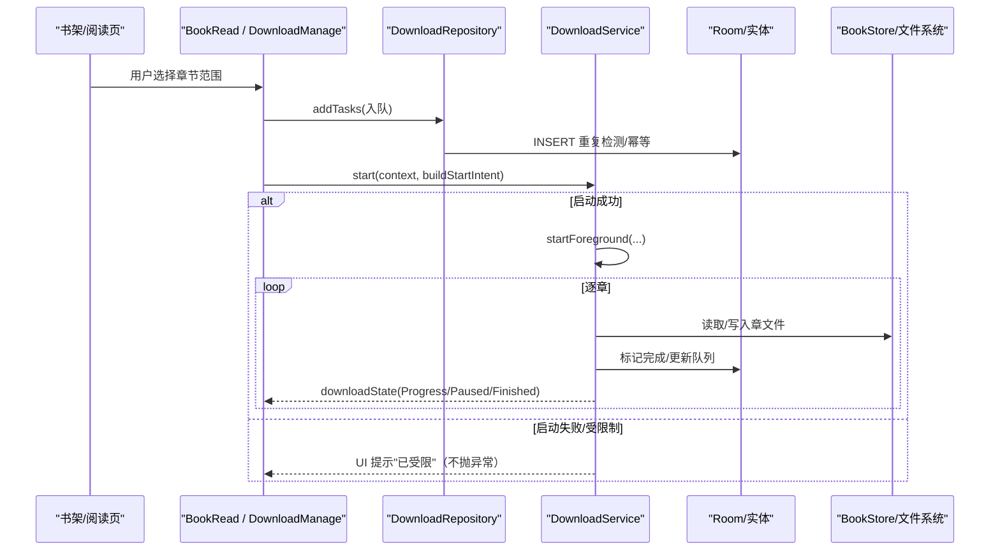
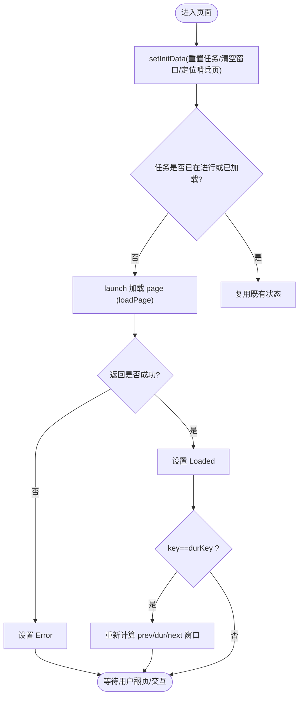
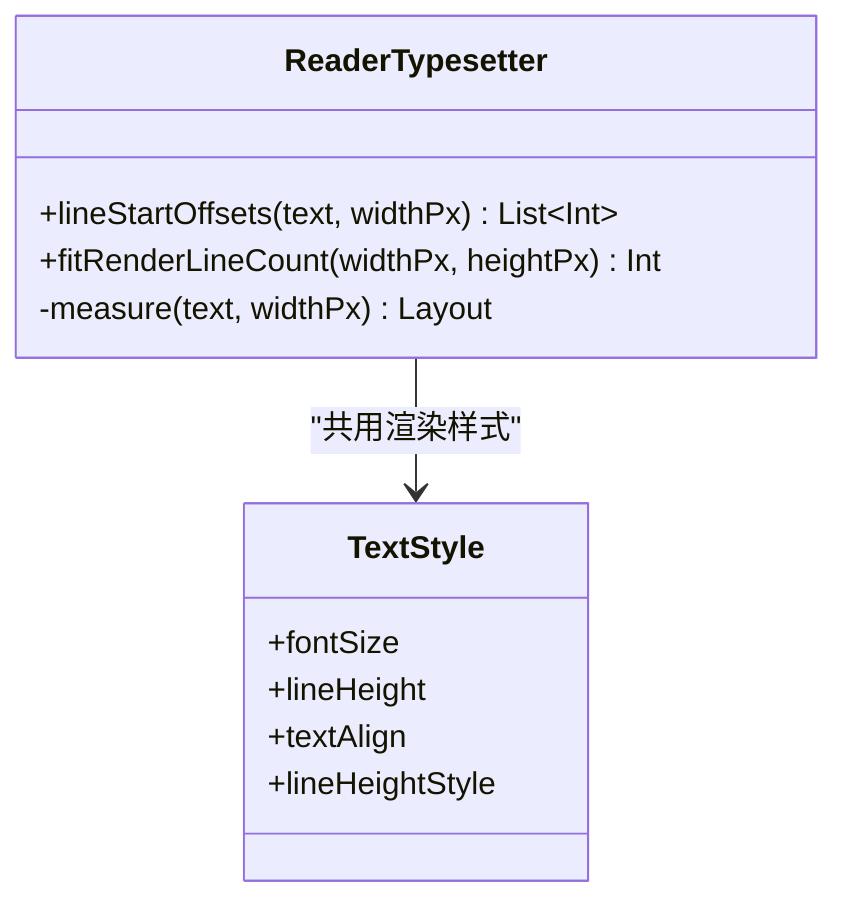
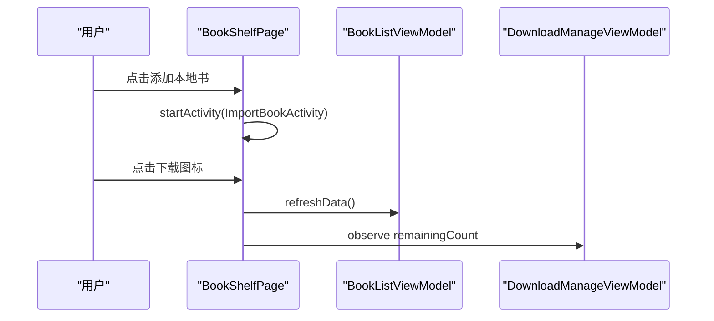
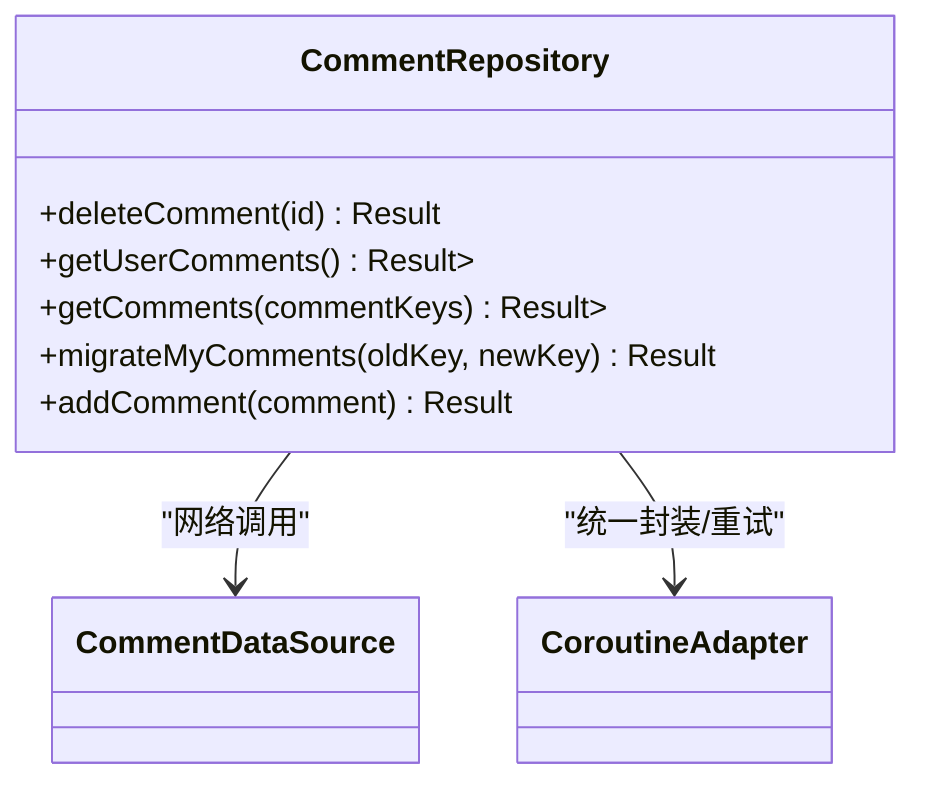
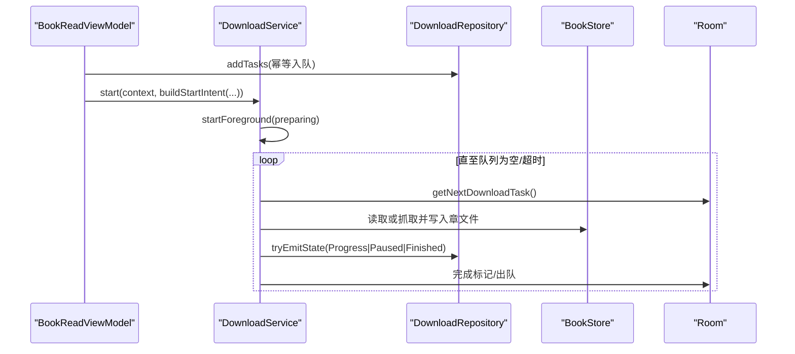
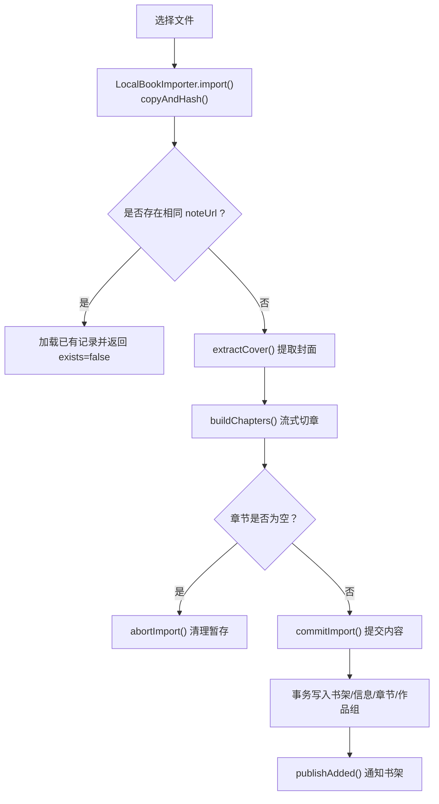
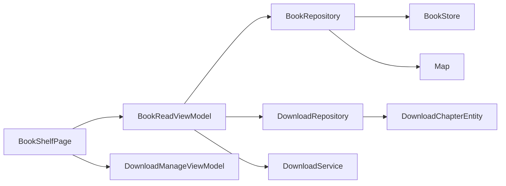

# 书籍模块（module_book）

<cite>
**本文引用的文件列表**
- [ReaderPager.kt](file://module_book/src/main/java/com/ebook/book/reader/ReaderPager.kt)
- [ReaderTypesetter.kt](file://module_book/src/main/java/com/ebook/book/reader/ReaderTypesetter.kt)
- [BookShelfPage.kt](file://module_book/src/main/java/com/ebook/book/page/BookShelfPage.kt)
- [BookReadViewModel.kt](file://module_book/src/main/java/com/ebook/book/mvvm/viewmodel/BookReadViewModel.kt)
- [DownloadService.kt](file://module_book/src/main/java/com/ebook/book/service/DownloadService.kt)
- [DownloadManageViewModel.kt](file://module_book/src/main/java/com/ebook/book/mvvm/viewmodel/DownloadManageViewModel.kt)
- [DownloadRepository.kt](file://module_book/src/main/java/com/ebook/book/repository/DownloadRepository.kt)
- [ChapterReader.kt](file://lib_book_common/src/main/java/com/ebook/common/analyze/local/ChapterReader.kt)
- [TxtSourceReader.kt](file://lib_book_common/src/main/java/com/ebook/common/analyze/local/TxtSourceReader.kt)
- [EpubSourceReader.kt](file://lib_book_common/src/main/java/com/ebook/common/analyze/local/EpubSourceReader.kt)
- [ContentStoreModule.kt](file://lib_book_common/src/main/java/com/ebook/common/di/ContentStoreModule.kt)
- [LocalBookImporter.kt](file://lib_book_common/src/main/java/com/ebook/common/importer/LocalBookImporter.kt)
- [CommentRepository.kt](file://lib_book_common/src/main/java/com/ebook/common/repository/CommentRepository.kt)
- [DownloadChapterEntity.kt](file://lib_ebook_db/src/main/java/com/ebook/db/entity/DownloadChapterEntity.kt)
- [AGENTS.md](file://AGENTS.md)
- [CONTEXT.md](file://CONTEXT.md)
- [0017-local-book-multi-format-support.md](file://docs/adr/0017-local-book-multi-format-support.md)
- [0023-import-time-duplicate-disposition.md](file://docs/adr/0023-import-time-duplicate-disposition.md)
</cite>

## 目录
1. [简介](#简介)
2. [项目结构](#项目结构)
3. [核心组件](#核心组件)
4. [架构总览](#架构总览)
5. [详细组件分析](#详细组件分析)
6. [依赖关系分析](#依赖关系分析)
7. [性能与内存优化](#性能与内存优化)
8. [故障排查指南](#故障排查指南)
9. [结论](#结论)

## 简介
本文件对书籍模块进行系统化文档化，覆盖阅读器分页加载、内容排版与本地字体、书架页交互、评论系统 MVVM、下载服务前台任务、以及完整的本地书导入流程和阅读状态同步机制。本书籍模块基于 Compose UI、Hilt 注入、Kotlin 协程与 Flow，遵循仓库约定的 MVVM、离线下载与章节内容统一读取规范。

## 项目结构
- 业务层：
  - 阅读页面与交互：[ReadBookActivity]、[ReaderPager.kt]、[ReaderTypesetter.kt]、[ReaderPanels.kt]（未在正文引用但参与渲染面板）
  - 书架展示与操作：[BookShelfPage.kt]
  - ViewModel：[BookReadViewModel.kt]、[DownloadManageViewModel.kt]
  - 服务与仓储：[DownloadService.kt]、[DownloadRepository.kt]
- 共享能力：
  - 内容读取接口与本地解析器：[ChapterReader.kt]、[TxtSourceReader.kt]、[EpubSourceReader.kt]
  - 注入装配点：[ContentStoreModule.kt]
  - 导入流水线：[LocalBookImporter.kt]
  - 评论仓储：[CommentRepository.kt]
- 数据模型：
  - 下载任务实体：[DownloadChapterEntity.kt]
- 设计约束与规范：
  - AGENTS 约定：[AGENTS.md]
  - 领域术语：[CONTEXT.md]
  - ADR：[0017-local-book-multi-format-support.md]、[0023-import-time-duplicate-disposition.md]

图表来源
- [ContentStoreModule.kt:51-87](file://lib_book_common/src/main/java/com/ebook/common/di/ContentStoreModule.kt#L51-L87)
- [DownloadRepository.kt:35-172](file://module_book/src/main/java/com/ebook/book/repository/DownloadRepository.kt#L35-L172)

章节来源
- [AGENTS.md:39-68](file://AGENTS.md#L39-L68)

## 核心组件
- 阅读器分页控制器与渲染：
  - [ReaderPager.kt] 实现三页窗口状态机、去重加载、翻页动画、错误重试与进度上报
  - [ReaderTypesetter.kt] 通过 TextMeasurer/Density 提供稳定一致的断行与可容纳行数测量，保证“分页计算”和“实际渲染”使用同一样式
- 书架与交互：
  - [BookShelfPage.kt] 提供顶栏操作、刷新容器、列表项点击/长按、下载入口角标
- 下载服务与状态管理：
  - [DownloadService.kt] 前台 dataSync 服务，按章抓取并维护队列，处理超时配额与重启续跑
  - [DownloadRepository.kt] 下载任务入队、查询、计数及响应式状态通道
  - [DownloadManageViewModel.kt] 下载管理页面的分组视图与控制动作
- 导入流水线与格式支持：
  - [ContentStoreModule.kt] 以双 map 分别注入“阅读阶段内容读取”和“导入链路源文件读取”
  - [LocalBookImporter.kt] “拷贝即哈希 → 切分写盘 → 事务批量落库”的三步导入
  - [TxtSourceReader.kt]/[EpubSourceReader.kt] 本地书格式解析与封面提取
- 评论与 MVVM：
  - [CommentRepository.kt] 围绕 CommentDataSource 封装评论增删查与迁移，配合 UI ViewModel 形成清晰的数据流

章节来源
- [ReaderPager.kt:64-200](file://module_book/src/main/java/com/ebook/book/reader/ReaderPager.kt#L64-L200)
- [ReaderTypesetter.kt:17-135](file://module_book/src/main/java/com/ebook/book/reader/ReaderTypesetter.kt#L17-L135)
- [BookShelfPage.kt:65-176](file://module_book/src/main/java/com/ebook/book/page/BookShelfPage.kt#L65-L176)
- [DownloadService.kt:39-200](file://module_book/src/main/java/com/ebook/book/service/DownloadService.kt#L39-L200)
- [DownloadRepository.kt:21-172](file://module_book/src/main/java/com/ebook/book/repository/DownloadRepository.kt#L21-L172)
- [DownloadManageViewModel.kt:23-159](file://module_book/src/main/java/com/ebook/book/mvvm/viewmodel/DownloadManageViewModel.kt#L23-L159)
- [ContentStoreModule.kt:51-87](file://lib_book_common/src/main/java/com/ebook/common/di/ContentStoreModule.kt#L51-L87)
- [LocalBookImporter.kt:34-161](file://lib_book_common/src/main/java/com/ebook/common/importer/LocalBookImporter.kt#L34-L161)
- [TxtSourceReader.kt:12-59](file://lib_book_common/src/main/java/com/ebook/common/analyze/local/TxtSourceReader.kt#L12-L59)
- [EpubSourceReader.kt:14-103](file://lib_book_common/src/main/java/com/ebook/common/analyze/local/EpubSourceReader.kt#L14-L103)
- [CommentRepository.kt:16-78](file://lib_book_common/src/main/java/com/ebook/common/repository/CommentRepository.kt#L16-L78)

## 架构总览
本模块遵循 MVVM 分层：UI（Compose Activity/Page）持有 ViewModel；ViewModel 聚合仓储（Repository）与服务调度；仓储对接数据库与内容存储；服务承担耗时网络与磁盘 IO 的前台执行。

图表来源
- [DownloadService.kt:117-200](file://module_book/src/main/java/com/ebook/book/service/DownloadService.kt#L117-L200)
- [DownloadRepository.kt:81-99](file://module_book/src/main/java/com/ebook/book/repository/DownloadRepository.kt#L81-L99)
- [BookReadViewModel.kt:82-90](file://module_book/src/main/java/com/ebook/book/mvvm/viewmodel/BookReadViewModel.kt#L82-L90)

章节来源
- [AGENTS.md:124-139](file://AGENTS.md#L124-L139)

## 详细组件分析

### 阅读器：ReaderPager 分页加载机制
- 三页窗口模型：当前（dur）、上一页（prev）、下一页（next），对齐原 ContentSwitchView 行为与阈值/手势锁/动画期防重入
- 并发控制：以 ReaderPageKey(chapterIndex, pageIndex) 去重进行中任务与已加载页，取消跳转后全部在途任务；完成时若 key==durKey 立即刷新窗口
- 容错与恢复：Loaded/Error/Loading 状态流转，支持 reload 重试；窗口收敛避免自指或双向都为空的死页
- 进度与标题：setInitData 初始化并回调 onProgress，便于菜单标题与滑条同步

图表来源
- [ReaderPager.kt:101-200](file://module_book/src/main/java/com/ebook/book/reader/ReaderPager.kt#L101-L200)

章节来源
- [ReaderPager.kt:64-200](file://module_book/src/main/java/com/ebook/book/reader/ReaderPager.kt#L64-L200)

### 阅读器：ReaderTypesetter 内容渲染算法与本地字体支持
- 单一事实源：同一 TextStyle 同时用于分页测量与渲染，杜绝“算出一行、画出另一行”的不一致
- 关键方法：
  - lineStartOffsets：对整章按文本测量得出每行起始偏移，供分页切片
  - fitRenderLineCount：实测每一行底部位置，返回宽度/高度下能放下的渲染行数
- 探针与密度：使用固定探针文本与 LocalDensity 获取精确度量；TextMeasurer 无缓存确保线程安全
- 本地字体：样式通过 readerBodyTextStyle 统一设置字号与行高；Compose 默认使用系统字体资源，如需自定义字体需在上层组合区域配置相应 FontFamily（本项目中未内嵌定制字体，此处强调样式统一而非新增字体设施）

图表来源
- [ReaderTypesetter.kt:17-135](file://module_book/src/main/java/com/ebook/book/reader/ReaderTypesetter.kt#L17-L135)

章节来源
- [ReaderTypesetter.kt:17-135](file://module_book/src/main/java/com/ebook/book/reader/ReaderTypesetter.kt#L17-L135)

### 书架页：数据绑定与用户交互
- 顶栏：导入按钮直接拉起 ImportBookActivity；下载图标通过 TheRouter 进入下载管理页，并按 DownloadManageViewModel.remainingCount 显示角标
- 刷新容器：继承 lib_common 的 RefreshableList，结合 MvvmBinder 自动处理刷新信号
- 列表交互：单击打开阅读页并通过 BitIntentDataManager 传递 BookShelfEntity；长按进入详情页

图表来源
- [BookShelfPage.kt:65-176](file://module_book/src/main/java/com/ebook/book/page/BookShelfPage.kt#L65-L176)
- [DownloadManageViewModel.kt:69-76](file://module_book/src/main/java/com/ebook/book/mvvm/viewmodel/DownloadManageViewModel.kt#L69-L76)

章节来源
- [BookShelfPage.kt:65-176](file://module_book/src/main/java/com/ebook/book/page/BookShelfPage.kt#L65-L176)

### 评论系统 MVVM 架构
- CommentRepository 封装网络调用（CommentDataSource）、统一错误处理与 DTO 映射（toBookComment/toApiComment）
- 评论类型：我的评论列表、按键并集查询、删除、迁移（M2：保留换源后历史）
- UI 侧通过 ViewModel 收集 Repository 的 Result/List，呈现并触发增删改

图表来源
- [CommentRepository.kt:16-78](file://lib_book_common/src/main/java/com/ebook/common/repository/CommentRepository.kt#L16-L78)

章节来源
- [CommentRepository.kt:16-78](file://lib_book_common/src/main/java/com/ebook/common/repository/CommentRepository.kt#L16-L78)

### 前台下载服务：DownloadService
- 契约：通过 Intent 控制开始/暂停/取消；持久化通知；前台 dataSync 服务
- 关键逻辑：
  - 构造并启动前台通知（startForeground）
  - 解析携带章节列表，加入队列并循环抓取
  - 配额超时（onTimeout）快速收尾，不清空队列，提示用户稍后继续
  - 启动被拒或服务不可用时，保持幂等与健壮性（不再自动续跑）
- 与 UI 协作：状态通过 DownloadRepository.tryEmitState 同步落入 replay 缓冲，避免销毁竞态

图表来源
- [DownloadService.kt:117-200](file://module_book/src/main/java/com/ebook/book/service/DownloadService.kt#L117-L200)
- [DownloadRepository.kt:158-172](file://module_book/src/main/java/com/ebook/book/repository/DownloadRepository.kt#L158-L172)
- [DownloadChapterEntity.kt:10-86](file://lib_ebook_db/src/main/java/com/ebook/db/entity/DownloadChapterEntity.kt#L10-L86)

章节来源
- [DownloadService.kt:39-200](file://module_book/src/main/java/com/ebook/book/service/DownloadService.kt#L39-L200)
- [DownloadRepository.kt:158-172](file://module_book/src/main/java/com/ebook/book/repository/DownloadRepository.kt#L158-L172)
- [DownloadChapterEntity.kt:10-86](file://lib_ebook_db/src/main/java/com/ebook/db/entity/DownloadChapterEntity.kt#L10-L86)
- [AGENTS.md:124-139](file://AGENTS.md#L124-L139)

### 本地书籍导入流程与阅读状态同步
- 格式支持：TXT 与 EPUB，分别由 TxtSourceReader 与 EpubSourceReader 实现 SourceReader；通过 ContentStoreModule 的双 map 解耦导入与阅读阶段读取
- 导入三步：
  1) 拷贝即哈希（MD5 作为内容 id）
  2) 后台切段并写章文件（暂存目录下）
  3) 一次性事务批量写入 bookShelf、bookInfo、chapterList、bookGroup
- 判重处置（ADR-0023）：先导入新条目，再根据 comment_key 判断命中情况，提供继续添加/智能合并/覆盖/跳过，覆盖前吸收旧关联键
- 阅读状态同步：
  - BookReadViewModel.updateProgress/saveProgress 驱动书架最终阅读时间、章序与页码持久化
  - loadChapter 统一走 ChapterReader 路由与章节缓存（ChapterContentCache），规范化后供渲染

图表来源
- [LocalBookImporter.kt:34-161](file://lib_book_common/src/main/java/com/ebook/common/importer/LocalBookImporter.kt#L34-L161)
- [TxtSourceReader.kt:12-59](file://lib_book_common/src/main/java/com/ebook/common/analyze/local/TxtSourceReader.kt#L12-L59)
- [EpubSourceReader.kt:14-103](file://lib_book_common/src/main/java/com/ebook/common/analyze/local/EpubSourceReader.kt#L14-L103)
- [ContentStoreModule.kt:51-87](file://lib_book_common/src/main/java/com/ebook/common/di/ContentStoreModule.kt#L51-L87)
- [BookReadViewModel.kt:30-105](file://module_book/src/main/java/com/ebook/book/mvvm/viewmodel/BookReadViewModel.kt#L30-L105)

章节来源
- [0023-import-time-duplicate-disposition.md](file://docs/adr/0023-import-time-duplicate-disposition.md)
- [0017-local-book-multi-format-support.md](file://docs/adr/0017-local-book-multi-format-support.md)
- [LocalBookImporter.kt:34-161](file://lib_book_common/src/main/java/com/ebook/common/importer/LocalBookImporter.kt#L34-L161)
- [BookReadViewModel.kt:30-105](file://module_book/src/main/java/com/ebook/book/mvvm/viewmodel/BookReadViewModel.kt#L30-L105)

## 依赖关系分析
- 注入与装配：
  - ContentStoreModule 提供 BookStore、ChapterSplitter、ChapterContentCache、章节读取器 Map 与导入用源解析器 Map
- 层级依赖：
  - UI 依赖 ViewModel
  - ViewModel 依赖 Repository
  - Repository 依赖 DAO + BookStore + ChapterReader
  - 服务（DownloadService）直接与仓储、文件系统交互，并通过共享实体表维持一致性

图表来源
- [ContentStoreModule.kt:51-87](file://lib_book_common/src/main/java/com/ebook/common/di/ContentStoreModule.kt#L51-L87)
- [DownloadRepository.kt:35-172](file://module_book/src/main/java/com/ebook/book/repository/DownloadRepository.kt#L35-L172)

章节来源
- [ContentStoreModule.kt:51-87](file://lib_book_common/src/main/java/com/ebook/common/di/ContentStoreModule.kt#L51-L87)

## 性能与内存优化
- 分页测量优化：
  - ReaderTypesetter.fitRenderLineCount 通过探测真实渲染结果获取可容纳行数，避免近似公式误差累积导致的错位与跳行
  - lineStartOffsets 按文本测量输出每行起始偏移，利于分页取连续子串且原样保留段落分隔符
- 并发与去重：
  - ReaderPagerController 通过 ReaderPageKey 去重进行中任务与已完成页，避免频繁回翻造成的重复抓取/重排
  - 跳转时取消所有在途任务，防止并发竞争与状态错乱
- 缓存策略：
  - BookRepository.loadChapter 经 ChapterContentCache 缓存段落数据，减少重复读盘/网络开销
  - DownloadRepository.getCacheCoverage 基于 BookStore.hasChapter 判定缓存覆盖率，避免查询无关列
- 前台服务资源管理：
  - DownloadService 对 onTimeout 做秒级轻量收尾；失败/被拒时幂等处理，避免反复重建
  - 状态下发采用 tryEmitState 保障在服务销毁路径也能尽量写入 replay 缓冲

章节来源
- [ReaderTypesetter.kt:17-135](file://module_book/src/main/java/com/ebook/book/reader/ReaderTypesetter.kt#L17-L135)
- [ReaderPager.kt:101-200](file://module_book/src/main/java/com/ebook/book/reader/ReaderPager.kt#L101-L200)
- [DownloadService.kt:87-115](file://module_book/src/main/java/com/ebook/book/service/DownloadService.kt#L87-L115)
- [DownloadRepository.kt:120-172](file://module_book/src/main/java/com/ebook/book/repository/DownloadRepository.kt#L120-L172)

## 故障排查指南
- 无法发起下载/被拒绝：
  - 症状：点击开始/继续无反应或提示受限
  - 原因：dataSync 前台服务配额用尽或应用后台导致启动被拒
  - 处理：引导用户回到前台或等待配额恢复；检查 DownloadService.start 返回值并提示
  - 参考：[AGENTS.md:124-139](file://AGENTS.md#L124-L139)
- 评论无法加载/报错：
  - 症状：评论列表为空或统一报未知错误
  - 可能原因：DTO 形态变化与资产不一致，被 CoroutineAdapter 包装为未知错误
  - 处理：核对 API 契约、适配 toBookCommentList、更新相关资产或测试
  - 参考：[CommentRepository.kt:16-78](file://lib_book_common/src/main/java/com/ebook/common/repository/CommentRepository.kt#L16-L78)
- 导入卡住或无章节：
  - 症状：导入完成后书架无内容或章节为空
  - 原因：章节内容为空白或未切分出任何段落
  - 处理：检查 TXT/EPUB 内容与格式；确认构建的章节流不为空；查看日志
  - 参考：[LocalBookImporter.kt:82-95](file://lib_book_common/src/main/java/com/ebook/common/importer/LocalBookImporter.kt#L82-L95)
- 翻页空白/内容接不上：
  - 症状：前后页内容缺失
  - 可能原因：分页与渲染样式不一致（已由 ReaderTypesetter 收口），确认字体/行高变更处
  - 处理：通过 readerBodyTextStyle 统一样式；复核分页取值依据与原文分段符号
  - 参考：[ReaderTypesetter.kt:97-135](file://module_book/src/main/java/com/ebook/book/reader/ReaderTypesetter.kt#L97-L135)

## 结论
该书籍模块通过清晰的 MVVM 分层、统一的章节读取管道与稳健的前台下载服务，实现了本地/网络书籍的多格式支持、稳定可靠的阅读器分页与渲染、以及完整的导入与管理体验。后续可关注：
- 超长章节场景下 ReaderTypesetter 的重排开销与按需缓存
- 导入流水线对更多格式的扩展点（仅修改 ContentStoreModule map 即可开闭）
- 下载管理与阅读进度的跨端数据一致性与冲突解决策略