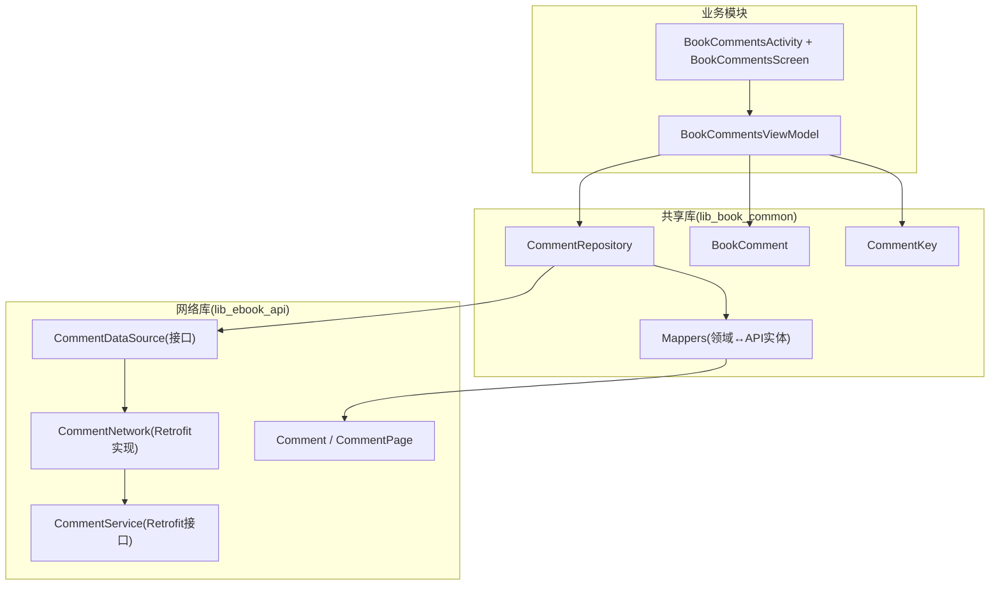
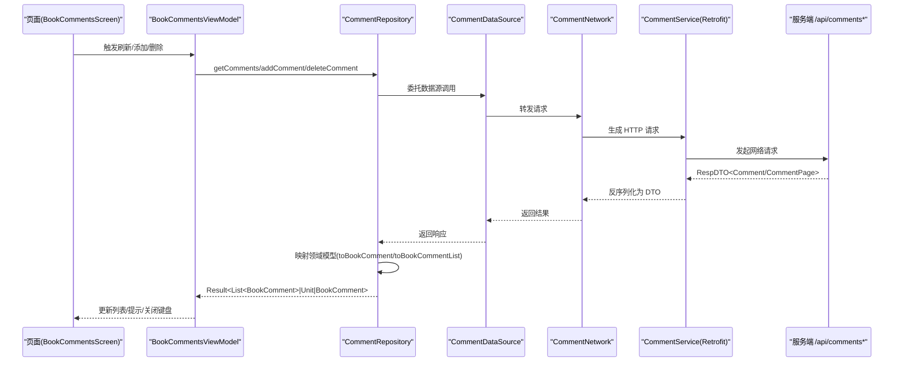
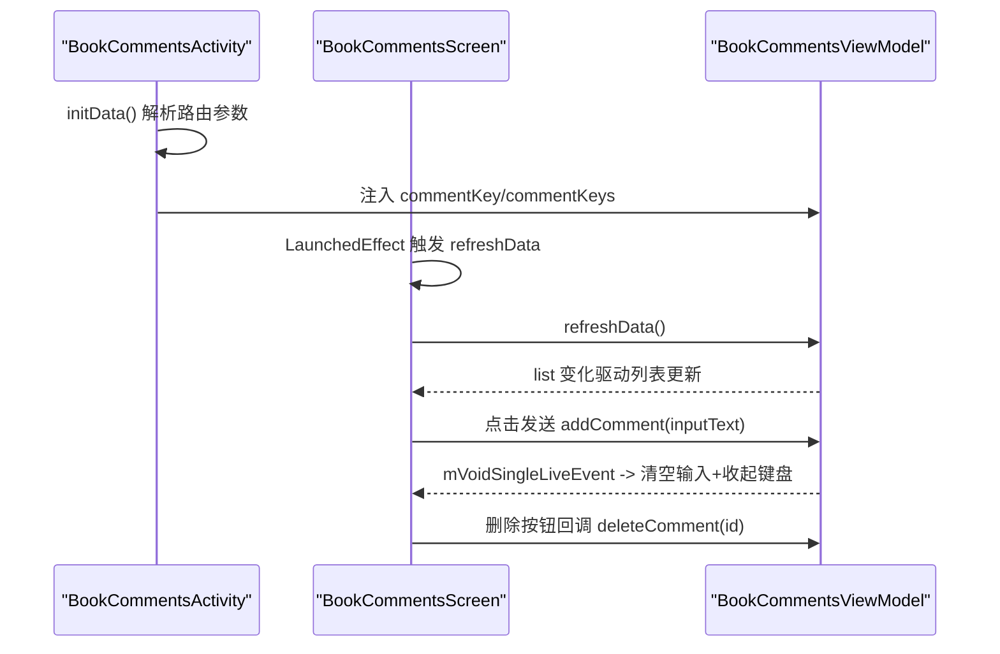
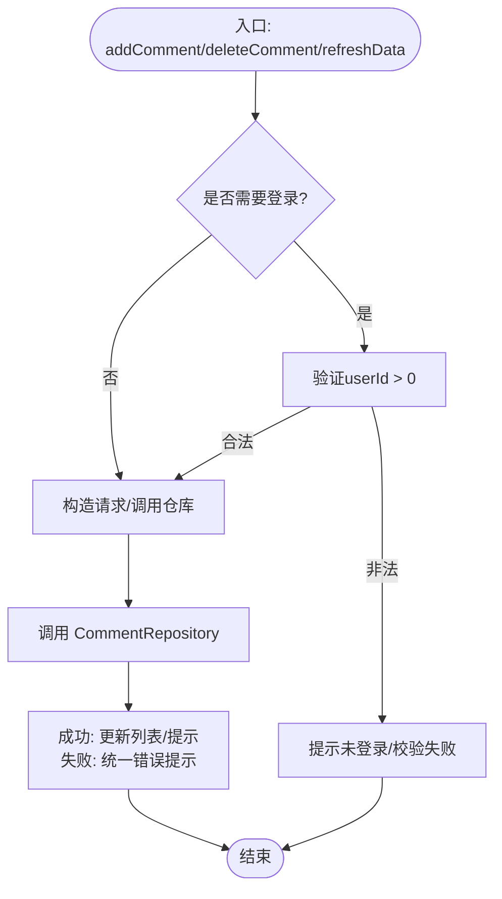
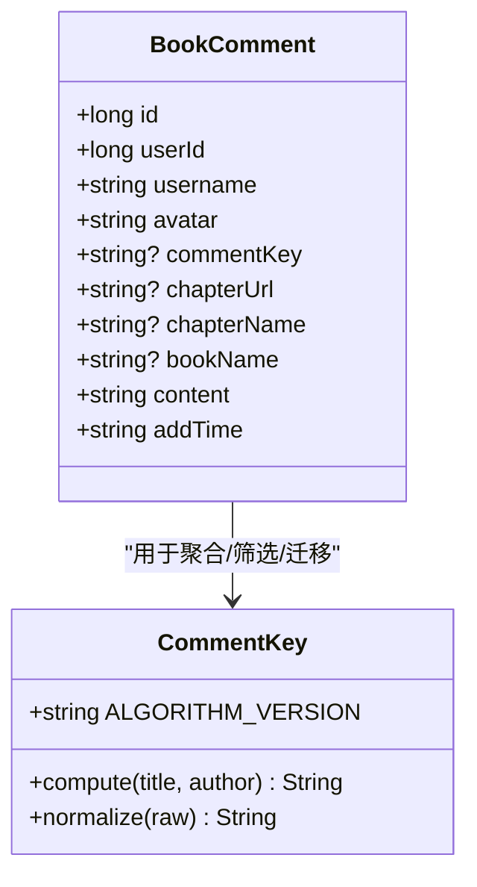
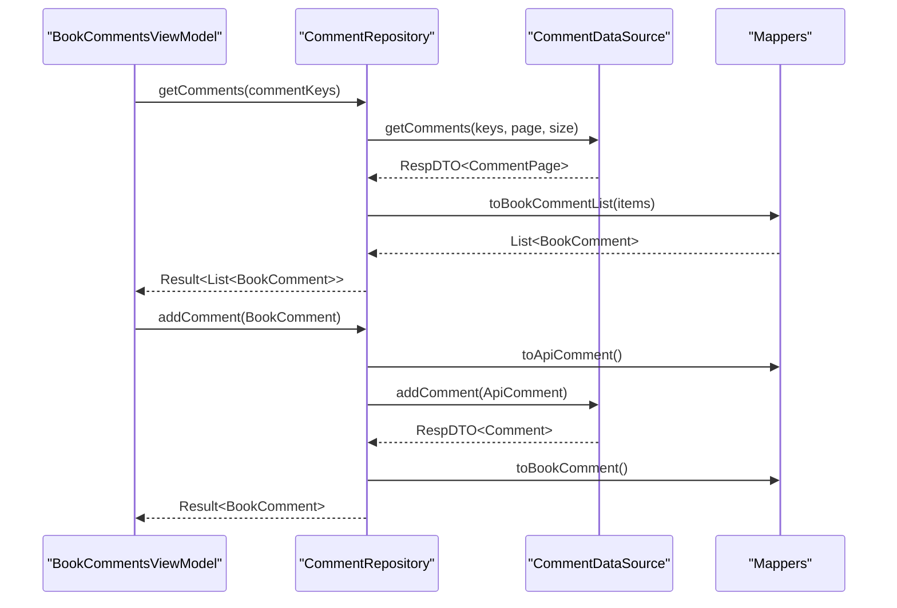
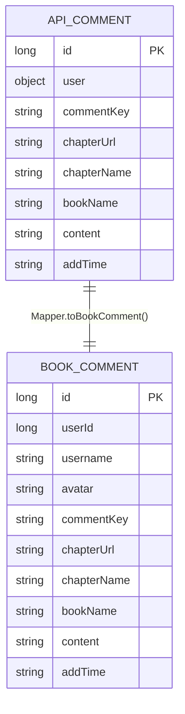

# 评论系统

<cite>
**本文引用的文件列表**
- [BookComment.kt](file://lib_book_common/src/main/java/com/ebook/common/domain/BookComment.kt)
- [CommentKey.kt](file://lib_book_common/src/main/java/com/ebook/common/domain/CommentKey.kt)
- [CommentRepository.kt](file://lib_book_common/src/main/java/com/ebook/common/repository/CommentRepository.kt)
- [CommentService.kt](file://lib_ebook_api/src/main/java/com/ebook/api/service/comment/CommentService.kt)
- [CommentNetwork.kt](file://lib_ebook_api/src/main/java/com/ebook/api/service/comment/CommentNetwork.kt)
- [CommentDataSource.kt](file://lib_ebook_api/src/main/java/com/ebook/api/service/comment/CommentDataSource.kt)
- [Mappers.kt](file://lib_book_common/src/main/java/com/ebook/common/mapper/Mappers.kt)
- [BookCommentsViewModel.kt](file://module_book/src/main/java/com/ebook/book/mvvm/viewmodel/BookCommentsViewModel.kt)
- [BookCommentsActivity.kt](file://module_book/src/main/java/com/ebook/book/BookCommentsActivity.kt)
- [Comment.kt](file://lib_ebook_api/src/main/java/com/ebook/api/entity/Comment.kt)
- [CommentPage.kt](file://lib_ebook_api/src/main/java/com/ebook/api/entity/CommentPage.kt)
- [2026-09-05-m2-comment-api-contract.md](file://docs/superpowers/specs/2026-09-05-m2-comment-api-contract.md)
</cite>

## 目录
1. [简介](#简介)
2. [项目结构](#项目结构)
3. [核心组件](#核心组件)
4. [架构总览](#架构总览)
5. [详细组件分析](#详细组件分析)
6. [依赖关系分析](#依赖关系分析)
7. [性能与扩展性](#性能与扩展性)
8. [故障排查指南](#故障排查指南)
9. [结论](#结论)
10. [附录：接口契约与数据模型](#附录接口契约与数据模型)

## 简介
本文件系统性地梳理了评论功能的 MVVM 架构与数据流，覆盖章节评论界面（列表展示、输入发送、删除）、领域模型（BookComment、CommentKey）、仓库层（CommentRepository）与网络服务层（Retrofit CommentService / CommentNetwork），以及 M2 的关键变更（按聚合键 comment_key 查询/新建、迁移旧键等）。文档提供时序图、流程图、类图等可视化表达，帮助读者快速理解并正确扩展。

## 项目结构
该功能跨模块实现，整体依赖方向为：业务模块 → lib_book_common（领域、仓库、映射） → lib_ebook_api（网络与服务定义）；UI 在 module_book 中基于 Compose 实现。

**图表来源**
- [BookCommentsActivity.kt:78-112](file://module_book/src/main/java/com/ebook/book/BookCommentsActivity.kt#L78-L112)
- [BookCommentsViewModel.kt:20-121](file://module_book/src/main/java/com/ebook/book/mvvm/viewmodel/BookCommentsViewModel.kt#L20-L121)
- [CommentRepository.kt:16-79](file://lib_book_common/src/main/java/com/ebook/common/repository/CommentRepository.kt#L16-L79)
- [CommentDataSource.kt:1-34](file://lib_ebook_api/src/main/java/com/ebook/api/service/comment/CommentDataSource.kt#L1-L34)
- [CommentNetwork.kt:18-47](file://lib_ebook_api/src/main/java/com/ebook/api/service/comment/CommentNetwork.kt#L18-L47)
- [CommentService.kt:24-62](file://lib_ebook_api/src/main/java/com/ebook/api/service/comment/CommentService.kt#L24-L62)
- [BookComment.kt:3-18](file://lib_book_common/src/main/java/com/ebook/common/domain/BookComment.kt#L3-L18)
- [CommentKey.kt:20-84](file://lib_book_common/src/main/java/com/ebook/common/domain/CommentKey.kt#L20-L84)
- [Mappers.kt:24-59](file://lib_book_common/src/main/java/com/ebook/common/mapper/Mappers.kt#L24-L59)
- [Comment.kt:21-39](file://lib_ebook_api/src/main/java/com/ebook/api/entity/Comment.kt#L21-L39)
- [CommentPage.kt:6-18](file://lib_ebook_api/src/main/java/com/ebook/api/entity/CommentPage.kt#L6-L18)

**章节来源**
- [BookCommentsActivity.kt:78-112](file://module_book/src/main/java/com/ebook/book/BookCommentsActivity.kt#L78-L112)
- [BookCommentsViewModel.kt:20-121](file://module_book/src/main/java/com/ebook/book/mvvm/viewmodel/BookCommentsViewModel.kt#L20-L121)
- [CommentRepository.kt:16-79](file://lib_book_common/src/main/java/com/ebook/common/repository/CommentRepository.kt#L16-L79)
- [CommentDataSource.kt:1-34](file://lib_ebook_api/src/main/java/com/ebook/api/service/comment/CommentDataSource.kt#L1-L34)
- [CommentNetwork.kt:18-47](file://lib_ebook_api/src/main/java/com/ebook/api/service/comment/CommentNetwork.kt#L18-L47)
- [CommentService.kt:24-62](file://lib_ebook_api/src/main/java/com/ebook/api/service/comment/CommentService.kt#L24-L62)

## 核心组件
- 领域模型
  - BookComment：扁平化的评论领域对象（不含嵌套 User），用于 UI/业务层消费。
  - CommentKey：客户端派生的不透明作品身份键（ck1:<hash> 或含“#章序号”的章评键），由书名和作者归一化后哈希得到。
- 仓库层
  - CommentRepository：封装增删查及分页、迁移等用例，统一错误包裹并通过映射器在领域与 API 实体间转换。
- 网络服务层
  - CommentDataSource 接口：声明统一的评论能力边界（新增、删除、我的评论、聚合键查询、迁移）。
  - CommentNetwork：Retrofit 实现，负责参数序列化（如 comment_keys 逗号拼接）、调起后端端点。
  - CommentService：Retrofit 注解化接口，定义所有 REST 端点。
- 视图层
  - BookCommentsActivity：Compose Activity，负责组装路由参数到 ViewModel、渲染刷新列表与底部输入栏。
  - BookCommentsViewModel：继承 BaseRefreshViewModel，维护评论列表、当前用户标识、执行查询/发布/删除等操作。

**章节来源**
- [BookComment.kt:3-18](file://lib_book_common/src/main/java/com/ebook/common/domain/BookComment.kt#L3-L18)
- [CommentKey.kt:20-84](file://lib_book_common/src/main/java/com/ebook/common/domain/CommentKey.kt#L20-L84)
- [CommentRepository.kt:16-79](file://lib_book_common/src/main/java/com/ebook/common/repository/CommentRepository.kt#L16-L79)
- [CommentDataSource.kt:1-34](file://lib_ebook_api/src/main/java/com/ebook/api/service/comment/CommentDataSource.kt#L1-L34)
- [CommentNetwork.kt:18-47](file://lib_ebook_api/src/main/java/com/ebook/api/service/comment/CommentNetwork.kt#L18-L47)
- [CommentService.kt:24-62](file://lib_ebook_api/src/main/java/com/ebook/api/service/comment/CommentService.kt#L24-L62)
- [BookCommentsActivity.kt:78-112](file://module_book/src/main/java/com/ebook/book/BookCommentsActivity.kt#L78-L112)
- [BookCommentsViewModel.kt:20-121](file://module_book/src/main/java/com/ebook/book/mvvm/viewmodel/BookCommentsViewModel.kt#L20-L121)

## 架构总览
下图展示了从 UI 到后端的完整调用链路，体现 MVVM 分层与解耦。

**图表来源**
- [BookCommentsViewModel.kt:20-121](file://module_book/src/main/java/com/ebook/book/mvvm/viewmodel/BookCommentsViewModel.kt#L20-L121)
- [CommentRepository.kt:16-79](file://lib_book_common/src/main/java/com/ebook/common/repository/CommentRepository.kt#L16-L79)
- [CommentDataSource.kt:1-34](file://lib_ebook_api/src/main/java/com/ebook/api/service/comment/CommentDataSource.kt#L1-L34)
- [CommentNetwork.kt:18-47](file://lib_ebook_api/src/main/java/com/ebook/api/service/comment/CommentNetwork.kt#L18-L47)
- [CommentService.kt:24-62](file://lib_ebook_api/src/main/java/com/ebook/api/service/comment/CommentService.kt#L24-L62)
- [Comment.kt:21-39](file://lib_ebook_api/src/main/java/com/ebook/api/entity/Comment.kt#L21-L39)
- [CommentPage.kt:6-18](file://lib_ebook_api/src/main/java/com/ebook/api/entity/CommentPage.kt#L6-L18)

## 详细组件分析

### UI 层：章节评论区（Compose）
- 功能职责
  - 接收路由参数（书籍/章节信息、comment_key），组装成 ViewModel 初始态。
  - 使用 RefreshableList 展示评论列表，支持下拉刷新。
  - 底部固定输入栏，发送成功后清空输入并收起软键盘。
  - 仅本人评论长按弹出确认框进行删除（权限判定逻辑在 VM）。
- 关键交互
  - 初始化：根据 RouteArgs 中的 COMMENT_KEY/PRIMARY_COMMENT_KEY 等字段写入 comment.commentKey 与 commentKeys。
  - 刷新：通过 MvvmBinder 绑定 BaseRefreshViewModel，首次进入自动触发 refreshData。
  - 发送：调用 addComment，成功则发射 void 事件，UI 收集事件隐藏键盘。
  - 删除：调用 deleteComment，成功后刷新列表。
- 本地状态管理
  - isRefreshing、inputText、currentUserId 均通过 Compose state 与 Flow.collectAsState 管理。

**图表来源**
- [BookCommentsActivity.kt:78-112](file://module_book/src/main/java/com/ebook/book/BookCommentsActivity.kt#L78-L112)
- [BookCommentsActivity.kt:121-190](file://module_book/src/main/java/com/ebook/book/BookCommentsActivity.kt#L121-L190)
- [BookCommentsViewModel.kt:20-121](file://module_book/src/main/java/com/ebook/book/mvvm/viewmodel/BookCommentsViewModel.kt#L20-L121)

**章节来源**
- [BookCommentsActivity.kt:78-190](file://module_book/src/main/java/com/ebook/book/BookCommentsActivity.kt#L78-L190)

### 视图模型层：BookCommentsViewModel
- 职责
  - 持有当前会话用户标识 Flow，供页面判断“是否本人评论”。
  - 维护评论载体（comment）与查询用的聚合键集合（commentKeys）。
  - 刷新：按 commentKeys 做并集查询，对返回结果按时间倒序排序后更新列表。
  - 发布评论：校验登录态（userId>0），将领域对象转 API 实体发送到服务端，成功后刷新列表。
  - 删除评论：调用仓库删除，成功后刷新列表并提示。
  - 失败处理：统一包装异常提示，已全局处置的会话过期不重复弹 Toast。

**图表来源**
- [BookCommentsViewModel.kt:20-121](file://module_book/src/main/java/com/ebook/book/mvvm/viewmodel/BookCommentsViewModel.kt#L20-L121)

**章节来源**
- [BookCommentsViewModel.kt:20-121](file://module_book/src/main/java/com/ebook/book/mvvm/viewmodel/BookCommentsViewModel.kt#L20-L121)

### 领域模型：BookComment 与 CommentKey
- BookComment：面向 UI 的扁平模型，包含 ID、用户信息、聚合键、章节/书籍快照、内容与时间。
- CommentKey：确保跨用户/多书源的评论聚合一致性。规则要点
  - 算法版本前缀 ck1:，避免归一化规则升级导致兼容问题。
  - 去书名号、全角→半角、转小写、折叠空白，作者占位词视为空串。
  - 章评键格式：作品键 + “#章序号(0-based)”。

**图表来源**
- [BookComment.kt:3-18](file://lib_book_common/src/main/java/com/ebook/common/domain/BookComment.kt#L3-L18)
- [CommentKey.kt:20-84](file://lib_book_common/src/main/java/com/ebook/common/domain/CommentKey.kt#L20-L84)

**章节来源**
- [BookComment.kt:3-18](file://lib_book_common/src/main/java/com/ebook/common/domain/BookComment.kt#L3-L18)
- [CommentKey.kt:20-84](file://lib_book_common/src/main/java/com/ebook/common/domain/CommentKey.kt#L20-L84)

### 仓库层：CommentRepository
- 提供评论用例：新增、删除、获取我的评论、按聚合键列表查询、迁移旧键。
- 统一分页大小默认值（100，单页拉取），简化前端分页复杂度。
- 通过映射器将 API 实体转换为领域模型，保持领域层无 API 细节。

**图表来源**
- [CommentRepository.kt:16-79](file://lib_book_common/src/main/java/com/ebook/common/repository/CommentRepository.kt#L16-L79)
- [CommentDataSource.kt:1-34](file://lib_ebook_api/src/main/java/com/ebook/api/service/comment/CommentDataSource.kt#L1-L34)
- [Mappers.kt:24-59](file://lib_book_common/src/main/java/com/ebook/common/mapper/Mappers.kt#L24-L59)

**章节来源**
- [CommentRepository.kt:16-79](file://lib_book_common/src/main/java/com/ebook/common/repository/CommentRepository.kt#L16-L79)

### 网络层：CommentDataSource / CommentNetwork / CommentService
- CommentDataSource：抽象出统一的数据源能力，屏蔽真实与 mock 实现的差异。
- CommentNetwork：Retrofit 实例化服务客户端，处理参数格式化（例如 comment_keys 以逗号分隔）。
- CommentService：RESTful 接口定义，新增/删除/我的评论/聚合查询/迁移。

**章节来源**
- [CommentDataSource.kt:1-34](file://lib_ebook_api/src/main/java/com/ebook/api/service/comment/CommentDataSource.kt#L1-L34)
- [CommentNetwork.kt:18-47](file://lib_ebook_api/src/main/java/com/ebook/api/service/comment/CommentNetwork.kt#L18-L47)
- [CommentService.kt:24-62](file://lib_ebook_api/src/main/java/com/ebook/api/service/comment/CommentService.kt#L24-L62)

## 依赖关系分析
- 耦合与内聚
  - UI 层只依赖 ViewModel 暴露的状态与方法；ViewModel 依赖仓库，不直接感知网络。
  - 仓库仅依赖 DataSource 接口，网络实现与 Mock 可自由替换。
  - 映射器将 API 实体与领域模型隔离，方便独立演进。
- 外部依赖
  - Retrofit + OkHttp：网络请求与认证拦截由上层统一配置。
  - TheRouter：页面跳转（含评论页需要登录的参数约束）。
  - Compose：UI 框架与状态管理。
- 潜在循环与风险
  - 无循环依赖；注意避免在映射中引入额外网络副作用。

**图表来源**
- [BookCommentsActivity.kt:78-112](file://module_book/src/main/java/com/ebook/book/BookCommentsActivity.kt#L78-L112)
- [BookCommentsViewModel.kt:20-121](file://module_book/src/main/java/com/ebook/book/mvvm/viewmodel/BookCommentsViewModel.kt#L20-L121)
- [CommentRepository.kt:16-79](file://lib_book_common/src/main/java/com/ebook/common/repository/CommentRepository.kt#L16-L79)
- [CommentDataSource.kt:1-34](file://lib_ebook_api/src/main/java/com/ebook/api/service/comment/CommentDataSource.kt#L1-L34)
- [CommentNetwork.kt:18-47](file://lib_ebook_api/src/main/java/com/ebook/api/service/comment/CommentNetwork.kt#L18-L47)
- [CommentService.kt:24-62](file://lib_ebook_api/src/main/java/com/ebook/api/service/comment/CommentService.kt#L24-L62)

**章节来源**
- [BookCommentsViewModel.kt:20-121](file://module_book/src/main/java/com/ebook/book/mvvm/viewmodel/BookCommentsViewModel.kt#L20-L121)
- [CommentRepository.kt:16-79](file://lib_book_common/src/main/java/com/ebook/common/repository/CommentRepository.kt#L16-L79)
- [CommentDataSource.kt:1-34](file://lib_ebook_api/src/main/java/com/ebook/api/service/comment/CommentDataSource.kt#L1-L34)

## 性能与扩展性
- 分页策略：当前默认 page_size=100，单页拉取全部评论，简化 UI 逻辑，适合章节评论体量可控场景。如需海量扩容，可改为渐进式分页与合并去重。
- 排序：列表按 add_time 倒序，提升新评论可见性。
- 键派生成本：CommentKey.compute 涉及 SHA-256 计算与字符串归一化，建议在输入端缓存并复用，避免频繁重复计算。
- 并发：所有 IO 均在协程中进行，通过 Repository 的 Result 封装错误，减少线程切换复杂性。
- 可扩展点
  - 评论审核/敏感词过滤：可在 CommentRepository 增加前置校验流程（本地词典/在线检测），或在 CommentService 增加服务器侧钩子。
  - 实时更新：结合后端长连接/WebSocket 推送，在 ViewModel 中接收增量更新并合并到列表；或与后端约定分页版本号实现增量加载。

[本节为通用优化建议，不直接引用具体代码文件]

## 故障排查指南
- 常见问题
  - 页面始终无法加载评论：检查 network 地址配置、token 有效性与网络模块装配是否正确；关注 RespDTO 解码与 CommentPage items 是否为空。
  - 评论发不出/提示为空：确认输入非空校验；查看 ViewModel 中 userId 来源与登录态。
  - 删除无效：校验当前用户是否与评论人一致（isOwnComment），注意使用 userId 而非昵称匹配。
  - 键不一致导致评论不聚合：确认 CommentKey 归一化规则是否与后端一致；注意不同算法版本的 ck1 前缀。
- 定位手段
  - 使用统一日志输出与 ApiException 消息；会话过期已由全局处置，勿重复弹窗。
  - 通过注释中提供的资产路径（assets 下的 JSON）与测试用例对比响应形态。
- 相关位置
  - 失败提示与统一封装：[BookCommentsViewModel.kt:106-120](file://module_book/src/main/java/com/ebook/book/mvvm/viewmodel/BookCommentsViewModel.kt#L106-L120)
  - 仓库错误与空列表兜底：[CommentRepository.kt:60-74](file://lib_book_common/src/main/java/com/ebook/common/repository/CommentRepository.kt#L60-L74)

**章节来源**
- [BookCommentsViewModel.kt:106-120](file://module_book/src/main/java/com/ebook/book/mvvm/viewmodel/BookCommentsViewModel.kt#L106-L120)
- [CommentRepository.kt:60-74](file://lib_book_common/src/main/java/com/ebook/common/repository/CommentRepository.kt#L60-L74)

## 结论
评论系统采用清晰的 MVVM 分层：UI 层专注交互与状态展示，ViewModel 协调命令与状态，Repository 负责数据聚合与映射，网络层通过接口抽象与 Retrofit 实现完成远程通讯。M2 将评论聚合键改为客户端派生且不透明的 comment_key，实现了多书源、本地书场景的统一聚合，同时提供迁移能力平滑过渡。系统具备较好的可扩展性，便于后续接入审核、敏感词过滤与实时推送等增强特性。

[本节为总结性内容，不直接引用具体代码文件]

## 附录：接口契约与数据模型

### API 端点一览
- POST /api/comments：创建评论（需登录；content、comment_key 必填）
- DELETE /api/comments/{id}：删除评论（需登录；仅本人或管理员）
- GET /api/comments/my：我的评论（分页）
- GET /api/comments：按 comment_keys 查询并集（支持章评键/作品键）
- POST /api/comments/migrate：迁移我的评论（旧 key→新 key）

**章节来源**
- [CommentService.kt:24-62](file://lib_ebook_api/src/main/java/com/ebook/api/service/comment/CommentService.kt#L24-L62)
- [2026-09-05-m2-comment-api-contract.md:43-177](file://docs/superpowers/specs/2026-09-05-m2-comment-api-contract.md#L43-L177)

### 数据模型定义
- API 实体
  - Comment：字段包括 id、user、comment_key、chapter_url/chapter_name/book_name、content、add_time。
  - CommentPage：items、total、page、page_size 分页包装。
- 领域模型
  - BookComment：轻量扁平结构，去除嵌套 user。

**图表来源**
- [Comment.kt:21-39](file://lib_ebook_api/src/main/java/com/ebook/api/entity/Comment.kt#L21-L39)
- [BookComment.kt:3-18](file://lib_book_common/src/main/java/com/ebook/common/domain/BookComment.kt#L3-L18)
- [Mappers.kt:24-59](file://lib_book_common/src/main/java/com/ebook/common/mapper/Mappers.kt#L24-L59)

**章节来源**
- [Comment.kt:21-39](file://lib_ebook_api/src/main/java/com/ebook/api/entity/Comment.kt#L21-L39)
- [BookComment.kt:3-18](file://lib_book_common/src/main/java/com/ebook/common/domain/BookComment.kt#L3-L18)
- [CommentPage.kt:6-18](file://lib_ebook_api/src/main/java/com/ebook/api/entity/CommentPage.kt#L6-L18)