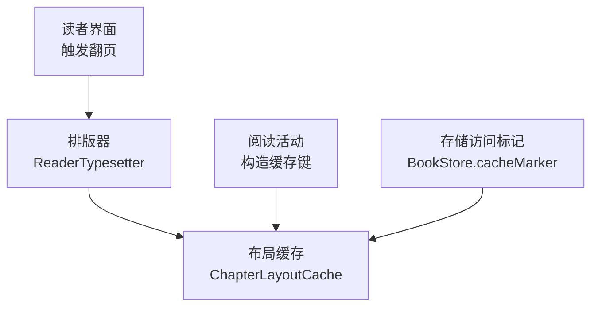
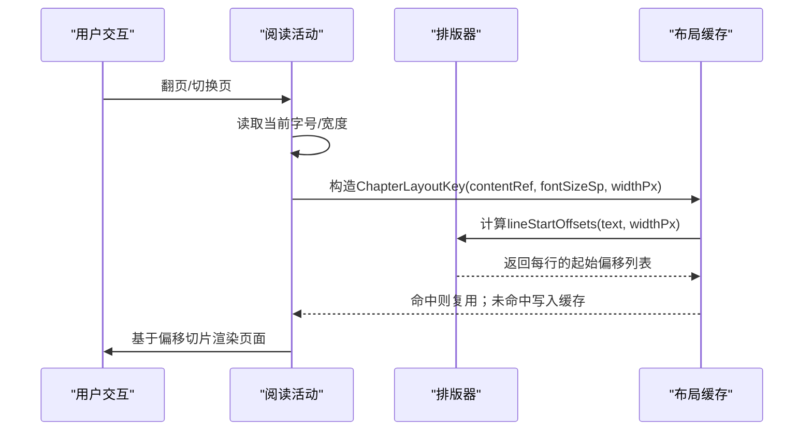
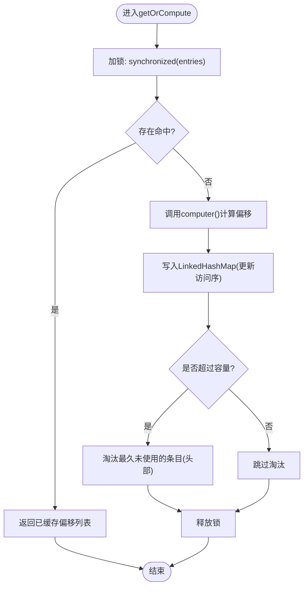
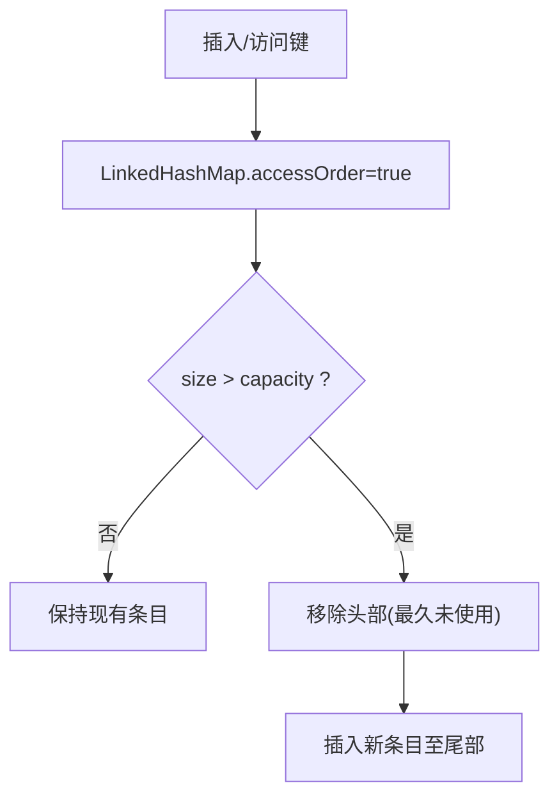
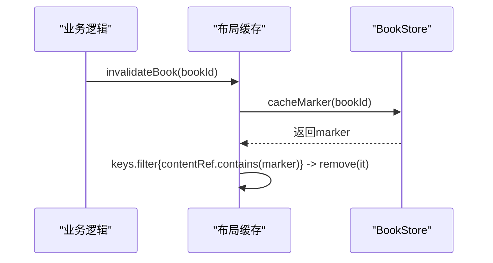
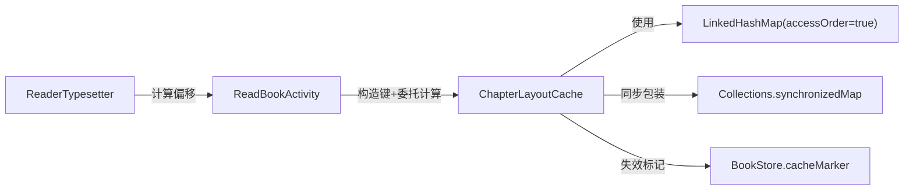

# 布局缓存

<cite>
**本文引用的文件**
- [ChapterLayoutCache.kt](file://module_book/src/main/java/com/ebook/book/reader/ChapterLayoutCache.kt)
- [ChapterLayoutCacheTest.kt](file://module_book/src/test/java/com/ebook/book/reader/ChapterLayoutCacheTest.kt)
- [ReaderTypesetter.kt](file://module_book/src/main/java/com/ebook/book/reader/ReaderTypesetter.kt)
- [ReadBookActivity.kt](file://module_book/src/main/java/com/ebook/book/ReadBookActivity.kt)
- [BookStore.kt](file://lib_book_common/src/main/java/com/ebook/common/store/BookStore.kt)
- [2026-09-04-local-book-content-base-m1a.md](file://docs/superpowers/plans/2026-09-04-local-book-content-base-m1a.md)
</cite>

## 目录
1. [简介](#简介)
2. [项目结构](#项目结构)
3. [核心组件](#核心组件)
4. [架构总览](#架构总览)
5. [详细组件分析](#详细组件分析)
6. [依赖关系分析](#依赖关系分析)
7. [性能考量](#性能考量)
8. [故障排除指南](#故障排除指南)
9. [结论](#结论)

## 简介
本篇技术文档聚焦阅读页的“整章排版偏移”内存缓存，目标是解释 ChapterLayoutCache 的设计与实现细节：缓存键设计（内容引用、字号、宽度）、并发安全机制、LRU 淘汰策略、性能收益以及内存管理实践。该缓存用于避免同章节多次翻页时重复进行 O(章长×N页) 的重排计算，将总体复杂度降低到接近 O(章长)，显著提升翻页流畅度。

## 项目结构
本节从模块角度定位布局缓存相关代码与上下游：

- 阅读器排版引擎提供原始测量方法：按给定宽度和样式度量文本并返回渲染行起始偏移。
- 阅读活动根据当前正文宽度与字号，构造排版键并请求计算结果。
- 布局缓存持有同章、同字号、同宽度下的已计算偏移列表；在容量上限下按 LRU 淘汰。
- 当书失效或应用关闭等时机，按 BookId 批量清理对应的布局缓存条目，确保数据一致性与内存回收。

图示来源
- [ReaderTypesetter.kt:52-55](file://module_book/src/main/java/com/ebook/book/reader/ReaderTypesetter.kt#L52-L55)
- [ChapterLayoutCache.kt:21-49](file://module_book/src/main/java/com/ebook/book/reader/ChapterLayoutCache.kt#L21-L49)
- [ReadBookActivity.kt:295-296](file://module_book/src/main/java/com/ebook/book/ReadBookActivity.kt#L295-L296)
- [BookStore.kt:见引用处](file://lib_book_common/src/main/java/com/ebook/common/store/BookStore.kt)

章节来源
- [ChapterLayoutCache.kt:6-49](file://module_book/src/main/java/com/ebook/book/reader/ChapterLayoutCache.kt#L6-L49)
- [ReaderTypesetter.kt:17-55](file://module_book/src/main/java/com/ebook/book/reader/ReaderTypesetter.kt#L17-L55)
- [ReadBookActivity.kt:138-139](file://module_book/src/main/java/com/ebook/book/ReadBookActivity.kt#L138-L139)
- [2026-09-04-local-book-content-base-m1a.md:3105-3183](file://docs/superpowers/plans/2026-09-04-local-book-content-base-m1a.md#L3105-L3183)

## 核心组件
- ChapterLayoutKey：布局缓存的复合键，包含三维度信息，确保排版结果唯一且正确。
- ChapterLayoutCache：基于 LinkedHashMap + synchronizedMap 的线程安全 LRU 缓存，支持 getOrCompute 原子操作、按书失效批量清理以及全局清除。
- ReaderTypesetter：提供 lineStartOffsets、fitRenderLineCount 等排版测量方法，是缓存的计算源。
- ReadBookActivity：构建缓存键的关键入口，取当前字号、正文宽度参与键生成，并将结果传递给分页流程。
- BookStore：提供 cacheMarker(bookId) 作为缓存失效时的匹配前缀，配合 invalidateBook 完成批量清理。

章节来源
- [ChapterLayoutCache.kt:7-49](file://module_book/src/main/java/com/ebook/book/reader/ChapterLayoutCache.kt#L7-L49)
- [ReaderTypesetter.kt:17-55](file://module_book/src/main/java/com/ebook/book/reader/ReaderTypesetter.kt#L17-L55)
- [ReadBookActivity.kt:138-139](file://module_book/src/main/java/com/ebook/book/ReadBookActivity.kt#L138-L139)
- [2026-09-04-local-book-content-base-m1a.md:3175-3183](file://docs/superpowers/plans/2026-09-04-local-book-content-base-m1a.md#L3175-L3183)

## 架构总览
下图展示布局缓存在实际阅读路径中的调用序列，重点体现“同章翻页只重排一次”的收益点与键构造要点。

图示来源
- [ChapterLayoutCache.kt:30-35](file://module_book/src/main/java/com/ebook/book/reader/ChapterLayoutCache.kt#L30-L35)
- [ReaderTypesetter.kt:52-55](file://module_book/src/main/java/com/ebook/book/reader/ReaderTypesetter.kt#L52-L55)
- [2026-09-04-local-book-content-base-m1a.md:3105-3183](file://docs/superpowers/plans/2026-09-04-local-book-content-base-m1a.md#L3105-L3183)

## 详细组件分析

### 缓存键设计与原则
- 三个维度保证唯一性：
  - contentRef：指向具体章节内容引用（例如一章一文件的标识），不同章节不可共用。
  - fontSizeSp：正文尺寸影响断行、折行位置，字号改变必须重新计算。
  - widthPx：正文宽度决定一行可容纳字符数，宽度变化同样会导致整章重排。
- 如果遗漏任一维度，可能出现“页数没变但内容接不上”的现象（改字号后旧偏移仍被复用）。
- 使用 data class 作为键，具备值语义与 equals/hashCode 保障，便于 LinkedHashMap 正确识别。

章节来源
- [ChapterLayoutCache.kt:6-7](file://module_book/src/main/java/com/ebook/book/reader/ChapterLayoutCache.kt#L6-L7)
- [ReaderTypesetter.kt:17-40](file://module_book/src/main/java/com/ebook/book/reader/ReaderTypesetter.kt#L17-L40)
- [2026-09-04-local-book-content-base-m1a.md:3175-3183](file://docs/superpowers/plans/2026-09-04-local-book-content-base-m1a.md#L3175-L3183)

### 并发安全机制
- 底层采用 LinkedHashMap(accessOrder=true)，并以 Collections.synchronizedMap 包装，所有访问经同步锁保护。
- getOrCompute 必须在 synchronizedMap 的锁范围内执行 check-then-act，以避免多线程并发预加载上下页导致多个线程同时 miss 并重复计算。
- 通过 entries.getOrPut(key){ computer() } 保证原子写入：同一时刻同一键只会触发一次计算，其余线程等待并直接获取已有结果。
- 失效与清空接口也受同步保护，保证与读写的一致性。

图示来源
- [ChapterLayoutCache.kt:23-35](file://module_book/src/main/java/com/ebook/book/reader/ChapterLayoutCache.kt#L23-L35)

章节来源
- [ChapterLayoutCache.kt:18-35](file://module_book/src/main/java/com/ebook/book/reader/ChapterLayoutCache.kt#L18-L35)

### LRU淘汰策略
- 以 capacity=5 为默认容量，覆盖“当前章 + 前后各两章”的常用浏览范围，平衡命中率与内存占用。
- accessOrder=true 使得 LinkedHashMap 按访问顺序排列，新访问条目移至尾部；超出容量时 removeEldestEntry 会移除头部（最久未使用）条目。
- 容量选择依据：翻页过程中常访问当前位置与相邻页面，小容量即可维持较高命中率，避免常驻过多条目造成压力。

图示来源
- [ChapterLayoutCache.kt:24-27](file://module_book/src/main/java/com/ebook/book/reader/ChapterLayoutCache.kt#L24-L27)

章节来源
- [ChapterLayoutCache.kt:23-28](file://module_book/src/main/java/com/ebook/book/reader/ChapterLayoutCache.kt#L23-L28)

### 失效与批量清理
- invalidateBook(bookId)：根据 BookStore.cacheMarker(bookId) 生成的标记字符串，筛选出所有 contentRef 包含该标记的键并删除，对应一本书的所有章节排版结果均被清理。
- clear()：清空全部布局缓存，适用于极端场景（如整体配置变更或测试场景）。
- 章节内页切换：同一 bookId 下的章节切换会产生新的 contentRef，自然不共享旧缓存；跨章节隔离由 contentRef 保证。

图示来源
- [ChapterLayoutCache.kt:38-42](file://module_book/src/main/java/com/ebook/book/reader/ChapterLayoutCache.kt#L38-L42)
- [BookStore.kt:见引用处](file://lib_book_common/src/main/java/com/ebook/common/store/BookStore.kt)

章节来源
- [ChapterLayoutCache.kt:38-42](file://module_book/src/main/java/com/ebook/book/reader/ChapterLayoutCache.kt#L38-L42)

### API使用指南与最佳实践
- 构造键：
  - contentRef：来自章节内容引用标识（如一本书一章一文件的本地路径段）。
  - fontSizeSp：取自当前控制器的正文字号（例如 ReadBookControl.textSize），必须与排版器入参一致。
  - widthPx：取自正文区实际宽度（onBodyMeasured 回传的宽度），与排版器测量宽度一致。
- 获取/计算：
  - 调用 getOrCompute(key){ compute() }，compute 中应仅计算当前字宽下的 lineStartOffsets。
- 失效处理：
  - 书籍切换或移除时调用 invalidateBook(bookId) 清理对应章节的结果。
  - 全局配置变更时可调用 clear()。
- 并发预加载：
  - 预加载上下页时可直接使用同一缓存实例，getOrCompute 能保证同一键不会重复计算。
- 测试建议：
  - 验证相同键只计算一次；字号/宽度变化产生新键；按书失效后对应章重新计算。

章节来源
- [ChapterLayoutCacheTest.kt:12-46](file://module_book/src/test/java/com/ebook/book/reader/ChapterLayoutCacheTest.kt#L12-L46)
- [2026-09-04-local-book-content-base-m1a.md:3175-3183](file://docs/superpowers/plans/2026-09-04-local-book-content-base-m1a.md#L3175-L3183)

## 依赖关系分析
- ChapterLayoutCache 依赖于：
  - BookStore：用于生成失效标记，实现按书的批量清理。
  - Collections + LinkedHashMap：实现线程安全与 LRU 策略。
  - 排版器（ReaderTypesetter）：提供实际的线起始偏移计算方法（由调用方传入 compute lambda 执行）。
- 调用方（ReadBookActivity）负责构造键并提供 compute 实现，与类型设置器协同保证幂等与一致性。

图示来源
- [ChapterLayoutCache.kt:23-42](file://module_book/src/main/java/com/ebook/book/reader/ChapterLayoutCache.kt#L23-L42)
- [ReaderTypesetter.kt:52-55](file://module_book/src/main/java/com/ebook/book/reader/ReaderTypesetter.kt#L52-L55)
- [ReadBookActivity.kt:138-139](file://module_book/src/main/java/com/ebook/book/ReadBookActivity.kt#L138-L139)

章节来源
- [ChapterLayoutCache.kt:23-42](file://module_book/src/main/java/com/ebook/book/reader/ChapterLayoutCache.kt#L23-L42)
- [ReaderTypesetter.kt:52-55](file://module_book/src/main/java/com/ebook/book/reader/ReaderTypesetter.kt#L52-L55)
- [ReadBookActivity.kt:138-139](file://module_book/src/main/java/com/ebook/book/ReadBookActivity.kt#L138-L139)

## 性能考量
- 原始复杂度：不缓存情况下，每页都会对整章内容进行重排，O(章长×N页)。
- 引入缓存后：首次计算为 O(章长)，后续翻页命中缓存仅为 O(1) 查找与迭代，整体趋近 O(章长)（考虑跨章时会重新计算，但仍显著低于未缓存）。
- 命中率优化：
  - 合理容量（默认5）覆盖常见翻动路径。
  - 准确的键构造（字号/宽度一致）提升命中率。
- 并发收益：
  - synchronizedMap + getOrPut 的原子操作防止重复计算，有效降低 CPU 峰值。
- 内存权衡：
  - LRU 淘汰避免无限增长。
  - 按书失效及时释放不再需要的条目，防止多本书混用时内存膨胀。

[本节提供一般性指导，不直接分析特定源码]

## 故障排除指南
- 现象：修改字号后页数没变、内容错位或拼接不上
  - 排查：确保缓存键 fontSizeSp 与排版器读入的尺寸一致（均来自控制器状态）。
  - 解决：字号变更时必然产生新的键，旧偏移不被复用。
- 现象：跨章节内容错乱
  - 排查：确认 contentRef 指向正确的章节，避免误用其他章节引用。
  - 解决：章节切换会使用不同的 contentRef，自然隔离。
- 现象：多本书翻页卡滞或内存上升
  - 排查：是否在合适时机调用 invalidateBook(bookId) 清理失效书缓存。
  - 解决：书切换或卸载时调用清理；必要时可使用 clear() 恢复初始状态。
- 现象：并发预加载无效
  - 排查：是否跨线程并发访问缓存而未使用 synchronized 保护；是否错误拆分了 get/put。
  - 解决：统一通过 getOrCompute 的原子封装访问。

章节来源
- [ChapterLayoutCacheTest.kt:23-46](file://module_book/src/test/java/com/ebook/book/reader/ChapterLayoutCacheTest.kt#L23-L46)
- [ChapterLayoutCache.kt:30-42](file://module_book/src/main/java/com/ebook/book/reader/ChapterLayoutCache.kt#L30-L42)

## 结论
ChapterLayoutCache 通过“内容引用 + 字号 + 宽度”三维键设计与线程安全的 LRU 缓存策略，在保证数据一致性的前提下显著降低重复重排成本，将阅读翻页体验从 O(章长×N页) 优化至接近 O(章长)。结合按书失效的批量清理机制与严格的并发保护，既保障了准确性又兼顾性能与内存健康。实践中需严格对齐字号与宽度取值，并在书级生命周期中做好失效清理，以获得稳定的阅读体验。

[本节为总结，不涉及具体源码分析]