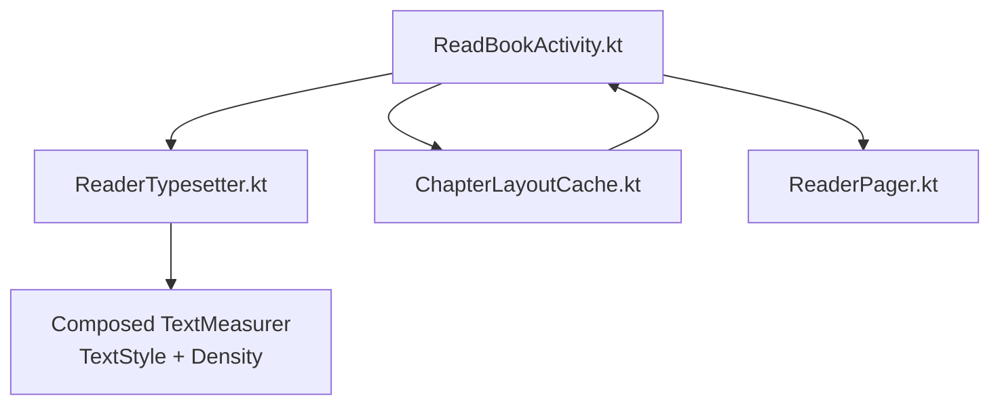
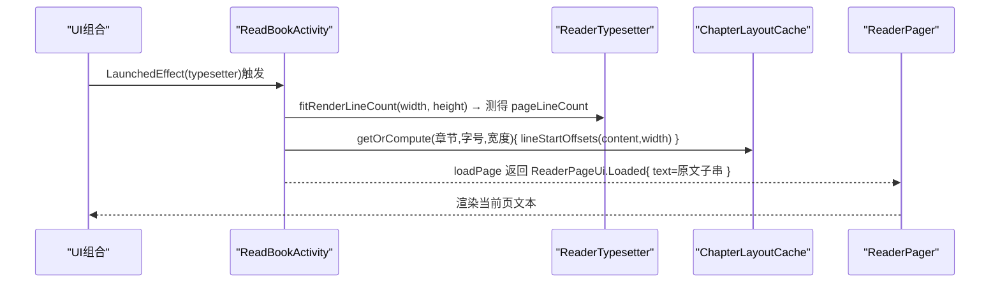
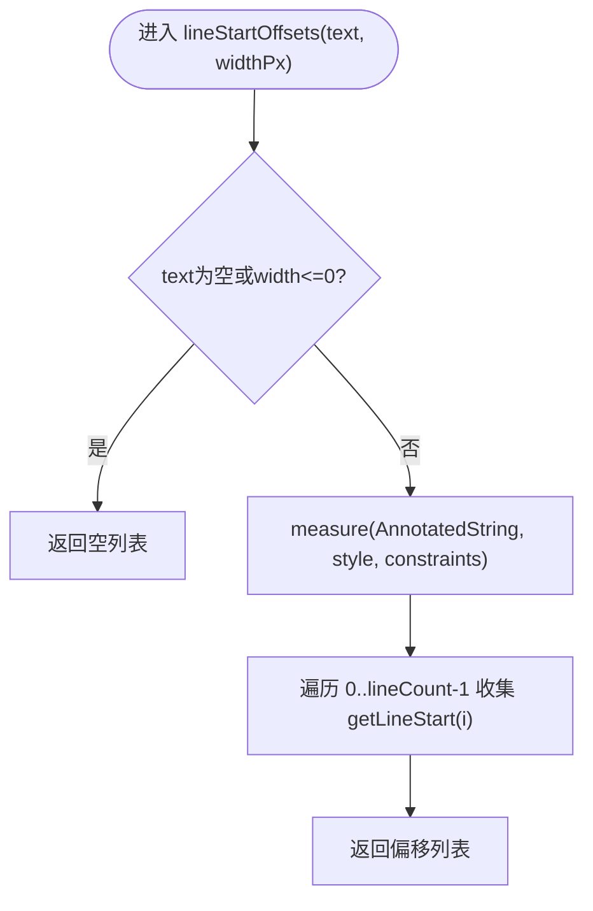
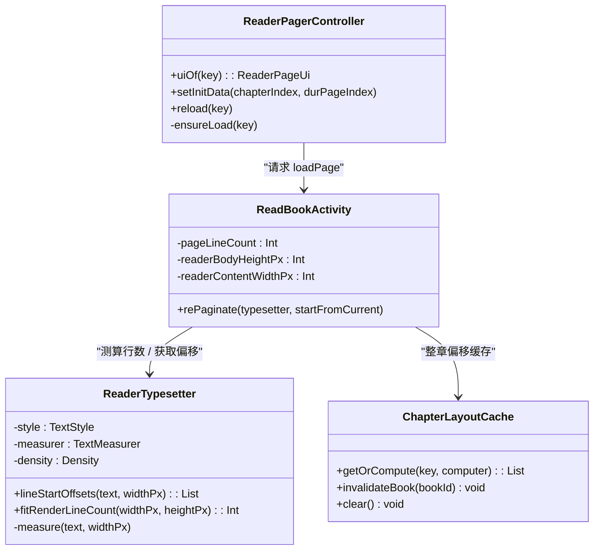

# 排版引擎

<cite>
**本文引用的文件**
- [ReaderTypesetter.kt](file://module_book/src/main/java/com/ebook/book/reader/ReaderTypesetter.kt)
- [ChapterLayoutCache.kt](file://module_book/src/main/java/com/ebook/book/reader/ChapterLayoutCache.kt)
- [ReadBookActivity.kt](file://module_book/src/main/java/com/ebook/book/ReadBookActivity.kt)
- [ReaderPager.kt](file://module_book/src/main/java/com/ebook/book/reader/ReaderPager.kt)
- [TextNormalizer.kt](file://lib_book_common/src/main/java/com/ebook/common/text/TextNormalizer.kt)
</cite>

## 目录
1. [简介](#简介)
2. [项目结构](#项目结构)
3. [核心组件](#核心组件)
4. [架构总览](#架构总览)
5. [关键算法详解](#关键算法详解)
6. [依赖关系分析](#依赖关系分析)
7. [性能与优化](#性能与优化)
8. [故障排查指南](#故障排查指南)
9. [结论](#结论)
10. [附录：扩展性设计](#附录扩展性设计)

## 简介
本文档聚焦阅读器的「排版引擎」，围绕 ReaderTypesetter 的核心算法展开，系统解释其测量、分行偏移计算、行数测算、探针字符串设计、以及为何必须统一样式管线以避免静态布局与 Compose 两套折行逻辑不一致的问题。同时给出性能优化建议、缓存策略和扩展思路。

## 项目结构
与排版引擎直接相关的代码主要位于 module_book 的 reader 包中，并与其他组件配合完成整章排版、分页与渲染。



**图表来源**
- [ReaderTypesetter.kt:1-95](file://module_book/src/main/java/com/ebook/book/reader/ReaderTypesetter.kt#L1-L95)
- [ChapterLayoutCache.kt:1-50](file://module_book/src/main/java/com/ebook/book/reader/ChapterLayoutCache.kt#L1-L50)
- [ReadBookActivity.kt:100-325](file://module_book/src/main/java/com/ebook/book/ReadBookActivity.kt#L100-L325)
- [ReaderPager.kt:64-200](file://module_book/src/main/java/com/ebook/book/reader/ReaderPager.kt#L64-L200)

**章节来源**
- [ReaderTypesetter.kt:1-95](file://module_book/src/main/java/com/ebook/book/reader/ReaderTypesetter.kt#L1-L95)
- [ChapterLayoutCache.kt:1-50](file://module_book/src/main/java/com/ebook/book/reader/ChapterLayoutCache.kt#L1-L50)
- [ReadBookActivity.kt:100-325](file://module_book/src/main/java/com/ebook/book/ReadBookActivity.kt#L100-L325)
- [ReaderPager.kt:64-200](file://module_book/src/main/java/com/ebook/book/reader/ReaderPager.kt#L64-L200)

## 核心组件
- ReaderTypesetter：排版的唯一事实源，聚合 TextMeasurer、Density、正文 TextStyle，提供 lineStartOffsets（分行起始偏移）、fitRenderLineCount（可见区可容纳行数）。
- ChapterLayoutCache：按“章节内容引用+字号+宽度”维度缓存一整章的分行起始偏移，避免翻页重复重排。
- ReadBookActivity：承载 rePaginate，负责把样式/密度变更转化为“重新测算每页行数”，并调用加载流程获取分页文本。
- ReaderPager：页面窗口管理、异步加载、三页状态机等，与排版层协作将“一行一行为单位”的分页结果渲染到 UI。
- TextNormalizer（在 common）：负责正文文本归一化，使文本形态适合后续段落分隔与换行处理。

**章节来源**
- [ReaderTypesetter.kt:28-94](file://module_book/src/main/java/com/ebook/book/reader/ReaderTypesetter.kt#L28-L94)
- [ChapterLayoutCache.kt:6-49](file://module_book/src/main/java/com/ebook/book/reader/ChapterLayoutCache.kt#L6-L49)
- [ReadBookActivity.kt:235-260](file://module_book/src/main/java/com/ebook/book/ReadBookActivity.kt#L235-L260)
- [ReaderPager.kt:74-119](file://module_book/src/main/java/com/ebook/book/reader/ReaderPager.kt#L74-L119)

## 架构总览
排版管线自顶向下分为：
- 样式与测量装配层：rememberReaderTypesetter 组合 TextMeasurer、Density、readerBodyTextStyle，构成不可变排版上下文。
- 测算与分页层：rePaginate 用 fitRenderLineCount 决定一页放多少行；loadPage 中使用 lineStartOffsets 计算整章各行起始偏移，并以“原文子串切片”切出页文本。
- 渲染展示层：ReaderPager 基于页文本逐行渲染，保证视觉与分页逻辑一致。



**图表来源**
- [ReadBookActivity.kt:235-325](file://module_book/src/main/java/com/ebook/book/ReadBookActivity.kt#L235-L325)
- [ReaderTypesetter.kt:52-94](file://module_book/src/main/java/com/ebook/book/reader/ReaderTypesetter.kt#L52-L94)
- [ChapterLayoutCache.kt:30-36](file://module_book/src/main/java/com/ebook/book/reader/ChapterLayoutCache.kt#L30-L36)

**章节来源**
- [ReadBookActivity.kt:235-325](file://module_book/src/main/java/com/ebook/book/ReadBookActivity.kt#L235-L325)
- [ReaderTypesetter.kt:52-94](file://module_book/src/main/java/com/ebook/book/reader/ReaderTypesetter.kt#L52-L94)

## 关键算法详解

### 文本测量机制（TextMeasurer 的使用）
- 通过 rememberTextMeasurer() 创建测量器，配合 LocalDensity.current 注入密度，确保单位换算准确。
- 使用 readerBodyTextStyle 统一正文字号与行高，并显式设置对齐方式和行高裁剪方式，避免隐式主题样式差异导致测量不一致。
- measure 内部以 AnnotatedString 封装待测文本，传入 maxConstraints 作为换行宽度约束。

关键实现位置参考：
- 测量器与密度装配
- 统一 TextStyle 定义

**章节来源**
- [ReaderTypesetter.kt:97-135](file://module_book/src/main/java/com/ebook/book/reader/ReaderTypesetter.kt#L97-L135)

### 统一应用 TextStyle 的重要性
- 历史问题：曾使用平台 StaticLayout 做分页判断，而用 Compose Text 做渲染，两条管线对“一行能装多少字”理解不一致，导致页数切分与视觉不一致（比如切成25行但实际渲染成26~27行，多出的行被裁掉，出现“上下页接不上”的现象）。
- 统一解决：强制“测量与渲染共用同一套 TextStyle + TextMeasurer”，保证“能放几行”和“实际画出几行”完全一致。

**章节来源**
- [ReaderTypesetter.kt:115-135](file://module_book/src/main/java/com/ebook/book/reader/ReaderTypesetter.kt#L115-L135)

### 密度适配原理
- LocalDensity.current 直接注入 measure，保障 px→sp/dp 等单位在测量时与设备密度匹配。
- rePaginate 在每次 typesetter 变化（字号/行高或密度变化）后重新计算 pageLineCount，保证新尺寸下仍精确。

**章节来源**
- [ReaderTypesetter.kt:28-33](file://module_book/src/main/java/com/ebook/book/reader/ReaderTypesetter.kt#L28-L33)
- [ReadBookActivity.kt:543-548](file://module_book/src/main/java/com/ebook/book/ReadBookActivity.kt#L543-L548)

### lineStartOffsets：整章文本分行偏移计算
- 目标：返回每一“渲染行”在原文中的起始字符偏移，用于后续页边界切割。
- 关键点：
  - 不对每个渲染行截取子串拼接（会丢失 \r\n 段落分隔符），而是只存偏移；最终由调用侧在原文上取连续区间，保持段落分隔符原样。
  - 利用 Compose 测量后的 layout.getLineStart(i) 拿到每一行起始偏移，形成 List<Int>。
- 复杂度：O(章长)，单页都调一次；因此接入缓存以降低同章翻页的重复成本。

流程图：


**图表来源**
- [ReaderTypesetter.kt:52-56](file://module_book/src/main/java/com/ebook/book/reader/ReaderTypesetter.kt#L52-L56)
- [ReaderTypesetter.kt:76-81](file://module_book/src/main/java/com/ebook/book/reader/ReaderTypesetter.kt#L76-L81)

**章节来源**
- [ReaderTypesetter.kt:34-56](file://module_book/src/main/java/com/ebook/book/reader/ReaderTypesetter.kt#L34-L56)
- [ReadBookActivity.kt:294-320](file://module_book/src/main/java/com/ebook/book/ReadBookActivity.kt#L294-L320)

### fitRenderLineCount：可见区域可容纳行数测算
- 目标：精确测算在当前宽度和正文高度下，“能完整放下多少行”。
- 不再估算：过去采用 (高度-段距)/(字高+段距) 的数学估算，容易因平台字体度量与 Compose 整数进位偏差累积导致误差放大。
- 实测法：用固定探针文本进行测量，按行读取 getLineBottom(i)，只要底部坐标 ≤ 可见高度即计入一行。
- 优势：直接依据渲染管线自身几何，避免“测算与实际渲染不一致”。

流程图：
```mermaid
flowchart TD
    S(["进入 fitRenderLineCount(widthPx, heightPx)"]) --> V{"width/height > 0?"}
    V -->|否| Z["返回 0"]
    V -->|是| M["measure(probeText, widthPx)"]
    M --> Loop{"i 从 0..lineCount"}
    Loop -->|getLineBottom(i) <= height| Fit["fit = i + 1"] --> Next["i++"]
    Loop -->|超出或结束| Ret["返回 fit"]
```

**图表来源**
- [ReaderTypesetter.kt:65-74](file://module_book/src/main/java/com/ebook/book/reader/ReaderTypesetter.kt#L65-L74)
- [ReaderTypesetter.kt:76-81](file://module_book/src/main/java/com/ebook/book/reader/ReaderTypesetter.kt#L76-L81)

**章节来源**
- [ReaderTypesetter.kt:58-74](file://module_book/src/main/java/com/ebook/book/reader/ReaderTypesetter.kt#L58-L74)

### 探针字符串设计与屏幕兼容性
- 设计要点：
  - 长度固定为 60 行的同字高文本，覆盖任意屏幕高度的最小可视窗口；行间用硬换行分隔，利于逐行检测底部边界。
  - 字符选用常用汉字（如“一”），确保度量与实际正文同字体同字宽，避免因字符集差异造成行高统计偏差。
- 好处：不随正文词汇变化而变化，使得“探测真实行高”稳定可靠。

关键实现位置参考：
- PROBE_LINES 常量及 probeText 构建

**章节来源**
- [ReaderTypesetter.kt:83-94](file://module_book/src/main/java/com/ebook/book/reader/ReaderTypesetter.kt#L83-L94)

### 排版样式的统一与双管线规避
- 为什么必须统一：如果分页用 StaticLayout、渲染用 Compose Text，即使同一份输入也会产生不同的折行与行高，导致“页切分行数 ≠ 实际渲染行数”，引发跳页、丢行、内容断层的严重体验问题。
- 本项目解法：统一使用 Compose 的 TextMeasurer + readerBodyTextStyle，所有测量与渲染都由同一个管线产出，消除歧义。

**章节来源**
- [ReaderTypesetter.kt:115-135](file://module_book/src/main/java/com/ebook/book/reader/ReaderTypesetter.kt#L115-L135)

## 依赖关系分析



**图表来源**
- [ReaderTypesetter.kt:28-94](file://module_book/src/main/java/com/ebook/book/reader/ReaderTypesetter.kt#L28-L94)
- [ChapterLayoutCache.kt:6-49](file://module_book/src/main/java/com/ebook/book/reader/ChapterLayoutCache.kt#L6-L49)
- [ReadBookActivity.kt:235-325](file://module_book/src/main/java/com/ebook/book/ReadBookActivity.kt#L235-L325)
- [ReaderPager.kt:112-200](file://module_book/src/main/java/com/ebook/book/reader/ReaderPager.kt#L112-L200)

**章节来源**
- [ReaderTypesetter.kt:28-94](file://module_book/src/main/java/com/ebook/book/reader/ReaderTypesetter.kt#L28-L94)
- [ChapterLayoutCache.kt:6-49](file://module_book/src/main/java/com/ebook/book/reader/ChapterLayoutCache.kt#L6-L49)
- [ReadBookActivity.kt:235-325](file://module_book/src/main/java/com/ebook/book/ReadBookActivity.kt#L235-L325)
- [ReaderPager.kt:112-200](file://module_book/src/main/java/com/ebook/book/reader/ReaderPager.kt#L112-L200)

## 性能与优化
- 线程与时机
  - rePaginate 与分页切片在 Default 线程执行重排（lineStartOffsets 全章 O(章长)），避免阻塞主线程；但超长章节 N 页重算仍有 CPU 压力。
  - TextMeasurer 默认无缓存（cacheSize=0），避免并发读写的内部状态竞争。
- 缓存策略
  - ChapterLayoutCache 以（章节 contentRef、字号 Sp、页面宽度 Px）为键，缓存整章的偏移列表。
  - 容量默认 5，近似覆盖“当前章与前后各两章”的两屏余量，兼顾命中率和内存占用。
  - 支持按 bookId 失效特定书的全部章节缓存，防止更新后的数据仍然命中旧偏移。
- 减少重复测量
  - 仅在首屏与字号/行高/密度变化时重测 fitRenderLineCount，正文区高度需要保持稳定占位，避免虚高导致的错误行数。
- 可扩展点
  - 如需更激进的缓存（跨设备、跨会话持久化），可在 getOrCompute 上游添加 LRU/TTL 策略。
  - 对于超大章节，考虑分段计算偏移并按区块合并的策略，但需严格保证段落分隔符处理不变。

**章节来源**
- [ChapterLayoutCache.kt:6-49](file://module_book/src/main/java/com/ebook/book/reader/ChapterLayoutCache.kt#L6-L49)
- [ReadBookActivity.kt:530-548](file://module_book/src/main/java/com/ebook/book/ReadBookActivity.kt#L530-L548)
- [ReaderTypesetter.kt:100-103](file://module_book/src/main/java/com/ebook/book/reader/ReaderTypesetter.kt#L100-L103)

## 故障排查指南
- 现象：翻页内容断层或“少了一段”
  - 可能原因：测量与渲染两套样式不同导致折行不一致；或段落分隔符在拼接时丢失。
  - 验证方法：确认 readerBodyTextStyle 唯一来源且与渲染一致；确认 lineStartOffsets 仅返回偏移，页文本来自原文连续切片。
- 现象：换行异常或段落合并
  - 可能原因：文本未正确保留 \r\n 段落分隔符；或在拼接行时被吞掉换行。
  - 处理建议：始终基于偏移切原文区间；必要时先用 TextNormalizer 规范化后再交由排版。
- 现象：行数不稳定或页脚溢出
  - 可能原因：正文区高度含可变占位导致虚高；或测量宽度与实际不一致。
  - 排查：检查 readerBodyHeightPx、readerContentWidthPx 的稳定性和时序；确保只在 bodyHeight 有效后 rePaginate。
- 常见问题定位路径
  - 先看 RePaginate 是否被执行、得到的 lineCount 是否合理
  - 再看 cache key 是否正确包含字号与宽度
  - 最后校验渲染侧使用的样式与线高

**章节来源**
- [ReaderTypesetter.kt:34-56](file://module_book/src/main/java/com/ebook/book/reader/ReaderTypesetter.kt#L34-L56)
- [ReaderTypesetter.kt:58-74](file://module_book/src/main/java/com/ebook/book/reader/ReaderTypesetter.kt#L58-L74)
- [ReadBookActivity.kt:235-325](file://module_book/src/main/java/com/ebook/book/ReadBookActivity.kt#L235-L325)

## 结论
通过将“测量—分页—渲染”统一到 ReaderTypesetter + Compose 的同一条管线，并配合稳定的 probe 探测与章节级偏移缓存，项目在准确性（不丢行、不漏行、段落完整）、性能（同章翻页去重计算）与稳定性（避免双管线差异）上取得了良好平衡。未来可在缓存层级、超大章节分块策略等方面进一步优化，但不破坏段落分隔符与行列映射契约的前提下进行。

## 附录：扩展性设计
- 扩展探针：可按章节语言族（拉丁/中日韩/阿拉伯）定制探针字符以提升行高统计敏感度，但对中文场景当前“常用汉字”已足够稳定。
- 多列与多栏：若引入多栏显示，需在宽度约束处区分栏宽并重新标定 fitRenderLineCount。
- 自适应行高：结合读者偏好与动态字号，保持 rePaginate 在样式变更后及时触发，确保行计数与渲染同步。

[本节为概念性扩展说明，无需源代码引用]